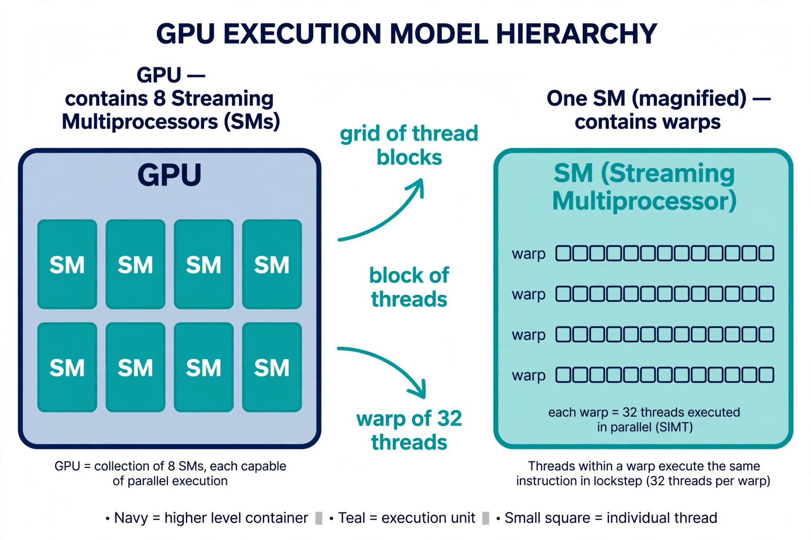
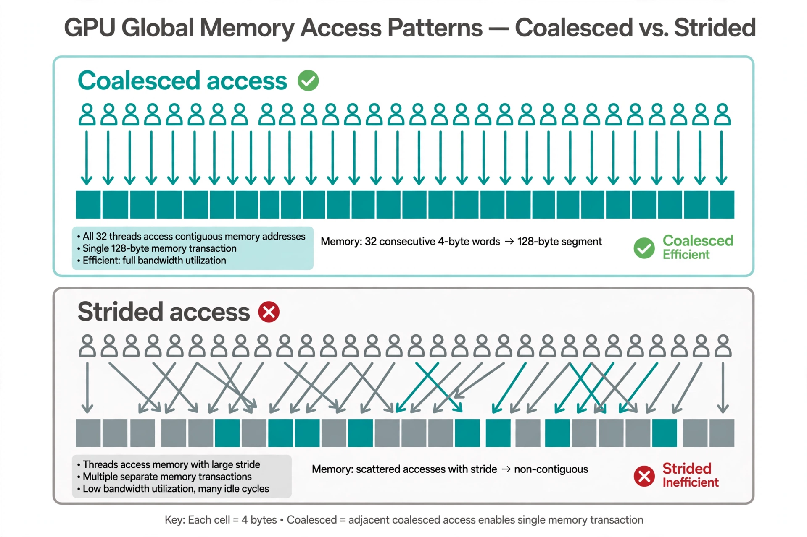
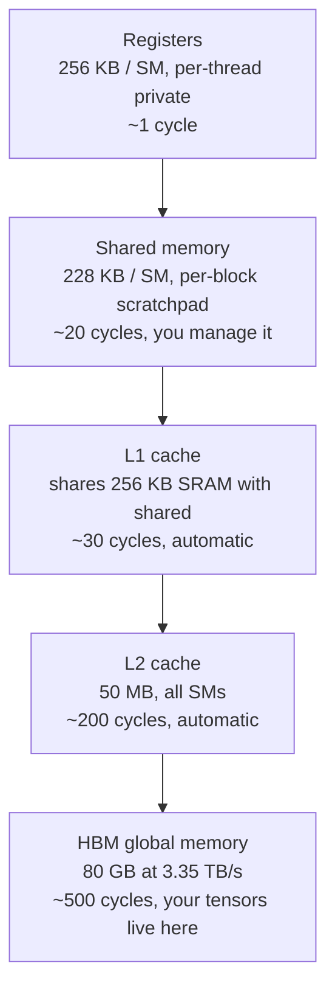
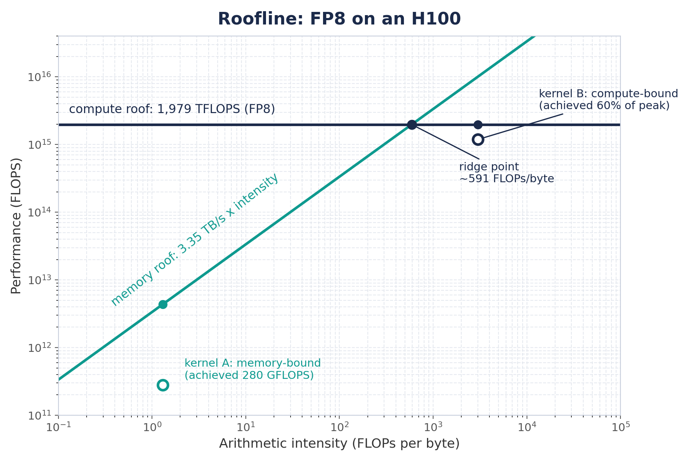
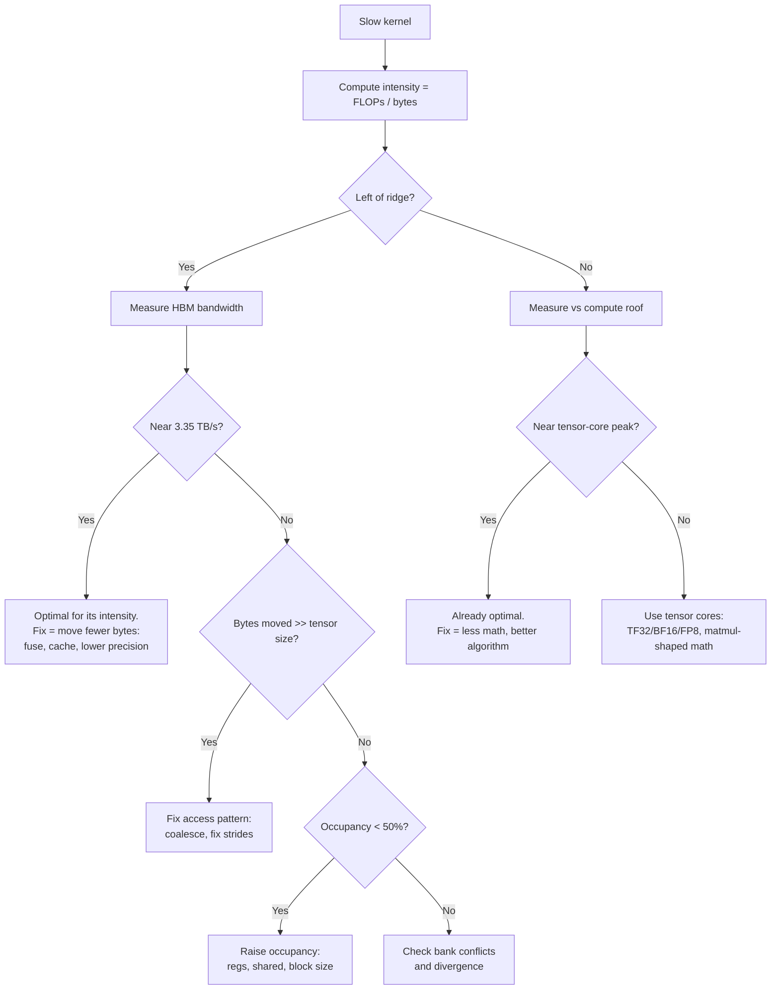
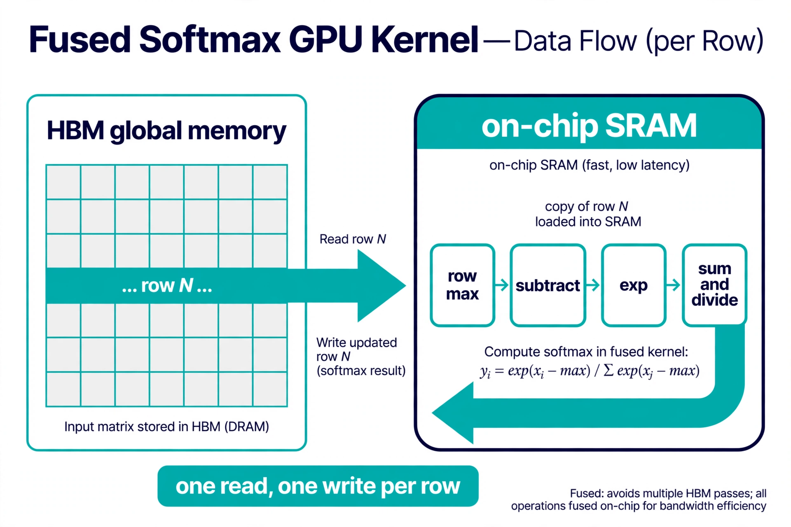
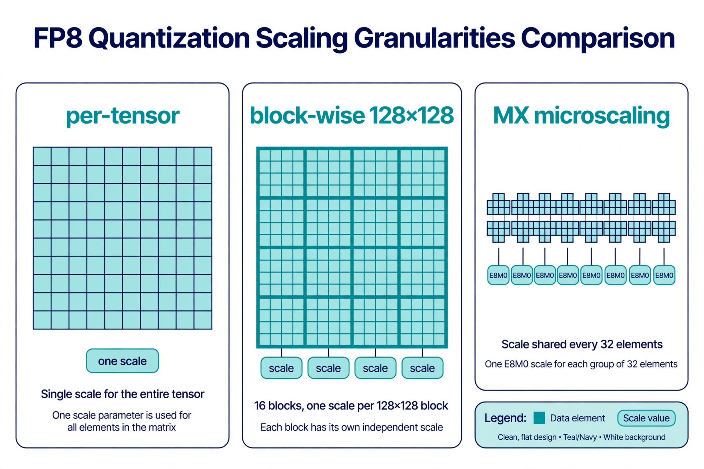
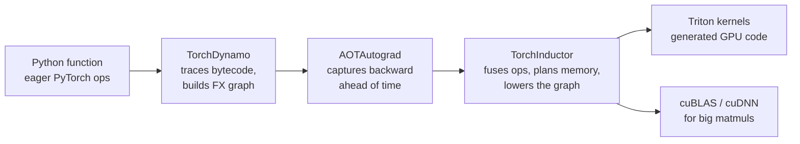

# GPU Architecture and Kernel Programming

Most of a model's training and serving cost lives inside GPU kernels. A matmul that runs at 40 percent of peak and one that runs at 90 percent differ by nothing except how well the kernel fits the hardware. This volume teaches you to think the way the hardware thinks.

You will learn the execution model first: threads, warps, blocks, and the SMs that run them. Then the memory hierarchy, where most performance is won or lost. Then occupancy and latency hiding, the reason GPUs tolerate slow memory at all. Then a diagnosis method built on the roofline model: given a slow kernel, you will know the suspects in order and how to confirm each one. Then you will write a real Triton kernel from scratch and verify it on CPU. Then FP8 microscaling, the precision format behind modern training. Finally torch.compile and 2:4 sparsity, the two compiler-level tools that get you most of the way without hand-written kernels.

Everything here runs on the mental model of real hardware. The numbers in the worked examples come from the H100 and B200, the two GPUs that define the current era. Labs are written in plain Python and run on CPU, so you can build the mental model before you ever touch a GPU.

## Chapter 1. The GPU execution model: threads, warps, blocks, SMs

### What it is

A GPU is a chip full of identical workers called %%streaming multiprocessors%%, or SMs. An H100 SXM has 132 of them. Each SM is an independent core that runs thousands of lightweight %%threads%%. You write one program, called a kernel. The GPU launches millions of copies of it, one per thread, each working on different data.

Threads are organized in a strict hierarchy. The smallest unit is the thread. 32 threads form a %%warp%%. Threads are grouped into %%thread blocks%% (often just "blocks"), and all blocks together form the %%grid%%. This hierarchy is not a suggestion. It is how the hardware schedules work.

### Why it exists

CPUs hide complexity behind a few fast cores and clever caches. GPUs take the opposite bet: make the cores simple and small, then stamp out thousands of them. One H100 SM has 128 simple FP32 cores. With 132 SMs, that is 16,896 cores on one chip. No single core is fast. Together they are.

The warp is the key idea. The SM does not schedule individual threads. It schedules warps, groups of exactly 32 threads that execute the same instruction at the same time. If you write `y[i] = x[i] * 2`, all 32 threads in a warp run that multiply in the same clock cycle, each on its own data. This is called SIMT: single instruction, multiple threads.

### How it works under the hood

When you launch a kernel, you choose a grid of blocks and a block size. The hardware assigns whole blocks to SMs. A block never splits across two SMs. Once assigned, the SM breaks the block's threads into warps and hands warps to its %%warp schedulers%%. An H100 SM has 4 warp schedulers. Each scheduler can issue one instruction per cycle to a ready warp.

Blocks stay on their SM until every thread in the block finishes. The SM can hold several blocks at once, up to its resource limits. When one block finishes, a new one takes its place. This is why you launch far more blocks than SMs: the excess blocks are a queue that keeps every SM fed.

A warp executes in lockstep. If threads in a warp take different branches of an `if`, the warp cannot do both at once. It runs the `if` branch with the taken threads active, then the `else` branch with the others active, while the rest wait. This is %%warp divergence%%, and it costs you the cycles the idle threads burn. Keep branches uniform inside a warp whenever you can.



*Figure 1.1. The thread hierarchy and where it runs. Work the levels from left to right. Your kernel launch defines the grid. The hardware assigns blocks to SMs. Each SM runs its warps 32 threads at a time.*

::: walkthrough
1. **Left edge: the launch.** You pick the grid (how many blocks) and the block size (threads per block). This is the only part you control.
2. **Grid to SMs.** The hardware scheduler hands whole blocks to SMs. Blocks are the unit of assignment. A 132-SM H100 wants thousands of blocks, never 132.
3. **Block to warps.** Inside one SM, the block's threads are cut into warps of 32. A 256-thread block becomes 8 warps. The warp is the unit of execution.
4. **Warps to schedulers.** The SM's 4 warp schedulers pick ready warps each cycle and issue one instruction per warp. When a warp stalls on memory, the scheduler picks a different warp. That swap is free, and it is the whole secret of Chapter 3.
:::

### Worked example: mapping a vector add onto an H100

Take a vector of 1,048,576 float32 elements. You launch one thread per element with 256 threads per block.

- Blocks needed: 1,048,576 / 256 = 4,096 blocks.
- Warps per block: 256 / 32 = 8 warps.
- Total warps: 4,096 × 8 = 32,768 warps.

The H100 has 132 SMs. A 256-thread block uses 256 of the 2,048 threads an SM can hold, so each SM can host 2,048 / 256 = 8 blocks at once. That is 132 × 8 = 1,056 blocks resident at a time. Your 4,096 blocks arrive in waves: 4,096 / 1,056 = 3.88, so roughly 4 waves. Every SM stays busy until the last wave drains.

Now change the block size to 32 threads (1 warp). Each SM could then host 2,048 / 32 = 64 blocks, but the hardware caps blocks per SM at 32. You would get only 32 warps per SM instead of 64, and Chapter 3 will show why that hurts. The lesson: block size is a real performance knob, not a style choice.

### Common misunderstanding

"The GPU runs all my threads at the same time." It does not. An H100 has 16,896 FP32 cores but can keep 270,336 threads in flight (132 SMs × 2,048). Most of those threads are waiting, not computing: waiting for memory, waiting for their warp's turn, waiting for a barrier. The GPU's trick is not running everything at once. It is having so much work ready that there is always something to run.

::: lab Lab 1.1: Simulate warp lockstep on CPU
This lab shows why warp divergence costs cycles. No GPU needed.

```python
# lab11_warp.py - a toy warp simulator. Run it with plain Python.
# WHAT it does: models one warp of 32 threads running a tiny program
# with an if/else. It counts "cycles" under two rules:
#   (1) lockstep: both branches execute, masked threads idle
#   (2) fantasy: each thread runs only its own branch (what CPUs do)
# WHY this matters: the gap between (1) and (2) IS the divergence cost.

def run_warp(branch_taken):
    # branch_taken: list of 32 bools, one per thread.
    # True  -> thread takes the if-branch (cost: 4 cycles of work)
    # False -> thread takes the else-branch (cost: 4 cycles of work)
    n = len(branch_taken)
    assert n == 32, "a warp is exactly 32 threads; change this and the model is wrong"

    # Lockstep rule: the warp executes the if-branch for everyone,
    # then the else-branch for everyone. Threads on the wrong side idle.
    # Cost = cost(if) + cost(else) whenever BOTH sides are taken.
    if_taken = any(branch_taken)
    else_taken = any(not b for b in branch_taken)
    lockstep_cycles = 4 * if_taken + 4 * else_taken

    # Fantasy rule: every thread pays only for its own branch.
    fantasy_cycles = 4  # each thread does 4 cycles of its own work

    return lockstep_cycles, fantasy_cycles

# Case A: uniform branch. All 32 threads agree.
uni = [True] * 32
# Case B: divergent branch. 16 threads go each way (worst common case).
div = [True] * 16 + [False] * 16

for name, mask in [("uniform", uni), ("divergent", div)]:
    real, fantasy = run_warp(mask)
    print(f"{name:9s}: lockstep={real} cycles, per-thread={fantasy} cycles, "
          f"waste={(real - fantasy) / real:.0%}")
    # uniform  -> lockstep=4 cycles, waste 0%
    # divergent-> lockstep=8 cycles, waste 50%
# WHAT BREAKS if changed: set the branch costs unequal (e.g. 4 vs 12) and
# rerun. Divergence now costs 12+4=16 cycles for 4 cycles of useful work
# per thread. Long divergent branches are the expensive kind.
```

Try it: make only thread 0 diverge (`[False] + [True]*31`). One rebel thread still forces the whole warp through both branches. That single thread costs 31 idle lanes.
:::

::: takeaway
- The hierarchy is grid → block → warp (32 threads) → thread. Blocks go to SMs. Warps are what the SM actually schedules.
- An H100 SM holds up to 2,048 threads (64 warps) and has 4 warp schedulers that swap warps for free.
- Launch thousands of blocks, not dozens. Excess blocks are the queue that keeps SMs fed.
- A warp executes in lockstep. Divergent branches inside a warp serialize and burn idle cycles.
:::

## Chapter 2. The memory hierarchy: registers, shared, L1, L2, HBM

### What it is

A GPU thread can reach five kinds of memory, stacked by speed and size. From fastest to slowest on an H100:

| Level | Size (H100) | Who controls it | Speed feeling |
|-------|-------------|-----------------|---------------|
| Registers | 256 KB per SM (65,536 × 4 bytes), private per thread | Compiler | ~1 cycle |
| Shared memory | 228 KB per SM, shared inside a block | You, the programmer | ~20-30 cycles |
| L1 cache | Shares 256 KB SRAM with shared memory per SM | Hardware | ~30 cycles |
| L2 cache | 50 MB, shared by all SMs | Hardware | ~200 cycles |
| HBM (global memory) | 80 GB at 3.35 TB/s | You allocate it | ~400-800 cycles |

Registers hold one thread's private variables. Shared memory is a scratchpad that all threads in a block can read and write, and it is the only fast way for threads to talk to each other. L1 and L2 are automatic caches. HBM is the big slow pool where your tensors live. The B200 keeps the same stack with bigger numbers: 180 GB HBM at 8 TB/s and 126 MB L2.

### Why it exists

Arithmetic is cheap. Moving data is not. An H100 can do 1,979 trillion FP8 operations per second but can only read 3.35 TB per second from HBM. That is roughly 591 operations per byte moved. If your kernel moves a byte and does one operation with it, the tensor cores sit idle 99.8 percent of the time. Every fast kernel is, at heart, a data-movement plan that keeps the fast small memories fed from the slow big one.

### How it works under the hood

**Coalescing: how warps read HBM.** Global memory moves in chunks, not bytes. When a warp of 32 threads reads memory, the hardware groups the requests into 32-, 64-, or 128-byte %%segments%%. If thread `t` reads element `t` of a float32 array, the 32 threads touch bytes 0 to 127: exactly one 128-byte segment, one transaction, zero waste. If thread `t` reads element `32*t` instead, each thread lands in a different 128-byte segment. The hardware issues 32 transactions of 128 bytes to deliver 128 useful bytes: 4,096 bytes moved, 32x waste. The rule is simple. Neighbor threads should touch neighbor addresses.

**Shared memory banks.** Shared memory is split into 32 %%banks%%, each 4 bytes wide. Successive 4-byte words live in successive banks: word `i` sits in bank `i mod 32`. In one cycle the hardware can serve one request per bank. If the 32 threads of a warp hit 32 different banks, all 32 reads finish in one cycle. If several threads hit the same bank, those requests %%serialize%%: a 32-way %%bank conflict%% takes 32 cycles instead of 1. Thread `t` reading word `t` is perfect (banks 0-31). Thread `t` reading word `32*t` is the worst case (all bank 0).

**The L1/shared carve-out.** The 256 KB of SRAM per SM is split between programmer-controlled shared memory and the automatic L1 cache. You choose the split at launch. A kernel that stages tiles in shared memory wants a big shared carve-out. A kernel with irregular access wants more L1.



*Figure 2.1. One warp, 32 threads, reading float32 values. Top: each thread reads the next element, so 32 requests merge into one 128-byte transaction. Bottom: each thread strides 32 elements, so the same 32 reads need 32 separate transactions and move 32x the data.*

::: walkthrough
1. **Top row, thread order.** Threads are numbered 0 to 31 left to right. In both panels the threads are identical. Only the addresses change.
2. **Top row, addresses.** Thread `t` reads element `t`. Bytes 0-127 are contiguous, so the hardware issues one 128-byte segment. All 128 bytes are useful.
3. **Bottom row, addresses.** Thread `t` reads element `32*t`. The touched bytes are 0, 128, 256, ... Each sits in its own 128-byte segment. The hardware issues 32 transactions.
4. **The cost.** Useful data is 128 bytes in both cases. Moved data is 128 bytes on top, 4,096 bytes below. Same code shape, 32x the traffic.
:::



*Figure 2.2. The H100 memory stack. Latency grows about 500x from registers to HBM while capacity grows about 300,000x. Fast kernels move data up this stack once and reuse it many times before it falls back down.*

::: walkthrough
1. **Top to bottom is slow and big.** Each step down multiplies latency and capacity. The register file is tiny and instant. HBM is vast and takes hundreds of cycles.
2. **The two boxes you control.** Registers are assigned by the compiler, but your code's variable count decides how many each thread needs. Shared memory is fully yours: you stage tiles there and decide the layout, which is where bank conflicts are born.
3. **The two boxes the hardware controls.** L1 and L2 are automatic. You cannot address them directly, but you benefit when your access pattern reuses data.
4. **The traffic rule.** Data only moves between adjacent levels. A register can never read HBM directly. Every load climbs the whole stack, so a cache miss at every level is the slowest possible path.
:::

### Worked example: the true cost of a strided read

A kernel reads one float32 per thread. The warp has 32 threads.

Coalesced pattern, thread `t` reads element `t`:
- Bytes touched: 32 × 4 = 128, contiguous and 128-byte aligned.
- Transactions: 1 × 128 bytes.
- Efficiency: 128 / 128 = 100 percent.

Strided pattern, thread `t` reads element `32*t`:
- Bytes touched: still 128 useful bytes, but spread across 32 segments.
- Transactions: 32 × 128 bytes = 4,096 bytes moved.
- Efficiency: 128 / 4,096 = 3.1 percent.

Now scale it: a kernel reading 1 GB of useful data with that stride pattern actually moves 32 GB across the HBM bus. At 3.35 TB/s that is 9.6 ms of pure waste. Fix the pattern and the same kernel moves 1 GB in 0.3 ms. Nothing about the arithmetic changed.

Bank conflict arithmetic, thread `t` reads shared word `32*t + 1`:
- Word `32*t + 1` lives in bank `(32*t + 1) mod 32 = 1` for every `t`.
- All 32 threads hit bank 1: a 32-way conflict, 32 cycles.
- Fix: read word `t` instead. Banks become `t mod 32`, all distinct, 1 cycle. A one-character-class fix worth 32x on that access.

### Common misunderstanding

"Shared memory is just a faster global memory." It is not. It is a different contract. Global memory is big, coherent, and slow, and every thread in the grid can see it. Shared memory is small, block-private, and fast, but you manage it by hand: you load tiles in, you synchronize the block, you compute, you write results out. Forgetting the synchronization step is the classic bug. Threads in a block do not arrive together, so reading a tile before every thread finished writing it reads garbage. The barrier is part of the pattern, not optional.

::: lab Lab 2.1: A memory-traffic calculator
Predict HBM traffic for an access pattern before running anything. CPU only.

```python
# lab21_traffic.py - estimate HBM bytes moved for a warp's read pattern.
# WHAT it does: given 32 byte-addresses (one per thread), it groups them
# into 128-byte segments, the way the hardware does, and reports the
# number of transactions and the waste factor.
# WHY this matters: this is the exact arithmetic behind Figure 2.1.
# If you can predict the waste here, you can spot it in real kernels.

SEGMENT = 128  # hardware transaction size in bytes

def warp_traffic(addresses):
    # addresses: 32 ints, the byte address each thread reads.
    # Returns (transactions, useful_bytes, waste_factor).
    assert len(addresses) == 32, "model one warp: exactly 32 threads"
    segments = {a // SEGMENT for a in addresses}
    moved = len(segments) * SEGMENT
    useful = 32 * 4  # 32 threads x float32
    return len(segments), moved, moved / useful

# Pattern 1: coalesced. Thread t reads float t (bytes 4t .. 4t+3).
coalesced = [4 * t for t in range(32)]
# Pattern 2: strided. Thread t reads float 32*t.
strided = [4 * 32 * t for t in range(32)]

for name, pat in [("coalesced", coalesced), ("strided", strided)]:
    n, moved, waste = warp_traffic(pat)
    print(f"{name:9s}: {n:2d} transactions, {moved:5d} bytes moved, "
          f"waste {waste:.1f}x")
    # coalesced:  1 transactions,   128 bytes moved, waste 1.0x
    # strided  : 32 transactions,  4096 bytes moved, waste 32.0x

# WHAT BREAKS if changed: set SEGMENT = 32. The strided pattern now needs
# 32 transactions of 32 bytes = 1024 bytes, waste 8x. Real hardware uses
# 128-byte segments for full warps, so 32 is the wrong model. The segment
# size is not a tuning knob; it is a hardware fact you must match.
```

Next, extend it: model bank conflicts the same way. Map each thread's shared-memory word index `w` to bank `w % 32`, count the largest group sharing a bank, and report the serialization factor. The strided pattern above gives 32.
:::

::: takeaway
- Five levels: registers, shared, L1, L2, HBM. You control the first two. Traffic only flows between neighbors.
- Coalescing rule: neighbor threads touch neighbor addresses, or you pay up to 32x in wasted HBM traffic.
- Bank rule: shared word `i` lives in bank `i mod 32`. One bank per thread per cycle, or accesses serialize.
- Shared memory needs a block-wide barrier between "load the tile" and "use the tile". The barrier is the pattern.
:::

## Chapter 3. Occupancy and latency hiding

### What it is

%%Occupancy%% is the fraction of an SM's warp slots that hold live warps. An H100 SM can host 64 warps. If your kernel keeps 32 warps resident on each SM, occupancy is 50 percent. It is a capacity number, not a speed number, and it matters for one reason: the GPU hides memory latency by swapping warps.

An HBM read takes ~500 cycles. A warp that issues a load then waits would waste 500 cycles doing nothing. Instead the warp scheduler parks that warp and runs a different one instantly. Swapping warps costs zero cycles: every warp's registers stay live on the SM, so the scheduler just picks another program counter. With enough warps ready, the SM always has work while loads fly. That is %%latency hiding%%, and occupancy is its fuel.

### Why it exists

Chapter 1 showed the SM's raw parallelism. Chapter 2 showed memory is 500x slower than registers. Put them together and you get a paradox: the fastest chip in the world spends most of its time waiting for data. The architects' answer was not faster memory. It was more threads than execution units, so waiting is always someone else's turn to compute. Occupancy measures whether you gave the scheduler enough someones.

### How it works under the hood

Three resources cap how many warps fit on an SM:

1. **Registers.** 65,536 32-bit registers per SM, shared by all resident threads. A kernel using 64 registers per thread with 1,024-thread blocks needs 65,536 registers per block: exactly 1 block fits, 32 warps, 50 percent occupancy. Drop to 32 registers per thread and 2 blocks fit: 64 warps, 100 percent. Register count is the most common occupancy limiter, and it is set by your code's variable pressure.
2. **Shared memory.** 228 KB per SM. A block using 96 KB of shared memory allows 2 blocks per SM. Big tiles buy reuse but cost occupancy. This is the central trade of kernel design.
3. **Thread and block caps.** 2,048 threads and 32 blocks per SM, hard ceilings. A 64-thread block can never pass 32 × 64 = 2,048 threads. That is fine. But a 32-thread block caps at 32 × 32 = 1,024 threads: 50 percent occupancy no matter what. Tiny blocks waste warp slots.

The scheduler needs roughly enough ready warps to cover the latency of the slowest operation. Rule of thumb on Hopper: 4+ warps per scheduler (16+ per SM, ~25 percent occupancy) often hides arithmetic latency, but hiding full HBM latency wants far more. When a profiler reports low occupancy AND high memory stalls, raising occupancy is usually the fix. When occupancy is high and the kernel is still slow, the bottleneck is elsewhere: Chapter 4.

```
Time →

Warp 0:  [LOAD........waiting........][MATH][MATH]
Warp 1:        [LOAD........waiting........][MATH]
Warp 2:              [LOAD.....waiting.....][MATH]
Warp 3:                    [LOAD...waiting..][MATH]
SM busy: ████████████████████████████████████████  (always some warp computing)

With 1 warp per SM:

Warp 0:  [LOAD........waiting........][MATH]
SM busy: ████░░░░░░░░░░░░░░░░░░░░░░░░░░████░░░░░░  (mostly idle)
```

*Figure 3.1. Four warps hide one load's latency; one warp cannot. Each warp's 500-cycle wait overlaps another warp's math. The SM stays busy only if the scheduler has somewhere to go.*

::: walkthrough
1. **Read the top half left to right.** Warp 0 issues a load, then waits ~500 cycles. Instead of idling, the scheduler runs warp 1's math, then warp 2's, then warp 3's.
2. **Watch the bottom "SM busy" bar.** It never gaps, because whenever one warp waits, another computes. Latency is hidden, not reduced: every load still takes 500 cycles.
3. **Read the bottom half.** With a single resident warp, the wait has nowhere to go. The SM idles through every load. Same code, same hardware, far less throughput.
4. **The takeaway in one line.** Occupancy does not make any thread faster. It gives waiting threads somewhere to hide.
:::

### Worked example: three limits, one occupancy number

A kernel launches 256-thread blocks. Each thread uses 48 registers. Each block uses 48 KB of shared memory. H100 limits: 65,536 registers, 228 KB shared, 2,048 threads per SM.

- **Register limit:** 65,536 / (256 × 48) = 5.33, so 5 blocks. That is 5 × 8 = 40 warps.
- **Shared memory limit:** 228 / 48 = 4.75, so 4 blocks. That is 4 × 8 = 32 warps.
- **Thread limit:** 2,048 / 256 = 8 blocks. Not binding.

Shared memory binds first: 4 blocks, 32 warps, 32/64 = **50 percent occupancy**.

Now shrink the tile to 32 KB of shared per block: 228 / 32 = 7.1, so 7 blocks by shared memory, but registers still cap at 5 blocks. New occupancy: 40 warps = **62.5 percent**. The shared-memory cut bought 12.5 points of occupancy. Whether that helps depends on whether the smaller tile still reuses data well: the eternal trade.

Push further: could this kernel ever reach 100 percent? Registers cap it at 5 blocks (40 warps). To hit 64 warps it needs 8 blocks of 256 threads, which needs ≤ 32 registers per thread (65,536 / 2,048). If the compiler can be coaxed under 32 registers per thread, shared memory at 32 KB allows 7 blocks, threads allow 8, so 7 blocks = 56 warps = 87.5 percent. The math tells you exactly which knob to turn.

### Common misunderstanding

"Maximize occupancy and the kernel will be fast." Occupancy is a ceiling on latency hiding, not a performance score. A kernel at 100 percent occupancy doing wasteful strided reads (Chapter 2) still moves 32x the data. A kernel at 25 percent occupancy that is compute-bound on tensor cores can still run near peak, because arithmetic has short latency and needs little hiding. Raise occupancy when the profiler shows memory stalls with idle warp slots. Otherwise you are optimizing a number, not the kernel.

::: lab Lab 3.1: Occupancy calculator
Compute occupancy from resource usage, like the worked example. CPU only.

```python
# lab31_occupancy.py - H100 occupancy from three resource limits.
# WHAT it does: for a given block config, applies each hardware cap and
# reports the binding limit and the resulting occupancy.
# WHY this matters: it turns "try a bigger block" into arithmetic you can
# do before compiling anything.

# H100 (SXM) per-SM hardware caps. These are silicon facts, not tunables.
REGS_PER_SM = 65536      # 32-bit registers
SMEM_PER_SM_KB = 228     # KB of shared memory
THREADS_PER_SM = 2048    # = 64 warps
BLOCKS_PER_SM = 32       # hard cap on resident blocks
WARPS_PER_SM = 64

def occupancy(threads_per_block, regs_per_thread, smem_per_block_kb):
    # All three limits, in units of blocks. Floor each: a partial block
    # cannot launch, so fractional blocks are wasted capacity.
    by_regs = REGS_PER_SM // (threads_per_block * regs_per_thread)
    by_smem = SMEM_PER_SM_KB // smem_per_block_kb
    by_threads = THREADS_PER_SM // threads_per_block
    by_blocks = BLOCKS_PER_SM
    blocks = min(by_regs, by_smem, by_threads, by_blocks)
    warps = blocks * (threads_per_block // 32)
    occ = warps / WARPS_PER_SM
    limits = {"registers": by_regs, "shared_mem": by_smem,
              "threads": by_threads, "blocks": by_blocks}
    binding = min(limits, key=limits.get)  # the smallest cap binds first
    return {"blocks": blocks, "warps": warps, "occupancy": occ,
            "binding_limit": binding, "all_limits": limits}

# The worked example: 256 threads, 48 regs/thread, 48 KB shared.
r = occupancy(256, 48, 48)
print(r)
# blocks=4, warps=32, occupancy=0.5, binding_limit='shared_mem'

# WHAT BREAKS if changed: pass smem_per_block_kb=0 and watch the
# ZeroDivisionError. A kernel that uses no shared memory is limited by
# the other caps; model that as a very large number, not zero, or guard
# the division. Hardware limits are floors and ceilings, never zeros.
```

Experiment: fix 256 threads and 32 KB shared, then sweep registers per thread over 24, 32, 40, 48, 64. Plot occupancy. You will see it fall in steps, not smoothly, because blocks are indivisible.
:::

::: takeaway
- Occupancy = resident warps / 64 per SM. It fuels latency hiding: free warp swaps cover 500-cycle HBM waits.
- Three caps bind it: registers (65,536/SM), shared memory (228 KB/SM), threads (2,048/SM). Compute all three; the smallest wins.
- Small blocks (≤ 64 threads) can cap occupancy through the 32-blocks-per-SM ceiling.
- High occupancy is necessary for memory-bound kernels and irrelevant for compute-bound ones. Check the bottleneck first.
:::

## Chapter 4. Performance diagnosis: the roofline and the suspect list

### What it is

The %%roofline model%% is a two-line chart that tells you what kind of slow your kernel is. The x-axis is %%arithmetic intensity%%: FLOPs done per byte moved. The y-axis is achieved performance in FLOPS. Two roofs cap it: the slanted memory roof (bandwidth × intensity) and the flat compute roof (peak FLOPS). Your kernel lives under the lower of the two. Where it sits decides everything about how you fix it.



*Figure 4.1. The roofline for FP8 on an H100. Left of the ridge point, bandwidth caps you. Right of it, tensor cores cap you. Your first job with any slow kernel is to find which side it is on.*

::: walkthrough
1. **The two roofs.** The diagonal line is the memory roof: performance = 3.35 TB/s × intensity. The flat line is the compute roof: 1,979 TFLOPS for FP8. A kernel can never rise above either.
2. **The ridge point.** Where the roofs meet. For H100 FP8: 1,979e12 / 3.35e12 ≈ 591 FLOPs per byte. Below 591 you are memory-bound by physics, not by skill. No kernel with intensity 10 can beat 33.5 TFLOPS here.
3. **The two dots.** The memory-bound dot sits on the diagonal: its limit is bytes, so the fix is moving fewer bytes. The compute-bound dot sits on the flat roof: its limit is math, so the fix is better tensor-core use or less math.
4. **How to read your own kernel.** Compute its intensity (FLOPs / bytes), find it on the x-axis, and look up. The gap between the dot and the roof above it is your headroom. The side of the ridge it sits on names your suspects.
:::

### Why it exists

Without the roofline, kernel optimization is guessing. People raise occupancy on compute-bound kernels, or fuse arithmetic into memory-bound ones and wonder why nothing moves. The roofline replaces vibes with a number: intensity, measured or computed, places the kernel on the chart, and the chart hands you an ordered suspect list. Diagnosis before surgery.

### How it works under the hood

Given a slow kernel, work the suspects in this order. Each has a confirmation test: a measurement or a calculation that proves guilt before you change code.

**Suspect 1: memory-bound by intensity.** Compute FLOPs and bytes. If intensity sits left of the ridge, the kernel cannot beat bandwidth × intensity, full stop. Confirmation: measure achieved HBM bandwidth (bytes moved / time). If it is near the 3.35 TB/s peak, the kernel is already optimal for its intensity. The only fix is algorithmic: move fewer bytes (fusion, better caching, lower precision).

**Suspect 2: uncoalesced or strided access.** The kernel moves far more bytes than the math needs. Confirmation: bytes moved >> tensor sizes suggest. A vector kernel touching 4 GB to process 1 GB of data has a 4x waste pattern. Fix the pattern (Chapter 2) before anything else.

**Suspect 3: low occupancy with memory stalls.** Plenty of warp slots sit empty while loads wait. Confirmation: occupancy well under 50 percent while the kernel is left of the ridge. Fix per Chapter 3: cut registers, shrink shared tiles, grow blocks.

**Suspect 4: bank conflicts in shared memory.** The kernel stages tiles but serializes on banks. Confirmation: shared-memory throughput far below peak with high shared usage; or compute the access pattern by hand as in Chapter 2. Fix the layout: pad or permute indices.

**Suspect 5: warp divergence.** Branches split warps on the hot path. Confirmation: instruction count far above the arithmetic suggests, with data-dependent branches inside. Fix: restructure so warps decide uniformly, or hoist the branch out of the loop.

**Suspect 6: launch overhead and tiny problems.** The kernel does microseconds of work. Confirmation: total runtime barely changes when you 10x the problem size; the timeline shows gaps between short kernels. Fix: fuse kernels (Chapter 7), batch work, or use CUDA graphs to collapse launches. Small kernels are latency-bound, and the roofline does not model latency: it assumes large problems.

**Suspect 7: wrong precision for the hardware.** FP32 arithmetic on tensor-core-shaped math. Confirmation: the kernel is right of the ridge but far under the compute roof. Fix: move the math to tensor cores (TF32/BF16/FP8) or restructure into matrix-multiply-shaped work.



*Figure 4.2. The diagnosis flowchart. Intensity first, always. It splits the world into "move fewer bytes" and "do math better", and each branch orders its suspects by how often they are guilty.*

::: walkthrough
1. **Start at intensity.** One number splits every case. Do not profile first. Compute FLOPs over bytes from the algorithm.
2. **Left branch: memory-bound.** Check bandwidth first: near peak means the code is fine and the algorithm must change. Below peak means the code wastes traffic: check the access pattern, then occupancy, then banks and divergence, in that order.
3. **Right branch: compute-bound.** Compare against the tensor-core roof for your precision. Near it means the math itself must shrink. Far below it means you are not on tensor cores yet.
4. **The escape hatch.** If the problem is tiny, none of this applies. The roofline assumes big problems; small ones are latency-bound and want fusion or batching.
:::

### Worked example: two kernels, two verdicts

**Kernel A: FP32 vector add, `z = x + y`, 1,048,576 elements.**
FLOPs = 1 per element (one add). Bytes = 3 arrays × 4 bytes = 12 per element. Intensity = 1/12 ≈ 0.083 FLOPs/byte. Far left of the ridge (591). Memory roof predicts 3.35e12 × 0.083 ≈ 279 GFLOPS. If measured runtime moves ~12.6 MB in ~45 µs, bandwidth = 12.6 MB / 45 µs ≈ 280 GB/s: only 8 percent of peak. Verdict: suspect 2 or 3. Check the access pattern first.

**Kernel B: FP8 GEMM, 4096×4096×4096.** FLOPs = 2 × 4096³ ≈ 1.37e11. Bytes = 3 matrices × 4096² × 1 byte ≈ 5.03e7. Intensity ≈ 2,731 FLOPs/byte. Right of the ridge. Compute roof = 1,979 TFLOPS. At 60 percent efficiency it runs 1,187 TFLOPS and finishes in 1.37e11 / 1.187e15 ≈ 115 µs. Verdict: compute-bound, suspect 7 if it is far under the roof. Check it is actually issuing tensor-core instructions in FP8.

Same chart, opposite fixes. That is the whole point.

### Common misunderstanding

"The profiler says SM utilization is 90 percent, so the kernel is fine." SM utilization counts warps with work to do, not useful work done. A kernel doing 32x-wasted strided reads can show high utilization: every warp is "busy" issuing doomed loads. Utilization without the roofline is a vanity metric. Intensity tells you what the work is worth; utilization tells you the SM was awake. You need both.

::: lab Lab 4.1: Roofline classifier
Classify kernels from FLOP and byte counts. CPU only.

```python
# lab41_roofline.py - place a kernel on the H100 FP8 roofline.
# WHAT it does: from FLOPs and bytes it computes intensity, the ridge
# point, the predicted ceiling, and which suspect list to open.
# WHY this matters: this is Figure 4.2's first two boxes, as a function
# you can call on any kernel before profiling it.

# H100 SXM hardware roofs (silicon facts).
PEAK_BW = 3.35e12    # bytes/second of HBM bandwidth
PEAK_FP8 = 1979e12   # FP8 tensor-core FLOPS

def diagnose(flops, nbytes, measured_seconds=None):
    # flops: total floating-point ops. nbytes: total HBM bytes moved.
    # measured_seconds: wall time, if you have it (optional).
    intensity = flops / nbytes
    ridge = PEAK_FP8 / PEAK_BW
    ceiling = min(PEAK_BW * intensity, PEAK_FP8)  # the lower roof wins
    side = "memory-bound" if intensity < ridge else "compute-bound"
    out = {
        "intensity": intensity,
        "ridge_point": ridge,
        "side": side,
        "predicted_ceiling_flops": ceiling,
    }
    if measured_seconds:
        achieved = flops / measured_seconds
        out["achieved_flops"] = achieved
        out["fraction_of_ceiling"] = achieved / ceiling
        # Fraction near 1.0 -> optimal for its intensity; fix the algorithm.
        # Fraction far below 1.0 -> a suspect from the chapter is guilty.
    return out

# Kernel A: fp32 vector add, 2^20 elements.
a = diagnose(flops=2**20, nbytes=3 * 4 * 2**20, measured_seconds=45e-6)
print("kernel A:", a["side"], "ceiling %.1f GFLOPS" % (a["predicted_ceiling_flops"] / 1e9),
      "achieved %.1f%%" % (100 * a["fraction_of_ceiling"]))
# memory-bound, ceiling ~279 GFLOPS, achieved ~8% -> suspect 2 or 3

# Kernel B: fp8 GEMM 4096^3 at 115 us.
b = diagnose(flops=2 * 4096**3, nbytes=3 * 4096**2 * 1, measured_seconds=115e-6)
print("kernel B:", b["side"], "ceiling %.0f TFLOPS" % (b["predicted_ceiling_flops"] / 1e12),
      "achieved %.0f%%" % (100 * b["fraction_of_ceiling"]))
# compute-bound, ceiling 1979 TFLOPS, achieved ~60% -> suspect 7 territory

# WHAT BREAKS if changed: pass nbytes as elements instead of bytes
# (forget the x4 for fp32). Intensity inflates 4x and a memory-bound
# kernel looks compute-bound. Units are the diagnosis: FLOPs per BYTE.
```

Try it on a softmax over 4,096 rows of 4,096 fp16. FLOPs are about 5 × 16.8M ≈ 84M (max, sub, exp, sum, div per element). Bytes are 2 × 16.8M × 2 = 67 MB. Intensity ≈ 1.25. Deeply memory-bound: this is exactly why Chapter 5 fuses it.
:::

::: takeaway
- The roofline's two roofs are bandwidth × intensity and peak FLOPS. Intensity = FLOPs / byte places every kernel.
- H100 FP8 ridge point ≈ 591 FLOPs/byte. Left: move fewer bytes. Right: do math better.
- Work suspects in order: bandwidth vs peak, access pattern, occupancy, banks, divergence, launch overhead, precision.
- Utilization without intensity is vanity. A busy SM doing wasted loads is still slow.
:::

## Chapter 5. Writing a Triton kernel from scratch: fused softmax

### What it is

%%Triton%% is a Python-embedded language for writing GPU kernels. You write a Python function, mark it `@triton.jit`, and describe the work at the tile level: load a tile, compute on it, store it back. The Triton compiler turns that into real GPU machine code. It is the vehicle this volume uses for all kernel code, and it is also what `torch.compile` generates under the hood (Chapter 7).

Our kernel computes softmax over each row of a matrix, fused into one pass: one read of each row from HBM, all the math on chip, one write back. Lab 4.1 showed naive softmax has intensity ~1.25 and does five HBM round trips per row (max, subtract, exp, sum, divide). The fused kernel does one round trip. Same math, one fifth the traffic.

### Why it exists

Writing this in CUDA C++ means managing threads, shared memory, barriers, and warp-level primitives by hand: hundreds of lines where one wrong index corrupts memory silently. Triton keeps the performance-critical decisions (tiling, masking, parallelism) and lets the compiler handle the rest. A fused softmax is about 30 lines. You will read every one of them below.

### How it works under the hood

A Triton program launches a grid of %%program instances%%, each a thread block. Inside, you never name a thread. You name tiles: `tl.arange(0, BLOCK)` builds a vector of indices, `tl.load` moves the whole tile at once, and arithmetic applies to the whole tile. The compiler maps tiles to threads, warps, and memory instructions. `tl.constexpr` marks values the compiler must know at compile time (tile sizes), so it can unroll loops and size registers. `tl.program_id(0)` tells each instance which piece of the grid it owns.



*Figure 5.1. The fused softmax data path. One row travels from HBM to on-chip SRAM once, every softmax step happens in registers, and the finished row travels back once. Eager PyTorch would send the row across the bus five times.*

::: walkthrough
1. **Left: the matrix in HBM.** One row is highlighted. In this kernel, one program instance owns one full row. The grid has as many instances as rows.
2. **The wide arrow to SRAM.** The instance loads its entire row into on-chip memory in one vectorized read. Masked-out lanes (past the row end) load as negative infinity.
3. **The four boxes on chip.** Row max, subtract, exp, then sum and divide. Every value stays in registers between boxes. Nothing returns to HBM mid-row.
4. **The wide arrow back.** One vectorized write stores the finished probabilities. Total HBM traffic per row: one read, one write. The eager version pays five round trips for the same math.
:::

### The kernel, line by line

```python
import torch
import triton
import triton.language as tl


@triton.jit
def softmax_kernel(
    x_ptr,               # pointer to the input matrix in HBM
    out_ptr,             # pointer to the output matrix in HBM
    n_cols,              # columns per row; a runtime value, not a constant
    stride_row,          # elements between the starts of consecutive rows
    BLOCK: tl.constexpr, # tile width. Compile-time constant so the compiler
                         # can unroll loops and fix register allocation.
):
    # One program instance (one thread block) owns exactly one row.
    # program_id(0) is this instance's index along grid axis 0.
    row = tl.program_id(0)

    # Column indices 0 .. BLOCK-1 for this row's tile, as a vector.
    # You never write a loop over threads; the tile IS the parallelism.
    cols = tl.arange(0, BLOCK)

    # Rows shorter than BLOCK would read out of bounds. The mask
    # disables those lanes on every load and store below.
    mask = cols < n_cols

    # Load the whole row in one vectorized read. Pointer arithmetic on
    # x_ptr is in ELEMENTS, not bytes; Triton scales by dtype size.
    # other=-inf: masked lanes must not change the answer. exp(-inf)=0
    # adds nothing to the sum, and -inf never wins the max. Filling
    # with 0.0 instead would corrupt both. This one argument is the
    # most common correctness bug in masked kernels.
    x = tl.load(x_ptr + row * stride_row + cols, mask=mask,
                other=float("-inf"))

    # Numerically stable softmax: subtract the row max BEFORE exp, so
    # the largest exponent is exp(0) = 1. Skip this and inputs above
    # ~88 overflow fp32 exp to inf, producing NaNs downstream.
    row_max = tl.max(x, axis=0)
    x = x - row_max
    num = tl.exp(x)
    den = tl.sum(num, axis=0)
    out = num / den

    # Write the finished row back with the same mask. Dropping the mask
    # here writes past the row end and silently corrupts the next row.
    tl.store(out_ptr + row * stride_row + cols, out, mask=mask)
```

::: walkthrough
1. **The signature.** Pointers plus shapes, like C, but `BLOCK: tl.constexpr` is special: its value is baked into the compiled code. Two different BLOCK values compile two different kernels.
2. **`row = tl.program_id(0)`.** This is the only "which work is mine" logic. The launcher (below) creates one instance per row, so the row index falls out directly.
3. **`tl.arange` + mask.** The tile of indices plus a boolean guard. Every memory op in the kernel carries the mask, which is how Triton handles sizes that are not multiples of the tile.
4. **The load.** One line moves up to BLOCK elements from HBM to registers. The `other` fill value is a correctness decision, not a formality.
5. **The math.** Five lines, all on registers. `axis=0` reduces across the tile. This is the entire softmax, and it never touches HBM mid-row.
6. **The store.** One line writes back. The kernel's HBM bill: one read, one write.
:::

The host-side launcher is ordinary Python. It runs on CPU and only enqueues GPU work.

```python
def softmax(x: torch.Tensor) -> torch.Tensor:
    # Host launcher: pure Python, runs on CPU, needs a CUDA device only
    # for the tensors it passes in. All the GPU work is the kernel above.
    assert x.is_cuda and x.is_contiguous()
    # WHY contiguous: the kernel does row_ptr + col_offsets arithmetic,
    # which assumes rows are packed. A transposed view would need its
    # real strides passed in; asserting here turns silent wrong answers
    # into a loud immediate error.
    n_rows, n_cols = x.shape
    out = torch.empty_like(x)

    # BLOCK must be a power of two: tl.arange needs a static tile shape
    # and the compiler vectorizes power-of-two tiles cleanly.
    BLOCK = triton.next_power_of_2(n_cols)

    # num_warps trades intra-row parallelism against idle lanes.
    # Short rows (small BLOCK) want few warps; long rows want more.
    # 4 is a safe default up to 1024-wide tiles.
    num_warps = 4 if BLOCK <= 1024 else 8

    # Grid: one program instance per row. program_id(0) in the kernel
    # reads the instance's position in this 1-D grid.
    grid = (n_rows,)
    softmax_kernel[grid](x, out, n_cols, x.stride(0),
                         BLOCK=BLOCK, num_warps=num_warps)
    return out
```

### Worked example: one row by hand

Row `[1.0, 2.0, 3.0]`, BLOCK=4 (next power of two ≥ 3), so lane 3 is masked.

- Load: `[1.0, 2.0, 3.0, -inf]` (masked lane fills with -inf).
- `row_max` = 3.0. The -inf lane cannot win the max. Correct.
- Subtract: `[-2.0, -1.0, 0.0, -inf]`.
- Exp: `[0.1353, 0.3679, 1.0, 0.0]`. The masked lane contributes exactly 0.
- Sum: 1.5032. Divide: `[0.0900, 0.2447, 0.6652, 0.0]`.
- Store writes 3 lanes (mask drops lane 3). The stored row sums to 1.0.

Now the failure mode, same row, without max-subtraction, inputs shifted by +100: exp(103) overflows fp32 to inf, sum is inf, output is NaN. The five-line stable form exists because the naive three-line form breaks on real data.

### The extension: online softmax for long rows

One tile per row works while the row fits in registers. For rows longer than a tile (long-context attention), loop over tiles and keep a running max and sum, rescaling as the max grows. This is the same online softmax FlashAttention uses to avoid materializing the full attention matrix.

```python
def online_softmax_update(m_old, l_old, tile):
    # Merge one tile into running softmax statistics.
    # m_old: max of all tiles seen so far. l_old: their rescaled sum.
    # Returns (m_new, l_new) covering old tiles + this tile.
    # WHY rescale: exp was computed against the OLD max. When a new
    # larger max appears, old exps must be re-based: exp(x - m_new)
    # = exp(x - m_old) * exp(m_old - m_new). The running sum scales
    # by that factor instead of being recomputed. One pass, no re-read.
    import numpy as np
    tile_max = tile.max()
    m_new = max(m_old, tile_max)
    # Old sum, re-based to the new max, plus this tile's sum re-based.
    l_new = (l_old * np.exp(m_old - m_new)
             + np.exp(tile - m_new).sum())
    return m_new, l_new
    # WHAT BREAKS if you skip the rescaling: the sums from different
    # tiles used different bases and no longer add up. The final
    # division then produces rows that do not sum to 1.
```

### Common misunderstanding

"Triton is Python, so the kernel runs in Python and must be slow." No. `@triton.jit` compiles the function at first launch into GPU machine code (via PTX). Python runs once, at launch time, to enqueue the work. Per element, zero Python executes. The price of that deal: the kernel cannot run without a GPU. The lab below separates the two concerns: it validates the algorithm (masking, -inf fill, max-subtraction) in NumPy on CPU, so the math is proven before hardware enters the picture.

::: lab Lab 5.1: Verify the fused-softmax algorithm on CPU
Port the kernel's algorithm to NumPy, including the mask and the -inf fill, and check it against a reference. No GPU needed. On a GPU box, swap `tiled_softmax` for the Triton launcher above; the checks do not change.

```python
# lab51_softmax.py - CPU verification of the fused softmax algorithm.
# WHAT it does: re-implements the Triton kernel's exact algorithm
# (tile, mask, -inf fill, max-subtract, exp, normalize) in NumPy and
# checks it against an independent reference on adversarial inputs.
# WHY this matters: it proves the ALGORITHM correct - masking, fill
# value, stability - before any GPU is involved. Hardware can only
# change speed, not correctness, once this passes.

import numpy as np

def tiled_softmax(x, BLOCK):
    # NumPy port of softmax_kernel above, one row at a time.
    # x: 2-D float32 array. BLOCK: power-of-two tile width.
    n_rows, n_cols = x.shape
    out = np.empty_like(x)
    for r in range(n_rows):
        cols = np.arange(BLOCK)
        mask = cols < n_cols
        # other=-inf fill, exactly like tl.load(other=float('-inf')).
        row = np.where(mask, np.pad(x[r], (0, BLOCK - n_cols),
                                    constant_values=np.nan)[:BLOCK],
                       -np.inf)
        # From here down: the same five lines as the Triton kernel.
        row_max = row.max()          # -inf lanes cannot win
        row = row - row_max
        num = np.exp(row)            # exp(-inf) = 0, contributes nothing
        den = num.sum()
        out[r] = (num / den)[mask]   # masked store: never write past end
    return out

def ref_softmax(x):
    # Independent reference: no tiles, no masks, just the math.
    x = x - x.max(axis=1, keepdims=True)
    e = np.exp(x)
    return e / e.sum(axis=1, keepdims=True)

rng = np.random.default_rng(0)
# Adversarial inputs: non-power-of-two width (mask path), large values
# (stability path), and a row with a huge outlier (max-subtraction path).
x = (rng.standard_normal((7, 1000)) * 3 + 90).astype(np.float32)
x[3] += 500  # one row dominated by an outlier
x = x.astype(np.float32)

got = tiled_softmax(x, BLOCK=1024)
want = ref_softmax(x)
err = np.abs(got - want).max()
print(f"max abs error vs reference: {err:.3e}")
assert err < 1e-4, "tiled algorithm disagrees with reference"
row_sums = got.sum(axis=1)
print("row sums:", row_sums)
assert np.abs(row_sums - 1).max() < 1e-5, "rows must sum to 1"
print("PASS: tiled softmax matches reference on all adversarial inputs")
# WHAT BREAKS if changed: fill masked lanes with 0.0 instead of -inf.
# The max stays correct here, but exp(0 - max) = exp(-max) > 0 adds a
# phantom term to the sum. Watch the row sums drift above 1.0.
```

Then try the failure drill: delete the `row - row_max` line and rerun. The +90 inputs overflow exp to inf and the assertion fires. That is the bug the five-line form prevents.
:::

::: takeaway
- Triton = Python syntax, tile-level thinking, compiled to GPU machine code. You control tiles, masks, and parallelism; the compiler handles threads.
- One instance per row, `tl.program_id(0)` as the row index, `tl.arange` + mask for the tile. One HBM read, one HBM write.
- `other=-inf` on masked loads is a correctness decision: it keeps the max and the sum clean.
- Stable softmax subtracts the row max before exp. Online softmax extends the same idea across tiles with rescaling.
:::

## Chapter 6. FP8 and block-wise microscaling

### What it is

%%FP8%% is an 8-bit floating-point format. %%microscaling%% is the trick that makes it usable. It pairs every small group of values with its own %%scale factor%%: store `x ≈ x_fp8 × s_block`, where `s_block` stretches the 8-bit range to fit that group's magnitudes. Two FP8 flavors matter:

```
E4M3:   S | EEEE | MMM        1 sign, 4 exponent bits (bias 7),  3 mantissa bits
E5M2:   S | EEEEE | MM        1 sign, 5 exponent bits (bias 15), 2 mantissa bits
```

E4M3 reaches ±448 with no infinities and finer steps. E5M2 reaches ±57,344 with infinities but coarser steps. Same 8 bits, opposite trade: E4M3 buys precision, E5M2 buys range.

A raw 8-bit float cannot hold neural-network values directly. Weights and activations span orders of magnitude, and 448 tops out fast. Microscaling pairs every small group of values with its own %%scale factor%%: store `x ≈ x_fp8 × s_block`, where `s_block` stretches the 8-bit range to fit that group's magnitudes. The scale is the whole game. Per-tensor scaling (one scale for a whole matrix) was the first attempt. Block-wise scaling (one scale per 128 values, or per 128×128 tile) is what made FP8 training actually work.

### Why it exists

HBM traffic halves when values shrink from 16 bits to 8, and tensor-core throughput doubles: an H100 does 1,979 FP8 TFLOPS against 989 BF16. Memory-bound inference gets faster almost for free, and compute-bound training gets twice the math per second. But naive FP8 collapses: one outlier stretches the single per-tensor scale so wide that every normal value rounds to zero. DeepSeek-V3 proved the fix at scale. Fine-grained block-wise quantization with E4M3 on every tensor trained a frontier model in FP8. Relative loss error stayed under 0.25 percent versus BF16.

### How it works under the hood

**The quantization step.** For one block: `scale = max|block| / 448`. Then `q = clip(round(x / scale), -448, 448)`. Dequantize with `x̂ = q × scale`. The rounding error is at most half a code step times the scale, so the error tracks the block's own largest value. A block of small values gets a small scale and keeps its precision. A block with an outlier sacrifices only itself.

**Why blocks beat tensors.** With one scale per tensor, the global max sets every scale. One outlier of 10,000 forces scale = 22.3, and a normal value of 0.5 becomes round(0.022) = 0: erased. With one scale per 128 values, the outlier poisons only its own block. The other blocks quantize against their own maxima and survive. Block-wise scaling quarantines outliers.

**Training recipe (DeepSeek-V3 style).** Activations use 128-element groups, weights use 128×128 blocks, each with an FP32 scale, all in E4M3. Master weights stay in BF16 and are cast to FP8 just before the matmul, so quantization error never accumulates across steps. Sensitive layers (embeddings, the output head, attention softmax) stay in BF16/FP32. Gradients get the same block treatment.

**Inference recipe (microscaling standards).** The OCP MX spec standardizes MXFP8. Every 32 consecutive values share one E8M0 scale: an 8-bit exponent-only value, a pure power of two from 2^-127 to 2^127. Cost: 8 bits per value plus 1 byte per 32 values = 8.25 bits per element. Blackwell adds NVFP4: 4-bit E2M1 values in blocks of 16 with an E4M3 block scale plus one FP32 tensor-wide scale, doubling throughput again over FP8. The pattern is the same at every size: smaller elements, smaller blocks, a scale that restores range.



*Figure 6.1. Three scaling granularities. Per-tensor: one scale for the whole matrix, hostage to the largest outlier. Block-wise 128×128: each tile gets its own FP32 scale, the DeepSeek-V3 layout. MX: every 32 values share one E8M0 power-of-two scale, the OCP standard Blackwell accelerates in hardware.*

::: walkthrough
1. **Left panel: one scale.** The entire matrix shares a single scale box. The scale must cover the global max, so every block's precision is set by the worst outlier anywhere.
2. **Middle panel: a grid of scales.** The matrix is tiled 128×128 and each tile carries its own scale. An outlier in one tile costs precision only in that tile. This is the training recipe.
3. **Right panel: tiny groups.** The row is cut into groups of 32, each with one small E8M0 scale. Finer granularity tracks fast-changing magnitudes (like attention scores) better; the power-of-two scale keeps the hardware cheap.
4. **The trend.** Scales get smaller and more numerous as elements get narrower: per-tensor → 128-blocks → 32-blocks. Each step quarantines outliers more tightly.
:::

### Worked example: quantize one block by hand

Block = [0.5, -3.2, 100.0, -0.01]. (Real blocks hold 128 values; four is enough to see the mechanism.)

- `amax` = 100.0. Scale = 100 / 448 = 0.22321.
- Codes: round(x / 0.22321) = [2, -14, 448, 0]. All inside ±448, no clipping.
- Dequantize: q × 0.22321 = [0.4464, -3.125, 100.0, 0.0].
- Errors: 0.5 becomes 0.4464 (11 percent relative). -3.2 becomes -3.125 (2.3 percent). 100.0 is exact, since it set the scale. -0.01 becomes 0.0: erased, because it is smaller than half a code step.

Now the per-tensor version. Suppose another block in the same tensor holds 10,000. Global scale = 10,000 / 448 = 22.32. Our block's codes become round(x / 22.32) = [0, 0, 4, 0]. The 0.5, -3.2, and -0.01 all vanish; even the 100.0 keeps one significant digit. Block-wise scaling confines that damage to the outlier's own block. That confinement is worth more than any format tweak.

### Common misunderstanding

"FP8 is one format, and picking it is the decision." E4M3 and E5M2 behave differently enough to break training. E4M3 has no infinities: overflow saturates to 448, which silently biases sums. E5M2 has infinities: overflow becomes inf, which poisons everything downstream. The old wisdom was E5M2 for gradients because of range. Block-wise scaling removed the need: with 128-value blocks, E4M3's precision wins everywhere and its range is enough per block. The decision that matters is not the format. It is the block size and where the scales live.

::: lab Lab 6.1: Block-wise FP8 simulator
Quantize a tensor per-tensor and per-block, and measure what the outlier destroys. CPU only.

```python
# lab61_fp8.py - simulate FP8 block-wise quantization in NumPy.
# WHAT it does: quantizes a tensor two ways (one global scale vs one
# scale per block of 128) and reports the fraction of values each way
# erases to zero. Erasure is the visible damage of a too-large scale.

import numpy as np

E4M3_MAX = 448.0  # largest finite E4M3 value; codes saturate here

def quantize(x, block_size):
    # x: 1-D float32 array. block_size: values sharing one scale.
    # block_size = len(x) gives per-tensor scaling (one scale total).
    # Returns (codes, scales): rounded code values and their FP32 scales.
    # NOTE: codes are kept as float32 here to stand in for E4M3 code
    # values, which range over integers in [-448, 448] - wider than int8.
    n_blocks = int(np.ceil(len(x) / block_size))
    # Pad the tail so every block is full; the padding is discarded.
    # WHAT BREAKS without padding: the last partial block would divide
    # by a scale computed over fewer values - still correct, but the
    # reshape below fails. Padding keeps the vectorized path simple.
    padded = np.pad(x, (0, n_blocks * block_size - len(x)))
    blocks = padded.reshape(n_blocks, block_size)
    amax = np.abs(blocks).max(axis=1, keepdims=True)
    # All-zero blocks get scale 1.0: 0 / 1 = 0, no division by zero.
    scale = np.where(amax > 0, amax / E4M3_MAX, 1.0)
    codes = np.clip(np.round(blocks / scale), -E4M3_MAX, E4M3_MAX)
    return codes.reshape(-1)[:len(x)], scale.reshape(-1)

def erased_fraction(x, x_hat):
    # Fraction of meaningfully-sized values (|x| > 0.05) that the
    # quantization rounded to exactly zero. A value that rounds to
    # zero is not noisy, it is gone: this is the damage an outlier's
    # oversized scale does to every normal value sharing its scale.
    big = np.abs(x) > 0.05
    return float((x_hat[big] == 0).mean())

rng = np.random.default_rng(1)
# A weight-like tensor: mostly small values, one huge outlier.
x = (rng.standard_normal(4096) * 0.5).astype(np.float32)
x[1234] = 10000.0

for name, bs in [("per-tensor", len(x)), ("block-128", 128)]:
    codes, scales = quantize(x, bs)
    # Dequantize: x_hat = code * block_scale, the inverse of quantize.
    n_blocks = int(np.ceil(len(x) / bs))
    x_hat = (codes.reshape(n_blocks, bs)
             * scales.reshape(n_blocks, 1)).reshape(-1)[:len(x)]
    print(f"{name:10s}: {n_blocks:4d} scales, "
          f"values erased {erased_fraction(x, x_hat):.1%}")
    # per-tensor:    1 scale,  erased ~100% (one outlier's scale zeroes
    #                            almost every value in the tensor)
    # block-128 :   32 scales, erased ~3%   (only the outlier's own
    #                            block suffers; the rest keep precision)

# WHAT BREAKS if changed: use block_size=1 (one scale per value).
# Error drops to ~0, but you now store a 4-byte scale per 1-byte value:
# 40 bits per element, worse than fp32. Block size trades accuracy for
# scale overhead; 128 and 32 are the standard compromises, not magic.
```

Try block sizes 32 and 1024 as well. Watch the error fall as blocks shrink and the scale count (overhead) rise. That curve is the entire design space of microscaling.
:::

::: takeaway
- FP8 = E4M3 (±448, precise, no infinities) or E5M2 (±57,344, coarse, infinities). The scale matters more than the flavor.
- Quantize per block: scale = max|block| / 448. Error tracks the block's own max, so outliers are quarantined.
- Training (DeepSeek-V3): 128 / 128×128 blocks, FP32 scales, E4M3 everywhere, BF16 master weights, sensitive layers stay high precision. Loss error under 0.25 percent vs BF16.
- Inference: MXFP8 (32 values, one E8M0 power-of-two scale, 8.25 bits/element), NVFP4 on Blackwell (4-bit, blocks of 16). Smaller elements, smaller blocks, same idea.
:::

## Chapter 7. torch.compile and 2:4 sparsity

### What they are

`torch.compile` is PyTorch's compiler. You wrap a function or model in one line, and it rewrites the eager op-by-op execution into fused GPU kernels. Underneath it is a four-stage pipeline. Dynamo captures your Python into a graph. AOTAutograd prepares the backward pass. Inductor optimizes and fuses the graph. Triton generates the actual GPU kernels. Chapter 5 taught you to write Triton by hand. This chapter shows the machine that writes it for you.

%%2:4 sparsity%% is structured sparsity the hardware understands. In every group of 4 consecutive weights, exactly 2 are zero. Ampere and later GPUs have sparse tensor cores that skip those zeros in hardware. That doubles matmul throughput: H100 FP16 goes from 989 to 1,979 TFLOPS with 2:4 sparsity, FP8 from 1,979 to 3,958.

### Why they exist

Eager PyTorch launches one kernel per operation. `y = relu(x @ w + b)` launches three kernels and round-trips the intermediate through HBM twice for no reason. The operations are memory-bound individually and launch-bound collectively. Fusion fixes both at once, and it is mechanical enough that a compiler should do it, which is what Inductor does.

Sparsity exists because dense matmuls hit the compute roof (Chapter 4) and the only way past a roof is less work. Random sparsity cannot use tensor cores, which need dense tiles. The 2:4 pattern is the compromise the hardware team chose: regular enough for the datapath, flexible enough that pruned models keep their accuracy.

### How torch.compile works under the hood



*Figure 7.1. The torch.compile pipeline. Each stage answers a different question: what tensor work exists (Dynamo), what gradient work goes with it (AOTAutograd), how to arrange it (Inductor), what GPU program runs (Triton).*

::: walkthrough
1. **Dynamo.** Runs your Python and records the tensor operations into an FX graph. It stops ("graph break") at things it cannot trace: `print(tensor)`, data-dependent Python `if` on tensor values, exotic control flow. Each break splits compilation into smaller graphs with Python running between them.
2. **AOTAutograd.** Traces the backward pass ahead of time too, so the backward graph gets the same fusion treatment as the forward.
3. **Inductor.** The optimizer. It fuses pointwise ops into producer kernels (bias-add and relu fold into the matmul's epilogue), reuses memory buffers, and picks layouts. For big matmuls it keeps cuBLAS; for everything else it emits Triton.
4. **Triton / libraries.** The generated kernels from Chapter 5's family, written by a compiler instead of by you. First call is slow (tracing plus code generation). Later calls with the same shapes reuse the compiled artifact.
:::

Two rules from the pipeline's design. First, shapes: Dynamo specializes on tensor shapes by default, so a new shape recompiles. Pad or bucket dynamic shapes or pay recompile stalls. Second, graph breaks: every break is a fusion boundary. Code written break-free (tensor ops, static control flow) compiles into far fewer kernels.

### How 2:4 sparsity works under the hood

Take a weight matrix and prune it so every 4 consecutive elements along the contraction dimension hold exactly 2 nonzeros. Store only the 2 values plus 2-bit indices naming their positions. The sparse tensor core reads the compressed tile and skips the zeros in hardware: same result, half the multiply-adds, half the weight traffic.

The pattern is strict. Exactly 2 of 4, consecutive, along K. Random 50-percent sparsity gets nothing: the sparse datapath cannot consume it. Pruning to 2:4 is a real step. It is usually magnitude-based with calibration data, sometimes with a light retrain to recover accuracy. Done carelessly it can cost a point or two of quality. The speedup is real only for GEMM-heavy, compute-bound layers: memory-bound kernels gain little because they were waiting on bytes, not math.

### Worked example: what fusion saves on `relu(x @ w + b)`

Shapes: x is 512×4096, w is 4096×4096, b is 4096, all fp16 (2 bytes).

Eager, three kernels:
- Matmul: reads x (4.19 MB) + w (33.55 MB), writes tmp (4.19 MB) = 41.9 MB.
- Bias add: reads tmp (4.19 MB) + b (0.008 MB), writes tmp2 (4.19 MB) = 8.4 MB.
- ReLU: reads tmp2 (4.19 MB), writes y (4.19 MB) = 8.4 MB.
- Total: 58.7 MB moved, 3 kernel launches.

Fused (bias and relu folded into the matmul epilogue):
- Reads x + w (37.7 MB), writes y (4.19 MB) = 42.0 MB, 1 launch.
- Saved: 16.8 MB of traffic (29 percent) and 2 launches.

The matmul itself is compute-bound and unchanged. The win is entirely in the memory-bound tail: the pointwise ops had intensity ~1 and were pure overhead. Fusion deletes the tail instead of optimizing it.

2:4 compression on w: dense fp16 stores 4 values in 8 bytes. The 2:4 layout stores 2 values (4 bytes) plus two 2-bit indices (0.5 byte). That is 4.5 bytes per group: 44 percent smaller. The sparse tensor core then runs the matmul at 2x the dense rate.

### Common misunderstanding

"`torch.compile` makes everything faster, so wrap the model and move on." Three ways that fails. Graph breaks from data-dependent control flow silently split your model into many small compiled pieces with Python in between. Dynamic shapes recompile every new shape, and the first slow call happens per shape, not once. And compile cannot fix a memory-bound-by-algorithm kernel: if intensity says the algorithm moves too many bytes, fusion trims the constant but the roof stays. Compile is the last 20-30 percent. Chapters 1-6 are the rest.

::: lab Lab 7.1: Fusion savings and the 2:4 pattern, on CPU
Compute the traffic saved by fusion and build a valid 2:4 mask. No GPU needed.

```python
# lab71_fusion.py - two compiler-level wins, as CPU-checkable Python.
# WHAT it does: (1) computes HBM traffic for eager vs fused
# relu(x @ w + b); (2) prunes a weight matrix to the strict 2:4 pattern
# and verifies the structural invariant the hardware requires.
# WHY this matters: (1) is the arithmetic Inductor does when it fuses;
# (2) is the exact pattern sparse tensor cores demand - any deviation
# gets zero speedup, so the checker is the point.

import numpy as np

def traffic_fp16(numel):
    # Helper: bytes for numel fp16 elements. Keeping the dtype math in
    # one place avoids the classic elements-vs-bytes bug from Lab 4.1.
    return numel * 2

def fusion_savings(m, k, n):
    # m, k, n: GEMM dims for y = relu(x @ w + b), x: m×k, w: k×n.
    # Returns (eager_bytes, fused_bytes, saved_fraction).
    x = traffic_fp16(m * k)
    w = traffic_fp16(k * n)
    y = traffic_fp16(m * n)
    b = traffic_fp16(n)
    # Eager: matmul (x, w -> tmp), bias (tmp, b -> tmp2), relu (tmp2 -> y).
    # The two intermediates tmp, tmp2 are each read and written once.
    eager = (x + w + y) + (y + b + y) + (y + y)
    # Fused: matmul reads x, w (+ tiny b in epilogue), writes y once.
    fused = x + w + b + y
    return eager, fused, (eager - fused) / eager

eager, fused, saved = fusion_savings(512, 4096, 4096)
print(f"eager {eager/1e6:.1f} MB, fused {fused/1e6:.1f} MB, "
      f"saved {saved:.0%}")
# eager 58.7 MB, fused 41.9 MB, saved 29%

def to_2_4(w):
    # Prune w to the 2:4 pattern along its last axis (the K dim).
    # WHAT: in each consecutive group of 4, keep the 2 largest-magnitude
    # values, zero the rest. Magnitude pruning is the simple version;
    # production pipelines use calibration data, same pattern.
    # WHY groups of 4 on K: the sparse tensor core's datapath reads
    # exactly this shape. Random sparsity, 2:8, or K-misaligned groups
    # cannot use the sparse units and get no speedup at all.
    assert w.shape[-1] % 4 == 0, "groups of 4 must tile the last axis"
    g = w.reshape(*w.shape[:-1], -1, 4)
    # Indices of the 2 smallest magnitudes per group: these get zeroed.
    kill = np.argsort(np.abs(g), axis=-1)[..., :2]
    np.put_along_axis(g, kill, 0.0, axis=-1)
    return g.reshape(w.shape)

def check_2_4(w):
    # Verify the structural invariant: EVERY group of 4 holds exactly
    # 2 nonzeros. The hardware trusts the metadata; one bad group
    # silently corrupts the compressed layout. This check is mandatory.
    nnz = (w.reshape(-1, 4) != 0).sum(axis=1)
    assert (nnz == 2).all(), f"violating groups: {np.unique(nnz)}"
    return True

rng = np.random.default_rng(2)
w = rng.standard_normal((256, 1024)).astype(np.float32)
w_sparse = to_2_4(w)
assert check_2_4(w_sparse)
# Compression: 2 fp16 values (4 B) + two 2-bit indices (0.5 B) per 4
# dense values (8 B) -> 4.5/8 = 56% of dense size, 2x sparse throughput.
print("PASS: 2:4 pattern valid;",
      f"{(w_sparse != 0).mean():.0%} of weights nonzero")
# WHAT BREAKS if changed: prune to "2 of every 8" instead. check_2_4
# fails (it is not the hardware pattern), and no sparse tensor core
# will accelerate it. The pattern is a hardware contract, not a hint.
```

On a GPU box with a 2:4-capable card, the next step is `torch.compile` on a model whose linears are 2:4-pruned. Compare step time against the dense compiled model. Expect the win only in compute-bound GEMMs.
:::

::: takeaway
- torch.compile = Dynamo (capture) → AOTAutograd (backward) → Inductor (fuse, plan) → Triton (GPU code). Each stage answers one question.
- Fusion deletes the memory-bound tail: `relu(x @ w + b)` saves 29 percent of traffic and 2 launches in the worked example.
- Graph breaks and dynamic shapes are the two silent killers. Write break-free code and stable shapes.
- 2:4 sparsity: exactly 2 nonzeros per consecutive 4 along K. Doubles sparse tensor throughput (H100 FP8: 1,979 → 3,958 TFLOPS). Any other pattern gets nothing.
:::

## Practice questions

::: pq
**Q1.** A kernel launches 8,192 blocks of 128 threads on an H100 (132 SMs, 2,048 threads/SM). Roughly how many waves of blocks run, and why does launching far more blocks than SMs help?
A. 1 wave; more blocks than SMs wastes scheduling time.
B. About 4 waves; excess blocks form a queue that keeps every SM fed as blocks finish.
::: answer
**Answer: B.** Why B is right.
- 128-thread blocks: each SM holds 2,048 / 128 = 16 blocks, so 132 × 16 = 2,112 blocks resident at once. 8,192 / 2,112 ≈ 3.9 waves.
- **A, wrong:** blocks are the unit of assignment and they queue for free. Launching only 132 blocks would idle SMs the moment any block finishes early. The queue is the load balancer.
:::
:::

::: pq
**Q2.** A warp of 32 threads reads float32 values with thread `t` reading element `4*t`. How many 128-byte transactions does the read need, and what is the waste factor?
A. 4 transactions, 4x waste.
B. 32 transactions, 32x waste.
::: answer
**Answer: A.** Why A is right.
- Thread `t` touches byte `16*t`. Bytes 0..496 span 512 bytes = 4 segments of 128 bytes, so 4 transactions move 512 bytes for 128 useful bytes: 4x waste.
- **B, wrong:** that is the stride-32 case (element `32*t`), where each thread lands in its own segment. Stride 4 packs 8 threads per segment.
:::
:::

::: pq
**Q3.** A kernel uses 256-thread blocks, 64 registers per thread, 64 KB shared per block on an H100. What is its occupancy, and what binds it?
A. 50 percent, bound by registers.
B. 37.5 percent, bound by shared memory.
::: answer
**Answer: B.** Why B is right.
- Registers: 65,536 / (256 × 64) = 4 blocks. Shared: 228 / 64 = 3.56 → 3 blocks. Threads: 2,048 / 256 = 8 blocks. Shared binds: 3 blocks × 8 warps = 24 warps, 24 / 64 = 37.5 percent.
- **A, wrong:** registers allow 4 blocks, but shared memory only fits 3. The smallest cap always wins; check all three before answering.
:::
:::

::: pq
**Q4.** A kernel does 10¹² FLOPs and moves 10¹² bytes on an H100 in FP8 (ridge ≈ 591 FLOPs/byte). It is slow. What is the first thing to check, and why?
A. Whether it uses tensor cores, because the kernel is compute-bound.
B. The achieved HBM bandwidth, because the kernel is memory-bound and the roof may already be reached.
::: answer
**Answer: B.** Why B is right.
- Intensity = 10¹² / 10¹² = 1 FLOP/byte, far left of the ridge at 591. The kernel is memory-bound by physics; its ceiling is 3.35 TB/s × 1 = 3.35 TFLOPS. If measured bandwidth is near peak, the algorithm must change (fuse, lower precision). Only if bandwidth is far below peak do suspects 2-5 apply.
- **A, wrong:** tensor cores help right-of-ridge kernels. Left of the ridge, the math units are starved by bytes, not by instruction choice.
:::
:::

::: pq
**Q5.** In the fused-softmax Triton kernel, masked-out lanes load with `other=float("-inf")` instead of `0.0`. Why?
A. Both work; `-inf` is just a convention.
B. `-inf` keeps the max and the sum correct: it can never win `tl.max`, and `exp(-inf) = 0` adds nothing to the denominator. `0.0` would add a phantom `exp(0 - max)` term to the sum.
::: answer
**Answer: B.** Why B is right.
- The masked lanes are padding, not data. `-inf` is the identity element for max and contributes exactly 0 to the exp sum, so padding is invisible to the math.
- **A, wrong:** with `0.0`, a short row's padding contributes `exp(-row_max)` per padded lane to the denominator, shrinking every real probability. The rows would no longer sum to 1.
:::
:::

::: pq
**Q6.** A team quantizes an LLM to FP8 with one scale per tensor and watches small-weight layers collapse to zero. Block-wise scaling with 128-element blocks fixes it. What is the mechanism?
A. Smaller blocks use a different FP8 format with more range.
B. The outlier sets the scale only inside its own block, so other blocks quantize against their own maxima and keep their precision.
::: answer
**Answer: B.** Why B is right.
- Per-tensor scale = global max / 448. One outlier of 10,000 forces a scale of 22.3, and values like 0.5 round to 0. Per-block scales quarantine the outlier: only its block pays.
- **A, wrong:** the format is the same E4M3 in both cases. Granularity, not format, is the fix.
:::
:::

::: provenance
**Last verified: September 2026.** The hardware numbers below were checked against public sources this month. H100 SXM: 132 SMs, 80 GB HBM3, 3.35 TB/s bandwidth, FP8 1,979 TFLOPS dense, BF16 989 TFLOPS, 50 MB L2, 4th-gen Tensor Cores. B200: 148 SMs, 180 GB HBM3e usable, ~8 TB/s, FP8 4,500 TFLOPS dense, FP4 9,000 TFLOPS dense, NVLink 5 at 1.8 TB/s. Per-SM limits: 2,048 threads (64 warps), 65,536 registers, 228 KB shared memory, 1,024 threads per block. Triton APIs: `@triton.jit`, `tl.program_id`, `tl.arange`, masked `tl.load`/`tl.store` with `other`, `tl.constexpr`, `triton.next_power_of_2`, `num_warps`. FP8 formats: E4M3 max 448 with no infinities, E5M2 max 57,344. DeepSeek-V3 recipe: 128 and 128x128 blocks, FP32 scales, E4M3 on all tensors, under 0.25% relative loss error vs BF16. OCP MX spec v1.0: block of 32, E8M0 scale, MXFP8 at 8.25 bits/element. NVFP4: E2M1 elements, blocks of 16, E4M3 plus FP32 scales. torch.compile stages (Dynamo, AOTAutograd, Inductor, Triton), graph breaks, and 2:4 structured sparsity on Ampere+ tensor cores were also verified.

**UNVERIFIED:** the shared-memory and L2 latency figures (~20-30 and ~200 cycles) are typical published values, not measurements from one specific card. B200 L2 is 126 MB in the CUDA tuning guide, but sources differ, so the worked examples use the H100's 50 MB only.
:::
