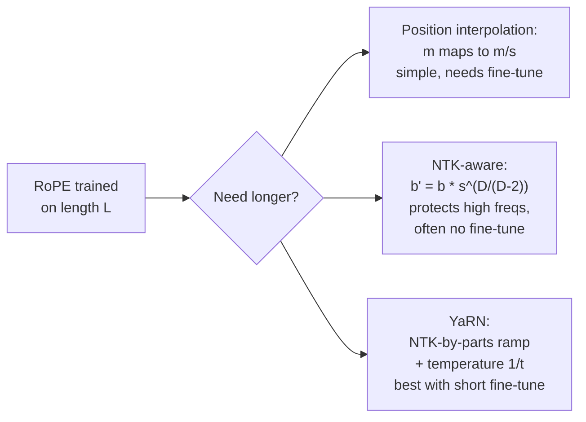

# Long-Context Engineering: RoPE Extension and KV Eviction

Volume 4 derives RoPE from scratch and notes the boundary: a model trained on 4k context degrades beyond it. Volume 8 covers the KV cache. It does not cover the two engineering disciplines that stretch context in practice. The first is rescaling positions so the model survives longer inputs. The second is evicting cache entries so the memory bill stays payable. This appendix teaches both from zero.

## Chapter 1. Stretching RoPE past its training window

### 1.1 Why extrapolation breaks

RoPE encodes position by rotating each pair of embedding dimensions at a fixed frequency. During training, the model only ever sees positions 0 through L, the training length. The rotation angles for those positions become familiar territory. Position L+5000 is not. The model has never seen those angles, and its attention patterns fall apart on them. Perplexity climbs, and long-range answers degrade first.

The goal of every extension method: make positions beyond L look familiar again, without retraining the model from scratch.

### 1.2 Position interpolation: the simple fix

If the model knows positions 0 to 4000 and you need 16,000, divide every position index by 4. Position 8000 becomes 2000, which the model has seen. This is position interpolation: map m to m/s, where s is the extension factor.

It works, with fine-tuning, up to about 8x. Its flaw: it compresses every RoPE frequency equally. The high-frequency channels carry fine-grained local position information, which nearby tokens need to tell each other apart. Interpolation blurs them. The model recovers some of this with fine-tuning, but the blurring caps how far you can go.

### 1.3 NTK-aware scaling: protect the high frequencies

A community researcher known as bloc97 posted a one-line improvement in June 2023. Instead of stretching positions, scale RoPE's base frequency. RoPE's per-dimension frequencies come from a base b, usually 10,000:

theta_d = b^(-2d/D)

NTK-aware scaling replaces b with b' = b * s^(D/(D-2)), where D is the head dimension and s is the extension factor. Low-frequency dimensions get interpolated, high-frequency dimensions stay nearly untouched. The local-resolution channels survive.

The worked numbers, for a LLaMA-style head with D = 128 and b = 10,000:

- s = 2 gives b' = 20,221
- s = 4 gives b' = 40,890
- s = 8 gives b' = 82,685
- s = 16 gives b' = 167,199

Two practical notes. First, this often works with no fine-tuning at all for 2x to 4x extensions, which is why inference engines adopted it quickly. Second, Code Llama shipped with NTK-aware scaling, manually setting the base to 1,000,000. If you have ever wondered why that config value looks odd, this is why.

### 1.4 YaRN: NTK-by-parts plus a temperature fix

YaRN, published in late 2023, starts from the observation that NTK-aware scaling is still one blunt rule for all dimensions. Its NTK-by-parts scheme treats each dimension by how many rotations it completes inside the training window. Dimensions that rotate many times (high frequency, short wavelength) are left alone. Dimensions that rotate less than once (low frequency) are fully interpolated. Dimensions in between get a smooth ramp. For the LLaMA family the ramp runs from alpha = 1 to beta = 32 rotations.

YaRN adds a second fix. Longer contexts spread attention over more tokens, which shifts the entropy of the attention distribution. YaRN compensates by dividing the pre-softmax logits by a temperature t, with 1/t = 0.1 * ln(s) + 1. For s = 16, that is 1/t = 1.277, implemented for free by scaling the rotated queries and keys by sqrt(1/t) = 1.13. No attention code changes, no runtime cost.

YaRN works training-free at inference time (Dynamic-YaRN) and reaches its best quality with a short fine-tune of a few hundred steps. It composes with FlashAttention, which is why it became the default extension recipe in serious long-context fine-tuning.



```python
import math

def ntk_aware_theta(theta, scale, dim):
    # NTK-aware base: theta' = theta * scale^(dim / (dim - 2)).
    # Why this exponent: it spreads the interpolation pressure across
    # dimensions so the high-frequency channels (which carry local
    # position resolution) move the least. Change the exponent and the
    # pressure lands on the wrong dimensions: too small and low freqs
    # extrapolate, too large and high freqs get blurred like plain PI.
    return theta * (scale ** (dim / (dim - 2)))


def yarn_temperature(scale):
    # YaRN's entropy fix: 1/t = 0.1 * ln(s) + 1. Longer contexts spread
    # attention mass over more tokens; dividing logits by t re-sharpens
    # the distribution. Implemented by scaling q,k by sqrt(1/t): zero
    # extra compute at inference.
    return 0.1 * math.log(scale) + 1


def precompute_freqs_ntk(dim, end, theta=10000.0, scale=4.0):
    # RoPE frequencies with NTK-aware scaling, pure Python.
    # freqs[d] = 1 / theta'^(2d/dim): the rotation speed of dimension d.
    # cos/sin of (position * freq) are the rotation matrices from Vol 4.
    theta_p = ntk_aware_theta(theta, scale, dim)
    freqs = [1.0 / (theta_p ** (2 * d / dim)) for d in range(dim // 2)]
    # Outer product: positions 0..end-1 against each frequency.
    angles = [[t * f for f in freqs] for t in range(end)]
    cos = [[math.cos(a) for a in row] for row in angles]
    sin = [[math.sin(a) for a in row] for row in angles]
    return cos, sin


print("NTK-aware theta, base 10000, dim 128:")
for s in (2, 4, 8, 16):
    print(f"  scale {s:2d}x -> theta' = {ntk_aware_theta(10000, s, 128):9.1f}")

print("YaRN temperature:")
for s in (8, 16, 32):
    t_inv = yarn_temperature(s)
    print(f"  scale {s:2d}x -> 1/t = {t_inv:.4f}, q,k scale = {math.sqrt(t_inv):.4f}")
```

::: walkthrough
1. `ntk_aware_theta` is the one-line formula. The exponent dim/(dim-2) is slightly above 1, so the base grows a little faster than the scale factor. For dim 128 and scale 4, theta moves from 10,000 to 40,890.
2. `yarn_temperature` computes the entropy compensation. At 16x the logits are divided by 1.277, or equivalently q and k are scaled by 1.13 before the dot product.
3. `precompute_freqs_ntk` builds the actual rotation tables: frequencies from the scaled base, then cos and sin of position times frequency. This is the same table Volume 4 derives, with theta replaced by theta prime.
4. The printed tables are the numbers you would put in a model config. If a config shows theta 40,890 on a 4k-trained model serving 16k, it is doing exactly this.
:::

::: takeaway
- RoPE breaks past its training length because the angles are unfamiliar. Every extension method makes long positions look familiar again.
- Position interpolation divides positions by s. NTK-aware scaling raises the base to b * s^(D/(D-2)), protecting high frequencies. YaRN adds per-dimension ramps plus a temperature fix.
- NTK-aware often works with no fine-tuning at 2x to 4x. YaRN is the recipe when you plan to fine-tune.
:::

## Chapter 2. KV cache eviction policies

### 2.1 Why you cannot keep everything

Every generated token appends its key and value vectors to the KV cache, and every future token attends to all of them. The cache grows linearly with sequence length, and at long context it dominates GPU memory.

The worked numbers: a 32-layer model with d_model 4096 in fp16 stores 2 (K and V) * 32 * 4096 * 2 bytes = 0.5 MB per token. At 128k tokens that is 64 GB, more than most single GPUs hold, before counting the model weights at all. Something has to give: either buy more memory, or keep fewer tokens.

Eviction keeps a fixed budget of tokens and discards the rest. The research question is which tokens are safe to discard.

### 2.2 The attention sink discovery

The surprise finding: the first few tokens of any sequence attract huge attention weights no matter what they say. They act as sinks that stabilize the attention distribution. Drop them and the model breaks. Drop middle tokens and often nothing happens.

This single fact shapes every policy below. Whatever else you evict, protect the sinks.

### 2.3 Three policies

Sliding window. Keep the most recent W tokens, evict everything older. Simple, fast, and wrong for anything that needs long-range recall: the answer buried 50k tokens back is gone. Good for streaming chat where only recent context matters.

StreamingLLM. Keep the sink tokens (typically the first 4) plus a sliding window of recent tokens. The cache stays bounded at sink + window no matter how long the stream grows, so the model can generate coherently forever. The price: middle context is discarded entirely, so retrieval over the full history fails.

H2O (Heavy-Hitter Oracle). Attention scores follow a power law: a small set of tokens, the heavy hitters, receives most of the attention mass across generation steps. H2O keeps a running sum of each token's received attention and, at a fixed budget, retains the top heavy hitters plus recent tokens. With only 20% of the full cache budget, it matches full-cache accuracy across the paper's benchmarks, and it beat StreamingLLM on perplexity in long streaming runs. The cost is bookkeeping: you must track accumulated scores per token per head.

The honest comparison: sliding window is a positional rule, blind to content. StreamingLLM adds sinks to the positional rule. H2O is content-aware, which is why it keeps quality at small budgets, and heavier to implement, which is why it is not everywhere.

```python
def kv_cache_bytes(n_layers, d_model, seq_len, bytes_per=2):
    # KV memory: 2 (K and V) * layers * d_model * seq_len * bytes.
    # fp16 -> 2 bytes; int8 KV quantization halves it (see Vol 8).
    # This is per sequence: multiply by batch size for the real bill.
    return 2 * n_layers * d_model * seq_len * bytes_per


def h2o_evict(scores, budget, n_recent=4, n_sink=4):
    # H2O-style eviction on one attention head, pure Python.
    # scores: accumulated attention received per token so far (the
    # "heavy-hitter" signal). budget: total tokens we may keep.
    # Keeps: the first n_sink tokens (attention sinks, always protected),
    # the last n_recent tokens (local context), and the top heavy hitters
    # by accumulated score for the remaining budget.
    # What breaks if changed: dropping the sinks destabilizes attention
    # (the sink finding); dropping recency kills local coherence; using
    # per-step scores instead of accumulated scores makes the ranking
    # noisy and eviction thrashy.
    n = len(scores)
    if n <= budget:
        return list(range(n))  # Under budget: evict nothing.

    keep = set(range(n_sink))                    # attention sinks
    keep |= set(range(n - n_recent, n))          # recent window
    # Heavy hitters: highest accumulated attention among the rest.
    candidates = [i for i in range(n) if i not in keep]
    candidates.sort(key=lambda i: scores[i], reverse=True)
    keep |= set(candidates[:budget - len(keep)])
    return sorted(keep)


# The memory bill from the chapter: 32 layers, d_model 4096, fp16, 128k.
print(f"full 128k cache: {kv_cache_bytes(32, 4096, 131072) / 1024**3:.0f} GB")
print(f"H2O at 20% budget: {kv_cache_bytes(32, 4096, 131072) / 1024**3 * 0.2:.0f} GB")

# Tiny eviction demo: 20 tokens, budget 8.
import random
random.seed(0)
accum = [random.paretovariate(2.0) for _ in range(20)]  # power-law-ish scores
print("kept positions:", h2o_evict(accum, budget=8))
```

::: walkthrough
1. `kv_cache_bytes` is the memory arithmetic. The factor of 2 for K and V is the line people forget. The per-sequence note is the line that saves you in capacity planning, because batch size multiplies everything.
2. `h2o_evict` takes accumulated attention scores, not per-step ones. Accumulation is what makes "heavy hitter" a stable property instead of a noisy one.
3. Sinks are protected unconditionally (the first 4 indices), then the recent window, then the top scorers fill the remaining budget. The demo prints which of 20 positions survive an 8-token budget.
4. The printed memory numbers show the payoff: 64 GB full cache versus about 13 GB at H2O's 20% budget, with matched accuracy on the paper's tasks.
:::

::: takeaway
- The KV cache grows linearly with length: 0.5 MB per token for a 32-layer 4096-wide fp16 model, 64 GB at 128k tokens.
- Attention sinks (the first tokens) must always be kept. Every policy builds on this.
- Sliding window is blind to content; StreamingLLM adds sinks to the window; H2O keeps heavy hitters by accumulated attention and holds quality at 20% budget.
- Eviction is lossy. For tasks that need exact long-range recall, eviction is the wrong tool: buy memory or retrieve differently.
:::

::: provenance
**Last verified: September 2026.** NTK-aware scaling (b' = b * s^(D/(D-2)), bloc97, June 2023; adopted by Code Llama with base 1,000,000): documented in the YaRN paper's treatment (arXiv:2309.00071, 2023). YaRN (NTK-by-parts ramp with alpha=1, beta=32 for LLaMA; temperature 1/t = 0.1 ln s + 1; ~400 fine-tuning steps): arXiv:2309.00071. Position interpolation (Chen et al., 2023): the baseline method YaRN compares against. StreamingLLM attention sinks (Xiao et al., 2023): the sink phenomenon and sink-plus-window policy. H2O (Zhang et al., NeurIPS 2023): power-law attention, heavy hitters plus recent tokens, 20% budget matching full-cache accuracy. **UNVERIFIED:** the 0.5 MB/token and 64 GB figures are computed from the stated architecture (32 layers, d_model 4096, fp16). They are not quoted from a paper. Verify against your own model's config before capacity planning.
:::
