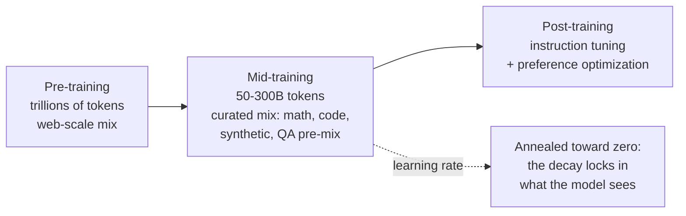

# Mid-Training: Between Pre-Training and Post-Training

Volume 5 covers pre-training: the data pipeline, the objective, the loss curves. Volume 7 covers post-training: instruction tuning and preference optimization. Between them sits a stage the field now names explicitly: mid-training. It is not a longer pre-training run, and it is not post-training. It is the phase where the data distribution changes on purpose while the objective stays the same, and it is where benchmark scores are quietly won or lost.

## Chapter 1. The stage that sharpens the base

### 1.1 What mid-training is

Pre-training teaches the model the world on trillions of tokens of web text. Post-training teaches it to be an assistant on millions of instruction and preference examples. Mid-training sits between them. It runs tens to hundreds of billions of tokens, still with next-token prediction, but on a deliberately different mixture. More math, more code, more curated and synthetic text, and instruction-like QA data pre-mixed into the stream.

Two different teams run it under two different constraints.

The lab-side team does it mid-run, on their own base model, with the optimizer state intact and the learning rate still in its stable phase. Their main knob is the data mixture and the timing of the decay. Token budgets are large, often 50 to 300 billion, a meaningful slice of the whole run.

The practitioner-side team does it on someone else's released base, which has already fully decayed. They must re-warm the learning rate from the floor and re-decay it. They also need a replay fraction of general data so the model does not forget everything it knew. Their budgets are smaller, in the billions. Mixing the two recipes up, resuming a released base as if the optimizer state were yours, is the usual mistake.



### 1.2 The annealing insight

The key empirical finding is about timing: the model is most plastic to high-value data during the learning-rate decay phase. Tokens seen while the learning rate anneals toward zero shape the final model far more than tokens seen during the long stable phase.

This has two practical consequences.

First, the highest-quality data belongs in the decay tail, not smeared uniformly across trillions of tokens. Concentrate your curated math, your clean code, your best synthetic QA into the annealing phase. Downstream benchmark scores are dominated by this phase, not by the trillions of tokens before it.

Second, the decay phase is a cheap data-quality probe. Anneal a small run with a candidate dataset in the mix and one without it, and compare. If the eval delta is real, the dataset is worth its place in the full run. This "microanneal" turns data curation from an argument into a measurement. It is how careful labs value small domain datasets: not by staring at samples, but by reading the eval delta the data produces.

A worked mixture. Say your mid-training budget is 100 billion tokens. A plausible split: 35% math and reasoning text, 25% code, 20% high-quality filtered web as replay, 15% instruction-like QA pairs pre-mixed in, 5% held-out-style validation content. In tokens: 35B math, 25B code, 20B web replay, 15B QA, 5B validation. The exact numbers are ablations, not commandments. The structure is the point: quality concentrated in the decay.

### 1.3 Why it makes the base responsive to RL

Post-training methods like RLHF and RLAIF work far better on some base models than others, and mid-training is a large part of why. A raw pre-trained base only completes text; it has never seen a question followed by a helpful answer as a pattern worth continuing. Instruction-tuning a raw base has to build the entire instruction-following behavior from a few million examples.

Pre-mixing instruction and QA data into mid-training changes the starting point. The base model arrives at post-training already shaped toward the question-answer pattern. Instruction tuning then refines a behavior the model has seen billions of times instead of inventing it from scratch. RL lands on a policy that already explores the right region of behavior space: responses that look like answers, not continuations. That is what "RL readiness" means in practice. The RL stage is short and expensive; mid-training buys it a better launchpad cheaply.

### 1.4 Contamination can enter after decontamination

Volume 5 decontaminates the pre-training corpus: benchmark items are filtered out of the web crawl with n-gram overlap checks. But decontamination is a property of a dataset at a moment in time, not a permanent shield. Mid-training opens three new doors.

The first door is synthetic data. If you generate training QA with a model that memorized a benchmark, benchmark items appear in your training set without ever being copied from it. The n-gram filter sees fresh text and waves it through. The contamination rides in inside the generator.

The second door is time. Benchmarks are discussed, solved, and explained on the public web after the pre-training crawl. Tutorials quote the questions, forums debate the answers, GitHub repos collect solutions. Mid-training corpora built from recent web data absorb all of it. A benchmark that was clean at pre-training time is dirty by mid-training time.

The third door is the QA pre-mix itself. Instruction datasets are often built by repurposing benchmarks. "Here is a question, here is the gold answer." If those pairs leak into the mid-training mixture, the model trains on the test in the most direct possible way.

The defense is procedural, not clever. Re-run decontamination on every data addition, against every eval you will report, including the mid-training and synthetic mixes. Check n-gram overlap and embedding similarity; the second catches paraphrase the first misses. And treat any eval whose items are widely discussed online as suspect until you have checked it against your actual training mixture, not just your pre-training corpus.

```python
def mixture_budget(total_billions, fractions):
    # total_billions: mid-training token budget, e.g. 100.
    # fractions: dict of split name -> fraction of the budget.
    # Returns each split in billions of tokens. The structure of the
    # split matters more than the exact numbers: quality data goes in
    # the decay tail, replay protects against forgetting.
    if abs(sum(fractions.values()) - 1.0) > 1e-9:
        raise ValueError("fractions must sum to 1.0: the budget is finite")
    return {name: total_billions * frac for name, frac in fractions.items()}


def ngram_overlap(train_text, eval_text, n=13):
    # Cheap decontamination check: does any n-gram of the eval item appear
    # in the training text? n=13 is the classic working value.
    # What this catches: verbatim or near-verbatim benchmark leakage.
    # What it misses: paraphrases and contamination-via-generator, where
    # the text is fresh but the knowledge is copied. Pair this with
    # embedding-similarity checks for the paraphrase case.
    def ngrams(text):
        toks = text.lower().split()
        return {" ".join(toks[i:i + n]) for i in range(len(toks) - n + 1)}

    train_grams = ngrams(train_text)
    eval_grams = ngrams(eval_text)
    if not eval_grams:
        return 0.0  # Eval text shorter than n tokens: check is vacuous.
    hits = eval_grams & train_grams
    return len(hits) / len(eval_grams)


budget = mixture_budget(100, {
    "math": 0.35, "code": 0.25, "web-replay": 0.20,
    "qa-premix": 0.15, "validation": 0.05,
})
print(budget)

train = "the quick brown fox jumps over the lazy dog near the river bank"
e = "brown fox jumps over the lazy dog near the river"
print(f"overlap: {ngram_overlap(train, e, n=5):.0%}")
```

::: walkthrough
1. `mixture_budget` turns a budget and a split into per-split token counts. The validation step is the important one: fractions must sum to 1.0, because every token spent on one split is a token not spent on another.
2. `ngram_overlap` lowercases both texts, builds the set of n-grams for each, and reports what fraction of the eval item's n-grams appear in training. A high number means the eval item, or something very like it, is in the training data.
3. The comments name what the check misses: paraphrase and generator-mediated contamination. No single check covers all three doors from section 1.4, which is why the chapter prescribes a layered defense.
:::

::: takeaway
- Mid-training is its own stage: next-token prediction continues, but the data distribution changes deliberately toward math, code, curated, synthetic, and QA pre-mix.
- The decay phase is where the model is most plastic. Put your best data there, and use microanneals to measure a dataset's value before committing.
- QA pre-mix buys RL readiness: the base arrives at post-training already shaped toward question-answer behavior.
- Decontamination expires. Re-check every new mix, synthetic data included, against every eval you will report.
:::

::: provenance
**Last verified: September 2026.** Mid-training as a named stage: 50-300B token budgets, lab-side vs practitioner-side variants, annealed LR, quality upgrade via curated and synthetic data, RL readiness. Consistent across recent practitioner writeups and open-model recipes (e.g. OLMo 2's recipe, 2024; Stanford CS336 mid/post-training lecture material, 2026). Microanneal as a data-quality probe and the decay-phase plasticity finding: reported in mid-training survey literature and practitioner notes. Contamination via the generator and the three post-decontamination doors: documented in recent contamination analyses (n-gram overlap > 8 as a working filter; 13-gram as the classic check). **UNVERIFIED:** the worked 100B mixture split is an illustrative construction, not any lab's published recipe.
:::
