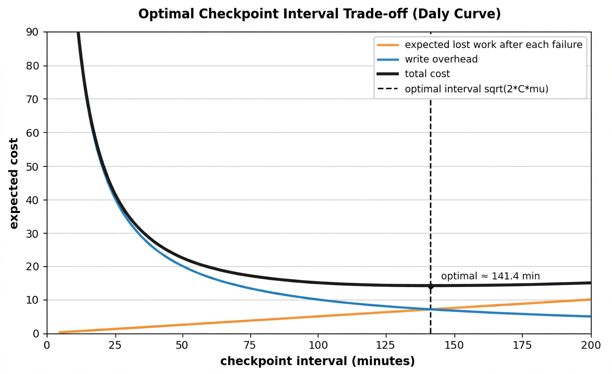
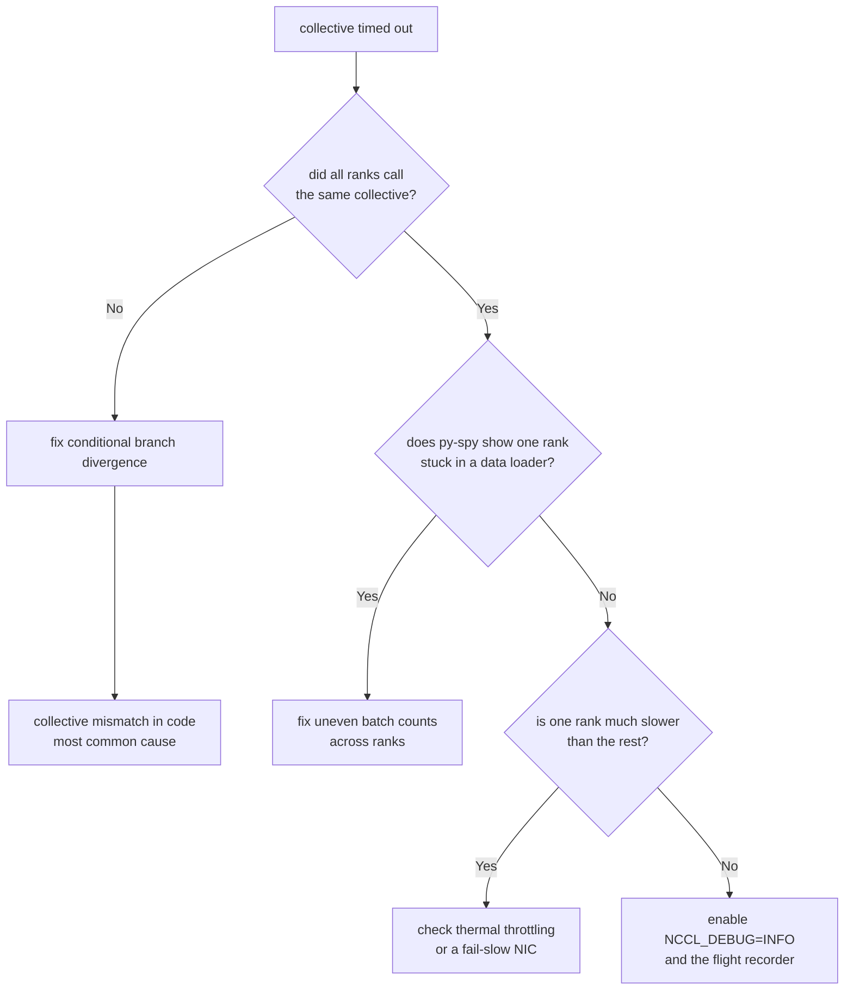
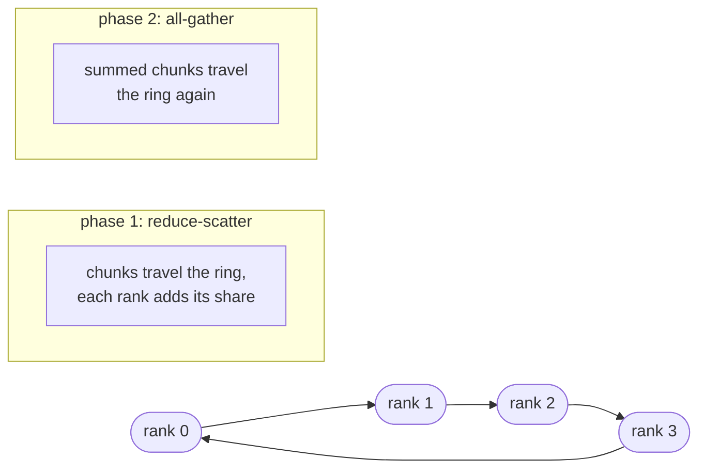
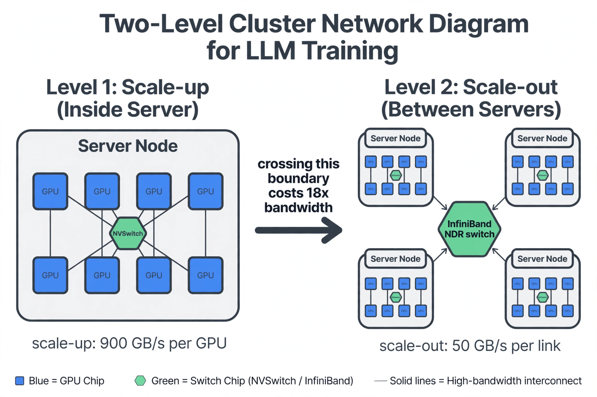

# Appendix A: Training Reliability and Operations

Volume 6 taught you how to split a model across GPUs: data, tensor, and pipeline parallelism, and the collectives that glue them together. This appendix covers what happens when reality intrudes. On a large run, hardware fails. Nodes slow down. The loss curve spikes at 3 a.m. The network is never the problem you think it is.

This appendix is self-contained. It has four chapters:

1. **Checkpointing for large runs** - how to save state without stopping training, and how often to do it.
2. **Failure modes and recovery** - loss spikes, NaNs, and hung collectives, with a debugging playbook for each.
3. **Straggler detection and mitigation** - finding the one slow rank that holds back the whole job, and surviving node failures.
4. **Cluster networking basics** - NCCL collectives recap, GPUDirect RDMA, and the bandwidth math that decides your parallelism layout.

You need no GPUs for the labs. Everything runs on CPU with plain Python and NumPy.

---

## Chapter 1: Checkpointing for Large Runs

### 1.1 What a checkpoint really is

A %%checkpoint%% is a complete snapshot of training state, saved to durable storage. It contains four things:

| Contents | What it is | Why it matters |
|----------|-----------|----------------|
| Model parameters | Every weight and bias | Without this, you restart from scratch |
| Optimizer state | Momentum, variance, step count for Adam | Adam keeps per-parameter history; losing it changes the optimization path |
| RNG state | Python, NumPy, and CUDA random states | Needed for reproducible resume |
| Data position | Which sample comes next | Without it, the model sees some batches twice and skips others |

The first row is the smallest. For a 70B model in BF16, parameters are about 140 GB. Adam keeps two FP32 accumulators per parameter (momentum and variance), which is 8 bytes each: 560 GB. The optimizer state is four times bigger than the model. Many first checkpointing bugs come from saving the model and forgetting the optimizer. That resume is not a resume. It is a restart with amnesia.

### 1.2 Why failures make checkpointing the heartbeat

Take Meta's Llama 3 405B run. 16,384 H100 GPUs. 54 days. The team logged 466 job interruptions: 47 planned, 419 unexpected. That is one failure every three hours. GPU problems caused 58.7% of the unexpected interruptions. Only three incidents needed serious manual work; automation handled the rest, and effective training time stayed above 90%.

Now scale that down. Failure rate grows roughly in proportion to GPU count. For 1,000 GPUs, expect the job-level failure rate to be about 16 times lower than at 16,384 GPUs. That gives a mean time between failures of roughly 50 hours. Failures are not a rare event you plan around. They are the normal operating condition. Checkpointing is how a run survives them.

::: takeaway
- A checkpoint is parameters plus optimizer state plus RNG state plus data position. Miss one and the resume is corrupt.
- On a 1,000-GPU run, expect a failure every couple of days. On a 16,000-GPU run, expect one every few hours.
- Automated recovery kept Llama 3 above 90% effective training time. The checkpoint was the mechanism that made that possible.
:::

### 1.3 Async checkpointing: saving without stopping

**What.** The naive way to checkpoint is to stop training, write everything to disk, then resume. This is %%synchronous checkpointing%%. The GPU sits idle during the whole write. %%Async checkpointing%% splits the save into two phases. First, a fast copy (staging) from GPU memory to pinned CPU memory. Then a background thread writes the staged copy to storage while training continues.

**Why.** Staging a few hundred gigabytes of GPU memory to host memory takes seconds. Writing to a shared filesystem can take minutes. Async checkpointing turns the minutes into overlap with useful training. Steps stay unblocked after the short staging pause instead of waiting for the full disk write.

**How it works, under the hood.** Three ideas:

1. **Staging to pinned memory.** The state dict is copied from GPU to CPU memory that is page-locked (pinned). Pinned memory lets the storage layer read it without the OS paging it out. This copy is the only part that blocks training, and it takes a fraction of a second to a few seconds.
2. **Background thread write.** A separate thread serializes the staged copy to the distributed filesystem. Training kernels keep running on the GPU meanwhile.
3. **One in-flight future.** Only one background write may be active at a time. Before starting the next checkpoint, the code blocks on the previous write's future. Two overlapping writes would fight over the same staging buffer and could corrupt the metadata.

PyTorch's `torch.distributed.checkpoint` (DCP) supports this directly with `dcp.async_save`. It stages the state dict to CPU, then writes on a background thread. The function returns a future; you call `.result()` on it before issuing the next save.

```ascii
time ───────────────────────────────────────────────────────────────►

GPU thread:   | T0 | T1 | stage | T3 | T4 | T5 | T6 |   training steps
                            └─ copy state to pinned CPU memory
                               (~200 ms: the only pause)

bg thread:             |◄────── write to storage ──────►|
                                 (overlaps T3-T6)

future:                [ single in-flight future:
                         next checkpoint waits here ]
```

*Figure 1.1. Async checkpointing. The only stall is the short staging copy. The background write overlaps with continued training.*

::: walkthrough
1. **Steps T0-T1 run normally** on the GPU. Nothing about checkpointing is visible.
2. **The staging pause** copies the state dict to pinned CPU memory. Training stops for a fraction of a second.
3. **The background thread starts writing** the staged copy to the filesystem. Training steps T3-T5 run at full speed meanwhile.
4. **The next checkpoint must wait** for this write's future to complete before staging again. One in-flight write only, or the staging buffer gets clobbered.
:::

A typical pattern, adapted from production training code (runs on a GPU cluster; included here as a reference pattern):

```python
import torch.distributed.checkpoint as dcp
from torch.distributed.checkpoint.state_dict import (
    get_state_dict, set_state_dict, StateDictOptions,
)

# Track the one allowed in-flight save. None means "nothing writing".
inflight = None

def maybe_save(model, optimizer, step, every, save_dir):
    # Reads the module-global future: only one background write at a time.
    global inflight

    if step % every != 0:
        # Not a checkpoint step: do nothing and keep training.
        return

    if inflight is not None:
        # Block until the previous background write finishes.
        # Skipping this risks overlapping writes corrupting the metadata.
        inflight.result()
        inflight = None

    # Pull sharded state dicts without gathering the full model anywhere.
    # full_state_dict=False keeps each rank's piece local (see 1.4).
    msd, osd = get_state_dict(
        model, optimizer,
        options=StateDictOptions(full_state_dict=False, cpu_offload=False),
    )

    # async_save stages to pinned CPU memory, then writes on a thread.
    # It returns immediately; training is unblocked after staging.
    inflight = dcp.async_save(
        state_dict={"model": msd, "optim": osd, "step": step},
        checkpoint_id=f"{save_dir}/step_{step}",
    )
    # If you changed the write path (say, a new save_dir per run),
    # inflight.result() is also where write errors surface. Check it.
```

::: walkthrough
1. **The gate `step % every != 0`** keeps the hot loop cheap. On non-checkpoint steps this function returns in microseconds.
2. **Blocking on `inflight.result()`** is the correctness guard. It turns "at most one background write" from a comment into an enforced rule.
3. **`get_state_dict` with `full_state_dict=False`** avoids gathering the whole model on one rank. Section 1.4 explains why that matters.
4. **Write errors surface at `.result()`.** If the filesystem write fails, the exception raises here, not at save time. Check the future or failures stay silent.
:::

::: callout warn
**Async does not mean free.** The staging copy needs pinned host memory as large as one full checkpoint. On a node with 2 TB of RAM and an 800 GB checkpoint, one in-flight save is fine, but two overlapping ones would not fit. This is exactly why the single in-flight future exists. It is also why `dcp.async_save` is still marked experimental in recent PyTorch versions: the staging semantics can change.
:::

### 1.4 Sharded save and restore

**What.** With FSDP or ZeRO-3, no rank holds the full model. Each rank holds only its shard of the parameters and optimizer state. A %%sharded checkpoint%% writes each rank's shard directly, in parallel, without ever gathering the full state.

**Why.** For a 405B model, rank 0 cannot allocate terabytes to gather the optimizer state. Even if it could, one writer serializing terabytes would take 30+ minutes. Sharded writes spread the I/O across all ranks and all storage servers.

**How.** DCP's default planner writes at least one file per rank and records a metadata file describing where every tensor piece lives. On load, DCP reads the metadata and re-slices the pieces onto the current ranks. If you resume with a different world size, it re-shards automatically. Two facts to keep straight:

- **Save format is a directory, not a file.** A sharded checkpoint is a folder of many files plus metadata. Do not expect one `.pt`.
- **Export is a separate step.** To get a single portable file for inference, convert offline. DCP ships `dcp_to_torch_save` (also runnable as a CLI) for exactly this.

A save/load pair with a reshard-safe pattern:

```python
import torch.distributed.checkpoint as dcp
from torch.distributed.checkpoint.state_dict import (
    get_state_dict, set_state_dict, StateDictOptions,
)

def save_sharded(model, optimizer, step, save_dir):
    # Sharded state dicts: each rank only sees its own pieces.
    # cpu_offload=False keeps the staging fast; the pinned-memory copy
    # happens inside dcp.save. Set it True if GPU memory is tight,
    # at the cost of a slower staging copy.
    msd, osd = get_state_dict(
        model, optimizer,
        options=StateDictOptions(full_state_dict=False, cpu_offload=False),
    )
    # Writes one directory with >=1 file per rank, plus a metadata file.
    # checkpoint_id is a directory path for the filesystem writer.
    dcp.save(
        state_dict={"model": msd, "optim": osd, "step": step},
        checkpoint_id=f"{save_dir}/step_{step}",
    )

def load_sharded(model, optimizer, load_dir):
    # Allocate the model first, already sharded. DCP cannot create
    # the sharding layout for you; it only fills in the values.
    msd, osd = get_state_dict(model, optimizer)
    # Loads in place and auto-reshards if the world size changed.
    state = {"model": msd, "optim": osd, "step": 0}
    dcp.load(state_dict=state, checkpoint_id=load_dir)
    # Push the loaded values back into the live model and optimizer.
    set_state_dict(model, optimizer, model_state_dict=msd,
                   optim_state_dict=osd)
    # Return the step so the loop can resume the schedule correctly.
    return state["step"]
```

::: walkthrough
1. **The model must exist and be sharded before `load`.** DCP fills values into an existing layout. Loading into an unsharded model, then sharding, is a different (broken) order.
2. **`dcp.load` reads the metadata first.** It learns which file holds which tensor slice, then assigns slices to the current ranks. This is what makes a different world size work.
3. **`set_state_dict` is not optional.** `dcp.load` fills the plain dicts; the live module and optimizer only see the values after this call.
4. **Resuming the step counter matters.** Learning-rate schedules are step-indexed. Resuming weights at step 5,000 but a scheduler at step 0 silently retrains with the wrong schedule.
:::

::: callout
**Multi-tier checkpointing.** Large sites pair a fast local tier with a durable remote tier. Write to node-local SSD first (fast), then replicate to durable storage in the background. Restart reads from the local SSD or a peer replica, and falls back to the durable copy only when the slice is truly gone. The local tier makes restarts minutes instead of tens of minutes.
:::

### 1.5 Checkpoint cadence: how often to save

**What.** Checkpoint every step and the GPUs spend all their time writing. Checkpoint once a day and each failure throws away a day of work. The optimal interval balances the two costs.

**The math.** Let C be the stall cost of one checkpoint (seconds), and mu be the mean time between failures (seconds). Daly's formula gives the interval that minimizes expected total waste:

    tau* = sqrt(2 * C * mu)

Why this shape: failures arrive at random times, so the work lost after a failure averages half the interval (tau/2). Doubling the interval doubles the average loss. Meanwhile the write overhead per unit time is C/tau, which halves when the interval doubles. One cost rises linearly, the other falls as 1/tau. Their sum is minimized at sqrt(2*C*mu).

**Worked example: a 1,000-GPU run.** Start from the Llama 3 numbers. 419 unexpected failures over 54 days on 16,384 GPUs. Per-GPU-hour failure rate: 419 / (16,384 x 54 x 24) = 1.97e-5. On 1,000 GPUs, the job-level rate is 1,000 x 1.97e-5 = 0.0197 failures per hour. So mu = 1/0.0197 = 50.7 hours = 182,520 seconds.

Take C = 200 seconds of stall per checkpoint (a conservative sharded write to shared storage). Then:

    tau* = sqrt(2 x 200 x 182,520) = sqrt(73,008,000) = 8,544 seconds = 142 minutes

So checkpoint roughly every 2.4 hours. The expected loss per failure is tau/2 = 71 minutes of work. Add the restart time R (say 15 minutes to re-provision and reload). That is about 86 minutes lost per failure. Over a 30-day run at 50.7-hour MTBF, expect about 14 failures and about 20 hours of lost work: roughly 2.8% of the run. Checkpointing more often than tau* spends more on writes than it saves on lost work.

If async checkpointing cuts the stall to C = 30 seconds:

    tau* = sqrt(2 x 30 x 182,520) = sqrt(10,951,200) = 3,309 seconds = 55 minutes

The optimal interval drops to under an hour. Faster writes justify more frequent checkpoints. That is the whole point of async checkpointing, expressed as a number.



*Figure 1.2. Daly's curve. The orange line is expected lost work, which grows with the interval. The blue line is write overhead, which shrinks with the interval. Their sum (black) is U-shaped; the dashed line marks the optimum, about 141 minutes for C=200 s and mu=50 h.*

::: walkthrough
1. **The orange line rises.** Longer intervals mean more work dies with each failure. At a 200-minute interval, the average loss per failure is 100 minutes.
2. **The blue line falls.** Writing every 10 minutes spends 200 seconds out of every 600, a 33% tax. Writing every 200 minutes spends 200 out of 12,000, under 2%.
3. **The black sum is the real cost.** Its minimum is where the two marginal costs balance. The last minute added to the interval saves exactly as much write overhead as it risks in lost work.
4. **The minimum is shallow near the bottom.** Checkpointing at 100 or 200 minutes instead of 141 costs only slightly more. Do not over-tune; the formula inputs (C, mu) are estimates anyway.
:::

::: callout warn
**Common misunderstanding: "more checkpoints are always safer."** They are not free. Every checkpoint costs C seconds of stall and terabytes of storage writes. Below the optimum, the write tax exceeds the recovered work. Compute the interval; do not guess it. And retention matters: keep several recent checkpoints, not one. A single retained checkpoint that turns out corrupt loses everything.
:::

::: lab Lab A1: Cadence optimizer
Compute Daly's optimum for your own numbers, then simulate to check it. Pure Python, runs on CPU.

```python
import math
import random

def optimal_interval(checkpoint_cost_s, mtbf_s):
    # Daly's first-order optimum: sqrt(2 * C * mu).
    # First-order is fine when C is much smaller than mu, which
    # is true here (200 s vs 182,520 s). The second-order correction
    # changes the answer by under 2% in this regime.
    return math.sqrt(2.0 * checkpoint_cost_s * mtbf_s)

def simulate(interval_s, checkpoint_cost_s, mtbf_s, restart_s,
             run_days=30, seed=0):
    # Simulate a run as a sequence of failures. Failures arrive as a
    # Poisson process: time to next failure is exponential with mean mtbf.
    # Change the seed to get a different random failure history.
    rng = random.Random(seed)
    run_s = run_days * 86400
    t, lost = 0.0, 0.0
    while True:
        # Draw the next failure time. If it falls past the run end,
        # the run finished; stop.
        t += rng.expovariate(1.0 / mtbf_s)
        if t >= run_s:
            break
        # The failure lands at a random point in the checkpoint interval,
        # so average lost work is half the interval. Restart costs extra.
        lost += interval_s / 2.0 + restart_s
    # Write overhead: one stall of checkpoint_cost_s per interval.
    lost += (run_s / interval_s) * checkpoint_cost_s
    # Return lost hours and the waste as a fraction of the run.
    return lost / 3600.0, lost / run_s

# Worked example from the chapter: 1000-GPU run.
C, MU, R = 200.0, 50.7 * 3600.0, 15 * 60.0
tau = optimal_interval(C, MU)
print(f"optimal interval: {tau/60:.0f} min")
for factor in (0.5, 1.0, 2.0):
    hours, frac = simulate(tau * factor, C, MU, R)
    print(f"interval {tau*factor/60:6.0f} min -> lost {hours:5.1f} h "
          f"({100*frac:.1f}% of run)")

# Your turn: set C=30 s (async staging) and re-run. Watch the
# optimum move. Then try mu for 16,384 GPUs (about 3.1 h) and
# see what interval the Llama 3 regime demands.
```

Try it: change `seed` a few times. The optimum stays near 142 minutes while the simulated waste wobbles. That wobble is real life. The formula gives the best average bet, not a guarantee for any single run.
:::

### 1.6 Retention, verification, and what goes wrong

**Retention.** Keep the last K checkpoints (K = 3 is common) plus periodic older ones (one per day). Never keep exactly one: a single corrupt write loses everything. Storage is cheap; a 140 GB model checkpoint is nothing next to the GPU-hours it protects.

**Verification.** A checkpoint you have never restored is a rumor. Verify by actually restoring. Load into a fresh process and compare a hash of the parameters. Then check that the first few steps after resume continue the pre-failure loss curve instead of jumping. Non-deterministic data resume is a silent correctness bug, not a loud one.

**The resume checklist.** Before you trust a restart, confirm each of these:

- model weights hash matches the saved checkpoint
- optimizer state loaded, not re-initialized
- RNG states restored
- data loader resumes at the right sample
- learning-rate schedule resumes at the right step
- the loss curve continues smoothly, with no jump

::: takeaway
- Checkpoint contents: parameters, optimizer state, RNG state, data position. The optimizer state is the part people forget, and it is 4x the model size for Adam.
- Async checkpointing stages to pinned CPU memory in seconds, then writes on a background thread. Keep exactly one in-flight write.
- Sharded checkpoints write per-rank files in parallel and re-shard on load. DCP is the current PyTorch API for this.
- Cadence is math, not vibes: tau* = sqrt(2*C*mu). For a 1,000-GPU run with 200 s writes, that is about 2.4 hours.
:::

---

## Chapter 2: Failure Modes and Recovery

### 2.1 The failure landscape

Not all failures look alike. The Llama 3 run categorized its 419 unexpected interruptions. GPU problems (including NVLink) were 30.1%. HBM3 memory failures were 17.2%. Host maintenance was 14.1% and network issues 5.5%. The rest spread across software, storage, and power. At smaller scales the mix shifts toward software: bad batches, divergent loss, and collective timeouts you caused yourself.

Three families cover almost everything you will actually debug:

1. **Loss pathologies** - the loss spikes, plateaus, or goes to NaN. The hardware is fine. The math broke.
2. **Hangs** - ranks stop making progress. Usually a collective where not all ranks showed up.
3. **Crashes** - a process dies. Usually hardware, occasionally an out-of-memory kill.

Crashes are simple: the watchdog restarts the job and it resumes from the checkpoint. The other two need your judgment. That is this chapter.

### 2.2 Loss spikes: detection and the rollback protocol

**What.** A %%loss spike%% is a sudden jump in the training loss, often by orders of magnitude, that does not come back down. Sometimes it is one bad batch of data. Sometimes it is the first sign of numerical instability that will end in NaN.

**Detection.** Eyeballing a loss plot does not scale. The standard approach: keep a rolling median of the loss over the last few hundred steps. Flag any step whose loss exceeds the median by more than K times the median absolute deviation (MAD). MAD is preferred over standard deviation because one giant spike does not inflate it. A common trigger is loss > median + 10 x MAD, sustained for a few steps. One step can be noise; five in a row is a signal.

```python
import numpy as np

class LossSpikeDetector:
    # Rolling-median + MAD detector. MAD (median absolute deviation) is
    # used instead of standard deviation because a single giant spike
    # does not inflate it. Tune window and k on a healthy run first.

    def __init__(self, window=200, k=10.0, persist=5):
        # window: how many recent steps form the "normal" baseline.
        # k: spike threshold in MAD units. persist: consecutive spikes
        # needed before we call it real (one step can be noise).
        self.window = window
        self.k = k
        self.persist = persist
        self.history = []
        self.bad_streak = 0

    def step(self, loss):
        # Feed one step's loss. Returns True only when a sustained
        # spike is detected. Keep calling every step; the method is O(1)
        # amortized and holds at most `window` floats.
        self.history.append(float(loss))
        if len(self.history) > self.window:
            # Drop the oldest: the baseline must reflect recent training,
            # not week-old loss values from a different loss scale.
            self.history.pop(0)
        if len(self.history) < self.window:
            # Not enough data to define "normal" yet. Never alert early.
            return False
        med = float(np.median(self.history))
        mad = float(np.median(np.abs(np.asarray(self.history) - med)))
        # Guard against mad == 0 (perfectly flat loss): without the max,
        # any nonzero deviation would divide by zero or trigger falsely.
        thresh = med + self.k * max(mad, 1e-8)
        if float(loss) > thresh:
            self.bad_streak += 1
        else:
            self.bad_streak = 0
        return self.bad_streak >= self.persist

    def reset(self):
        # Call after a rollback: the post-rollback loss will look
        # different, so the old baseline would misfire. Clear everything.
        self.history.clear()
        self.bad_streak = 0
```

::: walkthrough
1. **The baseline is a rolling window**, not the whole run. Loss drifts down during training; a fixed threshold from week one would fire constantly by week three.
2. **MAD sets the scale.** On noisy data the MAD is large and the detector is lenient. On clean data it is tight. The threshold adapts to the run.
3. **`persist` separates spikes from blips.** A single bad batch recovers on its own. Five bad steps in a row means the optimizer state itself may be poisoned.
4. **Reset after rollback.** The detector's memory is part of training state, conceptually. Restoring the model without resetting the detector leaves a baseline trained on the spiked run.
:::

**The rollback protocol.** When the detector fires, run this sequence:

1. **Stop and checkpoint nothing.** The current weights are suspect. Do not overwrite your last good checkpoint.
2. **Roll back to the last good checkpoint.** Good means: saved before the spike started, and its own loss was on-trend.
3. **Skip the bad batches.** Record the data position where the spike began and skip forward past it. If the spike was a poisoned batch, retraining on it just re-poisons the run.
4. **Resume with a brief learning-rate dip.** Some teams cut the LR by 2-4x for a few hundred steps after a rollback, then restore the schedule. This damps any residual instability.
5. **If it spikes again at the same place, investigate the data.** Two spikes at the same data position mean the data is the problem, not luck.

```python
def rollback_protocol(detector, saver, step, loss, ckpt_dir):
    # One decision point per step: detect, then act. This runs on the
    # coordinator (rank 0); the ranks just follow the resume command.
    # saver is an object with save(step) and load(path) methods and a
    # record of which checkpoint was the last verified-good one.
    if not detector.step(loss):
        # No sustained spike: business as usual, keep the checkpoint
        # cadence from Chapter 1 running.
        saver.maybe_checkpoint(step)
        return "continue"

    # A sustained spike fired. Step 1: freeze. Do NOT save the current
    # weights; they are the suspect state we are rolling back from.
    good = saver.last_good_checkpoint()
    # Step 2: rewind weights, optimizer, RNG, and data position.
    # Step 3: skip past the poisoned batches (implemented inside load
    # via the saved data position plus a skip offset).
    saver.load(good, skip_batches=detector.spike_start_step() - good.step)
    detector.reset()
    # Step 4: the caller applies a temporary LR dip for a few hundred
    # steps. Step 5 (data investigation) happens offline if the spike
    # repeats at the same position.
    return f"rolled back to {good.path}; LR dip for 300 steps"
```

::: callout
**Common misunderstanding: "the spike will fix itself, keep training."** Sometimes it does, when the cause is one noisy batch. But a spike that persists for tens of steps usually means the optimizer's momentum buffers now point in a bad direction. Continuing trains on poisoned state and the run diverges further. Roll back early. A rollback costs an hour. A diverged run costs a week.
:::

### 2.3 The NaN playbook: step by step

NaN means "not a number": the result of 0/0, inf - inf, or overflow in floating point. Once one NaN enters the weights, every operation touching it becomes NaN, and the loss follows. The playbook is ordered by how often each cause is the culprit. Check first things first.

**Step 1: check the loss scaler.** Mixed-precision training multiplies the loss by a scale factor before the backward pass, then unscales the gradients. If the scale is too high, gradients overflow to inf and then NaN. Modern dynamic scalers back off automatically, but a scaler stuck at a huge value after a spike is a classic cause. Log the scaler value; if it is pinned at its maximum while gradients overflow, that is your bug.

**Step 2: check the data.** One batch with extreme values (a corrupted sequence, a mislabeled sample with a huge target) can produce a giant gradient in one step. Reproduce with the same seed on a single device and log per-batch gradient norms. If the NaN appears on the same batch every time, it is the data.

**Step 3: check recent precision changes.** Did someone switch a layer to FP16, enable a new fused kernel, or change the attention implementation? Lower precision overflows sooner. BF16 has the same range as FP32 and is far safer than FP16 for this reason. If the NaN started right after a precision change, revert it.

**Step 4: check for a single-device repro.** Run the same steps on one GPU with the same seed. If it NaNs there too, the bug is in the model or data, not the distributed setup. This one test eliminates half the search space.

**Step 5: dump per-layer gradient norms.** Add a hook that logs the norm of each parameter's gradient. The layer whose norm explodes first is where the instability starts. In transformers, the usual suspects are the final layer norm and the attention logits (before softmax, where large values overflow the exponential).

**Step 6: check activations, not just gradients.** NaN in the forward pass poisons everything downstream. Log the max absolute activation per layer. Attention logits growing without bound across training is a known slow-burn failure; it looks fine for weeks, then one batch pushes it over.

A per-layer gradient-norm dump you can drop into any training loop:

```python
def log_grad_norms(model):
    # Returns {layer_name: grad_norm} for one backward pass.
    # Run this every N steps (it costs one pass over the params)
    # and watch for the layer whose norm explodes first.
    # A norm of 0.0 means the layer got no gradient: dead branch.
    # A norm of inf/nan is the smoking gun: start the fix there.
    norms = {}
    for name, p in model.named_parameters():
        # p.grad is None before the first backward, or for frozen
        # params. Skip those: they carry no signal about instability.
        if p.grad is None:
            continue
        g = p.grad.detach().float()
        # Compute in float32 even under mixed precision, so the norm
        # itself does not overflow while measuring overflow.
        norms[name] = float(g.norm(2).item())
    return norms

def first_bad_layer(norms):
    # Scan the dump for the earliest sign of trouble.
    # Returns the layer name, or None if everything looks finite.
    # Check NaN before inf: isnan(x) is False for inf, so order matters.
    import math
    for name, v in norms.items():
        if math.isnan(v):
            return name, "nan"
        if math.isinf(v):
            return name, "inf"
    return None
```

::: walkthrough
1. **`named_parameters` walks the live model.** No extra memory beyond one float per parameter. Cheap enough to run every hundred steps.
2. **`.float()` before the norm** matters under mixed precision. In FP16, the norm of a large gradient can overflow to inf even when the gradient itself is fine, giving a false alarm.
3. **Check NaN before inf.** `math.isnan` returns False for infinity, so testing inf first would mislabel a NaN as inf. Order the checks.
4. **A zero norm is also a signal.** A layer that suddenly gets no gradient has a dead path upstream: a masking bug, a dropped branch, a conditional that stopped firing.
:::

### 2.4 Collective hangs: when one rank never calls

**What.** A %%collective%% is an operation all ranks must call together: all-reduce, all-gather, barrier. If one rank never reaches the call, the others wait forever. The job looks alive (processes running, GPUs at 0%) but makes no progress. This is a hang.

**Why it is usually your code, not the network.** The most common cause is a collective inside a conditional branch that not all ranks take. Example: rank 0 logs a metric with an all-reduce inside `if rank == 0`. Every other rank skips it. Rank 0 waits forever. The second most common cause is uneven data. One rank's loader runs out of batches at epoch end. It skips the last backward pass and its all-reduce, while the others wait. Real network failures are far down the list.

**How to debug, in order.** This is the flowchart to internalize:



*Figure 2.1. Hang triage. Work top to bottom. Code mismatch first, data loader second, slow hardware third, NCCL internals last.*

::: walkthrough
1. **"Did all ranks call the same collective?"** Audit every collective call site for rank-dependent branches. The classic bug is three lines of innocent-looking logging code.
2. **py-spy on the stuck processes** shows Python stack traces without killing the job. If one rank sits in the data loader while others sit in NCCL, the loader is starving it.
3. **One slow rank** points at hardware: thermal throttling or a degraded NIC (see Chapter 3 on stragglers).
4. **NCCL internals come last.** Only after ruling out your code do you reach for `NCCL_DEBUG` and the flight recorder.
:::

**The NCCL debugging toolkit.** These environment variables turn a silent hang into a readable log:

| Variable | What it does |
|----------|--------------|
| `NCCL_DEBUG=INFO` | Verbose NCCL output: communicator setup, algorithm choice, errors |
| `NCCL_DEBUG_SUBSYS=ALL` | Extends the above to every subsystem |
| `NCCL_DEBUG_FILE=/tmp/nccl_rank${RANK}.log` | One log file per rank (unique names, or output is lost) |
| `TORCH_NCCL_TRACE_BUFFER_SIZE=...` | Enables the flight recorder: a ring buffer of recent collective events |
| `TORCH_NCCL_DUMP_ON_TIMEOUT=1` | Dumps the flight recorder when the watchdog fires |
| `TORCH_NCCL_DESYNC_DEBUG=1` | Helps find the culprit rank when collectives desynchronize |
| `TORCH_NCCL_ENABLE_TIMING=1` | Records accurate per-collective timing |
| `TORCH_NCCL_ASYNC_ERROR_HANDLING=1` | Surfaces NCCL timeouts as exceptions instead of silent hangs |

The flight recorder is the single most useful tool here. It keeps a ring buffer of the last N collective start/end events per rank. When the watchdog timeout fires, the dump shows exactly which collective each rank was stuck in, and which ranks never entered it. The rank that never entered is the culprit. Combined with `TORCH_NCCL_DESYNC_DEBUG`, it usually names the guilty rank directly.

Two more practices from production debugging guides:

- **Reproduce with 2 ranks and a tiny tensor first.** Before debugging a 1,000-GPU hang, run 2 ranks doing one all-reduce on CPU or a single node. If the repro hangs, the bug is in your launch or code. Then you iterate in seconds instead of hours.
- **Extend the collective timeout during debugging.** Set a long timeout in `init_process_group` so the watchdog does not kill the job while you attach py-spy and read stacks.

A minimal 2-rank hang repro pattern (runs on CPU with the gloo backend; on a cluster, switch the backend to `nccl`):

```python
import os
import torch
import torch.distributed as dist
from datetime import timedelta

def repro(rank, world_size):
    # Two ranks, one collective, tiny tensor. If this hangs, the bug
    # is in the launch or the code path, not in scale.
    # Set these env vars before launching: MASTER_ADDR, MASTER_PORT,
    # RANK, WORLD_SIZE. Use torchrun or mpirun to start both ranks.
    dist.init_process_group(
        backend="gloo",  # "nccl" on a GPU cluster
        init_method="env://",
        world_size=world_size,
        rank=rank,
        # Long timeout while debugging: the watchdog must not kill the
        # job before you have attached py-spy and read the stacks.
        timeout=timedelta(seconds=1800),
    )
    t = torch.ones(100) * rank
    # Every rank must reach this line. Put a print before it on each
    # rank: the rank whose print is missing is the one that diverged.
    print(f"rank {rank}: entering all_reduce", flush=True)
    dist.all_reduce(t, op=dist.ReduceOp.SUM)
    # Expected: sum of ranks, i.e. 0 + 1 = 1 for two ranks.
    assert t[0].item() == sum(range(world_size)), t[0].item()
    print(f"rank {rank}: PASS", flush=True)
    dist.destroy_process_group()
```

::: walkthrough
1. **The print before the collective is the diagnostic.** In a hang, the logs show which ranks printed "entering" and which never got there. That split is the entire investigation.
2. **The long timeout is deliberate.** The default gloo timeout would kill the job while you are still reading stacks. During debugging, patience is a setting.
3. **The assertion checks the math, not just liveness.** A collective can complete with wrong results if ranks disagree on the operation. The expected sum catches that.
4. **Start here, then scale up.** If the 2-rank repro passes, add ranks and complexity until it breaks. The last thing you added is the bug.
:::

::: callout warn
**Common misunderstanding: "a hang means the network is broken."** On a healthy cluster, the network is the cause of a hang far less often than your own code. Before blaming InfiniBand, prove that every rank called the same collective with the same arguments. Nine times out of ten, the bug is a conditional branch or an uneven data loader.
:::

::: takeaway
- Loss spikes: detect with rolling median + MAD, roll back to the last good checkpoint, skip the bad batches, dip the LR briefly.
- NaNs: check the loss scaler, then the data, then recent precision changes, then reproduce on one device, then dump per-layer gradient norms.
- Hangs: suspect your code first (branch divergence, uneven batches), hardware second, the network last. The NCCL flight recorder names the culprit rank.
:::

::: lab Lab A2: Spike detector on a synthetic run
Build a fake loss curve with a spike, then catch it. NumPy only, CPU.

```python
import numpy as np
from math import isnan

# Fake a training loss: slow decay plus noise, then a spike at step 800.
# This mimics a poisoned batch landing mid-run. Change the spike step
# and height to test the detector's limits.
rng = np.random.default_rng(0)
steps = np.arange(1200)
loss = 8.0 / (1 + steps / 200.0) + rng.normal(0, 0.05, 1200)
loss[800:805] += 6.0  # the spike: five bad steps in a row

class SpikeDetector:
    # Same rolling-median + MAD idea as the chapter's detector,
    # written against a plain list so the lab stays dependency-free
    # apart from NumPy.
    def __init__(self, window=200, k=10.0, persist=5):
        self.window, self.k, self.persist = window, k, persist
        self.hist, self.streak = [], 0

    def step(self, v):
        self.hist.append(float(v))
        if len(self.hist) > self.window:
            self.hist.pop(0)
        if len(self.hist) < self.window:
            return False
        med = float(np.median(self.hist))
        mad = float(np.median(np.abs(np.asarray(self.hist) - med)))
        if v > med + self.k * max(mad, 1e-8):
            self.streak += 1
        else:
            self.streak = 0
        return self.streak >= self.persist

det = SpikeDetector()
fired_at = None
for i, v in enumerate(loss):
    # Feed the curve step by step, exactly as a training loop would.
    if det.step(v) and fired_at is None:
        fired_at = i  # record the first detection, keep feeding
print(f"spike injected at step 800, detector fired at step {fired_at}")

# Your turn: shrink the spike to 2 steps (loss[800:802] += 6.0).
# The detector should stay silent: persist=5 filters single blips.
# Then raise the noise to 0.5 and watch false positives appear:
# the lesson is that k must be tuned on YOUR run's noise level.
```
:::

---

## Chapter 3: Straggler Detection and Mitigation

### 3.1 Why one slow rank taxes everyone

Synchronous data-parallel training is a barrier at every step. All ranks compute their gradients, then all-reduce, then step. The step finishes when the slowest rank finishes. A %%straggler%% is a rank that is consistently slower than its peers.

The math is brutal. If 999 ranks take 2.0 seconds per step and one rank takes 2.6 seconds, every step takes 2.6 seconds. One slow GPU out of a thousand costs 30% of total throughput. The loss curve looks normal. GPU utilization looks fine on average. The only symptom is that the run is slower than it should be, and nobody can say why.

### 3.2 The four kinds of straggler

| Type | What slows down | Typical cause |
|------|----------------|---------------|
| Compute straggler | Forward/backward kernels | Thermal throttling on one GPU, a degraded card, clock drift |
| Input straggler | Data loading | One rank's storage path is slow, too few loader workers, a hot storage node |
| H2D straggler | Host-to-device copies | NUMA misplacement, missing pinned memory on one rank |
| Network straggler (fail-slow) | Collectives | A degraded NIC or link that still works, just slowly |

The last kind is the nastiest. A dead NIC fails fast: the collective errors out and the watchdog fires. A fail-slow NIC delivers every byte, just at half speed. The NCCL timeout never fires because the job is making progress. Community reports put the average fail-slow episode at over an hour of silent slowdown before anyone notices.

### 3.3 Detection: compare peers, not thresholds

**What.** A fixed threshold ("alert if step time > 3 s") breaks whenever the workload changes. The reliable approach is peer-relative: compare each rank against the median of its peers. A rank that is consistently slower than the fleet median is a straggler, whatever "slow" means today.

**How.** Log per-rank step times (cheap: a timestamp per step, no synchronization). Then, on a coordinator, compute the median absolute deviation across ranks and flag outliers. MAD resists contamination: one terrible rank does not drag the baseline with it the way a mean would.

```python
import numpy as np

def find_stragglers(step_times, k=5.0, min_ranks=4):
    # step_times: dict {rank: median_step_seconds} over a recent window.
    # Returns [(rank, excess_seconds)] for ranks slower than the fleet
    # by more than k MADs. Pure NumPy, runs on the coordinator.
    # min_ranks guards the statistics: with 2-3 ranks, "peer-relative"
    # is meaningless, so refuse to accuse anyone.
    ranks = sorted(step_times)
    if len(ranks) < min_ranks:
        return []
    vals = np.array([step_times[r] for r in ranks])
    med = float(np.median(vals))
    mad = float(np.median(np.abs(vals - med)))
    # max() with a small floor: if the fleet is perfectly uniform,
    # mad is 0 and any tiny jitter would divide by zero.
    scale = max(mad, 1e-6)
    out = []
    for r, v in zip(ranks, vals):
        # Only slowness counts: a rank that is FASTER than peers is
        # not a problem. One-sided test, hence max(0, ...).
        excess = max(0.0, float(v) - med)
        if excess > k * scale:
            out.append((r, excess))
    return out

# Example: 8 ranks, rank 5 is 30% slow. Feed this dict in and watch
# rank 5 get flagged while the healthy ranks stay quiet.
example = {r: 2.0 for r in range(8)}
example[5] = 2.6
print(find_stragglers(example))  # [(5, 0.6...)]
```

::: walkthrough
1. **Input is median step time per rank**, not raw samples. One slow step is noise; the median over a few hundred steps is the rank's true pace.
2. **MAD over the fleet** sets the scale of "normal variation." On a uniform fleet the MAD is tiny, so even a 5% slowdown stands out. On a noisy fleet it is lenient.
3. **The test is one-sided.** Only excess slowness is flagged. A rank that runs faster than the median is not a straggler; it is just lucky.
4. **`min_ranks` prevents false accusations.** With two ranks, "slower than peers" is a coin flip. Peer comparison needs a real peer group.
:::

Beyond step-time statistics, two more instruments help:

- **NCCL per-collective timing** (`TORCH_NCCL_ENABLE_TIMING=1`). This separates "rank 5 is slow at compute" from "rank 5 is slow inside collectives," which points at its NIC instead of its GPU.
- **NVTX ranges plus a systems profiler.** Annotate the forward pass, backward pass, and optimizer step. When a timeline shows rank 5's backward pass stretching while its kernels look normal, the wait is upstream: usually the data loader or a collective.

::: callout warn
**Do not measure with barriers in the hot path.** A common mistake is adding `dist.barrier()` before timestamps "to make timings precise." A barrier forces every rank to wait for the slowest one. That hides the very skew you are trying to measure. It also adds synchronization overhead to every step. Measure locally, compare centrally.
:::

### 3.4 Mitigation: what to do with a straggler

Detection without a response is a dashboard nobody watches. The responses, in order of cost:

1. **Rebalance microbatches.** If the straggler is a compute straggler and you know its throughput ratio, give it proportionally less work per step. This is a 30-second fix in the batch sampler when the imbalance is stable.
2. **Evacuate and restart.** Checkpoint, drop the bad node, restart on a spare. With fast multi-tier checkpoints (Chapter 1), this costs a few minutes. It is the standard response to a thermally throttling GPU or a fail-slow NIC.
3. **Mark the node unhealthy.** Feed the finding back to the cluster scheduler so the next job does not land on the same bad hardware. Node-level failure concentration is real: one study found the top 3 of 63 nodes caused over half of all exclusions.

The economics favor speed. Research on fail-slow behavior found remediation takes 30 seconds (rebalance) to a few minutes (checkpoint and restart on a healthy node). The average fail-slow episode wastes over an hour if left alone. Detecting in seconds instead of at the 30-minute NCCL timeout is worth roughly an hour of cluster time per incident.

### 3.5 Node failure recovery: the autoretry loop

When a node dies outright, the standard loop is: detect, exclude the node, restart from the last checkpoint on the remaining nodes. Production studies of this loop on a 500-GPU cluster found automated retry chains succeeded 33.3% of the time. That is 2.7x better than manual recovery. The median retry interval was 11 minutes. Median downtime was 1.9 hours, versus 3.3 hours for manual recovery.

Two details make or break the restart:

- **Deterministic resume.** Restore RNG states and the exact data position (Chapter 1). A restart that replays different data is a silent fork of the experiment.
- **Loss continuity check.** After resume, the loss should continue the pre-failure trend. A jump means the restored state does not match what the optimizer expected. Treat it like a spike and roll back one more checkpoint.

::: takeaway
- Synchronous training runs at the speed of the slowest rank. A 30% slowdown on one rank in a thousand is a 30% tax on the whole run.
- Detect stragglers peer-relative with MAD, not with fixed thresholds. Separate compute slowness from collective slowness with NCCL timing.
- Respond in order: rebalance work, evacuate the node, mark it unhealthy. Fast detection pays for itself in one incident.
- Autoretry beats manual recovery by a wide margin, but only with deterministic resume and a loss-continuity check.
:::

::: lab Lab A3: Straggler hunt
Simulate a fleet of ranks with one hidden straggler, then find it. NumPy only, CPU.

```python
import numpy as np

rng = np.random.default_rng(7)

def simulate_fleet(n_ranks=64, straggler=None, slowdown=1.3, steps=300):
    # Each rank's per-step time: base 2.0 s plus small jitter.
    # The straggler (if any) multiplies its times by `slowdown`.
    # Jitter is the noise that makes fixed thresholds fail.
    times = {}
    for r in range(n_ranks):
        t = 2.0 + rng.normal(0, 0.05, steps)
        if r == straggler:
            t = t * slowdown + rng.normal(0, 0.05, steps)
        times[r] = float(np.median(t))
    return times

def find_stragglers(step_times, k=5.0):
    # Same MAD detector as the chapter. Duplicated here so the lab
    # is self-contained: copy, paste, run.
    ranks = sorted(step_times)
    vals = np.array([step_times[r] for r in ranks])
    med = float(np.median(vals))
    mad = float(np.median(np.abs(vals - med)))
    return [(r, float(v) - med) for r, v in zip(ranks, vals)
            if float(v) - med > k * max(mad, 1e-6)]

# Case 1: rank 41 is 30% slow. The detector should name it.
fleet = simulate_fleet(straggler=41)
print("found:", find_stragglers(fleet))

# Case 2: no straggler, just jitter. The detector should stay quiet.
fleet = simulate_fleet()
print("found:", find_stragglers(fleet))

# Your turn: set slowdown=1.05. At what point does the 5-MAD
# threshold stop catching it? That is the detector's sensitivity
# floor on this noise level. Lower k to 3 and re-run: you gain
# sensitivity but risk false positives on the jitter.
```
:::

---

## Chapter 4: Cluster Networking Basics for Training

### 4.1 NCCL collectives recap

%%NCCL%% (NVIDIA Collective Communications Library) is the library that implements multi-GPU communication. Every distributed training framework calls it. Five collectives cover nearly all training traffic:

| Collective | What each rank ends up with | Used for |
|------------|----------------------------|----------|
| All-reduce | The sum (or max) of all ranks' buffers, on every rank | Gradient averaging in data parallelism; tensor-parallel sync |
| All-gather | Every rank's buffer, concatenated, on every rank | FSDP parameter gather before forward |
| Reduce-scatter | Each rank gets one summed shard of the buffers | FSDP gradient reduction; the inverse of all-gather |
| Broadcast | One rank's buffer, copied to all ranks | Parameter sync at startup |
| All-to-all | Each rank sends a distinct piece to every other rank | Expert-parallel dispatch in MoE models |

**The ring all-reduce, under the hood.** The classic algorithm arranges N ranks in a ring. For a message of size M, each rank sends and receives a total of 2 x (N-1)/N x M bytes. Why: the operation runs in two phases. In the reduce-scatter phase, each rank sends N-1 chunks of size M/N around the ring, accumulating partial sums: (N-1)/N x M bytes. In the all-gather phase, the summed chunks circulate the same way again: another (N-1)/N x M bytes. Total per rank: 2(N-1)/N x M. Note what this means: per-rank traffic barely depends on N. Doubling the ranks from 8 to 64 raises the factor from 1.75 to 1.97, only 12% more traffic per rank.



*Figure 4.1. Ring all-reduce on 4 ranks. Each chunk makes one full trip per phase; two phases give the 2(N-1)/N factor.*

::: walkthrough
1. **Cut the buffer into N chunks.** Rank 0 owns chunk 0, rank 1 owns chunk 1, and so on. Each rank is responsible for summing one chunk.
2. **Phase 1: reduce-scatter.** In each of N-1 steps, every rank sends its current chunk for the neighbor's owned index and adds the received chunk to its own. After N-1 steps, each rank holds the fully summed chunk it owns.
3. **Phase 2: all-gather.** The summed chunks circulate another N-1 steps, this time copied, not added. After N-1 steps, every rank holds all summed chunks: the full result.
4. **Each rank moves 2(N-1) chunks of size M/N.** That is the 2(N-1)/N x M formula. The ring keeps every link busy in every step, which is why it wins on large messages.
:::

A calculator you can reuse whenever a parallelism plan is on the table:

```python
def ring_allreduce_time(msg_gb, n_ranks, bw_gbs, latency_us=0.0):
    # Time for one ring all-reduce of msg_gb gigabytes over n_ranks.
    # bw_gbs: per-rank link bandwidth in GB/s. latency_us: per-step
    # latency in microseconds; matters only for small messages.
    # Returns seconds. Bandwidth term: 2*(N-1)/N * M / BW.
    # Latency term: 2*(N-1) steps, each paying latency_us.
    # Drop the latency term for messages over ~100 MB; it is noise.
    # Keep it for small collectives (KB), where latency dominates.
    traffic_gb = 2.0 * (n_ranks - 1) / n_ranks * msg_gb
    t_bw = traffic_gb / bw_gbs
    t_lat = 2.0 * (n_ranks - 1) * latency_us / 1e6
    return t_bw + t_lat

# Sanity checks you can verify by hand:
# 8 ranks, 10 GB, NVLink 900 GB/s -> ~0.019 s (see 4.3)
print(f"{ring_allreduce_time(10, 8, 900):.3f} s")
# 64 ranks, 14 GB, IB 50 GB/s -> ~0.55 s (see 4.3)
print(f"{ring_allreduce_time(14, 64, 50):.3f} s")
```

### 4.2 GPUDirect RDMA: skipping the CPU

**What.** %%GPUDirect RDMA%% lets the network card read and write GPU memory directly, without staging through host (CPU) memory and without the CPU touching the data path.

**Why.** The naive path copies GPU memory to host memory, then the NIC reads it from there: two copies and a CPU in the middle. For small messages this doubles latency. For large ones it burns PCIe and memory bandwidth twice. GPUDirect RDMA removes both copies: the NIC DMA-engines straight into GPU memory.

**How, at a high level.** During setup, GPU memory regions are registered with the NIC. The NIC then performs remote direct memory access: it writes received data straight into the destination GPU's memory and reads send data straight from the source GPU's memory. The CPU only handles control (queueing work); the data plane bypasses it entirely, including bypassing the OS kernel. This is why it is called kernel bypass or zero-copy networking. NCCL uses it automatically when the hardware supports it; there is no API to call. Your job is to make sure the cluster actually has it enabled, because without it every cross-node byte pays the double-copy tax.

### 4.3 NVLink vs InfiniBand: the bandwidth math

A training cluster has two networks, and they differ by more than an order of magnitude:

| Path | Per-GPU bandwidth | Scope |
|------|------------------|-------|
| NVLink 4 (H100) | 900 GB/s bidirectional | Inside one 8-GPU node, via NVSwitch |
| NVLink 5 (B200) | 1.8 TB/s bidirectional | Inside one node, or 72 GPUs on NVL72 |
| InfiniBand NDR400 | 50 GB/s per link (400 Gb/s) | Between nodes, via ConnectX-7 NICs |
| PCIe 5.0 x16 | ~64 GB/s | GPU to host, for reference |

The ratio that matters: 900 / 50 = 18. Crossing the node boundary costs 18x in bandwidth per GPU.



*Figure 4.2. The two fabrics. Inside the node, GPUs talk through NVSwitch at 900 GB/s each. Between nodes, traffic crosses InfiniBand at 50 GB/s per link. Every parallelism decision is a decision about which bytes cross that boundary.*

::: walkthrough
1. **Inside the box (scale-up):** 8 GPUs share one NVSwitch fabric. Any GPU reaches any other at 900 GB/s. For collective math, this is one fast domain.
2. **Between boxes (scale-out):** each GPU has its own 400 Gb/s NIC (50 GB/s). Traffic to another node must cross a NIC, a cable, and a switch.
3. **The 18x cliff** is why tensor parallelism stays inside the node and data parallelism spans nodes. The collectives with the most bytes per second get the fast fabric.
:::

**Worked example 1: tensor-parallel all-reduce.** A transformer layer with tensor parallelism across 8 GPUs does an all-reduce of about 10 GB per step. That covers the activations and gradients at that width. Ring traffic per rank: 2 x 7/8 x 10 = 17.5 GB.

- On NVLink at 900 GB/s: 17.5 / 900 = 0.019 s, about 19 ms.
- On InfiniBand at 50 GB/s: 17.5 / 50 = 0.35 s, about 350 ms.

A step that takes 2 seconds can absorb 19 ms. It cannot absorb 350 ms per layer per step. This single calculation is why nobody runs tensor parallelism across nodes.

**Worked example 2: data-parallel gradient all-reduce.** A 7B model in BF16 has 14 GB of gradients. Across 64 ranks on different nodes, ring traffic per rank: 2 x 63/64 x 14 = 27.6 GB. At 50 GB/s: 27.6 / 50 = 0.55 s per step. If the compute per step is 2 seconds, communication is 27% of the step. This is why frameworks bucket gradients and overlap the all-reduce with the backward pass: without overlap, data-parallel scaling hits a wall that no amount of extra GPUs fixes.

### 4.4 The hierarchy rule

Put the collectives on the fabric they can afford:

- **Scale-up (NVLink):** latency-critical, high-volume, per-step collectives. Tensor-parallel all-reduce, intra-node expert-parallel all-to-all.
- **Scale-out (InfiniBand):** bandwidth-tolerant, lower-volume traffic. Data-parallel gradient reduction (overlapped with compute), pipeline-parallel point-to-point, checkpoint writes to storage.

The atomic unit of cluster design is the NVLink domain: one 8-GPU node, or one 72-GPU NVL72 rack. Everything else is a question of which bytes are allowed to leave it.

::: callout warn
**Common misunderstanding: "more bandwidth fixes slow training."** Bandwidth is only half the story. Small collectives are latency-bound, not bandwidth-bound: a 4 KB all-reduce takes microseconds of wire time on any fabric, and the fixed per-step latency dominates. The ring formula's latency term, 2(N-1) steps, is why. And no fabric fixes a straggler (Chapter 3) or a checkpoint policy that stalls every step (Chapter 1). Measure first, then decide whether the wire is actually the problem.
:::

::: takeaway
- NCCL's five collectives: all-reduce, all-gather, reduce-scatter, broadcast, all-to-all. Ring all-reduce moves 2(N-1)/N x M bytes per rank.
- GPUDirect RDMA lets the NIC touch GPU memory directly: no CPU copies, no kernel in the data path.
- NVLink is ~18x faster per GPU than InfiniBand. That ratio decides which parallelism goes where: tensor parallelism inside the node, data parallelism across nodes.
- Worked numbers: a 10 GB all-reduce costs 19 ms on NVLink, 350 ms on IB. A 7B gradient sync across 64 nodes costs 0.55 s per step without overlap.
:::

::: lab Lab A4: Fabric planner
Decide where each collective in a parallelism plan should live. Pure Python, CPU.

```python
def ring_allreduce_time(msg_gb, n_ranks, bw_gbs):
    # Same formula as 4.1: per-rank traffic 2*(N-1)/N*M over BW.
    # Latency term dropped: these messages are all large.
    return 2.0 * (n_ranks - 1) / n_ranks * msg_gb / bw_gbs

# Cluster facts (H100 generation; B200 numbers are in 4.3).
NVLINK, IB = 900.0, 50.0  # GB/s per GPU / per link

# Plan under test: TP=8 inside the node, DP=64 across nodes,
# 7B model in BF16 (14 GB of gradients).
tp_time = ring_allreduce_time(msg_gb=10, n_ranks=8, bw_gbs=NVLINK)
dp_time = ring_allreduce_time(msg_gb=14, n_ranks=64, bw_gbs=IB)
print(f"TP all-reduce on NVLink : {tp_time*1000:5.1f} ms")
print(f"DP grad sync on IB      : {dp_time*1000:5.1f} ms")

# The anti-plan: TP=64 across nodes. Watch it explode.
bad = ring_allreduce_time(msg_gb=10, n_ranks=64, bw_gbs=IB)
print(f"TP all-reduce on IB     : {bad*1000:5.1f} ms  <- do not do this")

# Your turn: change the model to 70B (140 GB of gradients in BF16)
# with DP=128. How bad does the gradient sync get? At what point
# does overlap stop being optional? Then try B200 numbers
# (NVLINK=1800) and see how much headroom the new fabric buys.
```

---

::: provenance
**Last verified: September 2026.** Hardware numbers verified against NVIDIA specifications and public analyses in September 2026. The numbers: H100 NVLink 900 GB/s, B200 NVLink 1.8 TB/s, InfiniBand NDR400 400 Gb/s, PCIe 5.0 x16 ~64 GB/s. Llama 3 failure statistics (16,384 H100s, 54 days, 466 interruptions, 419 unexpected, GPU problems 58.7%) verified against Meta's published training report via public coverage. DCP APIs (`dcp.save`, `dcp.async_save`, `FileSystemWriter`, `checkpoint_id`, `dcp_to_torch_save`) verified against PyTorch documentation. NCCL debugging variables verified against NVIDIA NCCL docs and PyTorch distributed references. Autoretry statistics (33.3% chain success, median 11-minute retry, 1.9 h vs 3.3 h downtime) verified against a public operational study of a 504-GPU cluster. **UNVERIFIED:** the 200-second checkpoint stall used in the cadence example is a representative estimate, not a measured site number; per-rank shared-filesystem write throughput varies widely by site. The 72-minute average fail-slow duration and remediation-time figures come from vendor/community reports, not peer-reviewed studies. The 100,000-GPU failure-rate estimate is an extrapolation, not a measurement.
:::
