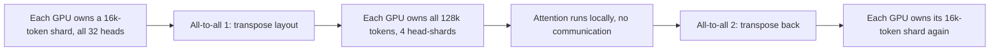
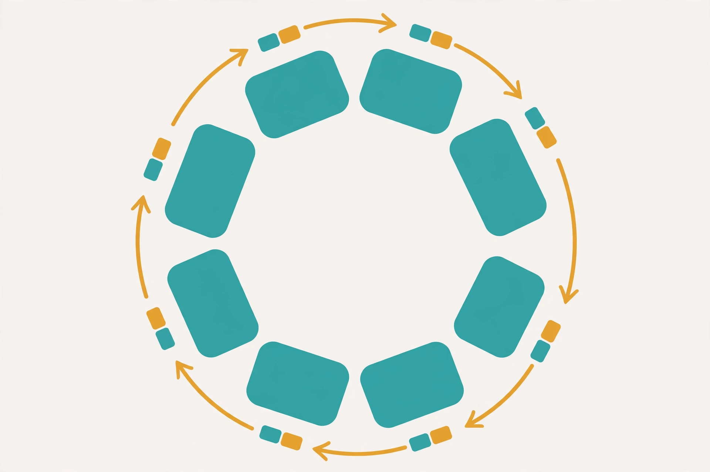
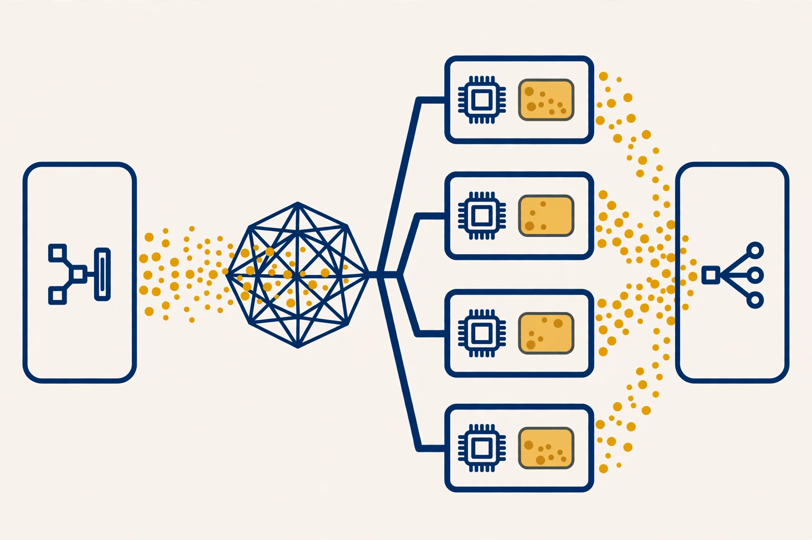
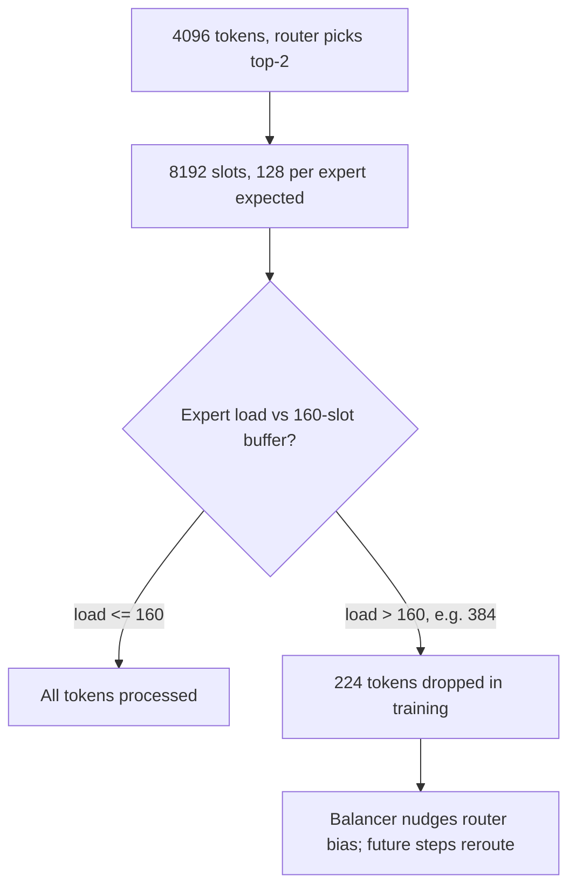
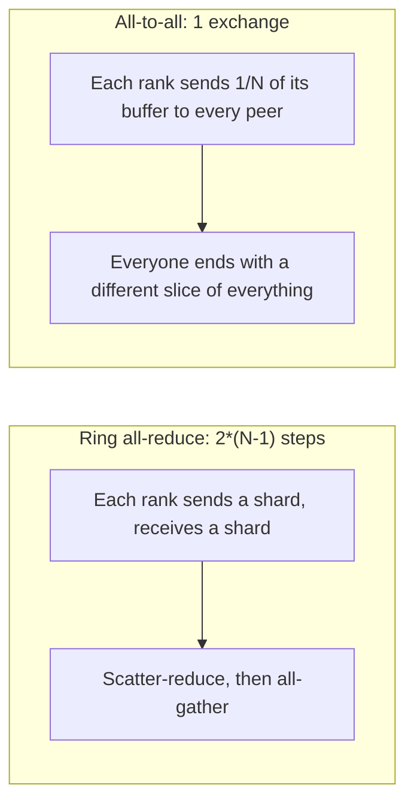
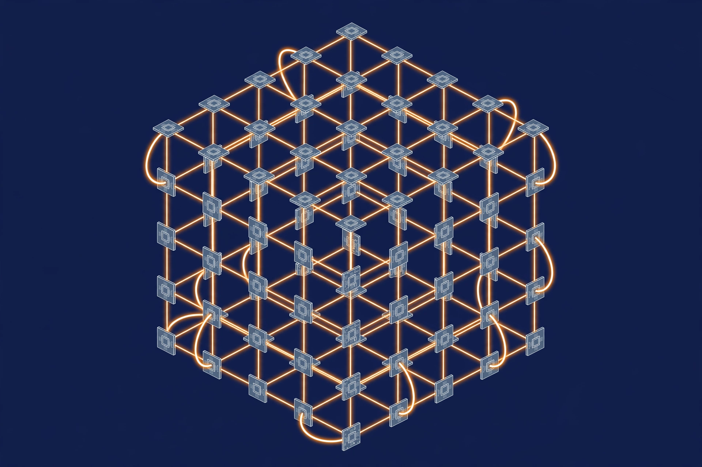
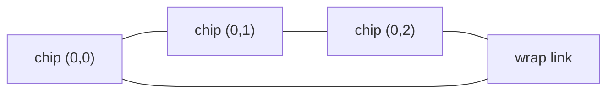
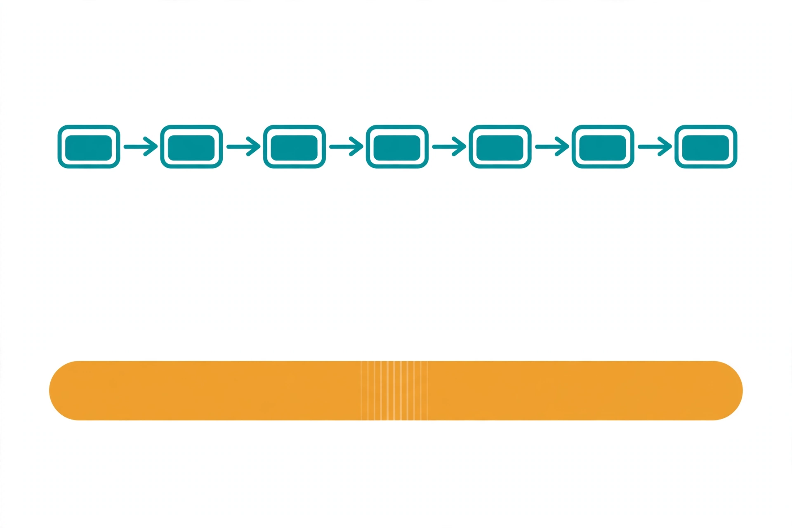
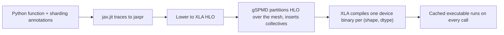

# Advanced Parallelism and Accelerators

Volume 6 built the core toolkit: data parallelism, ZeRO and FSDP, tensor parallelism, pipeline parallelism, and a first pass at sequence parallelism. This appendix goes two steps further.

**Part 1** covers the two strategies Volume 6 left shallow. Chapter 1 takes context parallelism past the overview: the exact communication patterns, when each design wins, and byte-level cost math. Chapter 2 covers expert parallelism, the strategy behind every large mixture-of-experts model shipping today. Chapter 3 is a byte-math cookbook that puts every strategy on the same model so you can compare them honestly.

**Part 2** leaves the GPU world. Chapter 4 maps TPU topology and pods. Chapter 5 compares the XLA compilation model against eager CUDA execution and shows how JAX sharding annotations express every parallel strategy from Part 1 on a TPU mesh.

By the end you will be able to estimate the communication cost of any parallel strategy before launching a job. You will also read a JAX training script as fluently as a PyTorch one.

## Part 1: Context and expert parallelism

## 1. Context parallelism in depth

### What it is

%%Context parallelism%% (CP) shards the sequence dimension of activations across GPUs. With 8-way CP and a 128k-token document, each GPU owns 16k tokens of every activation tensor. The weights do not change. The strategy exists to cut the activation pile, which is the pile that explodes as context grows.

### Why it exists

Data parallelism cannot split one long document. When the batch is a single sequence, data-parallel ranks have nothing to divide. Tensor parallelism splits weights, not the sequence, so every rank still holds the full sequence of activations. Attention work grows with the square of sequence length without flash attention. Activation memory grows at least linearly with it. Past 100k tokens, activations alone exceed any single GPU. Context parallelism is the strategy that cuts the sequence itself.

### How it works under the hood

The hard part is attention. Token i needs keys and values from tokens that may live on other GPUs. Two designs solve this, and they make opposite trade-offs.

**DeepSpeed-Ulysses.** Shard the sequence across GPUs. Before attention, run an all-to-all that transposes the layout. It flips from "each GPU holds all heads for its token shard" to "each GPU holds all tokens for its head shard". Attention then runs locally per head shard. A second all-to-all flips the layout back. Two all-to-all collectives per attention layer. The math is unchanged. The price is a transient memory spike: during attention, each GPU briefly holds all tokens (for its heads).

**Ring attention.** Keep the sequence sharded and compute attention blockwise. Softmax can be computed incrementally. Track a running maximum and a running normalization sum, and update both as each new key/value block arrives. Each GPU computes attention between its own query block and one K/V block, then passes that K/V block to its neighbor with a point-to-point send. The sends overlap with compute. Memory per GPU stays flat no matter how many GPUs join the ring.

**The load problem in causal models.** In a causal model, token t attends to t previous tokens, so late tokens cost more attention work than early ones. Naive contiguous sharding puts the cheap early tokens on GPU 0 and the expensive late tokens on GPU 7. The last rank does roughly twice the average work, and the step waits for it. The fix is striped (zigzag) sharding: GPU i gets chunks i and 2N-1-i. Every rank gets a mix of cheap and expensive tokens, and the load balances almost exactly.



::: walkthrough
1. Start at the left box. Eight GPUs each hold one eighth of the sequence, with all 32 attention heads for their tokens.
2. Follow the first arrow. The all-to-all redistributes the Q, K, V tensors so the sharding flips from the sequence axis to the head axis. Now each GPU holds every token but only 4 of the 32 heads.
3. Read the middle box. Because each GPU has all tokens for its heads, attention is a purely local computation. No GPU waits on another.
4. Follow the second arrow. A second all-to-all flips the layout back to sequence sharding for the output projection and the MLP that follow.
5. End at the right box. The rest of the layer proceeds exactly as it would without context parallelism.
:::



::: walkthrough
1. Each rounded tile is one GPU. It permanently owns its query block (its 16k tokens) and computes attention against key/value blocks.
2. The small paired squares riding the arrows are K/V blocks in flight. Each GPU sends its K/V block to its neighbor, receives the neighbor's block, computes one attention block, and repeats.
3. The arrows form a ring, so every K/V block visits every GPU exactly once. After 7 passes on 8 GPUs, each query block has seen all keys and values.
4. Because the send of block n+1 overlaps the compute on block n, the communication hides behind math. That overlap is the whole reason ring attention scales to million-token sequences.
:::

### Worked numbers: Ulysses versus ring on 128k tokens

Setup: S = 128,000 tokens, H = 4096, 32 heads, 32 layers, N = 8 GPUs, BF16 (2 bytes), batch 1. One activation tensor of shape [S, H] holds 128,000 × 4096 × 2 bytes = 1.05 GB.

**Ulysses.** All-to-all 1 moves Q, K, V: 3 × 1.05 = 3.15 GB of tensors. An all-to-all moves roughly tensor × (N-1)/N bytes on the fabric, so 3.15 × 7/8 = 2.76 GB. All-to-all 2 moves the output O: 1.05 GB of tensors, or 0.92 GB on the fabric. Forward pass per layer: about 3.7 GB. The backward pass needs the same two all-to-alls for gradients: another 3.7 GB. Per layer total: about 7.4 GB. Over 32 layers: about **237 GB per training step**.

**Ring attention.** Each GPU holds a K/V block for its 16k tokens: 2 × 16,000 × 4096 × 2 bytes = 262 MB. That block travels to all 7 neighbors, so each GPU sends 7 × 262 MB = 1.83 GB per layer. Fabric total: 8 × 1.83 = 14.7 GB per layer. That is roughly 4× more bytes than Ulysses.

The counterintuitive result stands: ring attention moves more bytes and still wins at extreme lengths. Overlapped bytes are free bytes, and flat per-GPU memory scales further than any transient spike allows. Choose Ulysses when the sequence fits comfortably and you want exact math with no code changes. Choose ring attention when sequences are so long that the all-tokens spike would run the job out of memory.

### Common misunderstanding

"Context parallelism shards attention heads across GPUs." No. That describes the transient layout Ulysses creates inside the attention call, not the strategy. CP shards the sequence dimension. The head sharding exists only between the two all-to-alls, then the layout flips back. If you size buffers assuming each GPU permanently holds its heads, you will misjudge memory by a factor of the sequence length.

::: lab Lab B1.1: blockwise softmax from scratch
Reproduce the ring-attention math trick in NumPy: full softmax attention versus incremental blockwise attention with a running max and normalization sum. Assert the max absolute difference is below 1e-5. Then simulate sharding: assign causal attention costs (token t costs t units) to 8 ranks with contiguous versus striped chunking, and print the slowest rank's load for each.
:::

```python
import numpy as np

# Blockwise softmax attention: proves the ring-attention math trick.
# We split K/V into blocks and accumulate attention incrementally,
# keeping only a running max (m) and normalization sum (l) per query.
# WHY this works: softmax can be rescaled. If we know the max of block 1
# and then see a larger max in block 2, we rescale block 1's partial
# output by exp(old_max - new_max) and continue. Nothing is lost.
# WHAT BREAKS if changed: using the block-local max without rescaling
# silently computes the wrong softmax (each block normalized alone).
# Complexity: O(S^2 * d) flops, same as full attention; O(S * d) memory
# for the running state instead of O(S^2) for the full score matrix.

def blockwise_attention(Q, K, V, block=256):
    # Q, K, V: (S, d). All float64 here so the correctness check is strict.
    S, d = Q.shape
    scale = 1.0 / np.sqrt(d)
    O = np.zeros_like(Q)          # running output accumulator
    l = np.zeros(S)               # running normalization sum per query
    m = np.full(S, -np.inf)       # running max per query
    for s in range(0, S, block):
        Kb, Vb = K[s:s+block], V[s:s+block]
        scores = (Q @ Kb.T) * scale          # (S, block): this block only
        bmax = scores.max(axis=1)            # block-local max per query
        new_m = np.maximum(m, bmax)          # running max absorbs the block
        # Rescale the OLD accumulator to the NEW max before adding more.
        # This single line is the entire trick; delete it and results rot.
        O = O * np.exp(m - new_m)[:, None]
        l = l * np.exp(m - new_m)
        w = np.exp(scores - new_m[:, None])  # stable block weights
        O = O + w @ Vb
        l = l + w.sum(axis=1)
        m = new_m
    return O / l[:, None]                    # final normalization

# Full attention as ground truth.
def full_attention(Q, K, V):
    scores = (Q @ K.T) / np.sqrt(Q.shape[1])
    scores = scores - scores.max(axis=1, keepdims=True)
    w = np.exp(scores) / np.exp(scores).sum(axis=1, keepdims=True)
    return w @ V

rng = np.random.default_rng(0)
Q, K, V = rng.normal(size=(512, 32)), rng.normal(size=(512, 32)), rng.normal(size=(512, 32))
diff = np.abs(blockwise_attention(Q, K, V) - full_attention(Q, K, V)).max()
print("max abs diff:", diff)
assert diff < 1e-5, "blockwise math diverged from full attention"
print("OK: incremental softmax matches full attention")
```

::: walkthrough
1. The loop walks K and V in 256-token blocks. For each block it computes scores against ALL queries, so no query ever waits for a missing block.
2. `new_m = maximum(m, bmax)` folds the block's max into the running max. The next two lines rescale the accumulated output and normalization sum to that new max. That rescaling is what keeps the softmax exact instead of approximate.
3. `w @ Vb` adds this block's contribution. After the last block, dividing by `l` finishes the normalization that a single softmax call would have done.
4. The assert at the bottom is the lab's pass criterion. If it fails, the rescaling lines are the first place to look.
:::

::: takeaway
- Context parallelism shards the sequence, not the weights and not permanently the heads.
- Ulysses pays two all-to-alls per layer for exact, code-simple attention with a transient memory spike.
- Ring attention pays more total bytes but overlaps them with compute and keeps memory flat, which is why it owns the million-token regime.
- Striped sharding fixes the causal load imbalance that contiguous sharding creates.
:::

## 2. Expert parallelism

### What it is

In a mixture-of-experts model, each transformer layer replaces its dense FFN with E small expert FFNs plus a router. For each token, the router scores all E experts and picks the top k, often 2 to 8. Only those k experts run for that token. %%Expert parallelism%% (EP) places different experts on different GPUs. Parameters scale with the number of experts. Active compute per token stays fixed at k experts' worth.

### Why it exists

Dense scaling multiplies compute with parameters. MoE breaks that link: DeepSeek-V3 carries 671B parameters but activates about 37B per token. The price is a new communication pattern. Tokens must travel to the GPUs that own their assigned experts, and results must travel back. Expert parallelism is how you place 256 experts across hundreds of GPUs without every GPU holding all of them.

### How it works under the hood

One MoE layer, forward pass, in order:

1. **Router.** A linear layer scores each token against every expert. Keep the top-k scores, apply a nonlinearity, and get gate weights.
2. **Dispatch.** Group tokens by destination expert. Permute them into per-expert buffers. One all-to-all sends each buffer to the GPU owning that expert. A token chosen by 2 experts appears in 2 buffers: it is sent twice.
3. **Expert compute.** Each GPU runs its experts on the tokens it received. Pure local GEMMs.
4. **Combine.** A second all-to-all returns each expert's outputs to the GPUs owning the original tokens. Weight each output by its gate value, sum, and add the residual.

**Capacity factor.** Each expert gets a fixed-size input buffer: capacity = (tokens × k / E) × capacity_factor. With 4096 tokens, k=2, E=64: expected load is 128 tokens per expert, and capacity factor 1.25 gives a 160-slot buffer. Tokens beyond the buffer are dropped during training. The drop is not a bug. The gradient still flows through the router, and the load-balancing objective pushes future tokens toward emptier experts.

**Dropless versus token-dropping.** Training uses fixed buffers and drops overflow: memory stays predictable, and imbalance gets punished where it hurts. Inference cannot drop a user's token, so serving systems use variable-size buffers (dropless). A hot expert just runs longer, and its tail latency shows up in serving metrics. DeepSeek-V3's stack made dropless training work at scale by pairing it with a stronger balancer.

**Load balancing.** Without pressure, the router collapses. It sends everything to a few favorite experts and the rest sit idle, wasting parameters. The classic fix is an auxiliary loss:

L_aux = alpha × E × sum over experts (f_i × P_i)

f_i is the fraction of tokens routed to expert i. P_i is the mean gate probability for expert i. The product is minimized when tokens spread evenly. Alpha is small, often 0.01, because this term fights the language-modeling loss for gradient share.

DeepSeek-V3 removed the auxiliary loss entirely. Each expert carries a bias added to its routing score only, never to the gradient. After each step, a gradient-free rule nudges busy experts' biases down and idle experts' up. Balance arrives without a competing objective. The paper reports better quality at equal compute than the aux-loss baseline.

**Hot experts.** Even with balance, real text is bursty: many tokens can want the same expert at the same moment. A 3× hot expert makes its GPU do 3× the work of its neighbors, and the step waits for the slowest rank. Three mitigations are standard. First, redundant experts: place copies of likely-hot experts on spare GPUs. V3's decode deployment reserves 64 GPUs for redundancy plus shared experts. Second, node-aware placement: constrain each token's experts to at most 4 nodes, also from the V3 design. Third, co-locate frequently co-selected experts on the same rank, so one token's two experts need no cross-rank hop.



::: walkthrough
1. Left box: the router. For each token it scores all experts and picks the top k. The amber dots streaming right are routed tokens heading into the network.
2. Center: the all-to-all fabric. Tokens scatter to whichever device owns their assigned expert. Note that the fan-out is data-dependent: the pattern changes every microbatch as routing decisions change.
3. Middle boxes: the expert devices. Each runs its local expert FFNs on the tokens it received. No device talks to another during this phase.
4. Right box: the combine. Expert outputs flow back through a second all-to-all to the devices owning the original tokens, get weighted by gate values, and summed.
:::

### Worked numbers: dispatch volume and drop math

Setup: 4096 tokens, top-2 of 64 experts, 8 GPUs (EP=8, 8 experts per GPU), H = 8192, BF16.

Dispatched slots = 4096 × 2 = 8192. Each slot carries one token vector: 8192 × 2 bytes = 16 KB. Dispatch all-to-all moves about 8192 × 16 KB = 134 MB per MoE layer. Combine returns the same volume: 134 MB. Forward pass: about 268 MB per layer. Backward pass: about the same again.

Now the drops. Uniform load per expert = 128 tokens. Capacity factor 1.25 gives a 160-slot buffer. A 3× hot expert receives 384 tokens. Overflow = 224 tokens, or 58% of its traffic, dropped in training. Its partner experts absorb the slack in later steps through the balancer.



::: walkthrough
1. Top box: routing turns 4096 tokens into 8192 expert slots, 128 per expert on average.
2. The diamond is the capacity check each expert applies independently. The 160-slot buffer comes from the 1.25 capacity factor.
3. Left path: a balanced expert processes everything it received.
4. Right path: the hot expert's 384 tokens overflow the buffer. 224 are dropped this step, and the balancer's bias nudge makes the router less likely to pick this expert next step.
:::

### Common misunderstanding

"More experts means more communication." False. Communication scales with top-k × tokens × hidden size. Expert count E does not appear in the formula. Doubling E doubles parameters and halves per-expert load, but the bytes on the wire stay flat. That is the whole point of MoE: capacity scales without scaling the network.

::: lab Lab B2.1: watch a router collapse, then fix it
Simulate routing: draw 8192 tokens, assign each to 2 of 64 experts from a skewed distribution (a few popular experts). Apply capacity factors 1.0, 1.25, and 1.5, and count dropped tokens for each. Then implement the bias-nudge rule: after each simulated step, decrease the bias of overloaded experts by a fixed step and increase the bias of idle ones. Run 200 steps and print the max-to-mean load ratio at step 0 and step 200.
:::

```python
import numpy as np

# Router collapse simulator: WHY it matters. A fresh router has favorites;
# without balancing pressure, a few experts drown while most sit idle.
# We model popularity as a skewed score per expert, route top-2 per token,
# apply a capacity buffer, and count drops. Then we add the DeepSeek-V3
# style bias nudge (gradient-free, applied to routing scores only) and
# watch the max/mean load ratio fall.
# WHAT BREAKS if changed: removing the bias update lets the ratio stay
# high forever (collapse). Setting the nudge step too large oscillates:
# experts take turns being hot instead of balancing.

rng = np.random.default_rng(7)
T, E, K = 8192, 64, 2          # tokens, experts, top-k
CAP_FACTOR = 1.25
# Skewed popularity: expert 0 is ~10x more attractive than expert 63.
popularity = 1.0 / (1 + np.arange(E) * 0.15)
bias = np.zeros(E)             # per-expert routing bias, starts neutral
expected = T * K / E           # 256 slots per expert if uniform
capacity = int(expected * CAP_FACTOR)

def route_once(bias):
    # Scores = popularity + bias; each token takes its top-2 experts.
    # (Real routers score per token; popularity stands in for the
    # learned affinity here so the skew is reproducible.)
    scores = popularity + bias
    topk = np.argsort(scores)[-K:]          # same for all tokens here
    loads = np.zeros(E, dtype=int)
    loads[topk] = T                          # every token picks these two
    return loads

def step(nudge=0.02):
    global bias
    loads = route_once(bias)
    dropped = np.maximum(loads - capacity, 0).sum()
    # V3-style nudge: busy experts get a negative bias, idle get positive.
    # Applied to SCORES only; no gradient ever sees this term.
    bias = bias - nudge * np.sign(loads - expected)
    ratio = loads.max() / loads.mean()
    return dropped, ratio

for cf in (1.0, 1.25, 1.5):
    capacity = int(expected * cf)
    dropped, ratio = step(nudge=0.0)   # one step, no balancing yet
    print(f"capacity factor {cf}: dropped={dropped} max/mean={ratio:.1f}")
```

::: walkthrough
1. `popularity` builds the skew: early experts attract far more tokens, which is what an unconstrained learned router looks like.
2. `route_once` assigns every token to the same top-2 experts (a simplification that isolates the balancing dynamics from per-token noise).
3. The capacity loop shows the drop count at three capacity factors before any balancing. Expect heavy drops at 1.0.
4. The nudge line is the load balancer: `sign(loads - expected)` pushes hot experts down and cold experts up by a fixed step. Extend the script to call `step()` 200 times and print the ratio at step 0 versus step 200 to see the collapse resolve.
:::

::: takeaway
- Expert parallelism moves tokens to experts (dispatch) and results back (combine): two all-to-alls per MoE layer.
- Communication scales with top-k, tokens, and hidden size. Expert count is absent from the cost.
- Capacity factor bounds per-expert buffers; overflow drops in training and becomes tail latency in serving.
- Balance comes from an auxiliary loss or a gradient-free bias nudge; without it the router collapses onto a few experts.
:::

## 3. All-to-all byte math: every strategy on one model

### What it is

A cookbook. For each parallel strategy, how many bytes cross the fabric per layer? Two formulas answer that.

- All-reduce of B bytes on N ranks moves about 2 × B × (N-1)/N bytes total.
- All-to-all of B bytes on N ranks moves about B × (N-1)/N bytes total.

The (N-1)/N term: each rank keeps 1/N of its data local and sends the rest. An all-reduce costs roughly twice an all-to-all on the same tensor because it must both scatter partial results and gather the final one.

### Why it exists

Strategy debates go in circles without numbers. "Tensor parallelism is communication-heavy" and "expert parallelism is communication-heavy" are both true and both useless. The table below puts every strategy on the same model and the same step, so you can see where the bytes actually go. The skill transfers: any new strategy is just another row in the table.

### How it works under the hood

Four collectives, four strategies:

- **Data parallel:** one all-reduce of gradients per step, on the full parameter set.
- **Tensor parallel:** two all-reduces per layer per direction (attention out-projection, MLP down-projection), each on a [S, H] activation tensor.
- **Context parallel (Ulysses):** two all-to-alls per layer per direction (QKV out, outputs back), on [S, H] tensors.
- **Expert parallel:** dispatch plus combine all-to-all per MoE layer, volume = tokens × k × H × 2 bytes each way.



::: walkthrough
1. Left: a ring all-reduce needs two phases. First ranks pass partial sums around the ring (scatter-reduce), then they pass the finished shards around again (all-gather). Two trips around the ring is where the factor of 2 comes from.
2. Right: an all-to-all is a single exchange. Each rank slices its buffer into N pieces and hands one piece to each peer. One trip, factor of 1.
3. Both run on the same links at the same speed. The cost difference between strategies comes from how many collectives each layer needs and on what tensor sizes, not from the collective's name.
:::

### Worked numbers: one model, four strategies

Setup: S = 32,000 tokens, H = 8192, L = 64 layers, N = 8 GPUs, BF16, P = 70B parameters. One [S, H] tensor holds 32,000 × 8192 × 2 bytes = 537 MB. (The MoE row assumes the 64 layers are MoE layers with 128 experts, top-4, and a 4096-token microbatch.)

| Strategy | Collectives | Bytes per step |
|---|---|---|
| Data parallel | 1 all-reduce of gradients | 2 × 140 GB × 7/8 = **245 GB** |
| Tensor parallel (8-way) | 4 all-reduces per layer on 537 MB | 4 × 940 MB × 64 = **241 GB** |
| Context parallel (8-way) | 4 all-to-alls per layer | 4 × 940 MB × 64 = **241 GB** |
| Expert parallel (8-way) | 2 all-to-alls per MoE layer on 268 MB | 4 × 268 MB × 64 = **69 GB** |

How each row is built. DP: gradients are P × 2 bytes = 140 GB; one all-reduce moves 2 × 140 × 7/8 = 245 GB. TP: each all-reduce moves 2 × 537 MB × 7/8 = 940 MB; 4 per layer (2 forward, 2 backward) × 64 layers = 241 GB. CP: each all-to-all moves 940 MB on average across the QKV and output tensors; same 4-per-layer pattern gives 241 GB. EP: each direction moves 4096 × 4 × 8192 × 2 bytes = 268 MB; 4 exchanges per layer (dispatch and combine, forward and backward) × 64 = 69 GB. The EP row is smaller because its microbatch is 4096 tokens, not 32k; normalize per token and it sits between TP and CP.

The punchline: TP and CP move almost the same bytes in this example. The difference is never the bytes. TP cuts weight memory. CP cuts activation memory. Pick by which pile is killing your job.

One more lever: bytes that overlap with compute are free. Ring attention and pipelined schedules exist to move bytes into the shadow of math. A strategy with higher byte counts but better overlap can beat a leaner one on the clock.

### Common misunderstanding

"All-to-all is slower than all-reduce." Same fabric, same links. An all-reduce moves roughly twice the bytes of an all-to-all on the same tensor. What matters is how many collectives each layer needs and on what tensor sizes. In the table, TP's four all-reduces cost about the same as CP's four all-to-alls. The expensive strategy is the one you call most often on the biggest tensors, not the one with the scarier name.

::: lab Lab B3.1: build your own row
Write a Python function `bytes_per_step(strategy, S, H, L, N, P)` that returns the fabric bytes for DP, TP, CP, and EP using the two formulas above. Plug in your own model config. Print the table. Then change N from 8 to 64 and watch the (N-1)/N term saturate. Beyond 16 ranks it barely moves. That is why adding GPUs stops helping communication-bound layers.
:::

```python
# Byte-math estimator: turns any parallel plan into fabric bytes per step.
# WHY these formulas: an all-reduce must scatter partial sums and gather
# results (factor 2); an all-to-all is a single exchange (factor 1).
# Each rank keeps 1/N of its data, so (N-1)/N of every tensor crosses
# the fabric. WHAT BREAKS if changed: dropping the factor of 2 on
# all-reduce undercounts DP/TP by 2x, the most common estimation error.

def allreduce_bytes(tensor_bytes, n):
    return 2 * tensor_bytes * (n - 1) / n

def alltoall_bytes(tensor_bytes, n):
    return tensor_bytes * (n - 1) / n

def bytes_per_step(strategy, S, H, L, N, P=70e9, T=4096, k=4, E=128):
    sh = S * H * 2  # one [S, H] activation tensor, BF16
    if strategy == "dp":
        return allreduce_bytes(P * 2, N)            # grads, once per step
    if strategy == "tp":
        return 4 * allreduce_bytes(sh, N) * L       # 2 fwd + 2 bwd
    if strategy == "cp":
        return 4 * alltoall_bytes(sh, N) * L        # QKV out, O back, x2
    if strategy == "ep":
        slot = T * k * H * 2                        # one direction
        return 4 * slot * (N - 1) / N * L           # dispatch+combine, x2
    raise ValueError("unknown strategy: " + strategy)

for s in ("dp", "tp", "cp", "ep"):
    gb = bytes_per_step(s, S=32000, H=8192, L=64, N=8) / 1e9
    print(f"{s:3s}: {gb:7.1f} GB/step")
```

::: takeaway
- Two formulas cover everything: all-reduce ≈ 2×B×(N-1)/N, all-to-all ≈ B×(N-1)/N.
- On the same model, TP and CP move nearly identical bytes; they differ in which memory pile they cut.
- EP bytes scale with top-k × tokens × hidden size; the 69 GB row is small only because its microbatch is small.
- Overlap decides wall-clock cost more than byte counts do.
:::

::: provenance
**Last verified: September 2026.** Live-verified: the DeepSpeed-Ulysses two-all-to-all design; ring-attention blockwise softmax with running statistics; striped/zigzag sharding for causal load balance. Also live-verified: DeepSeek-V3 architecture from arXiv:2412.19437. That means 671B total parameters and ~37B active per token. It uses 256 routed experts plus shared experts, top-8 gating, auxiliary-loss-free bias balancing, and tokens constrained to at most 4 nodes. **UNVERIFIED:** exact per-layer byte totals on real hardware. The formulas are first-principles estimates; NCCL/RCCL efficiency and overlap vary by cluster. Also unverified: DeepSeek-V3 decode deployment details (EP320, 64 redundant GPUs) as reported by secondary write-ups of the paper.
:::

## Part 2: TPU and XLA

## 4. TPU topology and pods

### What it is

A TPU is Google's matrix-multiply accelerator. At its heart is a systolic array called the MXU. It streams data through a grid of multiply-accumulate units. You cannot buy one. You rent slices of pods on Google Cloud. A pod wires hundreds or thousands of chips into one fabric with a dedicated chip-to-chip link called ICI (inter-chip interconnect). The DeepMind track runs here, so you need the map.

### Why it exists

The GPU world builds clusters from nodes: 8 GPUs joined by NVLink inside a box, boxes joined by InfiniBand. The TPU world has no boxes. Every chip in a pod connects directly to its neighbors in a torus mesh, with no switches and no host boundaries for collectives. That changes which parallel strategies are cheap. Anything that maps to neighbor communication thrives. Anything that assumes a fast 8-device island with slow uplinks does not.

### How it works under the hood

**Torus mesh.** Each chip links to its neighbors in ±x and ±y (plus ±z on 3D generations), with the edges wrapping around. A v6e pod is a 2D torus: 16×16 = 256 chips, each chip one hop from 4 neighbors. Ironwood pods restore the 3D torus at 9216 chips. No switch means no oversubscription inside the pod. Bisection bandwidth grows with the mesh, and collectives like all-reduce run as dimension-ordered rings with predictable per-hop cost.

**Slices.** You rarely rent a full pod. A slice is a sub-mesh: a v6e slice of 8 chips on one host uses a 2×4 topology and needs no multi-host coordination. Larger slices span hosts and coordinate through a leader/worker setup. Multislice (the Pathways system) stitches many pods together over Google's Jupiter datacenter network for 10k+ chip jobs.

**Generations.** The ladder that matters for training work:

| Generation | Codename | HBM per chip | Peak compute | ICI | Topology | Pod max |
|---|---|---|---|---|---|---|
| TPU v4 | (no codename) | 32 GB HBM2 | 275 BF16 TFLOPS | n/a | 3D torus | 4,096 chips |
| TPU v5e | Efficient | 16 GB HBM2 | ~197 INT8 TOPS | ~800 Gb/s | 2D torus | 256 chips |
| TPU v5p | Performance | 95 GB HBM3 | 459 BF16 TFLOPS | ~4.8 Tb/s | 3D torus | 8,960 chips |
| TPU v6e | Trillium | 32 GB HBM3 | ~918 BF16 TFLOPS | ~2× v5e | 2D torus | 256 chips |
| TPU v7 | Ironwood | 192 GB HBM3e | 4,614 FP8 TFLOPS | 1.2 TB/s bidir. | 3D torus | 9,216 chips |

Trillium doubled the MXU to 256×256 and doubled HBM and ICI over v5e. Ironwood is the first TPU with native FP8. It uses a dual-chiplet design with two TensorCores and four SparseCores per chip. Its 9,216-chip pod delivers 42.5 FP8 exaflops.



::: walkthrough
1. Each small tile is one TPU chip. The amber lines are ICI links to its direct neighbors.
2. Follow any row of chips to its edge: the curved links at the boundary loop back to the opposite edge. That wrap-around is what makes it a torus instead of a grid. No chip is ever more than a few hops from any other.
3. There are no switches in the picture, because there are none in the pod. Every link is chip-to-chip, which is why collectives map to dimension-ordered rings instead of tree reductions through a switch hierarchy.
:::



::: walkthrough
1. Three chips in one torus row connect to their immediate neighbors.
2. The wrap link connects the last chip back to the first. That single extra link halves the worst-case hop count for the row.
3. A 2D torus is this ring in two dimensions at once; a 3D torus adds the third. Every collective the compiler emits travels along these rings.
:::

### Worked numbers

- **v6e pod memory:** 256 chips × 32 GB = 8 TB of HBM in one pod.
- **Full-model all-reduce of a 671B-parameter model in FP8:** 671 GB of gradients. A ring all-reduce moves about 2 × 671 = 1.34 TB. At roughly 200 GB/s per chip of ICI, one full sync takes about 6.7 seconds. The lesson: at pod scale you never sync full parameters every step. You shard them, which is what Chapter 5 shows.
- **Ironwood pod peak:** 9,216 × 4.614 PFLOPS = 42.5 FP8 exaflops.
- **v5p pod memory:** 8,960 × 95 GB = 851 TB of HBM.

### Common misunderstanding

"A TPU pod is Google's version of a DGX cluster." The DGX model is islands. NVLink is blazing inside the node. InfiniBand is slower between nodes. So you map tensor parallelism inside the node and data parallelism across nodes. A pod has no islands. ICI bandwidth is uniform across the mesh, and the torus gives every chip equal standing. Port a "TP-inside, DP-across" plan blindly and you waste the mesh. The JAX device mesh lets you name axes to match the torus instead of fighting it.

::: lab Lab B4.1: bisection bandwidth of a torus
Write a Python function for an n×n 2D torus: bisection bandwidth = 2 × n × link_bw (cutting the torus in half severs 2n links). Compare with a switched fabric of the same chip count at fixed uplink bandwidth. Plot both as n grows from 4 to 32 and note where the torus pulls away.
:::

```python
# Torus bisection bandwidth: WHY it matters. Collectives like all-reduce
# are bottlenecked by the narrowest cut through the network. A torus has
# no switches, so its bisection grows with the mesh itself.
# WHAT BREAKS if changed: forgetting the wrap-around links undercounts
# the cut by 2x. Each severed link counts once per direction crossed.

def torus_bisection(n, link_gbps):
    # n x n 2D torus. A vertical cut severs n links on the top edge of
    # the cut and n on the bottom (the wrap links count too): 2n links.
    # Each link is bidirectional; bisection counts one direction.
    return 2 * n * link_gbps

def switched_bisection(n_chips, uplink_gbps):
    # Switched fabric: bisection is capped by total uplink bandwidth,
    # which does NOT grow when you add chips behind the same switches.
    return n_chips * uplink_gbps / 2

for n in (4, 8, 16, 32):
    t = torus_bisection(n, 1600)
    s = switched_bisection(n * n, 200)
    print(f"{n}x{n}: torus {t/1000:.1f} Tb/s vs switched {s/1000:.1f} Tb/s")
```

::: takeaway
- A TPU pod is a switchless torus mesh, not a cluster of NVLink islands.
- ICI gives uniform-ish bandwidth across the whole pod; topology-aware collectives beat island-based plans.
- Slices rent sub-meshes; multislice stitches pods over the datacenter network.
- At pod scale, full-parameter syncs take seconds: sharding is mandatory, not optional.
:::

## 5. XLA versus eager, and JAX sharding

### What it is

Two ways to run math on an accelerator. %%Eager execution%% (PyTorch default): each Python op launches its own kernel, one at a time, with Python overhead between launches. %%Compiled execution%% (XLA, torch.compile): trace the whole function into a graph, fuse ops into a few big kernels, then run. JAX is compiled-only. `jax.jit` traces your Python function, lowers it to XLA's HLO intermediate representation, and compiles a device binary. TPUs were built for this model: the MXU wants big, static, fused matmuls, not a stream of tiny kernels.

### Why it exists

On a GPU you can prototype eagerly and compile later. On a TPU there is no eager mode worth using: the stack (JAX, PyTorch/XLA) goes through XLA by construction. On a TPU team, your mental model of "what the machine runs" must change from "my Python loop" to "the compiled program". Sharding annotations are part of that program: you tell the compiler how tensors split across chips, and it inserts the collectives.



::: walkthrough
1. Top row: eager execution. Each box is one op, each arrow a kernel launch with Python overhead between them. Seven launches for seven ops, and every intermediate tensor round-trips through memory.
2. Bottom bar: the compiled version. The compiler saw the whole chain at once, fused the ops, and emitted one pipeline. One launch, intermediates stay in registers or SRAM.
3. The gap between the rows is why TPU code is written for the compiler: on a systolic array, launch overhead and memory round-trips dominate unless fusion removes them.
:::

### How it works under the hood

**Tracing.** `jax.jit` runs your function once with abstract tracers instead of real arrays. Every NumPy op records into a jaxpr, JAX's tiny intermediate representation. Control flow must be trace-compatible: a Python `if` on a traced value is forbidden; use `jnp.where` or `lax.cond`. Shapes must be static: one compiled binary per (shape, dtype) key. Change the sequence length and you pay a recompile. The standard answer is bucketed padding: round lengths up to a fixed set of buckets.

**HLO and fusion.** The jaxpr lowers to HLO. XLA fuses elementwise chains into single kernels (one memory pass instead of five), assigns memory layouts, and schedules. A 20-op normalization block costs one kernel launch under XLA and twenty under eager.

**Sharding.** A device mesh is a logical N-D grid over physical chips: `mesh = jax.make_mesh((8, 4), ('dp', 'tp'))`. A `PartitionSpec` names which mesh axis shards each tensor axis: `P('tp', None)` shards axis 0 over the `tp` axis and replicates axis 1. `NamedSharding(mesh, spec)` attaches the spec to arrays. gSPMD, XLA's partitioning pass, rewrites the HLO so each chip computes its shard and inserts collectives (all-reduce, all-gather, all-to-all) wherever shards must meet. `lax.with_sharding_constraint` pins an intermediate's sharding when the compiler's guess is wrong.

**The pjit note.** Old tutorials call `jax.experimental.pjit`. That standalone API is gone: its features merged into `jax.jit`. If a blog post tells you to import pjit, it is outdated. Modern code is `jax.jit` plus sharding annotations, exactly as below.



::: walkthrough
1. You write plain Python with `jax.jit` and annotate how tensors shard. Nothing in the function body mentions devices.
2. The tracer records every op into a jaxpr. This is also where dynamic Python (untraceable `if`, data-dependent shapes) fails loudly instead of silently.
3. Lowering turns the jaxpr into HLO, XLA's graph format. gSPMD then partitions that graph across your mesh and inserts the all-reduces and all-to-alls your annotations imply.
4. XLA compiles the partitioned graph once per shape key and caches it. Every later call with the same shapes reuses the binary with zero Python overhead.
:::

### Worked example: data plus tensor parallelism on 32 chips

Mesh: (8, 4) over 32 chips, axes named `('dp', 'tp')`. Model: MLP up-projection W1 of shape [8192, 28672], down-projection W2 of shape [28672, 8192], input x of shape [batch, S, 8192].

- W1 gets `P(None, 'tp')`: sharded on its output dim. Each tp-column holds 8192 × 7168 = 117 MB in BF16, replicated across the 8 dp rows.
- W2 gets `P('tp', None)`: sharded on its input dim. Each tp-column holds 7168 × 8192 = 117 MB.
- x gets `P('dp', None, None)`: each dp row sees a different microbatch.

Forward pass: `x @ W1` needs no communication, because each tp-column computes its own output slice. `h @ W2` produces partial sums that XLA all-reduces over the `tp` axis before the residual add: 8192 × 2 bytes = 16 KB per token on the wire. Data parallelism falls out of the `dp` axis: 8 different microbatches, gradients all-reduced over `dp` once per step. This is Megatron-style tensor parallelism expressed as two annotations.

How the strategies map across GPU and TPU:

| Strategy | PyTorch/GPU idiom | JAX/TPU idiom |
|---|---|---|
| Data parallel | DDP / FSDP | Mesh `data` axis, batch sharded with `P('data', ...)` |
| Tensor parallel | Megatron column/row splits | Mesh `model` axis, `P('model', None)` / `P(None, 'model')` |
| Pipeline parallel | Stage assignment | Mesh `pipe` axis or manual stage code |
| Expert parallel | EP all-to-all | Experts over an `expert` axis, `lax.all_to_all` or `shard_map` |
| Context parallel | Ulysses / ring | `P('cp', None)` on the sequence axis |

### Common misunderstanding

"XLA means you cannot do dynamic shapes at all." You can, at the price of one compilation per shape. Production TPU code pads inputs to bucket boundaries (128, 256, 512, and so on) and compiles once per bucket. The padding wastes a little compute. Recompiling on every length wastes far more.

::: lab Lab B5.1: read a sharding like a local
Run the snippet below (it inspects shardings without needing 32 chips). Print each array's `.sharding` and check: W1 sharded on axis 1 only, W2 on axis 0 only, x on the batch axis only. Then lower the jitted function and count the collectives XLA inserted: you should find one all-reduce over the `tp` axis in the forward pass.
:::

```python
import jax
import jax.numpy as jnp
from jax.sharding import NamedSharding, PartitionSpec as P
from jax import lax

# A 32-chip job expressed as annotations: the function body never
# mentions devices. WHY this style: the same code runs on 8 chips or
# 8192 by changing the mesh shape only. The compiler derives every
# collective from the specs below.
# WHAT BREAKS if changed: swapping W1 to P('tp', None) shards its INPUT
# dim, so x @ W1 would need an all-gather of x first: silent extra
# communication on every forward pass. The column/row pairing is load
# bearing: first GEMM shards outputs, second shards inputs.
# pjit note: jax.experimental.pjit is gone; jax.jit absorbed it. Any
# tutorial importing pjit is outdated.

# Logical mesh: 8-way data parallel x 4-way tensor parallel = 32 chips.
mesh = jax.make_mesh((8, 4), ('dp', 'tp'))

# NamedShardings: which mesh axis shards which tensor axis.
W1_spec = NamedSharding(mesh, P(None, 'tp'))  # [8192, 28672] -> 8192x7168/chip
W2_spec = NamedSharding(mesh, P('tp', None))  # [28672, 8192] -> 7168x8192/chip
x_spec = NamedSharding(mesh, P('dp', None, None))  # batch sharded over dp

def mlp_block(x, W1, W2):
    # Pin the intermediate: without this, XLA may replicate h across tp
    # and pay an all-gather. The constraint keeps h sharded like W1's
    # output, so the only collective is W2's partial-sum all-reduce.
    h = jax.nn.gelu(x @ W1)
    h = lax.with_sharding_constraint(h, NamedSharding(mesh, P('dp', None, 'tp')))
    out = h @ W2  # partial sums; XLA inserts psum over 'tp' here
    return out + x  # residual: x is replicated over tp, shapes agree

jit_mlp = jax.jit(mlp_block, in_shardings=(x_spec, W1_spec, W2_spec),
                  out_shardings=x_spec)

# Inspect: no devices needed, shardings are logical until compiled.
print("W1 sharding:", W1_spec)
print("W2 sharding:", W2_spec)
print(" x sharding:", x_spec)
```

::: walkthrough
1. `make_mesh((8, 4), ('dp', 'tp'))` builds the logical grid. Names, not positions, are what the specs refer to, which is why the code survives a move from 32 chips to 8,192.
2. The three specs are the entire parallel plan. W1 shards its output dim, W2 shards its input dim, and the batch shards over `dp`. Everything else is derived.
3. Inside `mlp_block`, the `with_sharding_constraint` on `h` is the one line that separates a clean single-all-reduce plan from a sloppy one. Without it, XLA is free to replicate `h` and insert an all-gather you did not budget for.
4. `in_shardings` / `out_shardings` on `jax.jit` are the modern replacement for the old pjit call signature. Same power, one API.
5. The prints at the bottom let you verify the plan on a laptop: sharding objects are logical and cost nothing to inspect.
:::

::: takeaway
- JAX is compiled-only: trace to jaxpr, lower to HLO, partition with gSPMD, compile once per shape key.
- Static shapes are a feature with a price; bucketed padding is the standard payment.
- A device mesh plus PartitionSpecs expresses DP, TP, PP, EP, and CP as annotations; the compiler inserts the collectives.
- `pjit` as a standalone API is gone; `jax.jit` with sharding annotations is the current spelling.
:::

::: provenance
**Last verified: September 2026.** Live-verified: TPU v6e/Trillium specs from Google Cloud announcements (32 GB HBM3, ~918 BF16 TFLOPS, 256x256 MXU, 256-chip 2D torus pods). Also live-verified: TPU v7/Ironwood specs from 2025-2026 coverage (192 GB HBM3e, 4,614 FP8 TFLOPS, dual-chiplet, 9,216-chip pods at 42.5 FP8 exaflops). Also live-verified: the JAX sharding API from current JAX docs and changelog (`jax.make_mesh`, `NamedSharding`, `PartitionSpec`, `lax.with_sharding_constraint`, pjit merged into `jax.jit`). **UNVERIFIED:** exact per-chip ICI bandwidth for v6e. Sources conflict between 1,600 and 3,200 Gb/s; the all-reduce timing above uses Google's white-paper figure of ~2x v5e. Also unverified: TPU 8t/8i specs and GA dates (announced April 2026, dates conflict across sources). Also unverified: the v5p ICI figure (~4.8 Tb/s from secondary sources).
:::
