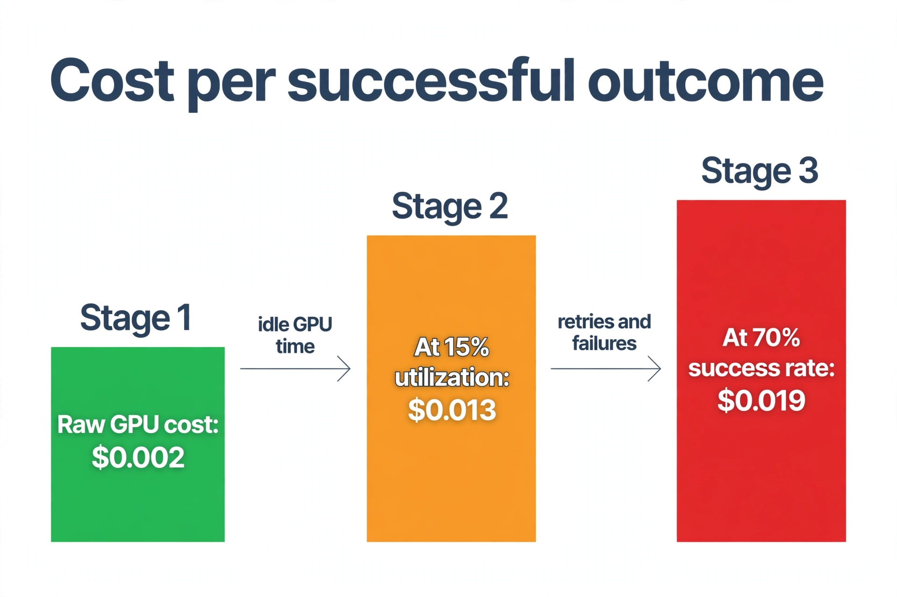
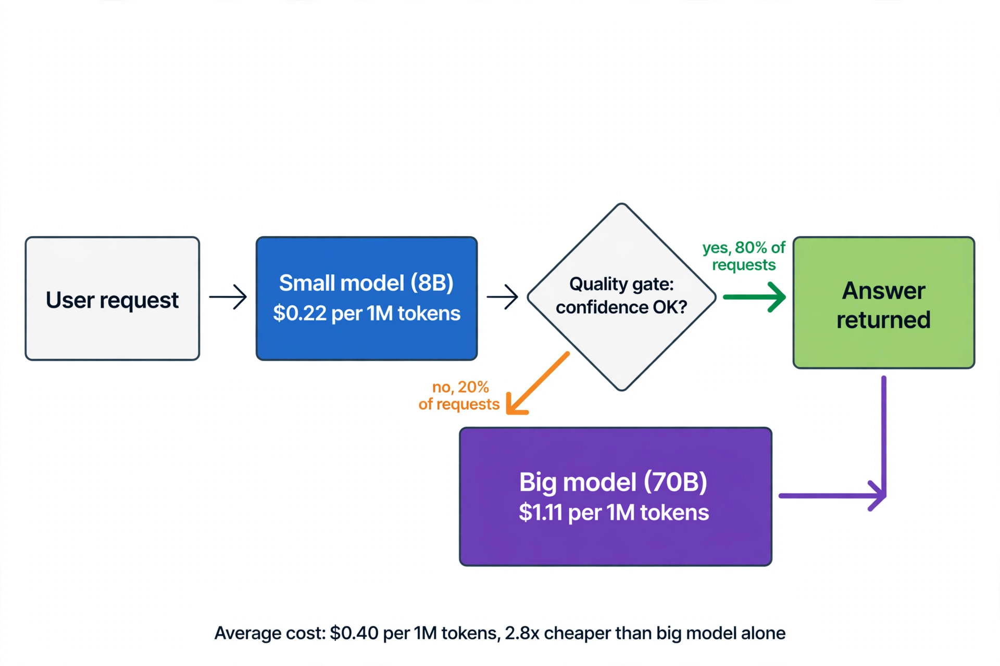
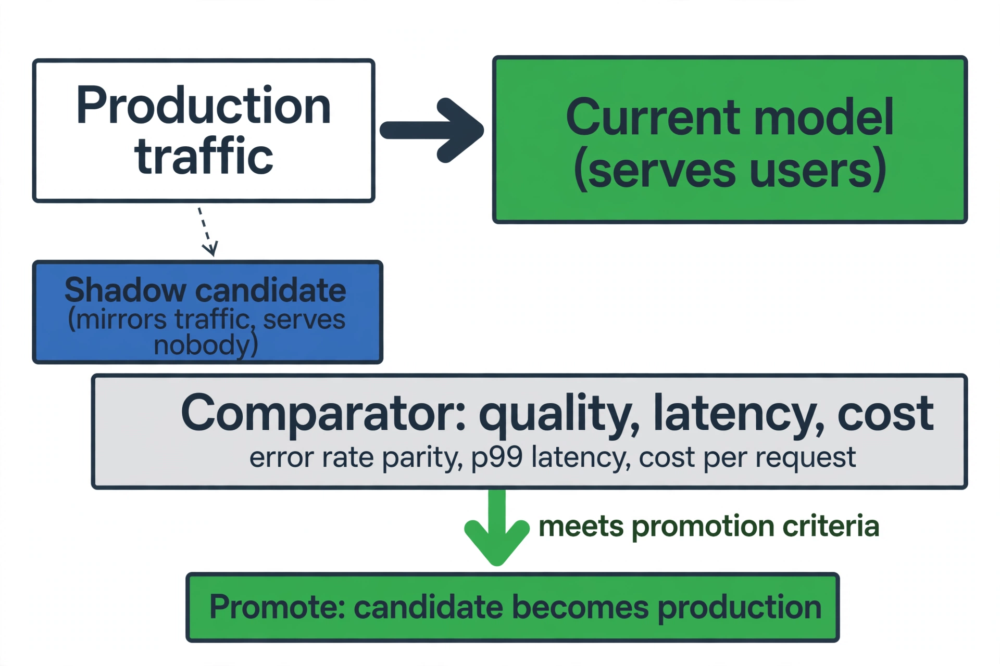
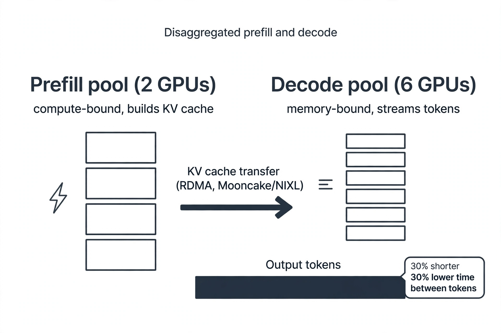
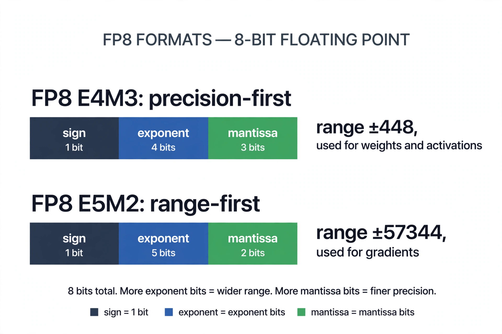
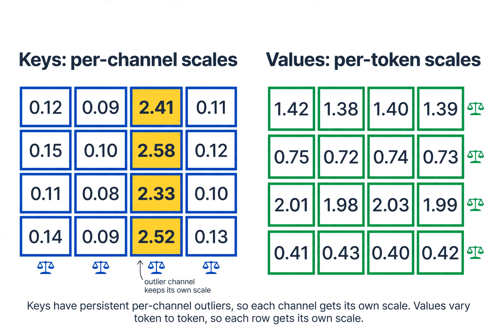
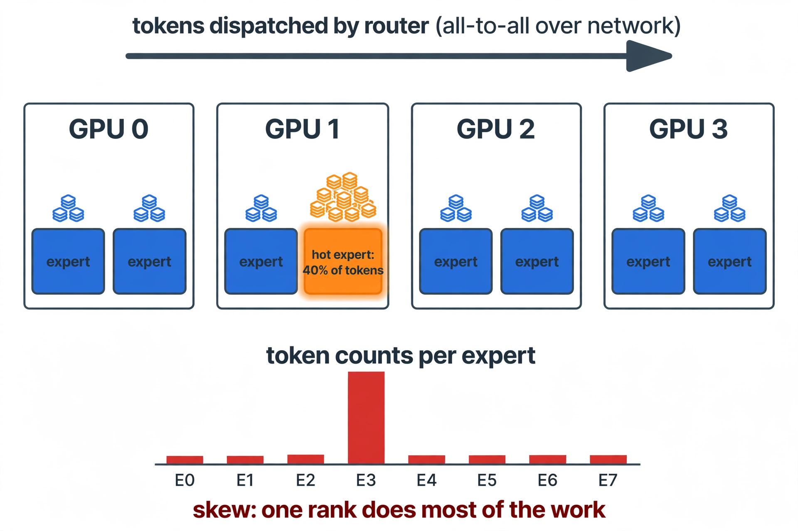
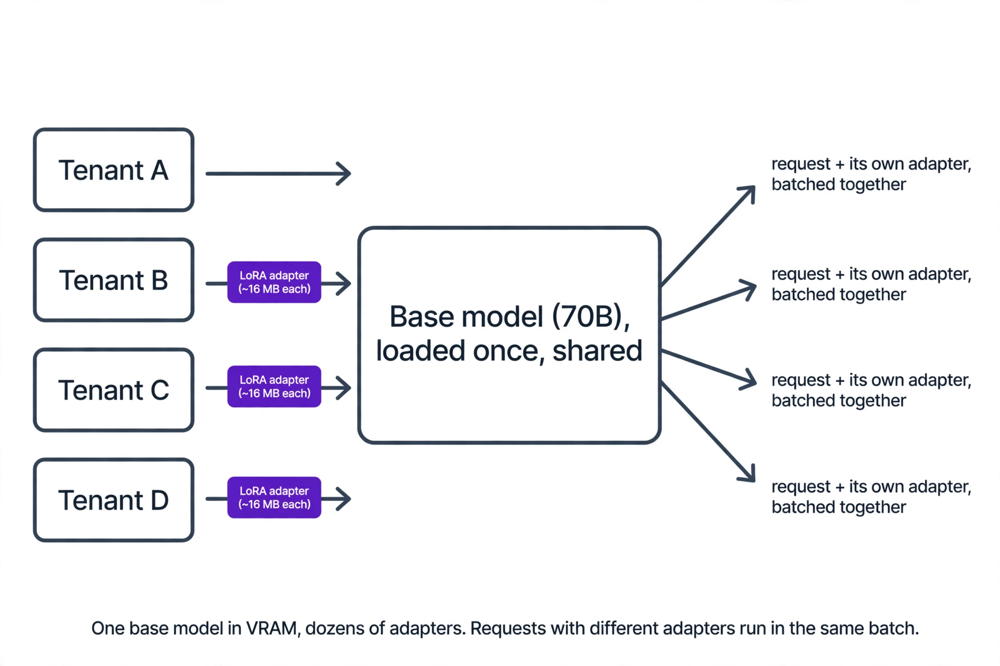

Volume 8 taught you to serve a model: the generate loop, batching, the KV cache, quantization, and honest benchmarking. This supplement answers the question that decides whether a serving stack survives in production. That question: **what does each good answer actually cost, and how do you drive that number down without breaking quality?**

Four chapters cover the economics: measuring cost per successful outcome, routing and cascades, shadow traffic for safe rollouts, and prefill/decode disaggregation. Four short patch chapters then fill the gaps the verification pass found thin in Volume 8: FP8 quantization, KV-cache quantization for keys vs values, MoE serving, and multi-tenant LoRA serving.

Every worked number in this supplement is an illustrative example built from real pricing, not a measured benchmark. The goal is the method: you should be able to redo this math for your own model, your own GPUs, and your own traffic.

## 1. Cost per successful outcome

### What it is

Cost per successful outcome is the full price of one request that a user would call good, including everything you paid for the ones that were not. It has three layers:

1. **Raw GPU cost per request.** GPU price times GPUs times seconds, divided by requests.
2. **Utilization adjustment.** Idle GPUs still bill. If your fleet sits idle 85% of the time, each request pays for 6.7 requests worth of GPU.
3. **Success adjustment.** Retries, fallbacks, and bad answers cost money too. If 30% of attempts fail, each success carries the cost of 1 / 0.70 = 1.43 attempts.

%%Cost per successful outcome%% = raw cost per request / (utilization × success rate).

### Why it exists

Two teams can serve the same model and differ 10x in cost. The difference is almost never the GPU price. It is utilization and retries. Here is the trap: you optimize raw latency while ignoring the success rate. Per-token cost halves, but the faster model hallucinates more, retries double, and the "cheaper" stack costs more per good answer.

### How it works under the hood

Start with the hardware. A 70B model in BF16 needs 140 GB just for weights (70 billion params × 2 bytes). That means two 80 GB H100s, with a little room left for the KV cache. Cloud pricing in September 2026 puts an on-demand H100 around $2.89/hr; round to $3 for the arithmetic.

- Fleet cost: 2 GPUs × $3/hr = **$6/hr**.
- Sustained throughput at healthy batching: ~1,500 tokens/second (illustrative).
- Tokens per hour: 1,500 × 3,600 = 5.4M.
- Cost per 1M tokens at full utilization: $6 / 5.4 = **$1.11**.

Batching is the first multiplier. Decode is memory-bound, so one request at a time barely moves the needle:

| Batch size | Throughput (tok/s) | Cost per 1M tokens |
|---|---|---|
| 1 | ~120 | $13.89 |
| 8 | ~700 | $2.38 |
| 64 | ~1,500 | $1.11 |

Same GPUs, same model, 12.5x cost difference. This is why Volume 8 spent a whole chapter on continuous batching.

Now put the three layers together for a 2,000-token request:

- Raw: $1.11/1M × 2,000 tokens = **$0.0022** per request.
- At 15% utilization (a quiet internal tool): $0.0022 / 0.15 = **$0.015** per request.
- At a 70% success rate (the rest need a retry or a human): $0.015 / 0.70 = **$0.021** per successful outcome.

The raw number said two-tenths of a cent. The honest number says two cents. Ten times higher, and every one of those multipliers is a real lever you can pull.



*Figure 1.1. The three layers of cost per successful outcome. Idle GPU time and failed attempts multiply the raw number. Source: generated figure for this supplement.*

::: walkthrough
1. Left bar: the raw GPU cost for one 2,000-token request on a fully loaded 70B fleet, about $0.002.
2. Middle bar: the same request on a fleet running at 15% utilization. The GPU still bills for the idle 85%, so the cost climbs to about $0.013.
3. Right bar: the same request with a 70% success rate. Retries and human fallbacks add ~43% on top, landing near $0.019 per successful outcome.
4. Teaching point: the honest metric is the right bar, and utilization is usually the biggest lever, bigger than the GPU price.
:::

The calculator below turns this into code you can reuse. It is deliberately boring: plain arithmetic, no cleverness.

```python
def cost_per_million_tokens(gpu_price_per_hr, num_gpus,
                            tokens_per_sec, utilization=1.0):
    """Cost of one million generated tokens on a given fleet.

    What this does: converts an hourly GPU bill into a per-token price.
    Why utilization matters: you pay for the whole hour even when the
    GPU idles, so low utilization divides your effective tokens.
    What breaks if changed: dropping the utilization term silently
    assumes 100% utilization, which understates real cost 3-10x.
    """
    # Dollars the fleet bills every hour, idle or busy.
    fleet_cost_per_hr = gpu_price_per_hr * num_gpus
    # Tokens the fleet actually produces in that hour.
    tokens_per_hr = tokens_per_sec * 3600 * utilization
    # Scale up to a per-million-token price.
    return fleet_cost_per_hr / tokens_per_hr * 1_000_000


def cost_per_successful_outcome(cost_per_request, utilization, success_rate):
    """Full price of one request a user would call good.

    What this does: layers the two multipliers onto the raw request cost.
    Why: retries are not free. A 70% success rate means each success
    carries 1/0.70 = 1.43 attempts worth of GPU time.
    What breaks if changed: using success_rate=1.0 hides retry cost,
    which is exactly how a "cheaper" model becomes more expensive.
    """
    return cost_per_request / (utilization * success_rate)


# Worked example: 70B on 2x H100, 2,000-token request.
raw_per_1m = cost_per_million_tokens(3.0, 2, 1500, utilization=1.0)
raw_per_request = raw_per_1m / 1_000_000 * 2000
honest = cost_per_successful_outcome(raw_per_request, 0.15, 0.70)
print(f"raw per request:      ${raw_per_request:.4f}")
print(f"per successful answer: ${honest:.4f}")
```

::: walkthrough
1. `cost_per_million_tokens` starts from the fleet bill ($6/hr for two H100s) and divides by the tokens the fleet actually makes in an hour.
2. The `utilization` term shrinks the denominator: at 0.15 the fleet makes 15% of its peak tokens but bills the full $6.
3. `cost_per_successful_outcome` divides the raw request cost by both multipliers at once.
4. The worked example prints $0.0022 raw and $0.0210 honest, matching the figure above.
5. Reuse pattern: plug in your own GPU price, measured tok/s, real utilization from your metrics, and your task's measured success rate.
:::

::: lab Lab 8A.1: Measure your own three layers
Take the calculator above and feed it one real workload you care about. Use your GPU price, your measured tokens/second at your batch size, the utilization from your last week of metrics, and your task success rate. Change utilization from 0.15 to 0.60 and watch which layer dominates. The layer that moves the final number most is where your optimization effort belongs.
:::

### Common misunderstanding

**"The cheapest GPU wins."** A $2/hr GPU at 15% utilization costs more per token than a $3/hr GPU at 60%. Utilization almost always beats the sticker price. The teams with the lowest bills are the ones with the fullest GPUs, not the cheapest ones.

::: takeaway
- Cost per successful outcome = raw cost / (utilization × success rate). All three layers are real money.
- Batching moves the raw number 10x or more; it is the first lever.
- Utilization is usually the biggest lever of all, and it is free to improve: it is a scheduling problem, not a hardware problem.
:::

## 2. Model routing and cascades

### What it is

A %%cascade%% serves every request with a small cheap model first. It checks whether the answer is good enough, and only escalates the hard ones to a big expensive model. A %%router%% is the same idea with more than two tiers, or with models picked per request instead of in a fixed order.

The small model handles the easy majority. The big model handles the hard minority. The %%quality gate%% between them decides what counts as "good enough." Common designs: a confidence threshold, a small judge model, or a rule like "route all math questions to the big model."

### Why it exists

Chapter 1 showed cost per successful outcome. Cascades attack the raw layer directly: most requests do not need 70B of quality. If an 8B model answers 80% of requests well, you pay the 70B price only 20% of the time. The math is brutal in your favor, as long as the gate is honest.

### How it works under the hood

Three pieces, each with a failure mode:

1. **The small model.** Runs always. Its job is high recall on easy requests: it must rarely fail on something it claims it handled.
2. **The quality gate.** The most underrated piece. Common designs:
   - Confidence threshold: escalate when the small model's top-token probability is low. Cheap, but confidence and correctness are not the same thing.
   - Judge model: a second small model scores the answer. Costs one more inference call, catches real errors.
   - Rule-based: route by task type or prompt length. Zero inference cost, blind to difficulty within a type.
3. **The big model.** Runs only on escalations. It should be warm and ready: a cold big model turns the escalation path into a latency disaster.

The worked math uses Chapter 1's fleet numbers, plus an 8B model on one A100 40GB. That card lists around $1.99/hr on-demand and sustains roughly 2,500 tok/s:

- 8B cost: $1.99 / (2,500 × 3,600 / 1M) = $1.99 / 9.0 = **$0.22 per 1M tokens**.
- 70B cost: **$1.11 per 1M tokens** (Chapter 1).
- Cascade at 80% small / 20% escalated: 0.80 × 0.22 + 0.20 × 1.11 = 0.176 + 0.222 = **$0.40 per 1M tokens**.
- Savings vs big-model-only: $1.11 / $0.40 = **2.8x cheaper**.

Latency has two paths, and you must measure both:

- Fast path (80%): small model TTFT ~150 ms. Users feel this.
- Escalated path (20%): 150 ms (small) + 50 ms (gate + routing) + 400 ms (big model TTFT) = ~600 ms. Nobody loves it, but it is the price of quality on hard requests.

Note the escalation tax: every escalated request pays for the small model *and* the big model. If the gate escalates 50% instead of 20%, the cascade costs 0.50 × 0.22 + 0.50 × 1.11 = $0.67 per 1M. That is still cheaper than $1.11, but the margin is shrinking. The breakeven escalation rate is where cascade cost equals big-model cost:

escalation_rate × 1.11 + (1 − escalation_rate) × 0.22 = 1.11 → escalation_rate = 1.0.

That looks like cascades always win, but it ignores the gate's own cost and, more importantly, the quality cost of wrong accepts: a bad answer the gate let through. The real breakeven includes the success-rate layer from Chapter 1.



*Figure 2.1. A two-tier cascade. Average cost $0.40 per 1M tokens, 2.8x cheaper than the big model alone. Source: generated figure for this supplement.*

::: walkthrough
1. Every request enters the small 8B model first, which costs $0.22 per 1M tokens.
2. The quality gate inspects the answer: confidence, a judge score, or a rule.
3. 80% pass and return immediately. These users see ~150 ms time to first token.
4. 20% escalate to the 70B model at $1.11 per 1M tokens, adding ~450 ms of extra latency.
5. The weighted average is $0.40 per 1M tokens. The gate's accuracy is the whole game: a sloppy gate either escalates too much (kills the savings) or accepts bad answers (kills quality).
:::

```python
def cascade_cost(small_per_1m, big_per_1m, escalation_rate, gate_per_1m=0.0):
    """Average cost per 1M tokens for a two-tier cascade.

    What this does: weights each tier's price by its share of traffic,
    plus the gate's own inference cost if the gate is a model.
    Why gate_per_1m exists: a judge model is not free. If the judge
    costs half as much as the small model, ignoring it flatters the math.
    What breaks if changed: forgetting that escalated requests ALSO paid
    for the small model. They always do: small + gate + big.
    """
    # Every request pays small + gate. Only escalated ones pay big too.
    return small_per_1m + gate_per_1m + escalation_rate * big_per_1m


def cascade_latency_p50(small_ms, gate_ms, big_ms, escalation_rate):
    """Rough p50 latency: the fast path dominates the median.

    What this does: at escalation rates below 50%, the median request
    never touches the big model, so p50 is just small + gate.
    Why it matters: p50 is what most users feel. The cascade keeps p50
    at the small model's speed while buying quality with the tail.
    What breaks if changed: reporting only the average hides the two
    humps. Escalated requests are 4x slower; users on hard questions
    feel every millisecond of that.
    """
    # Median request takes the fast path when escalation < 50%.
    if escalation_rate < 0.5:
        return small_ms + gate_ms
    # Past 50% escalation, the median itself goes through the big model.
    return small_ms + gate_ms + big_ms


# Worked example matching Figure 2.1 (judge gate costs $0.05/1M).
avg = cascade_cost(0.22, 1.11, 0.20, gate_per_1m=0.05)
p50 = cascade_latency_p50(150, 50, 400, 0.20)
print(f"average cost: ${avg:.2f} per 1M tokens")
print(f"p50 latency:  {p50} ms")
```

::: walkthrough
1. `cascade_cost` adds the small model and gate cost for every request, then adds the big model price only for the escalated fraction.
2. With a $0.05/1M judge gate and 20% escalation, the average is $0.49 per 1M, still 2.3x cheaper than big-model-only.
3. `cascade_latency_p50` shows the median user sees only the fast path: 200 ms.
4. Try escalation_rate=0.6 in your head: p50 jumps to 600 ms and the cost math nearly collapses. That is the cliff the gate keeps you away from.
:::

### Common misunderstanding

**"Cascades are always cheaper."** They are cheaper only while the gate is accurate and cheap. A gate that escalates 60% of traffic, or a judge model that costs as much as the small model, can erase the win entirely. The second trap: optimizing the cascade for cost while the gate silently accepts bad answers. Then your cost per *successful* outcome (Chapter 1) goes up while your cost per token goes down. Measure quality on the accepted answers, not just the escalation rate.

::: takeaway
- A cascade pays the small price for every request and the big price only for escalations. 80/20 splits routinely cut cost 2-3x.
- The quality gate is the load-bearing piece: its accuracy decides both cost and quality.
- Escalated requests pay twice (small + big). Track the escalation rate like a budget.
:::

## 3. Shadow traffic and safe rollout

### What it is

%%Shadow traffic%% (also called traffic mirroring) sends a copy of real production requests to a candidate model that serves nobody. The candidate's outputs go to logs, not to users. A comparator scores the candidate against the current model on quality, latency, and cost. Only when the candidate passes written promotion criteria does it take real traffic, usually behind a gradual ramp: 1%, 10%, 50%, 100%.

### Why it exists

Offline evals lie about production. They are small, they are clean, and they were written by the same team that built the model. Production traffic is none of those things. Shadow mode is the cheapest way to test a candidate against reality: full production distribution, zero user impact, and you can abort in seconds.

### How it works under the hood

The pipeline has four stages:

1. **Mirror.** A proxy duplicates each request (or a sampled fraction) to the shadow fleet. Sampling 10% is common at first: enough to measure, cheap enough to run for weeks. The shadow fleet must handle production-shaped bursts, or your latency numbers are fiction.
2. **Compare.** Log both outputs per request id. Quality comparison needs a rubric: exact-match on structured tasks, a judge model or human labels on open-ended ones. Latency and cost come straight from the serving metrics.
3. **Decide.** Promotion criteria are written before the shadow starts, not after you see the numbers. A typical gate: quality within 0.5 points of baseline, p99 latency within 110% of baseline, cost per request at or below baseline.
4. **Ramp.** Promote in steps with automatic rollback triggers. If error rate or p99 latency breaches the gate during the ramp, traffic snaps back. The rollback path is tested before the ramp starts.

The worked economics, for a service doing 50,000 requests/day:

- Baseline: $0.020 per request. Candidate: $0.014 per request (a cheaper quantized model, say).
- Shadow week: the candidate serves 350,000 mirrored requests. Extra spend: 350,000 × $0.014 = **$4,900**.
- Savings after promotion: 350,000 × ($0.020 − $0.014) = **$2,100 per week**, forever.
- Breakeven: $4,900 / $2,100 ≈ **2.3 weeks**. After that the shadow week was free.

Shadow traffic is cheap insurance, but it is not free, and teams forget to budget it. At 100% mirroring of a big service, the shadow fleet can cost as much as production.



*Figure 3.1. The shadow rollout pipeline. The candidate sees real traffic but serves no users until the comparator says go. Source: generated figure for this supplement.*

::: walkthrough
1. Production traffic flows to the current model as normal; a copy (full or sampled) goes to the shadow candidate.
2. The candidate's answers go to logs, never to users. Each request id ties the candidate's output to the baseline's output.
3. The comparator checks the three promotion gates: quality parity, latency parity, cost at or below baseline.
4. Only a pass promotes the candidate, and promotion is a gradual ramp with rollback triggers, not a flag flip.
:::

```python
def check_promotion(shadow, baseline, criteria):
    """Decide whether a shadow candidate earns production traffic.

    What this does: compares candidate metrics against the baseline
    using gates that were written BEFORE the shadow run started.
    Why pre-written gates: if you pick the criteria after seeing the
    numbers, you will always find a story where the candidate wins.
    That is how bad models get promoted.
    What breaks if changed: comparing averages instead of tails.
    A candidate can match mean latency and still double your p99,
    which is the number users actually feel.
    """
    results = {}
    # Quality: candidate must stay within the allowed dip.
    results["quality"] = (shadow["quality"] >=
                          baseline["quality"] - criteria["max_quality_dip"])
    # Latency: compare the tail, not the mean.
    results["latency"] = (shadow["p99_ms"] <=
                          baseline["p99_ms"] * criteria["max_latency_ratio"])
    # Cost: the candidate must not cost more per request.
    results["cost"] = (shadow["cost_per_request"] <=
                       baseline["cost_per_request"])
    # Error rate: no silent quality collapse hiding in the averages.
    results["errors"] = (shadow["error_rate"] <=
                         baseline["error_rate"] + criteria["max_error_bump"])
    results["promote"] = all(results.values())
    return results


# Worked example: candidate is cheaper and faster, quality dips 0.3 pts.
baseline = {"quality": 82.0, "p99_ms": 900, "cost_per_request": 0.020,
            "error_rate": 0.010}
shadow = {"quality": 81.7, "p99_ms": 820, "cost_per_request": 0.014,
          "error_rate": 0.011}
criteria = {"max_quality_dip": 0.5, "max_latency_ratio": 1.10,
            "max_error_bump": 0.005}
for gate, passed in check_promotion(shadow, baseline, criteria).items():
    print(f"{gate:8s}: {'PASS' if passed else 'FAIL'}")
```

::: walkthrough
1. Each gate compares one shadow metric against the baseline with the pre-written tolerance.
2. Quality dips 0.3 points against an allowed 0.5: pass. p99 latency 820 ms vs 990 ms allowed: pass. Cost $0.014 vs $0.020: pass. Error rate 1.1% vs 1.5% allowed: pass.
3. All four pass, so `promote` is True and the ramp can start.
4. Change one number, say shadow quality 81.0, and the whole decision flips to False. One gate failing blocks promotion. That strictness is the point.
:::

### Common misunderstanding

**"Shadow traffic is free testing."** The shadow fleet burns real GPUs on every mirrored request. At 100% mirroring you are paying double for the whole shadow period. Budget it like a line item (the worked example: $4,900 for the week), sample aggressively at first, and shut the shadow down the day the decision is made. The second trap: shadowing without a comparator. Logs nobody reads are just an expensive way to feel careful.

::: takeaway
- Shadow mode tests candidates on real production distribution with zero user risk.
- Write the promotion gates before the shadow starts: quality parity, p99 latency parity, cost at or below baseline.
- Budget the shadow fleet; it burns real GPUs. Sample first, ramp gradually, keep the rollback path hot.
:::

## 4. Prefill/decode disaggregation economics

### What it is

%%Disaggregated serving%% splits the two phases of generation onto separate GPU pools. A prefill pool processes prompts and builds the KV cache. A decode pool streams tokens. The KV cache moves from prefill to decode over a fast transfer fabric (RDMA, via systems like Mooncake or NIXL). Each pool scales independently.

### Why it exists

Prefill and decode want opposite things. Prefill is compute-bound: it chews through the whole prompt at once and loves big matrix multiplies. Decode is memory-bound: it generates one token at a time and is throttled by memory bandwidth (Chapter 1's batching table is the same story). On one shared fleet, the two phases fight: a burst of long prompts stalls decodes, and decode-heavy traffic leaves prefill capacity idle. Splitting them lets each pool run at the utilization its phase allows.

### How it works under the hood

A request's life in a disaggregated system:

1. The router sends the prompt to a prefill worker. The worker runs the full forward pass over the prompt and produces the KV cache.
2. The KV cache ships to a decode worker over the transfer fabric. For a 4,000-token prompt on a 70B model, that is 4,000 × 2.5 MB ≈ 10 GB of KV data. Over NVLink-class bandwidth this is tens of milliseconds; over a slow network it is the whole idea falling apart.
3. The decode worker generates tokens using the received KV cache, never recomputing the prompt.

SGLang ships this as a first-class mode: launch prefill and decode servers separately, link them with a Mooncake or NIXL transfer backend, and put a PD router in front. In published benchmarks, disaggregation with Mooncake cut time-between-tokens by about 30% at comparable throughput. vLLM has its own disaggregation path with a NIXL-based KV handoff.

The worked sizing question: with 8 H100s, how many go to prefill?

- Measure your workload's prefill share. For long-prompt traffic (RAG, document Q&A), prefill can be 25-35% of total GPU time.
- Naive split: 2 prefill + 6 decode for a 30% prefill share.
- The win: the decode pool, freed from prefill stalls, climbs from ~60% to ~85% utilization. Six decode GPUs at 85% beat eight shared GPUs at 60% on token throughput, and time-to-first-token drops because prompts stop queueing behind decodes.

The complexity tax is real and must be priced:

- Two fleets to operate, monitor, and autoscale instead of one.
- The transfer fabric is a new failure mode: if KV transfer slows, decode workers starve.
- At low traffic the prefill pool idles. A prefill pool sized for peak sitting at 10% utilization at night is Chapter 1's utilization tax wearing a new hat.



*Figure 4.1. Disaggregated prefill and decode. Each phase scales on its own pool; the KV cache crosses on a fast fabric. Source: generated figure for this supplement.*

::: walkthrough
1. Left: the prefill pool (2 GPUs), compute-bound, turns prompts into KV caches.
2. Middle arrow: the KV cache transfers to the decode pool over RDMA (Mooncake/NIXL). This transfer is the price of admission.
3. Right: the decode pool (6 GPUs), memory-bound, streams tokens with ~30% lower time-between-tokens than a shared fleet.
4. Teaching point: the split wins when prefill and decode have different scaling needs. If your prompts are short and traffic is steady, the transfer tax buys you nothing.
:::

```python
def disagg_saving(shared_util, decode_util, prefill_share,
                   transfer_overhead=0.0):
    """Estimate the throughput win from disaggregating prefill/decode.

    What this does: compares effective token throughput of one shared
    fleet vs a split fleet, given measured utilizations.
    Why utilization is the input: the win comes from letting the
    decode pool run fuller, not from faster kernels. Measure your own
    utilizations; the defaults below are illustrative.
    What breaks if changed: ignoring transfer_overhead. If moving the
    KV cache eats 10% of decode time, the 85% decode utilization is
    really 76.5%, and the win shrinks fast.
    """
    # Shared fleet: every GPU runs at the blended utilization.
    shared_throughput = 1.0 * shared_util
    # Split fleet: prefill handles its share, decode handles the rest,
    # each at its own utilization, minus the transfer tax.
    split_throughput = ((prefill_share * shared_util +
                         (1 - prefill_share) * decode_util)
                        * (1 - transfer_overhead))
    return split_throughput / shared_throughput - 1.0


# Worked example: 8 GPUs, 30% prefill share, decode pool at 85%.
win = disagg_saving(shared_util=0.60, decode_util=0.85,
                    prefill_share=0.30, transfer_overhead=0.05)
print(f"estimated throughput win: {win * 100:.1f}%")
# Now the pessimistic case: short prompts, slow fabric.
win2 = disagg_saving(shared_util=0.60, decode_util=0.65,
                     prefill_share=0.10, transfer_overhead=0.15)
print(f"pessimistic case:         {win2 * 100:.1f}%")
```

::: walkthrough
1. The shared fleet's throughput is just its utilization: 0.60.
2. The split fleet weights each phase's utilization by its share of the work, then subtracts the transfer tax.
3. Optimistic case prints about +33%: the decode pool's jump from 60% to 85% utilization dominates.
4. Pessimistic case prints about -4%: short prompts mean little prefill to offload, and a slow fabric eats the gain. Disaggregation loses.
5. The decision rule falls out: disaggregate when prefill is a large share of work AND the fabric is fast. Otherwise keep one fleet.
:::

### Common misunderstanding

**"Splitting prefill and decode always helps."** It helps when the two phases have different scaling needs: long prompts, bursty prefill, or decode-heavy steady traffic. With short prompts and even traffic, the shared fleet is already balanced and you are paying the transfer tax for nothing. Measure your prefill share before you split.

::: takeaway
- Prefill is compute-bound, decode is memory-bound. Disaggregation lets each scale on its own pool.
- The KV transfer fabric is the price of admission: tens of GB per long prompt, and it must be fast.
- It pays off for prefill-heavy or bursty workloads; it is pure overhead for short-prompt steady traffic.
- Size the split from measured prefill share, and watch prefill-pool utilization at night.
:::

::: provenance
**Last verified: September 2026.** Live-verified items: H100/A100 on-demand pricing from RunPod and Lambda Labs public listings (~$2.89/hr H100, ~$1.99/hr A100 40GB). vLLM FP8 docs (E4M3/E5M2 formats, compute capability 8.9+ for W8A8, Marlin W8A16 on Ampere, 2x memory and up to 1.6x throughput claims). SGLang PD disaggregation (Mooncake/NIXL transfer backends, ~30% lower time-between-tokens in published benchmarks). KIVI method (arXiv 2402.02750, ICML 2024: keys per-channel, values per-token, 2-bit, residual window). vLLM multi-LoRA flags (--enable-lora, --max-loras, --max-lora-rank, /v1/load_lora_adapter with VLLM_ALLOW_RUNTIME_LORA_UPDATING). MoE serving details (DeepSeek-V3 671B total / 37B active, vLLM --enable-expert-parallel and --eplb-config, SGLang Waterfill/LPLB throughput gains). **UNVERIFIED:** all tokens/second, latency, and utilization figures are illustrative worked examples, not measured benchmarks. Verify them against your own harness before using them for capacity planning.
:::

## 5. Patch: FP8 quantization, made explicit

Volume 8's quantization chapter never mentions FP8 by name. That is a gap: on current hardware FP8 is the default serious quantization for serving, not an exotic option.

### What it is

%%FP8%% is an 8-bit floating point format with two flavors:

- **E4M3**: 1 sign bit, 4 exponent bits, 3 mantissa bits. Range ±448. More precision, less range. Used for weights and activations.
- **E5M2**: 1 sign bit, 5 exponent bits, 2 mantissa bits. Range ±57344. More range, less precision. Used where gradients or wide-dynamic-range values live.

The idea: 8 bits per parameter instead of 16, with a real exponent (unlike INT8). The exponent handles the wide dynamic range of activations without the per-channel heroics that INT8 needs. Hardware does the math: Hopper (H100) and Ada Lovelace (RTX 4090, L40S) have native FP8 tensor cores.

### Why it exists

It is the cheapest big lever from Volume 8's quantization chapter, made practical. A 70B model drops from 140 GB to 70 GB of weights, which means it fits on a single H100 instead of two. That halves the fleet in Chapter 1's math before you touch anything else. vLLM reports up to 1.6x throughput improvement with minimal accuracy impact.

### How it works under the hood

Two ways to get an FP8 model into vLLM:

1. **Dynamic FP8** (`vllm serve <model> --quantization fp8`): no calibration, no prep. Weights quantize to FP8 E4M3 per-tensor at load; activations get a dynamic per-tensor scale computed each forward pass. The dynamic scaling costs some speed, so this is the fast path to trying FP8, not the fastest serving.
2. **Static FP8** (llm-compressor offline, then serve): calibration data sets fixed per-tensor scales ahead of time. No runtime min/max computation. This is the production setup.

Hardware boundaries, from vLLM's docs:

- **W8A8** (weights and activations in FP8): needs compute capability 8.9 or higher. That means Hopper and Ada Lovelace. On older GPUs it simply does not run this way.
- **W8A16** (FP8 weights, higher-precision activations): works on Ampere (compute 8.0+) via Marlin kernels. A fallback, not the full win.
- FP8 KV cache is also supported in current engines, compounding the memory savings from Chapter 6's techniques.
- On Blackwell, the story moves to NVFP4 (4-bit floating point), already in NVIDIA's serving recipes.



*Figure 5.1. The two FP8 formats. Exponent bits buy range, mantissa bits buy precision. Source: generated figure for this supplement.*

::: walkthrough
1. Top bar: E4M3. Four exponent bits give a modest range (±448); three mantissa bits give the best precision of any 8-bit float. This is what weights and activations use.
2. Bottom bar: E5M2. Five exponent bits stretch the range to ±57344, but only two mantissa bits remain, so values are coarse. Used where range matters more than precision.
3. Teaching point: the split exists because one 8-bit format cannot serve both masters. Picking E4M3 for weights is picking precision where the model is most sensitive.
:::

```python
def fp8_e4m3_quantize(x, max_val=448.0):
    """Per-tensor FP8 E4M3-style quantization, simplified.

    What this does: mimics what dynamic FP8 does at load time. Find
    the tensor's max absolute value, build one scale from it, then
    round every value into the E4M3 representable range.
    Why per-tensor: one scale for the whole tensor is the cheapest
    scheme that still works, because the float exponent already
    absorbs most of the dynamic range. (INT8 needs per-channel
    scales for the same job; see Volume 8 Chapter 4.)
    What breaks if changed: clamping to 448 is load-bearing. Values
    beyond E4M3's max would overflow to inf and poison the whole
    tensor, so real kernels saturate instead of wrapping.
    """
    import numpy as np
    # One scale for the whole tensor: max value maps to 448.
    scale = np.max(np.abs(x)) / max_val
    # Guard against an all-zero tensor (division by zero).
    scale = max(scale, 1e-12)
    # Scale down, round to the nearest of 2^3 = 8 mantissa steps
    # per exponent bin (simplified), clamp into E4M3 range.
    q = np.clip(np.round(x / scale), -max_val, max_val)
    # Dequantize: what the matmul actually sees.
    return q * scale, scale


# Worked example: a weight tensor with one outlier channel.
import numpy as np
rng = np.random.default_rng(0)
w = rng.normal(0, 0.05, size=(64, 64)).astype(np.float32)
w[:, 7] *= 40  # one loud channel, like the outliers in Volume 8
wq, scale = fp8_e4m3_quantize(w)
err = np.abs(w - wq).max()
print(f"scale: {scale:.4f}, max abs error: {err:.4f}")
print(f"relative error on typical weight: "
      f"{err / 0.05:.2f}x typical magnitude")
```

::: walkthrough
1. The function computes one scale from the tensor's max, exactly like dynamic per-tensor FP8.
2. The synthetic weight tensor has one channel 40x louder than the rest, mimicking real activation outliers.
3. Max absolute error lands near the rounding step size. The outlier survives (the float exponent covers it); small weights lose a little precision.
4. This is why FP8 beats naive INT8 on activations: the exponent handles the outlier without a per-channel scale.
:::

### Common misunderstanding

**"FP8 runs anywhere."** W8A8 needs Hopper or Ada Lovelace. On Ampere you get weight-only FP8, and on older cards you get nothing. The second trap: dynamic FP8's per-step scale computation is not free. If you benchmark dynamic FP8 against static FP8 and conclude "FP8 is slow," you measured the wrong mode.

::: takeaway
- E4M3 for weights/activations (precision), E5M2 where range matters. 8 bits, real exponent.
- vLLM: `--quantization fp8` for dynamic, llm-compressor for static. Static is the production mode.
- 2x memory, up to 1.6x throughput, and a 70B model fits on one H100. The hardware gate is compute capability 8.9+.
:::

## 6. Patch: KV-cache quantization, and why keys get gentler treatment

Volume 8 mentions int8/int4 KV cache in one line. The method behind that line is worth a chapter, because the key insight is an asymmetry most people get backwards.

### What it is

%%KV-cache quantization%% stores the key and value tensors in fewer bits (int8, int4, sometimes 2-bit) instead of fp16. The recipe that defines the field is KIVI (ICML 2024): **keys quantize per-channel, values quantize per-token**, with the most recent tokens kept in fp16 in a small residual window.

### Why it exists

The KV cache is the other claim on GPU memory, and unlike weights it grows with every token. Volume 8's Chapter 3 did the math: a 70B-class model at 4k context holds ~2.5 MB per token in fp16, so 100 concurrent sequences need ~250 GB of KV memory. Quantizing the cache to int4 cuts that to ~62 GB. That is the difference between fitting the workload and buying more GPUs.

### How it works under the hood

Keys and values want different quantization layouts because their statistics are different:

- **Keys carry persistent per-channel outliers.** A few channels are loud (tens of times the median) in the same channel positions for every token. These are the attention-sink channels Volume 8's outlier deep-dive described. If you quantize keys per-token, one shared scale must cover the outlier channel, and every normal value in that token collapses to zero. Per-channel scales give each channel its own range, so the damage stays confined to the channels that have outliers.
- **Values have no such structure.** Value magnitudes vary more token-to-token than channel-to-channel, so per-token scales are the right grouping, and they are cheaper to maintain in a streaming cache.

Two more details that make KIVI work:

1. **The residual window.** The most recent ~128 tokens stay in fp16 and are only quantized once they age out. Recent tokens dominate attention, and keeping them exact is cheap.
2. **Streaming-friendly grouping.** Quantizing keys per-channel needs a full group of tokens before a scale exists, so the cache flushes in whole groups. The residual window is what makes that layout possible without re-quantizing history.

Production status: int8 KV cache is widely supported (vLLM, TensorRT-LLM) and nearly lossless. Int4 is increasingly available with minor trade-offs. 2-bit KIVI is the research frontier.



*Figure 6.1. The KIVI asymmetry. Keys: one scale per channel. Values: one scale per token. Source: generated figure for this supplement.*

::: walkthrough
1. Left matrix: keys. Each column (channel) has its own scale, marked by the balance icons below. The yellow column is a persistent outlier channel; its own scale keeps it accurate without wrecking its neighbors.
2. Right matrix: values. Each row (token) has its own scale, marked by the balance icons at right. Rows differ from each other far more than columns do.
3. Teaching point: the layouts are not interchangeable. Per-token keys would let the outlier channel set the scale for the whole token; per-channel values would waste scales on structure that is not there.
:::

```python
def quantize_per_channel(x, bits=4):
    """Quantize each channel (column) with its own scale.

    What this does: for every channel, find its min and max across
    all tokens, then map the channel's values into 2**bits buckets.
    Why per-channel for keys: key outliers sit in fixed channels.
    A per-token scale would stretch to cover the outlier and crush
    every normal value in that token. Per-channel confines each
    outlier to its own scale.
    What breaks if changed: using the global min/max (per-tensor)
    instead of per-channel. One loud channel then sets the scale
    for all channels, and the quiet ones quantize to nearly zero.
    """
    import numpy as np
    # Min and max down the token axis: one pair per channel.
    lo = x.min(axis=0, keepdims=True)
    hi = x.max(axis=0, keepdims=True)
    levels = 2 ** bits - 1
    # Scale maps the channel's range onto [0, levels].
    scale = np.maximum(hi - lo, 1e-12) / levels
    q = np.round((x - lo) / scale).astype(np.int32)
    # Dequantize: the approximation attention actually reads.
    return q * scale + lo


def quantize_per_token(x, bits=4):
    """Quantize each token (row) with its own scale.

    What this does: the mirror image. One min/max pair per row.
    Why per-token for values: value vectors differ most from token
    to token, so the row is the natural group. It is also cheaper
    in a streaming cache: a new token's scale is final the moment
    the token arrives, never recomputed.
    """
    import numpy as np
    lo = x.min(axis=1, keepdims=True)
    hi = x.max(axis=1, keepdims=True)
    levels = 2 ** bits - 1
    scale = np.maximum(hi - lo, 1e-12) / levels
    q = np.round((x - lo) / scale).astype(np.int32)
    return q * scale + lo


# Worked example: keys with a persistent outlier channel, int4.
import numpy as np
rng = np.random.default_rng(1)
tokens, channels = 256, 64
keys = rng.normal(0, 0.1, size=(tokens, channels)).astype(np.float32)
keys[:, 5] = rng.normal(0, 3.0, size=tokens)  # loud channel, all tokens
qk = quantize_per_channel(keys, bits=4)
# Same data, wrong layout: per-token, for comparison.
qv = quantize_per_token(keys, bits=4)
print(f"per-channel max error: {np.abs(keys - qk).max():.3f}")
print(f"per-token   max error: {np.abs(keys - qv).max():.3f}")
```

::: walkthrough
1. `quantize_per_channel` reduces along the token axis, producing one (min, max, scale) triple per channel.
2. The synthetic keys have channel 5 permanently loud, like a real attention-sink channel.
3. Per-channel error stays small: the loud channel gets its own wide scale, quiet channels keep tight scales.
4. Per-token error is much larger on the same data: each token's scale stretches to cover channel 5, so the other 63 channels lose resolution. This is the number that justifies the whole chapter.
:::

The memory math, for the 70B fleet from Chapter 1 at 4k context:

| KV precision | Bytes per token | 100 concurrent sequences |
|---|---|---|
| fp16 | 2.5 MB | 250 GB |
| int8 | 1.25 MB | 125 GB |
| int4 | 0.625 MB | 62.5 GB |

Int4 KV cache frees ~190 GB across the workload. That is room for a bigger batch, longer contexts, or fewer GPUs.

### Common misunderstanding

**"Quantize K and V the same way."** They have different statistics and need different layouts. The KIVI paper's whole contribution is noticing this. Teams that apply one symmetric scheme to both get the worst of both worlds: wasted scales on values, crushed channels on keys.

::: takeaway
- Keys per-channel, values per-token. The asymmetry follows the data: keys have persistent channel outliers, values vary token to token.
- Keep recent tokens in fp16 (residual window); quantize as they age out.
- int8 KV is nearly free in production engines; int4 buys large memory savings for long-context workloads.
:::

## 7. Patch: MoE serving, expert parallelism, and hot experts

Volume 8 never mentions mixture-of-experts. For a supplement motivated by real serving roles, that is the biggest gap: the flagship open models are MoE, and MoE serving has failure modes dense models never see.

### What it is

In a %%mixture-of-experts%% (MoE) layer, each token is routed to a few %%experts%% (small feed-forward networks) out of many. DeepSeek-V3, the canonical example: 671B total parameters, 256 routed experts plus one shared expert, but only ~37B active per token (8 routed + 1 shared). 94.5% of the feed-forward parameters sit idle for any given token.

%%Expert parallelism%% (EP) is how you serve that: experts are sharded across GPUs, and tokens travel to their experts over the network. In vLLM you enable it with `--enable-expert-parallel`; experts spread across the TP × DP GPUs. SGLang distributes experts automatically from its tensor/data parallel sizes.

### Why it exists

MoE is the only way the parameter counts keep growing while the per-token compute stays affordable. The serving problem it creates: the routing is dynamic. You cannot know ahead of time which experts a batch of tokens will hit, so you cannot balance the load statically. The network and the load balance become first-class performance factors.

### How it works under the hood

One MoE layer on 8 GPUs with expert parallelism:

1. **Dispatch.** The router scores each token against every expert and picks the top-k. Tokens are grouped by destination expert and sent over the network (all-to-all) to the GPUs holding those experts. Systems like DeepEP make this transfer fast.
2. **Compute.** Each GPU runs its experts on the tokens it received. With small batches, an expert may get 0 or 1 tokens, and its big matrix multiply collapses into a memory-bound trickle. MoE decode at low batch is brutally inefficient per token.
3. **Combine.** Results travel back over the network and are weighted-summed into each token's output.

The failure mode is the %%hot expert%%. Routing is never uniform: some experts attract far more tokens than others. One published measurement showed a single rank receiving the bulk of routed tokens because two hot experts lived on it, while other ranks idled. Under expert parallelism that is a straggler problem: the overloaded GPU sets the pace for the whole layer.

The fixes, all shipping in current engines:

- **EPLB** (expert parallel load balancer): profiles expert popularity and places redundant copies of hot experts on extra ranks, spreading their tokens. vLLM exposes it via `--eplb-config`.
- **Waterfill** (SGLang): routes the shared expert, which every token uses, through the dispatch system and assigns it to the least-loaded ranks. Measured +1.5% to +4.7% throughput on DeepSeek-V3/R1-style workloads.
- **LPLB** (SGLang): solves a small linear program per layer to place redundant expert replicas where they relieve the most pressure. Measured +0.8% to +7.3%.

Monitor per-expert token counts in production (vLLM exposes them via Prometheus). A healthy fleet is roughly uniform within ±20%; one expert above 40% of tokens is the alert threshold.



*Figure 7.1. Expert parallelism and the hot-expert problem. Routing skew turns into GPU skew. Source: generated figure for this supplement.*

::: walkthrough
1. Tokens arrive at the router, which picks each token's experts. The wide arrow is the all-to-all dispatch over the network.
2. Each GPU holds two experts. Seven experts get a calm trickle of tokens (blue).
3. One expert on GPU 1 is hot: 40% of tokens land there (orange), piling up while its neighbors idle.
4. The bar chart below shows the skew directly: one tall red bar, seven short ones. That tall bar is your p99 latency.
5. Teaching point: the fix is not faster experts, it is spreading the hot expert's load (EPLB replicas, Waterfill, LPLB).
:::

```python
def expert_imbalance(token_counts):
    """How skewed is MoE routing? 1.0 = perfectly balanced.

    What this does: divides the hottest expert's load by the average
    load. A value of 3 means the busiest expert does 3x the average
    work, so the layer waits on it 3x longer.
    Why it matters: under expert parallelism, the slowest rank sets
    the layer's latency. Imbalance here is imbalance everywhere.
    What breaks if changed: averaging instead of taking the max.
    The average hides the straggler, and the straggler is the whole
    problem.
    """
    # Mean load per expert across the layer.
    avg = sum(token_counts) / len(token_counts)
    # The straggler: whoever got the most tokens.
    return max(token_counts) / avg


# Worked example: 8 experts, 800 tokens, one hot expert.
import random
rng = random.Random(7)
# Skewed routing: expert 3 attracts 40% of tokens.
counts = [0] * 8
for _ in range(800):
    r = rng.random()
    # 40% of tokens go to expert 3; the rest spread uniformly.
    expert = 3 if r < 0.40 else rng.choice([0, 1, 2, 4, 5, 6, 7])
    counts[expert] += 1
print("tokens per expert:", counts)
print(f"imbalance factor: {expert_imbalance(counts):.2f}")
# Compare: uniform routing for the same 800 tokens.
uniform = [100] * 8
print(f"uniform imbalance:  {expert_imbalance(uniform):.2f}")
```

::: walkthrough
1. The simulation routes 800 tokens with 40% landing on expert 3, mimicking the hot expert in Figure 7.1.
2. `expert_imbalance` divides the max by the mean. Skewed routing prints about 3.2: the hot expert does over 3x the average work.
3. Uniform routing prints 1.0. The gap between 3.2 and 1.0 is the latency you pay for skew, and the throughput EPLB-style rebalancing buys back.
4. In production, replace the simulation with per-expert counters from your metrics endpoint and alert when the factor crosses ~2.
:::

### Common misunderstanding

**"More experts means proportionally more compute per token."** No: active parameters per token are fixed by top-k routing (37B for DeepSeek-V3 regardless of the 671B total). The cost of MoE is not compute, it is memory (all experts must live on GPUs) and network (dispatch/combine) plus the load-balance tax. People size MoE fleets for FLOPS and then wonder why the network is saturated.

::: takeaway
- Expert parallelism shards experts across GPUs; tokens travel over all-to-all dispatch. The network is part of the model now.
- Routing skew creates hot experts, and the hottest rank sets the layer's latency. Monitor per-expert token counts.
- EPLB, Waterfill, and LPLB attack the skew with redundant expert placement. They are standard tooling, not research projects.
:::

## 8. Patch: multi-tenant LoRA serving

Volume 8 mentions LoRA once. The production pattern it enables, serving hundreds of fine-tuned variants from one GPU fleet, deserves its own chapter.

### What it is

%%Multi-tenant LoRA serving%% loads one base model into GPU memory once, then serves many %%LoRA adapters%% (small per-tenant fine-tunes) on top of it. Each request names its adapter; the engine applies that adapter's weights to the shared base computation. Tenants get their own model behavior; you pay for one base model plus a few megabytes per tenant.

A LoRA adapter is tiny. For a rank-16 adapter on a 7B model targeting the attention projections:

2 × 32 layers × 2 matrices × 4,096 dim × 16 rank × 2 bytes ≈ **16 MB**.

Sixteen megabytes per tenant against 14 GB for the base model. A hundred tenants cost 1.6 GB of adapters, not 1.4 TB of model copies.

### Why it exists

The naive alternative is one deployment per fine-tune: 100 tenants, 100 model copies, 100 GPUs mostly idle. That is Chapter 1's utilization nightmare multiplied by the number of customers. Multi-tenant LoRA turns it into one busy fleet. It is also the machinery behind per-customer models, A/B tests between adapters, and rapid experimentation without restarts.

### How it works under the hood

vLLM's multi-LoRA path, which is representative:

1. **Launch with LoRA enabled.** `vllm serve <base> --enable-lora --max-loras 8 --max-lora-rank 32 --lora-modules tenant_a=/path/a tenant_b=/path/b`. The base weights load once; adapters register by name.
2. **Heterogeneous batching.** Requests for different adapters batch together in one forward pass. The base matmul is shared; each request's hidden states get its own adapter's B·A update applied via specialized kernels (the Punica/SGMV family) that handle many small adapters in one launch.
3. **Adapter residency.** vLLM keeps up to `--max-loras` adapters in GPU memory with LRU eviction; more can wait in CPU RAM (`--max-cpu-loras`). A request for a cold adapter pays a fetch from CPU, a brief latency spike. Warm adapters before production traffic.
4. **Dynamic loading.** With `VLLM_ALLOW_RUNTIME_LORA_UPDATING=True`, adapters load and unload at runtime via `POST /v1/load_lora_adapter`, no restart. Treat that endpoint as trusted-admin-only: it loads arbitrary weight files from a path in the request, which is a supply-chain attack surface on a public network.

SGLang and TensorRT-LLM ship their own multi-LoRA paths on the same lineage. Specialized servers (S-LoRA, LoRAX) push further, serving thousands of adapters on one GPU with single-digit percent overhead over the base model alone.



*Figure 8.1. One base model in VRAM, many adapters. The engine applies each request's adapter inside the shared batch. Source: generated figure for this supplement.*

::: walkthrough
1. Four tenants send requests, each naming its adapter. The purple chips are the LoRA adapters, ~16 MB each.
2. The base 70B model loads once and is shared by all requests. Its weights never move.
3. Inside one batch, the engine runs the shared base matmul, then applies each request's own B·A update to its hidden states.
4. Teaching point: the batching is the magic. Without heterogeneous batching you would serialize per tenant and lose everything Chapter 1 taught about utilization.
:::

```python
def lora_fleet_math(base_gb, adapter_mb, num_tenants,
                    gpu_mem_gb=80.0, max_loras_gpu=32):
    """Compare one-copy-per-tenant vs multi-tenant LoRA serving.

    What this does: computes GPU memory for the naive approach
    (full model copy per tenant) against shared-base multi-LoRA.
    Why it matters: this is the business case in one function.
    The naive approach scales with tenants; LoRA scales with
    megabytes.
    What breaks if changed: forgetting the KV cache and activations.
    The base model needs working memory beyond its weights, so
    real fleets hold fewer tenants per GPU than weights alone suggest.
    This function is a lower bound, and says so.
    """
    # Naive: every tenant gets a full copy of the base model.
    naive_gb = base_gb * num_tenants
    # Multi-tenant: one base copy plus one small adapter per tenant.
    # (Lower bound: ignores KV cache and activation working memory.)
    shared_gb = base_gb + (adapter_mb / 1024) * num_tenants
    # Adapters rotate through GPU slots; the working set per GPU
    # is bounded by max_loras_gpu, the rest wait in CPU RAM.
    gpu_slots_needed = min(num_tenants, max_loras_gpu)
    return {
        "naive_gb": naive_gb,
        "shared_gb": shared_gb,
        "savings_factor": naive_gb / shared_gb,
        "hot_adapter_slots": gpu_slots_needed,
    }


# Worked example: 7B base, rank-16 adapters, 100 tenants.
result = lora_fleet_math(base_gb=14.0, adapter_mb=16.0, num_tenants=100)
print(f"naive copies:   {result['naive_gb']:,.0f} GB")
print(f"shared + LoRA:  {result['shared_gb']:.1f} GB")
print(f"savings factor: {result['savings_factor']:.0f}x")
```

::: walkthrough
1. The naive approach multiplies 14 GB by 100 tenants: 1,400 GB, or eighteen 80 GB GPUs before KV cache.
2. Multi-tenant serving needs 14 GB plus 100 × 16 MB ≈ 15.6 GB total: one GPU with room to spare.
3. The savings factor prints ~90x. That is not a kernel optimization; it is an architecture choice.
4. `hot_adapter_slots` caps at 32: only the busiest adapters live on GPU, the rest wait in CPU RAM under LRU. Size this from your tenant traffic distribution.
:::

### Common misunderstanding

**"Each tenant needs its own deployment."** That was true before multi-LoRA kernels. Now the per-tenant cost is megabytes and the batching is shared. The remaining hard problems are operational, not mathematical: adapter versioning, cold-start latency for rarely used adapters, and keeping the dynamic-load endpoint off the public internet.

::: takeaway
- One base model in VRAM, N adapters at ~16 MB each. Requests name their adapter and batch heterogeneously.
- vLLM: `--enable-lora --max-loras --max-lora-rank`, LRU eviction to CPU, runtime loading behind a trusted endpoint.
- The win is architectural (90x memory in the worked example), and it composes with everything in Chapters 1-4.
:::

::: ob-board
Pick one production change from this supplement. A cascade, a shadow rollout, disaggregation, FP8, or multi-tenant LoRA. Write the one-paragraph proposal you would send to your team. Cover what changes, what it costs to try, how you will know it worked, and what you will roll back to if it does not.
:::
