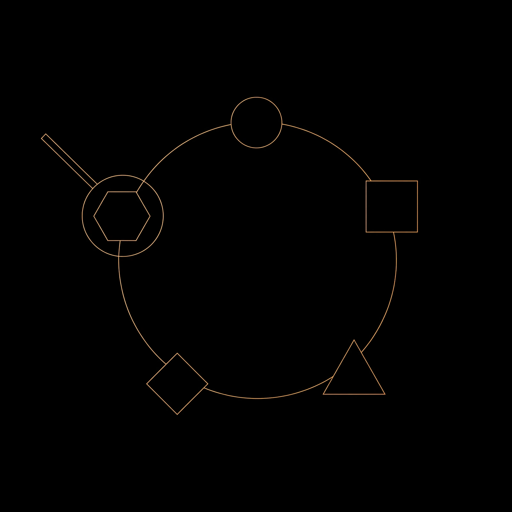
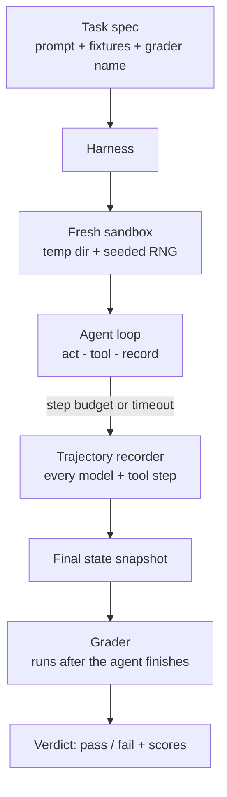
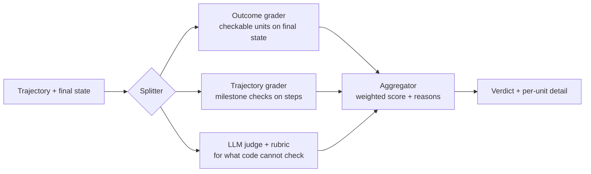
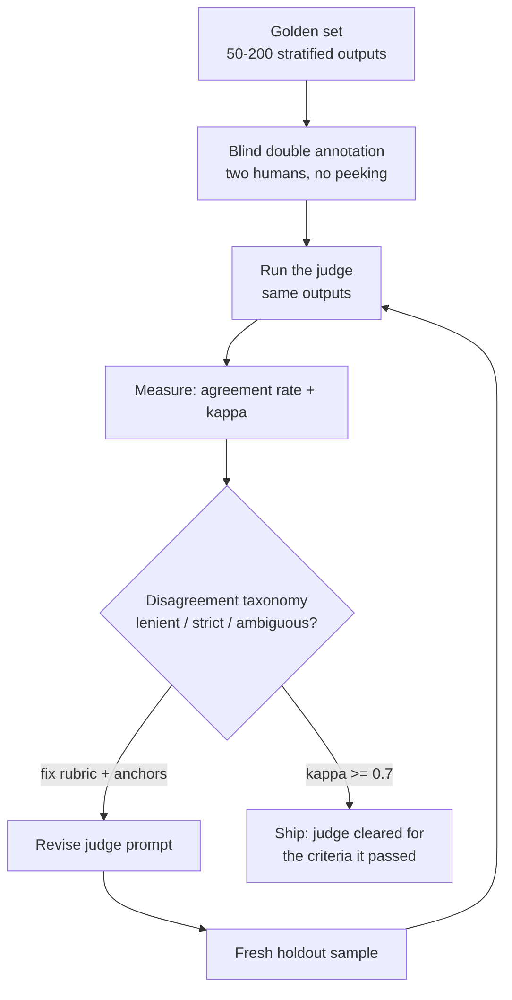
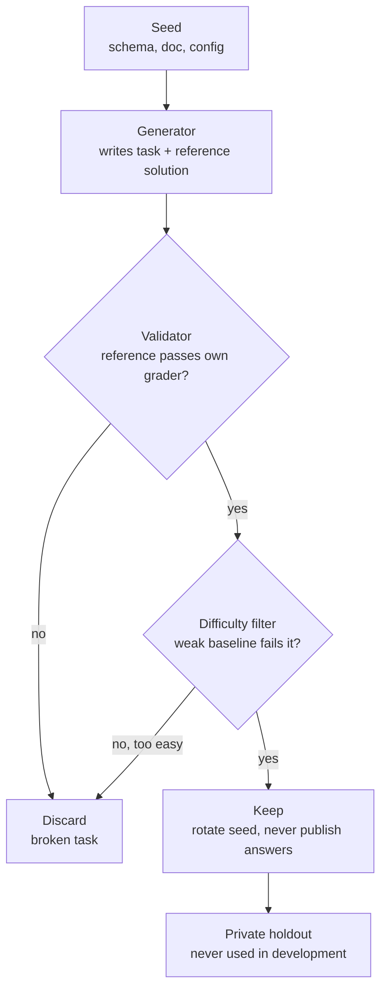
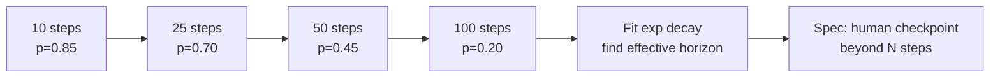
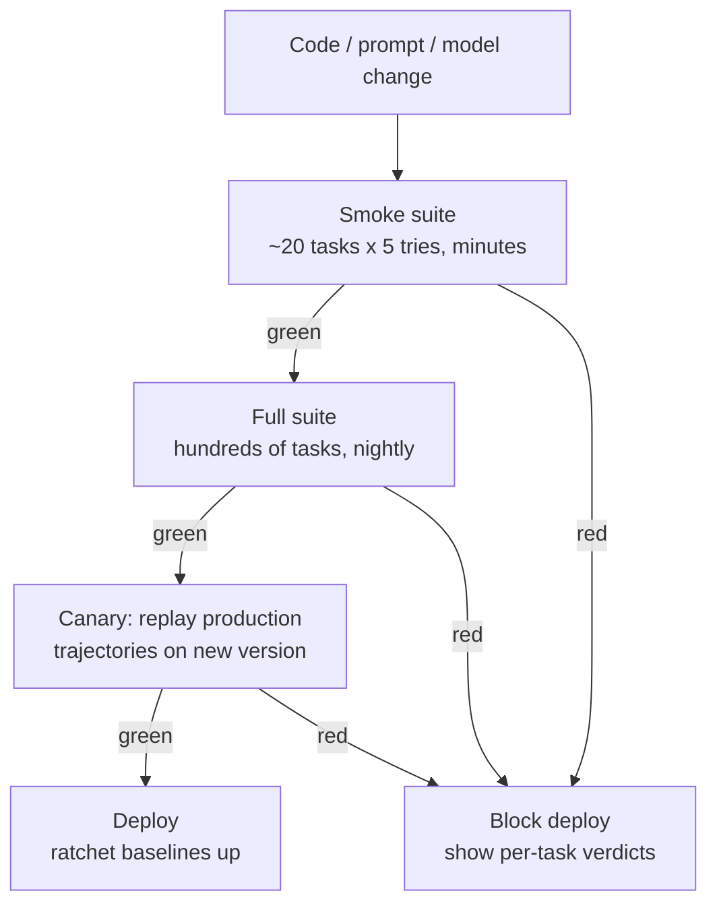

# About this supplement

Volume 9 of the curriculum teaches you to build agents and RAG systems. This supplement teaches you to *measure* them. Teams that ship agents without a measurement rig end up arguing about vibes. Teams with one ship with numbers.

An agent is a program that calls a language model in a loop, uses tools, and stops when it thinks it is done. That loop makes agents different from chatbots. A chatbot gives one answer. An agent takes a dozen actions, touches real systems, and can fail at step 9 of 10. You cannot grade that with a single "looks good" glance. You need machinery. A %%task harness%%: the rig that runs the agent the same way every time. A %%grader%%: the code that decides pass or fail. A calibrated judge. And statistics that do not lie to you.

This supplement has four chapters plus two short patch chapters. Chapter 1 builds a task harness from zero. Chapter 2 designs graders and rubrics. Chapter 3 calibrates an automated judge against human experts. Chapter 4 kills the lucky pass: pass@k done right, trajectory checks, and auto-generated evals. Patch 1 covers long-horizon evals and drift. Patch 2 wires evals into CI/CD as gates. Together they close the measurement gaps named in current research-engineer role writeups: harness design, trajectory evaluation, and eval-gated deployment.

Every chapter follows the same shape. First what the idea is and why it matters. Then how it works under the hood. Then a worked example with real numbers, a common misunderstanding, a visual you can read step by step, and a lab.

::: takeaway
- A harness, a grader, and a calibrated judge are three separate artifacts. Build and version each one.
- Never report a single success rate. Report the metric, the number of attempts, and the harness version together.
- An eval that cannot fail is not an eval. It is a demo.
:::

# Chapter 1: Task harnesses

## What a harness is

Picture a driving test. The examiner picks the route, sits in the car, watches every turn, and writes down what happened. The examiner is not the student. The route is fixed for every student. That is a harness: the fixed route, the car with a dashcam, and the examiner's clipboard, all in one.

A task harness is the program that runs your agent against a task and records everything. It holds the task definition (what "done" means), the environment (files, tools, fake services), and the recorder (every model call, every tool call, every timestamp). The agent under test plugs in. The harness runs it the same way every time.

The harness and the agent are separate pieces of software. This matters. If the agent and the test are tangled together, you cannot swap in a new model, a new prompt, or a new tool set and compare fairly.

## Why it matters

Agents are noisy. Run the same agent on the same task five times and you may get three passes and two fails. Without a harness, you cannot tell whether a change helped or you just got lucky. With a harness, every experiment is reproducible: same task, same tools, same seeds, same timeout. You can finally answer "did the new prompt help" with a number instead of a feeling.

The harness also protects you from the three classic eval lies:

1. **The leaked task.** The agent saw the answer in training or in a previous run's context. The harness resets state so each attempt starts clean.
2. **The helpful environment.** The tool returns exactly what the agent needs by accident. The harness uses fixed fixtures and mocked services with documented behavior.
3. **The silent mutation.** Run 3 changed a file that run 4 depends on. The harness isolates side effects, usually with a fresh sandbox per attempt.

## How it works under the hood

A minimal harness has five parts.

**1. Task spec.** A task is a small data structure: an id, a prompt for the agent, a starting state (files, database rows, mock server responses), and a reference to the grader. Nothing else. The agent never sees the grader.

**2. Environment fixture.** Before each attempt, the harness builds a fresh world: copies fixture files into a temp directory, seeds the random number generator, starts mock services, sets the clock. After the attempt, it tears it all down. Fixtures are checked into version control like code.

**3. Tool sandbox.** The agent's tools run inside the harness, not in your real systems. A "send email" tool writes to a log instead of sending mail. A "database query" tool hits a throwaway database. Every tool call is logged with its arguments and result.

**4. Execution loop with limits.** The harness calls the agent, lets it act, and enforces a step budget (say 25 tool calls) and a wall-clock timeout. An agent that loops forever gets a timeout verdict, not an infinite bill.

**5. Trajectory recorder.** Every step is recorded: the model input, the model output, the tool called, the tool result, the time. This record is called the %%trajectory%%. Graders read it. Humans debug with it.

### What a harness must isolate

This is the checklist that separates a real harness from a script that runs the agent twice:

- **Task from environment.** The agent's prompt and the world's state come from separate sources. Changing one never silently changes the other.
- **Tool side effects.** One attempt's tool calls must not leak into the next attempt. Fresh sandbox per run.
- **Time and randomness.** Seeded RNG, fixed mock latencies, no real network. Two runs with the same seed produce the same tool results.
- **Grading from execution.** The grader runs after the agent finishes, on the recorded trajectory and final state. The agent cannot see or influence the grader.
- **Attempts from each other.** No shared temp files, no shared caches, no leftover processes.

## Worked example: a harness for a file-organizer agent

The task: an agent receives a messy directory with 40 files and must sort them into folders by type (images, documents, code). The grader checks the final directory tree. Here is a complete minimal harness in Python.

```python
import json
import os
import random
import shutil
import tempfile
import time
from dataclasses import dataclass, field

# A Task bundles everything the agent may see plus a pointer to the grader.
# The agent never sees the grader or the expected answer. That separation
# is what makes the measurement honest. If the agent could read the grader,
# it could game it instead of solving the task.
@dataclass
class Task:
    task_id: str          # stable id, used in reports and regression tracking
    prompt: str           # the exact instruction the agent receives
    fixture_files: dict   # filename -> bytes; the messy starting directory
    grader_name: str      # which grader to run afterward (by name, not code)


# A Step records one action inside an attempt. The full list of steps is the
# trajectory. Trajectories are the raw material for graders, debugging, and
# the trajectory checks in Chapter 4. Complexity: O(1) per recorded step.
@dataclass
class Step:
    kind: str             # "model" | "tool" | "verdict"
    detail: dict          # free-form payload: tool name, args, result, ...
    at: float = field(default_factory=time.time)


class Harness:
    """Runs an agent against tasks with full isolation between attempts.

    The harness owns the sandbox directory, the seeded RNG, the step budget,
    and the clock. The agent only sees `act(prompt, tools)`. This boundary is
    the whole point: nothing about the measurement can leak into the run.
    """

    def __init__(self, seed=0, max_steps=25, timeout_s=120):
        # Fixed seed => the same attempt number always builds the same world.
        # Change the seed and you get a fresh world; keep it and runs repeat.
        self.seed = seed
        self.max_steps = max_steps      # step budget stops infinite loops
        self.timeout_s = timeout_s      # wall-clock cap stops runaway cost
        self.trajectory = []

    def _build_world(self, task, attempt):
        # Fresh temp dir per attempt: attempt N can never see attempt N-1's
        # files. Using tempfile means the OS guarantees a unique path, and
        # cleanup in `finally` below guarantees no leftovers. Break this and
        # you get the "silent mutation" lie from the Why section.
        workdir = tempfile.mkdtemp(prefix=f"harness_{task.task_id}_")
        for name, data in task.fixture_files.items():
            path = os.path.join(workdir, name)
            os.makedirs(os.path.dirname(path), exist_ok=True)
            with open(path, "wb") as f:
                f.write(data)
        # Per-attempt RNG stream: attempt 3 is reproducible on its own.
        rng = random.Random(self.seed + attempt)
        return workdir, rng

    def _sandbox_tools(self, workdir):
        # Tools are plain Python functions closed over the sandbox dir, so the
        # agent physically cannot touch anything outside workdir. This is the
        # "typed allowlisted tools" idea from Supplement B, applied to evals.
        def list_files():
            """List files in the sandbox, relative names only."""
            out = []
            for root, _, files in os.walk(workdir):
                for fn in files:
                    out.append(os.path.relpath(os.path.join(root, fn), workdir))
            return sorted(out)

        def move_file(src, dest):
            """Move one file inside the sandbox. No absolute paths allowed."""
            # Rejecting ".." and absolute paths keeps the agent inside the
            # sandbox even if it tries to escape. Security and eval hygiene
            # are the same mechanism here.
            if os.path.isabs(src) or os.path.isabs(dest) or ".." in src + dest:
                raise ValueError("paths must stay inside the sandbox")
            os.makedirs(os.path.join(workdir, os.path.dirname(dest)), exist_ok=True)
            shutil.move(os.path.join(workdir, src), os.path.join(workdir, dest))
            return f"moved {src} -> {dest}"

        return {"list_files": list_files, "move_file": move_file}

    def run(self, task, agent, attempt=0):
        """Run one attempt. Returns (final_state, trajectory)."""
        workdir, rng = self._build_world(task, attempt)
        tools = self._sandbox_tools(workdir)
        self.trajectory = []
        deadline = time.time() + self.timeout_s
        try:
            # The agent loop: the harness drives, the agent decides.
            # The harness never interprets tool results for the agent; it
            # only records them. Interpretation belongs to the grader.
            for step_i in range(self.max_steps):
                if time.time() > deadline:
                    self.trajectory.append(Step("verdict", {"timeout": True}))
                    break
                # One agent turn: it sees the prompt, the tool list, and the
                # history so far, and returns either a tool call or "done".
                action = agent.act(task.prompt, tools, self.trajectory, rng)
                if action["type"] == "done":
                    break
                # The harness executes the tool, never the agent. This keeps
                # side effects inside the sandbox and inside the log.
                result = tools[action["tool"]](**action["args"])
                self.trajectory.append(Step("tool", {
                    "tool": action["tool"], "args": action["args"],
                    "result": str(result)[:500], "step": step_i,
                }))
            final_state = self._snapshot(workdir)
            return final_state, list(self.trajectory)
        finally:
            # Always clean up, even on timeout or crash. A harness that leaks
            # temp dirs will eventually fill the disk and poison later runs.
            shutil.rmtree(workdir, ignore_errors=True)

    def _snapshot(self, workdir):
        # The grader sees this snapshot, not the live directory. Freezing the
        # final state as data keeps grading deterministic and replayable.
        tree = []
        for root, _, files in os.walk(workdir):
            for fn in sorted(files):
                tree.append(os.path.relpath(os.path.join(root, fn), workdir))
        return {"files": sorted(tree)}


# A stub agent so the harness is runnable end to end. Real agents plug in
# through the same `act` interface: prompt, tools, history, rng in; an
# action dict out. Swapping agents never touches harness code.
class NaiveOrganizer:
    def act(self, prompt, tools, history, rng):
        if not history:
            return {"type": "tool", "tool": "list_files", "args": {}}
        # Toy policy: move every file into a folder named by its extension.
        # A real agent would call the model here; the harness does not care.
        seen = {s.detail["tool"] for s in history if s.kind == "tool"}
        if "list_files" in seen and not any(
                s.detail.get("tool") == "move_file" for s in history):
            files = eval(history[0].detail["result"])
            if files:
                f = files[0]
                ext = os.path.splitext(f)[1].lstrip(".") or "misc"
                return {"type": "tool", "tool": "move_file",
                        "args": {"src": f, "dest": f"{ext}/{os.path.basename(f)}"}}
        return {"type": "done"}


if __name__ == "__main__":
    # Fixture: 4 messy files. In a real suite this would be 40+ files and the
    # fixture would live in version control next to the task spec.
    task = Task(
        task_id="organize-001",
        prompt="Sort every file into a folder named by its extension.",
        fixture_files={"a.png": b"x", "b.png": b"x", "c.py": b"x", "notes.txt": b"x"},
        grader_name="extension_folders",
    )
    h = Harness(seed=7, max_steps=25, timeout_s=30)
    final, traj = h.run(task, NaiveOrganizer(), attempt=0)
    print(json.dumps(final, indent=2))
    print(f"recorded {len(traj)} steps")
```

::: walkthrough
1. `Task` holds the prompt, fixture files, and grader name. The agent never sees the grader.
2. `Harness.run` builds a fresh world per attempt: new temp dir, seeded RNG, sandboxed tools.
3. The agent loop runs up to `max_steps` turns or until the timeout. Each tool call is logged as a `Step`.
4. Tools are closures over `workdir`. The agent cannot reach outside the sandbox.
5. `finally` wipes the temp dir. No leaks between attempts.
6. The grader (Chapter 2) receives the frozen `final_state` snapshot, never the live directory.
:::

## The harness, drawn



::: walkthrough
1. Start at the task spec on the left. It feeds the harness, never the agent directly.
2. The harness builds a fresh sandbox: new directory, seeded random numbers.
3. The agent loop runs inside the sandbox. Every action is recorded.
4. When the budget or timeout hits, the harness freezes the final state.
5. The grader reads the trajectory and the snapshot, then emits the verdict.
6. Notice the one-way arrows: information flows forward only. The agent never sees the grader.
:::

## Common misunderstanding

"The harness is just a test runner." A test runner executes assertions. A harness *defines the reality the agent operates in*: the tools, the fixtures, the seeds, the timeouts, the isolation. Two teams can run the same agent and get different numbers because their harnesses define different realities. When you read an eval number, ask for the harness version first.

::: lab Lab 9A.1: Build a minimal harness
1. Copy the `Harness` class above into a new file. Delete `NaiveOrganizer`.
2. Write a `RandomMover` agent: on each turn it picks a random file and a random destination folder using the provided `rng`. Run 5 attempts with different `attempt` numbers and the same seed. Confirm the trajectories differ across attempts but each attempt repeats exactly when re-run.
3. Now break isolation on purpose: change `_build_world` to reuse one fixed directory instead of a temp dir. Run the same 5 attempts. Watch attempt 2 see attempt 1's leftovers. This is the silent-mutation lie. Revert the change.
4. Add a third tool, `read_file(name)`, that returns file bytes. Keep it inside the sandbox the same way.
:::

::: takeaway
- The harness is the fixed route, the car, and the dashcam. The agent is the student driver.
- Isolate five things: task from environment, tool side effects, time and randomness, grading from execution, attempts from each other.
- Every eval number you report must name the harness version and the seed.
:::

# Chapter 2: Graders and rubrics

## What a grader is

The harness runs the agent and records what happened. The grader decides whether it was good. A grader is a function: trajectory plus final state in, score out. Nothing more.

There are two families. An %%outcome grader%% looks only at the final state: are the files sorted correctly, is the database row right, did the email contain the facts. A %%trajectory grader%% (also called a process grader) looks at the steps. Did the agent check the calendar before booking? Did it verify the total before paying? Did it avoid a forbidden tool?

Rule-based graders are code with assertions. Model-based graders are LLM judges with rubrics. Most real suites use both: fast rule-based checks for what is checkable, judges for what is not.

## Why it matters

A task without a grader is a demo, not an eval. The grader is where your definition of "good" lives, and every definition has sharp edges. A grader that only checks the final answer will pass an agent that cheated to get there. A grader that only checks the steps will pass an agent that followed a beautiful process to the wrong answer. You need to choose deliberately, per task.

Graders also decide what your team optimizes. Agents hill-climb on whatever the grader rewards. If the grader rewards short trajectories, you get agents that skip verification. If the grader rewards only the final answer, you get agents that guess. This is Goodhart's law with a tool belt: when a measure becomes a target, it stops being a good measure.

## How it works under the hood

### Outcome graders: checkable units

Good outcome graders are built from small, independent, checkable units. Each unit tests one fact and returns pass or fail with a reason. Example units for the file-organizer task:

- `every_file_placed`: no file remains in the root.
- `folders_match_extensions`: each file sits in the folder named by its extension.
- `no_data_loss`: the set of files is unchanged (nothing deleted, nothing duplicated).

Independent units matter because they give partial credit and precise debugging. A score of "2 of 3 units passed" tells you exactly what broke. A single boolean tells you nothing.

Units must be %%idempotent%%: running the grader twice on the same final state gives the same score. No randomness, no network, no timestamps in the assertions.

### Trajectory graders: milestone checks

Trajectory graders scan the recorded steps for required or forbidden events:

- Required: "agent called `read_calendar` before `book_flight`".
- Forbidden: "agent never called `delete_database`".
- Ordering: "verification happened after the last write, not before".

Milestones are cheaper and more stable than full-trajectory judging. You do not need a model to check "was tool X called with argument Y". Save the LLM judge for judgments code cannot make.

### Rubrics: turning judgment into numbers

When a human or an LLM judge grades, they need a %%rubric%%: a list of criteria, each with a scale and anchors. An anchor is a concrete example of what each score looks like. Without anchors, two graders assign the same number to different quality levels and your scores drift.

A rubric criterion has four parts: the name, what it measures, the scale (say 0 to 2), and an anchor example per level. Keep criteria independent: "correctness" and "completeness" should not both punish the same missing fact.

## Worked example: a grader for a SQL-writing agent

Task: the agent gets a question in English and a database schema, and must return a SQL query. The grader checks the query without trusting the agent's formatting.

```python
import re
import sqlite3

# An outcome grader built from independent checkable units. Each unit is a
# small function returning (passed: bool, reason: str). The grader aggregates.
# Units are idempotent: same database state + same query => same verdict, every
# time. That property is what lets this grader run in CI without flakiness.


def make_test_db():
    # In-memory SQLite: fast, isolated, no server to clean up. Each grading
    # call gets a brand-new database, so one task's rows can never leak into
    # another's. Complexity of setup is O(rows inserted).
    conn = sqlite3.connect(":memory:")
    conn.executescript("""
        CREATE TABLE orders(id INTEGER, customer TEXT, total REAL, status TEXT);
        INSERT INTO orders VALUES
          (1, 'ana', 120.0, 'paid'),
          (2, 'bob',  45.0, 'pending'),
          (3, 'ana',  80.0, 'paid'),
          (4, 'cid', 200.0, 'paid');
    """)
    return conn


def unit_valid_sql(query):
    # Unit 1: does it parse? We ask SQLite to plan the query without running
    # it. EXPLAIN never executes, so a malicious query cannot do damage here.
    # What breaks if changed: skipping this lets syntax errors crash later
    # units with confusing tracebacks instead of a clean "invalid SQL".
    try:
        conn = make_test_db()
        conn.execute("EXPLAIN " + query)
        return True, "parses"
    except Exception as e:  # noqa: BLE001 - any parse failure is a fail
        return False, f"invalid SQL: {e}"


def unit_correct_rows(query, expected_rows):
    # Unit 2: does it return the right rows? We compare sets of tuples, so
    # column order and row order do not matter. Set comparison is O(n) and
    # immune to the agent's formatting choices. What breaks if changed: list
    # comparison would fail correct queries that order rows differently.
    conn = make_test_db()
    try:
        got = set(conn.execute(query).fetchall())
    except Exception as e:  # noqa: BLE001
        return False, f"execution failed: {e}"
    if got == set(expected_rows):
        return True, f"{len(got)} correct rows"
    return False, f"got {sorted(got)}, expected {sorted(expected_rows)}"


def unit_read_only(query):
    # Unit 3: is it read-only? A SELECT-only agent must never mutate the
    # database. We check the first keyword. This is intentionally strict:
    # WITH ... UPDATE tricks are out of scope for this task's threat model,
    # and the simplicity keeps the unit auditable. See Supplement B Ch 1 for
    # the deeper capability-layer version of this idea.
    first = query.strip().split()[0].upper() if query.strip() else ""
    if first in ("SELECT", "WITH"):
        return True, "read-only"
    return False, f"non-read statement: {first}"


def unit_no_wildcard_dump(query):
    # Unit 4: did it avoid SELECT *? Dumping whole tables is a data-exposure
    # smell. This is a style/correctness hybrid: the task asks for specific
    # columns, so SELECT * is wrong here even when the rows happen to match.
    if re.search(r"select\s+\*", query, re.IGNORECASE):
        return False, "SELECT * dumps whole rows; name the columns"
    return True, "columns named explicitly"


def grade_sql(query, expected_rows):
    # The grader runs units in dependency order: cheap structural checks
    # first, expensive semantic checks later. If the SQL does not parse there
    # is no point running it. Short-circuiting keeps failures fast and the
    # reasons precise. Returns a dict a report can render directly.
    units = [
        ("valid_sql", lambda: unit_valid_sql(query)),
        ("read_only", lambda: unit_read_only(query)),
        ("no_wildcard", lambda: unit_no_wildcard_dump(query)),
        ("correct_rows", lambda: unit_correct_rows(query, expected_rows)),
    ]
    results = {}
    for name, fn in units:
        passed, reason = fn()
        results[name] = {"passed": passed, "reason": reason}
        # Stop after a structural failure: later units would produce noise.
        # This ordering (structure before semantics) is a deliberate design
        # choice. Reversing it gives confusing "wrong rows" reports for
        # queries that never parsed.
        if not passed and name in ("valid_sql",):
            break
    results["score"] = sum(1 for r in results.values()
                           if isinstance(r, dict) and r["passed"]) / len(units)
    return results


if __name__ == "__main__":
    # Worked numbers: total paid per customer? Expected: ana 200.0.
    expected = [("ana", 200.0)]
    good = ("SELECT customer, SUM(total) FROM orders "
            "WHERE status='paid' GROUP BY customer HAVING customer='ana'")
    bad = "SELECT * FROM orders"
    print("good query:", grade_sql(good, expected)["score"])  # 1.0
    print("bad query: ", grade_sql(bad, expected)["score"])   # 0.25
```

::: walkthrough
1. `make_test_db` builds a fresh in-memory database per grading call. No shared state.
2. Units run in dependency order: parse first, then safety, then semantics. Structural failures short-circuit.
3. `unit_correct_rows` compares sets of tuples. Row order and column order do not matter.
4. `unit_read_only` is intentionally strict. Auditable beats clever.
5. The final score is the fraction of units passed, with per-unit reasons for debugging.
6. The bad query scores 0.25: it parses, but it is not read-only-safe in spirit (SELECT *), and the rows are wrong.
:::

## Graders, drawn



::: walkthrough
1. The trajectory and final state enter on the left and split three ways.
2. The outcome grader checks facts about the final state with code.
3. The trajectory grader checks required and forbidden events in the steps with code.
4. The LLM judge handles the rest, guided by a rubric with anchors (Chapter 3 calibrates it).
5. The aggregator combines the three into one verdict with per-unit reasons, never just a number.
:::

## A rubric, concretely

For the SQL task, the "query quality" criterion an LLM judge might score:

- **Criterion:** Clarity of intent. Does the query express one clear question?
- **Scale:** 0 to 2.
- **Anchor for 2:** `SELECT customer, SUM(total) FROM orders WHERE status='paid' GROUP BY customer`. One question, named columns, filter before grouping.
- **Anchor for 1:** Correct result but `SELECT *` with filtering in Python afterwards. Right answer, wrong division of labor.
- **Anchor for 0:** A query that returns the right rows by accident, for example filtering on a coincidental id range.

Anchors are the difference between a rubric and a wish. Write them before you grade anything.

## Common misunderstanding

"An LLM judge is objective because it is a machine." It is not. A judge model has the same biases as any model: it prefers long answers, confident tone, and its own style. Calibration (Chapter 3) measures the bias. The rubric constrains it. Neither removes it. Treat every judge score as an estimate with error bars, never as ground truth.

::: lab Lab 9A.2: Write a grader and a rubric
1. Extend the SQL grader with a fifth unit, `unit_uses_index_hint` or your own: check that the query filters on `status` before grouping (hint: inspect the query string for `WHERE` appearing before `GROUP BY`). Keep it idempotent.
2. Write a 3-criterion rubric for "email drafting quality" for an agent that writes customer emails: criteria, 0-2 scale, one anchor per level per criterion. Trade rubrics with a partner (or a second model) and grade the same 5 emails. Note every disagreement.
3. Convert one disagreement into a sharper anchor. That edit is calibration in miniature.
:::

::: takeaway
- Split grading into outcome units, trajectory milestones, and judged criteria. Code first, judges last.
- Checkable units must be independent, idempotent, and ordered structure-before-semantics.
- A rubric without anchors is a wish. Write anchors before grading.
:::

# Chapter 3: Judge calibration against humans

## What calibration is

You have an LLM judge that scores agent outputs. Is it any good? Calibration is how you answer. You take a %%golden set%%: a few dozen to a few hundred task outputs, each labeled by human experts. You run the judge on the same outputs. You measure agreement. The gap between the judge and the humans is the judge's error, and now it is a number instead of a hope.

Calibration does not make the judge perfect. It tells you exactly how imperfect it is, and where. That lets you decide what the judge is allowed to decide alone and what needs a human.

## Why it matters

An uncalibrated judge is a random number generator with good marketing. Teams routinely find their judge agrees with humans only 70 percent of the time, which means nearly one in three automated grades is wrong. If you then optimize your agent against that judge, you are optimizing against noise. Worse, the judge's errors are systematic. It may always forgive one failure mode. Then your agent learns to fail in exactly that way, and your scores go up while quality goes down.

## How it works under the hood

### Step 1: Build the golden set

Sample 50 to 200 outputs from real agent runs. Stratify: include passes, fails, and edge cases, not just the easy ones. If your golden set is all obvious passes, agreement will look great and mean nothing.

### Step 2: Blind double annotation

Two human experts label each output independently, without seeing each other's labels or the judge's. Blindness prevents anchoring. Double annotation lets you measure human-human agreement, which is the ceiling: the judge cannot be expected to agree with humans more than humans agree with each other.

### Step 3: Measure agreement

The simple metric is %%agreement rate%%: the fraction of items where judge and human majority agree. The better metric is %%Cohen's kappa%%, which corrects for chance agreement. If 90 percent of outputs are passes, a judge that always says "pass" gets 90 percent agreement but kappa near zero. Kappa exposes that.

Kappa formula: κ = (p_o − p_e) / (1 − p_e), where p_o is observed agreement and p_e is the agreement you would expect by chance from the label distributions. Rough guide: below 0.4 is poor, 0.4-0.6 moderate, 0.6-0.8 good, above 0.8 excellent. For production gates you want 0.7 or better on the golden set.

### Step 4: Disagreement taxonomy

Every disagreement goes into a bucket: judge too lenient, judge too strict, rubric ambiguous, genuine edge case. Buckets turn anecdotes into a repair list. If 60 percent of disagreements are "judge too lenient on partial answers", you tighten one anchor and re-run.

### Step 5: Recalibrate and re-measure

Fix the rubric, adjust the judge prompt, or restrict the judge to the criteria where it is strong. Then re-run on a fresh sample. Never re-tune on the same golden set twice without a fresh holdout: tuning to the golden set is overfitting with extra steps.

## Worked example: kappa on 50 graded emails

Two humans and one judge each label 50 agent-drafted emails as pass or fail. The confusion matrix between the judge and the human majority:

- Both say pass: 32
- Both say fail: 9
- Judge pass, human fail: 6 (judge too lenient)
- Judge fail, human pass: 3 (judge too strict)

Observed agreement p_o = (32 + 9) / 50 = 0.82. Chance agreement: judge says pass 38/50 = 0.76, human says pass 35/50 = 0.70. p_e = 0.76×0.70 + 0.24×0.30 = 0.532 + 0.072 = 0.604. Kappa = (0.82 − 0.604) / (1 − 0.604) = 0.216 / 0.396 ≈ 0.545. Moderate agreement. The taxonomy shows the judge leans lenient (6 vs 3). Decision: tighten the anchors on partial answers, re-run on a fresh 50.

```python
# Cohen's kappa from a 2x2 confusion matrix. Comment density is deliberate:
# every line of arithmetic gets a plain-English note so the formula stays
# honest. Complexity O(1): it is four counts and a division.

def cohens_kappa(both_pass, both_fail, judge_only_pass, human_only_pass):
    # Total items. Every count below must be a non-negative int; a negative
    # or zero total means the caller passed garbage, so fail loudly.
    n = both_pass + both_fail + judge_only_pass + human_only_pass
    assert n > 0, "need at least one labeled item"

    # Observed agreement: the diagonal of the confusion matrix over n.
    p_o = (both_pass + both_fail) / n

    # Marginal rates: how often each side says "pass" at all.
    p_judge_pass = (both_pass + judge_only_pass) / n
    p_human_pass = (both_pass + human_only_pass) / n

    # Chance agreement: both say pass by luck + both say fail by luck.
    # This is the term raw agreement rate forgets, and the whole point of
    # kappa. Drop it and a lazy always-pass judge looks excellent.
    p_e = p_judge_pass * p_human_pass + (1 - p_judge_pass) * (1 - p_human_pass)

    # Kappa rescales: 1.0 = perfect, 0.0 = chance-level, negative = worse
    # than chance (the judge is systematically anti-correlated; rare but real).
    if p_e == 1.0:
        return 1.0  # degenerate: everyone agreed on everything
    return (p_o - p_e) / (1 - p_e)


if __name__ == "__main__":
    k = cohens_kappa(both_pass=32, both_fail=9,
                     judge_only_pass=6, human_only_pass=3)
    print(f"kappa = {k:.3f}")  # 0.545: moderate, judge leans lenient
    # Sanity check: a judge that always says pass on a 70% pass set.
    k2 = cohens_kappa(both_pass=35, both_fail=0,
                      judge_only_pass=15, human_only_pass=0)
    print(f"lazy judge kappa = {k2:.3f}")  # 0.000: agreement was all chance
```

::: walkthrough
1. The four counts form the confusion matrix. The diagonal is agreement.
2. `p_o` is raw agreement: 0.82 looks good on its own.
3. `p_e` is chance agreement from the marginals: 0.604. This is the correction raw rate skips.
4. Kappa = 0.545: moderate. The 6-vs-3 split says the judge is lenient, so the fix is tighter anchors, not a better model.
5. The lazy-judge check proves the point: 70 percent raw agreement, kappa exactly 0.0.
:::

## The calibration loop, drawn



::: walkthrough
1. Start with a stratified golden set: passes, fails, and edge cases.
2. Two humans label blind. Their agreement is the ceiling.
3. The judge labels the same items. Compute agreement rate and kappa.
4. Bucket every disagreement. The buckets are the repair list.
5. Revise the rubric, then re-measure on a *fresh* holdout. Never tune twice on the same set.
6. Ship only when kappa clears your bar, and only for the criteria the judge passed on.
:::

## Common misunderstanding

"A judge that agrees with itself is reliable." Self-consistency is not correctness. A judge can give the same wrong score to the same output a hundred times. Reliability means agreement with *humans*, measured blind, on outputs the judge never saw during tuning. Anything else is the judge grading its own homework.

::: lab Lab 9A.3: Calibrate a toy judge
1. Take the 5 emails from Lab 9A.2. Label each pass/fail yourself, then ask a second person (or a different model, blind to your labels) to label them too. Compute human-human agreement.
2. Write a 3-sentence judge prompt ("Score this email pass/fail...") and run it on the same 5. Compute judge-vs-majority agreement and kappa with the function above.
3. Find one disagreement. Write a new anchor that would have fixed it. This is one full turn of the calibration loop.
:::

::: takeaway
- Calibration = golden set + blind humans + agreement metrics + disagreement buckets + fresh holdout.
- Report kappa, not raw agreement. Kappa corrects for chance; raw rate rewards lazy judges.
- Ship the judge only for criteria where it clears your bar, and re-calibrate on a schedule.
:::

::: provenance
**Last verified: September 2026.** Pass@k estimator and kappa definitions cross-checked against the HumanEval paper (Chen et al., 2021) and standard psychometric references. **UNVERIFIED:** the 0.7 kappa bar is an industry rule of thumb, not a published standard; treat it as a starting point your team tunes.
:::

# Chapter 4: Lucky passes, trajectory checks, and auto-generated evals

## What a lucky pass is

An agent guesses the right answer for the wrong reason. The grader says pass. Your dashboard says the agent is good. It is not good; it is lucky. This is the %%lucky pass%% problem, and it is the quiet killer of agent evals.

Lucky passes come in three flavors. **Guessing**: the agent picks an answer from a small set and gets it right by chance. **Shortcutting**: the grader checks something correlated with the answer but not the answer, like checking that a file exists instead of checking its contents. **Memorization**: the task leaked into training data, so the agent recites instead of reasoning.

You fight luck with statistics (pass@k done right), with process evidence (trajectory checks), and with task volume (auto-generated evals that make memorization worthless).

## Why it matters

A single success tells you almost nothing about an agent. Agents are stochastic: same task, different run, different result. If you report "it passed", you are reporting one coin flip. Decision-makers then ship on coin flips. The statistics in this chapter turn coin flips into honest estimates of two different things. What the agent *can* do at its best. And what it *will* do on a typical run. Those are different numbers and you need both.

## How it works under the hood

### pass@k, done right

%%pass@k%% answers: if the agent gets k independent tries, what is the chance at least one succeeds? It measures the agent's ceiling: what it can do, not what it usually does.

The naive way (run k tries, check if any passed) is unbiased but noisy: with small k the estimate jumps around. The standard fix, from the HumanEval paper (Chen et al., 2021): run n tries with n >= k, count c successes, and compute

pass@k = 1 − C(n−c, k) / C(n, k)

In words: one minus the chance that a random handful of k tries contains zero successes. This estimator is unbiased and much less noisy than the naive one. Two assumptions keep it honest: the n tries must be independent (fresh harness state per try, Chapter 1), and n should be comfortably larger than k.

Note what pass@1 means under this estimator: c/n, the plain success rate. That is the number to report as "typical performance".

### pass^k: the consistency check

%%pass^k%% (pass-to-the-k) answers the opposite question: what is the chance that *all* k tries succeed? It measures reliability, not ceiling. An agent with pass@10 = 0.9 but pass^3 = 0.4 is brilliant sometimes and flaky usually. For production, pass^k is often the number you actually care about.

### The reporting rule

Always report the pair: ceiling (pass@k) and typical (pass@1), with n stated. "pass@5 = 0.81, pass@1 = 0.34, n = 20" tells the full story. "81% success" tells a lie.

### Trajectory checks: evidence of reasoning

Statistics measure outcomes. Trajectory checks measure *how*. A trajectory check is a small assertion on the recorded steps:

- **Milestone presence**: the agent verified the account balance before transferring money.
- **No forbidden tools**: the agent never called `delete` or `drop`.
- **Information use**: the agent's final answer cites a tool result it actually received (catches hallucinated citations).
- **Efficiency bound**: the task took fewer than N tool calls (catches thrash).

The key design rule: trajectory checks assert *necessary* steps, not *exact* steps. "Called the balance tool before transferring" still holds when other steps sit between them. "Called tools in exactly this order" is brittle and will fail good agents.

### Auto-generated evals

Hand-written evals are expensive and leak: once tasks are public, they end up in training data. %%Auto-generated evals%% synthesize fresh tasks programmatically. Take a seed (a database schema, a document, a config). Apply a generator (write a question, plant a bug, scramble a directory). Then validate the result: a reference solution must pass your own grader.

The validation step is non-negotiable. A generator without validation produces broken tasks, and broken tasks produce noise. The standard pipeline: generate, solve with a reference (a scripted solver or a strong model with verification), keep only tasks the reference passes and a weak baseline fails. That last filter, called %%difficulty calibration%%, keeps the suite discriminative: tasks everyone passes and tasks nobody passes both carry zero signal.

Contamination guards: never publish the generated tasks with their answers, rotate seeds per run, and keep a private holdout the generator never sees during development.

## Worked example: pass@k from raw trial data

An agent attempts a task n = 10 times. It succeeds c = 3 times. Compute pass@1, pass@5, and pass^2.

- pass@1 = c/n = 0.30. Typical run: 30 percent.
- pass@5 = 1 − C(7,5)/C(10,5) = 1 − 21/252 = 1 − 0.0833 = 0.9167. With 5 tries, 92 percent ceiling.
- pass^2 = C(3,2)/C(10,2) = 3/45 = 0.0667. Two clean runs in a row: under 7 percent.

Same agent, three numbers, three stories. The ceiling is high, the typical run is weak, and consistency is poor. Ship or not? Not without fixing reliability.

```python
import math

# Unbiased pass@k and pass^k from trial counts. Comments explain the why
# behind each line: the math is short but the assumptions are load-bearing.
# Complexity O(k) per call via the product form (no giant factorials).


def _comb(n, k):
    # math.comb is exact integer arithmetic. For n up to a few hundred this
    # is fine; beyond that use the log-domain product form. What breaks if
    # changed: float factorials overflow around n=170 and silently produce
    # inf, which then poisons every downstream average.
    if k < 0 or k > n:
        return 0
    return math.comb(n, k)


def pass_at_k(n, c, k):
    """P(at least one success in k tries), unbiased estimator (Chen et al.)."""
    # Guard the assumptions up front: n >= k and independent tries are the
    # caller's job (fresh harness state per try, Chapter 1). The estimator
    # cannot detect violated independence; garbage in, confident garbage out.
    assert 0 <= c <= n and k >= 1 and n >= k, "need 0<=c<=n and n>=k>=1"
    # 1 - P(a random k-subset of the n tries contains zero successes).
    # When c >= n-k+1 every k-subset must contain a success: return 1.0.
    return 1.0 - _comb(n - c, k) / _comb(n, k)


def pass_hat_k(n, c, k):
    """P(all k tries succeed). The consistency number; often the honest one."""
    # Same guards. Note the asymmetry: pass^k punishes flakiness hard, which
    # is exactly what you want before shipping to production.
    assert 0 <= c <= n and k >= 1 and n >= k, "need 0<=c<=n and n>=k>=1"
    return _comb(c, k) / _comb(n, k)


def report(n, c, k_ceiling=5, k_consistent=2):
    # The reporting rule from the chapter: always show ceiling, typical, and
    # consistency together with n. A single number is a lie by omission.
    return {
        "n": n, "successes": c,
        "pass@1_typical": round(c / n, 3),
        f"pass@{k_ceiling}_ceiling": round(pass_at_k(n, c, k_ceiling), 3),
        f"pass^{k_consistent}_consistent": round(pass_hat_k(n, c, k_consistent), 3),
    }


if __name__ == "__main__":
    # The worked example above: 3 successes in 10 tries.
    print(report(10, 3))
    # {'n': 10, 'successes': 3, 'pass@1_typical': 0.3,
    #  'pass@5_ceiling': 0.917, 'pass^2_consistent': 0.067}
    # A reliable agent for contrast: 9 of 10.
    print(report(10, 9))
    # {'n': 10, 'successes': 3 ...} no: pass@1 0.9, ceiling 1.0, pass^2 0.8
```

::: walkthrough
1. `pass_at_k` implements the unbiased estimator: one minus the chance a random k-handful misses every success.
2. The asserts guard the estimator's assumptions. Independence of tries is the caller's job via harness isolation.
3. `pass_hat_k` flips the question: all k succeed. This is the production number.
4. `report` enforces the reporting rule: ceiling, typical, and consistency together, always with n.
5. The two examples show the range: 3/10 is a high ceiling with terrible consistency; 9/10 is good on all three.
:::

## Trajectory checks, concretely

```python
# Milestone checks on a recorded trajectory. Each check returns (passed,
# reason). Design rule from the chapter: assert necessary steps, never exact
# sequences. Complexity O(steps) per check; a full suite over hundreds of
# trajectories stays cheap because checks are simple scans.

def check_verified_before_transfer(trajectory):
    """Money moved only after a balance check. Necessary, not sufficient."""
    # We scan for ordering, not adjacency: other steps may sit between the
    # check and the transfer. Requiring adjacency would fail agents that do
    # extra verification, punishing the careful ones. That is the brittleness
    # trap; ordering-with-gaps is the fix.
    saw_balance = False
    for step in trajectory:
        tool = step.get("tool", "")
        if tool == "check_balance":
            saw_balance = True
        if tool == "transfer_money" and not saw_balance:
            return False, "transfer happened with no prior balance check"
    # Vacuous pass is a smell: if no transfer happened, the task probably
    # failed upstream. Report it so the grader can distinguish "safe" from
    # "did nothing". Silent vacuous passes hide broken tasks.
    if not any(s.get("tool") == "transfer_money" for s in trajectory):
        return None, "no transfer attempted; check task outcome separately"
    return True, "balance verified before transfer"


def check_no_forbidden_tools(trajectory, forbidden=("delete_account", "drop_table")):
    """The agent never touched a forbidden tool. Deny-list, kept short."""
    # Deny-lists are a backstop, not a design: Supplement B Chapter 1 argues
    # for allow-lists at the capability layer. In evals, the deny-list catches
    # the catastrophic cases cheaply while the harness allow-lists the rest.
    for step in trajectory:
        if step.get("tool") in forbidden:
            return False, f"forbidden tool used: {step['tool']}"
    return True, "no forbidden tools"


def check_cites_real_evidence(trajectory, final_answer):
    """The final answer's key claim appears in a tool result it received."""
    # Catches hallucinated citations: the agent claims "the balance is $500"
    # without any tool ever returning $500. We do a simple substring check
    # here; production versions normalize numbers and match key entities.
    # What breaks if changed: exact-match on long strings fails on trivial
    # rephrasing, so keep the checked claim short and numeric.
    evidence = " ".join(str(s.get("result", "")) for s in trajectory)
    claim = final_answer.strip().split()[-1]  # toy: last token as the claim
    if claim and claim in evidence:
        return True, f"claim '{claim}' grounded in a tool result"
    return False, f"claim '{claim}' has no supporting tool result"
```

::: walkthrough
1. `check_verified_before_transfer` asserts ordering with gaps allowed. Adjacency would punish careful agents.
2. A vacuous pass (no transfer at all) returns `None`, not `True`. Silent vacuous passes hide broken tasks.
3. `check_no_forbidden_tools` is a deny-list backstop. The real control is the harness allow-list.
4. `check_cites_real_evidence` catches hallucinated citations with a cheap substring test on tool results.
:::

## Auto-generated evals, drawn



::: walkthrough
1. The generator produces a task and its reference solution from a seed.
2. The validator runs the reference through your own grader. Failure means the task is broken: discard.
3. The difficulty filter runs a weak baseline. If it passes, the task carries no signal: discard.
4. Kept tasks get rotated seeds. Answers are never published.
5. A private holdout stays untouched during development. That is your contamination guard.
:::

## Common misunderstanding

"pass@10 of 90 percent means the agent succeeds 90 percent of the time." No. It means that with 10 tries, at least one succeeds 90 percent of the time. The typical single run might succeed 30 percent of the time. In production you usually get one run, not ten. Report pass@1 for the typical run, pass^k for consistency, and pass@k only as the ceiling. Mixing them up is how flaky agents ship.

::: lab Lab 9A.4: Kill a lucky pass
1. Write a guessing agent for a 4-choice QA task: it picks randomly. Run n = 20 trials through your Chapter 1 harness. Compute pass@1, pass@5, pass^2 with the functions above. Watch the ceiling look respectable while consistency sits near zero.
2. Add a trajectory check that fails any trajectory where the agent never called the `lookup` tool. Re-run. The lucky passes die. That is the difference statistics plus process evidence makes.
3. Sketch an auto-eval generator for the file-organizer task: a function that creates a random fixture (files with random extensions) plus a reference solution (the correct tree). Validate it with your Chapter 2 grader units.
:::

::: takeaway
- One success is a coin flip. Report ceiling (pass@k), typical (pass@1), and consistency (pass^k), always with n.
- The unbiased estimator needs independent tries: fresh harness state per try, or the math lies.
- Trajectory checks assert necessary steps with gaps allowed, never exact sequences.
- Auto-generated evals need validation, difficulty filtering, and a private holdout, or they produce noise and leak.
:::

::: provenance
**Last verified: September 2026.** Pass@k estimator per Chen et al., "Evaluating Large Language Models Trained on Code" (2021); pass^k / G-pass@k per Liu et al. as surveyed in recent eval literature. **UNVERIFIED:** exact G-pass@k adoption in production agent teams; the concept is included as the direction the field is moving.
:::

# Patch 1: Long-horizon evals and drift

Volume 9 covers agent loops but does not name what goes wrong as those loops run long. This patch does.

## What long-horizon drift is

A short task is 5 steps. A long-horizon task is 50 or 500: migrate a codebase, reconcile a quarter of expenses, research a market. As steps accumulate, three things rot.

**Context rot.** The model's context window fills with old tool outputs. The original goal slides out of attention. The agent starts optimizing a subgoal it invented three hours ago. This is not a bug in your prompt; it is what long contexts do to every model.

**Error compounding.** Each step has a small chance of a slightly wrong tool call. Errors do not cancel; they stack. A 2 percent per-step error rate over 50 steps is a 64 percent chance that *something* went wrong along the way (1 − 0.98^50). The final answer can look clean while resting on a corrupted intermediate.

**State drift.** Files, databases, and external systems change under the agent. An early observation ("the table has 4 columns") goes stale. The agent keeps acting on the stale belief because re-checking costs steps.

## Why it matters

Most eval suites test short tasks because short tasks are cheap. Then the agent ships into long tasks and fails in ways the suite never measured. If your product's real tasks are long, your evals must be long, or your numbers describe a different product.

## How it works under the hood

Long-horizon evals differ from short ones in three design choices.

**Sub-goal milestones.** Break the long task into checkable milestones: "migrated module A and its tests pass", "reconciled January". Grade each milestone independently. A milestone score of 3/5 tells you where the agent dies; a single final boolean tells you nothing. Milestones also fight context rot: the harness can re-inject the original goal at each milestone boundary.

**Progress scoring.** Score partial completion honestly: fraction of milestones reached, weighted by difficulty. An agent that reaches 4 of 5 milestones is not a failure; it is a 0.8 that needs one more capability. Binary pass/fail on long tasks throws away the most informative signal you have.

**Checkpoint-and-resume evals.** Save the agent's state at each milestone (this is the same checkpointing idea as LangGraph's, see Supplement B Patch 3). Then test resume: restore from milestone 3 and continue. This isolates *where* failures come from. If the agent always fails when resuming from milestone 3, the problem is stale state handling, not planning.

**Drift metrics.** Track success rate against horizon length: run the same task family at 10, 25, 50, and 100 steps and plot the curve. A steep drop names your effective horizon: the longest task you can trust this agent with. Also track re-verification rate: how often the agent re-checks a fact before acting on it. Agents that never re-verify drift fastest.

## Worked example: the horizon curve

You run a document-reconciliation task at four horizons. Results (n = 20 each):

| Steps | pass@1 | Milestones reached (avg) |
|-------|--------|--------------------------|
| 10    | 0.85   | 0.92                     |
| 25    | 0.70   | 0.78                     |
| 50    | 0.45   | 0.61                     |
| 100   | 0.20   | 0.38                     |

The binary pass@1 collapses after 25 steps, but milestones degrade smoothly. The milestone curve is the honest one: it says the agent does about 60 percent of a 50-step task. The effective horizon for "mostly reliable" is around 25 steps. That number goes into the product spec: tasks longer than 25 steps get human checkpoints.

```python
# Fit a simple drift model: success ~ exp(-lambda * steps). One parameter,
# lambda, summarizes how fast this agent rots. Comments walk the math because
# the log transform is where people silently err. Complexity O(m) in the
# number of measured horizons m.

import math

def fit_drift(horizons, pass_rates):
    # Model: p(s) = exp(-lam * s). Take logs: ln p = -lam * s, a line through
    # the origin with slope -lam. Least squares on the log scale gives lam.
    # Why the log scale: errors are multiplicative across steps, so the log
    # domain is where the noise is symmetric. Fitting on raw rates biases
    # lam toward the short-horizon points.
    assert len(horizons) == len(pass_rates) and len(horizons) >= 2
    num = sum(s * -math.log(max(p, 1e-9)) for s, p in zip(horizons, pass_rates))
    den = sum(s * s for s in horizons)
    lam = num / den  # per-step decay rate; bigger lam = faster rot
    # Effective horizon: steps where predicted success drops below 0.5.
    # Solve exp(-lam*s) = 0.5 -> s = ln2 / lam. A single number your product
    # team can put in a spec. What breaks if changed: using 0.5 on the
    # milestone curve instead of pass@1 mixes two different quantities.
    effective = math.log(2) / lam if lam > 0 else float("inf")
    return lam, effective


if __name__ == "__main__":
    horizons = [10, 25, 50, 100]
    rates = [0.85, 0.70, 0.45, 0.20]
    lam, eff = fit_drift(horizons, rates)
    print(f"decay rate: {lam:.4f} per step")   # ~0.0162
    print(f"effective horizon: {eff:.0f} steps")  # ~43 steps at p=0.5
```

::: walkthrough
1. The model assumes each step multiplies survival odds: p(s) = exp(−λs).
2. Logging both sides turns it into a line through the origin. Least squares gives λ.
3. Fitting on the log scale matters: raw-scale fitting overweight the short horizons.
4. The effective horizon solves p = 0.5. It is one number the product team can use.
5. With these numbers: about 43 steps before the coin flips against you.
:::



::: walkthrough
1. Run the same task family at increasing horizons, n fixed.
2. Record pass@1 and milestone averages at each horizon.
3. Fit the decay model. Read off the effective horizon.
4. Turn it into a product rule: beyond N steps, insert a human checkpoint.
5. Re-measure after every agent change. The horizon is a property of the agent version, not the task.
:::

## Common misunderstanding

"Long tasks just need a bigger context window." A bigger window delays context rot; it does not fix error compounding or state drift. The agent still acts on stale beliefs and stacked errors, just with more room to do it in. Milestones, re-verification, and checkpoints are the fixes. Window size is a comfort blanket.

::: lab Lab 9A.5: Measure a horizon
1. Take your Chapter 1 file-organizer task and scale it: 10, 40, 100 files. Run n = 10 each with the naive organizer.
2. Score binary pass/fail plus a milestone metric (fraction of files correctly placed). Plot both against file count.
3. Fit the drift model. What is the naive agent's effective horizon? Now improve the agent (re-verify each move) and watch λ shrink.
:::

::: takeaway
- Long tasks rot three ways: context rot, error compounding, state drift.
- Grade milestones, not just final booleans. Score progress honestly.
- The horizon curve plus a one-parameter decay fit gives you the effective horizon: a shippable number.
:::

# Patch 2: Agent CI/CD with eval gates

Volume 9 does not wire evals into deployment. This patch does: evals as regression tests, golden sets as gates, and the nondeterminism problem that makes naive CI fail.

## What an eval gate is

A gate is a check that must pass before a change ships. For agents, the change can be a new model version, a new prompt, new tools, or new code. The gate runs the eval suite and compares against the last green run. If scores regress beyond a threshold, the deploy stops.

The suite has two layers. The **smoke suite**: 10 to 30 fast tasks, runs on every commit, finishes in minutes. The **full suite**: hundreds of tasks including long-horizon ones, runs nightly and before releases. The smoke suite catches big breaks fast; the full suite catches slow rot.

## Why it matters

Agents regress silently. A prompt tweak that helps task A often hurts task B, and nobody notices until customers do. Without gates, every deploy is a hope. With gates, every deploy is a comparison. The gate does not need to be perfect; it needs to be *louder than silence*.

## How it works under the hood

**Golden sets are versioned.** The tasks, fixtures, graders, and harness all live in version control with the code. An eval result names the exact commit of all four. "Score dropped" is meaningless unless you know what changed.

**Nondeterminism is budgeted, not wished away.** Agents are stochastic, so a single run per task is noise. The gate runs each task n times (start with n = 5 for smoke, n = 20 for full) and compares distributions, not point estimates. The comparison rule: fail if pass@1 drops by more than δ *and* the drop survives a simple significance check. A common choice: fail if the new mean is below the old mean minus two standard errors. This keeps flaky agents from red-lighting every build while still catching real regressions.

**Canary evals.** Before full rollout, route a slice of real traffic (or a replay of recent production trajectories) through the new version and score it with the same graders. Canary catches what the suite misses: real user weirdness.

**Cost budgets.** Agent evals burn tokens. The gate enforces a per-run token and dollar budget and fails loudly on overrun. An eval that costs $500 per run will quietly stop running. A $20 smoke suite runs forever.

**What fails the build.** Write the rules down. A pass@1 regression beyond δ on the golden set. Any trajectory check failure on safety milestones (forbidden tools, unverified transfers). A judge disagreement spike on the calibration holdout. A cost overrun. Everything else is a warning. A gate with fifty hard rules gets disabled; a gate with four survives.

```python
# A minimal eval gate: compare this run against the last green baseline.
# Comments explain each statistical choice, because the choice of threshold
# is the entire difference between a gate that protects and a gate that
# everyone disables. Complexity O(tasks * n) to run, O(tasks) to compare.

import math

def standard_error(successes, n):
    # Standard error of a proportion: sqrt(p(1-p)/n). This is the noise bar.
    # A drop smaller than ~2 SE is indistinguishable from luck; failing the
    # build on it trains the team to ignore the gate. That is how gates die.
    p = successes / n
    return math.sqrt(p * (1 - p) / n)


def gate_decision(baseline, current, delta=0.05, se_mult=2.0):
    """Decide ship/no-ship per task. baseline/current: (successes, n)."""
    # Inputs are (successes, n) pairs from runs with identical harness, task,
    # and grader versions. Comparing across versions is comparing apples to
    # weather; the gate refuses unless the caller pins versions (see lab).
    b_succ, b_n = baseline
    c_succ, c_n = current
    b_rate, c_rate = b_succ / b_n, c_succ / c_n
    noise = se_mult * (standard_error(b_succ, b_n) + standard_error(c_succ, c_n))
    drop = b_rate - c_rate
    # Fail only if the drop exceeds BOTH the practical threshold (delta) and
    # the noise bar. Either condition alone misfires: delta alone fails on
    # noise when n is small; the noise bar alone fails on trivial but real
    # drops. Requiring both is the conservative, gate-surviving choice.
    if drop > delta and drop > noise:
        return False, f"REGRESS: {b_rate:.2f} -> {c_rate:.2f} (drop {drop:.2f})"
    if c_rate > b_rate + delta and (c_rate - b_rate) > noise:
        return True, f"IMPROVE: {b_rate:.2f} -> {c_rate:.2f}; update baseline"
    return True, f"OK: {b_rate:.2f} -> {c_rate:.2f} (within noise)"


def run_gate(baselines, currents, delta=0.05):
    # baselines/currents: dict task_id -> (successes, n). Fails closed: any
    # task missing from either side blocks the deploy. A gate that silently
    # skips missing data is a gate with a hole in it.
    verdicts = {}
    for task_id, base in baselines.items():
        if task_id not in currents:
            verdicts[task_id] = (False, "missing current run: failing closed")
            continue
        verdicts[task_id] = gate_decision(base, currents[task_id], delta)
    ship = all(v[0] for v in verdicts.values())
    return ship, verdicts


if __name__ == "__main__":
    # Worked numbers: baseline 16/20, current 11/20 on task t1.
    base = {"t1": (16, 20), "t2": (18, 20)}
    curr = {"t1": (11, 20), "t2": (17, 20)}
    ship, verdicts = run_gate(base, curr)
    for tid, (ok, msg) in verdicts.items():
        print(tid, "SHIP" if ok else "BLOCK", "-", msg)
    print("deploy:", "GO" if ship else "STOP")
    # t1: 0.80 -> 0.55, drop 0.25 > delta and > noise: BLOCK. t2: noise: SHIP.
```

::: walkthrough
1. `standard_error` computes the noise bar for a proportion. Small n means wide bars.
2. `gate_decision` fails only when the drop beats both the practical threshold and the noise bar. Either alone misfires.
3. Improvements beyond the bar say "update baseline": green runs ratchet the standard upward.
4. `run_gate` fails closed on missing data. Silent skips are holes.
5. The worked numbers: task t1 regresses hard (BLOCK), t2 wiggles within noise (SHIP). Deploy: STOP.
:::



::: walkthrough
1. Every change runs the smoke suite first: fast, cheap, catches big breaks.
2. Nightly and pre-release, the full suite runs: long-horizon tasks, full statistics.
3. A green full suite clears the canary to run: real production trajectories replayed on the new version.
4. Green canary deploys. Baselines ratchet upward on real improvements.
5. Any red blocks with per-task verdicts, never a bare red light.
:::

## Common misunderstanding

"CI for agents is just CI with more tests." Regular CI assumes deterministic tests: same code, same result. Agent evals are stochastic: same code, different result. A gate that treats a 0.75 vs 0.72 wobble as a regression will cry wolf until the team mutes it. Budget the nondeterminism with repeated tries and noise-aware thresholds, or your gate will be disabled within a month.

::: lab Lab 9A.6: Build the gate
1. Take two runs of your harness on the same task set (change nothing between them). Run `run_gate` with one as baseline and one as current. Confirm it says SHIP: this is your false-alarm check.
2. Now degrade the agent (halve its step budget). Re-run. Confirm the gate says STOP and names the regressed tasks.
3. Add version pinning: make `run_gate` refuse when baseline and current name different harness versions. Failing closed on version skew is what keeps comparisons honest.
:::

::: takeaway
- Two layers: smoke on every commit, full nightly and pre-release. Both compare against versioned baselines.
- Budget nondeterminism: repeated tries, noise-aware thresholds, fail only on drops beyond both delta and noise.
- Four hard rules beat fifty. A gate the team disables protects nothing.
- Canary on production replays catches what the suite misses. Ratchet baselines upward.
:::

::: provenance
**Last verified: September 2026.** Gate design patterns reflect current industry practice for stochastic systems; statistical choices (2-SE rule, fail-closed) are standard quality-engineering practice applied to evals. **UNVERIFIED:** no published standard fixes delta or n for agent CI; the values here are starting points to tune per suite.
:::
