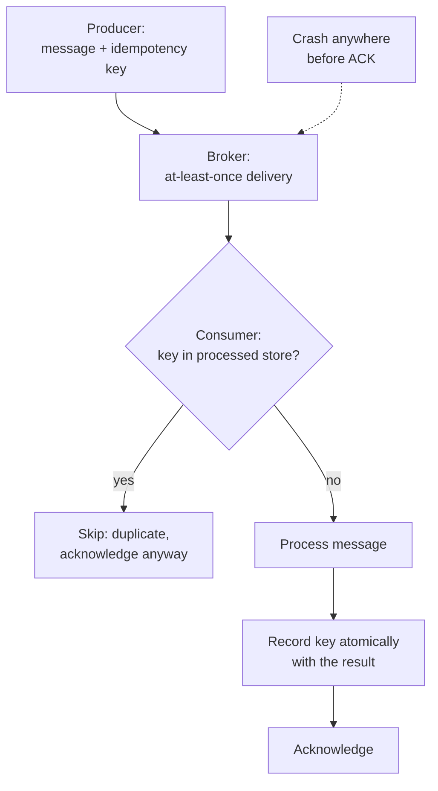

# Distributed-Systems Primitives for ML Systems

Volume 13 designs ML systems: serving, training clusters, capacity math. But it assumes a set of primitives it never teaches. How do keys find servers? What does "delivered exactly once" really mean? What happens when a fast producer meets a slow consumer? How do tenants share one system fairly, and how do messages stay ordered? Those primitives are older than ML, and every ML system sits on top of them. This appendix teaches each one from zero, with the ML-system examples where they bite.

## Chapter 1. Consistent hashing

### 1.1 The problem with hash mod N

You have 100 cache servers and a million model artifacts to store. The obvious scheme: server = hash(key) mod 100. It works beautifully until server 101 arrives. Now every key's home changes, because mod 101 gives different answers than mod 100. Nearly all one million keys move at once. The new server gets a thundering herd, the old servers sit idle, and your "scaling event" is an outage.

This is the general problem: a distribution scheme that depends on the number of servers reshuffles everything when that number changes. The fix is a scheme where adding or removing a server moves only the keys that must move. That scheme is consistent hashing.

### 1.2 The ring

Picture the output of your hash function as a clock face. Hash values run from 0 up to some huge maximum, and the maximum wraps around to 0, forming a circle. This is the hash ring.

Now place the servers on the ring by hashing their names, and place the keys on the same ring by hashing the keys. Each key belongs to the first server clockwise from it. That is the entire algorithm.

When a new server joins, it lands somewhere on the ring and takes over the keys between itself and its counterclockwise neighbor. Only those keys move: roughly 1/N of the total, where N is the number of servers. When a server leaves, its keys fall to its clockwise neighbor. Everything else stays put.

The worked numbers: 100 servers, 1,000,000 keys. With hash mod N, adding server 101 moves about 990,000 keys. With consistent hashing, the new server takes over about 1/101 of the ring, so roughly 9,900 keys move. That is 1% instead of 99%.

```
THE HASH RING (4 servers, 8 keys):

              hash = 0
                |
         .------+------.
       .'       |       '.
      /     Server A      \
     |    (pos 1,000)     |
     |         |          |
  3/4 of   key1 o         |  1/4 of
  the ring |    o key2    |  the ring
     |     o key3         |
     |  Server D          |  Server B
     |  (pos 3,000)       |  (pos 2,000)
      \    |  o key4     /
       '.  o key5  o key6'
         '---+---+---'
             |   o key7
          Server C o key8
          (pos 4,000)

Each key walks clockwise to the first server it meets.
key1 -> A, key2 -> B, key4/key5 -> D, key7/key8 -> C.
Add Server E at pos 2,500: only key2 (between 2,000 and 2,500) moves.
```

### 1.3 Virtual nodes

A bare ring has a flaw: with few servers, the random positions land unevenly. One server might own 40% of the ring while another owns 5%. When the 40% server fails, its whole load dumps onto one neighbor.

Virtual nodes fix this. Each physical server gets many positions on the ring, say 100 to 200, computed by hashing "server-1", "server-2", and so on. A key still walks clockwise to the first position it meets, then maps back to the physical server. With 100 virtual nodes per server, each server's share of the ring converges to 1/N, and a failure spreads its load across many neighbors instead of one.

Where this bites in ML systems: distributed caches for embeddings and feature stores, sharded model registries, request routing across inference replicas, and partition assignment in training-data pipelines. Anywhere you map many keys to a changing set of machines, you want this ring.

```python
import hashlib

def _pos(token):
    # Map a string to a point on the ring: md5 -> 128-bit integer.
    # md5 is fine here because we need spread, not security.
    return int(hashlib.md5(token.encode()).hexdigest(), 16)


class HashRing:
    def __init__(self, nodes, vnodes=100):
        # vnodes: virtual positions per physical node. More vnodes = more
        # even the split, at the cost of a bigger ring to search.
        # 100-200 is the usual working range.
        self.ring = {}       # position -> physical node
        self.sorted_keys = []  # positions in ascending ring order
        for node in nodes:
            self.add_node(node, vnodes)

    def add_node(self, node, vnodes=100):
        # Each virtual node is one more point on the ring. Adding a node
        # only steals keys that fall between its points and their
        # counterclockwise neighbors: about 1/N of the data moves.
        for i in range(vnodes):
            pos = _pos(f"{node}#{i}")
            self.ring[pos] = node
            self.sorted_keys.append(pos)
        self.sorted_keys.sort()  # Keep sorted so lookup is a binary search.

    def remove_node(self, node, vnodes=100):
        # Remove every virtual point for this node. Its keys fall through
        # to the next clockwise owner: the minimum possible disruption.
        for i in range(vnodes):
            pos = _pos(f"{node}#{i}")
            del self.ring[pos]
            self.sorted_keys.remove(pos)

    def get(self, key):
        # Walk clockwise: the first ring position >= hash(key) owns it.
        # If nothing is clockwise, wrap around to position 0.
        import bisect
        h = _pos(key)
        idx = bisect.bisect_left(self.sorted_keys, h)
        if idx == len(self.sorted_keys):
            idx = 0  # wrap-around: the ring has no end
        return self.ring[self.sorted_keys[idx]]


# Demo: 4 nodes, then add a 5th, and count how many keys move.
ring = HashRing(["gpu-0", "gpu-1", "gpu-2", "gpu-3"], vnodes=200)
keys = [f"artifact-{i}" for i in range(20000)]
before = {k: ring.get(k) for k in keys}
ring.add_node("gpu-4", vnodes=200)
moved = sum(1 for k in keys if ring.get(k) != before[k])
print(f"keys moved: {moved} / {len(keys)} = {moved/len(keys):.1%}")
# Expect ~20% (1/5 of the ring). Compare: hash-mod-N would move ~80%.
```

::: walkthrough
1. `_pos` hashes any string to a 128-bit ring position. Nodes and keys share the same space, which is what makes "first server clockwise" well-defined.
2. `add_node` plants 200 virtual positions per server. The sort keeps the ring ordered so lookup is a binary search: O(log M) where M is the total number of virtual positions.
3. `get` finds the first position at or after the key's hash, wrapping to zero at the end. That wrap-around is the only tricky line.
4. The demo prints the fraction of keys that moved when the 5th node joined. With 200 virtual nodes it lands near 20%, the fair share. Hash mod N would have moved roughly 80%.
:::

::: takeaway
- Consistent hashing maps nodes and keys onto one ring; each key goes to the first node clockwise.
- Adding or removing a node moves only about 1/N of the keys, not nearly all of them.
- Virtual nodes (100 to 200 per server) even out the load and spread the pain of a failure.
- Use it anywhere many keys meet a changing set of machines: caches, registries, replica routing.
:::

## Chapter 2. Delivery semantics and idempotency

### 2.1 Three promises, and which one you can keep

A message broker can make three promises about each message.

At-most-once: the message is delivered zero or one times. Fast and simple. If the consumer crashes mid-processing, the message is gone.

At-least-once: the message is delivered one or more times. Nothing is lost, but duplicates happen. The consumer acknowledges after processing, so a crash before the acknowledgment means the broker resends.

Exactly-once: the message is delivered exactly one time. This is the promise everyone wants, and it is impossible in the strict sense. Networks can lose the acknowledgment, so the sender can never be sure the message arrived. The receiver sees either a duplicate or a gap, and no protocol fixes that. What systems actually offer is effectively-once: at-least-once delivery plus idempotent processing, so duplicates have no effect. The observable behavior is exactly-once, even though the wire is not.

### 2.2 Idempotency: the practical answer

An operation is idempotent if doing it twice has the same effect as doing it once. "Set user 42's plan to Pro" is idempotent. "Add one credit to user 42" is not.

Two standard mechanisms make consumers idempotent.

Idempotency keys. The producer attaches a unique key to each message, often a UUID or a natural business key like an order id. The consumer keeps a store of processed keys. When a message arrives, the consumer checks the store: new key means process and record it, known key means skip. The check and the processing must be atomic, or a crash between them replays the message.

Sequence numbers. The producer numbers its messages 1, 2, 3. The broker or consumer deduplicates by sequence: a message with a sequence number already seen is a retry, not new work. This is how the Kafka idempotent producer works: it adds sequence numbers per partition, and the broker drops any message whose sequence number it has already committed. Combined with transactions that bundle "consume, process, produce, commit offset" into one atomic unit, Kafka offers effectively-once stream processing.

The rule for ML systems: every training-data pipeline, every feature write, every billing event for inference usage must be idempotent. Retries are not optional in distributed systems, so non-idempotent handlers are bugs waiting for a bad network day.



```python
class IdempotentConsumer:
    def __init__(self):
        # processed: the set of idempotency keys already handled.
        # In production this is a database table or Redis set with a TTL,
        # not a Python set; the logic is identical.
        self.processed = set()
        self.effects = []  # stand-in for the real side effects (DB writes, etc.)

    def handle(self, msg_id, payload):
        # The atomicity contract: "check + record + apply" must happen as one
        # unit. If the process crashes between applying and recording, the
        # retry replays the message. In a real system, wrap these three steps
        # in one database transaction.
        if msg_id in self.processed:
            return "duplicate-skipped"  # At-least-once redelivery: harmless.
        self.effects.append(payload)    # The real side effect goes here.
        self.processed.add(msg_id)      # Record BEFORE acknowledging upstream.
        return "processed"

    def run(self, stream):
        # Simulate a broker that redelivers: each message may arrive twice.
        results = []
        for msg_id, payload in stream:
            results.append(self.handle(msg_id, payload))
            if msg_id.endswith("-retry"):
                # The broker timed out waiting for our ack and resent.
                results.append(self.handle(msg_id, payload))
        return results


consumer = IdempotentConsumer()
stream = [("order-1", "charge $5"), ("order-2", "charge $7"), ("order-1-retry", "charge $5")]
print(consumer.run(stream))
print("side effects applied:", consumer.effects)
# The retry is skipped: "charge $5" appears exactly once in effects.
```

::: walkthrough
1. `handle` checks the processed set first. This is the idempotency gate: every duplicate dies here.
2. The side effect is applied, then the key is recorded. Recording before acknowledging upstream is what makes a crash safe: an unacknowledged message gets redelivered, and the redelivery hits the gate.
3. The atomicity comment is the most important line. If "apply" and "record" are not one transaction, a crash between them replays the effect. The gate only works when check, apply, and record are indivisible.
4. The demo shows a redelivered message being skipped. The effects list contains each payload exactly once: effectively-once from at-least-once delivery.
:::

::: takeaway
- Exactly-once delivery is impossible on the wire. Systems sell effectively-once: at-least-once plus idempotent processing.
- Make handlers idempotent with idempotency keys or sequence numbers, and keep the check-apply-record step atomic.
- Every pipeline that retries (all of them) needs idempotent handlers, or duplicates become corruption.
:::

## Chapter 3. Backpressure

### 3.1 The queue that ate the cluster

A fast producer feeds a slow consumer. Between them sits a queue. If nothing limits the queue, it grows: 10,000 messages, then 100,000, then the process runs out of memory and dies. The queue did not solve the overload. It converted overload into latency, then into an outage, with no signal to anyone until the crash.

Backpressure is the alternative: the consumer pushes the overload back toward the producer instead of silently absorbing it. "Slow down" is a message, not a hope.

### 3.2 The mechanisms

Every backpressure mechanism is a way of saying "I am full" that the producer must respect.

Bounded queues. The queue has a maximum size. When it fills, the producer blocks, gets rejected, or drops according to policy. The bound is the whole mechanism: an unbounded queue is just a delayed crash.

Blocking. The producer waits until there is room. Simple and honest, but it ties up the producer's threads, so it only works when the producer can afford to wait.

Rejection. The consumer answers "try later": HTTP 429 or 503, a dropped message, a dead-letter queue. The producer sees an explicit signal and can retry with backoff. This is load shedding's polite cousin: shedding drops work to protect the system, backpressure signals the producer to slow down. Use rejection when latency matters and work can be retried.

Demand signaling. The consumer tells the producer how much it can take: "send me 100 more." TCP's receive window is the classic example. The receiver advertises how many bytes it can accept, and the sender cannot outrun it. Reactive streams use the same idea with request(n).

Sizing a bounded queue is arithmetic, not intuition. Little's Law says the average wait equals the queue length divided by the service rate. A queue of 10,000 in front of a consumer serving 100 requests per second is a 100-second wait. If your deadline is 2 seconds, the right bound is about 200, and everything beyond it should be rejected fast rather than queued slow.

### 3.3 Where it lives in ML systems

Inference serving is the obvious one. A burst of requests hits the gateway, the GPUs can serve 100 per second, and the queue in front of the batcher is where backpressure lives. Reject with 429 when the queue is full; do not let the 10,001st request wait 100 seconds for an answer nobody wants anymore.

Training-data pipelines are the quiet one. A fast reader feeds a slow writer; a bounded channel between them blocks the reader instead of growing memory without bound. Kafka consumers do this naturally: the broker never pushes faster than the consumer pulls, so consumer lag is the backpressure signal you monitor.

```python
from collections import deque

class BoundedQueue:
    def __init__(self, capacity, policy="reject"):
        # capacity: max items waiting. Pick it from Little's Law:
        # capacity = service_rate * max_acceptable_wait.
        # policy: what happens when a producer arrives at a full queue.
        #   "reject"  -> tell the producer to back off (HTTP 429 style).
        #   "drop-oldest" -> evict the stalest item (good for live dashboards,
        #                    terrible for billing: know which you are).
        self.capacity = capacity
        self.policy = policy
        self.q = deque()
        self.rejected = 0  # Count rejections: your backpressure metric.

    def put(self, item):
        # Returns True if accepted, False if the producer must slow down.
        # Never silently grows: that is the whole point of the bound.
        if len(self.q) < self.capacity:
            self.q.append(item)
            return True
        self.rejected += 1
        if self.policy == "drop-oldest":
            self.q.popleft()   # Shed the stalest work, accept the new.
            self.q.append(item)
            return True
        return False  # "reject": the producer sees the signal and backs off.

    def get(self):
        # Consumer pulls one item. Returns None when empty: the consumer
        # idles instead of inventing work.
        return self.q.popleft() if self.q else None


# Little's Law sizing: 100 req/s service, 2 s max wait -> capacity 200.
q = BoundedQueue(capacity=200, policy="reject")
accepted = sum(1 for i in range(1000) if q.put(f"req-{i}"))
print(f"accepted {accepted}, rejected {q.rejected}")
# 200 accepted, 800 rejected fast: latency stays bounded, producers back off.
```

::: walkthrough
1. `put` is the backpressure point. A full queue never grows; it either rejects or drops the oldest, and it counts every rejection so you can alert on it.
2. The capacity comes from Little's Law, not from a guess. Service rate times acceptable wait gives the bound; everything past the bound is a fast rejection instead of a slow wait.
3. The policy choice is a product decision disguised as code. "reject" protects latency and correctness. "drop-oldest" protects freshness. Pick deliberately.
4. `get` returns None on empty. The consumer idles rather than spinning, which keeps CPU free for actual work.
:::

::: takeaway
- Backpressure pushes overload back to the producer. An unbounded queue just turns overload into latency, then into a crash.
- Size bounded queues with Little's Law: capacity = service rate times acceptable wait.
- Mechanisms: block, reject (429/503), or demand signaling (request(n), TCP window). Shedding drops work; backpressure slows the producer.
- Watch the rejection count. It is the signal that tells you the system is at its limit.
:::

## Chapter 4. Fair multi-tenant scheduling and ordered messaging

### 4.1 The noisy neighbor

One inference cluster serves two teams. Team C sends a burst: 240,000 requests per second. Team D sends a trickle: 9,700 per second. With a single first-in-first-out queue, service follows arrivals, so C gets about 96% of the GPU time and D's requests wait behind C's backlog. D did nothing wrong and gets nothing.

Fair scheduling divides service deliberately among the tenants that have work waiting. If C and D both have requests queued, D's next request runs within a bounded number of turns, no matter how large C's backlog grows. Weights let a bigger contract earn a bigger share without taking everything. With weights 3 and 1, C gets 75% and D gets 25%, even if C would take 96% under FIFO.

### 4.2 The algorithms

Weighted round robin visits each active tenant in proportion to its weight. It is simple and works when requests cost about the same. When requests have very different costs, a cheap heartbeat and an expensive batch job should not count equally. Deficit round robin gives each tenant a credit allowance per round and dispatches its work while the credit covers the cost, charging bytes or estimated processing time. The expensive job burns credit faster, so cost differences stop being a loophole.

Dominant Resource Fairness handles multiple resource types at once: CPU, memory, GPU, bandwidth. Each tenant's dominant resource is the one it uses the largest share of. The scheduler equalizes the dominant shares. A worked example: the cluster has 8 CPUs and 32 GB of memory. Tenant A wants 2 CPUs and 4 GB per task; tenant B wants 1 CPU and 8 GB. A's dominant resource is memory at 4/32 = 12.5%; B's dominant resource is memory at 8/32 = 25%. DRF allocates to equalize those dominant shares, so neither tenant is starved on the resource it needs most. This is the standard answer when someone asks how to share a cluster fairly across different resource types.

### 4.3 Ordered messaging

Some streams must arrive in order: a user's edits to a document, the events of one training job, the log lines of one request. The standard mechanism is partitioning: the broker guarantees order within one partition, not across partitions. Kafka works this way. All messages with the same key go to the same partition, and within that partition every consumer sees them in the order they were written.

The trade-off is parallelism. Order exists per partition, so throughput scales with the number of partitions. One giant ordered stream is one partition and one consumer: correct and slow. Key insight: you rarely need global order. You need per-entity order, and partitioning by entity key gives you exactly that, with parallelism across entities.

Ordering also interacts with idempotency from Chapter 2. A consumer that sees sequence numbers 1, 2, 4 knows 3 is missing or delayed. The gap is information: the consumer can wait briefly, then either request a resend or proceed according to policy. Without sequence numbers, a missing message is invisible.

```python
def weighted_round_robin(weights, steps):
    # weights: {"team-c": 3, "team-d": 1}. Yields which tenant is served
    # at each step. Smooth WRR spreads each tenant's turns evenly instead
    # of clumping them: with 3:1 you get C C D C, not C C C D.
    # "Smooth" matters for latency: clumped turns starve the small tenant
    # for the whole clump.
    tenants = list(weights.keys())
    # current[v] tracks each tenant's running credit. Each step, every
    # tenant earns its weight, the richest is served, and serving costs
    # the total weight. Over time each tenant is served in proportion
    # to its weight: this is the fairness guarantee, in one loop.
    current = {t: 0 for t in tenants}
    total = sum(weights.values())
    schedule = []
    for _ in range(steps):
        for t in tenants:
            current[t] += weights[t]   # everyone earns credit each round
        nxt = max(tenants, key=lambda t: current[t])  # richest goes next
        current[nxt] -= total          # serving costs the whole pot
        schedule.append(nxt)
    return schedule


sched = weighted_round_robin({"team-c": 3, "team-d": 1}, 8)
print(sched)
c_share = sum(1 for t in sched if t == "team-c") / len(sched)
print(f"team-c share: {c_share:.0%}, team-d share: {1 - c_share:.0%}")
# team-c 75%, team-d 25%: bounded wait for D no matter how big C's burst.

# The DRF worked example from the chapter, as arithmetic.
def dominant_share(cpu_want, mem_want, cpu_total, mem_total):
    # Returns (dominant resource name, its share). DRF equalizes this
    # number across tenants: the scheduler favors whoever is lowest.
    cpu_share = cpu_want / cpu_total
    mem_share = mem_want / mem_total
    if cpu_share >= mem_share:
        return "cpu", cpu_share
    return "memory", mem_share

print("A:", dominant_share(2, 4, 8, 32))  # memory 12.5%
print("B:", dominant_share(1, 8, 8, 32))  # memory 25.0%
# DRF serves A until its dominant share catches up to B's: fair across
# resource types, not just across request counts.
```

::: walkthrough
1. The scheduler keeps a credit balance per tenant. Each round, everyone earns credit equal to their weight, the richest tenant is served, and serving subtracts the total weight from the winner.
2. Because earning is proportional to weight and serving costs the same pot for everyone, each tenant's long-run share equals its weight over the total weight. That is the fairness guarantee, and it holds regardless of arrival bursts.
3. The demo prints a 75/25 split for weights 3 and 1. Team D's requests run within a bounded number of turns even if team C's backlog is enormous.
4. The DRF helper computes each tenant's dominant resource share. The scheduler's rule is simple: always serve the tenant with the lowest dominant share. That one rule generalizes fairness from one resource to many.
:::

::: takeaway
- FIFO is unfair under bursts: the loudest tenant takes everything. Fair schedulers bound every tenant's wait.
- Weighted round robin for equal-cost work, deficit round robin when costs differ, Dominant Resource Fairness across CPU, memory, GPU, and bandwidth.
- Ordering is per partition, not global. Partition by entity key for per-entity order with parallelism across entities.
- Sequence numbers turn a missing message from invisible to detectable.
:::

::: provenance
**Last verified: September 2026.** Consistent hashing (Karger et al., MIT, 1997): hash ring, clockwise ownership, O(K/N) remapping; virtual nodes as the standard load-evening fix. Delivery semantics (at-most-once, at-least-once, effectively-once via idempotency): standard distributed-systems doctrine. Kafka idempotent producer (per-partition sequence numbers) and transactional consume-process-produce: documented Kafka design. Backpressure mechanisms (bounded queues, rejection with 429/503, demand signaling via request(n), TCP receive window) and Little's Law sizing: standard practice. Dominant Resource Fairness (equalizing dominant shares across resource types): the standard multi-resource fair scheduler. **UNVERIFIED:** the specific numeric examples (1M keys, 240k vs 9.7k req/s burst, 8 CPU/32 GB cluster) are illustrative constructions, not measurements from a real deployment.
:::
