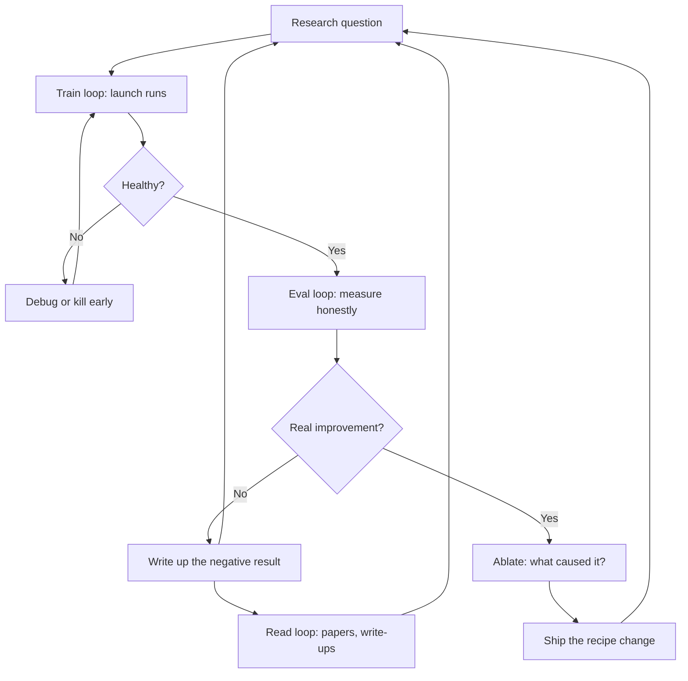
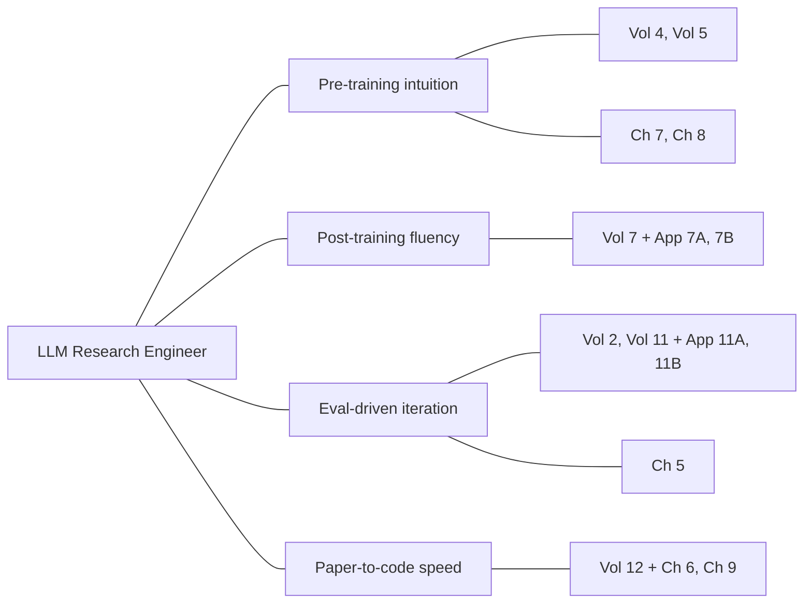
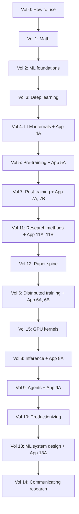
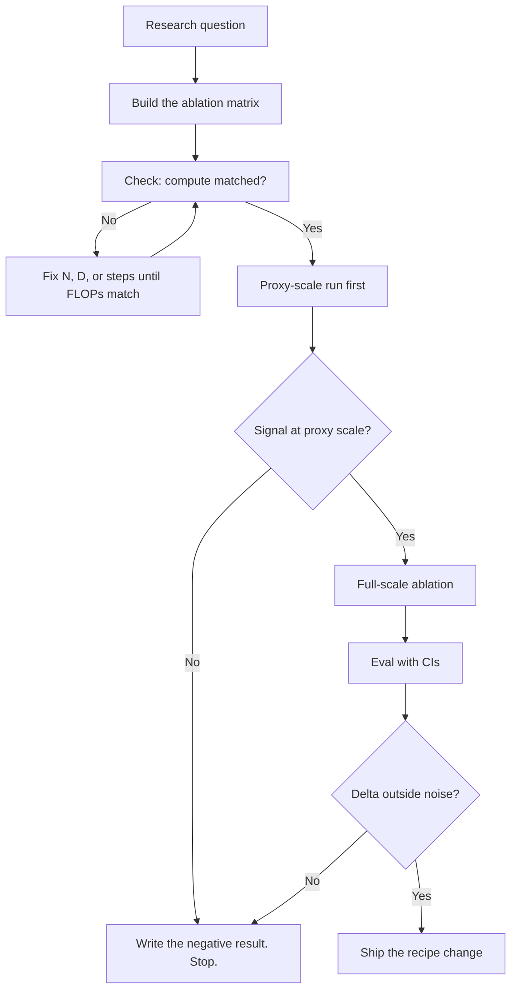
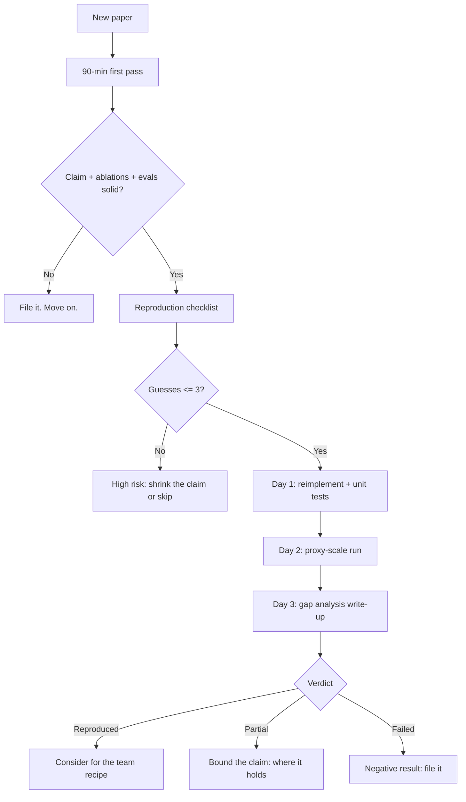
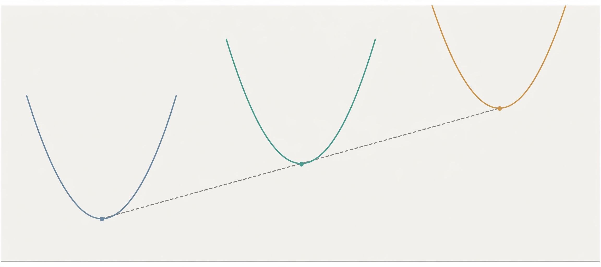
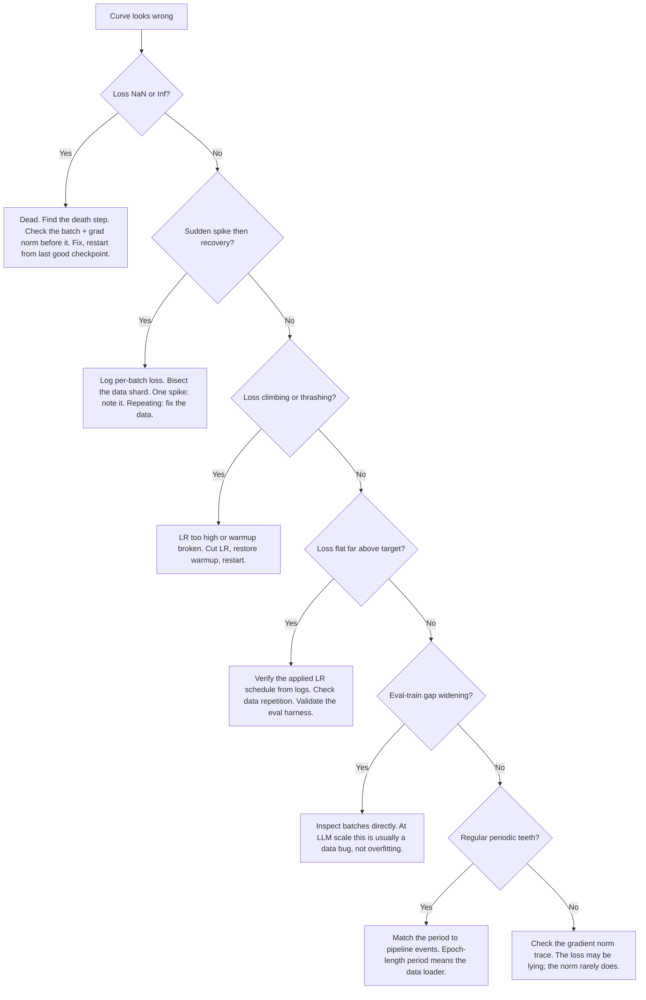
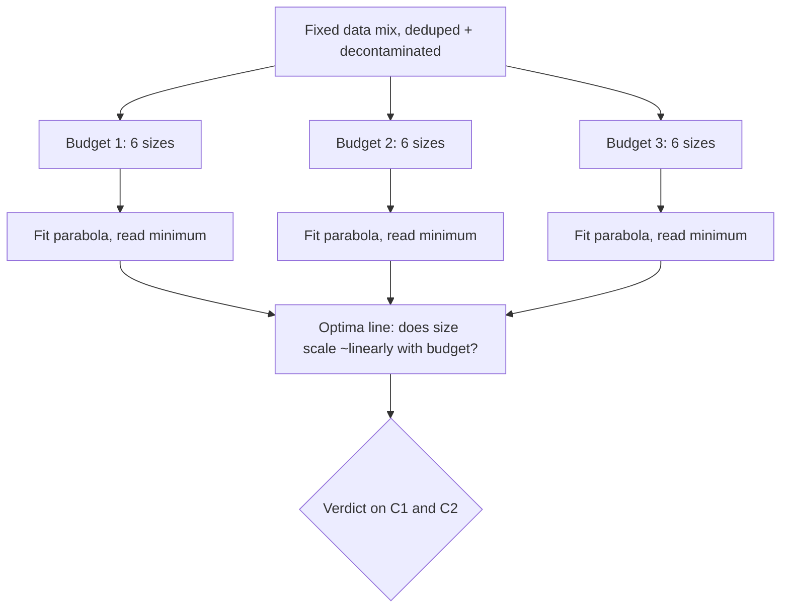

# Role Track 1: LLM Research Engineer (Generalist)

This track turns the base curriculum into a job-shaped path. The base volumes teach the science. This track teaches the craft. You will see how an LLM research engineer spends the week, what the work demands, and how the work is judged. You will also learn skills no volume covers on its own: ablation design, paper reproduction, scaling-law judgment, and training-run debugging.

Read Part 1 first for orientation. Follow Part 2 in order. Work Part 3 as projects, not as reading. The capstone at the end ties everything together.

::: takeaway
- An LLM research engineer prototypes training ideas and turns the good ones into model improvements. The loop is train, measure, decide.
- This role rests on four demands: pre-training intuition, post-training fluency, eval-driven iteration, and paper-to-code speed.
- Success is measured in honest eval deltas and ablations that change the recipe. Everything else is decoration.
:::


*Figure T1. The three loops in one picture. The monitor shows the train loop. The notebook holds the read loop. The rack in the back is where the eval loop's compute lives.*

## Part 1. The role, up close

## Chapter 1. A week in the life

An LLM research engineer works on the models themselves. Not the product around them. Not the serving stack, except to understand it. The raw material is training runs: pre-training runs, post-training runs, and the evals that judge them.

A generalist is not a specialist in one stage. They can read a loss curve from a pre-training run on Monday. They can debug a reward-hacking post-training run on Wednesday. And they can design the eval that settles an argument on Friday. Depth in one area is expected. Fluency in all of them is the job.

### The three loops

Every week is three loops running at once.

**The train loop.** Launch runs, watch them, debug them, kill the bad ones early. A run that will fail almost always shows it in the first 5 percent of steps. The skill is spotting the signature and acting fast, because a dead run still burns the cluster allocation.

**The eval loop.** Every idea ends in a number. The engineer designs the comparison, runs the evals, and decides what the number means. This loop is where most bad science happens: contaminated evals, cherry-picked seeds, and baselines that were never trained to the same standard.

**The read loop.** Papers, internal write-ups, and teammates' ablations. The field moves weekly. The read loop is not passive consumption. It is triage: which claims are solid, which are worth reproducing, which change what you will try next.



::: walkthrough
1. **Top: the question.** Every cycle starts with one falsifiable question, like "does this data mix lower eval loss at fixed compute."
2. **Left: the train loop.** Runs launch. Unhealthy ones die early. The engineer watches curves, not just final numbers.
3. **Middle: the eval loop.** Surviving runs get measured. The decision point is strict: is the improvement real, meaning outside noise and honestly controlled.
4. **Right: the read loop.** Negative results and new papers both feed the next question. Nothing is wasted if it is written down.
:::

### What a typical week looks like

Percentages vary by team and by where the current project sits. The shape below is representative of a generalist on a modeling team at a frontier lab.

| Day | Main activity | Loop |
|---|---|---|
| Monday | Design review, plan the week's runs, launch | Train |
| Tuesday | Run triage: check curves, kill or keep | Train |
| Wednesday | Debug the sick runs, fix data or code | Train |
| Thursday | Eval analysis on finished runs, ablations | Eval |
| Friday | Write up results, read, plan next week | Read |

Rough time split across a month: about 40 percent on experiments (launching, watching, debugging) and 20 percent on evals and analysis. The rest goes to code and tooling, reading and writing, and reviews and planning.

### The day the run dies

This happens weekly. A 2,000-GPU run starts diverging at step 40,000. Alerts fire. The engineer's job in the next hour:

1. Read the curve. Is this a spike (recoverable) or divergence (fatal)? Chapter 8 teaches the signatures.
2. Check the checkpoint. Roll back to the last good one if the spike is transient.
3. Find the cause. Bad data shard, a node that went flaky, an LR schedule bug.
4. Decide: resume, restart, or redesign. A restart with no fix is just burning money twice.
5. Write the post-mortem. One page. What happened, what the signature was, what changed.

The post-mortem habit is what separates engineers who repeat failures from engineers who compound knowledge. Vol 6 Appendix 6A covers the reliability machinery. Chapter 8 covers reading the curves.

::: takeaway
- The job is three loops: train, eval, read. They run every week, in parallel.
- About 40 percent of time goes to experiments, 20 percent to evals, the rest to code, reading, and writing.
- Dead runs are normal. The skill is early detection, fast diagnosis, and a written record.
:::

## Chapter 2. The four core demands

Role research across 2026 postings at frontier labs keeps returning to the same four asks. They are quoted in `build/research/role-asks.md`. Here is what each one means in practice.

### Demand 1. Pre-training intuition

Know what moves the curve and what does not. Data mix changes the curve. The learning-rate schedule changes the curve. Batch size changes the curve up to a point, then stops mattering. Most architecture tweaks do not move the curve at all, and knowing which ones might is the intuition.

This intuition is not mystical. It is built from scaling laws (Vol 5, Chapter 4), from reading many loss curves (Vol 5, Chapter 7), and from ablations (Chapter 5 of this track). The generalist does not need to have led a frontier pre-training run. They need to reason correctly about one.

### Demand 2. Post-training fluency

Most lab modeling work in 2026 is post-training: SFT, preference data, RLHF, DPO, GRPO, verifiers, rejection sampling. The generalist knows the algorithms (Vol 7), the data pipelines behind them (Appendix 7B), and the failure modes: reward hacking, length bias in judges, mode collapse in RL.

Postings ask for this explicitly. One 2026 posting for a production post-training role states the ask in one line. Engineers must "design, build, and run pipelines for model fine-tuning and evaluation." They must also "debug complex issues in training pipelines and model behavior."

### Demand 3. Eval-driven iteration

Every claim ends in a measured number on a clean eval. The generalist picks evals that match the claim. They read each delta against noise (Appendix 11A). And they keep evals clean: no training on the test set, no prompt tuning on the eval, no silent contamination.

This is the demand most candidates fail in practice. Not because they cannot code, but because they accept numbers too easily. Chapter 5 and Chapter 6 of this track are the antidote.

### Demand 4. Paper-to-code speed

A paper lands on Monday. By Friday the engineer has a small-scale reproduction, a verdict on the claim, and a plan for whether it belongs in the team's recipe. This requires reading code fast, reimplementing from equations, and testing at small scale before spending real compute.

Vol 12 gives the paper spine. Chapter 6 teaches the reproduction method. Chapter 9 is the full practice run.



::: walkthrough
1. **Center: the engineer.** Four demands radiate outward. None is optional.
2. **First ring: the demands.** Pre-training intuition and post-training fluency are the two halves of training knowledge. Eval-driven iteration and paper-to-code speed are the two halves of research judgment.
3. **Outer ring: where to build each.** Volumes supply the knowledge. Track chapters 5 through 9 supply the craft that volumes do not teach.
:::

### The supporting skills

Four more skills show up in postings and matter daily, but they support the four demands rather than standing beside them:

- **Distributed training mechanics** (Vol 6): DDP, FSDP, tensor and pipeline parallelism, checkpointing. You cannot debug a run you cannot picture.
- **GPU performance sense** (Vol 15): MFU, roofline thinking, what a kernel costs. Small inefficiencies multiply across thousands of GPUs.
- **Inference awareness** (Vol 8): KV cache math, batching, cost per token. Training decisions have serving consequences.
- **Systems judgment** (Vol 13, Vol 10): backpressure, retries, rollout safety. Research code becomes production code.

::: takeaway
- Four demands: pre-training intuition, post-training fluency, eval-driven iteration, paper-to-code speed.
- Each demand maps to specific volumes plus specific track chapters. The map above is your checklist.
- Distributed training, GPU performance, inference awareness, and systems judgment support the four. They are not optional either.
:::

## Chapter 3. How success is measured

Research engineering is unusual: the output is knowledge, but knowledge that must survive contact with a cluster. Here is how good work is recognized.

### The primary metric: honest eval deltas

A change ships when it improves held-out evals by more than noise, under controlled conditions. Three words carry the weight:

- **Held-out.** The eval data was never trained on, never prompt-tuned on, never filtered by. Contamination voids the result.
- **Noise.** Every eval has error bars. A 0.3 point gain on an eval with 1 point of noise is not a gain. Appendix 11A teaches the statistics.
- **Controlled.** Same data, same compute, same eval harness, only the ingredient changed. Chapter 5 teaches the controls.

### Ablations that ship

The unit of progress is the ablation that changes the recipe. "We tried X and it helped" is a story. "We ablated X against a compute-matched baseline, the delta was +1.2 with 95 percent CI [+0.6, +1.8], and the recipe now includes X" is a result. Labs keep recipe documents. Getting your ablation into the recipe is the visible form of impact.

### Engineering measures

- **MFU achieved.** Model FLOPs utilization: what fraction of the hardware's peak your run actually used. Frontier runs target 40 to 60 percent. Low MFU is burned money.
- **Runs completed without rescue.** A run that needed three manual restarts cost engineer-hours, not just GPU-hours.
- **Reproducibility.** Same code, same data, same seed: same result. If a teammate cannot reproduce your number, you do not have a number.

### Research measures

- **Write-ups that teach.** A clear internal write-up of what was tried, what happened, and what it means. Good write-ups get cited by teammates for months.
- **Negative results that save compute.** Killing a bad idea with a clean small-scale experiment is valuable. It is only valuable if it is written down, or the team will try it again next quarter.
- **Published work.** Some teams publish. Publications are a lagging indicator of the above, not a separate game.

### Anti-metrics: what looks like success and is not

```
+-------------------------------------------------------------+
| ANTI-METRIC                  | WHY IT LIES                  |
+------------------------------+----------------------------+
| Leaderboard chasing          | Optimizes the eval, not    |
|                              | the model. The gain does   |
|                              | not transfer.              |
+------------------------------+----------------------------+
| Cherry-picked seeds          | One lucky seed is noise    |
|                              | wearing a costume.         |
+------------------------------+----------------------------+
| Improvements inside noise    | The CI includes zero.      |
|                              | There is no improvement.   |
+------------------------------+----------------------------+
| Baseline trained badly       | Beating a weak baseline    |
|                              | proves nothing about the   |
|                              | idea.                      |
+------------------------------+----------------------------+
| Private eval tuning          | Prompt-tune on the eval    |
|                              | and you have measured      |
|                              | your tuning, not the model.|
+------------------------------+----------------------------+
```

::: callout warn
Every anti-metric on this list has shipped a bad decision at a real lab. The defense is always the same: pre-register the eval, fix the harness before the runs finish, and report every seed you ran, not just the good ones.
:::

::: takeaway
- Ship on honest eval deltas: held-out evals, error bars, controlled comparisons.
- The unit of progress is the ablation that changes the team recipe.
- Engineering counts: MFU, clean runs, reproducibility. Negative results count, but only when written down.
- Memorize the anti-metrics. You will meet all five.
:::

## Part 2. The ordered reading path

## Chapter 4. Study order and why

The base curriculum is 16 volumes. For this role, order matters more than speed. Each stage builds the mental models the next stage assumes. The table below gives the order, the chapters that matter most, and one line on why each stage sits where it does.



::: walkthrough
1. **Top: foundations.** Vols 0 through 4 build math, ML honesty, deep learning mechanics, and the transformer itself. Nothing later makes sense without them.
2. **Middle: training and judgment.** Vol 5 teaches pre-training. Vol 7 teaches post-training, because most lab work in 2026 lives there. Vol 11 teaches rigor, placed deliberately before Vol 12 so you read papers with the eval-statistics lens already on.
3. **Bottom: scale and breadth.** Vol 6 and Vol 15 teach running at scale and the hardware underneath. Vol 8 teaches serving. Vols 9, 10, 13, 14 round out agents, production, systems, and communication.
:::

### Stage 1. Foundations

**Vol 0: How to use.** Read Chapters 1, 5, and 8. Why: ground rules, how to study each volume, and the pacing contract. Skip nothing here; it sets the study method.

**Vol 1: Math for ML.** Priority chapters: 2 (linear algebra), 3 (probability), 4 (statistics), 6 (optimization), 7 (information theory). Why: information theory is the loss function of language models in disguise, and optimization is the language every training discussion is held in. Chapter 5 (calculus) matters for backprop intuition; skim it if time is short, since Vol 3 rebuilds what you need.

**Vol 2: ML foundations bridge.** Read all five chapters, in order. Why: this volume is the honesty core of the whole curriculum. The experiment loop, splits, metrics, leakage, and "is the win real" are the daily operating system of Chapter 3's success metrics. A generalist who skips Vol 2 will produce numbers nobody trusts.

**Vol 3: Deep learning for researchers.** Read all six chapters. Why: normalization, initialization, optimizers, mixed precision, and gradient checkpointing are the five knobs you will touch on every real run. Chapter 6 bridges into the transformer. Postings name PyTorch fluency as a hard requirement; this volume plus the labs is where that fluency starts.

### Stage 2. The model and how it is trained

**Vol 4: LLM internals.** Read all eight chapters, then Appendix 4A (long-context engineering). Why: you cannot debug what you cannot picture. Attention by hand, RoPE, MQA vs GQA, and the KV cache are the internals behind half of all training and serving decisions. Appendix 4A matters because context length is now a first-class design axis, not a footnote.

**Vol 5: Pre-training.** Read all nine chapters, then Appendix 5A (mid-training). Why: this is Demand 1 in volume form. Data sourcing, the next-token objective, scaling laws, the anatomy of a training step, LR schedules, and loss-curve reading are the complete pre-training toolkit. Chapter 7 (reading loss curves) pairs directly with this track's Chapter 8. Appendix 5A covers the mid-training stage that modern recipes insert between pre-training and post-training.

**Vol 7: Post-training and RL.** Read the main volume, then Appendix 7A (RL systems) and Appendix 7B (post-training data pipelines). Why: this is Demand 2. SFT, RLHF, DPO, GRPO, verifiers, and rejection sampling are the current lab toolkit. Appendix 7B is the most valuable addition in the whole curriculum for alignment-team roles: synthetic data pipelines and verifier design are where post-training gains actually come from. Appendix 7A covers the rollout infrastructure that makes RL training work at scale.

### Stage 3. Judgment

**Vol 11: Research methods.** Read the main volume, then Appendix 11A (eval statistics) and Appendix 11B (preference labeler protocols). Why: placed before the paper spine on purpose. Eval statistics is how you tell a real delta from noise. Labeler protocols matter because preference data quality caps every alignment method. Read this, then read papers differently forever.

**Vol 12: Paper spine.** Read all fourteen papers in order, with the synthesis chapter. Why: this is the shared vocabulary of the field. Attention, GPT-2, GPT-3, Chinchilla, InstructGPT, Constitutional AI, FlashAttention, LLaMA, DPO, DeepSeek-R1: each one changed what labs do. For this track, Papers 5 (Chinchilla), 11 (DPO), and 14 (DeepSeek-R1) deserve the deepest study, and Paper 5 is the capstone target in Chapter 9.

### Stage 4. Scale

**Vol 6: Distributed training.** Priority chapters: 2 (DDP), 4 (FSDP), 5 (tensor parallelism), 6 (pipeline parallelism), 8 (combining strategies), 9 (checkpointing), 10 (profiling). Then Appendix 6A (training reliability) and Appendix 6B (parallelism depth and XLA/TPU). Why: postings list distributed training as a hard requirement. Reliability is what separates engineers who have run at scale from those who have only read about it: async checkpointing, straggler detection, loss-spike rollback. Appendix 6A is the operations manual.

**Vol 15: GPU kernels.** Priority chapters: 1 (execution model), 2 (memory hierarchy), 4 (roofline diagnosis), 5 (Triton kernel from scratch). Why: a 2026 posting analysis found Triton kernel authorship in 35 percent of infra postings, and kernel work is called the lowest cost-to-impact edge of the stack. Even a generalist who never ships a kernel needs the roofline mental model to read a profiling report and to know when MFU is the bottleneck.

### Stage 5. Breadth

**Vol 8: Inference serving bridge.** Read the main chapters (KV paging, disaggregated prefill/decode, speculative decoding, benchmarking rigor), then Appendix 8A (inference economics). Why: training decisions have serving consequences, and the generalist sizes both sides. Benchmarking rigor here reinforces the eval honesty of Vol 11.

**Vol 9: Agents and RAG guide.** Follow the paths, then read Appendix 9A (agent evals) in full. Why: agent evals are the 2026 frontier of evaluation work: task harnesses, graders, judge calibration, and lucky-pass mitigation. A generalist who can build a trustworthy agent eval is rare and valuable. Appendix 9B (agent security) is worth a skim.

**Vol 10: Productionizing and MLOps.** Read the full volume. Why: incident response, CI/CD for ML, and reliability contracts are the disciplines that keep research code from becoming production incidents. The worked incident narrative is the template for the post-mortem habit from Chapter 1.

**Vol 13: ML system design.** Read the main volume, then Appendix 13A (distributed systems primitives). Why: design judgment for the systems around the model: batching, caching, routing, backpressure, multi-tenancy. The cost-model drill is worth memorizing; it answers "can we afford this idea" in one minute.

**Vol 14: Communicating research.** Read the full volume. Why: the write-up is the deliverable. Design reviews, research notes, and honest negative-result write-ups are how the work compounds across a team. Read it last, when you have results of your own to communicate.

::: takeaway
- Order: foundations (0-3), the model and training (4, 5, 7), judgment (11, 12), scale (6, 15), breadth (8, 9, 10, 13, 14).
- Vol 11 sits before Vol 12 deliberately: learn rigor, then read papers.
- Vol 7 sits before Vol 6 deliberately: post-training fluency pays off sooner than distributed-training depth for most generalist work.
- The appendices are not optional extras. 7B, 11A, 6A, and 9A are core material for this role.
:::

## Part 3. Role-specific craft chapters

These five chapters teach the craft the base volumes do not cover. Work them as projects with code, not as reading.

## Chapter 5. Ablation design done right

### What an ablation is

An %%ablation%% removes or changes one ingredient of a system and measures the effect. It is the only honest way to claim "X caused the improvement." Everything else is correlation with a story attached.

Example: the team thinks a new data mix improves math scores. The ablation trains two runs. Run A uses the old mix. Run B uses the new mix. Everything else is identical. If B beats A by more than noise, the mix caused it. If anything else differed, you learned nothing, and the GPU bill is the tuition.

### Controls: what "identical" actually means

A control is the baseline run that differs from the treatment in exactly one factor. In practice, "identical" means:

- Same model architecture, same parameter count, same initialization scheme.
- Same data, except the one ingredient under test. Same token order. Same seed.
- Same optimizer, same learning-rate schedule, same batch size, same number of steps.
- Same eval harness, same prompts, same decoding settings.

Miss any one of these and the comparison is confounded: the measured difference could come from the thing you changed or from the thing you forgot to hold still.

### Confounders: the usual suspects

A %%confounder%% is a hidden difference that rides along with the change you meant to test. The classic confounders in LLM ablations:

1. **Compute mismatch.** Run B trained longer, or on a bigger model, than run A. The most common confounder in the field. If compute differed, you compared budgets, not ideas.
2. **Learning-rate schedule tied to steps.** Cosine decay tuned for 100K steps behaves differently at 50K steps. Changing training length without retuning the schedule confounds the result.
3. **Seed and data order.** One seed is one sample. A "win" on a single seed pair is noise until shown otherwise.
4. **Tokenizer or preprocessing changes.** A new tokenizer changes every token count, which changes effective data and compute. It is never "just" a tokenizer change.
5. **Eval contamination.** The new data mix accidentally includes eval-adjacent text. The score goes up. Nothing was learned.

```
The confounder trap, in one picture:

  What you think you tested:      What you actually tested:
  ┌──────────────┐                ┌──────────────┐
  │  old data    │                │  old data    │
  │  100B tokens │                │  100B tokens │
  └──────┬───────┘                └──────┬───────┘
         │ vs                            │ vs
  ┌──────┴───────┐                ┌──────┴───────┐
  │  new data    │                │  new data    │
  │  100B tokens │                │  130B tokens │  <- oops
  └──────────────┘                └──────────────┘
  Clean comparison.               You compared data AND compute.
                                  The delta is uninterpretable.
```

### The golden rule: compute-matched comparisons

Match the compute, then compare. The standard accounting for a transformer training run:

**FLOPs ≈ 6 × N × D**

N is the parameter count. D is the training token count. The 6 covers roughly 2 for the forward pass and 4 for the backward pass per token per parameter. This rule comes from the scaling-law literature (Vol 5, Chapter 4) and is accurate within about 10 percent for dense transformers.

Two runs are compute-matched when their 6ND products agree. Report all three numbers (N, D, FLOPs) for both runs, always. A comparison that reports only the score delta is incomplete. A comparison that reports N and D lets the reader check your work.

When model size differs, match FLOPs by adjusting tokens: a 2x larger model trains on half the tokens for the same budget. That is the Chinchilla-optimal comparison, and it is the default fair fight.

### The ablation matrix

Plan ablations as a matrix before launching anything. One factor per axis. Every cell is a run. The matrix forces you to see the confounders before they cost money.

```
Factor under test: data mix (3 levels) x LR schedule (2 levels)

                    cosine decay      WSD schedule
  old mix           run A (control)   run B
  new mix           run C             run D
  new mix + filter  run E             run F

Read the table two ways:
- Down each column: the data-mix effect, holding schedule fixed.
- Across each row: the schedule effect, holding mix fixed.
- The interaction (does the new mix need the new schedule?)
  shows up only if you run the full matrix.
```

The full matrix is expensive. The discipline is deciding which cells you can drop and writing down why, before the runs start. Dropping the interaction cells is a bet that the effects add. State the bet.

### When not to ablate

Ablations cost compute. Spend it where it matters:

- **Ablate the claim, not the curiosity.** The ablation must be able to change a decision: ship the recipe change, kill the idea, or retune the schedule.
- **Proxy first.** A 100M-parameter, 2B-token proxy run answers "does this direction work" for roughly 1/10,000th the cost of a frontier run. Most ablations should happen at proxy scale.
- **Budget the ablation.** A common rule: the ablation budget is 10 to 20 percent of the main run's compute. If the ablation costs more than the decision is worth, the decision was not worth making.
- **Write the negative result.** A clean ablation that kills an idea is a result. File it where the team will find it next quarter.



::: lab Lab 5.1: The compute-matched planner
The code below does two jobs. First, it computes the FLOPs budget for a run from N and D, and finds compute-matched (N, D) pairs along the Chinchilla-optimal line. Second, it compares two eval scores with a bootstrap confidence interval, so you know whether a delta is real or noise. Run it, then adapt it into your own ablation planning sheet.
:::

```python
# Ablation planning toolkit: compute matching + honest comparison.
# WHAT: two helpers every ablation needs. (1) FLOPs accounting so the
#   baseline and the treatment cost the same compute. (2) A bootstrap
#   confidence interval so a score delta is judged against noise.
# WHY: compute mismatch is the most common confounder in the field, and
#   eyeballing a 0.4-point gain is how noise becomes "a result."
# WHAT BREAKS IF CHANGED: the 6 in 6*N*D is for dense transformers with
#   a standard forward+backward pass. MoE models need the active-param
#   count, not the total. The bootstrap assumes per-example scores are
#   independent; for evals with shared passages, resample passages.

import math
import random

random.seed(11)

# --- Part 1: compute matching -------------------------------------------
# 6*N*D: ~2 FLOPs per param per token forward, ~4 backward.

def flops(n_params, n_tokens):
    # Total training FLOPs for a dense transformer run.
    return 6.0 * n_params * n_tokens

def matched_tokens(n_params_new, flops_budget):
    # Tokens that spend exactly `flops_budget` on a model this size.
    return flops_budget / (6.0 * n_params_new)

def chinchilla_pairs(flops_budget, sizes):
    # For each model size, the token count that (a) spends the full
    # budget and (b) sits on the ~20 tokens/param Chinchilla line.
    # If tokens/param drifts far from 20, the budget wants a
    # different size: the pairing is off-optimal.
    rows = []
    for n in sizes:
        d = matched_tokens(n, flops_budget)
        rows.append((n, d, d / n))
    return rows

budget = flops(7e9, 1.4e11)          # a 7B model on 140B tokens
print("budget FLOPs: %.3e" % budget)
for n, d, ratio in chinchilla_pairs(budget, [3e9, 7e9, 13e9]):
    print("  %4.0fB params -> %6.0fB tokens (%5.1f tok/param)"
          % (n / 1e9, d / 1e9, ratio))

# --- Part 2: is the delta real? ------------------------------------------
# Bootstrap CI for the mean difference of paired per-example scores.
# Paired = the same eval items scored by both runs. Pairing removes
# item-difficulty noise, which is most of the variance.

def bootstrap_paired_ci(scores_a, scores_b, n_boot=2000, ci=0.95):
    # Returns (mean_delta, lo, hi). Delta = mean(B - A).
    diffs = [b - a for a, b in zip(scores_a, scores_b)]
    n = len(diffs)
    means = []
    for _ in range(n_boot):
        sample = [random.choice(diffs) for _ in range(n)]
        means.append(sum(sample) / n)
    means.sort()
    lo_i = int(n_boot * (1 - ci) / 2)
    hi_i = int(n_boot * (1 + ci) / 2)
    delta = sum(diffs) / n
    return delta, means[lo_i], means[hi_i]

# Toy eval: 200 items, treatment is truly +2 points better.
base = [random.gauss(60, 15) for _ in range(200)]
treat = [b + random.gauss(2, 3) for b in base]
d, lo, hi = bootstrap_paired_ci(base, treat)
print("delta=%.2f  95%% CI [%.2f, %.2f] -> %s"
      % (d, lo, hi, "REAL (CI excludes 0)" if lo > 0 else "noise (CI covers 0)"))

# Same setup, but the treatment is truly +0.2: inside the noise.
treat2 = [b + random.gauss(0.2, 3) for b in base]
d2, lo2, hi2 = bootstrap_paired_ci(base, treat2)
print("delta=%.2f  95%% CI [%.2f, %.2f] -> %s"
      % (d2, lo2, hi2, "REAL (CI excludes 0)" if lo2 > 0 else "noise (CI covers 0)"))
```

::: walkthrough
1. **Part 1: the budget.** `flops(7e9, 1.4e11)` sets the reference budget. `chinchilla_pairs` then answers: for 3B, 7B, and 13B models, how many tokens spend exactly that budget, and what tokens-per-param ratio results. A ratio near 20 means the size is well matched to the budget.
2. **Part 2: the comparison.** `bootstrap_paired_ci` takes per-item scores from two runs on the same eval items. It resamples the paired differences 2,000 times and reads off the 95 percent interval. Pairing matters: it subtracts out item difficulty, leaving only the runs' difference.
3. **The two demos.** The first treatment is truly 2 points better: the CI sits above zero, so the delta is real. The second is truly 0.2 points better: the CI covers zero, so the honest verdict is noise. Same code, different truth. That is the whole skill.
4. **Adapting it.** Replace the toy scores with real per-item eval outputs. Keep the pairing. Report the interval next to every delta you claim.
:::

::: takeaway
- An ablation changes one factor against a compute-matched control. Everything else identical.
- Memorize the confounders: compute mismatch, schedule coupling, single seeds, tokenizer changes, eval contamination.
- The golden rule is 6ND. Report N, D, and FLOPs for every run in the comparison.
- Proxy-scale first, budget 10 to 20 percent of the main run, and write down negative results.
:::

## Chapter 6. Reading papers as an engineer

Researchers read papers for ideas. Engineers read papers for claims they can test. This chapter is the method for the second kind of reading: fast triage, a reproduction checklist, a catalog of what to distrust, and a three-day reproduction plan.

### The 90-minute first pass

Ninety minutes is enough to decide whether a paper deserves three days. Read in this order, and stop taking notes on anything else:

1. **The claim, in one sentence.** What does the paper say is true that was not known before? Write it down. If you cannot state it in one sentence, the paper has not earned more of your time yet.
2. **The method sketch.** What did they actually do? Data, model, training recipe, evals. One paragraph.
3. **The ablations.** Which ingredients did they remove, and what happened? A paper with no ablations is a paper with no causal claims, whatever the prose says.
4. **The evals.** Which benchmarks, how many seeds, what are the error bars? Check whether the evals match the claim: a reasoning claim needs reasoning evals, not perplexity.
5. **The baselines.** Did they compare against the strongest known alternative, or a weak version of it? A new method beating an undertuned baseline is the most common hollow victory in the literature.

If the claim is interesting, the ablations support it, and the evals are clean, the paper graduates to the checklist.

### The reproduction checklist

Reproduction means rebuilding the result from the paper's description, not rerunning the authors' code. Rerunning code tests the code. Rebuilding tests the claim. Before you write any code, extract these from the paper:

```
REPRODUCTION CHECKLIST
[ ] Claims enumerated: every falsifiable statement, numbered C1..Cn
[ ] Equations: the method written as math, with every symbol defined
[ ] Hyperparameters: LR, schedule, batch size, steps, optimizer settings
[ ] Data: what data, how much, preprocessing, dedupe, decontamination
[ ] Model: architecture, size, init, tokenizer
[ ] Compute: hardware, wall-clock time, or FLOPs (reconstruct 6ND if missing)
[ ] Seeds: how many, which are reported, variance across them
[ ] Ablations: which factors were isolated, against what controls
[ ] Evals: exact sets, prompts, decoding settings, metrics, error bars
[ ] Code: available? If yes, read it AFTER your own implementation works.
[ ] Negative results: what did they try that failed? (Absence is a signal.)
```

Any unchecked box is a guess you will have to make. Count the guesses. More than three material guesses means the reproduction is high-risk: budget accordingly, or pick a smaller claim to reproduce.

### What to distrust

A catalog of the standard failure modes, learned from years of reproductions that did not reproduce:

- **Missing ablations.** The paper shows the full system beating a baseline but never isolates the new ingredient. The gain could come from any of five changes. Treat the causal claim as unproven.
- **Weak baselines.** The baseline uses default hyperparameters while the new method is tuned. Always ask: was the baseline given the same tuning budget? If the paper does not say, assume not.
- **Single-seed results.** One seed is one sample from a noisy process. Small deltas on one seed are noise. This is Chapter 5's rule applied to other people's work.
- **Eval contamination.** The method saw eval-adjacent data during training. Common with web-scale data and with synthetic data generated from eval-style prompts. Check the decontamination section; its absence is the signal.
- **Truncated axes.** A plot whose y-axis starts at 0.80 makes a 0.81 vs 0.83 gap look enormous. Read the numbers, not the ink.
- **Scale of claimed generality.** "Works on 7B models" does not imply "works at 70B." Many methods break with scale: RL tricks that help small models can destabilize large ones. The claim travels only as far as the evidence.
- **The missing negative.** Papers rarely report what failed. If the method has obvious failure modes and none are discussed, the authors either did not look or did not tell. Both are information.

### The three-day reproduction plan

Day 1: reimplement from the equations. Write unit tests against the paper's own worked examples or against limiting cases you can compute by hand. Do not look at the authors' code yet; your implementation must stand on the paper's description.

Day 2: run at small scale. A proxy that captures the claim's mechanism, not its full glory. If the claim is about data mixing, a 100M-parameter model on 2B tokens shows the direction. Compare against your own baseline, compute-matched, with CIs.

Day 3: compare and write up. Where do your numbers agree with the paper? Where do they differ? A reproduction that matches in direction but not magnitude is still informative: it bounds the claim. Write the gap analysis down. That document is the deliverable, whether or not the numbers matched.



::: lab Lab 6.1: The paper triage scorer
The code below turns the checklist into a number: a reproduction-risk score from 0 (clean) to 100 (do not touch). It is deliberately simple. Its value is not the number. Its value is forcing you to answer every question before spending compute.
:::

```python
# Paper triage scorer: turn the reproduction checklist into a risk number.
# WHAT: a weighted score over the checklist answers. Higher = riskier.
# WHY: engineers triage dozens of papers. A structured score beats gut
#   feel, and the per-question breakdown shows exactly what is missing.
# WHAT BREAKS IF CHANGED: the weights encode judgment (missing ablations
#   hurt more than missing code). Tune them, but write down why.

CHECKS = [
    # (question, weight, what a "yes" means)
    ("Claims stated as falsifiable sentences?", 8,
     "yes = you can write C1..Cn"),
    ("Method fully specified as equations?", 10,
     "yes = you could implement from the math alone"),
    ("All hyperparameters reported?", 9,
     "yes = LR, schedule, batch, steps, optimizer"),
    ("Data described (source, size, processing)?", 8,
     "yes = you could rebuild a similar dataset"),
    ("Decontamination described?", 7,
     "yes = eval overlap was checked and reported"),
    ("Ablations isolate the new ingredient?", 12,
     "yes = the causal claim has direct support"),
    ("Baselines tuned to a fair standard?", 10,
     "yes = same tuning budget as the new method"),
    ("Multiple seeds with variance reported?", 8,
     "yes = the delta survives noise"),
    ("Error bars or CIs on key results?", 6,
     "yes = uncertainty is quantified"),
    ("Compute reported (FLOPs or hardware x time)?", 5,
     "yes = you can budget the reproduction"),
    ("Negative results or failure modes discussed?", 4,
     "yes = the authors looked for problems"),
    ("Code available?", 3,
     "yes = reference implementation exists"),
]

def triage(answers):
    # answers: dict mapping question -> True/False ("yes, the paper has it").
    # Returns (score 0-100, missing list). Missing items add their weight.
    total = sum(w for _, w, _ in CHECKS)
    missing = [(q, w, hint) for q, w, hint in CHECKS if not answers.get(q)]
    score = round(100.0 * sum(w for _, w, _ in missing) / total)
    return score, missing

def verdict(score):
    if score <= 25:
        return "LOW RISK: reproduce the full claim."
    if score <= 50:
        return "MEDIUM RISK: reproduce a narrowed claim; budget extra time."
    return "HIGH RISK: read for ideas only, or find a better-specified paper."

# Example: a typical "exciting but thin" paper.
answers = {
    "Claims stated as falsifiable sentences?": True,
    "Method fully specified as equations?": True,
    "All hyperparameters reported?": False,
    "Data described (source, size, processing)?": True,
    "Decontamination described?": False,
    "Ablations isolate the new ingredient?": False,
    "Baselines tuned to a fair standard?": False,
    "Multiple seeds with variance reported?": False,
    "Error bars or CIs on key results?": False,
    "Compute reported (FLOPs or hardware x time)?": True,
    "Negative results or failure modes discussed?": False,
    "Code available?": True,
}
score, missing = triage(answers)
print("risk score:", score, "->", verdict(score))
print("biggest gaps:")
for q, w, hint in sorted(missing, key=lambda r: -r[1])[:4]:
    print("  -%d  %s (%s)" % (w, q, hint))
```

::: walkthrough
1. **The checklist as data.** Each question carries a weight. Missing ablations cost 12 points, missing code only 3, because the ablations carry the causal claim and the code does not.
2. **The example paper.** It has equations and code but no ablations, weak baselines, one seed, and no error bars. The score lands in high-risk territory. The verdict: read it for ideas, do not budget a reproduction.
3. **How to use it.** Score every paper that survives the 90-minute pass. Sort your reproduction queue by score. Revisit the weights after each reproduction and adjust them to match what actually predicted success.
:::

::: takeaway
- Read for claims you can test. The 90-minute pass filters; the checklist qualifies.
- Reproduction means rebuilding from the description, not rerunning the authors' code.
- Distrust missing ablations, weak baselines, single seeds, contamination, truncated axes, and claims that outrun their scale evidence.
- The deliverable of a reproduction is the gap analysis, not just the number.
:::

## Chapter 7. Scaling-law thinking for small teams

Scaling laws are the closest thing LLM research has to physics. They say: loss falls as a smooth power of compute, parameters, and data. A small team cannot run a frontier training job. But it can use the laws to predict one, to spend a small budget well, and to tell which ideas are worth scaling.

### What the laws say

Two results anchor everything. %%Kaplan scaling laws%% (2020) found that loss follows power laws in compute, data, and model size. Their conclusion: given fixed compute, spend it on parameters. Bigger models were undertrained. %%Chinchilla%% (Hoffmann et al., 2022) corrected this with better experiments: for fixed compute, scale parameters and tokens in equal proportion, about 20 tokens per parameter. The field's recipes changed overnight. GPT-3 was 175B parameters on 300B tokens (undertrained by the Chinchilla rule). Chinchilla itself was 70B on 1.4T tokens, matched Gopher's 280B-parameter compute budget, and beat it.

The practical form is a power law:

**L(C) = a × C^(-b) + c**

L is the loss, C is compute in FLOPs, and a, b, c are fitted constants. The irreducible term c is the loss even infinite compute cannot remove. Fit this on small runs, and you can predict the loss of a run 10x larger, usually within a few percent.

### isoFLOP profiles: the small team's superpower

An %%isoFLOP profile%% fixes the compute budget and varies the model size. Train several sizes at the same FLOPs, plot loss against size, and the curve is a parabola in log space. The bottom of the parabola is the optimal size for that budget. Repeat at three or four budgets. The optima trace the scaling line.

This is how Chinchilla was actually done, and it is the most compute-efficient experiment design in the field. You do not need one giant run. You need a grid of small runs at fixed FLOPs.



*Figure T7. One parabola per compute budget. Each dot is the optimal model size at that budget. The dashed line through the dots is the scaling law you are trying to find: how the optimal size moves as compute grows.*


### Extrapolation discipline

Fitting a power law is easy. Trusting it is the skill. The rules:

1. **Fit in log space.** Take logs of both sides and fit a line. Power laws are straight lines in log-log space, and ordinary least squares works there.
2. **Hold out the largest run.** Fit on the small runs, predict the largest one you already ran, and measure the error. That error is your honest extrapolation uncertainty. Never extrapolate further than about 10x past your largest fitted run without new data.
3. **Laws predict loss, not task scores.** The power law governs cross-entropy loss. Downstream task scores follow loss loosely and noisily. A predicted 0.05 loss improvement does not convert to "+2 points on the benchmark." Report the loss prediction; treat task gains as a hypothesis.
4. **Watch for breaks.** Laws hold within a regime: same data distribution, same architecture family, same tokenizer. Change the data mix and the constants refit. The law is a property of the setup, not of nature.

```
Log-log sketch: loss vs compute for a well-behaved setup

  log(L)
    ^
    |  *                      each * is a run
    |    *
    |      *
    |        *  *
    |              *  *        straight line = power law holds
    |                    *  *
    |                          *  . . . . . .  extrapolation -->
    +--------------------------------------------------> log(C)

  Fit the line on the solid points. Check it against one held-out
  point. Only then extend the dotted line to your target budget.
```

::: lab Lab 7.1: Fit a scaling law and predict
The code below fits L(C) = a * C^(-b) + c in log space on toy runs. It holds out the largest run to measure real prediction error. Then it predicts the loss at a 10x larger budget. This is the complete small-team workflow in 60 lines.
:::

```python
# Scaling-law fit: predict a big run's loss from small runs.
# WHAT: log-space linear fit of loss vs compute, hold-out validation,
#   then extrapolation to a target budget with an honest error bar.
# WHY: this is how small teams decide whether a 10x bigger run is worth
#   the money, before spending it.
# WHAT BREAKS IF CHANGED: the irreducible term c is fixed here at a
#   guess. Fitting all three params (a, b, c) needs more points and a
#   nonlinear solver; with few points the fit becomes unstable. The
#   hold-out error only measures interpolation error; true 10x
#   extrapolation error is larger, so treat the band as a lower bound.

import math
import random

random.seed(21)

# Toy "measured" runs: loss = 12 * C^-0.05 + 1.7, plus measurement noise.
# C in units of 1e18 FLOPs. In real life these come from your runs.
runs = [(0.5, None), (1.0, None), (2.0, None), (4.0, None), (8.0, None)]
measured = []
for c, _ in runs:
    true_loss = 12.0 * (c ** -0.05) + 1.7
    measured.append((c, true_loss + random.gauss(0, 0.01)))

C_IRREDUCIBLE = 1.7   # guess at the floor; refit as data grows

def fit_power_law(points):
    # Fit log(L - c) = log(a) - b*log(C) by least squares.
    # Returns (a, b). Closed form: standard linear regression.
    xs = [math.log(c) for c, _ in points]
    ys = [math.log(l - C_IRREDUCIBLE) for _, l in points]
    n = len(points)
    mx, my = sum(xs) / n, sum(ys) / n
    sxx = sum((x - mx) ** 2 for x in xs)
    sxy = sum((x - mx) * (y - my) for x, y in zip(xs, ys))
    slope = sxy / sxx            # slope = -b
    intercept = my - slope * mx  # intercept = log(a)
    return math.exp(intercept), -slope

def predict(a, b, c):
    return a * (c ** -b) + C_IRREDUCIBLE

# Hold out the largest run: fit on the rest, predict it, measure error.
train_pts, held = measured[:-1], measured[-1]
a, b = fit_power_law(train_pts)
pred_held = predict(a, b, held[0])
err = abs(pred_held - held[1])
print("fit: a=%.3f b=%.4f" % (a, b))
print("held-out run: predicted %.4f, actual %.4f, abs err %.4f"
      % (pred_held, held[1], err))

# Extrapolate 10x past the largest fitted run, with the hold-out
# error as a (lower-bound) uncertainty band.
target = measured[-1][0] * 10
pred = predict(a, b, target)
print("10x budget (%.0fe18 FLOPs): predicted loss %.4f +/- ~%.4f"
      % (target, pred, err))
print("decision rule: if predicted loss beats your target AND the")
print("band stays below it, the run is worth budgeting. Else, run")
print("more points at intermediate budgets first.")
```

::: walkthrough
1. **The data.** Five toy runs at doubling compute budgets. Real runs replace these numbers; the code does not care where they came from.
2. **The fit.** `fit_power_law` works in log space, where the power law is a straight line. It returns the constants a and b. The irreducible loss c is fixed at a guess, which is the standard simplification for small fits.
3. **The hold-out.** The largest run is hidden during fitting, then predicted. The gap between predicted and actual loss is the only honest measure of prediction quality you have. Everything else is optimism.
4. **The decision.** The 10x extrapolation comes with the hold-out error as a band. The printed decision rule is the whole point: the law does not tell you to run. It tells you whether the run is worth budgeting.
:::

::: provenance
**Last verified: September 2026.** Chinchilla's headline numbers (70B parameters, 1.4T tokens, ~20 tokens/param, beating Gopher 280B at matched compute) are from Hoffmann et al., 2022, as covered in Vol 12, Paper 5. The 6ND FLOPs rule is from the same scaling-law literature, Vol 5, Chapter 4.
:::

::: takeaway
- Loss follows a power law in compute. Fit it in log space on small runs; predict big runs.
- isoFLOP profiles are the efficient experiment design: fixed FLOPs, several sizes, read the parabola minimum.
- Hold out your largest run and measure prediction error before trusting any extrapolation.
- Laws predict loss, not benchmark scores. The link from loss to tasks is noisy.
:::

## Chapter 8. Debugging training runs: loss curves as diagnostics

The loss curve is the EKG of a training run. A trained eye reads it the way a doctor reads a heartbeat: not as a single number, but as a shape with a known set of pathologies. This chapter catalogs the shapes, the decision tree for each, and the code that watches curves while you sleep.

### The healthy curve

A healthy language-model training run looks like this. First a steep early drop as the model learns the easy statistics of language. Then a long smooth decay, with small step-to-step noise. Eval loss tracks train loss with a gap that stays roughly constant. The gradient norm decays smoothly alongside.

```
HEALTHY                        step
loss ^                            (thousands)
  8.0| *
     |  *
  6.0|   **
     |     ***
  4.0|        ******
     |              **********
  3.0|                        **********************
     +-------------------------------------------------->
       0    5    10    15    20    25    30    35    40
```

Learn this shape cold. Every pathology below is a deviation from it, and fast recognition is what saves the run.

### The signature gallery

**Loss spike.** A sudden vertical jump, then recovery to near the old level. Cause: almost always a bad data batch (a corrupted shard, a pathological document) or a transient hardware fault. Response: check whether it recovered on its own. If the curve re-converged, note it and move on. If spikes repeat, find the shard: log per-batch loss and bisect the data.

```
SPIKE
loss ^
     |        *
     |        |*|
     |  ******| |******
     +---------------------->
              spike: jump and recover
```

**NaN / Inf.** Loss becomes NaN and stays there. The run is dead; nothing recovers from NaN. Causes, in order of likelihood: learning rate too high; loss scaling overflow in mixed precision; a bad batch with extreme values. Or a bug in a new code path, like a custom loss or a new attention variant. Response: do not just restart. Find the step where it died, inspect the batch, check gradient norms just before death. Restart from the last good checkpoint with the fix.

**Divergence.** Loss climbs steadily instead of falling, or oscillates wildly around a high value. Cause: learning rate too high for this setup, or the warmup was skipped or shortened. Response: cut the LR, restore the warmup, restart. Divergence in the first 1 percent of steps is almost always the LR schedule.

```
DIVERGENCE (LR too high)
loss ^
  9.0|                              *  *  *
     |                           *           *
  7.0|  *  *  *  *  *
     |*                  *
  5.0|                      *
     +-------------------------------------------------->
       loss climbs or thrashes instead of falling
```

**Plateau.** Loss stops falling far above where it should be. Causes: learning rate too low; or data repeated for too many epochs, so the model memorized the easy patterns and has nothing new to learn. Or a misconfigured eval, so you are watching the wrong number. Response: check the LR schedule actually applied (log it, do not assume), check data repetition counts, verify the eval harness on a known-good checkpoint.

**Eval-train gap growing.** Train loss falls, eval loss rises or flatlines while the gap widens. Causes: overfitting, which is rare at LLM scale with single-epoch training, so suspect something else first. Or eval contamination in reverse, meaning the eval set drifted. Or a data pipeline bug feeding repeated or degenerate batches that lower train loss artificially. Response: inspect batches directly. At LLM scale, a growing gap is usually a data bug, not classical overfitting.

**Sawtooth.** Regular periodic spikes, like teeth. Cause: almost always the data loader (epoch boundaries with reshuffling, a short shard cycling) or LR restarts in a cyclic schedule. Response: align the period of the teeth with your pipeline: if the period equals one epoch, it is the data loader.

### The second signal: gradient norm

Loss is the first signal. Gradient norm is the second, and it often moves first. Log it every step:

- **Healthy:** smooth decay, occasional small bumps.
- **About to spike:** norm jumps 10x or more a few steps before the loss jumps. This is your early warning.
- **About to NaN:** norm explodes to Inf. If you see this, the next checkpoint is your last good one.
- **Vanishing:** norm collapses toward zero while loss plateaus. The model stopped learning: check the LR, check for a bug freezing parameters.

### The decision tree



::: callout warn
The most expensive mistake in run debugging is restarting without a diagnosis. A restart preserves the bug and doubles the bill. The rule: no restart without a written hypothesis about what went wrong and what changed. One sentence is enough.
:::

::: lab Lab 8.1: The curve watcher
The code below generates the six signatures synthetically, then runs three detectors over them: a spike detector, a divergence detector, and a NaN scan. Wire detectors like these into your training loop's logging and they will page you before the money burns.
:::

```python
# Training-curve diagnostics: generate signatures, detect them.
# WHAT: synthetic loss curves for the six pathologies, plus detectors
#   for spikes, divergence, and NaN. The detectors use only rolling
#   statistics, so they work online during a real run.
# WHY: recognition speed is the skill. A detector that fires at step
#   41,000 instead of a human noticing at step 60,000 saves real money.
# WHAT BREAKS IF CHANGED: thresholds (3x median, slope windows) are
#   tuned for smooth LLM curves. Noisy small-scale runs need wider
#   windows and higher thresholds, or the detector cries wolf.

import math
import random

random.seed(33)
STEPS = 400

def healthy(n=STEPS, noise=0.03):
    # Steep early drop, long smooth decay, small noise.
    return [3.0 + 5.0 * math.exp(-s / 40.0) + random.gauss(0, noise)
            for s in range(n)]

def with_spike(base, at=200, height=1.5):
    out = base[:]
    out[at] += height
    out[at + 1] += height * 0.4   # partial recovery next step
    return out

def with_nan(base, at=250):
    out = base[:]
    for s in range(at, len(out)):
        out[s] = float("nan")
    return out

def divergent(base):
    # LR too high: climbs and thrashes instead of falling.
    return [b + 0.004 * s + random.gauss(0, 0.08) for s, b in enumerate(base)]

def plateau(base, at=150, floor=4.2):
    return [b if s < at else floor + random.gauss(0, 0.02)
            for s, b in enumerate(base)]

def sawtooth(base, period=50, height=0.25):
    return [b + (height if s % period == 0 else 0) for s, b in enumerate(base)]

# --- Detectors: rolling statistics only, online-safe ----------------------
def rolling_median(xs, i, w=20):
    window = xs[max(0, i - w):i]
    s = sorted(window)
    return s[len(s) // 2]

def detect_spikes(loss, thresh=3.0, w=20):
    # A spike is a jump far above the recent median that the next
    # steps do not sustain. Returns the step indices.
    hits = []
    for i in range(w, len(loss) - 2):
        med = rolling_median(loss, i, w)
        if med != med:            # NaN median: skip
            continue
        if loss[i] > med + thresh * 0.15 and loss[i + 1] < loss[i] - 0.1:
            hits.append(i)
    return hits

def detect_divergence(loss, w=50):
    # Fit a line over the last w steps. Sustained positive slope
    # after the early phase means divergence, not noise. The 0.002
    # threshold sits above the slope noise of a healthy curve.
    tail = loss[-w:]
    if any(x != x for x in tail):
        return False, 0.0
    n = len(tail)
    mx = sum(range(n)) / n
    my = sum(tail) / n
    sxx = sum((i - mx) ** 2 for i in range(n))
    slope = sum((i - mx) * (y - my) for i, y in enumerate(tail)) / sxx
    return slope > 0.002, slope

def detect_nan(loss):
    for i, v in enumerate(loss):
        if v != v:                # NaN != NaN: the standard trick
            return i
    return None

# --- Run the gallery through the detectors --------------------------------
cases = {
    "healthy":   healthy(),
    "spike":     with_spike(healthy()),
    "nan":       with_nan(healthy()),
    "divergent": divergent(healthy()),
    "plateau":   plateau(healthy()),
    "sawtooth":  sawtooth(healthy()),
}
for name, curve in cases.items():
    nan_at = detect_nan(curve)
    spikes = [] if nan_at is not None else detect_spikes(curve)
    div, slope = (False, 0.0) if nan_at is not None else detect_divergence(curve)
    print("%-9s NaN@%s spikes=%s diverged=%s (slope %.5f)"
          % (name, nan_at, spikes[:3], div, slope))
```

::: walkthrough
1. **The generators.** Each function takes a healthy curve and injects one pathology. The spike jumps and partially recovers. NaN poisons everything after its step. Divergence adds a rising ramp plus thrash. The plateau pins the loss to a floor. The sawtooth adds periodic teeth.
2. **The detectors.** `detect_spikes` compares each step against the rolling median of the previous 20 steps: a jump that the next step does not sustain is a spike. `detect_divergence` fits a line to the last 50 steps and fires when the slope exceeds 0.002, a threshold set above the slope noise of a healthy curve. `detect_nan` scans for the first NaN with the `v != v` trick.
3. **The report.** Each case prints its diagnosis. Healthy shows nothing. The spike case flags step 200 and the partial-recovery step 201. The NaN case names the death step, 250. The divergent case shows positive slope. This is the shape of the monitoring you wire into a real training loop.
4. **Tuning for real runs.** The thresholds here suit smooth curves. On noisy proxy runs, widen the windows and raise the thresholds, and always confirm a detector firing by looking at the actual curve before killing a run.
:::

::: takeaway
- Learn the healthy curve cold. Every pathology is a deviation from it.
- Six signatures: spike, NaN, divergence, plateau, growing eval-train gap, sawtooth. Each has a first check and a fix.
- Gradient norm is the second signal. It often moves before the loss does.
- Never restart without a written hypothesis. The detector code above is the start of run monitoring you can actually ship.
:::

## Chapter 9. Capstone: reproduce a paper end to end

Everything in this track converges here. Pick one paper from the Vol 12 spine and plan its reproduction completely: claims, experiment design, compute budget, evals, failure modes, and what "reproduced" means. This chapter does the planning for one paper in full. Your job is to execute a version of it.

### The paper: Chinchilla (Paper 5)

Chinchilla (Hoffmann et al., 2022) is the ideal capstone target for a generalist. The claim changed every lab's training recipe. The method (isoFLOP profiles from Chapter 7) is reusable on any future question. And the reproduction is feasible at small scale: the claim is about the *shape* of the scaling tradeoff, which shows up long before frontier scale.

### Phase 0. Restate the claims as falsifiable statements

From the paper, three claims:

- **C1.** For a fixed compute budget, loss is minimized by scaling parameters and training tokens in roughly equal proportion (about 20 tokens per parameter).
- **C2.** An isoFLOP profile (fixed FLOPs, varying size) shows a clear minimum in loss at the optimal size, fittable as a parabola in log space.
- **C3.** A compute-matched smaller model trained on more tokens beats a larger model trained on fewer tokens (Chinchilla 70B/1.4T vs Gopher 280B).

Each claim gets its own experiment. C2 is the core: if your isoFLOP profiles show minima that move with budget the way the paper's do, you have reproduced the heart of it.

### Phase 1. Data

The paper used MassiveText. You will use an open corpus: a filtered web crawl plus books plus code, deduplicated, with eval sets removed. Three non-negotiables:

1. **Dedupe.** Near-duplicates distort small-scale runs badly. MinHash or exact-substring dedupe before anything else.
2. **Decontaminate.** Remove any document overlapping your eval sets. Your evals here are held-out perplexity on clean domains plus a small downstream suite.
3. **Fix the mix.** The data mix is a confounder for C1. Pick one mix, document it, and do not touch it during the sweep. The mix is not what you are testing.

### Phase 2. The isoFLOP sweep

Pick three compute budgets you can afford, spaced about 4x apart (for example 1e20, 4e20, 1.6e21 FLOPs). At each budget, train four to six model sizes spanning roughly 8x in parameters, with tokens set by the 6ND budget. That is 12 to 18 small runs. Each run is short: these are proxy-scale by design.



### Phase 3. Fit and predict

For each budget, fit loss against log-parameters with a parabola and read the minimum. Plot the three minima against budget in log-log space. C1 predicts the optima line has slope near 1 (size scales linearly with compute) and the tokens-per-parameter ratio at each optimum sits near 20.

Then the C3 test: pick one budget, train the Chinchilla-optimal pair (small model, many tokens) and one off-optimal pair (big model, few tokens) at matched FLOPs, and compare. The optimal pair should win clearly.

### Phase 4. The compute budget

The code below does the full budget math: from (budget, sizes) to tokens per run, total tokens, total FLOPs, and GPU-hours at a given MFU on a given GPU. Budget the sweep before launching anything.

```python
# Capstone budget math: price the isoFLOP sweep before launching it.
# WHAT: from budgets and model sizes, compute tokens per run, total
#   FLOPs, and GPU-hours given hardware peak and MFU.
# WHY: the sweep is 12-18 runs. Without this math you either
#   under-budget (runs die half trained) or over-budget (money burns).
# WHAT BREAKS IF CHANGED: 6ND is dense-transformer accounting (Ch. 5).
#   MFU is the biggest uncertainty: small proxy runs often hit lower
#   MFU than large ones, so pad the GPU-hour estimate by 30-50%.

def plan_sweep(budgets_flops, sizes, gpu_peak_tflops, mfu):
    # budgets_flops: list of FLOPs budgets, e.g. [1e19, 4e19, 1.6e20]
    # sizes: model sizes to try at each budget
    # Returns per-run table + totals.
    rows = []
    total_flops = 0.0
    for b in budgets_flops:
        for n in sizes:
            d = b / (6.0 * n)          # tokens that spend exactly b
            rows.append((b, n, d, d / n))
            total_flops += b
    # GPU-hours = total FLOPs / (peak * MFU), converted to hours.
    gpu_hours = total_flops / (gpu_peak_tflops * 1e12 * mfu) / 3600.0
    return rows, total_flops, gpu_hours

# Example: 3 budgets x 5 sizes on H100 (989 TFLOPS BF16 dense), MFU 0.45.
# Sizes chosen so each budget has entries near the ~20 tok/param line.
H100_PEAK = 989.5
rows, total, hours = plan_sweep(
    [1e20, 4e20, 1.6e21],
    [200e6, 500e6, 1e9, 2e9, 4e9],
    H100_PEAK, 0.45,
)
print("%-12s %-10s %-12s %-10s" % ("budget", "params", "tokens", "tok/param"))
for b, n, d, r in rows:
    print("%.0e %8.0fM %9.1fB %9.1f" % (b, n / 1e6, d / 1e9, r))
print("total FLOPs: %.2e  ->  %.0f H100-hours (x1.4 pad: %.0f)"
      % (total, hours, hours * 1.4))
print("sanity: tokens/param should sit in a sane band; if a row shows")
print("200 tok/param or 2 tok/param, that size is off-budget, drop it.")
```

::: walkthrough
1. **The grid.** Three budgets, five sizes each: 15 runs. For each cell, tokens are set by the budget divided by 6N, which is the compute-matching rule from Chapter 5 applied mechanically.
2. **The sanity check.** The tokens-per-parameter column is the diagnostic. Rows near 20 are on the Chinchilla line. Rows far from it are sizes the budget cannot use well; drop them before spending.
3. **The price tag.** Total FLOPs convert to GPU-hours through hardware peak times MFU. The 1.4x pad covers the optimism in every MFU estimate. This number goes into the project plan before the first run launches.
4. **What varies in real life.** Your budgets, your sizes, your hardware. The structure does not change: match compute, check the ratio, price the grid, pad the estimate.
:::

### Phase 5. Failure modes and what "reproduced" means

Expect these failure modes, and plan for them:

- **Data differences.** Your corpus is not MassiveText. The optima may shift. That does not refute C1; the claim is about the *scaling relationship*, not the exact constants.
- **Optimizer differences.** The paper used Adam with specific settings. Match them as closely as the checklist allows, and note every deviation.
- **Eval noise.** Small models on small evals are noisy. Use the bootstrap CIs from Chapter 5 on every comparison that matters.

"Reproduced" does not mean your numbers match the paper's numbers. It means:

1. Your isoFLOP profiles show clear minima (C2 holds in your setup).
2. The minima move with budget the way the paper predicts (C1 holds in direction).
3. The compute-matched optimal pair beats the off-optimal pair (C3 holds).

Direction plus mechanism, within your measured noise. That is a reproduction. Write the gap analysis: where you agree, where you differ, and what you would need to close the gap.

### If RL is your lane: the DPO alternative

Paper 11 (Direct Preference Optimization) makes a fine alternative capstone. The claims are algorithmic rather than scaling-based: DPO's classification-style objective matches RLHF performance without a separate reward model or PPO. The reproduction is cheaper (fine-tuning scale, not pre-training scale) and exercises Appendix 7B's data pipelines. The same five phases apply: restate claims, fix data, sweep the key hyperparameter (beta), fit, budget, and define "reproduced" before running.

::: lab Lab 9.1: Write the one-page project plan
Before touching code, write one page. Include the three claims (C1-C3) and the 15-run grid with the budget math filled in. Add the evals with their CIs, the three most likely failure modes, and your definition of "reproduced." Get a teammate to red-team it. The plan is the capstone's first deliverable; the runs are the second.
:::

::: takeaway
- Chinchilla is the ideal generalist capstone: the claim changed the field, the method is reusable, and it reproduces at small scale.
- Five phases: restate claims, fix data, run the isoFLOP sweep, fit and predict, define "reproduced" before running.
- Budget the sweep with the code above. Pad GPU-hours by 40 percent.
- Reproduction means direction plus mechanism within noise, not matching the paper's exact numbers.
:::

## Chapter 10. The first 90 days

A ramp plan that turns the reading path and the craft chapters into a working routine. Adjust the pace to your study hours; keep the order.

```
Days  1-30   FOUNDATIONS + FIRST RUNS
  Vol 0 (study method), Vol 1 (math), Vol 2 (honesty core)
  Vol 3 (DL mechanics), start Vol 4 (transformer internals)
  Project: tiny GPT from Vol 5 capstone. Watch its loss curve daily.
  Drill: Chapter 8 signature gallery until recognition is instant.

Days 31-60   TRAINING + JUDGMENT
  Finish Vol 4 + App 4A, Vol 5 + App 5A (pre-training intuition)
  Vol 7 + App 7A, 7B (post-training fluency)
  Vol 11 + App 11A, 11B (rigor), then Vol 12 paper spine
  Project: first real ablation (Ch 5) with compute matching + CIs.
  Deliverable: one-page write-up, including one negative result.

Days 61-90   SCALE + CAPSTONE
  Vol 6 + App 6A, 6B (distributed training, reliability)
  Vol 15 (kernels), Vol 8 + App 8A (inference)
  Start the Chinchilla capstone (Ch 9): phases 0-2.
  Vol 9 + App 9A, Vol 10, Vol 13 + App 13A, Vol 14 as reading.
  Deliverable: capstone project plan (Lab 9.1), red-teamed.
```

Three habits to install from day one, from Chapter 1: kill bad runs early, write the post-mortem, and file every negative result where the team will find it. The knowledge compounds. That is the whole game.

::: takeaway
- 90 days: foundations and first runs, then training plus judgment, then scale plus the capstone.
- Every stage ends in a deliverable: a running model, an ablation write-up, a capstone plan.
- The three habits (kill early, post-mortem, file negatives) matter more than any single volume.
:::

---

*Role Track 1 of the research-engineer curriculum. Companion tracks cover post-training and alignment, inference and serving, distributed training systems, evals and safety, and agent systems. The base volumes are the shared foundation; the tracks are the craft.*
