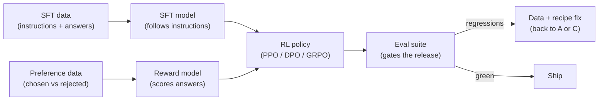
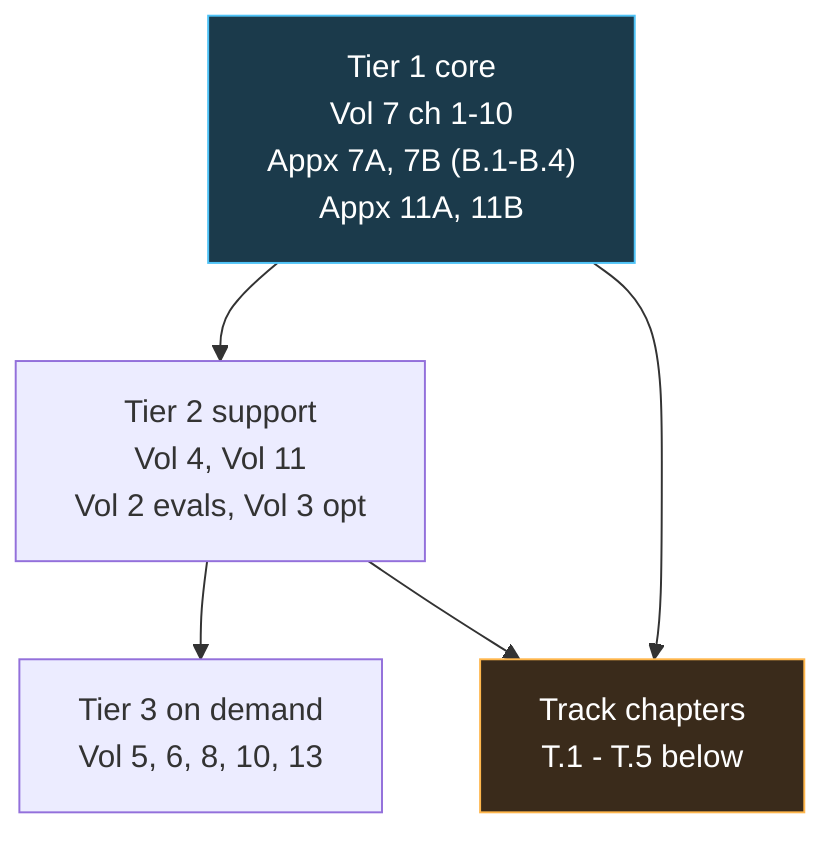
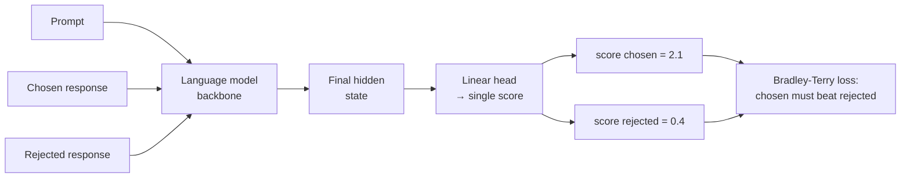
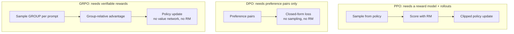
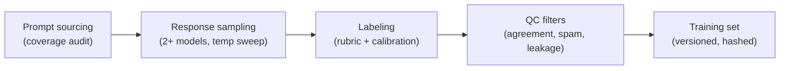
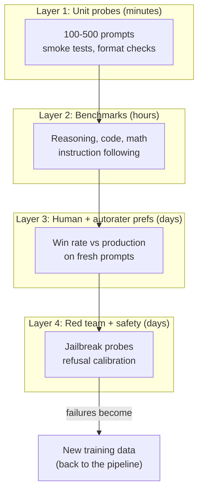

# Role Track 2: Post-Training and Alignment Engineer

This track turns the base curriculum into one job-shaped skill set: taking a pre-trained base model and turning it into a product people can trust. SFT, preference data, reward models, RLHF and RLAIF, DPO and GRPO, and the evals that gate every release. It is written for a working engineer, not a student: every chapter ends in something you can run, measure, or ship.

**How to use this track.** Read Part 1 for the role map. Follow Part 2's ordered reading path through the base volumes. Then work Part 3's specialist chapters in order: each builds on the last, and each ends with a lab. Budget roughly three to four weeks at deep focus.

**Prerequisites, assumed cold for the track but covered in the base:** Python and NumPy fluency. Basic probability. What a loss function is. How a transformer works (Volume 4 chapters 1 to 3). If those are shaky, start with the reading path in Part 2. It points at exactly the chapters that fill each gap.

## Part 1: The role brief

### 1.1 What a post-training engineer owns

A pre-trained model predicts the next token. That is impressive and useless as a product. It rambles. It hallucinates with confidence. It answers harmful requests cheerfully. The post-training engineer owns everything between that raw capability and a model you can put in front of users.

Six systems, in the order they run:



1. **SFT (supervised fine-tuning).** The instruction-following layer. Curated demonstrations teach format, tone, and task shape. Small in tokens, huge in behavior.
2. **Preference data.** Human (or AI) judgments of which response is better. The fuel for everything after SFT.
3. **The reward model.** A learned stand-in for human judgment. It scores responses so RL can optimize them at machine speed.
4. **The RL step.** PPO, DPO, or GRPO push the policy toward high-reward behavior while a KL penalty keeps it near the SFT model.
5. **The eval suite.** Benchmarks, human evals, red-team probes, and capability checks. Nothing ships without green gates.
6. **The iteration loop.** Eval failures become data fixes and recipe changes. The loop in the diagram above is the actual job: most weeks look like "F regressed, go fix C."

You do not own pre-training. You do not own serving. You own the thin, high-impact layer that decides what the model is like to use. A great post-training team can make a mid-size model feel smarter than a larger one. A bad one can take a strong base model and train the capability out of it.

### 1.2 The day-to-day loop

Strip away the job titles and the week looks like this.

**Monday: read the evals.** The weekend's training run finished. You open the dashboard: win rate against the current production model, benchmark deltas, refusal rates, red-team flags. One chart matters most: reward model score versus human-judged quality on a held-out set. If the two diverge, your reward model is lying to you. That is the week's problem.

**Tuesday: data work.** Half the job is data. You sample 200 preference pairs the labelers produced. You find the rubric is ambiguous on code answers: labelers prefer the longer explanation, the reward model learned "longer is better," and now outputs are bloated. You rewrite the rubric, add examples, and queue a re-label. You also dedupe the new SFT batch: 4 percent are near-duplicates of eval questions. They get cut, not kept, because eval leakage is a career-ending metric.

**Wednesday: the training fix.** The PPO run keeps collapsing: KL from the SFT model spikes, then reward flatlines. You check the rollout buffer and find the verifier is rejecting valid math answers over formatting. You fix the verifier, lower the KL coefficient, and relaunch. You also kick off a DPO baseline on the same data, because DPO is cheaper and you want to know if the complexity of PPO is buying anything.

**Thursday: analysis.** You plot the overoptimization curve: policy samples scored by the proxy reward model versus scored by a held-out gold reward model. The proxy keeps climbing. The gold peaks, then falls. You are past the peak. The fix is early stopping on the gold metric, not the proxy. You write this up in two paragraphs for the team.

**Friday: ship review.** The candidate model beats production on the human-eval win rate, 54 to 46, and holds capability benchmarks within noise. Refusal calibration looks right: it refuses the disallowed set and answers the edge cases. You sign off. The model ships.

Notice what is missing from that week: no new architecture, no pre-training, no GPU kernel work. The levers are data quality, reward design, KL control, and eval discipline. That is the whole game.

### 1.3 How success is measured

Post-training is one of the few ML roles with crisp numbers. They fall into four buckets.

**Preference metrics.** %%Win rate%% is the headline: on a fixed prompt set, what fraction of the time do human judges prefer the new model over the baseline? A win rate above 50 percent with tight confidence intervals is a real improvement. Volume 11 Appendix A covers the statistics: with random outputs, you need hundreds of judgments to separate 52 percent from noise.

**Capability metrics.** Benchmarks the model must not regress: reasoning, coding, math, instruction following, long context. The trap is optimizing one suite while silently degrading another. Every serious team keeps a fixed "guardrail" set that blocks releases on any significant drop.

**Safety metrics.** Refusal rates on disallowed content, measured on fixed probe sets. But refusal alone is a bad metric: a model that refuses everything is safe and useless. The real metric is calibration: refuse the disallowed, answer the benign, and explain borderline cases. Track the false-refusal rate as carefully as the true-refusal rate.

**Reward-model health metrics.** These are internal, but they predict everything else. Three to watch: agreement between the reward model and held-out human labels, the overoptimization gap (proxy score versus gold score on policy samples), and KL drift from the SFT model. When these go wrong, the external metrics follow within one training cycle.

::: takeaway
- The role owns six systems: SFT, preference data, reward model, RL step, eval suite, iteration loop.
- Day to day, the levers are data quality, reward design, KL control, and eval discipline. Architecture is someone else's job.
- Success is measured in win rates, capability guardrails, refusal calibration, and reward-model health metrics, in that order of visibility.
:::

::: ob-board The proxy-gold gap
A reward model scores your policy's outputs higher every week. Held-out human judges say quality peaked two weeks ago. Which number do you trust, and what do you change on Monday?
:::

## Part 2: Ordered reading path

Read in this order. Each entry names the chapters that matter for this role and the one reason they matter. Skip nothing in Tier 1. Tier 2 fills the gaps you will feel in week two. Tier 3 is reference: read the chapter when the track points at it.

### Tier 1: the core (do not skip)

**Volume 7, chapters 1 to 10.** The spine of the whole track. Chapter 1 frames the alignment problem in concrete failures. Chapters 2 and 3 cover SFT mechanics and preference data, the two data systems you will touch daily. Chapter 4 builds the RLHF pipeline end to end: reward model, PPO, KL penalty. Chapter 5 derives DPO from first principles with a worked numeric example. Chapter 6 covers GRPO and RLVR, the current default for reasoning models. Chapter 7 covers Constitutional AI and RLAIF. Chapter 8 is reward hacking: read it twice, because your reward model will try to eat your product. Chapter 9 is eval-driven iteration, the outer loop of the job. Chapter 10 is the SFT-or-RL decision guide. Finish with the capstone lab: SFT then DPO on the tiny GPT.

**Appendix 7A, chapters A.1 to A.3.** RL at scale is a systems problem. A.1 covers rollout generation throughput: why online RL is usually bottlenecked on generation, not gradients. A.2 covers inference engines inside the RL loop. A.3 covers async architectures and memory layout for rollout workers. You need this the first time a PPO run is slow and nobody knows why.

**Appendix 7B, chapters B.1 to B.4.** The data half of post-training. B.1 is synthetic data pipelines (STaR, rejection sampling, distillation at scale). B.2 is verifier and reward pipelines: how checkable rewards are built. B.3 is SFT data mixtures and rejection-sampling recipes: the actual craft of the data mix. B.4 is preference-data collection design, the direct prerequisite for track chapter T.3.

**Appendix 11B, chapter 1.** Preference labels are only as good as the labelers. This chapter covers rubrics, agreement, and calibration: the difference between labels that train a reward model and labels that train noise. Read it before you touch any labeling pipeline.

**Appendix 11A, chapters 1 and 2.** Eval statistics for non-deterministic systems. Chapter 1 covers A/B design when outputs are random: sample sizes, confidence intervals, and why a 52 percent win rate on 100 judgments means nothing. Chapter 2 covers calibrating an autorater against humans, because you will use LLM judges and you need to know when to trust them.

### Tier 2: the supporting structure

**Volume 4, chapters 1 to 3 and the long-context appendix.** You debug post-training failures by reading model behavior. That requires knowing what the model is: tokenization, attention, and how context is used. The long-context appendix (4A) matters because post-training data increasingly lives in long conversations, and reward models see the whole thing.

**Volume 11, main chapters.** Research methods: experiment design, ablations, and writing up results. The Thursday analysis in the day-to-day loop is this volume in practice.

**Volume 2, the eval chapters.** Eval methodology and contamination. Your guardrail sets are worthless if the training data leaked into them. Know how leakage happens and how to check.

**Volume 3, the optimization chapters.** Adam, learning rates, and loss curves. Post-training runs fail in the same ways small runs fail, just more expensively. When KL spikes, you want the optimization chapter's instincts.

### Tier 3: read on demand

**Volume 5 (pre-training).** Read the data chapters when you need to understand what the base model already knows, so your SFT mix does not reteach it. Read the scaling chapters when someone asks whether more post-training data will help.

**Volume 6 (distributed training).** Read when your RL run needs more than one node, or when rollout throughput (Appendix 7A) points at a communication bottleneck.

**Volume 8 (inference serving) and Appendix 8A.** Read when rollout generation is the bottleneck: batching, KV cache, and the economics of sampling millions of completions.

**Volume 10 (productionizing and MLOps).** Read when the eval suite becomes a pipeline: scheduling, versioning, and reproducibility of the whole post-training loop.

**Volume 13 (ML system design).** Read when you design the post-training platform itself: data stores, job orchestration, and the eval service.



::: callout warn
Reading order is load-bearing. Track chapter T.1 assumes Volume 7 chapter 4 (Bradley-Terry reward models). T.2 assumes chapters 4 through 6 (PPO, DPO, GRPO). T.4 assumes Appendix 11A (eval statistics). If a specialist chapter feels like magic, the reading path above names the exact base chapter that removes the magic.
:::

## Part 3: Specialist chapters

### T.1 Reward model training in practice

The reward model is the strangest object in post-training. It is a model trained to predict human taste, then used as the ground truth for training another model. Every failure mode in this chapter comes from that gap: the reward model is a proxy, and proxies get gamed.

#### T.1.1 What the reward model is, mechanically

Take a pre-trained language model. Remove the next-token head. Add a single linear layer that maps the final hidden state to one number. Train it on preference pairs: given a prompt, a chosen response, and a rejected response, push the chosen score above the rejected score.



That is the whole architecture. The craft is in the data and the loss, not the network.

#### T.1.2 Bradley-Terry from scratch

The %%Bradley-Terry model%% turns a pair of scores into a probability. It says: the chance a judge prefers response A over response B is the sigmoid of the score difference.

P(A beats B) = sigmoid(r_A - r_B)

Why this shape? It has three properties you want. Scores far apart give near-certain preference. Equal scores give a coin flip. And it only cares about the difference, so adding a constant to both scores changes nothing. The last property matters: reward scores are relative, never absolute. A reward of 2.1 means nothing alone. It only means "better than 0.4 on the same prompt."

The training loss is the negative log of that probability, summed over pairs. The code below trains a tiny reward model on synthetic pairs. The "responses" are feature vectors, and the true quality is a hidden linear function plus noise. That noise is the point: it stands in for human disagreement.

```python
# Bradley-Terry reward model, from scratch. What it teaches: the
# loss, the gradient, and why noisy labels still train a useful
# ranker.
#
# WHAT:  a linear reward head r(x) = w . x trained so that chosen
#        responses score above rejected ones, via the Bradley-Terry
#        likelihood.
# WHY:   this is the exact objective used for real reward models,
#        minus the transformer backbone. Everything about its
#        behavior (sensitivity to label noise, score scale drift)
#        shows up here too.
# BREAKS IF: you flip the sign in the loss (the model learns to
#            prefer the rejected response), or you forget that
#            scores are only meaningful as differences on the same
#            prompt.

import numpy as np

rng = np.random.default_rng(0)

# --- synthetic preference data ------------------------------------
# Each "response" is a 4-dim feature vector. True quality is linear
# in the features. Human labels are noisy: the judge picks the
# truly-better response 85% of the time, and flips 15% of the time.
# Real label noise looks like this.
n_pairs, dim = 2000, 4
true_w = rng.normal(size=dim)
X = rng.normal(size=(2 * n_pairs, dim))
true_q = X @ true_w
chosen_idx, rejected_idx = [], []
for i in range(n_pairs):
    a, b = 2 * i, 2 * i + 1
    better, worse = (a, b) if true_q[a] > true_q[b] else (b, a)
    if rng.random() < 0.15:          # label noise: the judge slips
        better, worse = worse, better
    chosen_idx.append(better)
    rejected_idx.append(worse)
Xc = X[np.array(chosen_idx)]        # chosen response features
Xr = X[np.array(rejected_idx)]      # rejected response features

# --- train the reward head ----------------------------------------
w = np.zeros(dim)
lr = 0.5
for step in range(300):
    # score difference, chosen minus rejected
    diff = (Xc - Xr) @ w
    # sigmoid(diff) = P(model ranks the pair correctly)
    p = 1.0 / (1.0 + np.exp(-diff))
    # gradient of the Bradley-Terry log-loss, averaged over pairs.
    # (1 - p) is the "surprise": pairs the model already ranks
    # correctly contribute almost nothing; hard pairs drive the
    # update.
    grad = ((1.0 - p)[:, None] * (Xc - Xr)).mean(axis=0)
    w = w + lr * grad

# --- evaluate: learned ranker vs TRUTH ----------------------------
diff_true = (Xc - Xr) @ true_w
# ceiling given 15% label noise: the judge flips that often
agree_truth = ((diff_true > 0)).mean()
diff_learned = (Xc - Xr) @ w
agree_learned = ((diff_learned > 0) == (diff_true > 0)).mean()
print(f"judge agreement with truth : {agree_truth:.3f}")
print(f"model agreement with truth : {agree_learned:.3f}")
print(f"learned weights / true weights: {w / (true_w + 1e-9)}")
```

::: walkthrough
1. We build 2000 pairs with a known true quality function and 15 percent label noise.
2. The loss is negative log sigmoid of the score gap. Its gradient weights each pair by (1 - p): confident correct pairs fade out, uncertain pairs teach.
3. After 300 steps the learned weights recover the true weights up to a scale factor. Scale is free in Bradley-Terry: only differences matter, and scaling all scores by 2 gives the same probabilities after the sigmoid saturates. That is why reward scores drift in scale during real training and you must never compare raw scores across prompts or runs.
4. The model agrees with truth on about 85 percent of pairs. It cannot beat the noise ceiling. More data will not fix label noise; better labels will.
:::

Run it. Then flip the noise to 40 percent and watch the ceiling drop. That number is your reminder: the reward model is bounded by label quality, and label quality is Appendix 11B's whole subject.

#### T.1.3 Data curation: what makes reward data good

Three rules, each learned the expensive way by teams before you.

**Rule 1: on-policy data beats off-policy data.** A reward model trained on responses from model M is most accurate at ranking responses from model M. Train it on human-written responses and GPT-4 responses, then use it to score your own model's outputs, and accuracy drops. The fix used in production: refresh the preference data every few RL rounds with samples from the current policy. The reward model chases the policy.

**Rule 2: hard pairs teach, easy pairs pad.** A pair where any reader sees the winner teaches the model little. A pair where two good answers differ in one subtle way teaches the ranking boundary. When collecting, oversample close calls. When filtering, drop pairs where the score gap is huge and the model is already confident. They contribute near-zero gradient, as the (1 - p) term in the code above shows.

**Rule 3: diversity of prompts beats volume of pairs.** Ten thousand pairs on coding questions train a coding reward model with opinions about everything else. The reward model generalizes across prompts only as far as its training prompts reach. Audit the prompt distribution the way you audit a dataset: by topic, difficulty, and length. A reward model that has never seen a refusal scenario will score refusals randomly.

#### T.1.4 Overoptimization: Goodhart with a plot

%%Goodhart's law%% says: when a measure becomes a target, it stops being a good measure. The reward model is a measure of human preference. RL makes it a target. So the policy learns to score high, not to be good.

The signature is a plot every post-training engineer should be able to draw from memory. Sample responses from the policy at increasing KL distances from the SFT model. Score each with the proxy reward model (the one you train on) and with a gold reward model (a bigger, held-out judge, or human labels). Early on both rise. Then the proxy keeps rising while the gold peaks and falls. You are now training the model to exploit the proxy's blind spots.

```
gold score
  ^
  |        proxy __--‾‾‾‾‾‾‾‾‾‾‾‾‾‾‾‾‾‾‾‾
  |       __--‾‾                      \
  |   __--          gold __--‾‾‾‾\     \
  | _-              __--          \_    \
  |/             _--               \_   \_
  +-------------------------------------------------> KL from SFT
                 ^                   ^
            sweet spot:          overoptimized:
            stop here            proxy up, gold down
```

**How practitioners detect it, in practice:**

1. **The gold-proxy gap.** Keep a held-out reward model (or a human-labeled set) that never trains the policy. Score policy samples with both. The gap between them is your overoptimization meter. When it grows, stop or regularize harder.
2. **KL monitoring.** KL divergence from the SFT model is the x-axis of the plot above. A KL spike with flat or falling human-judged quality is the classic signature. Log it per training step, not per epoch.
3. **Qualitative sampling.** Read 50 outputs at the current checkpoint. Overoptimized models have tells: sycophancy ("Great question!"), hedging stacks, listicles for everything, repeating the prompt back. If the outputs read like they are trying to please a rubric, they are.
4. **Reward hacking probes.** Keep a small set of prompts designed to expose known hacks (see Volume 7 chapter 8). Score them every run. A rising proxy score with rising hack rates is not progress.

**How practitioners fight it:**

- **Early stopping on the gold metric**, not the proxy. Pick the checkpoint where the held-out judge peaks.
- **KL penalty tuning.** More KL penalty moves the peak right (more training before overoptimization) but caps the height. It is a trade, not a fix.
- **Reward model ensembles.** Average several reward models trained on different data splits. Harder to game all of them at once.
- **Iterative reward modeling.** Re-collect preference data on the current policy's outputs and retrain the reward model. This moves the proxy closer to the gold, repeatedly.
- **RLAIF critiques.** Use a strong model to critique and re-rank, catching hacks the reward model misses. Volume 7 chapter 7 covers the machinery.

::: takeaway
- A reward model is a linear head on a Bradley-Terry loss. Scores are relative, never absolute.
- Label noise sets a hard ceiling. On-policy, hard, diverse pairs are what move the needle.
- Overoptimization is the default outcome, not an edge case. Detect it with a gold-proxy gap, KL monitoring, and reading outputs. Fight it with early stopping on gold, KL control, ensembles, and fresh data.
:::

::: lab Lab T.1: Break your own reward model
Extend the T.1.2 script. After training, generate new pairs with a spurious feature the true quality ignores. For example, add a large constant to feature 0 of the "chosen" response in 30 percent of training pairs. Retrain and check: does the learned weight on feature 0 inflate? That inflation is reward hacking in miniature: the model found a shortcut the labels rewarded. Then try the fix: drop the corrupted pairs and confirm the weight recovers.
:::

::: pq
**Q1.** Your reward model gives response A a score of 3.2 and response B a score of 1.1. A colleague says "A is almost three times as good as B." What is wrong with this reading?

A. Nothing, the ratio of scores is the ratio of quality.
B. Bradley-Terry scores are only meaningful as differences; the sigmoid of the gap gives a preference probability, not a quality ratio.
C. The scores need to be normalized to sum to 1 first.
D. Score 3.2 is above the valid range for reward models.
::: answer
**Answer: B.** The Bradley-Terry likelihood only uses the difference r_A - r_B, passed through a sigmoid to get P(A preferred). Ratios of raw scores have no meaning, and the absolute scale drifts during training.
:::
:::

### T.2 DPO vs PPO vs GRPO: trade-offs with worked math

Three algorithms, one goal: move the policy toward preferred outputs without drifting off a cliff. They differ in what they need, what they cost, and where they break. This chapter makes the differences concrete with numbers you can check.

#### T.2.1 The shared objective

All three start from the same RLHF objective. Maximize expected reward, minus a KL penalty that keeps the policy close to the reference (usually the SFT model):

J(pi) = E[ r(x, y) ] - beta * KL( pi || pi_ref )

The beta term is the leash. Beta near zero: the policy chases reward off the cliff into overoptimization. Beta huge: the policy barely moves and you wasted the training run. Every algorithm below is a different way to optimize this objective, with different machinery.



#### T.2.2 PPO, the heavyweight

%%PPO%% (Proximal Policy Optimization) is online RL. Sample from the current policy, score with the reward model, then update with a clipped objective that limits how far the policy moves per step.

The clipped objective for one token:

L = min( ratio * A, clip(ratio, 1 - eps, 1 + eps) * A )

where ratio = pi_new / pi_old and A is the advantage (how much better this token was than expected). The clip is the point: if the advantage is positive, the update can only push the ratio up to 1 + eps. Big steps get trimmed. That keeps training stable when the reward model is noisy.

**What it needs:** a trained reward model, a value network (or value head) to estimate advantages, rollout infrastructure to sample from the policy, and careful KL control. Appendix 7A exists because this infrastructure is half the work.

**Where it shines:** open-ended tasks where no verifier exists (creative writing, conversation, style). The reward model is the only signal, and PPO is the best tool for optimizing a learned reward.

**Where it breaks:** it is fiddly. Four networks train at once (policy, reference, reward, value). KL can spike. The value network can mislead. A PPO run needs babysitting.

#### T.2.3 DPO, the shortcut

%%DPO%% (Direct Preference Optimization) skips the reward model entirely. Volume 7 chapter 5 derives it; here is the punchline. The RLHF objective has a closed-form optimal policy:

pi*(y|x) proportional to pi_ref(y|x) * exp( r(x,y) / beta )

Solve that for the reward, plug it into the Bradley-Terry likelihood, and the reward model vanishes. You get a loss directly on the policy:

L_DPO = -log sigmoid( beta * [ log(pi(chosen)/pi_ref(chosen)) - log(pi(rejected)/pi_ref(rejected)) ] )

**Worked numeric example.** Beta = 0.1. For one pair, the policy assigns log-prob -2.0 to the chosen response and -3.5 to the rejected. The reference model assigns -2.2 and -2.8.

- Chosen margin: (-2.0) - (-2.2) = 0.2. The policy already likes the chosen response a bit more than the reference does.
- Rejected margin: (-3.5) - (-2.8) = -0.7. The policy likes the rejected response less than the reference does. Good.
- Gap: 0.2 - (-0.7) = 0.9. Times beta: 0.09. Sigmoid(0.09) = 0.522. Loss = -log(0.522) = 0.65.
- The gradient pushes the chosen log-prob up and the rejected log-prob down, weighted by (1 - 0.522) = 0.478. Pairs the model already gets right contribute less. Same (1 - p) shape as the Bradley-Terry gradient in T.1, because DPO is Bradley-Terry with the reward model solved out.

**What it needs:** preference pairs and a reference model. No sampling, no reward model, no value network. One training loop.

**Where it shines:** simplicity and stability. It is the default first try for preference tuning.

**Where it breaks:** it is offline. It never sees its own outputs during training, so it cannot correct distribution shift: the pairs came from some other policy. It also inherits a subtle failure: the loss can be minimized by pushing down the rejected log-prob without raising the chosen one, which can degrade overall quality. Watch the chosen log-probs during training; if they fall while the loss falls, you have the failure.

#### T.2.4 GRPO, the verifier's algorithm

%%GRPO%% (Group Relative Policy Optimization) was built for RLVR: reinforcement learning with verifiable rewards. Math, code, and any domain where correctness is checkable.

The trick: sample a group of G responses to the same prompt. Score each with the verifier (0/1, or a partial credit). The advantage for each response is its score minus the group mean, divided by the group standard deviation. No value network needed: the group is its own baseline.

A_i = (r_i - mean(r)) / std(r)

**Worked numeric example.** G = 4 responses to one math prompt. Verifier scores: [1, 1, 0, 0]. Mean = 0.5, std = 0.5. Advantages: [+1, +1, -1, -1]. The two correct solutions get pushed up equally, the two wrong ones pushed down equally. Now consider [1, 0, 0, 0]: mean = 0.25, std ≈ 0.43. Advantages: [+1.73, -0.58, -0.58, -0.58]. The single correct solution gets a big push: it stood out. And [1, 1, 1, 1]: std = 0, advantages undefined, the group contributes nothing. Uniform groups teach nothing, which is why GRPO pipelines filter prompts the model always gets right or always gets wrong.

**What it needs:** a fast verifier and the ability to sample groups per prompt. No reward model, no value network.

**Where it shines:** reasoning. DeepSeek-R1 made GRPO famous by training reasoning with pure verifiable rewards, no human preferences at all.

**Where it breaks:** where there is no verifier. You cannot GRPO your way to better creative writing. It also needs the group size: small G gives noisy advantages, large G costs generation budget.

#### T.2.5 The comparison, side by side

| | PPO | DPO | GRPO |
|---|---|---|---|
| Signal | learned reward model | preference pairs | verifier (0/1 or graded) |
| Sampling during training | yes, online | no, offline | yes, groups per prompt |
| Extra models | reward model + value head | reference model only | verifier only |
| Infra cost | highest | lowest | medium (generation-heavy) |
| Stability | fiddly, needs tuning | stable, simple | stable if verifier is good |
| Best for | open-ended quality | quick preference tuning | math, code, reasoning |
| Classic failure | KL spike, value collapse | distribution shift, rejected-only gaming | verifier gaming, uniform groups |

The standard playbook in production: SFT, then DPO as a cheap baseline, then PPO or GRPO depending on whether the target behavior is verifiable. If DPO already hits the eval targets, stop. Complexity has to earn its keep.

#### T.2.6 Runnable comparison: three updates, one toy world

The script below puts all three updates in one tiny world so you can feel the difference. A policy over 4 actions, a true reward, and a noisy learned reward. Each method gets the same budget of gradient steps.

```python
# PPO-style vs DPO-style vs GRPO-style updates in a 4-action toy
# world.
# WHAT:  one policy, three update rules, same step budget. Watch how
#        far each policy drifts (KL) and how much true reward each
#        collects.
# WHY:   the trade-off table above is abstract; this makes it
#        concrete. The PPO-style update uses a noisy reward estimate
#        (like a real RM). The DPO-style update uses preference
#        pairs. The GRPO-style update uses exact 0/1 verifiers on
#        groups.
# BREAKS IF: you remove the KL leash from the PPO-style update, it
#            chases the noisy reward's errors and drifts. That is
#            the whole lesson.

import numpy as np

rng = np.random.default_rng(1)
n_actions = 4
# true quality per action
true_r = np.array([1.0, 0.6, 0.3, 0.0])
# learned RM: right on average, wrong in detail
noisy_r = true_r + rng.normal(0, 0.25, n_actions)
# reference policy (uniform)
ref = np.full(n_actions, 0.25)
beta = 0.5
lr = 0.3

def kl(p, q):
    return float(np.sum(p * (np.log(p + 1e-12)
                             - np.log(q + 1e-12))))

def run_ppo_style(steps=60):
    # Online: sample action, score with the NOISY reward, REINFORCE
    # update with a KL penalty toward the reference. Stands in for
    # PPO's clipped surrogate: the KL term is the leash here.
    logits = np.zeros(n_actions)
    for _ in range(steps):
        p = np.exp(logits) / np.exp(logits).sum()
        a = rng.choice(n_actions, p=p)
        # advantage vs baseline
        adv = noisy_r[a] - (p * noisy_r).sum()
        grad = np.zeros(n_actions)
        grad[a] = adv * (1 - p[a])
        # softmax Jacobian fix-up: keep the update on the simplex
        grad = grad - p * (grad @ p)
        kl_grad = p * (np.log(p + 1e-12) - np.log(ref + 1e-12))
        kl_grad = kl_grad - p * (kl_grad @ p)
        logits = logits + lr * (grad - beta * kl_grad)
    return np.exp(logits) / np.exp(logits).sum()

def run_dpo_style(pairs=400):
    # Offline: preference pairs only. Bradley-Terry-flavored update
    # on the policy logits, anchored to the reference. No sampling
    # during training.
    logits = np.zeros(n_actions)
    for _ in range(pairs):
        a, b = rng.choice(n_actions, 2, replace=False)
        # noisy judge prefers the truly-better action 85% of the
        # time
        better, worse = (a, b) if true_r[a] > true_r[b] else (b, a)
        if rng.random() < 0.15:
            better, worse = worse, better
        p = np.exp(logits) / np.exp(logits).sum()
        # implicit reward gap, DPO-style: beta * log(pi/ref)
        # difference
        gap = beta * ((logits[better] - np.log(ref[better]))
                      - (logits[worse] - np.log(ref[worse])))
        # (1 - sigmoid): the "surprise" weight
        w = 1.0 / (1.0 + np.exp(gap))
        logits[better] += lr * beta * w
        logits[worse] -= lr * beta * w
    p = np.exp(logits) / np.exp(logits).sum()
    return p

def run_grpo_style(steps=60, G=8):
    # Group-relative: sample G actions, exact 0/1 verifier (action 0
    # and 1 count as correct), advantage = standardized
    # group-relative score.
    logits = np.zeros(n_actions)
    for _ in range(steps):
        p = np.exp(logits) / np.exp(logits).sum()
        group = rng.choice(n_actions, size=G, p=p)
        rew = np.array([1.0 if a < 2 else 0.0 for a in group])
        if rew.std() < 1e-9:
            continue  # uniform group: no signal
        adv = (rew - rew.mean()) / (rew.std() + 1e-9)
        grad = np.zeros(n_actions)
        for a, ad in zip(group, adv):
            grad[a] += ad * (1 - p[a])
        grad = grad - p * (grad @ p)
        logits = logits + lr * grad / G
    return np.exp(logits) / np.exp(logits).sum()

for name, fn in [("PPO-style ", run_ppo_style),
                 ("DPO-style ", run_dpo_style),
                 ("GRPO-style", run_grpo_style)]:
    p = fn()
    print(f"{name}: policy={np.round(p, 3)} "
          f"true-reward={p @ true_r:.3f} KL={kl(p, ref):.3f}")
```

::: walkthrough
1. Three policies start uniform. Each gets a comparable update budget.
2. The PPO-style update samples online and trusts a noisy reward. It collects decent true reward but drifts: the noise in the reward estimate pulls it toward actions the noisy RM overrates. More beta would leash it harder at the cost of less reward.
3. The DPO-style update never samples. It learns the ranking from pairs and stays closer to the reference. Its ceiling is the pair quality: 15 percent flipped labels cap what it can learn.
4. The GRPO-style update uses exact verifiers on groups. It finds the correct actions fast and with low KL, because the signal is clean. This is why verifiable domains are the easy mode of RL: the reward is the truth, not a model of the truth.
5. Change `noisy_r`'s noise from 0.25 to 0.6 and rerun. The PPO-style policy degrades while DPO and GRPO barely move. That gap is the price of a learned reward, and the reason reward-model quality (T.1) gates PPO results.
:::

::: takeaway
- PPO, DPO, and GRPO optimize the same objective with different signals: learned reward, preference pairs, verifiable rewards.
- DPO is the cheap baseline. PPO buys power on open-ended tasks at the price of complexity. GRPO dominates where answers are checkable.
- The toy comparison shows the real trade: noisy rewards drift, pair labels cap, verifiers win when they exist.
:::

::: lab Lab T.2: Find the beta frontier
Sweep beta over [0.05, 0.2, 0.5, 1.0, 2.0] in run_ppo_style and plot true reward versus KL for each. You will see the frontier: low beta gets more reward and more drift, high beta stays near the reference and learns little. Pick the beta at the knee of the curve. That knee is the number you would defend in a training review.
:::

### T.3 Preference-data pipelines

Preference data is the fuel. Everything in T.1 and T.2 assumes it exists and is good. This chapter is about making it exist and keeping it good: collection design, dedup, quality filters, and what to do when labelers disagree.

#### T.3.1 Collection: the pipeline shape

A production preference pipeline has five stages. Data flows left to right; quality gates sit between every pair of stages.



**Prompt sourcing.** The prompt set defines what the reward model learns to judge. Source from real usage logs (anonymized), red-team probes, and targeted gap fills. Audit coverage by topic and difficulty before collecting a single label. A prompt set that is 80 percent chitchat trains a chitchat judge.

**Response sampling.** For each prompt, sample responses from at least two models: the current policy and a stronger or different one. Vary temperature so pairs are not trivially separable. Include the current policy's own outputs (on-policy data, per T.1.3 rule 1). A common recipe: 2 samples from the policy, 1 from a stronger model, 1 from an older checkpoint.

**Labeling.** Labelers rank the responses under a written rubric. Appendix 11B chapter 1 covers rubric design and labeler calibration in depth: the short version is that you need gold examples, regular calibration batches, and per-labeler agreement tracking. Pay for quality, not volume: 10,000 careful pairs beat 100,000 sloppy ones.

**QC filters and versioning.** Covered below. Every dataset version gets a hash and a changelog. When a training run behaves oddly, the first question is always "what changed in the data," and the hash answers it.

#### T.3.2 Dedup: near-duplicates teach repetition

Duplicate and near-duplicate pairs waste budget twice: you pay for labels that add no signal, and the model overweights the duplicated pattern. Exact dedup is easy (hash the prompt plus responses). Near-dedup needs similarity: the standard tool is MinHash over token shingles, which estimates Jaccard similarity fast enough for millions of pairs.

The script below implements a small, honest near-dedup. It uses character shingles and exact Jaccard on a sample scale, and shows where MinHash would slot in at production scale.

```python
# Near-duplicate detection for preference prompts.
# WHAT:  shingle each prompt into character n-grams, compute
#        pairwise Jaccard similarity, and flag pairs above a
#        threshold.
# WHY:   near-duplicate prompts (same question, reworded) produce
#        correlated pairs that overweight one pattern in the reward
#        model. Catch them before paying for labels.
# BREAKS IF: the threshold is too low (you delete legitimately
#            similar but distinct prompts, e.g. two different coding
#            questions sharing boilerplate) or too high (duplicates
#            slip through). Tune on a hand-labeled sample of 200
#            pairs.

import re
from itertools import combinations

def normalize(text):
    # Lowercase, strip punctuation, collapse whitespace. Near-dup
    # detection should ignore surface formatting, not meaning.
    text = text.lower()
    text = re.sub(r"[^a-z0-9\s]", " ", text)
    return re.sub(r"\s+", " ", text).strip()

def shingles(text, n=5):
    # Character n-grams over the normalized text. Character (not
    # word) shingles catch rewordings that keep the same skeleton.
    t = normalize(text)
    return {t[i:i + n] for i in range(max(1, len(t) - n + 1))}

def jaccard(a, b):
    if not a or not b:
        return 0.0
    return len(a & b) / len(a | b)

def find_near_dups(prompts, threshold=0.8):
    # O(n^2) pairwise: fine for tens of thousands of prompts. At
    # millions, replace with MinHash + LSH banding (same Jaccard
    # estimate, sublinear lookup). The threshold and shingle size
    # are the two knobs.
    sh = [shingles(p) for p in prompts]
    dups = []
    for i, j in combinations(range(len(prompts)), 2):
        s = jaccard(sh[i], sh[j])
        if s >= threshold:
            dups.append((i, j, round(s, 3)))
    return dups

prompts = [
    "Explain photosynthesis in simple terms for a ten year old.",
    "Explain photosynthesis in simple terms for a 10 year old!",
    "Write a haiku about the ocean at dawn.",
    "Write a Python function that reverses a linked list.",
    "Write a python function to reverse a linked list",
    "What is the capital of France?",
]

for i, j, s in find_near_dups(prompts, threshold=0.6):
    print(f"near-dup ({s}): #{i} <-> #{j}")
    print(f"   {prompts[i][:60]}")
```

::: walkthrough
1. Each prompt becomes a set of character 5-grams. Rewordings share most shingles; distinct prompts share few.
2. Pairwise Jaccard similarity flags the photosynthesis pair (0.78) and the linked-list pair (0.63), while the haiku and capital prompts stay clean.
3. At production scale the O(n^2) loop dies. MinHash compresses each shingle set into a short signature whose collision probability equals the Jaccard similarity, and LSH banding finds candidate pairs without comparing everything. Same math, industrial speed.
4. The failure mode to respect: boilerplate-heavy prompts (code questions with shared setup) look similar without being duplicates. Always validate the threshold on hand-labeled pairs before running it over the full set.
:::

#### T.3.3 Quality filters: the four gates

Every pair passes four gates before it enters the training set. A pair that fails any gate is quarantined, not silently dropped: you want to know your failure rates.

1. **Agreement gate.** Pairs labeled by multiple annotators must clear a minimum agreement bar. For pairwise preference, track the fraction of labelers choosing the majority winner. Quarantine pairs below 60 percent three-way agreement: they are either ambiguous prompts or broken rubrics, and both need human attention, not training.
2. **Spam and gaming gate.** Labelers under time pressure develop shortcuts: always pick the longer response, always pick the first. Track per-labeler correlates: win rate of longer responses, position bias, and time per label. A labeler whose picks correlate 0.9 with response length is not labeling quality.
3. **Leakage gate.** Hash every prompt and check it against all eval sets, including paraphrase-level checks on the eval prompts. A preference pair built on an eval prompt is contamination with extra steps. Volume 2's eval chapters cover the checking machinery.
4. **Distribution gate.** After filtering, re-check the prompt distribution: topic mix, difficulty mix, length mix. Filters can silently skew the set (for example, the agreement gate disproportionately kills hard reasoning pairs, leaving easy chitchat). If the mix drifted, top it back up with targeted collection.

#### T.3.4 Disagreement handling: what to do when labelers split

Disagreement is data, not noise, but only if you handle it deliberately. Three cases:

**Case 1: genuine ambiguity.** The prompt admits two good answers (two valid interpretations, two reasonable styles). Forcing a winner trains the reward model to have opinions about taste. The fix: mark the pair as a tie and either drop it or train with a tie-aware loss that only requires the scores to be close, not ordered.

**Case 2: rubric gap.** Labelers split because the rubric does not cover the situation (for example, one response is more helpful but slightly wrong). The fix is not in the data, it is in the rubric: add the case with a worked example, recalibrate, and re-label the affected slice.

**Case 3: labeler error.** One labeler disagrees with four others and the gold examples. The fix is per-labeler: calibration retraining, and if it persists, removing their labels from the set. Track per-labeler agreement with the majority as a running metric, not a one-time check.

The code below computes the basic agreement statistics a pipeline needs: pairwise agreement, majority vote, and per-labeler reliability.

```python
# Agreement statistics for a labeled preference batch.
# WHAT:  from a label matrix (labelers x pairs, entries +1/-1/0 for
#        A-wins/B-wins/tie), compute pairwise agreement, majority
#        labels, and per-labeler agreement with the majority.
# WHY:   these three numbers run the QC gates in T.3.3: low pairwise
#        agreement means the rubric is broken; a labeler far below
#        the rest is case 3 (labeler error); pairs with no majority
#        are cases 1-2.
# BREAKS IF: you average over too few pairs per labeler (noisy
#            reliability estimates), or you treat ties as
#            disagreements (they are a valid third answer; score
#            them separately).

import numpy as np

rng = np.random.default_rng(2)
n_labelers, n_pairs = 5, 300

# Synthetic batch: 4 reliable labelers (90% consistent with the
# latent truth), 1 sloppy labeler (60%), 10% of pairs genuinely
# ambiguous (truth = tie-ish).
truth = rng.choice([-1, 1], size=n_pairs)
ambiguous = rng.random(n_pairs) < 0.10
labels = np.zeros((n_labelers, n_pairs), dtype=int)
for l in range(n_labelers):
    p_correct = 0.90 if l < 4 else 0.60
    pick = np.where(rng.random(n_pairs) < p_correct, truth, -truth)
    # genuinely ambiguous pairs: the judge flips a coin
    pick[ambiguous] = rng.choice([-1, 1], size=ambiguous.sum())
    labels[l] = pick

# Pairwise agreement: fraction of pairs where two labelers agree.
pairwise = {}
for i in range(n_labelers):
    for j in range(i + 1, n_labelers):
        pairwise[(i, j)] = float((labels[i] == labels[j]).mean())
avg_pairwise = np.mean(list(pairwise.values()))
print(f"mean pairwise agreement: {avg_pairwise:.3f}")

# Majority label per pair, and how strong the majority is.
# majority label per pair; 0 means no majority (a tie)
majority = np.sign(labels.sum(axis=0))
strength = np.abs(labels.sum(axis=0)) / n_labelers
no_majority = int((majority == 0).sum())
print(f"pairs with no majority: {no_majority} / {n_pairs} "
      f"(quarantine these)")

# Per-labeler agreement with the majority: the reliability
# scoreboard.
for l in range(n_labelers):
    mask = majority != 0
    rel = float((labels[l][mask] == majority[mask]).mean())
    flag = "  <-- review this labeler" if rel < 0.75 else ""
    print(f"labeler {l}: agreement with majority {rel:.3f}{flag}")
```

::: walkthrough
1. We simulate the realistic mix: mostly reliable labelers, one sloppy one, and genuinely ambiguous pairs.
2. Mean pairwise agreement lands around 0.8. In production, a sudden drop in this number is the smoke alarm: something changed in the rubric, the prompt mix, or the labeler pool.
3. Pairs with no majority get quarantined. Note they concentrate in the ambiguous slice: that is case 1 versus case 2 triage material.
4. The scoreboard names the sloppy labeler. The 0.75 bar is a starting point, not a law: set it from your calibration batches, and never auto-remove a labeler without a human looking at their disagreements first. Sometimes the outlier is the only one reading carefully.
:::

::: takeaway
- The pipeline is prompt sourcing, response sampling, labeling, QC, versioning. Gates between every stage.
- Near-dedup with shingles and Jaccard (MinHash plus LSH at scale) protects both budget and training.
- Four QC gates: agreement, spam, leakage, distribution. Quarantine, never silently drop.
- Disagreement splits into ambiguity, rubric gaps, and labeler error. Each has a different fix. The agreement scoreboard tells you which one you have.
:::

::: lab Lab T.3: Build the quarantine report
Take the T.3.4 script and add per-pair output. For each quarantined pair, print the vote split and a guess at the cause. A unanimous-tie pattern suggests ambiguity; a 3-2 split with one chronic outlier suggests labeler error. A real pipeline's quarantine report looks like this, and a human triages it weekly.
:::

### T.4 Eval-driven RL iteration: the eval suite as the outer loop

Training runs are the inner loop. The eval suite is the outer loop: it decides what gets trained next. Teams that treat evals as a final checkbox ship regressions. Teams that treat evals as the steering wheel ship improvements. This chapter is about building the steering wheel.

#### T.4.1 What the suite contains

A production eval suite has four layers. Each answers a different question.



**Layer 1: unit probes.** A few hundred prompts run in minutes, checked automatically. Format compliance, refusal on obvious disallowed requests, no empty outputs, no prompt echo. These run on every checkpoint. A failure here stops the line: something basic broke.

**Layer 2: benchmarks.** Standard capability suites: reasoning, coding, math, instruction following. These take hours. The rule is guardrail, not maximization: the new checkpoint must stay within noise of the current best on every suite. A 2-point gain on math with a 3-point drop on instruction following is a regression, not a win.

**Layer 3: preference evals.** Human judges (or a calibrated autorater, per Appendix 11A chapter 2) compare the candidate against production on fresh prompts. This is the win rate that decides releases. Fresh prompts matter: reuse the same prompts and you optimize for the test set.

**Layer 4: red team and safety.** Adversarial prompts, jailbreak attempts, and refusal calibration checks. Slow and expensive, run before releases. A candidate can win every other layer and still not ship if this one is red.

#### T.4.2 Reading results like a practitioner

Three habits separate good eval readers from bad ones.

**Habit 1: never trust a delta without a confidence interval.** Appendix 11A chapter 1 gives the machinery. The intuition: with binary win/loss judgments, the standard error of a win rate p on n judgments is sqrt(p(1-p)/n). A 54 percent win rate on 200 judgments has a standard error of about 3.5 points: the 95 percent interval is roughly 47 to 61. That "win" might be noise. You need about 400 judgments to separate 54 from 50 with confidence.

**Habit 2: slice before you celebrate.** Aggregate win rates hide slice regressions. Always break results by prompt category: the candidate that wins overall but loses on coding prompts has a coding problem. Keep a fixed slice taxonomy so slices are comparable across runs.

**Habit 3: track the evals themselves.** Benchmarks saturate. Autoraters drift. Human judges calibrate differently over time. Version your eval sets, re-baseline periodically, and watch for the day a benchmark stops discriminating between checkpoints. A suite nobody maintains becomes theater.

#### T.4.3 The iteration loop, as code

The script below is a miniature eval harness: two checkpoints compared on a prompt set with a noisy judge, win rate with a confidence interval, and slice breakdowns. It is the shape of the Layer 3 gate.

```python
# Miniature eval harness: candidate vs production, win rate with CI,
# slices.
# WHAT:  simulates preference judgments between two checkpoints
#        across prompt slices, then reports win rate, 95% Wilson
#        interval, and per-slice breakdowns.
# WHY:   this is the release gate in code form. The Wilson interval
#        keeps you honest about sample size; the slices catch the
#        aggregate-hiding-a- regression failure from T.4.2 habit 2.
# BREAKS IF: you use the normal approximation at small n (Wilson is
#            safer), or you slice into groups so small the intervals
#            are meaningless (report n per slice, always).

import numpy as np

rng = np.random.default_rng(11)

def wilson(p, n, z=1.96):
    # Wilson score interval for a binomial proportion. Behaves
    # sanely at small n and near p = 0 or 1, where the normal
    # approximation lies.
    denom = 1 + z * z / n
    center = (p + z * z / (2 * n)) / denom
    half = (z * np.sqrt(p * (1 - p) / n
                        + z * z / (4 * n * n)) / denom)
    return center - half, center + half

# Candidate is truly better on chat (+8pp) and writing (+6pp), truly
# WORSE on code (-6pp), neutral on math. 150 judgments per slice.
slices = {
    "chat":    (0.58, 150),
    "writing": (0.56, 150),
    "code":    (0.44, 150),
    "math":    (0.50, 150),
}
print(f"{'slice':<10} {'n':>5} {'win%':>6} {'95% CI':>16}  verdict")
all_wins, all_n = 0, 0
for name, (p_true, n) in slices.items():
    wins = int(rng.binomial(n, p_true))     # noisy judge draws
    all_wins += wins
    all_n += n
    p = wins / n
    lo, hi = wilson(p, n)
    sig = "noise"
    if lo > 0.5:
        sig = "REAL+"
    if hi < 0.5:
        sig = "REAL-"
    print(f"{name:<10} {n:>5} {p:>5.1%} [{lo:.1f},{hi:.1f}] {sig}")
p_all = all_wins / all_n
lo, hi = wilson(p_all, all_n)
over_sig = "noise"
if lo > 0.5:
    over_sig = "REAL+"
if hi < 0.5:
    over_sig = "REAL-"
print(f"{'OVERALL':<10} {all_n:>5} {p_all:>5.1%} [{lo:.1f},"
      f"{hi:.1f}] {over_sig}")
```

::: walkthrough
1. The overall win rate is 51.8 percent on 600 judgments. The interval straddles 0.50: not significant. A careless read says "roughly tied, ship it."
2. The slices tell the real story: chat (59.3 percent) and writing (58.7 percent) show real wins, but code shows a real loss at 39.3 percent. The candidate improved the easy slices and regressed the hard one.
3. This is habit 2 in action. The release decision is not "52 percent, ship." It is "fix code, then re-evaluate." The eval suite just steered the next training cycle: more code preference data, per T.3.
4. Note the sample math: 150 judgments per slice is the minimum for slices this size. Smaller slices would widen the intervals past usefulness. Budget judgments where the decision lives.
:::

::: takeaway
- Four eval layers: unit probes, benchmarks, preference evals, red team. Each gates a different failure.
- Read results with confidence intervals, slice breakdowns, and versioned eval sets.
- The harness above is the release gate in miniature: aggregate numbers inform, slices decide.
:::

::: lab Lab T.4: Size your own gate
Pick a target you care about (say, detecting a 3-point win-rate improvement). Use the standard-error formula sqrt(p(1-p)/n) to compute how many judgments you need for the 95 percent interval to exclude 0.50. Then check: does your team's current eval budget actually buy that many judgments per slice? Most teams discover their gates are underpowered. That discovery is the point of the lab.
:::

### T.5 Safety tuning without capability collapse

Safety tuning is where post-training most visibly fails. The failure has a name: the %%alignment tax%%, the capability you lose while making the model safer. A model that refuses everything is perfectly safe and perfectly useless. This chapter is about paying less tax: getting the safety without the collapse.

#### T.5.1 Why capability collapses

Three mechanisms, all avoidable.

**Mechanism 1: the safety data drowns the mix.** Safety examples are easy to collect (refusals are short and templated). Capability data is hard. So the SFT mix drifts to 30 percent refusals, and the model learns that refusing is usually the right move. It starts refusing borderline-benign prompts: medical questions, chemistry homework, anything with an edge. That is false-refusal creep, and it is a data-mix bug, not a safety success.

**Mechanism 2: the reward model learns "safe-sounding."** If preference labels reward cautious, hedged, non-committal answers, the reward model learns that style beats substance. RL then optimizes style. The model gets vaguer on every topic, including the benign ones. The fix is in the labels: the rubric must reward helpfulness inside safety, not caution as a substitute for it.

**Mechanism 3: blunt refusal training.** Teaching refusal as a single template ("I can't help with that") creates a mode the model falls into too easily. Better: train refusal as a spectrum. Hard refuse the clearly disallowed. Give a safe completion for the dual-use (explain the chemistry concept, decline the weaponization). Answer the benign fully. The model needs examples of each, or it collapses them into one.

#### T.5.2 The mixed-data recipe

The practical defense is a data mix with guardrails. Concretely:

- **Cap safety data at a fixed fraction.** A common working range is 5 to 15 percent of the SFT mix, tuned by watching false-refusal rates. Above that, you are buying safety with capability.
- **Pair every refusal with a nearby compliance.** For each disallowed prompt in the mix, include a benign prompt on an adjacent topic with a full helpful answer. The model learns the boundary, not just the refusal.
- **Keep capability data in every batch.** Safety tuning often runs as a separate late stage. If that stage contains only safety data, the model forgets. Mix capability examples into every safety batch: the gradient should never see safety alone.
- **Measure both sides every run.** Track refusal rate on the disallowed probe set and false-refusal rate on the benign-edge set, alongside the capability benchmarks from T.4. Four numbers, every checkpoint, no exceptions.

```
capability held  ── benchmark suite (T.4 Layer 2): must stay within noise
                        │
safety mix ──► training ─┼── disallowed probes: refusal rate must stay high
                        │
false refusals ── benign-edge probes: false-refusal rate must stay LOW
                        │
                   if any arm moves wrong → adjust the mix, not the goal
```

#### T.5.3 Refusal calibration in practice

%%Refusal calibration%% means the model's refusal behavior matches the actual policy. Refuse what is disallowed, answer what is benign, and handle the borderline with a safe completion or a brief explanation. The script below simulates the trade-off curve so you can see what "calibrated" looks like as numbers.

```python
# Refusal calibration trade-off: safety strictness vs false
# refusals.
# WHAT:  sweeps a strictness knob and reports true-refusal rate
#        (disallowed set) and false-refusal rate (benign-edge set)
#        at each setting.
# WHY:   this is the curve every safety-tuning review should show. A
#        good safety mix moves the whole curve up-left (more true
#        refusals at the same false-refusal rate). A bad one just
#        slides you along it.
# BREAKS IF: you only measure one axis. True refusals alone reward
#            the refuse-everything model; false refusals alone
#            reward the reckless one.

import numpy as np

rng = np.random.default_rng(4)

# Latent "riskiness" of prompts: disallowed cluster high,
# benign-edge low, with overlap in the middle (the genuinely hard
# cases).
risk_disallowed = rng.normal(0.75, 0.12, 2000)
risk_benign = rng.normal(0.35, 0.12, 2000)

print(f"{'strict':>8} {'true-ref%':>10} {'false-ref%':>10} reading")
for strictness in [0.3, 0.45, 0.55, 0.65, 0.8]:
    # The model refuses prompts whose perceived risk exceeds
    # strictness. Better training = tighter perception (less noise);
    # simulate good vs sloppy with two noise levels.
    true_ref = float((risk_disallowed + rng.normal(0, 0.05, 2000)
                       > strictness).mean())
    false_ref = float((risk_benign + rng.normal(0, 0.05, 2000)
                        > strictness).mean())
    print(f"{strictness:>8.2f} {true_ref:>9.1%} {false_ref:>10.1%}")
```

::: walkthrough
1. Strictness 0.45 refuses most disallowed prompts but also refuses a painful share of benign-edge ones. Strictness 0.65 fixes the false refusals but lets disallowed content through. There is no strictness setting that gets both right: the overlap in the middle is real ambiguity.
2. The way out is not the knob, it is the perception noise. Reduce the noise (better training: paired refusal/compliance examples, mechanism 3's spectrum) and the whole curve improves: same strictness, fewer errors on both sides.
3. In production this curve is drawn from real probe sets, not simulations. The review question is always: did the last data change move the curve or just slide along it? Only curve moves count as progress.
4. The benign-edge probe set is the asset teams underinvest in. Disallowed probes are easy to write. Benign-edge probes (legitimate questions near the boundary) are what keep the product useful. Build that set with the same care as the disallowed one.
:::

#### T.5.4 Constitutional AI as a capability-preserving tool

Volume 7 chapter 7 covers Constitutional AI's machinery. Its relevance here: RLAIF with a well-written constitution can improve safety behavior without the blunt-instrument effects of refusal-only SFT. The critique-and-revision step teaches the model *why* a response is problematic and how to fix it, which preserves helpfulness better than template refusals. When safety tuning starts costing capability, the move is usually more critique data and fewer refusal templates, not a bigger safety fraction.

::: takeaway
- Capability collapse comes from three mechanisms: safety data drowning the mix, reward models learning safe-sounding style, and blunt refusal templates.
- The defense is a mixed-data recipe: cap the safety fraction, pair refusals with nearby compliances, never train safety alone, measure all four numbers every run.
- Refusal calibration is a trade-off curve. Progress means moving the curve, not sliding along it. The benign-edge probe set is the undervalued asset.
:::

::: lab Lab T.5: Audit a refusal set
Write 30 prompts: 10 clearly disallowed, 10 clearly benign, 10 borderline (dual-use science questions, edgy creative writing, security-adjacent how-tos). Run them against any model you have access to and score true versus false refusals. Where the model fails, write the exact training example that would fix it: a paired compliance for a false refusal, a harder refusal for a miss. That list is a safety data sprint in miniature.
:::

## Closing: the track as a checklist

When you finish this track, you should be able to do these things without reaching for notes:

1. Explain the six post-training systems and the order they run in.
2. Train a Bradley-Terry reward model from scratch and explain why its scores are relative.
3. Draw the overoptimization plot from memory and name three ways to detect it and three ways to fight it.
4. Work a DPO loss numerically and say when DPO, PPO, and GRPO each win.
5. Design a preference-data pipeline: collection, dedup, four QC gates, disagreement triage.
6. Size an eval gate: judgments needed, slices, confidence intervals.
7. Draw the refusal calibration curve and explain the mixed-data recipe that moves it.

The base volumes gave you the science. This track gave you the job. The rest is reps: run the loop, read the evals, fix the data, and keep the gold metric honest.

::: provenance
**Last verified: September 2026.** Methods described (RLHF, DPO, PPO, GRPO, RLAIF, reward-model overoptimization dynamics) reflect published literature and public engineering reports current to September 2026. **UNVERIFIED:** exact production data-mix fractions and labeler pay/throughput figures vary by organization and are given as working ranges, not standards.
:::
