# Inference and Serving Engineering

This track is a working guide for the engineer who owns a language model in production. Not the training run. The serving stack: the code, the GPUs, and the math that turn a checkpoint into answers at a price the business can pay.

Three questions organize everything here.

1. How fast is each answer? Latency, measured at the tail.
2. How many answers per GPU per second? Throughput, measured per dollar.
3. What does each good answer cost? Unit cost, measured per million tokens.

Every chapter in this track ties back to one of those three. If a technique does not move latency, throughput, or cost, it does not belong in your stack.

::: provenance
**Last verified: September 2026.** Hardware numbers (H100 specs, cloud prices) are public spec-sheet and listing values from September 2026; treat them as illustrative, not quotes. Every worked number in this track is an illustrative example built from those public values, not a measured benchmark. The method is the point: you should be able to redo this math for your own model, your own GPUs, and your own traffic.
:::

## Part 1. The role brief

### 1.1 What an inference engineer owns

An inference engineer owns the path from an incoming request to a finished response, and the bill for the GPUs underneath it. The work sits at the meeting point of five layers.

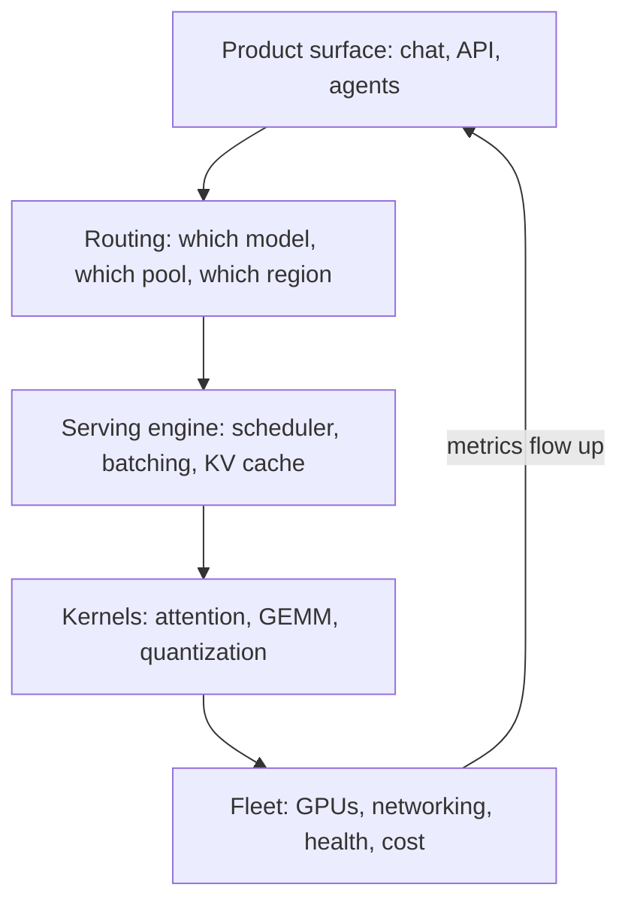

Each layer has its own failure modes, and each layer leaks into the others. A slow kernel shows up as tail latency at the product surface. A bad routing rule shows up as a doubled GPU bill. The engineer who owns this stack reads metrics at every layer and knows which layer to blame first.

Three levers do most of the work:

- **Batching.** Grouping requests so one pass over the weights serves many tokens at once. This is the single biggest throughput lever in LLM serving.
- **Quantization.** Shrinking weights and caches so more fits in memory and each byte moves faster. This trades a small accuracy cost for a large speed and cost win, when done with care.
- **Capacity planning.** Matching GPU supply to traffic shape: peaks, valleys, and the growth curve. Idle GPUs still bill by the hour.

The trade between latency, throughput, and cost is a surface, not a single number to maximize. You cannot have the fastest answers, the most answers per GPU, and the cheapest answers all at once. Every real setup is a point on a Pareto frontier, and the job is to pick the right point and then push it outward.

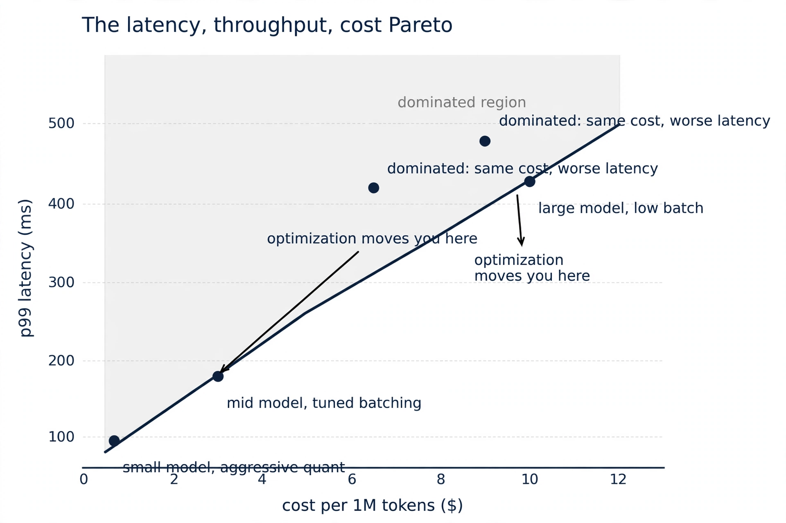

*Figure 1. Every serving setup sits somewhere on this surface. Good engineering moves a point toward the frontier. Nothing removes the trade itself.*

::: takeaway
- You own the request path end to end: product surface, routing, engine, kernels, fleet.
- Three levers matter most: batching, quantization, capacity planning.
- Latency, throughput, and cost trade against each other. Your job is to choose the point on the frontier and push the frontier outward.
:::

### 1.2 The day-to-day loop

Production serving work is a loop, not a project. Traffic shifts, models change, hardware ages. The loop has five steps, and the best engineers run it weekly.

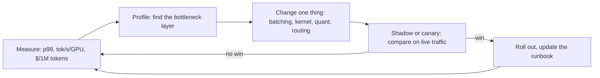

A few notes on each step, learned the hard way across many fleets:

- **Measure first, always.** Without a baseline, every change is a guess. Keep a dashboard with the three headline metrics plus their tails. If you cannot graph it, you cannot improve it.
- **Profile before you optimize.** Most "slow model" complaints are not the model. They are a scheduler setting, a cold cache, or a routing rule. Nsight Systems for the GPU timeline, engine metrics for the scheduler, and `nvidia-smi` plus DCGM for fleet health. Guess the layer, then verify with data.
- **Change one thing at a time.** Two changes at once produce arguments, not knowledge. This is the same discipline as a clean experiment, applied to production.
- **Canary on live traffic.** Staging never matches production traffic shape. Shadow traffic (duplicate live requests to the new stack, discard the responses) or a small canary (1 to 5 percent of traffic) tells you the truth. Appendix 8A, section 3, covers shadow traffic practice in detail.
- **Write it down.** Every incident and every tuning win goes into a runbook. The runbook is the difference between a team and a hero.

### 1.3 How success is measured

Three headline metrics, each with a reason it is defined the way it is.

**p99 latency, not mean latency.** The mean hides the users who suffer. If 1 percent of requests take 10 seconds, the mean can still look fine while 1 in 100 users has a terrible experience. The p99 (the latency that 99 percent of requests beat) and p999 are the numbers that match user pain. Split latency into two parts. %%TTFT%% (time to first token) covers request arrival to first token out, and is dominated by %%prefill%%. %%TPOT%% (time per output token) is the steady streaming rate, dominated by %%decode%%. A chat product cares about both: TTFT is responsiveness, TPOT is reading speed.

**Tokens per second per GPU, not requests per second.** Requests vary wildly in length. Tokens are the unit of work. Dividing by GPU count makes the number comparable across fleet sizes and exposes the real efficiency question: how much work does each dollar of hardware do? Watch this number when you change batching, quantization, or the scheduler. If it drops, something regressed.

**Dollars per million tokens, not dollars per month.** The monthly bill mixes traffic growth with efficiency. Cost per million tokens isolates efficiency: same traffic, lower number means a better stack. Include everything: GPU hours, networking, retries, and the failed requests. Appendix 8A builds this into "cost per successful outcome," the fullest version of the metric.

Supporting metrics that explain *why* a headline moved:

| Metric | What it tells you | Healthy sign |
|---|---|---|
| TTFT p99 | prefill + queueing pain | stable across load, grows slowly with prompt length |
| TPOT p99 | decode streaming smoothness | flat as batch grows, until memory bandwidth saturates |
| KV cache hit rate | prefix reuse (system prompts, few-shot) | high for agentic/multi-turn traffic |
| GPU SM utilization | is the GPU actually working | high during prefill, lower during decode (expected) |
| GPU memory bandwidth util | decode bottleneck gauge | near saturation at good batch sizes |
| Preemptions per minute | scheduler distress signal | near zero; spikes mean KV pressure |
| Goodput | tokens that reach users vs tokens computed | close to 1; recompute after preemption wastes work |

Measurement pitfalls that have burned real teams:

- **Cold starts.** The first requests after a deploy pay model-load and kernel-compile costs. Warm up before measuring, or your p99 is fiction.
- **Coordinated omission.** A load generator that waits for a slow response before sending the next request hides queueing. Real users do not wait politely. Use a generator that sends on a fixed schedule.
- **Mixing traffic shapes.** One benchmark number for "chat" traffic says nothing about a 32k-context document task. Measure per traffic class.
- **Ignoring the tail of the tail.** p99 can look fine while p999 is 10x worse. One stuck request in a batch can poison the whole batch's latency.

::: takeaway
- Headline metrics: p99 latency (split into TTFT and TPOT), tokens per second per GPU, dollars per million tokens.
- Supporting metrics explain movement: cache hit rate, preemptions, goodput, bandwidth utilization.
- Measure like a skeptic: warm up, avoid coordinated omission, split by traffic class, watch p999 too.
:::

## Part 2. Ordered reading path

The base curriculum teaches the foundations. This track tells you which parts to read, in which order, and why each one matters for serving work. Priority P0 is the daily toolkit. P1 is the deepening layer. P2 is the supporting layer you reach for when a specific problem demands it.

### P0: the daily toolkit

| Volume | Chapters to read | Why it matters for this role |
|---|---|---|
| Vol 8: Inference Serving Bridge | "Decoding from zero", "Batching: static vs continuous, and the throughput math", "KV cache paging and disaggregated prefill/decode", "Quantization survey: PTQ, GGUF, QAT, and what breaks", "Speculative decoding, cleanly explained", "Benchmarking rigor: latency, tails, honest harnesses", "Capstone lab: serve the tiny GPT" | This is the serving core: the generate loop, the batching math, the cache, and honest measurement. Read it first, in order. |
| Appendix 8A: Production Inference Economics | All 8 sections: cost per successful outcome, routing and cascades, shadow traffic, PD disaggregation economics, FP8, KV-cache quantization, MoE serving, multi-tenant LoRA | The money chapters. Cost modeling, safe rollouts, and the quantization details this track builds on. |
| Vol 15: GPU Kernels | Ch 4 "Performance diagnosis: the roofline and the suspect list", Ch 5 "Writing a Triton kernel from scratch", Ch 6 "FP8 and block-wise microscaling" | Kernels are the cheapest performance win in the stack. Roofline tells you what is even possible; Triton lets you build it. |
| Vol 4: LLM Internals | Ch 6 "MHA vs MQA vs GQA: the memory tradeoff", Ch 8 "KV cache mechanics: the memory math of serving" | KV cache arithmetic is capacity arithmetic. GQA is why modern models serve cheaper than their parameter count suggests. |

### P1: the deepening layer

| Volume | Chapters to read | Why it matters for this role |
|---|---|---|
| Vol 6: Distributed Training | Ch 5 "Tensor parallelism: splitting individual layers", Ch 8 "Combining strategies: the 3D parallelism recipe", Ch 10 "Profiling: where time goes" | Multi-GPU serving is tensor parallelism plus NCCL. The same collectives, a different objective (latency, not step time). |
| Appendix 6B: Parallelism and XLA | "All-to-all byte math: every strategy on one model" | Byte math for collectives transfers directly to serving: TP all-reduce per layer happens on every decode step. |
| Vol 13: ML System Design | Ch 1 "Capacity math: serving a 70B model", Ch 5 "Serving at scale: batching, latency, and cost" | Capacity planning worked end to end. The bridge from model math to fleet math. |
| Appendix 13A: Distributed Systems | Ch 3 "Backpressure", Ch 4 "Fair multi-tenant scheduling" | Queues, overload, and fairness: the distributed-systems half of serving that pure ML material skips. |
| Vol 2: ML Foundations Bridge | Ch 3 "Metrics beyond accuracy", Ch 5 "Is the win real?" | Quantization evals must be honest. These chapters are the immune system against fooling yourself. |

### P2: the supporting layer

| Volume | Chapters to read | Why it matters for this role |
|---|---|---|
| Vol 11: Research Methods | Ch 5 "Statistics lab"; Appendix 11A "Eval Statistics" | Latency data is noisy. A/B tests on rollouts and honest tail statistics live here. |
| Vol 10: Productionizing and MLOps | "Monitoring: metrics, drift, alerting", "Incident response: a worked narrative", "Cost engineering: unit economics of inference" | Production ownership: dashboards, on-call, and the cost discipline around the fleet. |

### Suggested sequence

- **Phase 1 (weeks 1-2): foundations of serving.** Vol 8 in order, then this track's Chapters 1 and 2. Goal: you can do the latency math on paper and explain every knob in a serving engine.
- **Phase 2 (weeks 3-4): the metal.** Vol 15 (roofline, Triton, FP8) and Vol 4 (KV cache, GQA), then this track's Chapter 3. Goal: you can profile a kernel and compare serving engines on scheduler merit, not marketing.
- **Phase 3 (weeks 5-6): scale and money.** Appendix 8A, Vol 6 (TP, byte math) plus 6B, Vol 13 (capacity, serving at scale) plus 13A, then this track's Chapters 4 and 6. Goal: you can size a fleet and price a serving design.
- **Phase 4 (weeks 7-8): production.** Vol 11/11A (statistics for rollouts), Vol 10 (monitoring, incidents), Vol 2 (honest evals), then this track's Chapter 5 and the capstone lab. Goal: you can run the day-to-day loop from section 1.2 without supervision.

::: takeaway
- P0 first: Vol 8, Appendix 8A, Vol 15 (kernels), Vol 4 (KV cache). This is the daily toolkit.
- P1 next: distributed serving (Vol 6/6B), capacity and queueing (Vol 13/13A), honest evals (Vol 2).
- P2 as needed: statistics for rollouts (Vol 11/11A), production ownership (Vol 10).
:::

## Part 3. Role specialization chapters

### Chapter 1. The latency math that matters

Everything in serving is arithmetic before it is engineering. This chapter builds the three calculations an inference engineer does on paper, weekly: where time goes per token, how much memory each sequence costs, and what batching is actually worth. The Python at the end turns the arithmetic into a simulator you can argue with.

#### 1.1 Prefill and decode: two different machines

A request lives in two phases with opposite performance characters.

```
Request arrives
    |
    v
+------------------+      +---------------------+
| PREFILL          |      | DECODE              |
| process the      | ---> | generate one token  |
| whole prompt     |      | at a time,          |
| at once          |      | reusing the         |
|                  |      | KV cache            |
| compute-bound:   |      | memory-bound:       |
| big matrix       |      | reads all weights   |
| multiplies, high |      | for one token       |
| arithmetic       |      |                     |
| intensity        |      | TTFT ends here ^    |
+------------------+      +---------------------+
                                |
                                v
                         Response complete
```

%%Prefill%% processes all prompt tokens in parallel. The matrices are large, the GPU's compute units stay busy, and time grows with prompt length. %%Decode%% generates one token per step: each step reads the entire weight matrix from memory to produce a single token. The compute units sit mostly idle while memory bandwidth does the work.

Two user-facing numbers follow directly:

- %%TTFT%% (time to first token) = queue wait + prefill time. Dominated by prefill for long prompts, by queueing under load.
- %%TPOT%% (time per output token) = average decode step time. The streaming speed the user feels.

This split explains most serving design. Anything that helps prefill (more FLOPS, chunking long prompts) does little for decode. Anything that helps decode (more memory bandwidth, bigger batches, smaller weights) does little for prefill. Chapter 4 takes this split to its logical end: running the two phases on different machines.

#### 1.2 Roofline for decode: why batching is the whole game

The %%roofline model%% says attainable performance is the minimum of two ceilings: what memory bandwidth allows and what compute allows.

```
attainable TFLOPS = min(bandwidth * arithmetic_intensity, peak_FLOPS)
```

%%Arithmetic intensity%% is FLOPs per byte moved. Below the ridge point, you are memory-bound: performance rises with intensity. Above it, compute-bound: you hit the flat roof.

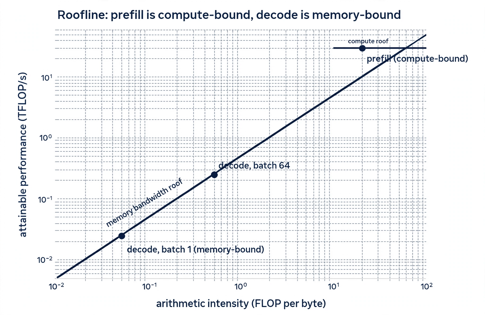

*Figure 2. Prefill sits near the compute roof. Decode at batch 1 sits deep in the memory-bound slope. Batching slides decode rightward along the slope.*

Worked example on an H100 (spec values: 989 TFLOPS BF16 dense, 3.35 TB/s memory bandwidth). Ridge point = 989 / 3.35 = **295 FLOP/byte**.

**Decode, batch 1, 70B model in BF16.** One step does about 2 x 70B = 140 GFLOP (two FLOPs per parameter per token, multiply-accumulate). It reads 140 GB of weights. Arithmetic intensity = 140e9 / 140e9 = **1 FLOP/byte**, far below the ridge. Attainable = 3.35 x 1 = 3.35 TFLOPS, which is 0.34% of peak. Step time = 140e9 / 3.35e12 = **41.8 ms**, or about **24 tokens/second**. The GPU is a $30,000 space heater running at one-third of one percent of its compute. This is the fundamental fact of LLM serving.

**Decode, batch 64, average 1024 tokens of context.** FLOPs scale with batch: 64 x 140 GFLOP = 8.96 TFLOP. Bytes: weights 140 GB once, plus KV cache reads of 64 x 1024 x 320 KB = 21 GB (the 320 KB/token figure is derived in 1.3). Intensity = 8.96e12 / 161e9 = **55.6 FLOP/byte**, still below the ridge, still memory-bound, but 55x higher. Attainable = 55.6 x 3.35 = 186 TFLOPS. Step time = 8.96e12 / 186e12 = **48 ms** for 64 tokens = **1,333 tokens/second**. Same step time as batch 1, 55 times the throughput. Batching does not speed up any single request. It amortizes the weight reads across requests.

**Prefill, 2048-token prompt, batch 1.** FLOPs = 2 x 70e9 x 2048 = 2.87e14. Bytes: 140 GB weights plus KV writes of 2048 x 320 KB = 0.66 GB. Intensity = 2.87e14 / 1.41e11 = **2,036 FLOP/byte**, above the ridge. Compute-bound: time = 2.87e14 / 989e12 = **0.29 s**. Note the asymmetry: prefill of 2k tokens takes 0.29 s; decode of one token takes 0.042 s. Per token, prefill is roughly 7x cheaper than decode, because it reuses each weight read across 2048 tokens.

::: takeaway
- Decode at batch 1 uses ~0.3% of an H100's compute. It is memory-bandwidth-bound, always.
- Batching amortizes weight reads: 64x batch gives ~55x throughput at nearly the same step time.
- Prefill is compute-bound and roughly 7x cheaper per token than decode. The two phases want different optimizations.
:::

#### 1.3 KV-cache arithmetic: the capacity equation

The KV cache stores, for every layer, the keys and values of every processed token, so decode never recomputes them. Its size decides how many concurrent sequences fit on a GPU, which caps the batch size, which caps throughput. This is the capacity equation of serving.

Per-token KV bytes for a standard transformer:

```
bytes_per_token = 2 (K and V) x layers x kv_heads x head_dim x bytes_per_element
```

For a 70B-class model (80 layers, 8 KV heads via grouped-query attention, head dim 128, BF16):

```
2 x 80 x 8 x 128 x 2 = 327,680 bytes = 320 KiB per token
```

Scale it up:

| Context length | KV cache per sequence (BF16) | What it means |
|---|---|---|
| 1k tokens | 320 MB | trivial |
| 8k tokens | 2.56 GB | noticeable |
| 32k tokens | 10.2 GB | a real budget line |
| 128k tokens | 41 GB | more than half an 80 GB GPU |

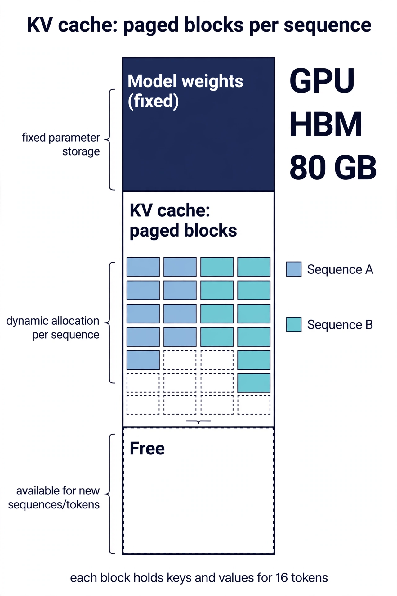

*Figure 3. PagedAttention splits the cache into fixed blocks per sequence. New blocks allocate as sequences grow; freed blocks return to the pool. No sequence ever needs a contiguous reservation.*

Two consequences drive real decisions:

1. **Long context is a batch-size tax.** At 32k context, each sequence costs 10 GB. A GPU with 10 GB of headroom after weights fits exactly one such sequence. Throughput collapses, not because the GPU is slow, but because there is no room for a batch. KV-cache quantization (Chapter 2, and Appendix 8A section 6) buys this headroom back.
2. **GQA is a serving feature, not just an architecture detail.** Cutting KV heads from 64 to 8 cut the cache 8x. When comparing models for serving, KV bytes per token matters as much as parameter count. A 70B model with GQA can serve cheaper than a 40B model with full multi-head attention at long context.

::: callout warn
The most common capacity mistake: sizing for weights and forgetting the cache. A 70B model in BF16 needs 140 GB for weights, which fits on two 80 GB GPUs with tensor parallelism. But with 10 GB of KV headroom per GPU, you can serve roughly six concurrent 8k-context sequences per GPU. If your traffic needs thirty, you need more GPUs or quantization, and no amount of kernel tuning changes that.
:::

#### 1.4 Batching math: static vs continuous, worked in Python

%%Static batching%% waits until a batch is full (or a timeout hits), runs all requests together, and returns them together. Short requests wait for the longest one. %%Continuous batching%% (also called in-flight batching) admits a new request the moment any slot frees, at the granularity of a single decode step. No request waits for another to finish.

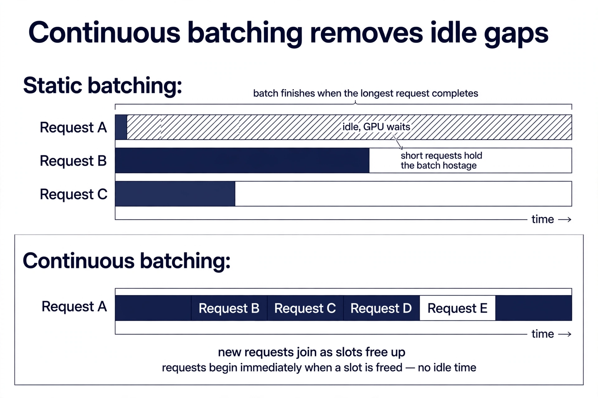

*Figure 4. Static batching holds the GPU hostage to the longest request. Continuous batching packs new work into freed slots every step.*

The simulator below makes the difference concrete. It models a single GPU with a KV-token budget, Poisson arrivals, and a simple step-time model. It runs the same traffic through both strategies and reports latency.

```python
import heapq
import random

# WHAT: a minimal serving simulator comparing static vs continuous batching.
# WHY: batching policy is the highest-leverage scheduler decision, and its
#   effect depends on traffic shape (arrival rate, length mix), which is
#   hard to reason about without running the numbers.
# WHAT BREAKS IF CHANGED: the step-time model is linear in tokens per step.
#   Real step time has a fixed launch overhead plus a memory-bandwidth term;
#   the linear model underestimates small-batch overhead and overestimates
#   very large batches (bandwidth saturation). Treat ratios as directional,
#   not exact. Arrival and length distributions are knobs: change them and
#   the winner's margin changes, which is itself the lesson.

random.seed(7)

# --- hardware model (illustrative H100-class numbers) ---
STEP_BASE_MS = 2.0       # fixed per-step launch/scheduling overhead
STEP_PER_TOKEN_MS = 0.05 # marginal cost per token in the step (bandwidth term)
KV_BUDGET_TOKENS = 16384 # max KV tokens resident: caps concurrent sequences

def step_time_ms(tokens_in_step):
    # WHAT: time for one scheduler iteration.
    # WHY: every step pays a fixed cost (kernel launches, scheduling) plus
    #   a cost proportional to tokens processed (memory traffic).
    return STEP_BASE_MS + STEP_PER_TOKEN_MS * tokens_in_step

def make_traffic(n, arrival_rate_per_s, seed=7):
    # WHAT: synthetic request stream.
    # WHY: Poisson arrivals + mixed lengths mimic chat traffic: many short
    #   requests, a few long ones. The long tail is what punishes static
    #   batching, so the mix matters more than the exact distribution.
    rng = random.Random(seed)
    reqs, t = [], 0.0
    for i in range(n):
        t += rng.expovariate(arrival_rate_per_s)
        prompt = rng.randint(64, 512)
        # 80% short outputs, 20% long: the tail that hurts static batching
        out = rng.randint(512, 2048) if rng.random() < 0.2 else rng.randint(16, 128)
        reqs.append({"id": i, "arrive": t, "prompt": prompt, "out": out})
    return reqs

def run_static(reqs, max_batch=8):
    # WHAT: static batching. Fill a batch (up to max_batch), run prefill for
    #   all, then decode until the LONGEST finishes. Everyone waits.
    # WHY: this is the baseline every production scheduler replaced. The
    #   straggler effect is the cost being measured.
    lat, now = [], 0.0
    i = 0
    while i < len(reqs):
        batch = reqs[i:i + max_batch]
        i += max_batch
        now = max(now, batch[-1]["arrive"])          # wait for batch to fill
        # prefill: one chunk per request, billed together
        prefill_tokens = sum(r["prompt"] for r in batch)
        now += step_time_ms(prefill_tokens) / 1000.0
        first_token = {r["id"]: now for r in batch}  # TTFT recorded here
        # decode: every step advances all; batch ends at the longest output
        longest = max(r["out"] for r in batch)
        for _ in range(longest):
            now += step_time_ms(len(batch)) / 1000.0
        for r in batch:
            # short requests still pay the full batch time: the straggler tax
            lat.append((r["id"], first_token[r["id"]] - r["arrive"],
                        now - r["arrive"]))
    return lat

def run_continuous(reqs):
    # WHAT: continuous batching. Each iteration: admit waiting requests while
    #   KV budget allows, then run one step for everything active. A request
    #   leaves the moment its last token is done; its slot is reused next step.
    # WHY: this mirrors production schedulers (vLLM, SGLang, TRT-LLM). The
    #   admission check on KV budget is the simplified version of real block
    #   managers; chunked prefill is omitted for clarity (see Chapter 3).
    lat, now = [], 0.0
    waiting = list(reqs)          # arrival-ordered queue
    active = []                   # dicts with remaining prefill/decode counts
    kv_used = 0
    unfinished = len(reqs)
    done_ids = set()

    while unfinished > 0:
        # admit: earliest arrivals first while KV budget allows
        while waiting and waiting[0]["arrive"] <= now:
            r = waiting[0]
            need = r["prompt"] + r["out"]   # reserve full length up front
            if kv_used + need <= KV_BUDGET_TOKENS:  # (simplification: real
                waiting.pop(0)              #  schedulers reserve incrementally)
                active.append({"r": r, "pre": r["prompt"],
                               "dec": r["out"], "ttft": None})
                kv_used += need
            else:
                break  # KV full: queue builds, which is the backpressure signal
        if not active:
            now = waiting[0]["arrive"]  # idle: jump to next arrival
            continue
        # one step: prefill chunks for new requests, one decode token for rest
        tokens_this_step = 0
        for a in active:
            if a["pre"] > 0:
                chunk = min(a["pre"], 512)  # chunked prefill: bound the step
                a["pre"] -= chunk
                tokens_this_step += chunk
                if a["pre"] == 0:
                    a["ttft"] = now + step_time_ms(tokens_this_step) / 1000.0
            else:
                a["dec"] -= 1
                tokens_this_step += 1
        now += step_time_ms(tokens_this_step) / 1000.0
        # retire finished requests, free their KV budget immediately
        still = []
        for a in active:
            if a["dec"] == 0 and a["pre"] == 0:
                r = a["r"]
                lat.append((r["id"], a["ttft"] - r["arrive"], now - r["arrive"]))
                kv_used -= (r["prompt"] + r["out"])
                unfinished -= 1
            else:
                still.append(a)
        active = still
    return lat

def report(name, lat):
    # WHAT: p50/p99/TTFT summary. WHY: means hide the tail; the p99 ratio
    #   between strategies is the number that decides the scheduler choice.
    lats = sorted(l[2] for l in lat)
    ttfts = sorted(l[1] for l in lat)
    p = lambda s, q: s[int(q * len(s))]
    print(f"{name}: p50={p(lats, .5):.2f}s p99={p(lats, .99):.2f}s "
          f"TTFT p99={p(ttfts, .99):.2f}s")

if __name__ == "__main__":
    # Both strategies are stable at this arrival rate, so the comparison
    # is about scheduling quality, not overload collapse. (Raise the rate
    # toward 6 and watch static batching collapse into queueing while
    # continuous degrades gracefully.)
    traffic = make_traffic(400, arrival_rate_per_s=1.5)
    report("static batch=8    ", run_static(traffic))
    report("continuous        ", run_continuous(traffic))
```

::: walkthrough
1. `make_traffic` builds 400 requests arriving as a Poisson process at 6 per second, with mostly short outputs and a 20% long tail. The tail is deliberate: it is what punishes static batching.
2. `run_static` fills batches of 8, runs one prefill, then decodes until the longest request finishes. Every request in the batch pays the longest request's time. That is the straggler tax.
3. `run_continuous` loops in single steps. Each step it admits queued requests while KV budget remains, advances every active request by one chunk or one token, then retires finished ones and frees their budget immediately.
4. `step_time_ms` charges a fixed 2 ms plus 0.05 ms per token, a rough stand-in for launch overhead plus memory traffic.
5. `report` prints p50, p99, and TTFT p99. Run it: continuous batching wins p99 latency by a wide margin at the same hardware, because short requests stop waiting for long ones. Raise the arrival rate and watch static batching collapse first. That contrast is a preview of the backpressure discussion in Appendix 13A, chapter 3.
:::

::: pq
**Q1.** Decode at batch 1 on an H100-class GPU uses roughly what fraction of peak BF16 compute, and what is the binding constraint?

A. ~50%, compute-bound by the attention FLOPs

B. ~0.3%, memory-bandwidth-bound by weight reads

C. ~10%, latency-bound by kernel launch overhead

D. ~90%, compute-bound by the large batch

::: answer
**Answer: B.** Each decode step reads the full 140 GB weight matrix to produce one token: 140 GFLOP against 140 GB moved gives ~1 FLOP/byte, far below the ~295 FLOP/byte ridge point. Attainable performance is ~3.35 TFLOPS out of 989, about 0.34% of peak. This is why batching, not faster math, is the first throughput lever.

- **A, wrong:** attention FLOPs are small next to the weight reads; nothing here is compute-bound.
- **C, wrong:** launch overhead exists but is dwarfed by the 41.8 ms weight-read time.
- **D, wrong:** batch 1 is the opposite of a large batch; utilization is the problem, not the solution.
:::

**Q2.** A 70B-class model with GQA (8 KV heads) serves 32k-context requests. Roughly how much KV cache does each sequence need in BF16, and what does that imply for batch size on a GPU with 10 GB of KV headroom?

A. ~320 MB; about 30 sequences fit

B. ~2.5 GB; about 4 sequences fit

C. ~10 GB; about 1 sequence fits

D. ~40 GB; it does not fit at all

::: answer
**Answer: C.** 32,768 tokens x 320 KiB/token = ~10.2 GB per sequence. With 10 GB of headroom, exactly one such sequence fits: batch size 1, and throughput collapses. This is the long-context batch-size tax, and it is why KV-cache quantization and disaggregated decode pools exist.

- **A, wrong:** 320 MB is the cost of 1k tokens, not 32k.
- **B, wrong:** 2.5 GB is the 8k-context figure.
- **D, wrong:** 40 GB is the 128k-context figure.
:::
:::

### Chapter 2. Quantization in production

Quantization shrinks the numbers a model stores and computes with: 16-bit weights become 8-bit or 4-bit, and the KV cache follows. The payoff is direct from Chapter 1's math. Smaller weights mean fewer bytes per decode step, which means faster steps and lower cost. A smaller KV cache means more concurrent sequences, which means bigger batches. Quantization is the second of the three levers, and on memory-bound decode it is nearly as powerful as batching.

Volume 8 surveys the landscape (PTQ, QAT, GGUF) and Appendix 8A adds FP8 and KV-cache quantization in detail. This chapter is the production selection guide: which method wins where, and the calibration mistakes that silently eat your accuracy.

#### 2.1 The methods, compared honestly

| Method | What shrinks | Bits | Calibration | Accuracy cost | Speed story | When it wins |
|---|---|---|---|---|---|---|
| GPTQ | weights | 4 | yes, ~128 samples | very low at 4-bit | needs fused kernels (Marlin-style) for full speed | 4-bit weights on pre-Hopper GPUs; max memory saving |
| AWQ | weights | 4 | yes, tiny set | very low at 4-bit | fast fused kernels, quick conversion | 4-bit with minimal conversion pain; strong kernel support |
| FP8 (E4M3) | weights + activations | 8 | static or dynamic | near zero on many models | native on Hopper, 2x memory bandwidth | Hopper fleet and you want speed without accuracy talks |
| SmoothQuant | weights + activations | 8 (INT8) | yes | low | INT8 tensor cores on older GPUs | pre-Hopper GPUs where INT8 is the fast path |
| KV-cache quant | KV cache | 8 | light | low with per-channel K | bigger batches, not faster steps | long context or large batches; the capacity play |
| GGUF k-quants | weights (mixed) | 2-6 | no | moderate at low bits | CPU and edge inference | laptops, edge, offload; not datacenter GPUs |

A few notes that tables usually omit:

- **GPTQ vs AWQ is mostly a kernel question now.** Both reach similar 4-bit accuracy on most models. Pick by which one your serving engine kernels support best, and by conversion tooling maturity for your model family. Do not relitigate the papers; benchmark both on your eval set.
- **FP8 is the default answer on Hopper.** When the hardware does FP8 natively, W8A8 with per-tensor or per-channel scales loses almost nothing on most models and needs no heroic calibration. The main decision is static scales (calibrated once, fastest) vs dynamic per-token scales (no calibration, tiny overhead).
- **KV quantization buys batch, not speed.** Halving KV bytes does not make a decode step faster at fixed batch. It lets twice as many sequences fit, which lets the batch double, which is where the throughput comes from. It is a capacity play, aimed at the long-context tax from Chapter 1.
- **Keys and values want different treatment.** Keys have outlier channels that need per-channel scales; values are smoother and do per-token. Keys have outlier channels that need per-channel scales; values are smoother and do per-token. Get this asymmetry wrong and KV quantization silently degrades long-context quality. Appendix 8A, section 6, covers the recipe in detail.

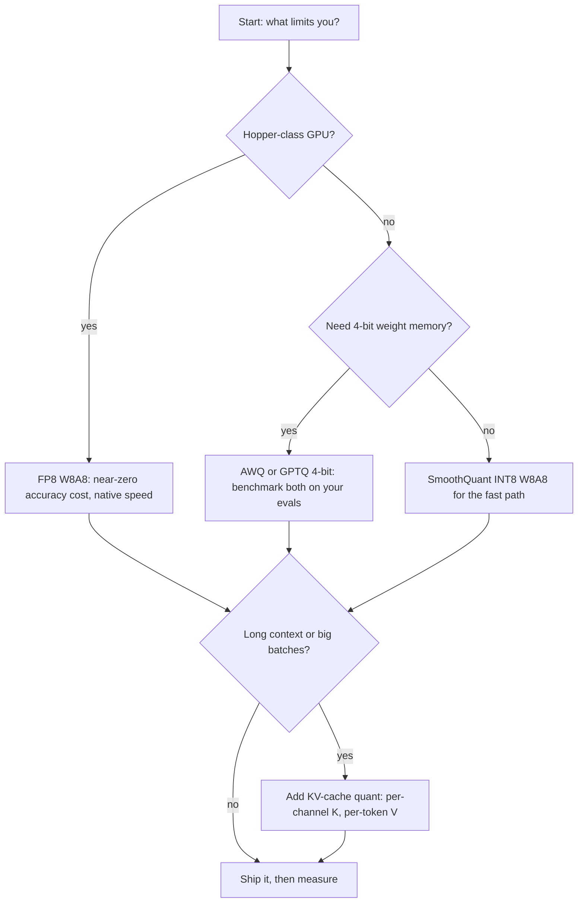

#### 2.2 Calibration pitfalls: where accuracy goes to die

Quantization methods that need calibration learn their scales from a small dataset. Every production accuracy regression from quantization traces back to one of these:

1. **Distribution mismatch.** Scales calibrated on web text and deployed on code or math. The calibration set must look like production traffic, not like a convenient corpus. Sample real prompts (sanitized) when you can.
2. **Too few samples.** 128 sequences is the folk default because the papers used it, not because it is enough for your data. If scales shift when you reseed the calibration set, you need more samples.
3. **Per-tensor scales on outlier layers.** A few layers (often the down-projection in MLPs) have outlier channels orders of magnitude larger than the rest. One scale for the whole tensor crushes everything else. Use per-channel scales where the method allows, and check the worst layer, not the average.
4. **Perplexity-only evaluation.** Perplexity barely moves while math and code accuracy fall off a cliff. Evaluate on the tasks your users actually run: reasoning, code, long-context retrieval. Volume 2, chapter 3, is the honest-metrics discipline for this.
5. **Stale scales after fine-tuning.** Fine-tunes shift weight distributions. Re-calibrate after any fine-tune, any merge, any distillation. Scales are not portable across checkpoints.
6. **Forgetting prefill vs decode.** Activation quantization bites hardest in prefill, where activations are large and compute-bound. A W8A8 setup that looks lossless on decode-heavy chat can regress on prefill-heavy long-document work. Test both traffic shapes.

::: callout warn
The silent killer is pitfall 4 combined with pitfall 1: calibrated on the wrong data, evaluated on the wrong metric, shipped with confidence. Build the eval harness below before you quantize anything, and make the quantized model beat the baseline on your tasks, not on perplexity.
:::

#### 2.3 Lab: the quantization eval harness

```python
# WHAT: a quantization acceptance harness. Given a baseline (FP16) model and
#   a quantized candidate, it measures perplexity on held-out text AND
#   accuracy on task evals, then renders a pass/fail verdict per metric.
# WHY: quantization decisions must rest on task accuracy with production-like
#   data, not on perplexity alone (pitfall 4) and not on vibes. This harness
#   is the gate every quantized checkpoint passes before rollout.
# WHAT BREAKS IF CHANGED: the thresholds below are illustrative. Set them
#   from your product's tolerance: a 0.5-point drop on a support bot is fine;
#   on a medical summarizer it is not. The harness enforces the discipline;
#   the numbers are yours to choose.

import math

# --- illustrative thresholds: replace with product requirements ---
MAX_PPL_INCREASE = 0.15    # allowed perplexity regression vs baseline
MAX_TASK_DROP = 1.0        # allowed task-accuracy drop in percentage points

def perplexity(model, token_ids, seq_len=2048):
    # WHAT: standard perplexity over a held-out token stream.
    # WHY: cheap, sensitive to distribution damage from quantization. A
    #   large perplexity jump means the scales are wrong (often pitfall 1
    #   or 2), and there is no point running the slower task evals.
    # NOTE: model.generate_logprobs is a placeholder for your engine's API
    #   (vLLM, HF transformers, TRT-LLM all expose logprobs per token).
    nll, n = 0.0, 0
    for i in range(0, len(token_ids) - seq_len, seq_len):
        chunk = token_ids[i:i + seq_len]
        logprobs = model.generate_logprobs(chunk)  # engine-specific call
        nll += -sum(logprobs)
        n += len(logprobs)
    return math.exp(nll / n)

def task_accuracy(model, eval_items):
    # WHAT: accuracy on task evals shaped like production traffic.
    # WHY: this is the metric that decides. Items should mirror real use:
    #   short chat, long documents, code, math. Keep the set fixed across
    #   quantization experiments so results are comparable (same seed,
    #   same items, same decoding params: temperature 0, fixed max tokens).
    correct = 0
    for item in eval_items:
        out = model.generate(item["prompt"], temperature=0.0,
                             max_tokens=item["max_tokens"])
        if item["check"](out):   # each item carries its own grader
            correct += 1
    return 100.0 * correct / len(eval_items)

def acceptance_report(baseline, candidate, heldout_tokens, eval_items):
    # WHAT: head-to-head report with a verdict per metric.
    # WHY: a single table forces the decision into the open. If any metric
    #   fails, the quantized model does not ship, no matter how good the
    #   throughput number looks. Throughput is Chapter 6's job; this gate
    #   is only about quality.
    base_ppl = perplexity(baseline, heldout_tokens)
    cand_ppl = perplexity(candidate, heldout_tokens)
    base_acc = task_accuracy(baseline, eval_items)
    cand_acc = task_accuracy(candidate, eval_items)

    rows = [
        ("perplexity", base_ppl, cand_ppl, cand_ppl - base_ppl,
         (cand_ppl - base_ppl) <= MAX_PPL_INCREASE),
        ("task accuracy %", base_acc, cand_acc, cand_acc - base_acc,
         (cand_acc - base_acc) >= -MAX_TASK_DROP),
    ]
    print(f"{'metric':<16}{'baseline':>10}{'quantized':>10}{'delta':>10}  verdict")
    all_pass = True
    for name, b, c, d, ok in rows:
        all_pass &= ok
        print(f"{name:<16}{b:>10.3f}{c:>10.3f}{d:>+10.3f}  "
              f"{'PASS' if ok else 'FAIL'}")
    print("SHIP" if all_pass else "DO NOT SHIP: investigate calibration")
    return all_pass
```

::: walkthrough
1. `perplexity` runs first because it is cheap. A big jump here means the quantization scales are wrong, usually distribution mismatch or too few calibration samples. Fix calibration before spending time on task evals.
2. `task_accuracy` is the deciding metric. The eval items must mirror production traffic and stay fixed across experiments. Same decoding parameters every run: temperature 0 removes sampling noise.
3. `acceptance_report` prints one table and one verdict. The discipline is the point: no quantized checkpoint ships on a throughput argument alone.
4. To use it for KV-cache quantization, run the same harness with long-context eval items (32k+ tokens). Short-context evals will not catch KV degradation.
:::

::: pq
**Q1.** Your fleet is Hopper-class GPUs, and decode throughput is the bottleneck. Which quantization choice is the best default, and why?

A. GPTQ 4-bit weights, for maximum memory saving

B. FP8 W8A8, near-zero accuracy cost with native hardware support

C. GGUF 2-bit, for the smallest possible checkpoint

D. No quantization; Hopper is fast enough already

::: answer
**Answer: B.** On Hopper, FP8 is natively supported, W8A8 halves memory traffic with near-zero accuracy loss on most models, and calibration is light (static) or unnecessary (dynamic per-token). It attacks exactly the decode bottleneck: bytes per step.

- **A, wrong:** GPTQ 4-bit saves more memory but needs fused kernels for full speed and a careful calibration story; on Hopper, FP8 gets most of the win with less risk.
- **C, wrong:** GGUF 2-bit targets CPU/edge; accuracy cost is real and datacenter GPUs have better options.
- **D, wrong:** decode is memory-bandwidth-bound on any GPU; halving bytes per step nearly doubles throughput at fixed batch.
:::

**Q2.** A 4-bit quantized model shows unchanged perplexity but a 6-point drop on math tasks. What is the most likely cause, and the fix?

A. The GPU is too slow; use a faster GPU

B. Perplexity-only evaluation hid the damage; the real cause needs investigation starting with calibration data match and per-channel outlier layers

C. The batch size is wrong; increase it

D. 4-bit is unusable; abandon quantization

::: answer
**Answer: B.** This is calibration pitfall 4 in action: perplexity barely moves while reasoning degrades. The fix starts with the calibration set (does it match deployment distribution?), then per-channel scales on outlier layers, then re-evaluation on task metrics. The harness in 2.3 exists precisely to catch this before rollout.

- **A, wrong:** hardware speed does not change model accuracy.
- **C, wrong:** batch size affects throughput and latency, not task accuracy.
- **D, wrong:** 4-bit works well with correct calibration; the data says the method is fine and the process failed.
:::
:::

### Chapter 3. Serving architectures compared

Four engines cover most production LLM serving: vLLM, TensorRT-LLM, SGLang, and TGI. They all do continuous batching now. The differences that matter are in the scheduler, the KV-cache design, and the kernel story. This chapter compares them on those axes, then sketches a scheduler in Python so the concepts are concrete, not brand names.

#### 3.1 The engines

| | vLLM | TensorRT-LLM | SGLang | TGI |
|---|---|---|---|---|
| Origin | Berkeley | NVIDIA | Berkeley / LMSYS | Hugging Face |
| KV-cache design | PagedAttention: fixed blocks, per-sequence block tables | Paged KV with plugin kernels | RadixAttention: prefix sharing as a radix tree across requests | Paged KV, continuous batching |
| Scheduler | continuous batching, FCFS with preemption and recompute, chunked prefill | in-flight batching, batch manager with similar preemption | cache-aware: routes to the worker holding the prefix; chunked prefill | continuous batching, production-hardened defaults |
| Prefix cache | automatic prefix caching | supported | best-in-class: shared system prompts and few-shot across requests | supported |
| Disaggregated prefill/decode | supported | supported | first-class, early mover | limited |
| Structured output | via grammars (xgrammar integration) | supported | strong: xgrammar/Outlines, fast constrained decoding | supported |
| Deploy model | Python, pip install, broad model coverage | engine build step per model/GPU (slower iteration, faster runtime) | Python, pip install | containers, HF ecosystem native |
| Kernel story | PyTorch + fused kernels, growing Triton use | hand-tuned plugins, earliest FP8/FP4 | PyTorch + custom kernels, attention variants | solid fused kernels, less research velocity |
| Pick it when | you want the broadest ecosystem and fastest iteration | NVIDIA-only fleet and maximum perf-per-dollar, and you accept the build step | agentic or multi-turn traffic with shared prefixes, or PD disaggregation | standard HF models with minimal fuss |

Three scheduler details decide real performance, and they differ across engines:

1. **Prefill/decode mixing.** A new prefill is a big compute chunk that stalls running decodes if scheduled whole. %%Chunked prefill%% splits the prompt into fixed-size pieces (a few hundred tokens) and interleaves one chunk per step with decode. TTFT rises slightly; TPOT stays smooth. Every serious engine does this now; the chunk size is the tuning knob.
2. **Preemption policy.** When KV memory fills, someone must yield. The standard policy: preempt the lowest-priority (usually most recent) sequence, free its blocks, and recompute its KV later. Preemption is correct but wasteful: recompute burns FLOPs for zero new tokens. A rising preemption rate is the scheduler's distress signal (see Chapter 5).
3. **Prefix-cache-aware scheduling.** If many requests share a system prompt, the engine can route each request to the worker already holding that prefix in cache, skipping its prefill. SGLang's radix tree makes sharing automatic across requests, not just within one. For agentic traffic with long shared prompts, this is a large TTFT win.

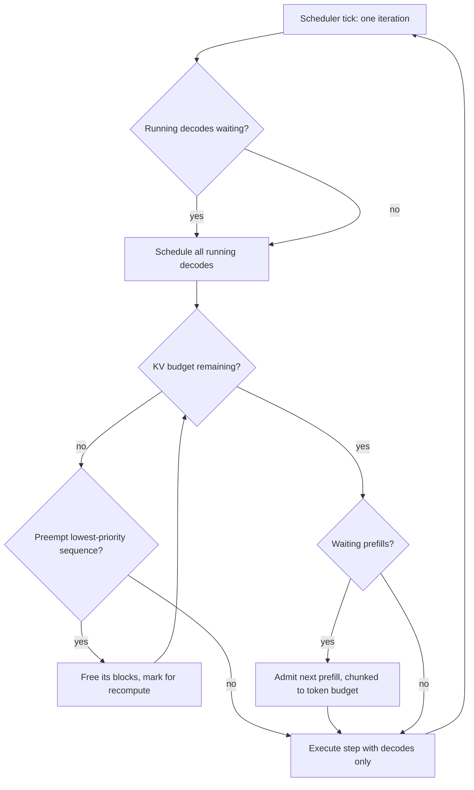

*Figure 5. The core scheduler loop. Every engine runs some version of this: protect running decodes, admit prefill in chunks, preempt when memory runs out.*

#### 3.2 Sketching a scheduler in Python

```python
# WHAT: a minimal continuous-batching scheduler: the decision logic at the
#   heart of vLLM, SGLang, and TRT-LLM, stripped of kernels and networking.
# WHY: the scheduler is the highest-leverage software in the serving stack.
#   Understanding its decisions (admit, chunk, preempt) lets you read engine
#   configs as performance choices instead of magic numbers.
# WHAT BREAKS IF CHANGED: block accounting here is per-token, not per-block.
#   Real PagedAttention wastes a fraction of each block (internal
#   fragmentation); this sketch is slightly optimistic about capacity.
#   Priorities are FCFS; production adds priority classes and fairness.

from collections import deque

BLOCK_TOKENS = 16        # KV cache block size (vLLM default)
MAX_BLOCKS = 2048        # total KV blocks on the GPU
TOKEN_BUDGET = 2048      # max tokens scheduled per step (chunked prefill)
MAX_BATCH_TOKENS = 4096  # cap on running tokens per step

class Sequence:
    # WHAT: one request's scheduler state.
    # WHY: the scheduler tracks prompts and outputs separately because
    #   prefill and decode have different costs and different chunking.
    _ids = 0
    def __init__(self, prompt_len, max_out):
        Sequence._ids += 1
        self.id = Sequence._ids
        self.prompt_left = prompt_len   # prefill remaining
        self.tokens_left = max_out      # decode remaining
        self.blocks = 0                 # KV blocks currently held

    def blocks_needed(self, extra_tokens):
        # WHAT: how many NEW blocks extra_tokens require.
        # WHY: blocks are allocated lazily as sequences grow; the scheduler
        #   must check affordability before admitting work, not after.
        total = (self.prompt_len0() + self.out0() - self.prompt_left
                 - self.tokens_left + extra_tokens)
        return (total + BLOCK_TOKENS - 1) // BLOCK_TOKENS - self.blocks

    def prompt_len0(self): return self._p0
    def out0(self): return self._o0

def make_seq(prompt_len, max_out):
    s = Sequence(prompt_len, max_out)
    s._p0, s._o0 = prompt_len, max_out
    return s

class Scheduler:
    # WHAT: FCFS continuous batching with chunked prefill and preemption.
    # WHY: this is the policy skeleton shared by the major engines. The
    #   three decisions below (admit, chunk, preempt) are where engine
    #   configs like max_num_seqs and max_num_batched_tokens bite.
    def __init__(self):
        self.waiting = deque()   # arrived, not yet admitted (FCFS)
        self.running = deque()   # admitted: decoding or prefilling
        self.free_blocks = MAX_BLOCKS

    def _free_seq(self, seq):
        # WHAT: preempt a sequence: return its blocks, keep its progress
        #   counters so it can resume (recompute) later.
        # WHY: preemption is the pressure valve. It is always cheaper than
        #   OOMing, but the recompute it causes is pure waste: track it.
        self.free_blocks += seq.blocks
        seq.blocks = 0

    def schedule(self):
        # WHAT: decide this step's batch. Returns (to_run, preempted).
        # WHY: order matters. Running work is protected first (it holds
        #   user-visible progress); new arrivals wait their turn; chunked
        #   prefill keeps any single step short; preemption is the last
        #   resort, newest first.
        budget = TOKEN_BUDGET
        batch, preempted = [], []

        # 1. running sequences: one decode token each, or one prefill chunk
        #    for sequences still prefilling (chunked prefill bounds the step
        #    so decodes stay smooth)
        for seq in list(self.running):
            if seq.prompt_left > 0:
                chunk = min(seq.prompt_left, budget, 512)
                need = seq.blocks_needed(chunk)
                if chunk > 0 and need <= self.free_blocks:
                    self.free_blocks -= need
                    seq.blocks += need
                    seq.prompt_left -= chunk
                    batch.append((seq, f"prefill:{chunk}"))
                    budget -= chunk
            elif seq.tokens_left > 0:
                need = seq.blocks_needed(1)
                if need <= self.free_blocks:
                    self.free_blocks -= need
                    seq.blocks += need
                    batch.append((seq, "decode"))
                    budget -= 1
                # else: no room even for one token; preemption decides below

        # 2. admit waiting arrivals (FCFS) while blocks allow; their first
        #    chunk is scheduled on the next tick
        while self.waiting:
            seq = self.waiting[0]
            need = seq.blocks_needed(BLOCK_TOKENS)  # afford the first block?
            if need <= self.free_blocks:
                self.waiting.popleft()
                self.running.append(seq)
            else:
                break

        # 3. preemption: KV nearly exhausted and work still waiting.
        #    Newest running sequence yields; it restarts from scratch
        #    (recompute). Production also preempts on priority classes.
        if self.waiting and self.free_blocks < BLOCK_TOKENS:
            victim = self.running.pop() if self.running else None
            if victim is not None:
                self._free_seq(victim)
                victim.prompt_left = victim.prompt_len0()
                victim.tokens_left = victim.out0()
                self.waiting.appendleft(victim)
                preempted.append(victim.id)

        # retire finished decodes, returning their blocks immediately
        for seq, kind in batch:
            if kind == "decode":
                seq.tokens_left -= 1
                if seq.tokens_left == 0:
                    self.running.remove(seq)
                    self.free_blocks += seq.blocks
        return batch, preempted
```

::: walkthrough
1. `Sequence` tracks prefill remaining, decode remaining, and blocks held. `blocks_needed` computes incremental block demand so the scheduler checks affordability before admitting work.
2. `schedule` runs three phases in priority order. Running sequences go first: decodes get one token each, prefills get one chunk of at most 512 tokens. Chunked prefill keeps any single step short so decode stays smooth.
3. Waiting arrivals are admitted FCFS while the first KV block is affordable; their first chunk is scheduled on the next tick. Admission never steals budget from running work mid-step.
4. If the KV pool is nearly empty and requests are still waiting, the newest running sequence is preempted: its blocks are freed and it restarts from scratch. The recompute cost is why preemption rate is a key health metric.
5. Finished sequences return their blocks immediately. In a real engine this is where the block manager's free list gets its entries back.
:::

::: takeaway
- The engines differ in scheduler policy, KV-cache design, and kernels, not in whether they batch.
- Chunked prefill protects TPOT. Preemption protects against OOM at the cost of recompute. Prefix-aware routing skips redundant prefills.
- Choose by traffic: vLLM for ecosystem breadth, TensorRT-LLM for max NVIDIA perf, SGLang for shared-prefix agentic traffic, TGI for low-fuss HF deployments.
:::

::: pq
**Q1.** Under heavy load, an engine's preemption rate climbs sharply. What does this signal, and what is the first knob to turn?

A. The GPUs are too slow; buy faster GPUs

B. KV cache pressure: sequences are being evicted and recomputed, wasting work. First check max concurrent sequences and per-sequence context; reduce admission or add KV-cache quantization

C. The network is saturated; add bandwidth

D. Prefill chunk size is too small; increase it

::: answer
**Answer: B.** Preemption means the KV pool filled and the scheduler started evicting sequences, whose recompute burns FLOPs for zero new tokens. It is a capacity signal, not a speed signal. The fixes are admission control (fewer concurrent sequences), shorter contexts, or KV-cache quantization to fit more.

- **A, wrong:** faster GPUs do not add KV capacity; the bottleneck is memory, not FLOPs.
- **C, wrong:** preemption is GPU-local memory pressure, unrelated to networking.
- **D, wrong:** larger prefill chunks make steps longer and pressure worse, not better.
:::

**Q2.** Agentic traffic shares a 4k-token system prompt across thousands of requests. Which engine feature attacks this best, and how?

A. TensorRT-LLM's engine build, which compiles the prompt away

B. SGLang's RadixAttention with cache-aware scheduling: the shared prefix is computed once, stored in the radix tree, and new requests are routed to the worker holding it, skipping prefill

C. Bigger batches, which amortize the prompt

D. FP8 quantization, which halves the prompt bytes

::: answer
**Answer: B.** RadixAttention stores the shared prefix once and shares it across requests; cache-aware routing sends each request to the worker already holding it. The 4k-token prefill happens once per worker, not once per request: a large TTFT and cost win.

- **A, wrong:** the engine build compiles the model, not per-request prompts.
- **C, wrong:** batching amortizes weight reads, not prompt compute; each request still prefills its own copy without prefix sharing.
- **D, wrong:** FP8 halves bytes but the prefill compute still happens per request.
:::
:::

### Chapter 4. Disaggregated prefill/decode design

Chapter 1 showed that prefill and decode are two different machines sharing one GPU: prefill wants FLOPS, decode wants memory bandwidth and capacity. %%Disaggregated serving%% stops sharing. Prefill runs on its own pool of GPUs, decode on its own pool, and the KV cache moves between them over the network. Appendix 8A, section 4, covers the economics. This chapter covers the design: when it pays, the networking math, and how to size the two pools.

#### 4.1 The architecture

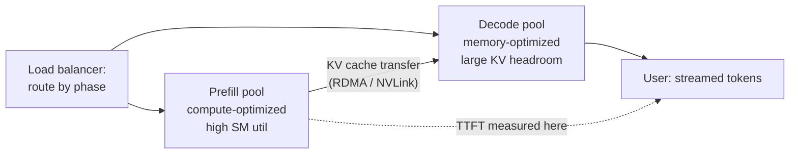

*Figure 6. Disaggregated serving. Prefill builds the KV cache; the cache ships to the decode pool; decode streams tokens. The transfer is the new cost this design introduces.*

Why it can win:

- **No interference.** On a shared GPU, a big prefill chunk stalls running decodes (TPOT spikes). Separate pools give each phase clean, predictable latency.
- **Right-sized hardware per phase.** Prefill wants FLOPS per dollar; decode wants HBM capacity per dollar. In principle you can buy different GPUs for each pool.
- **Independent scaling.** If traffic shifts toward longer prompts, add prefill GPUs without touching decode.

What it costs:

- **KV transfer on every request.** The cache built by prefill must reach the decode worker before the first token streams. Transfer time adds directly to TTFT.
- **Two pools to balance.** The prefill/decode GPU ratio must match the traffic mix. Get it wrong and one pool idles while the other queues.
- **Operational complexity.** Two deployments, two autoscalers, and a transfer layer (RDMA, connection management, retries) that can fail in new ways.

#### 4.2 The networking math

Transfer bytes per request are exactly the KV cache for the prompt:

```
transfer_bytes = prompt_tokens x kv_bytes_per_token
```

For the 70B-class model (320 KiB/token from Chapter 1):

| Prompt length | Transfer size | Over NVLink (~450 GB/s eff.) | Over IB NDR (~50 GB/s) |
|---|---|---|---|
| 2k tokens | 640 MB | ~1.4 ms | ~13 ms |
| 8k tokens | 2.56 GB | ~5.7 ms | ~51 ms |
| 32k tokens | 10.2 GB | ~23 ms | ~205 ms |

Two conclusions:

1. **Intra-node transfer is nearly free; cross-node is not.** At 2k-8k prompts over NVLink, the transfer is single-digit milliseconds against a TTFT budget of hundreds of milliseconds. Over InfiniBand at 32k prompts, 205 ms can blow a tight TTFT SLO by itself. Disaggregation favors placing prefill and decode workers where the interconnect is fastest, or keeping prompts short.
2. **The transfer must beat the interference it removes.** On a shared GPU, a 2k-token prefill chunk adds ~0.3 s of decode stall (Chapter 1's prefill math). If the transfer costs 6 ms, disaggregation wins big. If the transfer costs 200 ms and the interference was 50 ms, it loses. Always compare those two numbers for your traffic.

#### 4.3 When it pays: the decision rule

Disaggregate when at least two of these hold:

- **TTFT SLO is tight** (under ~1 s) and prefill/decode interference is the measured cause of violations, not queueing.
- **Prompts are long** (8k+): prefill dominates the request's GPU time, so isolating it moves the needle.
- **Decode batches are small** because prefill hogs KV memory: the shared pool forces an unhappy compromise between prefill throughput and decode batch size.
- **The interconnect is fast** between pools: same-node NVLink, or RDMA with measured transfer well under the TTFT budget.

Do not disaggregate when prompts are short (transfer overhead dominates). Do not disaggregate when one pool would sit idle most of the day: two half-empty pools cost more than one full one. And do not disaggregate when the team cannot operate the transfer layer reliably. A shared pool with good chunked prefill is the right default; disaggregation is the optimization you graduate to with measurements in hand.

#### 4.4 Sizing the two pools in Python

```python
# WHAT: disaggregated pool sizer. From traffic shape and hardware specs it
#   computes how many prefill GPUs and decode GPUs a request rate needs,
#   and checks whether KV transfer fits the TTFT budget.
# WHY: the prefill/decode GPU ratio is the central design decision in
#   disaggregated serving. Guessing it produces one idle pool and one
#   queueing pool. This calculator replaces the guess with arithmetic.
# WHAT BREAKS IF CHANGED: prefill is modeled as compute-bound (FLOPs/peak)
#   and decode as bandwidth-bound (bytes/bandwidth). Real systems lose
#   10-30% to overhead (scheduling, fragmentation, transfer protocol).
#   Multiply the final GPU counts by a 1.3 headroom factor in practice.

# --- hardware (illustrative H100-class, per GPU) ---
PEAK_TFLOPS = 989.0        # BF16 dense
BANDWIDTH_GBS = 3350.0     # HBM bandwidth, GB/s
MODEL_PARAMS = 70e9        # 70B-class model
KV_BYTES_PER_TOKEN = 320 * 1024  # from Chapter 1: 320 KiB/token

# --- interconnect (effective, measured in practice is lower) ---
NVLINK_GBS = 450.0         # intra-node, effective
IB_GBS = 50.0              # cross-node InfiniBand NDR, effective

def prefill_gpu_seconds(prompt_tokens, batch=1):
    # WHAT: GPU-seconds to prefill one request's prompt.
    # WHY: prefill is compute-bound, so time = FLOPs / peak. Batching
    #   amortizes: batch prompts share the step, dividing per-request cost.
    flops = 2 * MODEL_PARAMS * prompt_tokens
    return (flops / (PEAK_TFLOPS * 1e12)) / batch

def decode_gpu_seconds(output_tokens, batch):
    # WHAT: GPU-seconds to decode one request's output at a given batch.
    # WHY: decode is bandwidth-bound: each step moves the weights once
    #   (plus KV). Per-request cost falls as batch grows, until the KV
    #   pool caps the batch (Chapter 1, section 1.3).
    bytes_per_step = MODEL_PARAMS * 2  # BF16 weights, dominant term
    step_s = bytes_per_step / (BANDWIDTH_GBS * 1e9)
    return (step_s * output_tokens) / batch

def transfer_ms(prompt_tokens, link_gbs):
    # WHAT: KV transfer time for the prompt's cache.
    # WHY: this is the tax disaggregation pays on every request. It adds
    #   directly to TTFT, so it must fit inside the TTFT budget with room
    #   for prefill compute and queueing.
    return (prompt_tokens * KV_BYTES_PER_TOKEN) / (link_gbs * 1e9) * 1000

def size_pools(rps, avg_prompt, avg_output, decode_batch,
               ttft_budget_ms=800.0, link_gbs=NVLINK_GBS, prefill_batch=4):
    # WHAT: pool sizes for a target request rate, plus the transfer check.
    # WHY: each pool must independently sustain its phase's work. The
    #   ratio falls out of the traffic mix: long prompts need more prefill
    #   GPUs; long outputs need more decode GPUs. Prefill batching is
    #   assumed (batch=4): without it, long-prompt TTFT is hopeless.
    pre_each_ms = prefill_gpu_seconds(avg_prompt, batch=prefill_batch) * 1000
    pre_s = prefill_gpu_seconds(avg_prompt, batch=prefill_batch) * rps
    dec_s = decode_gpu_seconds(avg_output, decode_batch) * rps  # decode GPUs
    t_ms = transfer_ms(avg_prompt, link_gbs)
    ok_transfer = t_ms < 0.25 * ttft_budget_ms
    ok_prefill = pre_each_ms < 0.6 * ttft_budget_ms
    print(f"traffic: {rps} rps, prompt {avg_prompt}, output {avg_output}")
    print(f"prefill pool: {pre_s:.1f} GPUs "
          f"({pre_each_ms:.0f} ms compute/req at batch {prefill_batch})")
    print(f"decode pool:  {dec_s:.1f} GPUs at batch {decode_batch}")
    print(f"pool ratio (prefill:decode): 1 : {dec_s/max(pre_s, 1e-9):.1f}")
    print(f"KV transfer: {t_ms:.1f} ms over "
          f"{'NVLink' if link_gbs > 100 else 'IB'} "
          f"(budget {ttft_budget_ms:.0f} ms)")
    print("verdict: " + ("OK" if ok_transfer and ok_prefill
                         else "TOO SLOW: reconsider"))
    return pre_s, dec_s

if __name__ == "__main__":
    # long-prompt agentic traffic over NVLink: the case where
    # disaggregation shines (cheap transfer, heavy prefill)
    size_pools(rps=20, avg_prompt=8192, avg_output=512, decode_batch=32)
    print()
    # very long prompts across racks over InfiniBand: the case that
    # usually loses (transfer alone eats a quarter of the TTFT budget)
    size_pools(rps=5, avg_prompt=32768, avg_output=512, decode_batch=32,
               link_gbs=IB_GBS)
```

::: walkthrough
1. `prefill_gpu_seconds` treats prefill as compute-bound: 2 x params x tokens divided by peak FLOPS. Batching divides the per-request cost.
2. `decode_gpu_seconds` treats decode as bandwidth-bound: each step moves the weights once, so per-request cost is step time times output tokens divided by batch.
3. `transfer_ms` is the disaggregation tax: prompt KV bytes over link bandwidth. It must stay under a quarter of the TTFT budget, and prefill compute itself must fit too (hence the prefill batching assumption).
4. `size_pools` multiplies per-request costs by request rate to get GPU counts per pool. Run the two examples. Long prompts over NVLink pass both gates. 32k prompts over IB fail: the transfer eats 27% of the budget and prefill compute alone exceeds it. Together they are the quantitative version of the decision rule in 4.3.
:::

::: takeaway
- Disaggregation removes prefill/decode interference and lets each pool scale independently, at the cost of a KV transfer on every request.
- Transfer math decides: intra-node NVLink makes 8k-prompt transfers single-digit ms; cross-node IB can cost 200 ms at 32k.
- Size pools from the traffic mix with the calculator above. Default to a shared pool with chunked prefill; disaggregate with measurements.
:::

::: pq
**Q1.** A 70B-class model serves 32k-token prompts. The team considers disaggregated serving with prefill and decode in different racks connected by InfiniBand (~50 GB/s effective). What does the transfer math say?

A. Transfer is ~10 GB / 50 GB/s = ~205 ms per request, likely blowing a tight TTFT budget. Keep the pools IB-local or stay shared.

B. Transfer is free because RDMA has zero overhead.

C. Transfer is ~10 MB, negligible at any scale.

D. Disaggregation always wins regardless of transfer cost.

::: answer
**Answer: A.** 32,768 tokens x 320 KiB = ~10.2 GB; at 50 GB/s that is ~205 ms added to every request's TTFT, before prefill compute. Unless the TTFT budget tolerates it, this deployment loses to a shared pool. The fix is faster interconnect between pools or shorter prompts.

- **B, wrong:** RDMA avoids CPU copies but the bytes still take 205 ms on the wire.
- **C, wrong:** off by 1000x; the KV cache for 32k tokens is gigabytes, not megabytes.
- **D, wrong:** disaggregation is a trade with a measured tax, not a universal win.
:::

**Q2.** After disaggregating, the prefill pool idles at 30% utilization while the decode pool queues. What is wrong, and what is the fix?

A. The model is too small; use a bigger model

B. The pool ratio does not match the traffic mix: too many prefill GPUs for the actual prompt/output ratio. Re-run the sizer with measured traffic and rebalance; add autoscaling per pool

C. The transfer link is too fast; slow it down

D. Nothing; idle prefill GPUs are expected

::: answer
**Answer: B.** The two pools must be sized from the traffic mix independently. An idle prefill pool with a queueing decode pool means the ratio assumed longer prompts (or fewer outputs) than reality. Measure the real prompt/output distribution, resize, and put each pool on its own autoscaler since the two phases scale differently.

- **A, wrong:** model size does not fix a pool-ratio mismatch.
- **C, wrong:** link speed does not cause pool imbalance.
- **D, wrong:** 30% idle on expensive GPUs is exactly the waste disaggregation is supposed to avoid.
:::
:::

### Chapter 5. Production incident playbook

Everything so far was design. This chapter is operations: what breaks, in what order to check, and what to do. Three incidents cover most serving pages: latency spikes, OOMs, and throughput cliffs. Each gets a diagnosis tree. Read the tree top to bottom; check in order; change one thing.

Have this tooling ready before the first incident. Per-GPU health from DCGM: clocks, temperature, Xid errors, NVLink counters. `nvidia-smi` for quick checks. Engine metrics in Grafana: queue depth, preemptions, cache hit rate, TTFT/TPOT histograms. Nsight Systems for GPU-timeline profiling when the suspect is a kernel. And a runbook from the last incident. Volume 10's monitoring and incident chapters cover the observability setup; this chapter is the decision procedure.

#### 5.1 Latency spike

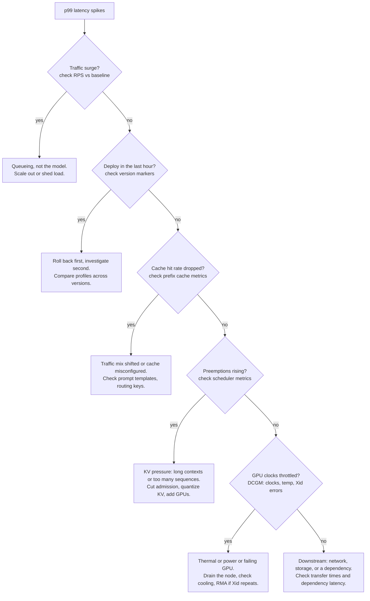

Notes on the tree:

- **Traffic first.** Most spikes are demand, not defects. Compare RPS and tokens-per-second against the same hour last week before touching anything.
- **Roll back before root-causing.** If a deploy correlates, reverting restores users in minutes; the post-mortem can take days. Pride has no place in incident response.
- **Cache hit rate is the quiet killer.** A prompt-template change (one extra whitespace in the system prompt) can zero out prefix-cache hits overnight. TTFT jumps, nothing else changes. The metric to watch is hits per thousand requests, segmented by template version.
- **GPU throttling hides as latency.** A card with a failing fan clocks down silently; p99 climbs 20% with no code change. DCGM clock and temperature graphs catch it in seconds.

#### 5.2 OOM (out of memory)

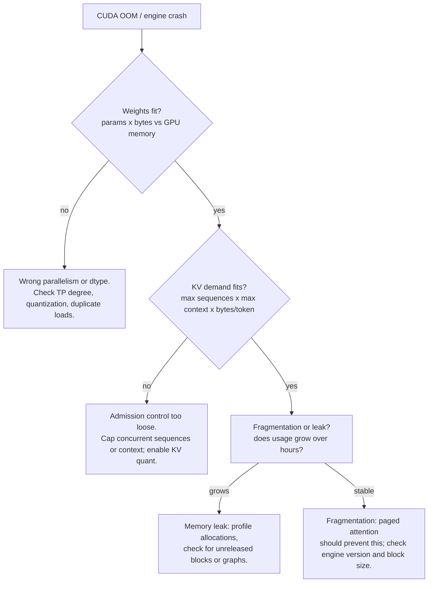

Notes:

- **Weights first, always.** A 70B model in BF16 is 140 GB. Loading it on one 80 GB GPU is not a tuning problem. Check the tensor-parallel degree and that quantization actually applied (a config typo can silently load FP16).
- **KV math second.** Max sequences times max context times 320 KiB/token (Chapter 1) must fit in the KV budget with headroom. If your longest allowed context times your max sequences exceeds the budget, the OOM was scheduled at config time.
- **Growth over hours means leak.** Plot GPU memory over 24 hours. A sawtooth that climbs is a leak (unreleased blocks, cached graphs, a metrics buffer). A flat line with sudden death is fragmentation or a burst.
- **After any OOM, capture the state before restarting.** Block-manager stats, queue depth, the longest contexts in flight. Restarting destroys the evidence.

#### 5.3 Throughput cliff

Throughput cliffs are the cruelest: tokens per second per GPU falls off suddenly while nothing looks broken.

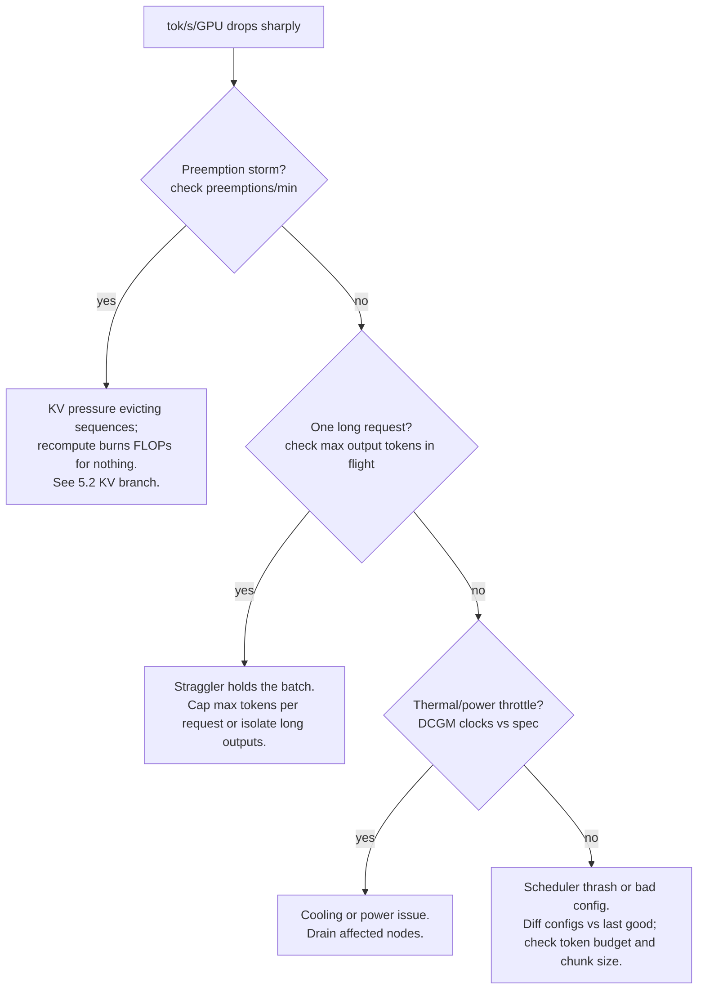

Notes:

- **Preemption storms feed themselves.** Evicted sequences recompute, which consumes the FLOPs that would have served new tokens, which keeps the queue long, which keeps pressure high. The fix is admission control, applied early: better to queue requests than to admit and evict them.
- **One 128k-output request can halve a pool's throughput.** Long outputs hold KV blocks for the whole generation. Caps on output length, or a separate pool for long generations, protect the main pool.
- **Config diffs are underrated.** `git diff` on the serving config between the last good deploy and now. A token-budget change from 4096 to 512 looks innocent and quarters throughput.

#### 5.4 The runbook habit

| After the incident | Why it matters |
|---|---|
| Write the timeline: detection, diagnosis steps, fix, recovery time | Next time starts from your notes, not from zero |
| Name the metric that would have caught it earlier | That metric becomes a new alert |
| Record the config or code change that fixed it | Prevents the same incident after the next refactor |
| Note what you checked that was innocent | Stops the next responder re-checking dead ends |

::: callout warn
Three traps, all common. One: changing two things during an incident and not knowing which fixed it. Two: restarting the fleet before capturing block-manager and queue state, destroying the evidence. Three: treating the symptom with more GPUs when the cause is a config (admission, chunk size, cache key). GPUs are expensive; configs are free.
:::

::: takeaway
- Diagnose in order: traffic, deploy, cache, scheduler, GPU health, downstream. Check before changing.
- OOMs are arithmetic: weights, then KV budget, then fragmentation or leak. Do the math first.
- Throughput cliffs are usually preemption storms, stragglers, throttling, or config diffs. Capture state before restarting.
- Every incident ends in the runbook, with a new alert attached.
:::

::: pq
**Q1.** p99 latency doubles within an hour. RPS is flat, no deploy went out, cache hit rate is steady, preemptions are near zero. DCGM shows one GPU at 65 C above its peers with clocks 30% below spec. What is the diagnosis and the action?

A. Scheduler bug; restart the engine

B. Thermal throttling on a failing card: the hot GPU slows its steps and poisons batch latency. Drain the node, check cooling, and RMA the card if the pattern repeats

C. Traffic surge; add GPUs

D. KV pressure; enable KV quantization

::: answer
**Answer: B.** The tree rules out traffic, deploy, cache, and scheduler. A lone hot GPU with reduced clocks is thermal throttling, often a failing fan or blocked airflow. Because decode steps run in lockstep across the batch, one slow GPU slows every request it touches.

- **A, wrong:** nothing points at the scheduler; preemptions are zero and no config changed.
- **C, wrong:** RPS is flat; this is not demand.
- **D, wrong:** preemptions near zero means KV pressure is not the cause.
:::

**Q2.** After enabling a higher max-concurrency setting, throughput per GPU falls 40% and preemptions per minute jump 20x. What happened, and what is the correct response?

A. The GPUs got slower; replace them

B. A preemption storm: admission exceeds KV capacity, sequences get evicted and recomputed, and recompute burns the FLOPs that would have served tokens. Revert the concurrency increase; set admission from the KV budget math

C. The network is congested; add bandwidth

D. This is expected; higher concurrency always costs throughput

::: answer
**Answer: B.** This is the textbook preemption storm: more admitted sequences than KV blocks, evictions, recompute waste, falling goodput. The fix is admission control grounded in the Chapter 1 capacity math, not more hardware.

- **A, wrong:** hardware did not change; the config did.
- **C, wrong:** preemptions are a GPU-local memory signal.
- **D, wrong:** higher concurrency helps until KV capacity binds; past that point it destroys throughput. The cliff is the signal you crossed the line.
:::
:::

### Chapter 6. Cost modeling

A serving stack is a factory. Its unit economics decide whether the product survives. Appendix 8A builds the full framework: cost per successful outcome, routing and cascades across model tiers, and shadow traffic for safe changes. Read those three sections first. This chapter adds the fleet layer underneath: GPU-hour math, the spot vs reserved decision, and sizing a fleet from traffic.

#### 6.1 GPU-hour math

Start with the cost of one GPU-hour and the work it does.

```
$/1M tokens = (GPUs x $/GPU-hour) / (tokens/second x 3600 / 1e6)
```

Worked example, 70B-class model on 2 H100s at $3/hr each (illustrative September 2026 on-demand pricing):

- Fleet cost: 2 x $3 = **$6/hr**.
- Sustained throughput at healthy batching: ~1,500 tokens/second (from the Chapter 1 batch math: batch 64 gives ~1,333 tok/s; tuned setups do better).
- Tokens per hour: 1,500 x 3,600 = 5.4M.
- Cost per 1M tokens at 100% utilization: $6 / 5.4 = **$1.11**.

Nobody runs at 100% utilization. Traffic has valleys. At 60% average utilization the same stack costs $1.11 / 0.60 = **$1.85 per 1M tokens**. Utilization is the silent multiplier: a 10% utilization gain beats most kernel optimizations, because it multiplies every other win.

Three numbers, three owners:

| Number | Owner | Moves when |
|---|---|---|
| $/GPU-hour | procurement / platform | spot vs reserved, hardware choice, region |
| tokens/second/GPU | inference engineer (you) | batching, quantization, scheduler tuning |
| utilization | capacity planning | autoscaling speed, traffic shaping, pool sizing |

Your chapters (1-4) move the middle number. This chapter moves the other two.

#### 6.2 Spot vs reserved: the fleet mix

Cloud GPUs come in two prices. Reserved (or committed) capacity costs the sticker price and stays yours. Spot (or preemptible) capacity costs 50-70% less and can be taken back with minutes of notice.

The decision is not either/or. It is a mix, set by preemption tolerance:

- **Baseline traffic on reserved.** The traffic floor that is always there should sit on capacity that never disappears. Size reserved for the 10th-percentile load, not the mean.
- **Peaks on spot.** Traffic above baseline scales onto spot with an autoscaler. When spot vanishes, the system degrades gracefully: queue, shed low-priority traffic, or fall back to a smaller model (the cascade in Appendix 8A, section 2).
- **Stateless workers prefer spot.** Decode workers hold KV state for in-flight requests, so preemption kills those requests. Design for it: checkpoint nothing, retry the request on a reserved worker, and keep spot to a fraction where the retry cost stays small. Prefill workers are more preemptible-friendly (a prefill is short and cheap to redo).

The math: if spot is 65% cheaper and preemptions cost you 5% of spot-served requests as retries, the effective discount is still ~60%. The break-even is far in spot's favor for anything but the strictest latency SLOs. What kills spot savings is not preemption; it is slow autoscaling that leaves spot GPUs idle while reserved GPUs queue.

#### 6.3 Sizing a fleet from traffic

```python
# WHAT: fleet sizer and cost model. From traffic shape it computes GPU
#   count, then prices the fleet under reserved-only vs mixed spot fleets.
# WHY: capacity planning is where serving budgets are won or lost. This
#   turns "how many GPUs?" into arithmetic over peak rate, tokens per
#   request, per-GPU throughput, and headroom, then prices the answer.
# WHAT BREAKS IF CHANGED: prices below are illustrative September 2026
#   values. Replace with your contract prices. The 1.3 headroom factor
#   covers autoscaling lag and traffic burstiness; bursty traffic needs
#   more, flat traffic needs less. Measure your peak-to-mean ratio.

# --- illustrative pricing, $/GPU-hour (replace with contract prices) ---
H100_RESERVED = 3.00
H100_SPOT = 1.05       # ~65% discount, illustrative
TOK_PER_S_PER_GPU = 750.0  # sustained, per GPU, at healthy batching
HEADROOM = 1.3         # autoscaling lag + burst absorption
SPOT_FRACTION = 0.5    # share of peak fleet on spot

def fleet_size(peak_rps, avg_tokens_per_req):
    # WHAT: GPUs needed to serve the peak request rate.
    # WHY: size for the peak, not the mean. The fleet must survive the
    #   busiest minute; utilization (section 6.1) then measures how much
    #   of that capacity the average minute uses.
    tokens_per_s = peak_rps * avg_tokens_per_req
    gpus = tokens_per_s / TOK_PER_S_PER_GPU * HEADROOM
    return gpus, tokens_per_s

def price_fleet(gpus, avg_utilization):
    # WHAT: monthly cost under two purchasing strategies.
    # WHY: the mix decision in dollars. Reserved-only is the safe
    #   baseline; the mixed fleet shows what spot tolerance buys.
    hours = 730.0  # hours per month
    reserved_only = gpus * H100_RESERVED * hours
    # baseline (10th percentile ~ 40% of peak) on reserved, rest mixed
    base = gpus * 0.4
    flex = gpus * 0.6
    mixed = (base * H100_RESERVED +
             flex * (SPOT_FRACTION * H100_SPOT +
                     (1 - SPOT_FRACTION) * H100_RESERVED)) * hours
    # unit cost at achieved utilization (the number from section 6.1)
    per_1m = (gpus * H100_RESERVED) / (TOK_PER_S_PER_GPU * gpus *
                                      avg_utilization * 3600 / 1e6)
    return reserved_only, mixed, per_1m

if __name__ == "__main__":
    # example: chat product, 40 peak rps, 700 tokens per request
    gpus, tps = fleet_size(peak_rps=40, avg_tokens_per_req=700)
    r_only, mixed, unit = price_fleet(gpus, avg_utilization=0.6)
    print(f"demand: {tps:,.0f} tok/s peak -> {gpus:.0f} GPUs "
          f"(headroom {HEADROOM}x)")
    print(f"monthly: reserved-only ${r_only:,.0f} | "
          f"mixed ${mixed:,.0f} "
          f"(saves {(1 - mixed/r_only)*100:.0f}%)")
    print(f"unit cost at 60% utilization: ${unit:.2f} per 1M tokens")
    print(f"raise utilization to 75%: ${unit*0.6/0.75:.2f} per 1M tokens")
```

::: walkthrough
1. `fleet_size` converts peak demand (requests x tokens) into GPUs at sustained per-GPU throughput, times headroom. Sizing for the peak is the conservative choice that keeps p99 latency intact during bursts.
2. `price_fleet` prices two strategies. The mixed fleet puts the always-on baseline on reserved and the variable portion on a spot blend. The savings line is the dollar value of preemption tolerance.
3. The unit-cost line restates section 6.1: at fixed hardware, utilization is the price. The last print shows a 15-point utilization gain cutting unit cost 20%.
4. To connect this to Appendix 8A, feed the unit cost into cost-per-successful-outcome by dividing by the success rate. Then use routing and cascades (8A section 2) to shift easy traffic to cheaper tiers before buying more GPUs.
:::

::: takeaway
- Unit cost = GPU price / (throughput x utilization). You own throughput; capacity planning owns utilization; procurement owns price.
- Fleet mix: baseline on reserved, peaks on spot, stateless-friendly workers first. Slow autoscaling kills more savings than preemptions do.
- Size for the peak with headroom, price the mix, and let utilization be the monthly KPI.
:::

::: pq
**Q1.** A fleet's unit cost is $2.00 per 1M tokens at 50% utilization. Throughput per GPU is unchanged. What is the unit cost at 80% utilization, and what does this imply about where to invest?

A. $3.20; invest in faster GPUs

B. $1.25; utilization work (autoscaling, traffic shaping, pool rightsizing) pays more than most kernel work

C. $2.00; utilization does not affect unit cost

D. $1.00; unit cost halves whenever utilization rises

::: answer
**Answer: B.** Unit cost scales inversely with utilization: $2.00 x 0.50/0.80 = $1.25. A 30-point utilization gain cut cost 37% with zero kernel changes. This is why capacity planning sits beside batching and quantization as a first-class lever.

- **A, wrong:** the direction is inverted; higher utilization lowers unit cost.
- **C, wrong:** utilization is in the denominator of the unit-cost equation.
- **D, wrong:** the scaling is proportional (0.5/0.8), not a halving.
:::

**Q2.** Spot GPUs are 65% cheaper but can be preempted. Which workload split is sound, and why?

A. Everything on spot; preemptions never matter

B. Baseline load on reserved, peaks on spot, with graceful degradation (queue, shed, or cascade to a smaller model) when spot vanishes

C. Everything on reserved; spot is never worth the complexity

D. Prefill on spot, decode on reserved, because decode is stateless

::: answer
**Answer: B.** The baseline is always there, so it belongs on capacity that never disappears. Peaks are variable, so they belong on cheap variable capacity. Graceful degradation bounds the damage when spot goes away. The effective discount survives realistic retry costs.

- **A, wrong:** losing the entire fleet at once is not graceful; the baseline needs guaranteed capacity.
- **C, wrong:** leaves ~60% savings on the table for the peak portion, which is pure margin.
- **D, wrong:** inverted; decode workers hold in-flight KV state, so they are the less preemptible-friendly phase, not more.
:::
:::

## Part 4. Capstone lab

Two labs tie the track together. The first measures a real serving stack with the discipline from Chapter 1 and Volume 8's benchmarking chapter. The second runs the quantization decision from Chapter 2 end to end.

::: lab Lab T3.1: Measure a serving stack honestly
**Goal.** Stand up a model behind an OpenAI-compatible serving endpoint. vLLM's server is the usual choice. Then measure TTFT, TPOT, p50/p99 latency, and tokens/second/GPU under a fixed-schedule load, free of coordinated omission.

**Steps.**

1. Serve a small model (7-8B class) with vLLM: `vllm serve <model>`. Note the GPU, the dtype, and every non-default flag. These go in the lab notebook; a measurement without its config is not reproducible.
2. Warm up with 50 requests. Cold kernels and cold caches poison the first measurements.
3. Run the harness below at three load levels (2, 8, 20 rps) with a fixed prompt set mixing short chat and 4k-token documents. Record per-request TTFT, TPOT, and total latency.
4. Plot latency vs load. Find the knee where p99 bends upward: that is your capacity limit at current settings.
5. Change one thing (enable prefix caching, or switch to FP8, or raise the token budget) and repeat. One variable, one conclusion.

**The harness** (standard library only; fixed-schedule sends, no coordinated omission):

```python
# WHAT: honest load generator for an OpenAI-compatible /v1/completions
#   endpoint with streaming. Measures TTFT, TPOT, and totals per request.
# WHY: most serving numbers are wrong because the load generator waits for
#   each response before sending the next (coordinated omission), hiding
#   queueing. This sends on a fixed schedule from worker threads, like
#   real users arriving independently of server speed.
# WHAT BREAKS IF CHANGED: threads are used instead of asyncio for stdlib
#   simplicity; at very high rps the GIL adds client-side noise. Keep
#   client rps modest or move to asyncio. Times are client-measured, so
#   client and server must have synchronized clocks (same machine is best).

import json
import threading
import time
import urllib.request

ENDPOINT = "http://localhost:8000/v1/completions"
MODEL = "your-model-name"  # must match the served model id

def one_request(prompt, max_tokens=256):
    # WHAT: single streamed request; returns (ttft_s, tpot_s, total_s).
    # WHY: streaming exposes TTFT (first chunk arrival) separately from
    #   TPOT (steady-state chunk rate). Non-streaming hides both.
    body = json.dumps({
        "model": MODEL, "prompt": prompt, "max_tokens": max_tokens,
        "stream": True, "temperature": 0.0,  # deterministic: comparable runs
    }).encode()
    req = urllib.request.Request(
        ENDPOINT, data=body, headers={"Content-Type": "application/json"})
    t0 = time.perf_counter()
    first = None
    chunks = 0
    with urllib.request.urlopen(req, timeout=300) as resp:
        for line in resp:
            line = line.decode().strip()
            if not line.startswith("data:"):
                continue
            if first is None:
                first = time.perf_counter()  # TTFT: request -> first token
            chunks += 1
            if "[DONE]" in line:
                break
    t1 = time.perf_counter()
    ttft = first - t0
    # TPOT: total decode time spread over tokens after the first
    tpot = (t1 - first) / max(chunks - 1, 1)
    return ttft, tpot, t1 - t0

def run_load(prompts, rps, duration_s):
    # WHAT: fixed-schedule load: a sender thread emits requests every
    #   1/rps seconds regardless of completions; workers run them.
    # WHY: the fixed schedule is the anti-coordinated-omission device.
    #   If the server slows, the queue grows visibly instead of the load
    #   politely shrinking, which is what production actually looks like.
    results, lock = [], threading.Lock()
    stop = time.perf_counter() + duration_s

    def worker(prompt):
        try:
            r = one_request(prompt)
            with lock:
                results.append(r)
        except Exception as e:  # count errors: they are data, not noise
            with lock:
                results.append(("ERR", str(e)))

    send_interval = 1.0 / rps
    threads, i = [], 0
    next_send = time.perf_counter()
    while time.perf_counter() < stop:
        t = threading.Thread(target=worker, args=(prompts[i % len(prompts)],))
        t.start()
        threads.append(t)
        i += 1
        next_send += send_interval
        time.sleep(max(0.0, next_send - time.perf_counter()))
    for t in threads:
        t.join()
    return results

def summarize(results):
    # WHAT: p50/p99 for latency and TTFT, mean TPOT, error rate.
    # WHY: the tail decides. Report p99 alongside p50 every time; a
    #   summary without the tail is how bad configs survive review.
    ok = [r for r in results if r[0] != "ERR"]
    errs = len(results) - len(ok)
    lat = sorted(r[2] for r in ok)
    ttft = sorted(r[0] for r in ok)
    tpot = sum(r[1] for r in ok) / max(len(ok), 1)
    q = lambda s, p: s[min(int(p * len(s)), len(s) - 1)]
    print(f"n={len(results)} errors={errs} ({100*errs/max(len(results),1):.1f}%)")
    print(f"latency  p50={q(lat,.5):.2f}s p99={q(lat,.99):.2f}s")
    print(f"TTFT     p50={q(ttft,.5):.2f}s p99={q(ttft,.99):.2f}s")
    print(f"TPOT     mean={tpot*1000:.0f} ms/token")

if __name__ == "__main__":
    short = "Explain batching in one paragraph."
    long_doc = "Summarize the key points: " + ("lorem ipsum " * 1000)
    for rps in (2, 8, 20):
        print(f"--- {rps} rps ---")
        summarize(run_load([short, long_doc], rps=rps, duration_s=60))
```

**Deliverable.** A one-page report: the config, the three load levels, the latency-vs-load curve with the knee marked, the one change you tried, and whether it moved p99, throughput, or cost. If the change helped one metric and hurt another, say which trade you chose and why.
:::

::: lab Lab T3.2: Quantization shootout
**Goal.** Take one model and produce a defensible quantization recommendation using Chapter 2's method.

**Steps.**

1. Build the eval set first: 200+ items mirroring production traffic (short chat, long documents, code, math), each with a grader. Freeze it. This set does not change during the shootout.
2. Establish the FP16 baseline: perplexity on held-out traffic-like text plus task accuracy. Record throughput (tokens/second/GPU) at your standard batch.
3. Quantize three ways: FP8 (if Hopper), AWQ 4-bit, GPTQ 4-bit. Calibrate each on traffic-like data, not a generic corpus.
4. Run the acceptance harness from section 2.3 on each. Any FAIL is out, regardless of speed.
5. For survivors, measure throughput and recompute $/1M tokens. Pick the winner by unit cost at equal quality, and write down the runner-up and why it lost.

**Deliverable.** The acceptance table for all three candidates, the unit-cost comparison, and a one-paragraph recommendation naming the calibration set used. If someone asks "why not the faster one," the table answers.
:::

::: takeaway
- Measure before changing, change one thing, measure again. The loop from Part 1 is the whole job.
- The capstone proves the track's skills on a real stack: honest load generation, tail statistics, and a quantization decision with receipts.
:::

---

## Where this track leaves you

You can now do the arithmetic that governs serving: roofline per token, KV bytes per sequence, batching gains, transfer costs, fleet prices. You can read a serving engine's scheduler as a set of decisions. You can choose quantization with an eval harness instead of a hunch. You can diagnose the three classic incidents in order, and price the fleet underneath it all.

The base volumes go deeper wherever you need. Vol 15 when a kernel is the bottleneck. Vol 6 when the parallelism strategy needs rethinking. Vol 13 when the system design grows. Vol 11 when the statistics get subtle. This track is the map; those volumes are the territory.

::: provenance
**Worked-number policy.** Every number here is an illustrative example, not a measurement. Public spec values used: H100 at 989 TFLOPS BF16 with 3.35 TB/s bandwidth; H100 on-demand around $3/hr; a 70B-class model with 80 layers and 8 KV heads. All values are September 2026 public figures. Redo the math with your own hardware prices and measured throughput before spending money. **UNVERIFIED:** exact engine feature details evolve quickly; verify scheduler flags and kernel support against the engine's current documentation before relying on them in production.
:::
