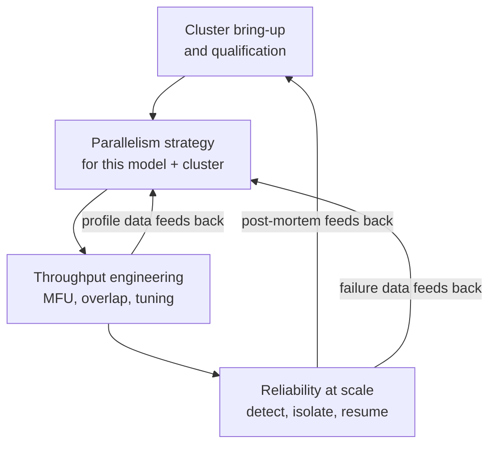
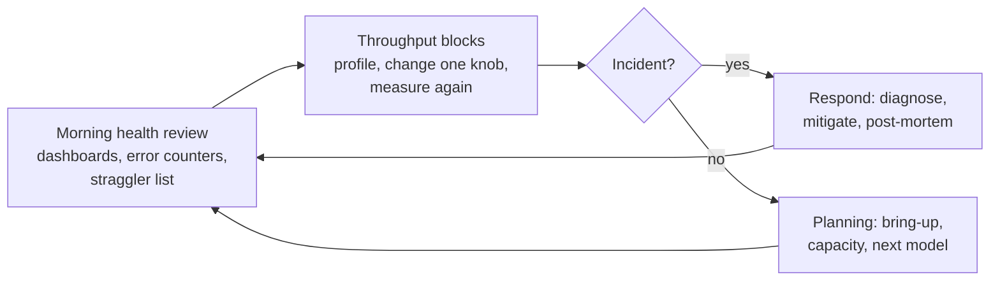
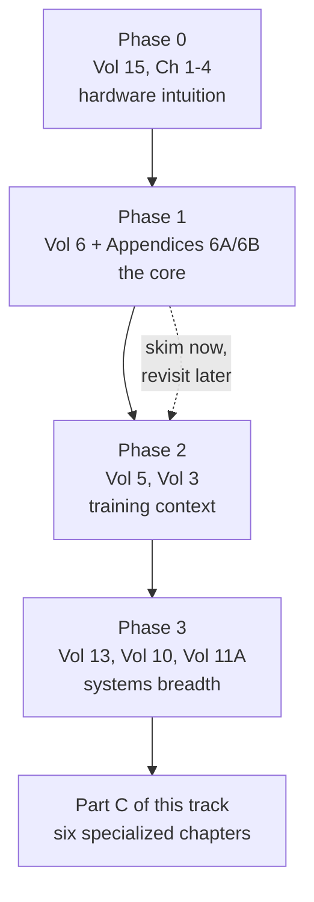
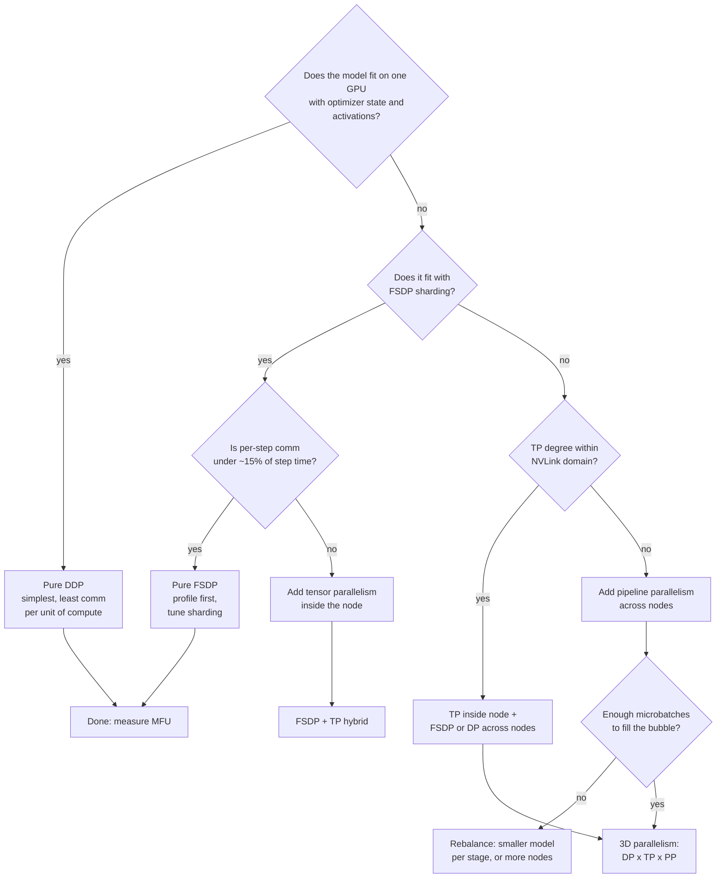
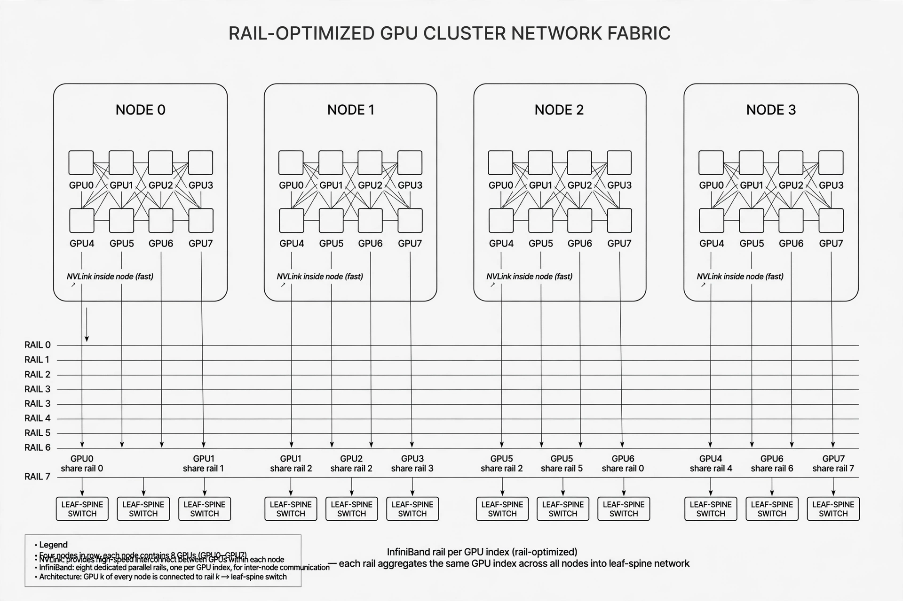
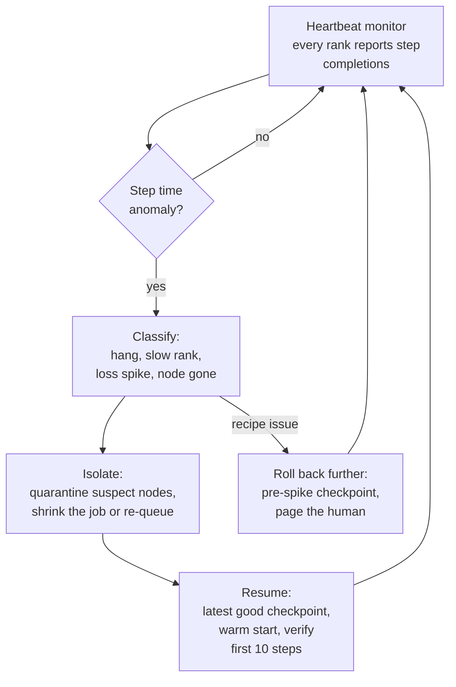
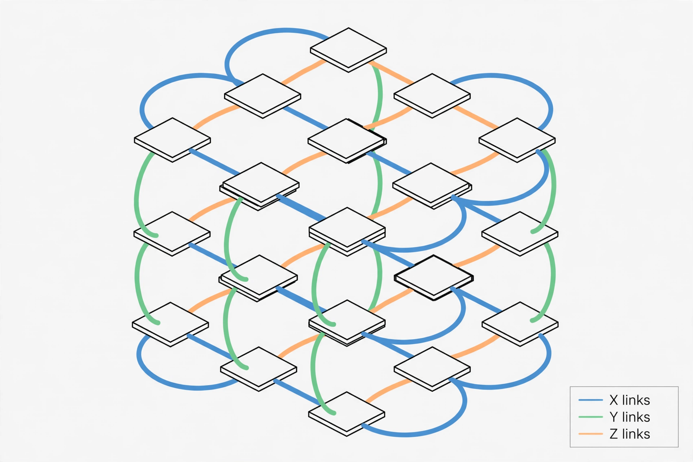

# Role Track 4: Distributed Training Systems Engineer

This track turns the base curriculum into a working playbook for one role: the engineer who owns large-scale training systems. That means thousand-GPU clusters, parallelism strategy, throughput, and reliability. The base volumes teach the pieces. This track teaches the job: what to own, what order to learn it in, and the engineering judgment the base does not cover.

Read Part A for the role picture. Follow Part B as your ordered reading path through the base volumes. Work Part C as six new chapters written for this role. Finish with the practice set and capstone in Part D.

**How to use this track.** Each chapter stands on specific base chapters. The reading path in Part B tells you exactly which ones and why. If a base chapter is listed as prerequisite, read it first. The new chapters assume you have.

---

## Part A: The role in plain terms

### A.1 What this engineer owns

A distributed training systems engineer owns the machinery that turns a model definition into trained weights at scale. Four areas, each with a clear owner-level question.

**1. Cluster bring-up and qualification.** Before any training starts, someone must prove the hardware is healthy and fast. That means burn-in tests on every node, network bandwidth checks between every pair of nodes, and a baseline benchmark the team trusts. The owner-level question: *is this cluster ready to train, and how do we know?*

**2. Parallelism strategy.** A frontier model does not fit on one GPU. Splitting it across hundreds or thousands of GPUs is a design decision with real trade-offs. Data, tensor, pipeline, context, and expert parallelism each move a different bottleneck. The owner-level question: *given this model and this cluster, what split gives the highest useful throughput?*

**3. Throughput engineering.** Once training runs, the job is to keep every GPU busy doing useful math. That means measuring model FLOPs utilization (MFU), finding the slow kernels, overlapping communication with compute, and tuning the knobs that matter. The owner-level question: *where is time going in each training step, and what is the cheapest way to win it back?*

**4. Reliability at scale.** Hardware fails. At thousand-GPU scale it fails daily. The run must survive failures automatically: detect them fast, isolate the bad node, and resume from a checkpoint with minutes of lost work, not hours. The owner-level question: *when (not if) something breaks at 3 a.m., does the run heal itself?*



**How to read this diagram.** Four boxes, one loop. Bring-up proves the hardware. Strategy picks the split. Throughput squeezes the step time. Reliability keeps the run alive. The arrows back matter most: every incident teaches you something about the cluster, and every profile teaches you something about the strategy. The loop never ends. A mature team runs it continuously.

::: takeaway
- The role owns four things: cluster health, parallelism strategy, throughput, and reliability.
- Each area has one owner-level question. If you cannot answer it with numbers, you do not own it yet.
- The four areas form a loop. Incident data and profile data feed back into strategy and bring-up.
:::

### A.2 A typical week

No two weeks look the same, but the rhythm repeats. Here is the shape of it.

**Morning health review (daily, 30 minutes).** Open the fleet dashboard. Check GPU error counters (Xid errors, ECC counts), InfiniBand link flaps, and the straggler list from last night's runs. A node that flapped twice in a week goes on the quarantine list before it kills a run.

**Throughput work (the deep blocks).** Pick one running job and profile it. Read the trace. Find the exposed communication or the slow kernel. Change one variable: microbatch count, tensor-parallel degree, a NCCL knob. Measure again. This is the highest-value quiet work in the role.

**Incident response (unscheduled, urgent).** A run hangs. A loss curve spikes. A node drops off the fabric. The run guardian (Chapter 4) handles the routine cases. You handle the novel ones: the hang that only happens past 2,000 GPUs, the NaN that appears after 40 billion tokens. Each one ends in a post-mortem and usually a new automated check.

**Bring-up and planning (weekly).** New nodes arrive. Old nodes get re-qualified. You plan capacity for the next model: how many GPUs, what parallelism layout, what checkpoint budget. This is where Chapter 1 earns its keep.



::: callout warn
The trap in this role is living in incident response and never doing throughput work. Incidents are loud and urgent. Throughput is quiet and compounds. Protect two deep blocks a week for profiling, or the cluster slowly gets slower and nobody notices.
:::

### A.3 How success is measured

This role is measured in numbers, not narratives. Five metrics carry the weight.

**MFU: model FLOPs utilization.** The fraction of the hardware's peak math throughput that becomes useful model FLOPs. If the GPUs can theoretically do 1,000 TFLOPS and the training achieves 550 TFLOPS of real forward-plus-backward math, MFU is 55%. MFU is the headline efficiency metric. Chapter 1 works the math in full.

**Goodput.** Useful tokens per second after subtracting everything that is not training: checkpoint stalls, restarts, straggler drag, failed steps. A run at 60% MFU with constant restarts can have worse goodput than a run at 50% MFU that never stops. Goodput is what the model actually receives.

**MTBF: mean time between failures.** How long the job runs, on average, before something breaks it. Scales inversely with GPU count: double the GPUs, halve the MTBF. Chapter 4 derives this from public Llama 3 run data.

**Time to recovery.** When a failure hits, how many minutes pass before training is productive again. This is checkpoint restore time plus re-queue time plus warm-up. The budget most teams aim for is under 10 minutes on large runs.

**Effective training time.** The fraction of wall-clock time the job spends doing useful training. Llama 3's 405B run held above 90% on 16,384 GPUs through automation. That number is the reliability scorecard in one figure.

| Metric | What it measures | Healthy target (large runs) |
|--------|------------------|-----------------------------|
| MFU | GPU math efficiency | 50 to 65% (dense transformer, H100-class) |
| Goodput | Useful tokens/sec after all overhead | Track weekly; trend must not decay |
| MTBF | Hours between job failures | Grows with automation; ~50 h at 1k GPUs is normal |
| Time to recovery | Minutes from failure to productive training | Under 10 minutes |
| Effective training time | Fraction of wall clock spent training | Above 90% |

::: takeaway
- MFU measures efficiency. Goodput measures delivered value. Effective training time measures reliability.
- Every metric has a number attached. "Feels slow" is not a diagnosis. 43% MFU with 22% exposed communication is.
- Targets shift with hardware and model. The habit that matters is measuring before and after every change.
:::

---

## Part B: Ordered reading path through the base volumes

Read in this order. Each phase builds on the last. The "why" column says what this role takes from each chapter, so you read with a target in mind instead of reading everything flat.

### Phase 0: Hardware intuition (1 to 2 days)

| Order | Volume and chapters | Why this role needs it |
|-------|--------------------|-----------------------|
| 1 | Vol 15, Ch 1: GPU execution model | MFU math is meaningless without knowing what a warp, block, and SM are |
| 2 | Vol 15, Ch 2: Memory hierarchy | Every parallelism decision is a memory decision first |
| 3 | Vol 15, Ch 3: Occupancy and latency hiding | Explains why small kernels waste GPUs, the root of many throughput problems |
| 4 | Vol 15, Ch 4: Roofline and performance diagnosis | The roofline is the lens for every profile you will ever read |

### Phase 1: The core, read deeply (1 to 2 weeks)

| Order | Volume and chapters | Why this role needs it |
|-------|--------------------|-----------------------|
| 5 | Vol 6, Ch 1: Memory math | The exact arithmetic that decides whether a model fits and where it spills |
| 6 | Vol 6, Ch 2: Data parallelism and DDP | The default strategy. Know its gradient all-reduce cost cold |
| 7 | Vol 6, Ch 3: ZeRO sharding | The memory-vs-communication trade at the heart of FSDP |
| 8 | Vol 6, Ch 4: FSDP in practice | The workhorse of modern training. Most runs you touch will use it |
| 9 | Vol 6, Ch 5: Tensor parallelism | Intra-layer splits and why they want fast intra-node links |
| 10 | Vol 6, Ch 6: Pipeline parallelism, GPipe vs 1F1B | The bubble math in Ch 6.6 returns in Chapter 1 of this track |
| 11 | Vol 6, Ch 7: Sequence and context parallelism | Required for long-context models; pairs with Appendix 4A |
| 12 | Vol 6, Ch 8: The 3D parallelism recipe | The combination framework this track's Chapter 1 extends |
| 13 | Vol 6, Ch 9: Checkpointing and fault tolerance | First pass at the reliability half of the role |
| 14 | Vol 6, Ch 10: Profiling a training step | First pass at the throughput half of the role |
| 15 | Appendix 6B: Parallelism and XLA | Expert parallelism, launchers, and the XLA view. Read before this track's Chapters 1 and 6 |
| 16 | Appendix 6A: Training reliability and operations | The field manual for Chapters 3 and 4 of this track. Note its honest limits |



**How to read this diagram.** Solid arrows are the required path. The dashed arrow is permission: you can skim Phase 2 on the first pass and come back. You cannot skip Phase 1. Every specialized chapter in Part C names its prerequisites, and they all live in Phase 0 and Phase 1.

### Phase 2: Training context (3 to 4 days, skimmable first pass)

| Order | Volume and chapters | Why this role needs it |
|-------|--------------------|-----------------------|
| 17 | Vol 5, Ch 4: Scaling laws, 6ND rule | The 6ND formula is the numerator of every MFU calculation |
| 18 | Vol 5, Ch 5: Anatomy of one training step | What a step contains, so you can map profile rows to step phases |
| 19 | Vol 5, Ch 7: Reading loss curves | Distinguishes a sick run (your problem) from a sick recipe (not your problem) |
| 20 | Vol 5, Ch 8: Anatomy of a real run, week by week | The closest the base gets to the lived reality of a big run |
| 21 | Vol 3, Ch 3: Optimizers | Adam state is 4x the model in checkpoints. Know why |
| 22 | Vol 3, Ch 4: Mixed precision | BF16 vs FP8 changes both MFU math and failure modes |
| 23 | Vol 3, Ch 5: Gradient checkpointing | Trades compute for memory. Changes the step profile you will read |

### Phase 3: Systems breadth (2 to 3 days)

| Order | Volume and chapters | Why this role needs it |
|-------|--------------------|-----------------------|
| 24 | Vol 13, Ch 1 to 4 + Appendix 13A | Consistent hashing, backpressure, delivery semantics: the vocabulary of distributed systems, applied to training |
| 25 | Vol 10: Monitoring, incident response, cost engineering | The production discipline behind the run guardian in Chapter 4 |
| 26 | Appendix 11A: Eval statistics | Config experiments are experiments. A/B discipline keeps throughput tuning honest |
| 27 | Vol 4, Ch 6: MHA vs MQA vs GQA | Attention variants change KV memory and the context-parallelism math |

::: takeaway
- Phase 0 and Phase 1 are mandatory and in order. They are roughly two weeks at full effort.
- Phase 2 gives context you will revisit constantly: 6ND, loss curves, optimizer state.
- Phase 3 is the systems vocabulary that lets you talk to infrastructure teams as a peer.
- Part C chapters each list exact prerequisites. Trust the list.
:::

---

## Part C: Specialized chapters

### Chapter 1: Picking a parallelism strategy

**Prerequisites:** Vol 6 Ch 1 to 8, Appendix 6B, Vol 15 Ch 1 to 4, Vol 5 Ch 4 (6ND rule).

#### 1.1 The five axes and what each one costs

Every parallelism strategy is an answer to one question: *which dimension of the problem do we split, and what do we pay for the split?* Five axes cover the space.

| Axis | What is split | What you pay | Wants |
|------|---------------|--------------|-------|
| Data (DP/DDP) | Batch across replicas | One gradient all-reduce per step | Lots of batch, small model |
| Sharded data (FSDP/ZeRO) | Batch plus parameters, grads, optimizer state | All-gather plus reduce-scatter per step | Big model, limited per-GPU memory |
| Tensor (TP) | Individual layers across GPUs | All-reduce/all-gather inside every layer, forward and backward | Fast intra-node links (NVLink) |
| Pipeline (PP) | Layers across stages | Idle bubble time, point-to-point sends | Many layers, slow cross-node links |
| Context (CP) | Sequence across GPUs | Attention-block exchanges | Long sequences |
| Expert (EP) | MoE experts across GPUs | All-to-all dispatch and combine | MoE models |

The table has six rows because FSDP deserves its own row: it changes the memory math so much that it behaves like a different axis. Treat DDP as "replicate everything, sync gradients" and FSDP as "shard everything, gather on demand."

#### 1.2 The decision framework

Work the questions in order. Each answer narrows the field.



**How to read this diagram.** Start at the top diamond. The first question is always memory: can one GPU hold the model, its optimizer state, and its activations for your batch size. If yes, DDP wins on simplicity. If no, FSDP usually fits next. The communication check is the gate that pushes you toward tensor parallelism: when FSDP's all-gather traffic starts eating the step, TP moves some of that traffic onto fast intra-node links. Pipeline parallelism is the last resort for very deep models, and it demands enough microbatches to keep the bubble small. Two traps to note: TP across slow inter-node links is almost always a loss, and PP with too few microbatches can waste nearly half the step (Section 1.4 works the numbers).

::: callout warn
This framework picks a starting layout, not a final one. The final answer always comes from measurement: run the candidate layouts, read the traces (Chapter 5), and keep the winner. The framework saves you from trying the obviously wrong layouts first.
:::

#### 1.3 Worked MFU math

%%MFU%% (model FLOPs utilization) is achieved FLOPs divided by peak FLOPs. Achieved FLOPs come from the 6ND rule: training one token through a model with N parameters costs about 6N FLOPs (2N forward, 4N backward).

```
MFU = (6 x N_params x tokens_per_second) / (n_gpus x peak_FLOPS_per_gpu)
```

Peak FLOPS is the vendor's dense BF16 number for the GPU: about 989 TFLOPS for an H100 SXM. Two things to keep straight. First, MFU counts only useful model math. Communication, recomputation, and idle bubbles lower it. Second, sparse or FP8 peaks are different numbers; compare like with like or the ratio lies.

::: lab Lab 1.1: The MFU and parallelism calculator
Run this on CPU. It computes MFU from a measured throughput, the pipeline bubble for a PP layout, and the per-step communication volume for FSDP. Change the inputs to match your model and cluster.
:::

```python
import math

# WHAT: a small calculator for the three numbers that drive parallelism choice.
# WHY: MFU tells you if the run is healthy, the bubble tells you if PP is
#   viable, and the FSDP comm volume tells you whether sharding is eating
#   the step. Compute all three before arguing about layouts.
# WHAT BREAKS: wrong peak FLOPS (FP8 peak vs BF16 peak) silently shifts every
#   MFU by 2x. Wrong units (TFLOPS vs FLOPS) shifts it by 1e12. Check both.

H100_BF16_PEAK = 989.4e12  # dense BF16 TFLOPS per H100 SXM, vendor spec


def mfu(n_params, tokens_per_sec, n_gpus, peak=H100_BF16_PEAK):
    """MFU from measured global throughput. tokens_per_sec is across all GPUs."""
    achieved = 6.0 * n_params * tokens_per_sec  # 6ND rule: ~6N FLOPs per token
    return achieved / (n_gpus * peak)


def pipeline_bubble_fraction(n_stages, n_microbatches):
    """Fraction of the PP schedule lost to the fill/drain bubble (1F1B)."""
    # The first stage idles while later stages fill, and the last stage idles
    # while earlier stages drain. Needs n_microbatches >> n_stages to stay small.
    return (n_stages - 1) / (n_microbatches + n_stages - 1)


def fsdp_bytes_per_rank_per_step(n_params, bytes_per_param, n_ranks):
    """Approx bytes moved per rank per step under full FSDP sharding.

    One all-gather of params + one reduce-scatter of grads per step.
    Each moves ~2*(N-1)/N * P bytes per rank (send + receive)."""
    p_bytes = n_params * bytes_per_param
    per_collective = 2.0 * (n_ranks - 1) / n_ranks * p_bytes
    return 2.0 * per_collective  # all-gather + reduce-scatter


# --- Worked example: 70B dense model, 8x H100, BF16 ---
N, GPUS = 70e9, 8
print("throughput -> MFU")
for tok_s in (4000, 9423, 12000):
    print(f"  {tok_s:>6} tok/s  ->  MFU {mfu(N, tok_s, GPUS):.1%}")

print("pipeline bubble")
for stages, micros in ((8, 32), (4, 16), (8, 8)):
    b = pipeline_bubble_fraction(stages, micros)
    print(f"  {stages} stages x {micros:>2} microbatches -> bubble {b:.1%}")

print("FSDP comm per rank per step (70B, BF16 = 2 bytes/param)")
for ranks in (8, 64, 512):
    gb = fsdp_bytes_per_rank_per_step(N, 2, ranks) / 1e9
    print(f"  {ranks:>3} ranks -> {gb:.0f} GB moved per rank per step")
```

Expected output (matches the hand computation in Section 1.3):

```
throughput -> MFU
    4000 tok/s  ->  MFU 21.2%
    9423 tok/s  ->  MFU 50.0%
   12000 tok/s  ->  MFU 63.7%
pipeline bubble
  8 stages x 32 microbatches -> bubble 17.9%
  4 stages x 16 microbatches -> bubble 15.8%
  8 stages x  8 microbatches -> bubble 46.7%
FSDP comm per rank per step (70B, BF16 = 2 bytes/param)
  8 ranks -> 490 GB moved per rank per step
 64 ranks -> 551 GB moved per rank per step
512 ranks -> 559 GB moved per rank per step
```

**Walkthrough, in plain English.** The lab does three small computations. First, MFU: it multiplies 6 by the parameter count and the measured tokens per second to get achieved FLOPs, then divides by the hardware peak. The 9,423 tok/s row is constructed to land exactly on 50%: it is the throughput a healthy 70B run on 8 H100s should beat. If your measured number gives 21%, something is badly wrong and Chapter 5 tells you how to find it. Second, the bubble: with 8 stages and 32 microbatches you lose 18% of the schedule to fill and drain. Drop to 8 microbatches and the bubble eats 47%: pipeline parallelism without enough microbatches is a way to rent GPUs and not use them. Third, FSDP traffic: at 512 ranks each rank moves about 559 GB per step just for sharding traffic. At 100 GB/s of effective interconnect bandwidth that is over 5 seconds of pure communication per step. That number is why large runs add tensor parallelism: TP keeps some of that traffic on NVLink instead of the slower cross-node fabric.

::: takeaway
- MFU = 6 x N x tok/s divided by peak. Quote it with the peak you used or the number is meaningless.
- The PP bubble is (p-1)/(m+p-1). Keep microbatches well above stage count.
- FSDP moves about 4x the parameter bytes per rank per step at large rank counts. That traffic is the budget TP and PP spend from.
:::

#### 1.4 Four traps, with numbers

**Trap 1: TP across slow links.** Tensor parallelism does an all-reduce inside every attention block and every MLP block, in both forward and backward passes. On NVLink (hundreds of GB/s, single-digit microsecond latency) this is fine. Across nodes on InfiniBand it can dominate the step. Rule: keep the TP degree at or below the NVLink domain size (usually 8). If the model needs more splitting than one node allows, that extra split should be pipeline or FSDP, not wider TP.

**Trap 2: PP with too few microbatches.** The lab showed 47% bubble at 8 stages and 8 microbatches. The fix is more microbatches, but microbatches multiply activation memory. When memory will not allow more, the honest answer is fewer stages or a different layout, not a bigger bubble.

**Trap 3: FSDP all-gather storms.** FSDP gathers the full parameters before every layer's forward and backward computation. With many small layers, the gather latency (not bandwidth) dominates: thousands of tiny collectives, each paying the latency floor. Mitigations, in order: limit all-gather to what the layer needs, use more aggressive parameter flattening, or move to TP for the small layers. Profile first; the trace shows this as a picket fence of tiny NCCL kernels.

**Trap 4: Confusing global batch with microbatch.** DDP and FSDP scale the global batch with rank count. The optimizer recipe usually wants a specific global batch size. Gradient accumulation recovers it: accumulate K microbatches locally, communicate once. Accumulation adds no communication, only memory for the accumulation buffers. Forgetting it is how teams accidentally train with 8x the intended batch and then blame the parallelism for a diverged run.

::: takeaway
- TP stays inside the node. PP needs microbatches. FSDP needs watching at small-layer granularity. Batch size is a recipe decision, not a parallelism accident.
- Every trap is visible in a profile before it is visible in the loss curve. Chapter 5 is the follow-up.
:::

---

### Chapter 2: Collective communication, from bytes to hangs

**Prerequisites:** Vol 6 Ch 2 to 5, Vol 15 Ch 2 (memory hierarchy), Part A of this track.

#### 2.1 Why a communication library decides your throughput

Every parallelism strategy from Chapter 1 is a communication pattern in disguise. DDP is an all-reduce of gradients. FSDP is an all-gather of parameters plus a reduce-scatter of gradients. Tensor parallelism is small all-reduces inside every layer. Expert parallelism is all-to-all dispatch. The library that executes these patterns on NVIDIA GPUs is %%NCCL%% (NVIDIA Collective Communications Library). It picks algorithms based on message size, GPU topology, and the network underneath. When NCCL picks well, communication hides behind compute. When it picks badly, or when the network is sick, the whole job waits.

The mental model has three layers:

1. **The operation**: what the math needs (all-reduce, all-gather, reduce-scatter, all-to-all, broadcast).
2. **The algorithm**: how ranks cooperate (ring, tree, CollNet, NVLS).
3. **The protocol**: how bytes move on the wire (Simple, LL, LL128).

Most engineers only ever think about layer 1. This chapter is about layers 2 and 3, because that is where the debugging happens.

#### 2.2 The algorithms

**Ring.** Ranks form a circle. In an all-reduce, each rank sends a chunk to its right neighbor and receives a chunk from its left, N-1 times for the reduce-scatter phase, then N-1 times for the all-gather phase. Total steps: 2(N-1). Each step moves M/N bytes, so each rank moves 2(N-1)/N x M bytes total, roughly 2M at large N. The ring is bandwidth-optimal: every link carries traffic in every step, and no byte crosses a link twice. It is the right choice for large messages.

```
Ring all-reduce, 4 ranks, message split into 4 chunks (A B C D):

Step 1 (reduce-scatter):        Step 2:                Step 3:                Step 4 (all-gather):
rank0 sends A -> rank1          rank0 sends B -> rank1  rank0 sends C -> rank1  rank0 sends D -> rank1
rank1 sends B -> rank2          rank1 sends C -> rank2  rank1 sends D -> rank2  rank1 sends A -> rank2
rank2 sends C -> rank3          rank2 sends D -> rank3  rank2 sends A -> rank3  rank2 sends B -> rank3
rank3 sends D -> rank0          rank3 sends A -> rank0  rank3 sends B -> rank0  rank3 sends C -> rank0
  each rank adds what             (reduce-scatter        (all-gather phase:
  it receives to its                continues)             everyone collects
  local chunk                                         the fully reduced chunks)
```

**Tree.** Ranks form a binary tree. Reduce goes up to the root (log2(N) steps), broadcast comes back down (log2(N) steps). Each step moves the full M bytes, so each rank moves about 2 x M x log2(N) bytes. The tree is latency-optimal: the step count grows with the log of N instead of N. It is the right choice for small messages, where the per-step latency matters more than bandwidth.

**CollNet.** Uses in-network reduction on switches that support it (NVIDIA SHARP on InfiniBand). The switch itself sums the values, so each rank sends M bytes once and receives M bytes once. Fewer steps than the tree and less traffic than the ring. Requires SHARP-capable switches and correct configuration. When it works it is the best of both worlds. When the switch firmware or subnet manager is misconfigured, it is a source of silent wrongness or hangs, which is why many teams validate with CollNet off first.

**NVLS (NVLink SHARP).** Same idea as CollNet but inside the node, using NVLink switch (NVSwitch) hardware. Relevant for large single-node or NVL-domain collectives.

The selection rule NCCL actually uses: small messages go to the tree with the LL protocol; large messages go to the ring with the Simple protocol; CollNet/NVLS apply where the hardware allows. You can override with `NCCL_ALGO` (Ring, Tree, CollNetDirect, CollNetChain, NVLS, Pat) and `NCCL_PROTO` (Simple, LL, LL128), which is exactly what Section 2.6 is for.

#### 2.3 The protocols

The protocol decides how a single chunk crosses one link.

| Protocol | Chunk size on the wire | Strength | Weakness |
|----------|----------------------|----------|----------|
| Simple | Large (bulk DMA) | Highest bandwidth | Needs memory fences; higher latency per chunk |
| LL (low latency) | 8 bytes | Lowest latency, CPU-polled | Low bandwidth; host CPU spins |
| LL128 | 128 bytes | Middle ground | Needs 128-byte atomic writes (not all fabrics) |

LL works by having the CPU poll a flag byte: the sender writes 8 bytes of data plus a flag, the receiver spins until the flag changes. No fences, no kernel launches, microseconds of latency. The cost is CPU burn and tiny bandwidth. LL128 keeps the polling idea but moves 128 bytes per flag, which suits NVLink and InfiniBand with the right atomics. Simple is classic bulk transfer: highest gigabytes per second, but each chunk pays fence and synchronization latency.

Common misunderstanding: the protocol is not a quality setting. LL is not "worse" than Simple. For a 4 KB all-reduce across 64 ranks, the tree with LL finishes far faster than the ring with Simple, because latency dominates. NCCL's tuner knows this. Your job is to know it too, so that when you override the tuner you do it for a reason.



**How to read this diagram.** Four nodes, eight GPUs each. Inside a node, GPUs talk over NVLink (fast, high bandwidth). Across nodes, GPU k of every node shares InfiniBand rail k through leaf-spine switches. This rail-optimized layout is why the algorithm choice matters: traffic that stays on NVLink (tensor parallelism inside the node) behaves nothing like traffic that crosses rails (data-parallel all-reduce across nodes). When you pick a parallelism layout in Chapter 1, you are really picking which traffic goes on which part of this diagram.

#### 2.4 The byte math

M is the message size in bytes, N is the rank count. "Moved per rank" counts bytes sent plus bytes received by one rank.

| Collective | Steps (ring) | Bytes moved per rank | When training uses it |
|------------|-------------|---------------------|----------------------|
| All-reduce | 2(N-1) | 2(N-1)/N x M (~2M) | DDP gradient sync, TP layer sync |
| All-gather | N-1 | 2(N-1)/N x M (~2M) | FSDP parameter gather |
| Reduce-scatter | N-1 | 2(N-1)/N x M (~2M) | FSDP gradient shard, ZeRO |
| All-to-all | 1 (logical) | 2(N-1)/N x M (~2M) | MoE expert dispatch/combine |
| Broadcast | log2(N) (tree) | ~M received per rank | Parameter broadcast at startup |

Two observations that pay rent. First, every collective moves roughly 2M bytes per rank at large N. The difference between them is latency (step count) and pattern, not volume. Second, FSDP pays this twice per step (gather plus scatter), which is the 4x parameter-bytes figure from Chapter 1.

The time model is alpha-beta: `T = steps x alpha + bytes / bandwidth`. Alpha is the per-step latency (microseconds), bandwidth is the effective link bandwidth (GB/s). Small messages live in the alpha term. Large messages live in the beta term. The lab makes this concrete.

::: lab Lab 2.1: Collective cost calculator
CPU-only. Compares ring vs tree all-reduce under the alpha-beta model across message sizes, then finds the crossover point where the ring wins. This is the same trade-off NCCL's tuner navigates.
:::

```python
import math

# WHAT: alpha-beta cost model comparing ring vs tree all-reduce.
# WHY: tells you, for a given message size and fabric, which algorithm should
#   win. When NCCL picks the loser, this is the model that proves it.
# WHAT BREAKS: alpha and bandwidth are effective values, not spec sheets.
#   A sick link (Section 2.6) raises alpha 10x and this model will disagree
#   with the tuner. That disagreement is itself a diagnostic signal.


def ring_allreduce_time(m_bytes, n_ranks, alpha_s, bw_bytes_s):
    """Ring: 2(N-1) steps, each moving M/N bytes. Bandwidth-optimal."""
    steps = 2 * (n_ranks - 1)
    chunk = m_bytes / n_ranks
    return steps * alpha_s + steps * chunk / bw_bytes_s


def tree_allreduce_time(m_bytes, n_ranks, alpha_s, bw_bytes_s):
    """Tree: 2*log2(N) phases, each moving the full M bytes. Latency-optimal."""
    phases = 2 * math.log2(n_ranks)
    return phases * alpha_s + phases * m_bytes / bw_bytes_s


def crossover_point(n_ranks, alpha_s, bw_bytes_s):
    """Largest message size where the tree still beats the ring."""
    # Binary search on message size for the time equality point.
    lo, hi = 1.0, 1e12
    for _ in range(80):
        mid = (lo + hi) / 2
        if tree_allreduce_time(mid, n_ranks, alpha_s, bw_bytes_s) < \
           ring_allreduce_time(mid, n_ranks, alpha_s, bw_bytes_s):
            lo = mid
        else:
            hi = mid
    return (lo + hi) / 2


# Fabric: inter-node InfiniBand, effective 40 GB/s, 5 us per step.
N, ALPHA, BW = 64, 5e-6, 40e9
print(f"{'message':>10} {'ring':>12} {'tree':>12}  winner")
for m in (4e3, 1e6, 64e6, 1e9):
    tr = ring_allreduce_time(m, N, ALPHA, BW)
    tt = tree_allreduce_time(m, N, ALPHA, BW)
    win = "tree" if tt < tr else "ring"
    print(f"{m:>9.0f}B {tr*1e6:>10.1f}us {tt*1e6:>10.1f}us  {win}")
cross = crossover_point(N, ALPHA, BW)
print(f"crossover: tree wins below ~{cross/1e6:.1f} MB, ring wins above")
```

Expected output:

```
   message         ring         tree  winner
     4000B      630.2us       61.2us  tree
   1000000B      679.2us      360.0us  tree
   64000000B     3780.0us    19260.0us  ring
1000000000B    49848.8us   300060.0us  ring
crossover: tree wins below ~2.3 MB, ring wins above
```

**Walkthrough, in plain English.** At 4 KB the tree finishes in 60 microseconds while the ring takes 630: latency dominates and the log-step tree wins by 10x. At 1 GB the ring takes about 50 ms while the tree takes 300 ms: bandwidth dominates and the ring wins by 6x. The crossover sits near 2.3 MB on this fabric. Now map it to training. DDP gradient buckets are typically tens of MB (ring territory). TP's per-layer all-reduces are often kilobytes to a few MB (tree territory), which is why NCCL picks the tree there. If you force the ring everywhere with `NCCL_ALGO=Ring`, the small collectives get slower. The tuner is usually right. Override it only with a measurement in hand.

::: takeaway
- Ring wins on bandwidth (large messages), tree wins on latency (small messages). The crossover on IB-class fabrics is in the low MB range.
- Every major collective moves about 2M bytes per rank. FSDP pays it twice per step.
- The alpha-beta model is the shared language for arguing about algorithm choice. Keep it in a notebook.
:::

#### 2.5 GPUDirect RDMA: why the NIC talks to the GPU

Without GPUDirect RDMA, a GPU-to-GPU transfer across nodes takes four copies: GPU memory to host memory, host memory to NIC, then the reverse on the far side. Four copies means four latency hits, and the CPU is involved in all of them. With GPUDirect RDMA, the InfiniBand HCA reads and writes GPU memory directly. The path is GPU to wire to GPU. Latency drops, CPU load drops, and effective bandwidth rises toward the link rate.

Three practical consequences. First, NCCL assumes it. If GPUDirect is disabled (missing kernel modules, IOMMU misconfiguration, virtualized environments), multi-node bandwidth can halve with no error message. The symptom is "the cluster feels slow" and the fix is a driver setting. Second, it is why InfiniBand beats RoCE or TCP for training: the RDMA path is native, not emulated. Third, it is part of cluster qualification (Part A): the bring-up checklist must include a GPU-to-GPU RDMA bandwidth test, not just a ping.

#### 2.6 Debugging hangs: the playbook

A collective hang looks like this: the job stops making progress, GPUs sit at 0% utilization, no error is printed, and the logs just stop. The cause is almost always one of three things: a rank never entered the collective, the network dropped or stalled the traffic, or the ranks disagree about the operation. A classic bug is ranks calling all-reduce with different sizes or dtypes.

```
Hang debugging flowchart:

  job stops progressing
        |
  are GPUs idle AND logs stopped?
       / \
     yes  no -> not a comm hang (check dataloader, checkpoint write)
      |
  set NCCL_DEBUG=INFO, rerun (or check existing logs)
      |
  do all ranks log the same collective sequence?
       / \
     yes  no -> find the rank that diverged:
      |         - different op, size, or dtype = code bug
      |         - rank never reached the op = stall upstream (data loading,
      |           a slow preprocessing rank, or a crashed worker)
      |
  run nccl-tests all_reduce_perf on the same node set
      |
  does the isolated test hang too?
       / \
     yes  no -> the bug is in your code's collective pattern
      |         (mismatched groups, conditional collectives)
      |
  bisect the node set: half the nodes, rerun
      |
  hang follows specific nodes -> hardware or fabric:
    - check IB link flaps (ibstat error counters)
    - check GPU Xid errors (nvidia-smi, dmesg)
    - quarantine the node, file the post-mortem
```

**The environment knobs that matter**, in the order to try them:

1. `NCCL_DEBUG=INFO` (then `NCCL_DEBUG_SUBSYS=ALL` for the full firehose). Read what each rank thinks it is doing.
2. `NCCL_TIMEOUT`: how long a collective waits before aborting. Shorten it while debugging so hangs fail fast instead of hanging forever.
3. `NCCL_ALGO` / `NCCL_PROTO`: force Tree/LL for small-message hangs, Ring/Simple for large. If forcing the tree fixes a hang, the ring path on your fabric is suspect.
4. `NCCL_NSOCKS_PERTHREAD` and `NCCL_MIN_NCHANNELS` / `NCCL_MAX_NCHANNELS`: socket and channel counts. More channels split traffic across more connections; sometimes sidesteps a sick path.
5. NCCL Flight Recorder: dumps the recent collective history from each rank when a hang is detected. This is the fastest path to "which rank, which op."

**The two classic traps.** First, conditional collectives: a collective inside an `if` that only some ranks take. Every rank must call the same collectives in the same order, always. Second, the timeout that is too long: the default NCCL timeout can be 30 minutes, which turns every hang into a 30-minute mystery. Short timeouts in development, production timeouts in production.

::: takeaway
- Hangs are rank divergence, sick fabric, or mismatched ops. The flowchart separates them in order.
- `NCCL_DEBUG=INFO` first, isolate with nccl-tests second, bisect the node set third.
- Never put a collective inside a conditional that ranks can disagree on. Shorten timeouts while debugging.
:::

---

### Chapter 3: Storage and checkpointing at scale

**Prerequisites:** Vol 6 Ch 9, Appendix 6A Ch 1, Vol 3 Ch 3 (why Adam state is large).

#### 3.1 What a checkpoint costs to move

Section A.3 set the reliability targets. This chapter is the engineering behind them. Start with the bytes. For a 70B model in BF16 with Adam:

| Component | Size | Notes |
|-----------|------|-------|
| Parameters | 140 GB | 70B x 2 bytes |
| Adam momentum + variance | 560 GB | 70B x 8 bytes (two FP32 states) |
| RNG + dataloader state | MBs | Small but required for exact resume |
| **Total** | **~700 GB** | The optimizer dominates, always |

Two facts follow. First, checkpoint cost is dominated by optimizer state, not the model. Any scheme that saves only parameters is not a resume, it is a restart. Second, 700 GB must move from GPU memory to durable storage every checkpoint, and back on every restore. The storage system is part of the training system. Treat it as one.

#### 3.2 Async checkpointing: the design

Appendix 6A introduced the idea. Here is the design as you would build it.

```
Timeline: synchronous vs async checkpointing (one checkpoint event)

Synchronous:
  train |########## CHECKPOINT WRITE (GPUs idle) ##########| train
  time --------------------------------------------------------->

Async:
  train |## stage to CPU ##| train train train train train ...
                              |--- background write to storage ---|
  time --------------------------------------------------------->

Stage 1 (blocking, seconds):  copy state dict GPU -> pinned CPU memory.
Stage 2 (background, minutes): thread writes staged copy to filesystem.
Rule: only one background write in flight. Block on its future before
      starting the next checkpoint, or two writers corrupt the staging buffer.
```

The staging copy is the only part that stops training. Pinned (page-locked) host memory matters because the storage layer can DMA from it without the OS paging it out mid-write. The background thread must not touch GPU memory and must not allocate on the training thread's path. The failure mode to design against is the slow write: if the filesystem stalls, the background thread is still holding the staging buffer when the next checkpoint is due, and training blocks. The fix is backpressure with a clear signal, not a bigger buffer.

Sharded checkpoints change the pattern. With FSDP, each rank holds only its shard, so each rank writes only its shard. There is no gather-to-one-writer bottleneck. The write becomes N parallel small writes, which is exactly the access pattern parallel filesystems handle best. The restore mirrors it: each rank reads its shard. This is why "fast sharded restore under 5 minutes on a 70B model" is an achievable target and "one rank writes 700 GB" is not a design.

#### 3.3 Restore-time math

Recovery time has three parts: detect the failure, re-queue the job, restore the checkpoint. Restore is the part you engineer. The model is simple: each rank reads its shard at the effective per-rank read bandwidth, plus a fixed overhead for metadata and startup.

::: lab Lab 3.1: Checkpoint and restore budget calculator
CPU-only. Computes checkpoint write time, the optimal checkpoint interval (Daly), and restore time under sharded restore. Use it to set the checkpoint policy for a run.
:::

```python
import math

# WHAT: budgets the three checkpoint numbers that matter: how long a save
#   takes, how often to save (Daly's optimum), and how long a restore takes.
# WHY: these three numbers set the run's failure policy. Get them wrong and
#   you either waste hours on over-frequent saves or lose a day of training
#   to one failure.
# WHAT BREAKS: effective bandwidth is not the spec sheet. Measure per-rank
#   read/write bandwidth on YOUR filesystem during bring-up (Part A) and
#   plug those numbers in. Metadata overhead on small-file writes can
#   dominate; this model assumes large sequential shards.


def checkpoint_bytes(n_params, bytes_per_param=2, optimizer_factor=4.0):
    """Total checkpoint bytes: params + optimizer state. Adam ~4x params."""
    params = n_params * bytes_per_param
    return params * (1.0 + optimizer_factor)


def write_time_s(total_bytes, agg_write_bw):
    """Seconds to write the full checkpoint at aggregate bandwidth."""
    return total_bytes / agg_write_bw


def daly_interval_s(mtbf_s, checkpoint_cost_s):
    """Optimal interval between checkpoints: sqrt(2 * cost * MTBF)."""
    # Daly's formula balances wasted work (too rare) against save overhead
    # (too frequent). Assumes failures are memoryless (Poisson-ish).
    return math.sqrt(2.0 * checkpoint_cost_s * mtbf_s)


def restore_time_s(total_bytes, n_ranks, per_rank_read_bw, fixed_overhead_s=60):
    """Sharded restore: each rank reads its shard in parallel."""
    per_rank_bytes = total_bytes / n_ranks
    return per_rank_bytes / per_rank_read_bw + fixed_overhead_s


# --- Worked example: 70B model, Adam, BF16 ---
TOTAL = checkpoint_bytes(70e9)
print(f"checkpoint size: {TOTAL/1e9:.0f} GB")

# Save: 8 ranks, each sustaining 1 GB/s to the parallel filesystem.
wt = write_time_s(TOTAL, 8 * 1e9)
print(f"async write time (background): {wt/60:.1f} min")

# Interval: MTBF 50 h (the 1k-GPU figure from Chapter 4), save cost = write time.
interval = daly_interval_s(50 * 3600, wt)
print(f"Daly-optimal interval: {interval/3600:.2f} h")

# Restore: 8 ranks, each reading at 5 GB/s, 60 s fixed overhead.
rt = restore_time_s(TOTAL, 8, 5e9)
print(f"sharded restore time: {rt/60:.1f} min")

# Same restore, but one rank reads everything (the naive design):
naive = TOTAL / 5e9 + 60
print(f"single-writer restore (do not do this): {naive/60:.1f} min")
```

Expected output:

```
checkpoint size: 700 GB
async write time (background): 1.5 min
Daly-optimal interval: 1.56 h
sharded restore time: 1.3 min
single-writer restore (do not do this): 3.3 min
```

**Walkthrough, in plain English.** The lab computes four numbers for a 70B run. The checkpoint is 700 GB, dominated by Adam state. The background write takes about 1.5 minutes at 8 GB/s aggregate, which is the number that sets your Daly interval: with a 50-hour MTBF, saving every 1.6 hours is optimal. Save more often and the write overhead eats you; save less often and each failure wastes more work. The sharded restore takes 1.3 minutes because 8 ranks read in parallel. The single-writer comparison is deliberately modest at 8 ranks. Its real cost appears at larger rank counts and in the redistribution step the model omits. One rank reading 700 GB then broadcasting it to 511 others is not a restore plan; it is a second training run. The honest lesson: shard the checkpoint, shard the restore, and measure your filesystem's real per-rank bandwidth during bring-up.

::: takeaway
- Checkpoint bytes are ~5x parameter bytes with Adam. Budget for the optimizer, not the model.
- Daly: save every sqrt(2 x save_cost x MTBF). For a 1k-GPU run with minute-scale saves that lands near every 1 to 2 hours.
- Shard both the write and the read. One-writer designs do not survive scale.
:::

#### 3.4 Storage trade-offs

The checkpoint has to land somewhere. Four options, four personalities.

| System | Strength | Weakness | Best for |
|--------|----------|----------|----------|
| Lustre | Huge aggregate bandwidth, proven at supercomputer scale | Metadata operations are slow; small files hurt | Large sequential checkpoint shards |
| WeKa | Very high IOPS and bandwidth on NVMe, POSIX | Cost; newer operational history | Mixed AI workloads, fast restore |
| Local NVMe + copy-out | Fastest possible write (no network) | Not durable; node loss loses the copy | Staging, burst buffer before durable copy |
| Object store (S3-style) | Cheap, durable, infinite | High latency per object; needs sharding into large objects | Archival, multi-region copies |

The pattern most large runs use is two-tier: stage to local NVMe fast, then copy out to the durable parallel filesystem in the background. The local write keeps the staging pause short; the background copy keeps the data safe. The failure mode is a node dying between the local write and the copy-out. So the copy-out must be prompt, and the run guardian (Chapter 4) must track which checkpoints are durable and which are still local.

A note on small files: parallel filesystems are built for a few large files, not millions of small ones. A checkpoint format that writes one file per tensor (tens of thousands of files) will spend more time in metadata operations than in data transfer. Sharded formats that write one or a few files per rank are not just tidier; they are measurably faster.

#### 3.5 The honest limits

Checkpointing is the heartbeat, not the immune system. It does not fix silent data corruption: if a GPU computes wrong results without raising an error, the checkpoint faithfully preserves the corruption. It does not fix poisoned data: resuming from before the poison entered requires knowing when that was. And it does not fix a bad recipe: a diverging run restored perfectly is still diverging. Detection (Chapter 4) is what tells you which checkpoint is worth restoring. The checkpoint is only as good as the judgment that picks it.

::: takeaway
- Two-tier storage (local NVMe staging, parallel filesystem durable) is the standard pattern.
- Keep shard files large and few. Metadata storms are a real failure mode.
- Checkpoints preserve state faithfully, including corrupted state. Pair them with detection.
:::

---

### Chapter 4: Failure taxonomy and the run guardian

**Prerequisites:** Appendix 6A (all four chapters), Vol 6 Ch 9, Chapter 3 of this track.

#### 4.1 The failure taxonomy

Failures fall into three families. Each family has its own signals and its own response. Mixing them up is how teams build the wrong automation.

| Family | Examples | Primary signal | Response |
|--------|----------|---------------|----------|
| Hardware | GPU Xid error, ECC uncorrectable, IB link flap, disk failure, node power loss | DCGM error counters, IB error counters, node disappears | Quarantine node, re-queue without it, resume |
| Software | Collective hang, CUDA OOM, NaN/Inf in loss, dataloader stall | NCCL timeout, step time stops advancing, loss monitor | Kill and resume; fix the code after |
| Recipe | Loss spike, divergence, poisoned batch | Loss vs running median, gradient norm | Roll back to an earlier checkpoint, investigate data |

Two numbers ground the scale. From the public Llama 3 405B run report: 16,384 GPUs, 54 days, 419 unexpected interruptions. That is one failure every ~3 hours at that scale. The per-GPU-hour failure rate is roughly constant, so MTBF scales inversely with GPU count: at 1,000 GPUs the same hardware gives an MTBF near 50 hours. Chapter 3 used that figure for the Daly interval. The point is not the exact number. The point is that failures are the normal operating condition, and the system must be designed for them.

**Loss spikes deserve special care.** A loss spike is a sudden jump in the loss that does not recover. The standard automated response: keep the last K checkpoints and watch the ratio of current loss to a running median. If it exceeds a threshold (say 1.5x) for W consecutive logging steps, stop. Roll back to the newest checkpoint from before the spike began. The threshold and window are tuned per model; too sensitive and you roll back on noise, too lax and you burn a day of compute on a diverged run. The rollback checkpoint must be older than the spike onset, which is why the run guardian keeps more than one.

#### 4.2 Detect, isolate, resume

The run guardian is a control loop around the training job. Three phases, each with a time budget.



**How to read this diagram.** The loop starts with heartbeats: every rank reports step completions, and the guardian watches the distribution. An anomaly triggers classification, because the response differs by cause. A dead node gets quarantined and the job re-queues without it. A hang gets a kill and a clean resume. A loss spike gets a rollback to before the spike and, if it recurs, a human. The loop closes back to monitoring. The budget that matters is the total: detect plus isolate plus resume should stay under 10 minutes on large runs.

**Detection signals, concretely:**

- *Hang:* no rank reports a completed step for longer than the timeout. Set the timeout as a multiple of the p99 step time (say 5x), not a fixed wall-clock guess.
- *Straggler:* one rank's step time persistently exceeds the median by a threshold (Section 5.3 works the math). A straggler is a future failure; migrate the job off the node before it becomes one.
- *Loss spike:* loss exceeds 1.5x the running median for several consecutive logs. Roll back automatically, page after the second rollback.
- *Node gone:* heartbeat lost entirely. Quarantine immediately; do not wait to see if it comes back.

**Isolation** means the bad node never rejoins silently. It goes to a quarantine pool, gets re-qualified (the bring-up tests from Part A, abbreviated), and only returns to the scheduling pool when it passes. Nodes that fail re-qualification get a hardware ticket.

#### 4.3 Lab: the run guardian simulation

::: lab Lab 4.1: Guardian vs no-guardian recovery budgets
CPU-only. Simulates a failure-dense run (the 16k-GPU regime, compressed) under two recovery profiles: slow detection and restore vs fast. Same failures, same checkpoints. The only difference is how fast the guardian moves.
:::

```python
import random

# WHAT: simulates a training run with random failures and a guardian that
#   detects, isolates, and resumes from checkpoints.
# WHY: proves with numbers that recovery speed dominates checkpoint frequency
#   in failure-dense regimes. Teams often over-tune the checkpoint interval
#   and under-invest in fast restore. This lab shows which lever is bigger.
# WHAT BREAKS: failures are modeled as memoryless (exponential gaps), which
#   matches hardware faults well but not correlated failures (a bad firmware
#   push killing many nodes at once). Correlated failures need a separate,
#   uglier model. Also, loss spikes are not modeled here; see Section 4.1.


def simulate(n_steps=20000, step_s=2.0, ckpt_every=200, stage_s=5.0,
             mtbf_steps=700, restore_s=78.0, detect_s=60.0, seed=7):
    """Run the simulation. Returns effective training time and failure stats."""
    rng = random.Random(seed)          # fixed seed: same failures every run
    t = 0.0                            # wall-clock seconds
    useful = 0.0                       # seconds of productive training
    step, since_ckpt, failures = 0, 0, 0
    lost_to_failures = 0.0
    # Schedule the next failure: exponential gap with mean mtbf_steps.
    next_fail_in = int(rng.expovariate(1.0 / mtbf_steps)) + 1

    while step < n_steps:
        # One productive training step.
        t += step_s
        useful += step_s
        step += 1
        since_ckpt += 1
        next_fail_in -= 1

        # Async checkpoint: brief staging pause, background write is free.
        if since_ckpt >= ckpt_every:
            t += stage_s
            since_ckpt = 0

        # Failure strikes: lose work since last checkpoint, then recover.
        if next_fail_in <= 0:
            failures += 1
            lost_to_failures += since_ckpt * step_s
            t += detect_s + restore_s   # detect, isolate, requeue, restore
            since_ckpt = 0
            next_fail_in = int(rng.expovariate(1.0 / mtbf_steps)) + 1

    return {"failures": failures, "wall_h": t / 3600,
            "effective": useful / t, "lost_h": lost_to_failures / 3600}


for name, det, rst in (("slow recovery", 300.0, 300.0),
                       ("fast recovery", 60.0, 78.0)):
    r = simulate(detect_s=det, restore_s=rst)
    print(f"{name}: {r['failures']} failures, "
          f"effective training time {r['effective']:.1%}, "
          f"work lost {r['lost_h']:.2f}h over {r['wall_h']:.2f}h wall")
```

Expected output:

```
slow recovery: 42 failures, effective training time 61.0%, work lost 2.20h over 18.22h wall
fast recovery: 42 failures, effective training time 86.6%, work lost 2.20h over 12.83h wall
```

**Walkthrough, in plain English.** Both runs suffer the same 42 failures and lose the same 2.2 hours of work to rollbacks, because the checkpoint interval is identical. The entire 25-point gap in effective training time comes from recovery speed: 10 minutes per failure versus about 2 minutes. The slow profile spends 5.4 extra wall-clock hours just waiting: waiting to notice, waiting to re-queue, waiting to restore. That is the business case for the run guardian in one number. Note what the lab does not claim: it does not model correlated failures or loss spikes, and the absolute percentages depend on the failure density you assume. The shape of the lesson holds across regimes: recovery speed is the biggest lever, checkpoint interval is second.

::: takeaway
- Three failure families: hardware (quarantine), software (resume), recipe (roll back and investigate).
- MTBF scales inversely with GPU count. Design for daily failures at thousand-GPU scale.
- The guardian loop is detect, classify, isolate, resume. Budget the whole loop under 10 minutes.
- Recovery speed beats checkpoint frequency as an investment. The lab puts 25 points of effective time on it.
:::

---

### Chapter 5: Performance profiling: reading the trace

**Prerequisites:** Vol 6 Ch 10, Vol 15 Ch 4 (roofline), Chapter 1 of this track.

#### 5.1 What a training step looks like on a timeline

One training step has four phases. The profile shows you how long each takes and, critically, how much they overlap.

1. **Forward pass.** Compute-bound on large matmuls. Communication appears only with TP (per-layer all-reduces) or CP.
2. **Backward pass.** Roughly 2x the forward compute. With DDP/FSDP, gradient communication overlaps the backward compute: each layer's gradients sync while later layers still compute.
3. **Optimizer step.** Memory-bound element-wise updates. Short but not free, and it grows with Adam state size.
4. **Data loading and host work.** Should be fully overlapped. If it is not, the GPUs starve.

The ideal trace shows compute and communication interleaved so the network is busy while the SMs are busy. The real trace usually shows gaps. Your job is to name each gap.

#### 5.2 Reading an Nsys trace

Nsight Systems captures a timeline: rows for NVTX ranges (your annotations), the CUDA API row (launches and syncs), one row per GPU stream showing kernels, and NCCL rows showing collectives. Read top to bottom, then left to right.

```
A healthy overlapped step (schematic, one rank):

NVTX:    |---- forward ----|----------- backward -----------|-- optim --|
CUDA API: __/\__/\__/\__/\________/\__/\__/\__/\__/\__/\____/\___________
stream0: |GEMM| |GEMM| |GEMM| |dGEMM| |dGEMM| |dGEMM| |dGEMM| |adam| |adam|
  (compute)
NCCL:                        |-- ar --|  |-- ar --|  |-- ar --|
  (comm)                     (gradients sync while backward computes)

A sick step (same rank, exposed communication):

NVTX:    |---- forward ----|------------------- backward -------------------|
CUDA API: __/\__/\__/\__/\__________________________________________________
stream0: |GEMM| |GEMM| |GEMM|                      |dGEMM| |dGEMM| |dGEMM|
NCCL:                        |------- all-reduce (nothing overlaps) -------|

Legend: GEMM = matrix multiply kernel, dGEMM = backward matmuls,
        ar = NCCL all-reduce, /\ = kernel launch on the API row.
```

**How to read this diagram.** Two timelines, same step. In the healthy one, NCCL all-reduce blocks sit under backward compute blocks: the gradients for early layers sync while later layers still compute. In the sick one, a single long all-reduce sits alone: nothing overlaps it, and the compute row is empty while it runs. The first question for any trace is always: *is the communication overlapped, and if not, why not?* Common answers: gradient buckets too large (one giant all-reduce instead of many small ones), backward compute finishing before the sync starts (bucketing misconfigured), or TP collectives exposed because the matmuls are too small to hide them.

#### 5.3 Finding the straggler

A collective completes when the slowest rank arrives. One slow rank slows every step for every rank. The straggler factor is max rank step time divided by median rank step time. Above 1.1x, investigate. Above 1.3x, act.

::: lab Lab 5.1: Straggler detection on synthetic step times
CPU-only. Builds a 64-rank step-time distribution with two planted slow ranks, then applies the detection rule. In production this runs on real heartbeat data from the run guardian (Chapter 4).
:::

```python
import random
import statistics

# WHAT: flags slow ranks from per-rank step times using the median rule.
# WHY: the straggler factor is the cheapest high-value diagnostic in the
#   role. One slow node can cost half the cluster's throughput, and the fix
#   (quarantine the node) takes minutes once you know which one it is.
# WHAT BREAKS: the 1.1x threshold assumes steady-state steps. Warm-up steps,
#   checkpoint steps, and evaluation steps are legitimately slower and must
#   be excluded first, or every rank looks like a straggler once per hour.


def find_stragglers(step_times, threshold=1.10):
    """Return (straggler_factor, flagged) from a list of per-rank step times."""
    med = statistics.median(step_times)   # median, not mean: robust to outliers
    factor = max(step_times) / med
    flagged = [(i, t) for i, t in enumerate(step_times) if t > threshold * med]
    return factor, flagged, med


# Synthetic data: 64 ranks at ~2.0 s, rank 17 thermally slow, rank 52 sick.
rng = random.Random(11)
times = [rng.gauss(2.0, 0.05) for _ in range(64)]
times[17] = rng.gauss(2.35, 0.05)   # thermal throttling: consistently warm
times[52] = rng.gauss(3.05, 0.08)   # sick link: much slower, more variable

factor, flagged, med = find_stragglers(times)
print(f"median step {med:.3f}s, straggler factor {factor:.2f}x")
for rank, t in flagged:
    print(f"  rank {rank}: {t:.2f}s ({t/med:.2f}x median)")
drag = max(times) - med
print(f"drag per step: {drag:.2f}s, about {drag/med:.0%} of step time wasted")
```

Expected output:

```
median step 2.006s, straggler factor 1.54x
  rank 17: 2.38s (1.19x median)
  rank 52: 3.09s (1.54x median)
drag per step: 1.08s, about 54% of step time wasted
```

**Walkthrough, in plain English.** The lab plants two slow ranks in a 64-rank job and runs the detection rule. Rank 52 is the real problem: at 1.54x the median it forces all 63 other ranks to wait an extra 1.08 seconds every step, wasting over half the step time cluster-wide. Rank 17 at 1.19x is worth watching (likely thermal throttling) but is not the fire. The median-based rule matters: a mean would be pulled up by the outliers and hide them. In production, run this on a rolling window of step times per rank, exclude warm-up and checkpoint steps, and feed the flagged ranks straight into the guardian's quarantine list from Chapter 4.

#### 5.4 Overlap analysis

Exposed communication is the fraction of communication time not hidden behind compute. Measure it from the trace: sum the NCCL kernel durations, subtract the portion overlapping compute kernels, divide by step time. Two levers reduce it.

**Make the compute longer relative to comm.** Larger microbatches lengthen compute without lengthening the per-layer sync volume much. This is the same direction as raising MFU, and it is why tiny microbatches are a throughput trap.

**Make the comm start earlier and chunk smaller.** Gradient bucketing (DDP) and layer-wise pipelining of all-gathers (FSDP) exist for this. If the trace shows one giant all-reduce at the end of backward, the bucket size is too large. If it shows a picket fence of tiny collectives with gaps, the buckets are too small and launch latency dominates. The healthy trace shows medium blocks interleaved with compute.

#### 5.5 The tuning loop

Change one variable at a time. The knobs, in the order that usually pays:

1. Microbatch size (compute/comm balance, activation memory).
2. Gradient bucket size (DDP/FSDP overlap shape).
3. TP degree within the node (Chapter 1's rule: stay on NVLink).
4. NCCL knobs (`NCCL_MIN_NCHANNELS`, algorithm/protocol overrides) only after the layout is right.
5. Data loading workers and prefetch (only if the trace shows host starvation).

Each change gets a before/after measurement of step time and MFU, recorded with the config. Appendix 11A's A/B discipline applies: short runs are noisy, so compare medians over enough steps and do not ship a "win" that is within the noise band.

#### 5.6 Common misreads

- **First-step noise.** The first steps include compilation, autotuning, and allocator warm-up. Never profile step 1. Warm up for tens of steps first.
- **Profiler overhead.** Nsys itself slows the run. Compare profiles to profiles, not to unprofiled runs, when judging relative changes. Measure absolute step time without the profiler attached.
- **Thermal throttling.** A rank that is fine for an hour then slows down is usually heat, not code. Check clocks with nvidia-smi before blaming the config.
- **The average lie.** A 50% MFU average can hide 90% on half the ranks and 10% on the other half. Always look at the distribution (Section 5.3) before the mean.

::: takeaway
- Read traces top to bottom (which rows exist) then left to right (what overlaps what).
- The straggler factor is max/median rank step time. Above 1.1x, investigate.
- Exposed communication is the enemy. Bucketing and microbatch size are the usual fixes.
- Change one knob at a time, measure before and after, distrust the first step and the mean.
:::

---

### Chapter 6: The TPU and XLA stack, for the GPU-native

**Prerequisites:** Vol 6 Ch 1 to 8, Appendix 6B, Chapter 1 of this track.

#### 6.1 Why a GPU engineer learns the TPU stack

Two reasons. First, some of the most interesting training systems work happens on TPUs, and the concepts carry over well as portable knowledge even if your hands-on time is all GPUs. Second, and more importantly, JAX's sharding model is the cleanest expression of ideas you already use: process groups become meshes, sharding specs become partition specs. Learning it sharpens your GPU thinking. The hardware differs. The math of splitting work does not.

#### 6.2 What transfers: sharding is sharding

| GPU concept (PyTorch) | TPU concept (JAX) | Same idea |
|----------------------|-------------------|-----------|
| Process group | Mesh (named axes, e.g. data x model) | A named set of devices you shard over |
| Sharding spec / DTensor placement | PartitionSpec | Which tensor axis maps to which mesh axis |
| FSDP full shard | pjit with fully sharded params | Shard everything, gather on demand |
| torch.compile | XLA compilation (via pjit/jit) | Capture the graph, fuse, optimize layout |
| NCCL all-reduce | XLA collective (lowered to ICI links) | Same collectives, different fabric |

The translation is close enough for reading JAX training code as a GPU engineer. Wherever you see a mesh axis, think process group. Wherever you see a PartitionSpec, think sharding layout.

#### 6.3 The JAX sharding model, simulated

In JAX, you declare a logical mesh of devices with named axes, then annotate each array with a PartitionSpec saying which array axis goes on which mesh axis. `pjit` compiles the function with those annotations. The lab simulates the core idea in NumPy: given a mesh and a spec, which shard does each device hold.

::: lab Lab 6.1: Shard mapping on a device mesh
CPU-only. Builds a 2x4 mesh, shards an 8x16 weight matrix with spec (data, model), and verifies that gathering over one mesh axis reconstructs the rows. This is the exact logic pjit applies before compiling.
:::

```python
import numpy as np

# WHAT: simulates JAX-style sharding: mesh axes + PartitionSpec -> per-device
#   shard slices. Verifies the mapping by reconstructing rows via all-gather.
# WHY: the mesh/spec model is the cleanest mental model for ANY sharded
#   layout, GPU or TPU. If you can compute shard ownership by hand, FSDP
#   sharding specs and DTensor placements stop being magic.
# WHAT BREAKS: this models ownership only, not communication. Real pjit also
#   inserts the collectives (all-gather/reduce-scatter) that the sharding
#   implies. Ownership tells you what moves; the compiler decides how.

mesh = np.arange(8).reshape(2, 4)   # mesh axes: 'data' (2) x 'model' (4)
W = np.arange(8 * 16).reshape(8, 16)  # the weight matrix to shard


def shard_for(device_id):
    """Slice of W owned by device_id under PartitionSpec('data', 'model').

    Array axis 0 (8 rows) maps to mesh axis 'data' (size 2): 4 rows each.
    Array axis 1 (16 cols) maps to mesh axis 'model' (size 4): 4 cols each.
    """
    d, m = np.argwhere(mesh == device_id)[0]  # device's mesh coordinates
    rows = slice(d * 4, (d + 1) * 4)
    cols = slice(m * 4, (m + 1) * 4)
    return W[rows, cols]


print("device 0 shard shape:", shard_for(0).shape)          # (4, 4)
print("device 7 top-left element:", shard_for(7)[0, 0])     # W[4, 12]

# All-gather over the 'model' axis: concatenate the 4 shards of data-row 0.
recon = np.concatenate([shard_for(mid) for mid in mesh[0]], axis=1)
print("rows 0-3 reconstructed exactly:", np.array_equal(recon, W[0:4]))
```

Expected output:

```
device 0 shard shape: (4, 4)
device 7 top-left element: 76
rows 0-3 reconstructed exactly: True
```

**Walkthrough, in plain English.** The mesh is a logical 2-by-4 grid of the 8 devices, with the axes named data and model. The PartitionSpec says rows split over data and columns split over model. Device 7 sits at data-coordinate 1, model-coordinate 3, so it owns rows 4-7 and columns 12-15: a 4x4 tile whose top-left element is W[4,12] = 76. The reconstruction step mimics an all-gather over the model axis: concatenating the four tiles of data-row 0 rebuilds rows 0-3 exactly. Two lessons carry over to GPUs. First, a sharding spec is just a function from device coordinates to array slices; write it down before you trust it. Second, every spec implies communication: sharded one way for the forward pass, you gather or reduce-scatter to use it in another. The compiler inserts those collectives, but the volume math from Chapter 2 still governs their cost.

The same idea in real JAX (illustrative: needs jax installed; valid Python, shown for the API shape):

```python
import jax
import jax.numpy as jnp
from jax.sharding import Mesh, PartitionSpec
from jax.experimental import pjit  # pjit: sharded just-in-time compilation

# WHAT: the real JAX spelling of the lab above. Mesh declares the logical
#   device grid; PartitionSpec maps array axes to mesh axes; pjit compiles
#   with those shardings. Compare each line to shard_for() in Lab 6.1.
# WHY: included so you can read TPU training code. The concepts are the
#   lab's concepts; only the API is new.
# WHAT BREAKS: mesh shape must divide the device count; spec axes must exist
#   on the mesh. A spec axis larger than the mesh axis is a runtime error,
#   not a silent wrong answer. jax.devices() on a CPU-only box gives 1
#   device, so this snippet needs real hardware or a TPU VM to execute.

devices = jax.devices()                       # physical devices on this host
mesh = Mesh(devices, ("data", "model"))       # logical grid, named axes

W = jnp.arange(8 * 16, dtype=jnp.float32).reshape(8, 16)

@jax.jit                                        # or pjit with explicit specs
def train_step(params):
    return jnp.dot(params, params.T)            # compiled, sharded per specs

# Sharding annotation: rows over 'data', cols over 'model' (as in the lab).
sharded_W = jax.device_put(W, jax.sharding.NamedSharding(
    mesh, PartitionSpec("data", "model")))
```

#### 6.4 XLA: the compiler underneath

`jit` and `pjit` lower your Python into %%XLA%% (Accelerated Linear Algebra), a compiler IR. XLA fuses element-wise ops into single kernels, picks memory layouts per operation, and plans collective placement. If you know `torch.compile` from Vol 15 Ch 7, you know 80% of the story: graph capture, fusion, layout, codegen. The differences are emphasis, not kind. XLA was built TPU-first, so its layout optimizer thinks in the TPU's memory model, and its fusion heuristics target the TPU's systolic arrays. On GPUs, XLA (via jax on GPU) is a capable but less common backend than torch.compile or TensorRT. The transferable skill is reading compiler output: which ops fused, what layout was chosen, where the collectives landed.



**How to read this diagram.** A 3x3x3 slice of a TPU pod's interconnect. Each chip connects to its neighbors along three axes, and the edges wrap around: the chip on the far right of a row links back to the chip on the far left. That wraparound is what makes it a torus rather than a mesh. XLA's collective lowering targets this topology directly: an all-reduce becomes ring or tree traffic on these links, the same algorithms from Chapter 2 running on a different fabric.

#### 6.5 What does not transfer

**The fabric.** TPU pods use ICI (inter-chip interconnect) in a 3D torus. There is no NVLink-vs-InfiniBand split: the torus is one uniform-ish fabric with very high bisection bandwidth. Parallelism layouts that assume a fast intra-node domain and a slower inter-node domain (Chapter 1's TP-inside-the-node rule) need rethinking. On a torus, the cost model is hop count, and XLA's sharding-aware collective lowering handles much of it.

**The numeric format.** TPUs are bfloat16-first and historically weak at fp32-heavy patterns. Mixed-precision recipes tuned for GPUs (Vol 3 Ch 4) mostly carry over, but the failure modes differ: overflow behavior and matmul accumulation precision are hardware-specific.

**The host model.** TPU execution is more host-driven: the CPU feeds the TPU and the programming model expects it. Profiling reflects this: the TPU profiler's trace looks different from Nsys, with host-device transfers as first-class rows. Chapter 5's reading skills transfer (overlap is overlap), but the tool names do not.

**The software maturity curve.** NCCL on InfiniBand is a decade-old, battle-tested path with endless tunables. The TPU collective stack is younger and more opinionated: fewer knobs, more compiler responsibility. When something is slow on TPUs, the answer is more often "change the sharding" than "tune the collective."

#### 6.6 The GPU-native's cheat sheet

- Mesh = your process groups with names. PartitionSpec = your sharding spec.
- pjit = torch.compile with mandatory sharding annotations.
- All-reduce is all-reduce; only the fabric and the tunables change.
- When reading TPU code, find the mesh definition first. Everything flows from it.
- When porting intuition, distrust any rule that mentions NVLink. Re-derive it for hop count.

::: takeaway
- JAX sharding (mesh + PartitionSpec + pjit) is the same idea as GPU sharding with cleaner names.
- XLA is graph capture, fusion, and layout: the torch.compile story with TPU-first heuristics.
- What changes: the torus fabric (hop-count cost model), bfloat16-first numerics, host-driven execution, fewer collective knobs.
- Lab 6.1's ownership logic is the foundation. Everything else is API.
:::

---

## Part D: Practice set and capstone

### Practice questions

::: pq
**Q1.** A 13B model trains on 32 H100 GPUs at 38,000 tokens/sec (global). What is the MFU? Use 989 TFLOPS peak per GPU.
A. 5%
B. 9%
C. 30%
D. 60%
::: answer
**Answer: B.** Achieved FLOPs = 6 x 13e9 x 38,000 = 2.96e15. Peak = 32 x 989e12 = 3.16e16. MFU = 2.96e15 / 3.16e16 = 9.4%, about 9%. A healthy run should beat 40%; this one needs profiling immediately (Chapter 5).
- **A, wrong:** too low; check the arithmetic before trusting a gut number.
- **C, wrong:** roughly what 120,000 tok/s would give. Throughput is not there.
- **D, wrong:** would need about 250,000 tok/s on this hardware.
:::
:::

::: pq
**Q2.** Pipeline parallelism with 6 stages and 18 microbatches. What fraction of the schedule is bubble?
A. 10%
B. 22%
C. 33%
D. 45%
::: answer
**Answer: B.** Bubble = (p-1)/(m+p-1) = 5/23 = 21.7%, about 22%.
- **A, wrong:** too optimistic; forgets the drain phase also idles stages.
- **C, wrong:** this is roughly the answer for 6 stages and 6 microbatches.
- **D, wrong:** far too high for 18 microbatches.
:::
:::

::: pq
**Q3.** For a 64-rank all-reduce of a 1 GB message on 40 GB/s links with 5 us per-step latency, which algorithm wins and roughly by how much?
A. Tree, by about 2x
B. Ring, by about 6x
C. Ring, by about 50x
D. They tie; message size does not matter
::: answer
**Answer: B.** From Lab 2.1: ring ~50 ms, tree ~300 ms. The ring wins by about 6x because bandwidth dominates at 1 GB.
- **A, wrong:** the tree wins only for small messages (below ~2.3 MB here).
- **C, wrong:** 50x overstates it; that ratio belongs to tiny messages in reverse.
- **D, wrong:** the crossover is the whole point of the alpha-beta model.
:::
:::

::: pq
**Q4.** A checkpoint holds a 70B BF16 model with Adam. Roughly how large is it, and what dominates?
A. 140 GB, dominated by parameters
B. 700 GB, dominated by optimizer state
C. 700 GB, dominated by parameters
D. 1.4 TB, dominated by gradient buffers
::: answer
**Answer: B.** Parameters are 140 GB; Adam keeps two FP32 states per parameter (560 GB). Total ~700 GB, optimizer-dominated.
- **A, wrong:** forgets the optimizer, the classic checkpointing bug.
- **C, wrong:** right size, wrong component.
- **D, wrong:** gradients are not stored in checkpoints.
:::
:::

::: pq
**Q5.** MTBF is 50 hours and a checkpoint save costs 90 seconds. What is the Daly-optimal save interval?
A. 30 minutes
B. 1.6 hours
C. 5 hours
D. 12 hours
::: answer
**Answer: B.** sqrt(2 x 90 x 180,000) = sqrt(32.4e6) = 5,692 s = 1.58 h, about 1.6 hours.
- **A, wrong:** far too frequent; save overhead would dominate.
- **C, D, wrong:** too rare; each failure would waste too much work.
:::
:::

::: pq
**Q6.** A 128-rank job shows a straggler factor of 1.4x. What is the most likely category of cause, and the first action?
A. Recipe divergence; roll back the checkpoint
B. One or a few slow nodes; identify and quarantine them
C. Wrong parallelism layout; redesign TP/PP split
D. Normal variance; raise the alert threshold
::: answer
**Answer: B.** A 1.4x max/median ratio points at specific slow ranks: sick link, thermal throttling, or a dying GPU. Find them with the per-rank step-time analysis from Lab 5.1 and quarantine.
- **A, wrong:** loss behavior is not implicated by step-time skew.
- **C, wrong:** layout problems slow all ranks roughly equally.
- **D, wrong:** 1.4x is well above the 1.1x investigate threshold; normalizing it burns throughput.
:::
:::

::: pq
**Q7.** In JAX, a weight matrix is annotated PartitionSpec("data", "model") on a mesh with axes data=2, model=4. How is the matrix split?
A. Replicated on all 8 devices
B. Rows split 2 ways, columns split 4 ways; each device holds one tile
C. Rows split 4 ways, columns split 2 ways
D. Split 8 ways along rows only
::: answer
**Answer: B.** Each named axis shards the corresponding array axis: 2-way over rows, 4-way over columns, one tile per device. This is exactly Lab 6.1.
- **A, wrong:** no sharding annotation means replication; a PartitionSpec always shards.
- **C, wrong:** swaps the axes.
- **D, wrong:** ignores the model axis.
:::
:::

::: pq
**Q8.** A collective hang occurs. Logs show all ranks entered the same all-reduce, but one rank's NCCL log stops mid-operation while others time out waiting. What do you check first?
A. The optimizer hyperparameters
B. The fabric path to that rank: IB error counters, then bisect with nccl-tests
C. The checkpoint format version
D. The dataloader worker count
::: answer
**Answer: B.** All ranks agreeing on the op rules out a code mismatch; one rank going silent mid-collective points at its network path or the GPU itself. Check IB counters, then isolate with nccl-tests on subsets (Chapter 2, Section 2.6).
- **A, wrong:** hyperparameters do not cause collective hangs.
- **C, wrong:** checkpoint format is unrelated to in-flight collectives.
- **D, wrong:** dataloader stalls stop ranks before collectives, not mid-collective.
:::
:::

### Capstone: plan the 1,000-GPU run

::: lab Lab C.1: The thousand-GPU run plan
Write a run plan document (2 to 4 pages) for this scenario. Every number must be computed, not guessed. Use the labs from Chapters 1, 3, and 4 as your calculators.

**Scenario.** A 70B dense transformer, BF16, Adam, sequence length 4,096. Cluster: 125 nodes x 8 H100 (NVLink inside node, InfiniBand across). Target: 4 trillion training tokens.

**Your plan must include:**

1. **Parallelism layout.** DP/TP/PP degrees with justification. Memory math per GPU (parameters, optimizer shard, activations for your microbatch size). The Chapter 1 decision framework, applied.
2. **Throughput budget.** Expected tokens/sec and MFU with reasoning. Pipeline bubble fraction if you use PP. Expected exposed communication fraction.
3. **Checkpoint policy.** Checkpoint size, save method (async, sharded), Daly interval from your MTBF estimate, restore-time budget.
4. **Failure budget.** Expected failures over the run from the MTBF scaling rule. Guardian policy: detection signals, quarantine rule, rollback policy for loss spikes.
5. **Profiling plan.** What you will measure in the first 24 hours, which traces you will read, and the tuning loop you will run in week one.
6. **Risks.** Three things most likely to go wrong, each with a mitigation.

**Grading rubric (self-assessed).** A complete plan has computed numbers with formulas shown in every section. The layout respects the TP-inside-node rule. The checkpoint interval follows Daly from a stated MTBF. The failure budget uses inverse scaling with GPU count. Risks name specific components and signals, not generic worries.
:::

::: takeaway
- The capstone reuses every calculator in this track. If a lab felt abstract, the capstone makes it concrete.
- A run plan with computed numbers is the actual deliverable of this role. Practice writing them until the arithmetic is fluent.
:::

---

## Provenance

**Last verified: September 2026.**

- The MFU formula, 6ND rule, pipeline bubble, Daly interval, and alpha-beta model are standard results taught in the base volumes (Vol 5 Ch 4, Vol 6 Ch 6). They are reproduced here with worked numbers. All lab outputs in this track were executed on this machine and match the printed expected outputs.
- Llama 3 405B run figures (16,384 GPUs, 54 days, 466 interruptions, above 90% effective training time) are from the public run report cited in Appendix 6A.
- Hardware peaks: H100 SXM BF16 dense ~989 TFLOPS (vendor spec). NCCL algorithms (Ring, Tree, CollNet, NVLS), protocols (Simple, LL, LL128), and environment variables are from NVIDIA's public NCCL documentation.
- **UNVERIFIED:** exact per-rank filesystem bandwidths, IB link latencies, and cloud-instance failure rates vary by cluster; the labs use representative values. Measure on your hardware during bring-up and substitute. TPU per-chip TFLOPS figures were deliberately omitted; check current vendor specs before quoting.
- Images in this track were generated for illustration. The cluster-fabric and torus diagrams show standard topologies, not any specific vendor's product.
