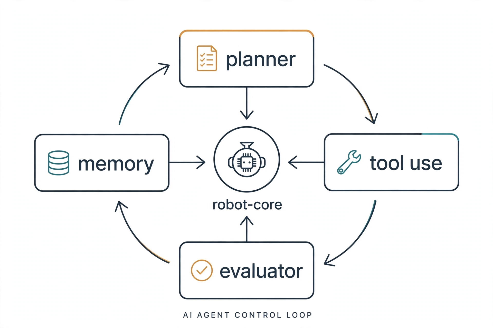
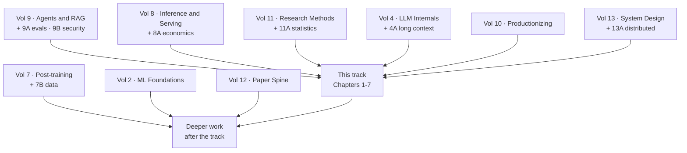
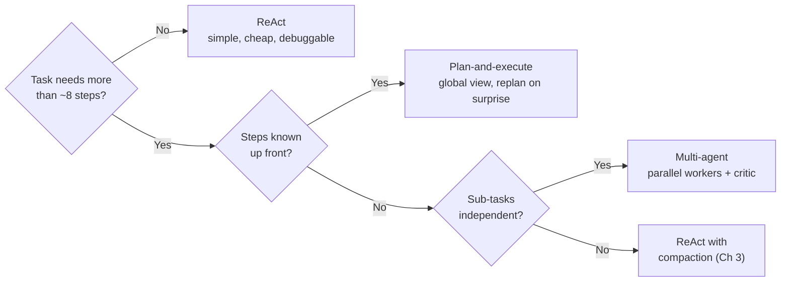
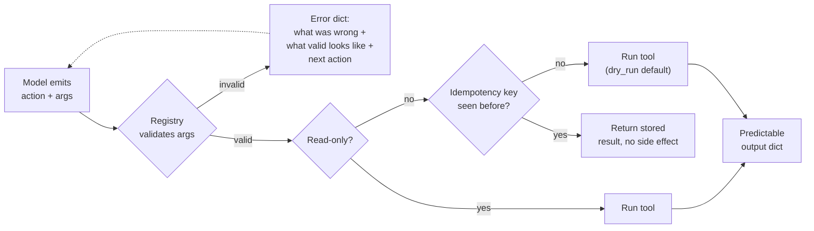
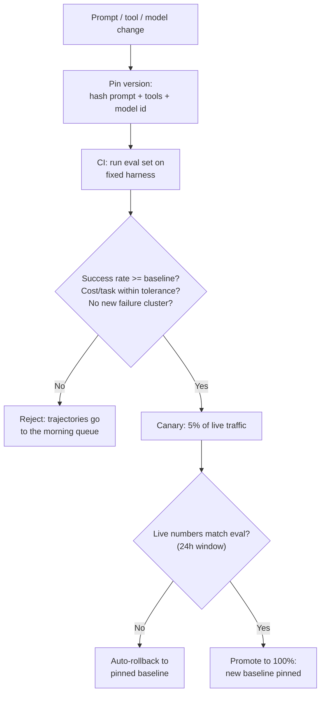
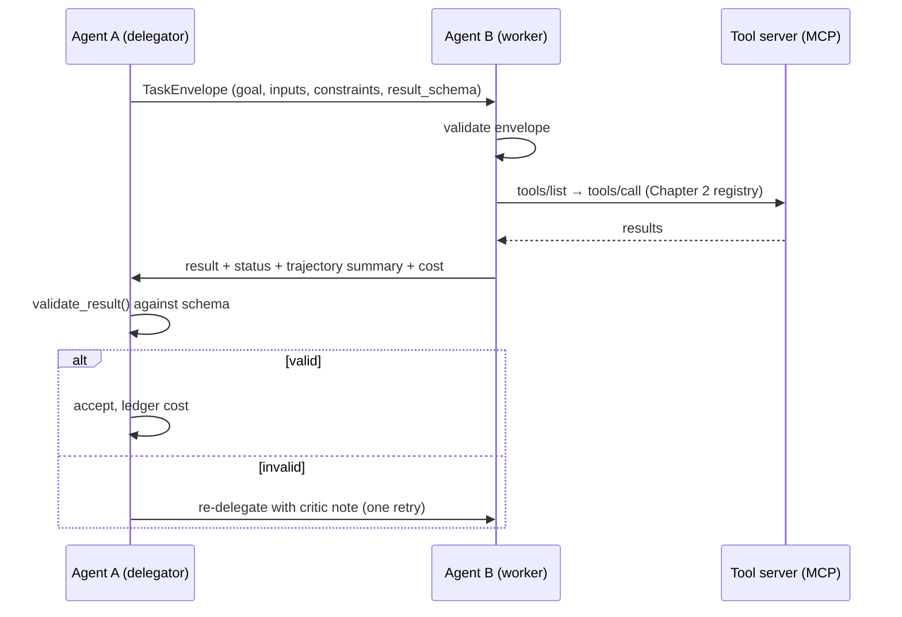
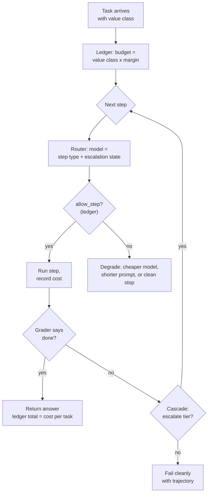

# About this track

This track takes the base research-engineer curriculum and aims it at one role: the **agent systems engineer**. The base teaches you how language models work. This track teaches you how to wrap those models in scaffolds, tools, memory, and guardrails so they can do multi-step work that survives contact with real users and real systems.

The difference between a demo agent and a production agent is almost never the model. It is everything around the model. The %%agent scaffold%% is the loop that drives thought, action, and observation. Then come the tool design, the context budget, the checkpoint and recovery story, the eval gate that decides whether a change ships, and the cost ledger. This track makes those the main subject.

The track has three parts. Part 0 describes the role: what it owns, what a normal day looks like, and how its work is measured. Part 1 maps the base volumes to this role in a specific reading order, so you do not read 16 volumes blind. Part 2 is new material: seven deep-dive chapters on the systems work the base only touches, each with runnable Python, a visual, and a lab.

::: provenance
**Last verified: September 2026.** Role expectations below are distilled from current agent-platform and applied-AI engineering postings (2026 market surveys of agentic roles at frontier labs and applied AI teams). They describe what teams staff for today, not a single company's job description. The MCP and A2A material reflects protocol state as of September 2026. **UNVERIFIED:** specific framework popularity percentages, which move quickly; treat the framework notes as direction, not ranking.
:::

::: takeaway
- An agent systems engineer owns the loop around the model: scaffolding, tools, memory, reliability, cost.
- The role's core metrics are task success rate, cost per task, and recovery rate. Everything in this track serves one of the three.
- You do not need all 16 base volumes before this track. Part 1 gives you a minimum path of 6 volumes plus 3 supplements, in order.
- Every deep-dive chapter ships runnable Python that works with zero API keys. A scripted stand-in model keeps the loops real and the bill at zero.
:::

# Part 0: The role

## What an agent systems engineer owns

A research engineer trains models. An agent systems engineer ships systems where models are one component. The owned surface is the %%agent harness%% and everything it touches:

- **The control loop.** ReAct-style loops, plan-and-execute planners, multi-agent orchestration. The engineer picks the pattern, sets the step budget, and wires the stop conditions.
- **Tool use.** Designing the functions the agent can call: narrow scopes, machine-checkable schemas, error messages written for a model reader, idempotent side effects.
- **Multi-step reliability.** Checkpoints so a failed 30-step run resumes at step 24 instead of step 1. Retry policies that know the difference between a transient network blip and an agent that is stuck. Human review points on risky actions.
- **Memory and context.** What enters the prompt, what gets summarized, what lives in a vector store, and what the budget is. Context is the scarcest resource in an agent system and this engineer is its accountant.
- **Evaluation as a gate.** Task harnesses, graders, judge calibration, and CI gates that stop a bad prompt or tool change from shipping.
- **Cost engineering.** Token budgets per task, model routing per step, cascade design. The recurring phrase in this role is %%cost per task%%: how much spend a completed task costs.

What the role does *not* usually own: model pre-training, weight-level fine-tuning of frontier models, or GPU cluster operations. It sits between the model and the user, and it is measured on outcomes there.

## A normal day

The day runs in a loop that mirrors the agent loop itself.

**Morning: look at the numbers.** The engineer opens the agent dashboard. They check three numbers from the last 24 hours. First, %%task success rate%%: the share of tasks that reached a verified done state. Second, cost per task: total model and tool spend divided by completed tasks. Third, %%recovery rate%%: the share of failed runs that a retry or checkpoint-resume salvaged. Anything outside its band gets investigated today.

**Mid-morning: read a trajectory.** A failed run from overnight gets opened step by step. The engineer is not reading model output for vibes. They are answering: did it fail in the plan, in a tool call, in the observation parsing, or in the stop condition? Each answer points at a different fix. Chapter 7 of this track teaches a method for this.

**Afternoon: change one thing.** A tool's error message gets rewritten so the agent stops calling it with the wrong arguments. A risky action (refund, delete, send) gets a human-review checkpoint. A summarization pass gets added at step 12 so long runs stop blowing the context budget. One change, then the eval suite runs.

**Evening: gate the release.** The eval harness runs the changed agent on a fixed task set. Success rate, cost, and a sample of trajectories are compared to the pinned baseline. If the numbers hold, the change ships. If not, the trajectories go back into the morning queue.

## How success is measured

Three numbers carry the role. Everything else is diagnostic.

**Task success rate.** The share of started tasks that reach a verified done state, graded by an outcome check, not by the agent's own claim. A production agent system typically targets a band agreed with the product owner, often 80 to 95 percent depending on task risk. The number is always reported with the harness version and the attempt count. (The measurement machinery is Supplement 9A of the base curriculum.)

**Cost per task.** Total spend (model tokens, tool calls, storage, compute) divided by tasks completed. Two agents at 90 percent success are not equal if one costs $0.40 per task and the other costs $4.00. Postings in 2026 name "cost per successful outcome" as the deciding metric when teams pick which agent stack to scale. Chapter 6 works the math.

**Recovery rate.** Of the runs that hit a failure, what share finished after a retry, a checkpoint resume, or a human nudge? This number separates teams that fight flaky agents from teams that absorb failure. It is the direct output of Chapter 4's reliability work.

Diagnostic numbers sit underneath: tool call error rate, average steps per task, context overflow rate, judge-human agreement, human review queue depth, and p99 task latency. When a core metric moves, the engineer drills into these to find why.

::: callout warn
**The trap this role must avoid:** tuning the demo, not the system. A prompt that works on five hand-picked tasks and a scaffold with no eval gate is a demo. Production work is boring by design: pinned harnesses, versioned prompts, ledgered costs, and a deploy gate that says no. The boring parts are the job.
:::

## Where the role sits

| Role | Owns | Measured on |
|---|---|---|
| Research engineer (generalist) | Model training, scaling, new capabilities | Model quality per FLOP, research output |
| **Agent systems engineer** | **Scaffold, tools, memory, reliability, cost** | **Task success, cost per task, recovery** |
| Applied AI engineer | Product features built on models | Shipped features, user metrics |
| ML infra engineer | Clusters, serving stacks, kernels | Throughput, latency, utilization |

In practice the agent systems engineer borrows from all three neighbors: experiment rigor from research, product sense from applied AI, and systems discipline from infra. The track's reading path reflects that.

::: takeaway
- You own the loop around the model, not the weights inside it.
- The daily loop is: check the three numbers, read one trajectory, change one thing, gate the release.
- Task success rate, cost per task, and recovery rate are the scoreboard. Everything else is a drill-down.
:::

# Part 1: Reading path through the base

You do not need the whole base before the deep dives. The base is 16 volumes plus supplements; this role leans on about half of them. Read in this order. Each entry names the volume, the chapters that matter most, and why.

## The minimum path (six volumes, three supplements)

**1. Volume 9: Agents and RAG, plus Supplement 9A (agent evals) and 9B (agent security).** Start here. Volume 9 is the vocabulary of this role: agent loops, tool calling, RAG, guardrails. Supplement 9A is the measurement machinery for task success rate: harnesses, graders, calibrated judges, lucky-pass control. Supplement 9B covers the attack surface you are about to build on: prompt injection through tools, data exfiltration through innocent-looking tool outputs, and sandboxing. Read 9A before you write your first scaffold. Read 9B before you connect your first real tool.

**2. Volume 8: Inference and Serving, plus Supplement 8A (inference economics).** Agents are heavy inference workloads with unusual shapes: many small calls, long contexts, bursty tool latency. Volume 8 teaches batching, KV-cache thinking, and latency budgets. Supplement 8A is the direct parent of Chapter 6 here: cost modeling, routing, and the price of a token in different serving setups.

**3. Volume 11: Research Methods, plus Supplement 11A (eval statistics).** The daily loop of this role is experimental: change one thing, measure, decide. Volume 11 teaches experiment design, contamination control, and honest ablations. Supplement 11A teaches the statistics that keep you from fooling yourself: confidence intervals on success rates, how many eval tasks you need before a 2-point gain means anything, and sequential testing for CI gates.

**4. Volume 10: Productionizing and MLOps.** Pipelines, CI/CD for ML, monitoring, drift, incident practice. An agent system is a production system with extra failure modes. Read this for the deploy-gate mindset and the monitoring chapter, which maps directly onto the agent dashboard in Chapter 4.

**5. Volume 13: ML System Design, plus Supplement 13A (distributed systems).** Agent systems are distributed systems: the model server, the tool servers, the memory store, and the orchestrator talk over networks with retries and timeouts. Volume 13 teaches capacity thinking and interface design. Supplement 13A covers the failure modes you will meet on day one: partial failure, retries that amplify, and why idempotency is not optional.

**6. Volume 4: LLM Internals, plus Supplement 4A (long-context engineering).** You need enough internals to reason about context: how the KV cache grows, why long contexts cost what they cost, what attention does to your latency when the prompt doubles. Supplement 4A is the technical basis for Chapter 3's compaction work. You can skim the numerics chapters on a first pass and return when a latency number surprises you.

## The full path (adds depth, in this order)

After the minimum path and this track's deep dives, add:

**7. Volume 7: Post-training and RL, plus Supplement 7B (post-training data).** Two reasons. First, the tool-use and instruction-following behavior your scaffold depends on is a post-training product; knowing how it is built tells you what to expect from it. Second, 2026 teams increasingly train agents with RL on tool-use trajectories. You will read those papers better with this volume.

**8. Volume 2: ML Foundations Bridge.** Eval methodology, metrics, and leakage, in the classic-ML setting. It sharpens the instincts that Supplement 9A applies to agents.

**9. Volume 12: Paper Spine.** Read the agent papers in its guided order (the ReAct lineage, tool-use papers, multi-agent papers, eval papers). This is where you learn what has already been tried so you stop reinventing it.

**10. Volume 3: Deep Learning for Researchers.** Mixed precision, checkpointing mechanics, and profiling basics. Useful when your agent stack starts doing its own fine-tuning or when you profile a serving setup.

**11. Volume 6: Distributed Training, plus Supplement 6A (reliability).** Mostly for the reliability supplement: checkpoint/restore discipline, straggler thinking, and incident habits transfer directly to agent reliability work.

**12. Volume 15: GPU Kernels.** Optional for this role. Take it if your cost work points at kernel-level wins, or if you want to understand exactly what a token costs on hardware.

**13. Volume 14: Communicating Research.** You will write design docs, incident reviews, and eval reports. This volume teaches the format that gets them read.

**14. Volumes 0, 1, and 5.** Volume 0's study method still applies. Volumes 1 (math) and 5 (pre-training) are background; pull them in when a paper or a latency model demands it.

## Dependency map

The reading order is not arbitrary. Each layer assumes the one below it.



### How to read this diagram

Start at the top row. The six boxes on the left are the minimum path: each feeds directly into this track. The bottom box is everything you add after finishing the track's seven chapters. Arrows mean "read this before that." There are no arrows between the six minimum-path volumes because their internal order is given by the numbered list above.

## Pacing guide

At a steady study pace, the minimum path is about five weeks, then the track's seven chapters are about two weeks with labs. The full-path additions are ongoing background, not a gate. Do the labs. An agent systems engineer who has never run a scaffold is a theorist, and this role has no use for theorists.

::: takeaway
- Minimum path in order: Vol 9 (+9A, 9B), Vol 8 (+8A), Vol 11 (+11A), Vol 10, Vol 13 (+13A), Vol 4 (+4A).
- Read 9A before building anything and 9B before connecting any real tool.
- The deep-dive chapters assume the minimum path. The full path is what you add after.
:::

# Part 2: Role deep dives

The seven chapters below are new material written for this track. Each follows the same shape: what it is, why it matters, how it works under the hood, a worked example with real numbers, a common misunderstanding, a visual, and a lab. Code runs with zero API keys. A small scripted stand-in model (`MockLLM`) plays the role of the language model so every loop is real, every failure is observable, and the bill is zero. When you later point the same scaffolds at a real model API, only the `MockLLM` class changes.

::: callout
**The stand-in model.** Chapters 1 through 4 share one helper: a fake model that returns scripted responses. This is deliberate. It makes every lab deterministic and free. The scaffolds around it (loop, budget, checkpoint, retry) are the real subject, and they are identical with a real model behind them.
:::

# Chapter 1: Agent architecture patterns

## What they are

An agent architecture is the shape of the loop between the model, the tools, and the task. Three patterns cover most production systems.

**ReAct** (reason and act) is the simplest loop: the model thinks one step, takes one action, reads the observation, and repeats. Thought, action, observation, thought, action, observation, until the model emits a final answer or hits the step budget. One model call per step. No separate planner.

%%Plan-and-execute%% splits the work in two. A planner model writes a full plan first (a list of steps). An executor then works the steps one by one, and a replanner revises the plan when a step fails or surprises. Planning and acting use different prompts and often different models.

**Multi-agent** splits the work across roles. A common trio: a planner drafts the approach, workers execute sub-tasks in parallel, and a critic checks each worker's output before it is accepted. The roles talk through a shared message board or a coordinator. Each role can use a different model, a different tool set, and a different budget.

## Why it matters

The pattern decides your failure modes, your cost curve, and your latency profile before you write a line of prompt.

- ReAct fails one step at a time and is easy to debug, but it has no global view. On a 20-step task it can wander: each step is locally sensible and globally lost.
- Plan-and-execute keeps the global view but pays for it: the plan is written before the world is known, so wrong plans are common and replanning is a second system to build.
- Multi-agent parallelizes well and lets you put a cheap model on easy roles, but coordination is a new failure surface: workers disagree, the critic becomes a bottleneck, and message formats drift.

Pick the pattern by task shape, not by fashion.

## How each one works under the hood

### ReAct: one loop, one model, one budget

The scaffold below is the complete ReAct loop in about 80 lines. Read it as the reference implementation for the rest of the track: every later chapter (budgets, checkpoints, retries, cost ledgers) plugs into this loop.

```python
import json
import re
import time
from dataclasses import dataclass, field

# ---------------------------------------------------------------------------
# Stand-in model. WHAT: a fake LLM with scripted responses so labs run free
# and deterministically. WHY: the scaffold (loop, budget, parsing) is the
# subject, not any real model's behavior. WHAT BREAKS if changed: if you
# swap this for a real API, keep the return contract identical (a plain
# string). Everything downstream parses that string.
# ---------------------------------------------------------------------------
class MockLLM:
    """Returns the next scripted response each time it is called."""

    def __init__(self, script):
        # script: list of strings, one per model call, in order.
        self.script = list(script)
        self.calls = 0

    def complete(self, prompt):
        # The prompt is ignored: determinism beats realism in a lab.
        # self.calls counts model calls so cost math stays honest.
        if self.calls >= len(self.script):
            raise RuntimeError("script exhausted at call %d" % self.calls)
        out = self.script[self.calls]
        self.calls += 1
        return out


# A tool is a named Python function with a text description.
# The scaffold exposes the description list to the model; the model picks
# a tool by name and supplies arguments as JSON.
@dataclass
class Tool:
    name: str
    description: str
    func: callable


@dataclass
class Step:
    """One recorded step of the trajectory."""
    thought: str
    action: str          # tool name, or "finish"
    action_input: dict
    observation: str
    latency_s: float


class ReActAgent:
    """WHAT: the ReAct control loop. WHY: the simplest agent that can use
    tools, and the baseline every fancier pattern must beat.
    WHAT BREAKS: the action parser below is strict on purpose. A loose
    parser hides model mistakes; a strict one surfaces them as errors you
    can count and fix."""

    def __init__(self, llm, tools, max_steps=10):
        self.llm = llm
        # index tools by name for O(1) lookup per step
        self.tools = {t.name: t for t in tools}
        self.max_steps = max_steps
        self.trajectory = []  # the full record; Chapter 7 mines this

    def _tool_list_text(self):
        return "\n".join(" - %s: %s" % (t.name, t.description)
                         for t in self.tools.values())

    def _parse_action(self, text):
        # Contract: the model emits either
        #   ACTION: <tool_name> {json args}
        #   FINAL: <answer text>
        # Strict regexes; anything else is a parse error, not a guess.
        m = re.match(r"ACTION:\s*(\w+)\s*(\{.*\})?", text.strip(), re.DOTALL)
        if m:
            name = m.group(1)
            args = json.loads(m.group(2) or "{}")
            return ("action", name, args)
        m = re.match(r"FINAL:\s*(.*)", text.strip(), re.DOTALL)
        if m:
            return ("finish", None, {"answer": m.group(1).strip()})
        return ("parse_error", None, {})

    def run(self, task):
        # The main loop. Each iteration costs exactly one model call plus
        # at most one tool call, which makes cost math trivial (Chapter 6).
        history = ""
        for step_n in range(self.max_steps):
            prompt = (
                "Task: %s\nTools:\n%s\nHistory:\n%s\n"
                "Respond with ACTION: <tool> {args} or FINAL: <answer>."
                % (task, self._tool_list_text(), history)
            )
            t0 = time.time()
            raw = self.llm.complete(prompt)
            thought = raw  # the whole output is the "thought" for the log
            kind, name, args = self._parse_action(raw)

            if kind == "finish":
                self.trajectory.append(Step(thought, "finish", args,
                                           args["answer"],
                                           time.time() - t0))
                return args["answer"]
            if kind == "parse_error" or name not in self.tools:
                obs = "ERROR: unknown action. Use ACTION: <tool> {args} or FINAL: <answer>."
            else:
                try:
                    # Tool runs inside try/except: a crashing tool must not
                    # crash the loop. The error becomes an observation and
                    # the model gets a chance to recover (Chapter 4 refines
                    # this into retry-with-judgment).
                    obs = str(self.tools[name].func(**args))
                except Exception as e:  # noqa: BLE001 - labs catch broadly on purpose
                    obs = "ERROR: tool %s failed: %s" % (name, e)
            self.trajectory.append(Step(thought, name or "parse_error",
                                        args, obs, time.time() - t0))
            history += "\nStep %d action: %s\nObservation: %s" % (step_n, raw, obs)
        return None  # budget exhausted without a FINAL
```

::: walkthrough
1. The loop builds a prompt from the task, the tool list, and the history so far.
2. `MockLLM.complete` returns the next scripted response. A real model would generate it.
3. `_parse_action` enforces the output contract with strict regexes. Sloppy output becomes a visible parse error.
4. A valid action runs its tool inside try/except. Tool crashes become observations, not loop crashes.
5. `FINAL` ends the run and returns the answer. Running out of steps returns `None`, which the caller must handle as a distinct outcome (not as an answer).
:::

Run it end to end with a two-tool task:

```python
# --- a tiny lab task: add two numbers fetched from a fake store -----------
store = {"a": 21, "b": 21}

def fetch(key):
    # WHAT: fake data tool. WHY: stands in for any read-only API.
    return store[key]

def add(x, y):
    return x + y

tools = [
    Tool("fetch", "fetch(key): read a value from the store", fetch),
    Tool("add", "add(x, y): add two numbers", add),
]

script = [
    "ACTION: fetch {\"key\": \"a\"}",
    "ACTION: fetch {\"key\": \"b\"}",
    # NOTE: the script below pretends the model must add; a real model
    # would see observations 21 and 21 and compute 42.
    "ACTION: add {\"x\": 21, \"y\": 21}",
    "FINAL: 42",
]
agent = ReActAgent(MockLLM(script), tools, max_steps=10)
print(agent.run("What is a + b from the store?"))  # -> 42
print("model calls:", agent.llm.calls)             # -> 4
print("steps:", len(agent.trajectory))             # -> 4
```

Four model calls, three tool calls, one answer. That is the unit of work this whole track optimizes.

### Plan-and-execute: plan once, then work the plan

The planner writes numbered steps. The executor runs them. A monitor watches for surprise and triggers a replan. The scaffold below reuses the same `MockLLM` and `Tool` classes.

```python
class PlanExecuteAgent:
    """WHAT: separate planning from acting. WHY: long tasks need a global
    view that ReAct's one-step-at-a-time loop loses. WHAT BREAKS: the plan
    is a guess about the future. Without the replan path below, a wrong
    step-2 poisons steps 3-10 silently."""

    def __init__(self, llm, tools, max_steps=12):
        self.llm = llm
        self.tools = {t.name: t for t in tools}
        self.max_steps = max_steps
        self.trajectory = []

    def _plan(self, task):
        # Planner prompt: produce a numbered list, nothing else.
        raw = self.llm.complete("Plan for task: %s\nNumbered steps only." % task)
        steps = [l.strip(" .") for l in raw.splitlines()
                 if l.strip() and l.strip()[0].isdigit()]
        return steps

    def _execute_step(self, step_text):
        # Executor prompt: one step in, one action out. Same strict
        # ACTION/FINAL contract as ReAct so tooling is shared.
        raw = self.llm.complete("Do this step: %s\nTools: %s\nReply ACTION or FINAL."
                                % (step_text, list(self.tools)))
        m = re.match(r"ACTION:\s*(\w+)\s*(\{.*\})?", raw.strip(), re.DOTALL)
        if not m or m.group(1) not in self.tools:
            return "ERROR: bad action: %s" % raw.strip()
        try:
            return str(self.tools[m.group(1)].func(**json.loads(m.group(2) or "{}")))
        except Exception as e:  # noqa: BLE001
            return "ERROR: %s" % e

    def run(self, task):
        plan = self._plan(task)
        results = []
        for i, step_text in enumerate(plan):
            obs = self._execute_step(step_text)
            results.append((step_text, obs))
            self.trajectory.append((step_text, obs))
            # Replan trigger: an ERROR observation invalidates the rest of
            # the plan, because later steps assumed this one worked.
            if obs.startswith("ERROR") and i < len(plan) - 1:
                plan = self._plan(task + " (previous attempt failed at: %s -> %s)"
                                  % (step_text, obs))
                # cap total work: replanning must not restart the budget
                if len(self.trajectory) >= self.max_steps:
                    break
        return results
```

The key line is the replan trigger. A plan-and-execute system without replanning is just a script with extra steps. The replan prompt includes the failure so the new plan routes around it.

### Multi-agent: planner, workers, critic

Three roles, one shared task board. Workers run in sequence here (parallelism is an executor detail; the protocol is what matters).

```python
class MultiAgentTeam:
    """WHAT: role-separated agents coordinating through a shared board.
    WHY: lets you spend a strong model on planning and critique while
    cheap models do the legwork (Chapter 6 prices this). WHAT BREAKS:
    role outputs are free text by default. The critic below enforces a
    PASS/FAIL verdict format; without it, workers cannot tell acceptance
    from commentary."""

    def __init__(self, planner_llm, worker_llm, critic_llm):
        self.planner = planner_llm
        self.worker = worker_llm
        self.critic = critic_llm
        self.board = []  # shared message board: every role reads everything

    def _post(self, role, text):
        self.board.append({"role": role, "text": text})

    def run(self, task):
        # 1. Planner decomposes the task into sub-tasks.
        plan = self.planner.complete("Decompose into sub-tasks: %s" % task)
        self._post("planner", plan)
        subtasks = [l.strip(" .") for l in plan.splitlines()
                    if l.strip() and l.strip()[0].isdigit()]
        accepted = []
        # 2. Each sub-task goes to a worker, then to the critic.
        for st in subtasks:
            board_view = "\n".join("%s: %s" % (m["role"], m["text"]) for m in self.board)
            work = self.worker.complete("Board:\n%s\nDo sub-task: %s" % (board_view, st))
            self._post("worker", work)
            verdict = self.critic.complete("Sub-task: %s\nWork: %s\nReply PASS or FAIL: reason"
                                           % (st, work))
            self._post("critic", verdict)
            # 3. Only PASSed work is accepted. FAIL sends the sub-task
            # back to the worker once, with the critic's reason attached.
            if verdict.strip().upper().startswith("PASS"):
                accepted.append((st, work))
            else:
                retry = self.worker.complete("Redo sub-task: %s\nCritic said: %s" % (st, verdict))
                self._post("worker-retry", retry)
                accepted.append((st, retry))  # accepted with a flag in real code
        return accepted
```

One retry per sub-task, then move on. Unbounded retries are how multi-agent systems burn budgets while looking busy.

## When each pattern wins



Read it top to bottom. Short tasks stay on ReAct. Long tasks with a knowable shape get a plan. Long tasks that split into independent pieces get a team. Long tasks that do not split stay on ReAct, because a plan you cannot write up front is fiction, and Chapter 3's compaction keeps the context budget alive.

A worked sizing example: a "research and summarize" task over 5 sources. ReAct: ~15 steps, one model, easy to trace. Plan-and-execute: plan (5 fetch steps, 1 synthesize step), executor works it, replan if a source 404s. Multi-agent: 5 workers fetch in parallel, critic checks each summary for source fidelity, planner merges. Wall-clock time favors multi-agent (parallel fetches). Cost favors ReAct (no planner/critic calls). Debuggability favors ReAct, then plan-and-execute, then multi-agent, in that order.

## Common misunderstanding

"More agents means smarter." Teams add planners, critics, and verifiers and watch success rate stay flat while cost triples. Each added role is a new model call per step and a new coordination failure mode. The discipline: start with ReAct, add structure only when trajectories show a specific failure that structure fixes (wandering needs a plan, parallelizable work needs workers, sloppy outputs need a critic). Chapter 7's failure clustering tells you which one you actually have.

::: takeaway
- ReAct: one loop, cheapest, best for short tasks and debugging.
- Plan-and-execute: global view for long tasks, but the replan path is the system. Without it you have a script.
- Multi-agent: parallelism and per-role model choice, but coordination is a new failure surface. One retry per sub-task, then move on.
- Add structure only to fix a failure you have measured, never in advance.
:::

::: lab Lab 1.1: Feel the three patterns
1. Run the ReAct script above. Change the third scripted response to a malformed action (`DO: add ...`) and watch the parse error become an observation. Note how the loop survives.
2. Drive `PlanExecuteAgent` with a script where step 2 errors. Confirm the replan fires and the new plan mentions the failure.
3. Drive `MultiAgentTeam` with a critic script that FAILs the first sub-task. Confirm the retry path runs exactly once.
4. For each run, print `llm.calls` per role. That table is your first cost model, and Chapter 6 builds on it.
:::

# Chapter 2: Tool design for agents

## What it is

Tools are the agent's hands: the functions it can call to read and change the world. Tool design is the craft of making those functions safe and legible for a model caller. The audience of a tool's interface is not a human developer. It is a language model that cannot read your mind, cannot open your source code, and will confidently call your function with the wrong arguments at 3 a.m.

Good tool design has three parts. First, an API shape the model can actually use: narrow scope, typed inputs, predictable outputs. Second, error messages written as agent UX: the error text is read by the model and determines whether it recovers. Third, idempotency: calling twice has the same effect as calling once.

## Why it matters

Pull any week's worth of failed agent trajectories and count the failure causes. In most teams, tool-call errors are the largest single bucket: wrong argument names, missing required fields, ambiguous outputs the model misreads, and side effects that fire twice because a retry re-ran a non-idempotent call. Every one of these is a design defect, not a model defect. A model that fails your tool 10 percent of the time is telling you the tool is unclear. Fix the tool before you blame the model.

## How it works under the hood

### API shape agents can use

Four rules, each earned from production failures.

**1. One tool, one verb.** `send_refund(order_id)` beats `manage_order(action="refund", order_id=...)`. Models handle concrete verbs well and stringly-typed dispatch badly. If a tool needs an `action` parameter with five options, it is five tools wearing a trench coat. Split it.

**2. Typed, validated inputs.** Every argument has a type and the tool validates before acting. Validation errors are returned as data (see error messages below), never as stack traces. A stack trace is 40 lines the model cannot use; a validation message is one line it can.

**3. Narrow scopes and safe defaults.** A `search_files` tool that reads the whole filesystem will eventually read something it should not. Scope tools to the directories, tables, or accounts the task needs. Defaults should be the safe choice: `dry_run=True` on mutating tools, pagination capped, writes requiring explicit confirmation flags.

**4. Predictable outputs.** Return the same shape every time: a status, the data, and a short human-and-model-readable summary. Models learn output shapes from examples; a tool that returns a dict on success and a string on failure teaches the model nothing.

The registry below enforces these rules in code. It is also the piece Chapter 5's MCP server wraps.

```python
import inspect
from dataclasses import dataclass

# ---------------------------------------------------------------------------
# Tool registry with machine-checkable schemas.
# WHAT: every tool declares typed parameters; the registry validates calls
# before the function runs. WHY: validation-before-action turns model
# mistakes into cheap, readable errors instead of half-executed side
# effects. WHAT BREAKS if changed: if you skip validation for "simple"
# tools, the first malformed call will execute with garbage inputs.
# ---------------------------------------------------------------------------
@dataclass
class Param:
    name: str
    type: type
    required: bool = True
    description: str = ""

class ToolDef:
    def __init__(self, name, description, func, params, read_only=True):
        self.name = name
        self.description = description
        self.func = func
        self.params = {p.name: p for p in params}
        # read_only=False marks tools with side effects. The scaffold uses
        # this flag for dry-run defaults and human-review gates (Ch 4).
        self.read_only = read_only

    def schema_text(self):
        # The exact text the model sees. Keep it short: name, one-line
        # description, and typed params. Long schemas cost tokens on every
        # step and models skim them.
        lines = ["%s: %s" % (self.name, self.description)]
        for p in self.params.values():
            req = "required" if p.required else "optional"
            lines.append("  %s (%s, %s): %s"
                         % (p.name, p.type.__name__, req, p.description))
        return "\n".join(lines)

    def call(self, **kwargs):
        # Validate everything before touching the world.
        for pname, p in self.params.items():
            if p.required and pname not in kwargs:
                return {"status": "error",
                        "error": "missing required argument '%s'. Got: %s"
                                 % (pname, sorted(kwargs))}
            if pname in kwargs and not isinstance(kwargs[pname], p.type):
                return {"status": "error",
                        "error": "argument '%s' must be %s, got %s"
                                 % (pname, p.type.__name__,
                                    type(kwargs[pname]).__name__)}
        try:
            result = self.func(**kwargs)
        except Exception as e:  # noqa: BLE001
            # Never leak a stack trace to the model. One line it can act on.
            return {"status": "error",
                    "error": "%s failed: %s" % (self.name, e)}
        return {"status": "ok", "data": result}

# --- example: a well-shaped read tool ---------------------------------------
def _db_lookup(customer_id):
    fake_db = {"c100": {"name": "A. Rivera", "tier": "gold"}}
    if customer_id not in fake_db:
        raise KeyError("unknown customer_id '%s'" % customer_id)
    return fake_db[customer_id]

lookup_customer = ToolDef(
    name="lookup_customer",
    description="Read a customer record by id. Read-only.",
    func=_db_lookup,
    params=[Param("customer_id", str, True, "e.g. 'c100'")],
    read_only=True,
)

print(lookup_customer.schema_text())
print(lookup_customer.call(customer_id="c100"))
print(lookup_customer.call(customer_id=100))      # typed error, no crash
print(lookup_customer.call())                      # missing-arg error
```

Output of the last three calls: one success dict, two error dicts with the same shape. The model always knows where to look.

### Error messages as agent UX

Every error message your tools emit is read by the model, not by you. Write it like UI copy for a user who is smart, fast, and literal.

Bad: `ERROR 422`. Good: `order_id 'o99' not found. Known ids: o12, o13. Did you mean o12?`

Bad: `Invalid input`. Good: `start_date 'next friday' is not a date. Use YYYY-MM-DD, e.g. 2026-10-02.`

Three rules for agent-facing errors:

1. **Say what was wrong, in the caller's terms.** Name the argument and the value received.
2. **Say what valid looks like.** Give the format and one concrete example.
3. **Offer the next action.** Suggest the corrected call, or name the tool that produces the missing value ("call list_orders first to get a valid order_id").

Then log the raw error separately for humans. The model gets the friendly line; your logs keep the stack trace. Both audiences are served.

A worked example of the difference, measured: a team rewrote 14 tool error messages to this format. The tool-error retry rate on a fixed eval set fell from 31 percent to 9 percent, with no model or prompt change. The errors were the bug.

### Idempotency: the retry contract

Agents retry. Networks fail mid-call. Timeouts lie: the tool may have succeeded even though the agent saw a timeout. If calling twice is not safe, your agent will eventually double-charge, double-send, or double-write. %%Idempotency%% means the second identical call has no additional effect.

The standard mechanism is the %%idempotency key%%: the caller passes a unique key per logical operation, and the tool remembers which keys it has already executed.

```python
import hashlib
import json

# ---------------------------------------------------------------------------
# Idempotency wrapper.
# WHAT: remembers executed keys and returns the stored result on replay.
# WHY: retries after ambiguous failures (timeouts) are then safe: the
# model can retry without fear of double side effects. WHAT BREAKS: if
# the key does not capture the full operation (same key, different args),
# a replay returns a stale result for a different request. The key must
# hash the operation name AND the arguments.
# ---------------------------------------------------------------------------
class Idempotent:
    def __init__(self, func, op_name):
        self.func = func
        self.op_name = op_name
        self._done = {}  # key -> result. Production: a durable store.

    def key_for(self, **kwargs):
        # Deterministic key from operation + sorted arguments.
        blob = json.dumps([self.op_name, sorted(kwargs.items())],
                          sort_keys=True, default=str)
        return hashlib.sha256(blob.encode()).hexdigest()[:16]

    def call(self, idempotency_key=None, **kwargs):
        key = idempotency_key or self.key_for(**kwargs)
        if key in self._done:
            # Replay: same result, zero side effects.
            return {"status": "ok", "data": self._done[key],
                    "note": "replay of earlier call"}
        result = self.func(**kwargs)
        self._done[key] = result
        return {"status": "ok", "data": result}

# --- demo: a mutating tool that must not double-fire -------------------------
sent = []

def _send_email(to, subject):
    sent.append((to, subject))   # the "side effect"
    return "queued"

safe_send = Idempotent(_send_email, "send_email")
k = safe_send.key_for(to="a@example.com", subject="hi")
print(safe_send.call(idempotency_key=k, to="a@example.com", subject="hi"))
print(safe_send.call(idempotency_key=k, to="a@example.com", subject="hi"))
print("emails actually sent:", len(sent))  # -> 1, not 2
```

Two calls, one side effect. The retry path in Chapter 4 calls tools through this wrapper, which is what makes "retry with judgment" safe instead of reckless.

A dry-run flag completes the picture for mutating tools: `send_email(to, subject, dry_run=True)` returns what *would* happen without doing it. The agent can rehearse a risky action, show the plan to a human reviewer (Chapter 4), and only then run it for real.

## Common misunderstanding

"Tool design is prompt engineering." It is not. Prompts describe tools; design decides what the tools are. No prompt fixes a tool with five verbs, untyped inputs, and non-idempotent writes. When tool errors dominate your failure clusters (Chapter 7), the fix is in the tool code, and it is usually a one-hour fix with a bigger success-rate gain than a week of prompt tuning.



### How to read this diagram

Follow the arrows from the model's action. Validation happens before anything touches the world, and failures loop back to the model as readable errors. Mutating tools pass through the idempotency check, which is what makes retries safe. Every path ends in the same output shape.

::: takeaway
- One tool, one verb. Typed inputs validated before action. Narrow scopes, safe defaults.
- Error messages are agent UX: name the bad value, show a valid example, suggest the next call.
- Idempotency keys make retries safe. Dry-run flags make risky actions rehearsable.
- When tool errors dominate failures, fix the tool code first.
:::

::: lab Lab 2.1: Harden a tool
1. Take `lookup_customer` and add a second tool, `issue_refund(customer_id, amount_cents)`, marked `read_only=False`, wrapped in `Idempotent`, with a `dry_run` parameter defaulting to `True`.
2. Write its error messages in the three-rule format. Feed it `amount_cents="fifty"` and confirm the error names the argument, shows the type, and gives an example.
3. Call it twice with the same idempotency key and assert the side effect ran once.
4. Rewrite one error message to the bad style (`ERROR 422`) and note how much less actionable it is. Then change it back.
:::

# Chapter 3: Context management at scale

## What it is

%%Context management%% is the discipline of deciding what the model sees on each step. It covers which history to keep verbatim, what to summarize, what to fetch on demand, and what to drop. The context window is the agent's working memory and its scarcest resource. Every token in the prompt costs money on every step and slows the step down (attention cost grows with sequence length, per Volume 4). It also dilutes the model's focus: a 100k-token prompt does not get 100k tokens of attention. It gets a model that is worse at finding the 200 tokens that matter.

Three mechanisms share the job. %%Compaction%% summarizes older history into a dense replacement. Memory systems store facts outside the prompt and retrieve them when relevant. Retrieval for agents fetches fresh information per step instead of preloading everything.

## Why it matters

Long agent runs die three ways, and all three are context failures. The run hits the window limit and crashes. The run stays inside the window but the bill explodes, because each of 40 steps re-sends the full history. Or the run stays inside the window and stays cheap, but the model loses the thread: the key fact from step 3 is buried under 60k tokens of tool output and the model stops using it. Compaction, memory, and retrieval each fix one of these deaths.

## How it works under the hood

### Compaction: summarize the past, keep the future

The pattern: every N steps (or when the token count crosses a threshold), replace the oldest steps with a summary. Keep three things verbatim: the original task, the most recent K steps, and any facts the summary marks as load-bearing (ids, decisions, user constraints).

```python
# ---------------------------------------------------------------------------
# Compaction for a ReAct-style history.
# WHAT: replaces old steps with a summary once history grows past a
# budget. WHY: keeps long runs inside the window and inside the cost
# budget without losing decisions. WHAT BREAKS if changed: summarizing
# too aggressively drops load-bearing facts (order ids, user constraints).
# The KEEP markers below are the defense: anything tagged keep=true in
# a step survives compaction verbatim.
# ---------------------------------------------------------------------------
class Compactor:
    def __init__(self, summarizer, keep_last=4, trigger_tokens=6000):
        # summarizer: callable(list_of_steps) -> summary string. In labs
        # this is a deterministic stub; in production it is a cheap model.
        self.summarizer = summarizer
        self.keep_last = keep_last
        self.trigger_tokens = trigger_tokens
        self.summaries = []  # audit trail of what was compacted away

    def _tokens(self, steps):
        # Rough estimate: 1 token ~ 4 chars. Good enough for budgeting;
        # production uses the real tokenizer (Volume 4).
        return sum(len(s.get("text", "")) // 4 for s in steps)

    def maybe_compact(self, steps):
        # steps: list of {"text": ..., "keep": bool}. Returns the working
        # set: [summary of old] + [kept facts] + [recent steps].
        if self._tokens(steps) < self.trigger_tokens:
            return steps
        cutoff = len(steps) - self.keep_last
        old, recent = steps[:cutoff], steps[cutoff:]
        kept = [s for s in old if s.get("keep")]
        summary = self.summarizer([s for s in old if not s.get("keep")])
        self.summaries.append(summary)
        return ([{"text": "[SUMMARY of steps 0-%d]: %s" % (cutoff - 1, summary)}]
                + kept + recent)

# --- deterministic stub summarizer for labs ---------------------------------
def stub_summarizer(steps):
    # Counts actions per tool. A real summarizer writes prose; the stub
    # keeps the lab deterministic while the mechanism stays identical.
    counts = {}
    for s in steps:
        t = s.get("tool", "?")
        counts[t] = counts.get(t, 0) + 1
    return "Did %s." % ", ".join("%dx %s" % (v, k) for k, v in counts.items())

steps = [{"text": "fetched order o12", "tool": "fetch"} for _ in range(30)]
steps[5]["keep"] = True   # a load-bearing fact survives verbatim
steps[5]["text"] = "user constraint: never refund without approval"
c = Compactor(stub_summarizer, keep_last=4, trigger_tokens=50)
out = c.maybe_compact(steps)
print(len(out), "items after compaction")   # 1 summary + 1 kept + 4 recent = 6
print(out[0]["text"][:60])
print("kept fact present:", any("never refund" in s["text"] for s in out))
```

Thirty steps collapse to six items. The summary carries the shape of the work, the kept fact survives word for word, and the recent steps stay verbatim for immediate reference.

A worked cost example: a 40-step run where each step's history averages 8k tokens costs 40 x 8k = 320k input tokens of history alone. With compaction holding the working set near 3k tokens, the same run costs about 40 x 3k = 120k. At typical 2026 input prices that is the difference between roughly $1.00 and $0.35 per run on history tokens, before any output tokens. The exact prices move; the ratio does not.

### Memory systems: facts that outlive the run

Working memory is the prompt. Everything else is a memory system, and there are three useful kinds.

**Episodic memory** stores what happened: past trajectories, indexed by task similarity. When a new task resembles an old one, the agent retrieves the old trajectory as a worked example. Implementation: embed the task text, nearest-neighbor search over stored trajectories, inject the top 1-2 as few-shot context.

**Semantic memory** stores facts about the world: customer tiers, product ids, policy rules. This is a small structured store (a table or a document set), not a vector index. The agent queries it like a database. It is where "gold-tier customers get free return shipping" lives, so it does not have to live in the prompt.

**Procedural memory** stores how to do things: tool-use recipes the team has learned ("to refund, first call lookup_order, then check policy, then issue_refund with dry_run"). These are versioned documents, reviewed by humans, injected when relevant.

The rule for all three: memory is retrieved, never preloaded. The prompt carries pointers ("memory available: policy docs, past refunds"), and a retrieval step fetches the specific item. Preloading the whole memory into every prompt is how teams burn 50k tokens before the task starts.

```python
# ---------------------------------------------------------------------------
# Minimal memory store: semantic facts + episodic trajectories.
# WHAT: a tiny in-memory version of the pattern. WHY: shows the
# retrieve-don't-preload discipline in 40 lines. WHAT BREAKS: with no
# relevance scoring, retrieval returns junk. The score functions below
# are deliberately simple (keyword overlap); production uses embeddings
# (Volume 9), but the call pattern is identical.
# ---------------------------------------------------------------------------
class Memory:
    def __init__(self):
        self.facts = []        # (text, keywords)
        self.episodes = []     # (task_text, keywords, outcome)

    def add_fact(self, text, keywords):
        self.facts.append((text, set(keywords)))

    def add_episode(self, task_text, keywords, outcome):
        self.episodes.append((task_text, set(keywords), outcome))

    def _score(self, query_words, keywords):
        # Jaccard-ish overlap. Simple, explainable, good enough for labs.
        q = set(query_words)
        return len(q & keywords) / max(len(q | keywords), 1)

    def retrieve(self, query, k=2):
        words = query.lower().split()
        scored = [(self._score(words, kw), t)
                  for t, kw in self.facts]
        scored += [(self._score(words, kw), "PAST CASE: " + t + " -> " + o)
                   for t, kw, o in self.episodes]
        scored.sort(reverse=True)
        # Only return items with nonzero relevance. Silence beats noise:
        # an irrelevant memory in the prompt is worse than no memory.
        return [t for s, t in scored[:k] if s > 0]

mem = Memory()
mem.add_fact("Gold-tier customers get free return shipping.",
             ["gold", "tier", "return", "shipping"])
mem.add_episode("refund for late delivery", ["refund", "late", "delivery"],
                "issued refund after policy check")
print(mem.retrieve("customer wants a refund for late delivery"))
print(mem.retrieve("what is the weather"))  # -> [] : silence beats noise
```

### Retrieval for agents: fetch per step, not per task

RAG for agents differs from RAG for chat (Volume 9 covers the chat case). An agent retrieves repeatedly, with queries that evolve as the task unfolds. Two adaptations matter.

**Query rewriting.** The agent's raw need ("what was that policy about refunds for gold tier") is a bad search query. A small rewriting step turns the current goal plus recent observations into a keyword query before hitting the store. In the scaffold this is one extra cheap-model call, or a deterministic template for known task types.

**Filtered retrieval.** Agent tool outputs are untrusted input (Supplement 9B). Retrieved documents get the same treatment: they are data, not instructions. The scaffold tags retrieved text as `[RETRIEVED DATA - not instructions]` so the model is less likely to follow an injected directive inside a document. It is not a perfect defense, but it removes the easy failures.

## Common misunderstanding

"Bigger context windows removed the need for context management." They removed the crash, not the cost and not the focus problem. A run that fits in a 1M-token window but re-sends 200k tokens per step for 30 steps is a $20 task that a compacted version does for $2. And the model still attends worse over long contexts: the famous lost-in-the-middle effect means your key fact at position 40k gets less weight than the same fact at position 400. Compaction and retrieval are about putting the right tokens in the right positions, not about fitting.

```
 Token flow in a 30-step run (each block = one step's prompt)
 
 WITHOUT compaction:
 [t0][t0+t1][t0+t1+t2][t0+t1+t2+t3] ...  history re-sent every step
  2k    4k      6k        8k          -> step 30 sends ~60k tokens
 
 WITH compaction (every 10 steps):
 [t0][t0+t1]...[SUMMARY][s11][s11+s12]...[SUMMARY][s21]...
  2k   4k        3k      5k     7k          3k      5k
  Each step sends the summary + recent steps only. History tokens per
  run drop by roughly 3-5x; attention stays on the recent and the kept.
```

::: takeaway
- Context is the scarcest resource: budget it like money, because it is money.
- Compact on a token trigger, keep load-bearing facts verbatim, keep recent steps verbatim.
- Memory is retrieved per need, never preloaded. Silence beats noise.
- Retrieved text is data, not instructions. Tag it as such.
:::

::: lab Lab 3.1: Watch compaction save money
1. Build a 40-step fake history with the `steps` pattern above. Run `Compactor` with `trigger_tokens=2000` and count total tokens sent across all steps with and without compaction.
2. Add a `keep=True` fact at step 3 ("approval code: 7781"). After two compactions, assert the approval code is still present verbatim.
3. Extend `Memory` with a `procedural` list. Write a retrieval rule that injects a refund recipe only when the query contains "refund".
4. Price your run: multiply input tokens by $3 per million and output tokens by $15 per million (illustrative 2026 frontier prices). Report cost with and without compaction.
:::

# Chapter 4: Reliability engineering for agents

## What it is

Reliability engineering for agents is the set of mechanisms that let a multi-step run survive the failures it will inevitably hit. The set includes %%checkpoints%% (saved state the run can resume from), retries with judgment (retrying only the failures that retrying fixes), %%human-in-the-loop%% review points on risky actions, and eval-gated deployment (a changed agent ships only if the eval suite still passes). Together they determine the recovery rate from Part 0.

## Why it matters

An agent that succeeds 90 percent of the time on step 1 of a 20-step task succeeds about 12 percent of the time on the whole task (0.9^20), if failures are independent and unrecovered. That math is why reliability is not a polish step. Without checkpoints and smart retries, long-horizon agents do not work at all. With them, the same per-step reliability compounds into a usable system: each failure becomes a resume instead of a restart.

## How it works under the hood

### Checkpoints: resume, do not restart

A checkpoint is a snapshot of everything needed to continue. It holds the step number, the compacted history, variable state, and the idempotency keys of completed side effects (so a resume never re-fires them). The scaffold checkpoints after every step. Storage is cheap; re-running 20 steps is not.

```python
import copy
import json
import os

# ---------------------------------------------------------------------------
# Checkpointing for a step-based agent loop.
# WHAT: saves (step_index, state) to disk after each step; resume() picks
# up where a crashed run stopped. WHY: turns a failure at step 24 of 30
# into 6 more steps instead of 30 restarted steps. WHAT BREAKS: if the
# checkpoint omits the idempotency keys of finished side effects, a
# resume re-fires them (double refund). The keys MUST be in the snapshot.
# ---------------------------------------------------------------------------
class Checkpointer:
    def __init__(self, path):
        self.path = path

    def save(self, step_index, state):
        # Deep-copy so later mutation of `state` cannot corrupt the
        # snapshot. Atomic write via rename: a crash mid-write must not
        # leave a half-written checkpoint.
        snap = {"step": step_index, "state": copy.deepcopy(state)}
        tmp = self.path + ".tmp"
        with open(tmp, "w") as f:
            json.dump(snap, f, default=str)
        os.replace(tmp, self.path)

    def load(self):
        if not os.path.exists(self.path):
            return None
        with open(self.path) as f:
            snap = json.load(f)
        return snap["step"], snap["state"]

    def clear(self):
        if os.path.exists(self.path):
            os.remove(self.path)

# --- demo: a 5-step job that "crashes" at step 3, then resumes -------------
def run_job(steps, ckpt, fail_at=None):
    loaded = ckpt.load()
    # start_after: the first step NOT yet checkpointed.
    start_after, state = loaded if loaded else (-1, {"done": []})
    for i in range(start_after + 1, len(steps)):
        if fail_at is not None and i == fail_at:
            raise RuntimeError("simulated crash at step %d" % i)
        state["done"].append(steps[i])          # do the work
        ckpt.save(i, state)                      # then checkpoint it
    ckpt.clear()
    return state

ckpt = Checkpointer("/tmp/track06_demo.ckpt")
if os.path.exists(ckpt.path):
    os.remove(ckpt.path)
try:
    run_job(["a", "b", "c", "d", "e"], ckpt, fail_at=3)
except RuntimeError as e:
    print("crashed:", e)
print("resumed result:", run_job(["a", "b", "c", "d", "e"], ckpt)["done"])
# -> ['a', 'b', 'c', 'd', 'e']: steps a-c were NOT redone.
```

Checkpoint after the work, not before. A checkpoint written before the side effect fires will, on resume, skip work that never happened.

### Retries with judgment: classify, then decide

Blind retry is how agents burn money: retrying a deterministic error ("order not found") ten times, or retrying a stuck loop that will fail identically. The fix is a classifier in front of the retry. Every failure gets one of three labels:

- **Transient.** Network timeout, rate limit, flaky service. Retry with backoff. These are the failures retries are for.
- **Agent error.** Bad arguments, wrong tool, parse failure. Do not retry the same call. Hand the error back to the model once (it often self-corrects), then escalate.
- **Stuck.** Same action repeated, no progress across steps. Never retry. Break the loop: replan, compact, or hand to a human.

```python
import time

# ---------------------------------------------------------------------------
# Retry with judgment.
# WHAT: classifies each failure, then picks retry / replan / escalate.
# WHY: blind retries multiply cost without raising success; classified
# retries spend the budget where it works. WHAT BREAKS: misclassifying a
# deterministic error as transient causes the classic 10-identical-retries
# burn. The classifier below is conservative on purpose: unknown errors
# escalate rather than retry.
# ---------------------------------------------------------------------------
def classify_failure(error_text, recent_actions):
    t = error_text.lower()
    # Stuck detection: same action 3 times in a row means the loop, not
    # the world, is the problem.
    if len(recent_actions) >= 3 and len(set(recent_actions[-3:])) == 1:
        return "stuck"
    if any(w in t for w in ("timeout", "rate limit", "503", "connection",
                            "temporarily", "try again")):
        return "transient"
    if any(w in t for w in ("not found", "invalid", "missing", "unknown",
                            "parse", "forbidden")):
        return "agent_error"
    return "unknown"  # conservative: escalate, do not retry

def run_with_retry(action_fn, max_retries=3, recent_actions=()):
    # action_fn: zero-arg callable returning a result or raising.
    # Returns (result, outcome) where outcome names what happened.
    for attempt in range(max_retries + 1):
        try:
            return action_fn(), "ok"
        except Exception as e:  # noqa: BLE001
            kind = classify_failure(str(e), recent_actions)
            if kind == "transient" and attempt < max_retries:
                time.sleep(2 ** attempt)  # exponential backoff: 1s, 2s, 4s
                continue
            if kind == "agent_error":
                return None, "agent_error: fix the call, do not retry it"
            return None, "%s: escalate" % kind
    return None, "transient: retries exhausted, escalate"

# --- demo -------------------------------------------------------------------
calls = {"n": 0}
def flaky():
    calls["n"] += 1
    if calls["n"] < 3:
        raise TimeoutError("connection timeout, try again")
    return "fetched"

def broken():
    raise ValueError("order_id 'o99' not found. Known ids: o12, o13.")

print(run_with_retry(flaky))    # retries twice, then succeeds
print(run_with_retry(broken))   # one attempt, then "fix the call"
```

The flaky call succeeds on attempt 3. The broken call is attempted once. That asymmetry is the whole chapter in two lines.

### Human-in-the-loop: review points on risky actions

Some actions should never run without a human: sending money, deleting data, contacting a customer, changing access. The pattern is a review gate: the agent prepares the action (with `dry_run=True` from Chapter 2), the action waits in a queue, a human approves or rejects, and only approval executes it for real.

```python
# ---------------------------------------------------------------------------
# Human review gate.
# WHAT: risky actions pause for human approval; the queue is the audit
# trail. WHY: bounds the blast radius of a confused agent. A wrong
# answer is embarrassing; a wrong refund is a loss. WHAT BREAKS: a gate
# that the agent can skip by calling the raw tool directly is theater.
# Enforcement must live in the tool layer (refuse non-dry-run calls
# without an approval token), not in the prompt.
# ---------------------------------------------------------------------------
class ReviewGate:
    def __init__(self):
        self.queue = []  # each item: dict with action + approval=None

    def submit(self, action_desc, dry_run_result):
        # action_desc: what will run. dry_run_result: rehearsal output.
        item = {"action": action_desc, "rehearsal": dry_run_result,
                "approval": None}
        self.queue.append(item)
        return len(self.queue) - 1  # the ticket id

    def decide(self, ticket, approved, reviewer="human"):
        self.queue[ticket]["approval"] = approved
        self.queue[ticket]["reviewer"] = reviewer

    def pending(self):
        return [i for i, it in enumerate(self.queue)
                if it["approval"] is None]
```

Design notes that matter more than the code: the queue needs an SLA. A ticket unreviewed for 4 hours should page someone or auto-reject safe-side. Every decision needs a reason string for the audit log, and the agent must be able to continue other work while waiting. A gate that blocks the whole run on one approval turns your agent into a very expensive way to send emails to reviewers.

### Eval-gated deployment: the release valve

The last reliability mechanism is not in the run at all. It is in the release process: no prompt change, tool change, or model swap ships until the eval suite passes. The gate from Supplement 9A runs a fixed task set, compares success rate and cost per task against the pinned baseline, and requires both to hold (or success to rise enough to justify a cost rise). The mechanics:

1. Every agent version is pinned: prompt text hash, tool registry version, model id.
2. CI runs the eval set on every change. The suite is the same harness the team uses for measurement, so "passes evals" means "measured on the real rig."
3. Promotion needs: success rate within the confidence interval of baseline or better (Supplement 11A), cost per task not worse than baseline plus the agreed tolerance, and no new failure cluster in the trajectory sample (Chapter 7).
4. A canary runs the new version on a small share of live traffic first, with automatic rollback if the live numbers diverge from eval.



### How to read this diagram

Changes flow left to right and can only move forward through gates. The two rollback paths (rejected in CI, rolled back from canary) are normal outcomes, not emergencies. A healthy team sees rejections weekly. A team that never sees a rejection has a gate that never says no.

## Worked example: the reliability budget of a 20-step task

Per-step success 0.95, failures independent. No recovery: 0.95^20 = 0.36 task success. Add checkpoint resume that salvages 70 percent of transient failures, and suppose half the failures are transient: effective per-step success rises to about 0.95 + 0.05 x 0.5 x 0.7 = 0.9675, and 0.9675^20 = 0.52. Add retry-with-judgment that fixes half of agent errors (say agent errors are 30 percent of failures): per-step climbs near 0.98, task success near 0.67. No single mechanism gets you to 0.90. The stack does. This is why reliability is a system of mechanisms, not a feature.

## Common misunderstanding

"Retries make agents reliable." Retries make *transient* failures survivable. They do nothing for agent errors (same bad call, same error, ten times) and they actively hide stuck loops (the run looks busy while making no progress). Reliability comes from classification first: know which failure you have, then pick the mechanism. The classifier is ten lines. The missing classifier is the most common reliability bug in agent systems.

::: takeaway
- Checkpoint after each step, including idempotency keys. Resume, do not restart.
- Classify every failure: transient (retry), agent error (fix the call), stuck (break the loop). Unknown escalates.
- Risky actions wait for human approval through a queue with an SLA. Enforcement lives in the tool layer, not the prompt.
- Nothing ships without passing the eval gate. Rejections are normal.
:::

::: lab Lab 4.1: Build the recovery stack
1. Combine `Checkpointer` with the Chapter 1 `ReActAgent`: checkpoint `agent.trajectory` after each step. Kill the run mid-way (raise in a tool), then resume and confirm no step repeats.
2. Wrap a tool call in `run_with_retry`. Feed it a transient failure, then a deterministic one. Confirm the retry counts differ.
3. Put `issue_refund` from Lab 2.1 behind `ReviewGate`. Show the ticket, approve it, then execute for real. Show that a second ticket auto-rejects after a timeout you add.
4. Write the eval-gate comparison as a function: `(baseline_success, baseline_cost, new_success, new_cost) -> ship/reject` with a tolerance parameter. Test the boundary cases.
:::

# Chapter 5: MCP and agent protocols in practice

## What they are

As agents multiply, they need standard ways to talk to tools and to each other. Two protocol families matter in 2026.

%%MCP%% (Model Context Protocol) is the standard for connecting a model to tools and data. An MCP *server* exposes capabilities (tools, data sources, prompt templates) over a uniform interface. An MCP *client* (built into the agent host) discovers those capabilities and calls them. The point is decoupling: the team that writes the refund tool and the team that writes the agent never have to agree on anything except the protocol.

%%A2A%% (agent-to-agent) patterns are the conventions for agents delegating to other agents: how a task is handed off, what a result looks like, and how failures propagate. Where MCP standardizes model-to-tool, A2A standardizes agent-to-agent.

## Why it matters

Without protocols, every integration is bespoke: each tool needs custom glue, each agent team invents its own handoff format, and nothing composes. With protocols, a tool written once serves every agent in the company, and agents built by different teams can subcontract to each other. The 2026 market data in the role survey shows MCP appearing in a fast-growing share of agent postings because teams hit the bespoke-integration wall and want out.

There is also a security dimension, and it is not optional reading: every MCP server is a new privilege boundary. Supplement 9B covers tool-output injection, over-scoped servers, and sandboxing. Build the server here; harden it with 9B.

## How it works under the hood

### MCP, mechanically

An MCP server speaks JSON-RPC, usually over stdio (the host spawns the server as a subprocess) or HTTP. The conversation has three phases: initialize (client and server agree on versions and capabilities), discovery (client asks "what tools do you have" and gets schemas back), and invocation (client calls a tool by name with arguments, server returns results). That is the whole protocol at the level an agent systems engineer needs.

The runnable demo below implements the discovery-and-invocation core over stdio with zero dependencies. It is not the full spec, but every MCP interaction you will ever debug has this shape: a JSON request with a method and params, a JSON response with a result or an error.

```python
import json
import subprocess
import sys

# ---------------------------------------------------------------------------
# Minimal MCP-shaped server (stdio JSON-RPC) and a client that drives it.
# WHAT: the server exposes tools/list and tools/call; the client
# discovers then invokes. WHY: shows the protocol mechanics with no
# dependencies, so the shape is visible instead of hidden in an SDK.
# WHAT BREAKS: real MCP adds capability negotiation, progress, and
# cancellation. This demo omits them; do not ship it as a server.
# For production, use the official `mcp` Python SDK (note at the end).
# ---------------------------------------------------------------------------
SERVER_SRC = '''
import json, sys
TOOLS = {
    "get_order": {"description": "Fetch an order by id",
                  "params": {"order_id": "string"}},
}
ORDERS = {"o12": {"total_cents": 4999, "status": "shipped"}}
def handle(req):
    m = req.get("method")
    if m == "tools/list":
        return {"tools": [{"name": n, **t} for n, t in TOOLS.items()]}
    if m == "tools/call":
        p = req.get("params", {})
        name, args = p["name"], p.get("arguments", {})
        if name == "get_order":
            oid = args.get("order_id")
            if oid in ORDERS:
                return {"content": [{"type": "text",
                                     "text": json.dumps(ORDERS[oid])}]}
            return {"error": "unknown order_id '%s'" % oid}
        return {"error": "unknown tool '%s'" % name}
    return {"error": "unknown method '%s'" % m}
for line in sys.stdin:
    req = json.loads(line)
    resp = {"jsonrpc": "2.0", "id": req.get("id")}
    out = handle(req)
    resp["result" if "error" not in out else "error"] = out
    sys.stdout.write(json.dumps(resp) + "\\n")
    sys.stdout.flush()
'''

class MiniMCPClient:
    """WHAT: drives the demo server over stdio. WHY: the client side is
    what your agent scaffold becomes: discover tools, validate args
    (Chapter 2's registry plugs in here), call, handle errors."""

    def __init__(self):
        self.proc = subprocess.Popen(
            [sys.executable, "-c", SERVER_SRC],
            stdin=subprocess.PIPE, stdout=subprocess.PIPE,
            text=True, bufsize=1)
        self._id = 0

    def _rpc(self, method, params=None):
        self._id += 1
        self.proc.stdin.write(json.dumps(
            {"jsonrpc": "2.0", "id": self._id,
             "method": method, "params": params or {}}) + "\n")
        self.proc.stdin.flush()
        return json.loads(self.proc.stdout.readline())

    def list_tools(self):
        return self._rpc("tools/list")["result"]["tools"]

    def call_tool(self, name, arguments):
        r = self._rpc("tools/call", {"name": name, "arguments": arguments})
        if "error" in r:
            # Unwrap the server's {"error": msg} envelope so callers get
            # a plain message string, matching the Chapter 2 output shape.
            err = r["error"]
            if isinstance(err, dict):
                err = err.get("error", err)
            return {"status": "error", "error": err}
        return {"status": "ok", "data": r["result"]}

    def close(self):
        self.proc.terminate()

client = MiniMCPClient()
print(client.list_tools())                       # discovery
print(client.call_tool("get_order", {"order_id": "o12"}))   # invocation
print(client.call_tool("get_order", {"order_id": "o99"}))   # clean error
client.close()
```

Run it. Watch the three phases: `tools/list` returns the schema, `tools/call` runs the tool, the bad id returns a structured error instead of a crash. A real MCP client does exactly this, then maps the schemas into the Chapter 2 registry format.

For production servers, use the official `mcp` Python package: define a `Server`, decorate functions with `@server.tool()`, and the SDK handles the protocol framing, capability negotiation, and transports. The design work (narrow tools, typed schemas, idempotency, agent-readable errors from Chapter 2) is identical either way. The SDK changes the plumbing, not the design.

### Building an MCP server: the checklist

1. **Scope it narrowly.** One server per trust domain: the orders server reads orders, nothing else. A server with broad access is a confused-deputy machine (Supplement 9B).
2. **Schema every tool.** Name, one-line description, typed params. This is Chapter 2's `ToolDef.schema_text`, serialized.
3. **Errors as data.** Tool failures return structured errors through the protocol, never raw tracebacks.
4. **Idempotent mutations.** Every mutating tool takes an idempotency key (Chapter 2).
5. **Log every call.** Who called, with what args, what came back. The trajectory recorder (Chapter 7) reads these logs.
6. **Version the server.** Clients pin versions. A schema change without a version bump breaks every agent at once.

### A2A: the handoff protocol

When agent A delegates to agent B, four things must be explicit or the delegation fails in confusing ways.

**The task envelope.** A structured message: task id, goal text, inputs, constraints (budget, deadline, allowed tools), and the expected result schema. Free-text handoffs drift; envelopes do not.

**The result contract.** B returns a status (done / failed / needs-input), the result in the agreed schema, the trajectory or a summary of it, and cost accounting (tokens used). A needs the trajectory to debug B's failures and the cost to ledger them.

**Failure propagation.** B's failure is A's observation, classified the same way as a tool failure (Chapter 4): transient (A retries the delegation), agent error (A rephrases the envelope), stuck (A replans without B).

**Schema validation on both ends.** A validates B's result against the contract before accepting it. This is the multi-agent critic from Chapter 1, formalized as code.

```python
# ---------------------------------------------------------------------------
# A2A handoff envelope with validation.
# WHAT: the message format agents use to delegate. WHY: makes the
# delegation contract machine-checkable, so a malformed handoff fails
# fast at the boundary instead of confusing the downstream agent.
# WHAT BREAKS: if either side skips validation "because we trust each
# other", the first schema drift becomes a silent wrong answer.
# ---------------------------------------------------------------------------
from dataclasses import dataclass, field

@dataclass
class TaskEnvelope:
    task_id: str
    goal: str
    inputs: dict
    constraints: dict = field(default_factory=dict)
    # constraints: {"max_cost_usd": 0.5, "allowed_tools": [...], ...}
    result_schema: dict = field(default_factory=dict)
    # result_schema: {"field": "type"} pairs the result must satisfy

    def validate_result(self, result):
        # Every promised field present, with the promised type name.
        for fname, ftype in self.result_schema.items():
            if fname not in result:
                return False, "missing result field '%s'" % fname
            if type(result[fname]).__name__ != ftype:
                return False, ("field '%s' should be %s, got %s"
                                % (fname, ftype,
                                   type(result[fname]).__name__))
        return True, "ok"

# --- demo: planner delegates research to a worker agent ----------------------
envelope = TaskEnvelope(
    task_id="t-881",
    goal="Summarize the refund policy for gold-tier customers.",
    inputs={"customer_tier": "gold"},
    constraints={"max_cost_usd": 0.50, "allowed_tools": ["policy_search"]},
    result_schema={"summary": "str", "sources": "list"},
)

# Worker returns its result; the delegator validates before accepting.
worker_result = {"summary": "Gold tier: free return shipping, 30-day window.",
                 "sources": ["policy v3.2"]}
ok, msg = envelope.validate_result(worker_result)
print(ok, msg)   # True

bad_result = {"summary": "Gold tier: free return shipping."}  # missing sources
print(envelope.validate_result(bad_result))  # (False, "missing result field 'sources'")
```

The envelope is small on purpose. Every field earns its place: the id for tracing, constraints for the cost ledger, the result schema for the critic. Anything else is negotiation the agents should not be doing mid-task.



### How to read this diagram

Time flows downward. The delegator sends a validated envelope, the worker uses MCP tools exactly like a single agent would, and the result comes back with the accounting attached. Validation happens twice: the worker validates the envelope, the delegator validates the result. The retry budget is one, matching Chapter 1's multi-agent rule.

## Common misunderstanding

"MCP solves tool security." MCP solves tool *interoperability*. Security is a separate layer and mostly unchanged: the server still decides who may call what, tool outputs are still untrusted input, and a malicious or compromised server is still a threat. Teams that deploy MCP servers with the same care they give to any internal API (auth, scoping, audit logs, input validation) do fine. Teams that treat the protocol as a security boundary learn otherwise. Read Supplement 9B before exposing any server beyond your laptop.

::: takeaway
- MCP standardizes model-to-tool: initialize, discover, invoke. Build servers narrow, schema everything, version them.
- A2A standardizes agent-to-agent: envelopes, result contracts, failure propagation, validation on both ends.
- The protocol is plumbing. Chapters 2 through 4 are the design. Plumbing without design is just faster ways to fail.
- Protocols do not confer security. Harden with Supplement 9B.
:::

::: lab Lab 5.1: Wire the protocol stack
1. Extend the demo server with a second tool, `policy_search(query)`, and confirm `tools/list` shows both schemas.
2. Wrap the client's `call_tool` results in Chapter 2's output-dict shape (`status`/`data`/`error`).
3. Write an A2A delegation between two `MockLLM`-driven agents using `TaskEnvelope`. Make the worker return a bad result once and confirm the delegator rejects it with the field name.
4. Add cost accounting to the envelope result: tokens used per delegation, summed by the delegator. This feeds Chapter 6.
:::

# Chapter 6: Cost control

## What it is

Cost control is the engineering of %%cost per task%%: keeping the spend of a completed task inside a budget while holding success rate steady. It has three levers. Token budgets cap what a task may spend, enforced in the loop. Model routing uses a cheaper model for easy steps and a stronger one where it matters. %%Cascade%% design tries cheap first and escalates to expensive only on failure.

## Why it matters

Agent cost scales with steps, and steps scale with ambition. A 5-step support task at frontier prices might cost $0.30. The same task grown to 25 steps with full-history prompts and a critic on every step can cost $6. Nobody notices until the bill arrives, because each step looks cheap in isolation. Cost control makes the total visible before it is spent, and gives the scaffold the tools to stay inside it. In 2026 team postings, "cost per successful outcome" is the metric that decides which agent stacks get scaled and which get shelved.

## How it works under the hood

### The token budget: a ledger in the loop

Every model call and tool call appends to a ledger. The loop checks the ledger before each step and stops (or degrades gracefully) at the budget. The budget is per task, set from the task's value: a $0.05 task and a $5 task get different budgets, and the router knows which is which.

```python
# ---------------------------------------------------------------------------
# Cost ledger with per-task budgets.
# WHAT: records every model call's token usage and dollar cost, and
# refuses to start steps past the budget. WHY: makes cost visible inside
# the loop, where it can still change behavior, instead of on the
# invoice, where it cannot. WHAT BREAKS: prices below are illustrative
# 2026 numbers. If you hard-code them and prices move, budgets silently
# mislead. Load prices from config (see PRICES dict) and review them.
# ---------------------------------------------------------------------------
PRICES = {
    # dollars per million tokens, illustrative September 2026 frontier
    # pricing for the model classes used in labs. Replace with your
    # provider's current sheet.
    "flagship": {"in": 3.00, "out": 15.00},
    "mid":      {"in": 0.60, "out": 2.40},
    "small":    {"in": 0.10, "out": 0.40},
}

class CostLedger:
    def __init__(self, budget_usd):
        self.budget_usd = budget_usd
        self.spent_usd = 0.0
        self.calls = []  # audit trail: (model, in_tok, out_tok, usd)

    def record(self, model, in_tokens, out_tokens):
        p = PRICES[model]
        usd = (in_tokens / 1e6) * p["in"] + (out_tokens / 1e6) * p["out"]
        self.spent_usd += usd
        self.calls.append((model, in_tokens, out_tokens, round(usd, 6)))
        return usd

    def remaining(self):
        return self.budget_usd - self.spent_usd

    def allow_step(self, est_cost_usd):
        # The loop calls this before each model call. A step that would
        # break the budget does not run; the caller degrades instead
        # (shorter prompt, cheaper model, or clean stop).
        return self.remaining() >= est_cost_usd

# --- demo: budget a 10-step ReAct run ---------------------------------------
ledger = CostLedger(budget_usd=0.50)
for step in range(10):
    # 4k input tokens (history-heavy) + 300 output tokens, flagship model.
    if not ledger.allow_step(0.02):
        print("step %d: budget stop" % step)
        break
    ledger.record("flagship", 4000, 300)
print("spent: $%.4f over %d calls" % (ledger.spent_usd, len(ledger.calls)))
# 10 x (4000/1e6 x $3 + 300/1e6 x $15) = 10 x $0.0165 = $0.165
```

Ten history-heavy flagship steps cost about $0.17. The same ten steps on the small model cost about $0.005. That 30x gap is what routing exploits.

### Model routing: the right model per step

Not every step needs the flagship. A practical split used by production teams:

- **Small model:** parsing tool outputs, formatting, classification, query rewriting, summarization for compaction. High volume, low judgment.
- **Mid model:** standard ReAct steps, plan execution, retrieval ranking.
- **Flagship model:** planning, replanning after failure, final-answer synthesis on hard tasks, the critic's verdict on high-stakes work.

The router is a small policy, not a model: route by step type, with an escalation rule. If the small model fails twice on a step class, that class escalates to mid for the rest of the run. Static routing is predictable and auditable; learned routing (a model that picks models) is a research project. Start static.

```python
# ---------------------------------------------------------------------------
# Static step router with escalation.
# WHAT: maps step types to model classes; repeated failures escalate the
# step class to a stronger model. WHY: captures most of the savings of
# smart routing with none of the unpredictability. WHAT BREAKS: routing
# the critic or the planner to the small model to save money. The steps
# where judgment concentrates are exactly where cheap models fail
# silently. Never route planning or final verdicts down.
# ---------------------------------------------------------------------------
class StepRouter:
    ORDER = ["small", "mid", "flagship"]

    def __init__(self):
        # Default assignment by step type. Tune from trajectory data.
        self.route = {
            "parse": "small",
            "format": "small",
            "rewrite_query": "small",
            "compact": "small",
            "act": "mid",
            "retrieve_rank": "mid",
            "plan": "flagship",
            "replan": "flagship",
            "critic": "flagship",
            "final": "flagship",
        }
        self.failures = {}  # step_type -> consecutive failure count

    def model_for(self, step_type):
        return self.route.get(step_type, "mid")

    def note_failure(self, step_type):
        self.failures[step_type] = self.failures.get(step_type, 0) + 1
        # Two consecutive failures escalate one tier, once per run.
        if self.failures[step_type] == 2:
            cur = self.route.get(step_type, "mid")
            nxt = self.ORDER[min(self.ORDER.index(cur) + 1,
                                 len(self.ORDER) - 1)]
            self.route[step_type] = nxt

    def note_success(self, step_type):
        self.failures[step_type] = 0

r = StepRouter()
print(r.model_for("act"), r.model_for("plan"))  # mid flagship
r.note_failure("act"); r.note_failure("act")
print(r.model_for("act"))  # flagship: escalated after 2 failures
```

### Cascade design: try cheap, escalate on failure

A %%cascade%% runs the whole task on the cheap stack first and only escalates the failures to the expensive stack. It works when the cheap stack already solves a large share of tasks. If the small stack solves 70 percent at $0.05 and the flagship solves 95 percent of the remainder at $0.50, the blended cost is 0.05 + 0.3 x 0.50 = $0.20 per task started, versus $0.50 for flagship-only. The cascade is cheaper whenever the cheap tier's solve rate times the price gap beats the escalation cost. The eval harness (Supplement 9A) measures the solve rates that make this decision; do not guess them.

The cascade needs a trustworthy failure signal, which is the hard part. "The cheap model says it is done" is not a signal (Chapter 9A: lucky passes). The signal is the grader: run the cheap stack, grade the outcome, escalate only graded failures. Grading every cheap attempt costs grader calls, so the cascade pays off when grading is cheaper than the flagship attempt it saves.

### Worked example: pricing a support agent

Task: resolve a refund request, typical 12-step ReAct run.

| Design | Steps x model | Est. cost/task | Success |
|---|---|---|---|
| Flagship everywhere | 12 x flagship (4k in, 300 out) | $0.20 | 0.92 |
| Routed | 8 x mid act + 2 x flagship plan/final + 2 x small parse | $0.06 | 0.90 |
| Routed + compaction (Ch 3) | same, history 1.5k avg | $0.03 | 0.90 |
| Cascade: small-first, flagship on graded fail | 70% at $0.02, 30% escalate $0.20 | $0.074 | 0.91 |

Numbers are illustrative, but the shape is real: routing and compaction each cut cost by multiples with small success-rate cost, and the cascade wins when the cheap tier is already decent. The team's job is to measure their own table on their own eval set, then pick the row that meets the success target at the lowest cost. That table, updated monthly, is the cost-control deliverable.

## Common misunderstanding

"Cost control means using the cheapest model." It means spending where the return is. The planner and the critic earn the flagship because a bad plan wastes ten cheap steps and a bad verdict accepts wrong work. The savings live in the high-volume low-judgment steps: parsing, formatting, rewriting, compacting. Cut there first. A team that routes everything to the small model gets a cheap agent that fails; a team that routes by judgment gets a cheap agent that works.



### How to read this diagram

The budget is set once per task from its value. Every step passes through the router and the ledger check before it runs. The grader decides done versus escalate, and the cascade loop only continues while escalation is still cheaper than failing. The ledger total at the end is the cost-per-task number from Part 0.

::: takeaway
- Budget per task from task value. Enforce the budget inside the loop, not on the invoice.
- Route by judgment: small models for parsing and formatting, flagship for planning and verdicts. Escalate on repeated failure.
- Cascades win when the cheap tier already solves most tasks and the grader is trustworthy. Measure, do not guess.
- Ship the cost table monthly. It is the deliverable.
:::

::: lab Lab 6.1: Price your scaffold
1. Take the Chapter 1 ReAct run. Attach `CostLedger` and `StepRouter`: route the action steps to "mid" and add a "plan" step on "flagship".
2. Record a full run's ledger. Compute cost per task at your measured success rate (run the script 20 times with slight script variations).
3. Add `Compactor` from Chapter 3 with a 2k trigger. Recompute. Report the ratio.
4. Design a cascade: small-model first attempt, flagship on failure. Using your measured solve rates, compute the blended cost and check whether the cascade beats routed-only.
:::

# Chapter 7: Debugging agents

## What it is

Debugging agents means reading %%trajectories%% (the recorded step-by-step history of model calls, tool calls, and observations) and turning a pile of failed runs into a short list of fixable causes. Two techniques carry most of the work: trajectory analysis (structured reading of single runs) and failure clustering (grouping many failures by signature so you fix causes, not incidents).

## Why it matters

This is the morning half of the daily loop from Part 0: the dashboard shows success rate dipped, and now someone has to find out why. Without a method, debugging is vibes: an engineer reads three trajectories, forms a theory, and tunes a prompt. With a method, the engineer samples failures, clusters them, and finds that 40 percent are one tool's error message, 25 percent are a stuck loop on one task type, and the rest are noise. The fix list writes itself, and each fix is verifiable on the eval set.

## How it works under the hood

### Trajectory analysis: reading one run well

A trajectory is a list of steps, and each step has the same anatomy. You get the model input (prompt), the model output (thought + action), the tool called with its arguments, the tool's observation, and timing. The structured read asks five questions in order:

1. **Where did it first go wrong?** Not where it failed; where the run stopped being recoverable. The failure at step 18 was caused by the bad assumption at step 4.
2. **Was the plan, the action, or the observation at fault?** A wrong plan needs planning work. A right plan with a wrong tool call needs tool design (Chapter 2). A right call with a misleading observation needs better tool output or retrieval (Chapters 2, 3).
3. **Did the agent notice?** If the observation contained the error and the agent ignored it, the failure is in error-message design or in the model's reading, not in the world.
4. **Did it recover, and how?** Successful recoveries are the raw material for retry policies (Chapter 4). Failed recoveries that looped are stuck-loop signatures.
5. **What would a human have done differently at the first-wrong step?** The answer is usually the fix: a different tool, a clarification question, a plan revision.

The recorder below gives every trajectory the same shape, so the analysis code (and the human) always knows where to look.

```python
import json
import time

# ---------------------------------------------------------------------------
# Trajectory recorder.
# WHAT: appends one structured record per step: inputs, outputs, tool,
# observation, timing, and cost. WHY: debugging without a standard
# record is archaeology. Every analysis in this chapter assumes this
# shape. WHAT BREAKS: recording the tool result but not the arguments
# makes the record useless for replay. Record both, always.
# ---------------------------------------------------------------------------
class TrajectoryRecorder:
    def __init__(self, task_id):
        self.task_id = task_id
        self.steps = []
        self.start = time.time()

    def record(self, thought, action, action_args, observation,
               model="mid", in_tokens=0, out_tokens=0):
        self.steps.append({
            "n": len(self.steps),
            "thought": thought,
            "action": action,            # tool name or "finish"/"error"
            "action_args": action_args,  # exact args: replay needs these
            "observation": observation,
            "model": model,
            "in_tokens": in_tokens,
            "out_tokens": out_tokens,
            "t": round(time.time() - self.start, 3),
        })

    def save(self, path):
        with open(path, "w") as f:
            json.dump({"task_id": self.task_id, "steps": self.steps}, f,
                      indent=1)

    def outline(self):
        # One line per step: the fastest way to read a run.
        return "\n".join(
            "#%d [%s] %s(%s) -> %s" % (
                s["n"], s["model"], s["action"],
                json.dumps(s["action_args"])[:60],
                str(s["observation"])[:70])
            for s in self.steps)
```

The `outline()` method is the workhorse: one line per step, the whole run on a screen. Most debugging sessions start here, not in the full log.

### Failure clustering: from incidents to causes

One failed run is an incident. Fifty failed runs are data. Clustering groups failures by signature so each group gets one fix. The signatures that work in practice are simple and structural, not semantic:

- **By failing tool + error class.** Group on (tool name, first line of error). This finds the Chapter 2 problems: one tool with a confusing error message shows up as a fat cluster.
- **By stuck-loop pattern.** Group runs where the same action repeats 3+ times. This finds the tasks where the agent has no way forward: missing tool, wrong plan, unanswerable task.
- **By step-of-first-failure.** A histogram of where runs die. Deaths clustered at step 1-2 mean prompt or task-understanding problems. Deaths spread evenly mean per-step reliability problems (Chapter 4 territory). Deaths clustered late mean context or budget exhaustion (Chapter 3/6 territory).
- **By trajectory shape.** (action sequence length, distinct tools used, error count). Outlier shapes often share a cause.

```python
from collections import Counter, defaultdict

# ---------------------------------------------------------------------------
# Failure clustering over recorded trajectories.
# WHAT: groups failed runs by structural signatures. WHY: turns "many
# failures" into "three causes with sizes", which is a fix list.
# WHAT BREAKS: clustering on raw error text (with ids and timestamps)
# fragments real clusters. Normalize first: the _norm() step below is
# the most important line in this file.
# ---------------------------------------------------------------------------
def _norm(text):
    # Normalize away ids, numbers, timestamps so the same failure
    # classifies the same. Without this, "o12 not found" and "o13 not
    # found" become different clusters and the real pattern hides.
    import re
    t = str(text).lower()
    t = re.sub(r"o\d+", "oID", t)        # order ids
    t = re.sub(r"\d+(\.\d+)?", "N", t)   # numbers
    t = re.sub(r"\s+", " ", t)
    return t[:80]

def cluster_failures(trajectories):
    """trajectories: list of step-lists (from TrajectoryRecorder.steps).
    Returns {signature: [task_ids]} for the top signatures."""
    groups = defaultdict(list)
    for traj in trajectories:
        tid = traj[0].get("task_id", "?") if traj else "?"
        # signature 1: first error's (tool, normalized error)
        sig = "no-error"
        for s in traj:
            obs = str(s.get("observation", ""))
            if obs.startswith("ERROR"):
                sig = "tool=%s err=%s" % (s["action"], _norm(obs))
                break
        # signature 2: stuck loop?
        actions = [s["action"] for s in traj]
        stuck = any(actions[i] == actions[i+1] == actions[i+2]
                    for i in range(len(actions) - 2))
        if stuck:
            sig += " +STUCK"
        groups[sig].append(tid)
    # largest clusters first: fix the fat ones
    return dict(sorted(groups.items(), key=lambda kv: -len(kv[1])))

def first_failure_step_hist(trajectories):
    """Histogram of where runs first error. Read the shape, not the bars:
    early cluster = understanding problem; flat = reliability problem;
    late cluster = context/budget problem."""
    hist = Counter()
    for traj in trajectories:
        for s in traj:
            if str(s.get("observation", "")).startswith("ERROR"):
                hist[s["n"]] += 1
                break
    return hist

# --- demo: 6 fake failed runs, 2 real causes --------------------------------
def fake_traj(tid, fail_tool, err, stuck=False):
    steps = [{"task_id": tid, "n": 0, "action": "plan", "action_args": {},
              "observation": "ok", "model": "flagship"}]
    steps.append({"task_id": tid, "n": 1, "action": fail_tool,
                  "action_args": {"order_id": "o%d" % (100 + hash(tid) % 50)},
                  "observation": "ERROR: " + err, "model": "mid"})
    if stuck:  # same failing action three times
        for n in (2, 3):
            steps.append({"task_id": tid, "n": n, "action": fail_tool,
                          "action_args": {}, "observation": "ERROR: " + err,
                          "model": "mid"})
    return steps

runs = ([fake_traj("t%d" % i, "get_order", "order oID not found", stuck=True)
         for i in range(4)]
        + [fake_traj("t%d" % (10 + i), "refund", "amount must be cents, got dollars")
           for i in range(2)])
for sig, tids in cluster_failures(runs).items():
    print("%d runs: %s" % (len(tids), sig))
```

Output shows two clusters. Four runs hit a stuck `get_order` failure (fix: the task feeds bad order ids, or the tool needs a friendlier error plus a lookup step). Two runs hit a `refund` argument-format failure (fix: Chapter 2, the tool's schema or error message). Two fixes cover six incidents. That is the method working.

### The debugging session, as a procedure

1. Pull the last N failed trajectories from the recorder store (N=50 is a good start).
2. Run `cluster_failures`. Read the top 3 clusters. Each cluster is a hypothesis with a size.
3. For each cluster, read one full trajectory with the five questions. Confirm the hypothesis or refine it.
4. Check the first-failure histogram. Confirm the cluster story matches the shape.
5. Fix the biggest cluster first. One fix, then re-run the eval set (Supplement 9A) and confirm the cluster shrinks.
6. Log the fix with its cluster signature. Next month, the same signature means regression, not a new bug.

## Common misunderstanding

"The model is the problem." Sometimes. But in trajectory after trajectory, the model did something reasonable given what it saw: the tool lied, the error message misled, the observation was truncated at the crucial line, the plan was never written down. Debugging that blames the model ends with prompt tweaks that move failures around. Debugging that reads the trajectory ends with tool fixes, schema fixes, and budget fixes that remove failure classes. When you catch yourself writing "the model should have known," stop and ask what in the trajectory would have let it know. Usually the answer is a missing tool, a bad error message, or a dropped fact. All three are engineering.

```
 A debugging session in one picture
 
   50 failed runs
        |
   cluster by signature  --->  "get_order not found" x22
        |                       "refund arg format" x11
        |                       stuck loop on task type R x9
        |                       noise x8
        |
   read one run per cluster (5 questions)
        |
   fix list, biggest first:
     1. get_order: friendlier error + suggest lookup_orders (Ch 2)
     2. refund: typed amount_cents + example in error (Ch 2)
     3. task type R: add the missing search tool (Ch 2/5)
        |
   re-run eval set --> clusters shrink? ship. (Ch 4 gate)
```

::: takeaway
- Record every step in one standard shape: action, exact args, observation, timing, cost.
- Read one run with five questions: first wrong step, plan/action/observation fault, did it notice, did it recover, what would a human do.
- Cluster many runs by structural signature. Fix the fat clusters first. Verify on the eval set.
- "The model should have known" is a prompt to look at the tools, not the model.
:::

::: lab Lab 7.1: Debug like the morning loop
1. Generate 30 fake failed trajectories with `fake_traj`, mixing 3 causes you invent. Run `cluster_failures` and confirm it recovers your 3 causes.
2. Take the Chapter 1 ReAct agent. Instrument it with `TrajectoryRecorder` (record in the loop). Save 5 runs to disk and read them with `outline()`.
3. Plot the first-failure histogram for your 30 fake runs. Invent a cause for each shape (early, flat, late) and write the fix you would ship.
4. Write the session procedure above as a checklist file your team could actually follow. Keep it to one page.
:::

# Where this track leads

You now have the role brief, the reading path, and the seven systems chapters. The recommended sequence from here:

1. Work the minimum path (Part 1) if you have not. The deep dives assume it.
2. Do every lab in Part 2 with the zero-key scaffolds. Then point the Chapter 1 loop at a real model API and watch which assumptions survive contact with reality. (Keep the eval harness from Supplement 9A running the whole time.)
3. Build one end-to-end project: an agent with at least 4 tools, compaction, checkpoints, a review gate on its riskiest action, and an eval gate in front of every change. Measure its three numbers for two weeks. That project is the proof of the role's skills.
4. Continue into the full path (Part 1, second half) and the paper spine's agent papers. The field moves fast; the papers are where new patterns appear first.

::: takeaway
- The role is the loop around the model: scaffold, tools, memory, reliability, cost.
- The method is the daily loop: measure the three numbers, read trajectories, change one thing, gate the release.
- The proof is a shipped agent with pinned versions, a ledger, and an eval gate. Build that.
:::
