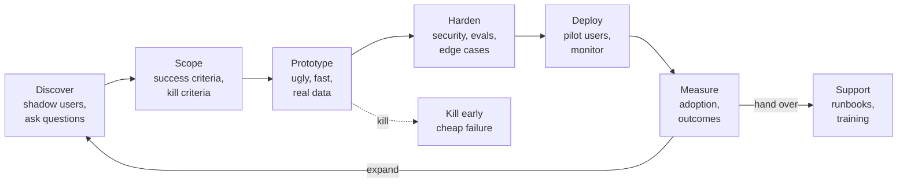
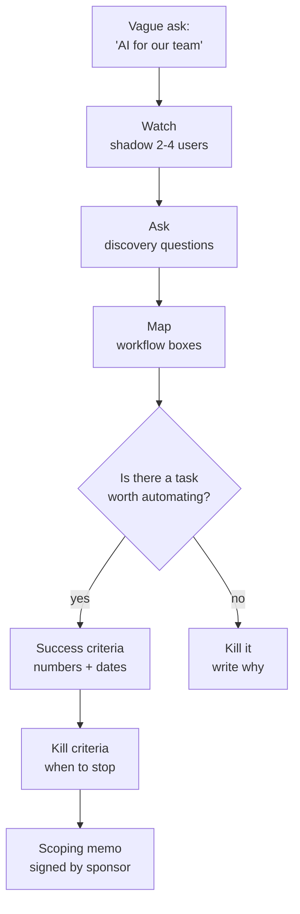
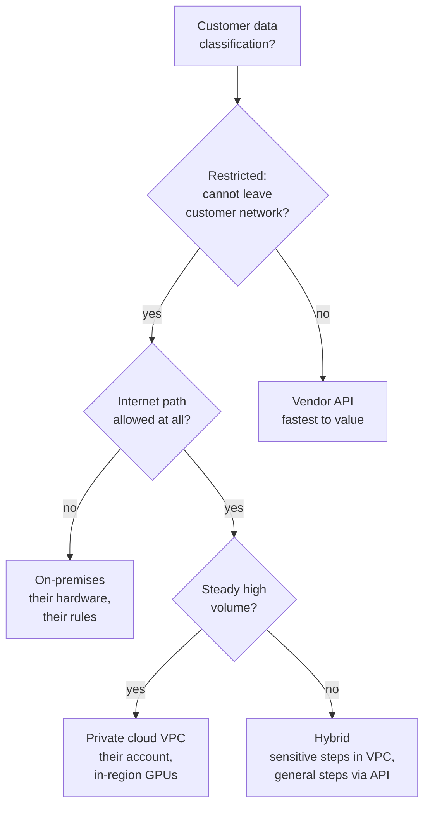
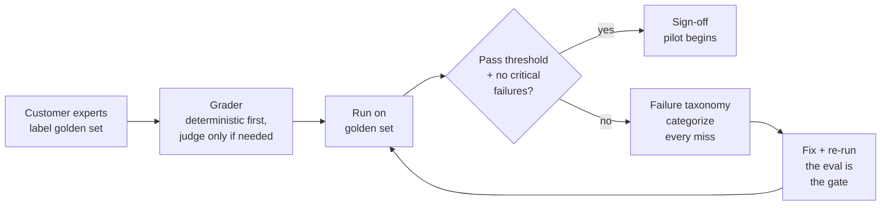
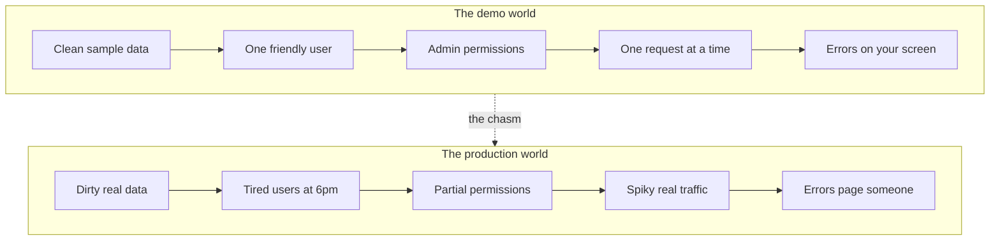
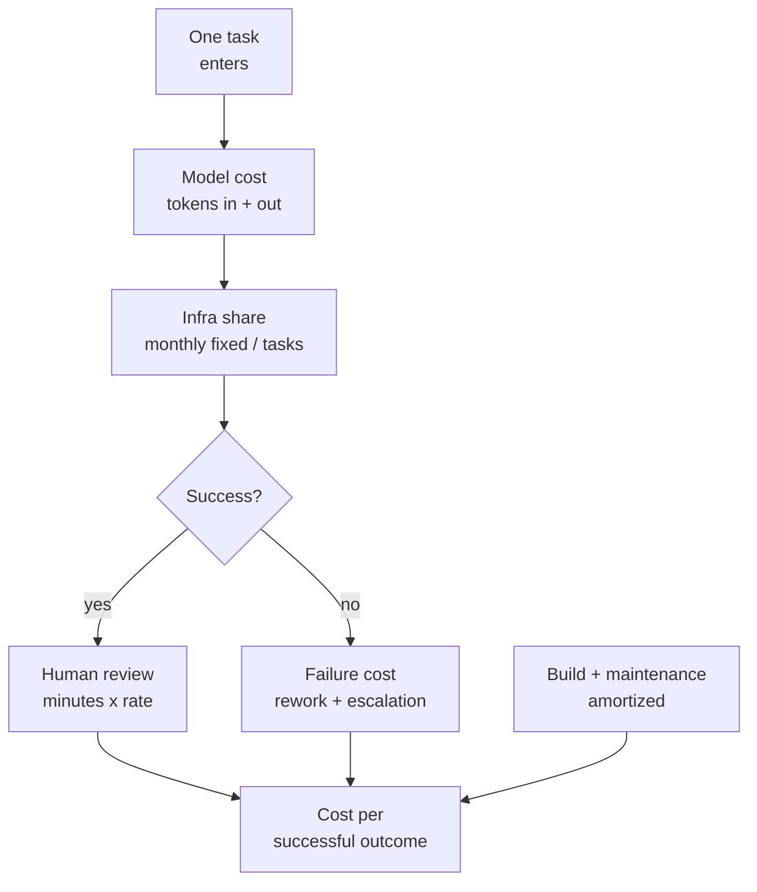
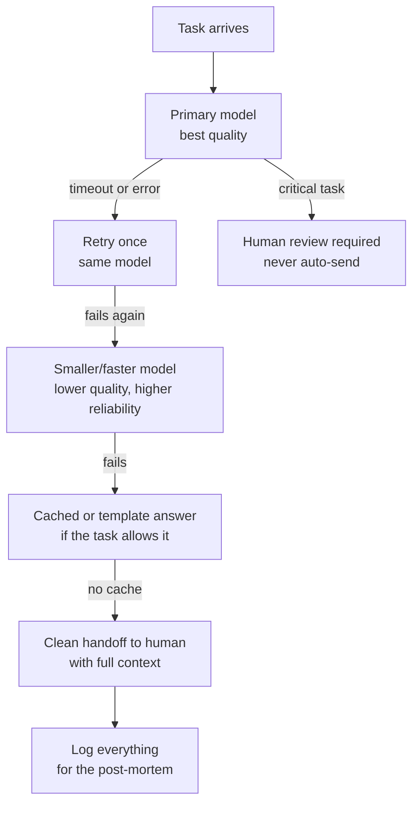

# About this track

This track teaches the craft of the %%forward deployed engineer%%: an engineer who embeds with a customer, turns a vague business ask into a working AI system, and keeps it running inside real enterprise constraints. The name comes from Palantir, where engineers deployed "forward" with clients. Today Anthropic, OpenAI, and many others hire under this title or close cousins: forward deployed AI engineer, applied AI engineer, AI consultant, solutions engineer for AI.

The base curriculum teaches you to build AI systems. This track teaches you to land them inside someone else's company. That is a different skill. The model is the same. The data is messier. The security team says no. The legal team asks where the data goes. The demo worked on your laptop and dies on their network. This track is the bridge between the lab and the customer.

This track has three parts. Part 1 is the role brief: what the job is, the day-to-day loop, and how your work is judged. Part 2 is an ordered reading path through the base volumes, with the reasons each one matters for this role. Part 3 is seven deep-dive chapters of new material: scoping, enterprise architecture, evals as contracts, the prototype-to-production chasm, unit economics, reliability and SLOs, and stakeholder communication.

::: takeaway
- A forward deployed engineer is measured by customer outcomes, not by model quality. Adoption, reliability in production, and time to value are the scorecard.
- The hardest parts of the job are not the model. They are scoping, evals the customer trusts, enterprise constraints, and the prototype-to-production chasm.
- Every deep-dive chapter here ends with a template, a checklist, or working Python you can reuse on a real engagement.
:::

# Part 1: The target-role brief

## What a forward deployed engineer does

A forward deployed engineer (FDE) sits between the AI lab and the customer. The lab builds the model. The customer has a business problem. The FDE makes the two meet.

A typical engagement starts with a vague ask. "We want AI for our support team." "Can this summarize our contracts?" "We need to cut review time in half." The FDE's job is to turn that ask into a plan. The plan covers what to build, what data it needs, what good looks like, what it will cost, and what can go wrong. Then the FDE builds it, usually as a %%prototype%% first. The prototype proves the idea on the customer's own data. Then comes hardening for production and handover of a system the customer's team can run.

Three things make this role different from a pure research or product role:

1. **The problem is ambiguous.** Nobody hands you a spec. You discover the spec through questions, shadowing users, and failed prototypes. Scoping is half the job.
2. **The constraints are the customer's, not yours.** Your stack, your cloud, your data policies: none of them apply. You build inside their security model, their data residency rules, their legacy systems, their procurement process.
3. **The customer decides what "works" means.** Your eval suite must convince a skeptical VP, not a reviewer. If the customer does not trust the measurement, nothing ships.

The title varies. "Forward deployed AI engineer" (Anthropic), "forward deployed engineer" (Palantir, OpenAI), "applied AI engineer", "AI consultant", "customer engineer". The work is the same shape: embed, scope, prototype, harden, deploy, measure, support.

## The day-to-day loop

No two weeks look the same, but engagements follow a rhythm. Learn the rhythm and you can run any engagement.



::: walkthrough
1. Start at the left box. **Discover** means watching real users do the job, not reading a requirements doc. The best requirements live in people's heads.
2. **Scope** turns discovery into a written plan with numbers: what success looks like, and the %%kill criteria%%: the conditions under which you stop. Kill criteria are the most important line in the plan.
3. **Prototype** is intentionally ugly and fast. It runs on the customer's real data, not sample data. If the prototype fails here, you kill it cheaply (the dotted arrow). That is a good outcome.
4. **Harden** is where the demo becomes a system: security review, evals, edge cases, monitoring, fallbacks. Most of the calendar lives here.
5. **Deploy** starts with a small pilot, not a launch. Real users, real traffic, tight monitoring.
6. **Measure** checks the success criteria from the scope step. Hit them and you either expand to more users or hand over to the customer's team with runbooks and training.
:::

A week in the life might look like this: Monday, a discovery workshop with the customer's support leads. Tuesday, prototype iteration on their ticket data. Wednesday, a security review with their infosec team. Thursday, building the acceptance eval suite. Friday, a status update to the executive sponsor plus an hour of on-call for the pilot. The mix of engineering, meetings, and writing is the job.

## How success is measured

FDEs are not measured by papers, model benchmarks, or lines of code. They are measured by what happens at the customer. Know the scorecard before you start.

**Customer outcomes.** Did the system do what the customer hired it to do? Handle time per ticket. Contract review cycle time. Defects caught before production. Pick one to three %%outcome metrics%% in the scoping phase and report against them every week. Everything else is supporting detail.

**Adoption.** A system nobody uses is a failed engagement, even if it is technically excellent. Track weekly active users, share of eligible work flowing through the system, and retention after the novelty wears off. Adoption that fades in month two is a signal the system does not fit the workflow.

**Reliability in production.** The customer experiences your error rate, not your benchmark score. Uptime, p95 latency, task success rate on real traffic, and mean time to recover from incidents. Chapter 6 of this track turns these into SLOs with error budgets.

**Time to value.** How fast did the customer see the first real result? Engagements die in long silent builds. A working prototype on real data in the first two to three weeks buys trust. You will need that trust for the hard months of hardening.

**Expansion and handover.** The best engagements end with the customer buying more or running the system themselves. Expansion (more teams, more use cases) and clean handover (runbooks, trained operators, documented evals) are the two healthy endings.

::: callout warn
The demo is not the product. Customers remember the demo's best moment and expect it every time. Every commitment you make in a demo becomes a requirement in production. Promise less than the demo shows, and write down exactly what the demo did not cover.
:::

# Part 2: Ordered reading path through the base curriculum

Read the base first, then this track's deep dives. The table below orders the volumes for an FDE, with the chapters that matter most and why. "Skim" means read for vocabulary. "Study" means work the examples and labs.

| Order | Volume | Chapters that matter most | How to read it | Why it matters for this role |
|-------|--------|---------------------------|----------------|------------------------------|
| 1 | Vol 9: Agents and RAG (+ Supplements 9A evals, 9B security) | All of Vol 9; all of 9A; 9B on tool security and data boundaries | Study | Most FDE work is agents and RAG on customer data. 9A is the measurement rig behind Chapter 3 of this track. 9B is the security vocabulary for Chapter 2. |
| 2 | Vol 10: Productionizing and MLOps | Deployment patterns, monitoring, CI/CD for ML, incident response | Study | The prototype-to-production chasm (Chapter 4) is this volume applied to customer systems. Monitoring and runbooks are handover material. |
| 3 | Vol 11: Research Methods (+ Supplements 11A eval statistics, 11B labeler protocols) | Experiment design, eval methodology; 11A on confidence and significance; 11B on building golden sets | Study | Evals are customer contracts (Chapter 3). 11A keeps you honest about small samples. 11B teaches how to build a golden set the customer trusts. |
| 4 | Vol 13: ML System Design (+ Supplement 13A distributed systems) | Capacity planning, API design, failure modes, the 13A networking and consistency material | Study | Solution architecture (Chapter 2) is system design under someone else's constraints. 13A covers the VPC, latency, and consistency questions customers ask. |
| 5 | Vol 14: Communicating Research | Technical writing, presenting results, writing for non-technical readers | Study | Half the job is writing: scoping memos, status updates, the "no" letter. Chapter 7 builds on this volume directly. |
| 6 | Vol 2: ML Foundations Bridge | Metrics, leakage and contamination, eval methodology | Study the eval chapters; skim the rest | Customers game evals by accident. Contamination and leakage are how. You need to spot both in their data. |
| 7 | Vol 8: Inference and Serving (+ Supplement 8A inference economics) | Batching, latency vs throughput, quantization survey; 8A on cost modeling | Study 8A deeply; skim the systems chapters | Chapter 5's unit economics builds on 8A. Customers ask "what will this cost at our volume" in the first meeting. |
| 8 | Vol 4: LLM Internals | Attention, context handling, structured outputs, the long-context supplement 4A | Study structured outputs and 4A; skim the math-heavy chapters | Long documents are the norm in enterprise work. 4A's context engineering is daily practice. Structured outputs are how agents talk to legacy systems. |
| 9 | Vol 7: Post-training and RL (+ Supplements 7A, 7B) | SFT, eval-driven iteration, the 7B data chapter | Skim for vocabulary; study 7B | Fine-tuning comes up as a customer request ("can you train it on our data?"). You need to know when SFT helps, when RAG is enough, and what the data work costs. |
| 10 | Vol 12: Paper Spine | The applied papers, especially on RAG and agents | Skim | Lets you answer "is there research behind this approach" with a citation instead of a shrug. |
| 11 | Vol 1: Math for ML | Probability, statistics chapters | Reference as needed | You will reach for confidence intervals and distributions when defending an eval result. Read when 11A points back here. |
| 12 | Vol 5: Pre-training, Vol 6: Distributed Training, Vol 3: Deep Learning, Vol 15: GPU Kernels | (none: triage row) | Skim or skip | Training-scale material rarely decides an FDE engagement. Know it exists so you can say "that is a training problem, not a deployment problem" with authority. |

Two notes on this order. First, it is deliberately application-first. An FDE who can scope, evaluate, and deploy beats an FDE who can derive attention from scratch but cannot run a customer workshop. Second, the "skim or skip" row is not an insult to those volumes. It is triage. Your scarcest resource on an engagement is attention. Spend it where the customer feels it.

::: ob-board Design prompt
A customer says: "We tried an AI pilot with another vendor and it failed. We do not trust AI vendors anymore." Using the reading path above, which three volumes would you lean on hardest to rebuild trust, and in what order? Write one sentence for each explaining what it gives you in that first meeting.
:::
# Part 3: Role-specific deep dives

## Chapter 1: Scoping under ambiguity

### The vague ask

Every engagement starts with a sentence that is not a specification. "We want AI for our support team." "Can this read our contracts?" "We need to cut review time." These sentences are not requirements. They are wishes with a budget attached. Your first job is to turn the wish into a plan without pretending the wish was a plan all along.

The core skill is %%discovery%%: structured learning about the customer's work before you propose anything technical. Engineers like to skip discovery and start building. On customer work, skipping discovery is the most expensive mistake available. A week of good discovery saves three months of building the wrong thing.

Discovery has three moves: watch, ask, and map.

**Watch.** Shadow the people who do the job today. Sit with a support agent for two hours. Watch a paralegal review a contract. You are looking for the parts of the work that are pattern-matching. Those are good AI candidates. Then find the parts needing judgment under uncertainty. Those are hard for AI. Then find the compliance theater, where the human signature is the point. Leave that part alone. Nobody can tell you this in a meeting. You have to see it.

**Ask.** Run a discovery session with the question bank below. The questions look simple. The answers are not simple. The customer has usually never been asked these questions this precisely.

**Map.** Draw the current workflow as boxes and arrows: where work enters, who touches it, where it waits, where errors happen, where it exits. Mark each box as automate, assist, or leave alone. The map becomes the shared picture you and the customer point at for the rest of the engagement.



::: walkthrough
1. Start at the top. The vague ask enters discovery, not engineering.
2. Watch, ask, and map are sequential. Watching first makes your questions specific. Mapping last forces you to commit to what you learned.
3. The diamond is the honest gate. Sometimes the answer is no: the task is all judgment, the data does not exist, or the ROI is negative. Killing it here costs a week. Killing it after three months of building costs the relationship.
4. Success criteria and kill criteria are written before any prototype. The scoping memo is the contract that both sides sign.
:::

### The discovery question bank

Use these in the first workshop. Take notes verbatim. The exact words matter later when you write acceptance criteria.

| # | Question | What you are really asking |
|---|----------|---------------------------|
| 1 | Walk me through the last time you did this task, step by step. | Where is the time actually spent? Where does it wait? |
| 2 | What does a perfect result look like? Show me one. | The golden example. You will need it for evals. |
| 3 | What does a bad result look like? Show me the worst one you have seen. | The failure modes. Your evals must include these. |
| 4 | How do you know today whether the work was done well? | The current quality check. Your system must beat or match it. |
| 5 | What happens when it goes wrong? Who notices, and what does it cost? | The blast radius. This sets how much reliability you need. |
| 6 | Which parts are boring repetition, and which parts need real judgment? | The automate-vs-assist split. |
| 7 | What data exists about this task? Where does it live? Who owns it? | Data reality check. "In the CRM" often means "in three CRMs and a spreadsheet." |
| 8 | Who has to approve this before it goes live? What will they ask? | The hidden stakeholders. Security, legal, and compliance always show up eventually. Better in week one than week twelve. |
| 9 | What did the last attempt at this fail on? | The landmines. Every failed pilot teaches something if you ask. |
| 10 | If this works perfectly, what changes for the business? Put a number on it. | The ROI input. Without a number, you cannot do Chapter 5. |

Question 9 is the highest-value question on the list. Customers rarely volunteer failure history. Ask directly, and ask what the vendor did wrong, not just what the technology did wrong. The answer is usually about trust, not accuracy.

### Success criteria and kill criteria

A scope without numbers is a wish. Write both kinds of criteria before building.

**Success criteria** are the numbers that mean "this worked." They must be measurable on the customer's data, with a deadline. Good: "By week 8, the system drafts responses for 60 percent of tier-1 tickets. Agents accept the draft unchanged at least 70 percent of the time, measured on live traffic." Bad: "The system improves support efficiency." The bad version cannot fail, which means it cannot succeed either.

**Kill criteria** are the conditions that mean "stop." They protect both sides. Examples:

- "If after 4 weeks on real data the acceptance eval stays below 80 percent, we stop and reassess."
- "If legal blocks customer data leaving the VPC and no on-prem option fits the budget, we stop."
- "If fewer than 5 pilot users engage weekly by week 6, we stop." Write them down. Sign them. Killing a bad engagement early is a success, not a failure. The most trusted FDEs are the ones who killed something fast and said why.

### The scoping memo

The scoping memo is a one-to-two-page document both sides sign. It is the single most useful artifact in this chapter. Here is the template.

```
SCOPING MEMO
Engagement: [customer team + use case, one line]
Date: [date]        Sponsor: [name, title]        FDE: [name]

1. PROBLEM (2-3 sentences, in the customer's words)
   What hurts, who feels it, how often.

2. CURRENT WORKFLOW (the map, as boxes)
   Entry -> steps -> exit. Mark automate / assist / leave-alone.

3. PROPOSED APPROACH (one paragraph, no jargon)
   What we will build, in plain language a VP understands.

4. SUCCESS CRITERIA (numbers + dates)
   - [metric]: [target] by [date], measured on [data source]

5. KILL CRITERIA (conditions to stop)
   - [condition] -> stop and reassess by [date]

6. DATA (what exists, where it lives, who approves access)
   - [dataset]: [location], owner [name], access status [granted/pending/blocked]

7. CONSTRAINTS (security, residency, integration, timeline)
   - [constraint]: [implication for the design]

8. RISKS AND OPEN QUESTIONS
   - [risk]: [mitigation or owner]

9. MILESTONES
   - Week 2: prototype on real data. Week 6: acceptance eval. Week 10: pilot.

Signed: _______________ (sponsor)    _______________ (FDE)
```

### Worked example: from vague ask to plan

The ask: "We want AI to help our procurement team review vendor contracts faster."

Discovery ran two days of shadowing. It revealed: reviewers spend 40 minutes per contract, mostly checking 12 standard clauses against a policy doc. The judgment call is only on non-standard clauses, about 20 percent of contracts. Data: 800 past contracts with reviewer markup live in SharePoint. Legal must approve any system that touches contracts. The last attempt failed because the vendor demoed on clean sample contracts and the real ones are scanned PDFs with coffee stains.

The scoping memo says: automate the 12 standard clause checks (assist mode, reviewer approves), leave non-standard clauses to humans. Success criteria: median review time for standard contracts drops from 40 to 15 minutes by week 10, measured on live reviews; clause-check accuracy at least 95 percent on the acceptance set. Kill criteria: if scanned-PDF extraction accuracy stays below 90 percent after week 4, stop (the failure mode of the last attempt, named explicitly). Constraint: contracts cannot leave the customer's Azure tenant. Risk: SharePoint permissions are per-folder and messy.

Notice what happened. The vague ask became a plan with numbers, a named failure mode from history, and a kill criterion. That is scoping.

::: takeaway
- Discovery is watch, ask, map. Never propose a technical approach before the map exists.
- Every scope needs success criteria (numbers plus dates) and kill criteria (conditions to stop). Write both before building.
- The scoping memo is a one-to-two-page signed contract. It is the artifact the whole engagement points back to.
- Question 9 ("what did the last attempt fail on?") is the highest-value question you can ask.
:::

::: lab Lab T7.1: Write a scoping memo
Pick a use case from your own experience: a team doing repetitive document work. Run the discovery question bank on paper, answering as the customer would. Draw the workflow map, mark automate/assist/leave-alone, and fill in the scoping memo template above with real numbers. Trade memos with a peer and try to break each other's kill criteria: are they specific enough to actually trigger?
:::
## Chapter 2: Solution architecture under enterprise constraints

### The customer's world, not yours

In a lab, you pick the stack. On an engagement, the stack picks you. The customer's constraints decide the architecture before you draw a single box. Learn to read constraints the way a lawyer reads a contract: every line changes what you can build.

The big five constraints show up on almost every enterprise engagement:

**1. Security review.** Before anything touches production data, the customer's information security team reviews your design. They ask: what data flows where, what is logged, who can access the logs, how are secrets stored, what happens when an employee leaves. The review takes two to six weeks. Start it in week one, not week eight. Bring a data-flow diagram to the first meeting. "Trust us" is not an answer they accept.

**2. Data residency.** Some data cannot leave a country, a cloud region, or the customer's own network. Healthcare, finance, and government add their own rules. Residency decides where the model runs: a vendor API is fine for public data and impossible for restricted data. Ask "where is this data allowed to live?" in discovery, because the answer can kill an entire architecture.

**3. Legacy integration.** The customer's data lives in systems built before transformers existed. Think SAP, Salesforce with a decade of custom fields, a document store with no API, email inboxes that are somehow load-bearing. Your agent does not replace these systems. It talks to them, usually through the ugliest available interface. Budget real time for integration. It is always more than you think.

**4. Identity and access.** Enterprise users log in with single sign-on. Permissions are per-user, per-folder, per-record. Your system must respect the same permissions the user already has. An agent that surfaces a document the user is not allowed to see is a security incident, not a feature. Design the permission check before the retrieval step, never after.

**5. Procurement and budget cycles.** Buying software takes months. A pilot that needs a purchase order in week two will stall. Know whether you are running inside an existing contract or starting a new procurement, and plan the timeline around the answer.

### The four deployment patterns

Almost every engagement lands on one of four patterns. The table compares them. The Python sample below turns the comparison into a decision tool.

| Pattern | Where the model runs | Best when | Watch out for |
|---------|---------------------|-----------|---------------|
| Vendor API (SaaS) | The AI vendor's cloud, called over the internet | Data is not restricted; speed matters most; the customer already approved the vendor | Data leaves the customer's network; per-token cost at scale; vendor outages are your outages |
| Private cloud (VPC) | The customer's cloud account, in their virtual private cloud | Data must stay in-region; the customer has cloud engineers; steady high volume | You operate inside their network; GPU capacity is their problem and yours; longer setup |
| On-premises | The customer's own data center | Regulated data; no internet path allowed; existing GPU or CPU fleet | Hardware limits are hard limits; updates are slow; you debug through their IT team |
| Hybrid | Sensitive steps on-prem or in VPC, general steps via vendor API | Mixed data sensitivity; you can split the workflow by classification | Two systems to operate; the split itself needs a security review; data labeling must be right |



::: walkthrough
1. The first question is always data classification. Everything else follows from it.
2. "Restricted" means regulated or contractually confined: health records, financial data, defense work, or customer data under a strict DPA.
3. If data cannot leave the network and there is no internet path, you are on-premises. Accept it early. Fighting it wastes months.
4. Volume decides between VPC and hybrid. Steady high volume justifies dedicated GPU capacity in the VPC. Spiky or mixed workloads fit a hybrid split.
5. Unrestricted data goes to the vendor API. Do not build infrastructure for a problem the API already solves.
:::

### Worked example: a pattern decision in Python

The sample below scores the four patterns against a customer's constraints. It is deliberately simple: the point is not the algorithm, it is having a repeatable, explainable decision instead of an architect's gut feeling. Customers trust a scored table they can argue with. They cannot argue with a recommendation they cannot inspect.

```python
# pattern_picker.py
#
# WHAT: Scores the four enterprise deployment patterns against a customer's
#       stated constraints and prints a ranked table with reasons.
# WHY:  Architecture arguments with customers go better when the reasoning is
#       visible. A scored table turns "I recommend VPC" into "VPC wins on
#       your three hard constraints, here is the math." The customer can
#       disagree with a weight, which is a productive argument. They cannot
#       argue with a gut feeling.
# WHAT BREAKS IF CHANGED:
#   - If you add a pattern, add it to PATTERNS and to the scorer. A pattern
#     missing from the scorer silently never wins, which is worse than an
#     error because nobody notices.
#   - Weights are opinions, not facts. If the customer says residency matters
#     more than cost, change the weights in front of them, re-run, and show
#     the new ranking. Never hard-code weights you are not willing to defend.

# Each pattern gets a 0-2 score on each dimension. 2 = strong fit, 0 = poor.
# Scores are relative judgments, documented in the comments, not measurements.
PATTERNS = {
    # Vendor API: fastest to build, but data leaves the customer's network.
    "vendor_api": {
        "data_stays_in_network": 0,  # data crosses the internet by design
        "speed_to_value": 2,         # no infra to build; call an endpoint
        "cost_at_scale": 1,          # per-token pricing hurts at high volume
        "ops_burden": 2,             # the vendor operates the model
        "works_offline": 0,          # no internet path means no service
    },
    # Private cloud VPC: the model runs in the customer's cloud account.
    "vpc": {
        "data_stays_in_network": 2,  # traffic stays inside their cloud
        "speed_to_value": 1,         # weeks of setup: networking, GPUs, images
        "cost_at_scale": 2,          # reserved GPUs beat per-token at volume
        "ops_burden": 0,             # someone must run the fleet; often you
        "works_offline": 1,          # works without public internet, needs cloud
    },
    # On-premises: the customer's data center, their hardware.
    "onprem": {
        "data_stays_in_network": 2,  # data never leaves the building
        "speed_to_value": 0,         # procurement plus install is months
        "cost_at_scale": 1,          # sunk hardware is cheap; new GPUs are not
        "ops_burden": 0,             # their IT team, your debugging-by-proxy
        "works_offline": 2,          # air-gapped is the whole point
    },
    # Hybrid: split by data classification; sensitive steps stay inside.
    "hybrid": {
        "data_stays_in_network": 1,  # only if the split is correct; review it
        "speed_to_value": 1,         # two systems to wire up
        "cost_at_scale": 1,          # API for spikes, owned GPUs for base load
        "ops_burden": 1,             # the split is a second system to operate
        "works_offline": 1,          # the inside part works; the API part does not
    },
}

# Default weights: one possible opinion about what matters. Change these with
# the customer in the room. The ranking must be re-computable in seconds.
DEFAULT_WEIGHTS = {
    "data_stays_in_network": 3.0,  # usually the hardest constraint; weight it so
    "speed_to_value": 2.0,
    "cost_at_scale": 1.5,
    "ops_burden": 1.0,
    "works_offline": 1.0,
}


def score_patterns(weights=None):
    """Rank patterns by weighted score. Returns (name, score, notes) sorted best first.

    Complexity: O(P * D) for P patterns and D dimensions; trivially small.
    """
    weights = weights or DEFAULT_WEIGHTS
    ranked = []
    for name, dims in PATTERNS.items():
        # Weighted sum. Dimensions are 0-2, weights are customer-tuned.
        # A hard constraint can also be a veto (see veto_check below); the
        # score ranks the survivors, it does not overrule a veto.
        total = sum(dims[d] * weights[d] for d in weights)
        ranked.append((name, round(total, 1)))
    ranked.sort(key=lambda r: r[1], reverse=True)
    return ranked


def veto_check(hard_constraints):
    """Apply non-negotiable constraints. Returns the patterns still allowed.

    hard_constraints is a set like {"data_stays_in_network", "works_offline"}.
    A pattern survives only if it scores 2 (strong fit) on every hard
    constraint. Vetoes run BEFORE scoring: no weight can rescue a vetoed
    pattern. This models how security reviews actually work.
    """
    survivors = []
    for name, dims in PATTERNS.items():
        if all(dims[c] == 2 for c in hard_constraints):
            survivors.append(name)
    return survivors


if __name__ == "__main__":
    # Example: a bank. Data cannot leave the network (hard constraint).
    # Speed matters (pilot deadline), cost at scale matters (high volume).
    hard = {"data_stays_in_network"}
    print("Survivors after veto:", veto_check(hard))
    print()
    print(f"{'pattern':<12}{'score':>7}")
    for name, score in score_patterns():
        mark = "  <-- vetoed" if name not in veto_check(hard) else ""
        print(f"{name:<12}{score:>7}{mark}")
```

::: walkthrough
1. **PATTERNS** holds the judgment: how well each pattern fits each dimension, on a 0-2 scale. The comments say why each number is what it is. Change a number only if you can defend the new one out loud.
2. **DEFAULT_WEIGHTS** holds the priorities. Note the comment: weights are opinions. The tool is designed so you change them live with the customer and re-run.
3. **veto_check** runs before scoring. This mirrors reality: a hard constraint like "data cannot leave the network" is not a preference you can trade off. It eliminates options entirely. Scoring only ranks what survives.
4. **The main block** shows the bank example. `vendor_api` scores well on speed but gets vetoed on the hard constraint. The printed table shows both the score and the veto mark, so the customer sees why the fast option is off the table.
5. **What this does not do:** it does not replace the security review, and it does not know the customer's real GPU capacity. It structures the conversation. The conversation is the product.
:::

Running it prints:

```
Survivors after veto: ['vpc', 'onprem']

pattern       score
vpc            12.0
onprem          9.5
hybrid          8.5  <-- vetoed
vendor_api      7.5  <-- vetoed
```

The hybrid pattern scores decently but is vetoed. Its data-stays-in-network score is only 1. The split has to be exactly right, and a bank's security team will not accept "probably." That is the kind of reasoning the table makes visible.

### The security review playbook

Start the review in week one. Bring three artifacts to the first meeting with infosec:

1. **A data-flow diagram.** Every system your data touches, every arrow labeled with what flows and whether it is encrypted in transit and at rest. Draw it before the meeting. An undrawn architecture cannot be approved.
2. **A data inventory.** What you store, where, for how long, who can read it. Include logs, prompts, and eval traces. Customers forget that prompts contain customer data. Infosec does not.
3. **The permission model.** How the system checks that a user may see what it shows them. "We check the same ACL the source system uses, before retrieval" is a sentence that ends meetings early, in a good way.

Common misunderstanding: the security review is not a hurdle to clear once. It recurs every time the data flow changes: a new tool, a new log sink, a new vendor. Budget review time for every architecture change, not just the first one.

::: takeaway
- Read the customer's constraints before drawing the architecture: security review, data residency, legacy integration, identity and access, procurement.
- Four patterns cover nearly every engagement: vendor API, private VPC, on-premises, hybrid. Data classification picks the pattern.
- Hard constraints are vetoes, not weights. Score only what survives.
- Start the security review in week one with a data-flow diagram, a data inventory, and the permission model.
:::

::: lab Lab T7.2: Run the pattern picker
Take the worked example from Chapter 1 (procurement contract review; contracts cannot leave the customer's Azure tenant). Encode the constraints, run `pattern_picker.py`, and write one paragraph defending the winner to a skeptical CISO. Then change the weights live: what would have to be true about the customer's priorities for the ranking to flip?
:::
## Chapter 3: Evals as customer contracts

### Why the customer must trust the measurement

Your model can be excellent and your engagement can still fail. The failure looks like this: you show the customer a dashboard that says 94 percent accuracy. The VP asks, "94 percent of what?" You explain your eval set. She says, "Those are not our real cases." The meeting ends. Nothing ships.

The lesson: on customer work, the eval is not a research artifact. It is a %%contract%%. Both sides agree in advance what will be measured, on what data, with what pass threshold, and what happens if the system passes or fails. "Pass the acceptance eval" becomes the definition of done, written into the scoping memo from Chapter 1.

This chapter builds on Volume 9 Supplement A (agentic eval engineering), Volume 11 (research methods), and Supplement 11B (labeler protocols for golden sets). Read those for the machinery. This chapter is about the customer-facing layer: turning machinery into trust.

### The anatomy of an acceptance eval

An acceptance eval has five parts. Miss any one and the customer will find the gap at the worst moment.

**1. The golden set.** A fixed set of real customer cases with known-correct answers, built with the customer's own experts. Not sample data. Not synthetic data (at first). Real tickets, real contracts, real questions, with the answers the customer's best people agree on. Supplement 11B covers how to build one without the labelers drifting. Size: start with 100 to 300 cases. Fewer than 100 and the confidence intervals are too wide to argue about (Supplement 11A). More than 300 and the customer's experts will not finish labeling.

**2. The grader.** Code that scores the system on each case, deterministically where possible. Exact match for structured outputs. Rubric-based checks for free text. An LLM judge only where a deterministic check is impossible, and then calibrated against human graders first (Supplement 9A, Chapter 3). The customer must be able to read the grader and agree it is fair. A grader nobody understands is a grader nobody trusts.

**3. The pass threshold.** A number, agreed in advance. "The system passes if it scores at least 90 percent on the golden set, with no critical-category case failing." The "no critical failure" clause matters: customers care more about the worst case than the average. A system at 95 percent that leaks one salary number is a failed system.

**4. The failure taxonomy.** Every miss gets a category: wrong answer, refused to answer, answered the wrong question, too slow, leaked restricted data. The taxonomy turns "it got 12 wrong" into "9 were formatting edge cases we can fix, 3 are real reasoning gaps." Customers accept categorized failures. They do not accept a single red number.

**5. The re-run rule.** When and how the eval re-runs: on every model or prompt change, on a schedule, and before every release to pilot users. The eval is a gate in the deployment pipeline (Supplement 9A, Patch 2), not a one-time ceremony.



### UAT for AI: the user acceptance test

Traditional software has %%user acceptance testing%% (UAT): users try the system and sign off. AI systems need a UAT designed for non-determinism, because "try it and see if you like it" produces vibes, not a decision.

Run the AI UAT in three rounds:

**Round 1: blind grading.** Give 3 to 5 customer experts a shuffled mix of system outputs and human outputs on golden-set cases. They grade without knowing which is which. This kills two biases at once. Nobody can dismiss an output just for being AI, and nobody can praise one just because the demo was impressive.

**Round 2: adversarial session.** Invite the skeptics. Give them 30 minutes to break the system on purpose: tricky cases, edge inputs, the weird ticket from 2019 everyone remembers. Log every break. Each break becomes a new golden-set case or a documented limitation. Skeptics who break the system in the room become advocates when it survives.

**Round 3: the pilot shadow.** Run the system alongside the current process for two weeks without letting it act. It drafts, a human decides.

**Round 3: the pilot shadow.** Run the system alongside the current process for two weeks without letting it act: it drafts, a human decides. Measure agreement rate between the system and the human. This is the number the executive sponsor will quote. Make sure it is real before anyone quotes it.

### Worked example: an acceptance eval runner in Python

The sample below is a small framework for running an acceptance eval. It loads a golden set and runs a system function over it. It grades each case, checks the pass threshold plus the no-critical-failure rule, and prints a failure taxonomy. It is the kind of code you actually leave behind at a customer.

```python
# acceptance_eval.py
#
# WHAT: A minimal acceptance-eval runner. Loads a golden set (JSON), runs the
#       system's answer function on each case, grades with per-case grader
#       functions, checks the pass threshold plus the no-critical-failure
#       rule, and prints a failure taxonomy.
# WHY:  Customers trust evals they can read and re-run. This file is short
#       enough to walk through in a meeting and complete enough to gate a
#       pilot. Deterministic graders come first; an LLM judge is a plug-in,
#       not the default, because a judge the customer cannot inspect is a
#       judge the customer will not trust.
# WHAT BREAKS IF CHANGED:
#   - If the golden set file changes, version it (golden_v3.json) and record
#     which version gated which release. Re-running an old release against a
#     new golden set and comparing scores across versions is meaningless.
#   - The no-critical-failure rule is load-bearing. Removing it lets a 95%
#     average hide one catastrophic case. Customers remember the catastrophe.

import json


def load_golden_set(path):
    """Load golden cases. Each case: id, input, expected, critical (bool),
    and category (str) for the failure taxonomy.

    The golden set is data, not code. It lives in version control next to
    this runner, and the customer's experts own its contents.
    """
    with open(path, encoding="utf-8") as f:
        cases = json.load(f)
    # Validate shape early: a malformed case failing at 2am during a release
    # gate is how evals lose trust. Fail fast, fail loudly, fail now.
    for c in cases:
        assert {"id", "input", "expected", "critical", "category"} <= set(c), c["id"]
    return cases


def exact_grader(case, actual):
    """Deterministic grader for structured outputs. Returns (passed, detail).

    Exact match is the strictest fair grader for fields like clause names,
    amounts, or categories. For free text, write a rubric grader instead;
    do not fall back to vibes.
    """
    passed = actual.strip() == case["expected"].strip()
    return passed, "exact match" if passed else f"expected {case['expected']!r}"


def run_acceptance(system_fn, grader_fn, golden_path, pass_threshold=0.90):
    """Run the full acceptance eval. Returns a report dict.

    system_fn:  takes case["input"], returns the system's answer (str).
    grader_fn:  takes (case, actual), returns (passed: bool, detail: str).
    pass_threshold: minimum overall pass rate, agreed in the scoping memo.

    Complexity: O(N * (system + grader)) for N cases. The system call
    dominates; graders should stay cheap and deterministic.
    """
    cases = load_golden_set(golden_path)
    results = []
    for case in cases:
        # One case at a time, no shared state between cases. If the system
        # under test keeps conversation memory, reset it here; otherwise
        # case 12's answer leaks into case 13 and the eval is fiction.
        actual = system_fn(case["input"])
        passed, detail = grader_fn(case, actual)
        results.append({
            "id": case["id"], "passed": passed, "detail": detail,
            "critical": case["critical"], "category": case["category"],
        })

    total = len(results)
    passed_n = sum(1 for r in results if r["passed"])
    rate = passed_n / total if total else 0.0

    # The no-critical-failure rule: any critical miss fails the whole eval,
    # regardless of the average. This is the clause the customer's risk team
    # cares about. It is checked separately so it cannot be averaged away.
    critical_misses = [r for r in results if r["critical"] and not r["passed"]]
    accepted = (rate >= pass_threshold) and not critical_misses

    # Failure taxonomy: group misses by category so the fix list is concrete.
    taxonomy = {}
    for r in results:
        if not r["passed"]:
            taxonomy.setdefault(r["category"], []).append(r["id"])

    return {
        "total": total, "passed": passed_n, "rate": round(rate, 3),
        "threshold": pass_threshold, "accepted": accepted,
        "critical_misses": [r["id"] for r in critical_misses],
        "taxonomy": taxonomy,
    }


def print_report(report):
    """Print the report the way you would show it in a customer meeting."""
    print(f"Cases: {report['total']}  Passed: {report['passed']}  "
          f"Rate: {report['rate']:.1%}  Threshold: {report['threshold']:.0%}")
    print("ACCEPTED" if report["accepted"] else "NOT ACCEPTED")
    if report["critical_misses"]:
        # Critical misses are listed first and by name. No hiding.
        print("Critical misses:", ", ".join(report["critical_misses"]))
    if report["taxonomy"]:
        print("Failure taxonomy:")
        for category, ids in sorted(report["taxonomy"].items()):
            print(f"  {category}: {len(ids)} misses ({', '.join(ids[:5])}"
                  f"{'...' if len(ids) > 5 else ''})")


if __name__ == "__main__":
    # Demo wiring: a stub system and three toy cases. On a real engagement
    # the system_fn calls the deployed agent and the golden set has 100+
    # customer-labeled cases.
    toy_cases = [
        {"id": "c1", "input": "clause?", "expected": "termination",
         "critical": False, "category": "wrong_label"},
        {"id": "c2", "input": "amount?", "expected": "$50,000",
         "critical": True, "category": "wrong_amount"},
        {"id": "c3", "input": "date?", "expected": "2026-03-01",
         "critical": False, "category": "wrong_date"},
    ]
    with open("/tmp/toy_golden.json", "w", encoding="utf-8") as f:
        json.dump(toy_cases, f)

    def stub_system(prompt):
        # A deliberately imperfect stub so the report shows a taxonomy.
        return {"clause?": "termination", "amount?": "$5,000",
                "date?": "2026-03-01"}[prompt]

    report = run_acceptance(stub_system, exact_grader, "/tmp/toy_golden.json",
                            pass_threshold=0.90)
    print_report(report)
```

::: walkthrough
1. **load_golden_set** validates every case up front. A malformed golden set that fails mid-run destroys trust in the whole ritual. The assertion is the cheapest insurance available.
2. **exact_grader** is deliberately strict. For structured fields (names, amounts, dates), exact match is fair and explainable. The comment says where rubric graders belong: free text, written as code, never vibes.
3. **run_acceptance** loops with no shared state between cases. The comment about resetting conversation memory is the kind of detail that decides whether the number is real.
4. **The no-critical-failure rule** is checked as a separate boolean, not folded into the average. This is the structural guarantee the risk team asked for in the scoping memo.
5. **The taxonomy** groups misses by category. "3 wrong_amount, 2 wrong_date" is a fix list. "87 percent" is a shrug.
6. **The demo block** wires a stub so you can run the file today. On an engagement, `stub_system` becomes the deployed agent and the toy file becomes the versioned golden set.
:::

Running it prints:

```
Cases: 3  Passed: 2  Rate: 66.7%  Threshold: 90%
NOT ACCEPTED
Critical misses: c2
Failure taxonomy:
  wrong_amount: 1 misses (c2)
```

The stub fails on the critical amount case, so the whole eval fails even though two of three passed. That is the rule working as designed.

### Common misunderstanding: the demo versus the contract

The misunderstanding: "The demo scored well, so we are basically done." The demo ran on cases someone chose to look good. The contract runs on cases the customer's experts chose to be representative, including the ugly ones. The gap between demo accuracy and acceptance accuracy is typically 10 to 30 points, and it is where engagements are won or lost. Never quote the demo number after the acceptance eval exists. The acceptance number is the only number.

::: takeaway
- The eval is a contract: golden set, grader, pass threshold, failure taxonomy, re-run rule. Agree on all five in advance.
- Build the golden set from real customer cases with the customer's experts. 100 to 300 cases to start.
- Deterministic graders first. An LLM judge only where deterministic checks are impossible, and calibrated first.
- The no-critical-failure rule is non-negotiable: one catastrophic miss fails the eval regardless of the average.
- Run UAT in three rounds: blind grading, adversarial session, pilot shadow. Skeptics who break it in the room become advocates when it survives.
:::

::: lab Lab T7.3: Build a toy acceptance eval
Write 20 golden cases for a task you know (email triage, invoice field extraction, FAQ answering). Label 3 as critical. Write a stub system that gets 16 right, then run `acceptance_eval.py` against it. Now add the 4 misses to the failure taxonomy and write the fix for each category. Which fixes are prompt changes, which are data changes, and which mean the task needs a different approach?
:::
## Chapter 4: The prototype-to-production chasm

### Why demos die on real data

The prototype worked. The customer clapped. Then you pointed it at real data and it fell apart. This is the most predictable moment in forward deployed work, and the least planned for.

The prototype lived in a kind world: clean sample documents, one user, no permissions, no traffic spikes, nobody watching the logs. Production is unkind in specific, repeatable ways. Learn the list and you can harden against it before the pilot, not after the incident.

**Real data is dirty.** Scanned PDFs with coffee stains. Spreadsheets with merged cells and three header rows. Names spelled four ways. Dates in six formats. The demo's parser handled the sample; the real corpus breaks it on document 40. Budget a full data-cleaning pass between prototype and pilot. It is not glamorous. It decides the engagement.

**Real users are adversarial by accident.** They paste 50 pages into a box built for 5. They ask in slang, in fragments, in the wrong language. They click the button twice and submit the form three times. The prototype assumed a cooperative user. Production must assume a tired human at 6pm on a Friday.

**Real systems have permissions.** The demo ran as admin. Production runs as a user with partial access to a messy folder tree. The first permission-denied error arrives in the pilot's first hour. Designing the permission check in Chapter 2 pays off here. Bolting it on later means rewriting the retrieval path.

**Real traffic has shape.** The demo handled one request at a time. Production gets Monday-morning spikes, quarter-end floods, and one user who pastes the entire archive. Load-test with the customer's actual traffic pattern, not a flat rate. Ask for last quarter's usage logs in discovery.

**Real failures need owners.** The demo's errors went to your laptop screen. Production's errors go to someone's phone at 2am. Before the pilot, write the runbook: what each alert means, who responds, how to roll back, how to pause the system without losing in-flight work.



### The hardening checklist

Work through this list between prototype and pilot. Every unchecked box is an incident waiting for a date.

| # | Hardening item | What "done" looks like |
|---|----------------|------------------------|
| 1 | Dirty-data pass | Parser tested on a random 500-document sample of the real corpus; failure rate measured and categorized |
| 2 | Input limits | Max input size, max tool calls, timeouts enforced and tested; the 50-page paste gets a clear error, not a hang |
| 3 | Permission checks | Every retrieval filters by the requesting user's permissions before the model sees anything; tested with a low-privilege test user |
| 4 | Auth and secrets | No keys in code or logs; secrets in the customer's vault; SSO wired for all users |
| 5 | Audit logging | Every model call, tool call, and data access logged with user id and timestamp; logs retained per the customer's policy |
| 6 | Rate limits and quotas | Per-user and per-team limits set; the quarter-end flood degrades gracefully instead of dying |
| 7 | Fallbacks | Every model call has a fallback: retry, smaller model, cached answer, or clean handoff to a human (Chapter 6) |
| 8 | Monitoring and alerts | Dashboards for latency, error rate, cost, and task success; alerts route to a named human with a runbook |
| 9 | Rollback plan | Previous version restorable in under 15 minutes; in-flight work is not lost on rollback |
| 10 | Acceptance eval green | Chapter 3's eval passes on the current build; the eval re-runs on every change |
| 11 | Runbook written | On-call engineer can diagnose the top 5 failure modes from the runbook alone, without calling you |
| 12 | Handover training | Customer operators trained; they have run a supervised deploy and a supervised rollback |

### Worked example: fuzzing the edges before the pilot

The sample below is an edge-case fuzzer for an agent's input handling. It throws the unkind inputs at the system before real users do: oversized inputs, weird encodings, double submissions, permission edge cases. Each probe asserts the system fails cleanly (a clear error, a timeout, a refusal) rather than hanging or leaking.

```python
# edge_fuzzer.py
#
# WHAT: Throws unkind inputs at a system's entry point and checks that every
#       failure is clean: a clear error, a timeout, or a refusal. Never a
#       hang, never a leak, never a stack trace to the user.
# WHY:  Real users are adversarial by accident. Finding the ugly failures in
#       a fuzzer costs an afternoon. Finding them in the pilot costs trust,
#       and trust is the currency of the whole engagement.
# WHAT BREAKS IF CHANGED:
#   - The timeout values encode the SLO from Chapter 6. If the SLO changes,
#     update the timeouts here too, or the fuzzer certifies a system that
#     violates its own contract.
#   - These probes assume the system under test is the pilot build. Running
#     them against production without the customer's written permission is
#     a load test on someone else's system. Get permission first.

import time

# A probe is (name, input_builder, expectation). The expectation is a
# function of (result, elapsed_s) returning (ok: bool, note: str).
# Keeping probes as data means adding a new edge case is one dict entry,
# which is how the list grows to hundreds on a real engagement.


def _huge_text(n_chars=200_000):
    # 200k chars: the "user pastes the entire archive" case. Real support
    # tickets with full email threads hit this size. The system must reject
    # or truncate with a clear message, not hang or OOM.
    return "lorem ipsum dolor sit amet. " * (n_chars // 28)


def _weird_encoding():
    # Mixed encodings, zero-width chars, right-to-left marks: the copy-paste
    # from a PDF case. Parsers that assume clean UTF-8 die here.
    return "R\u00e9sum\u00e9\u200b\u202e of the caf\u00e9 \ud83d\ude00 plan"


PROBES = [
    {
        "name": "oversized_input",
        "input": _huge_text(),
        # Must fail fast with a clear message. Hanging is the failure mode
        # that pages someone at 2am; a fast clear error is a good outcome.
        "expect": lambda r, e: (e < 5.0 and "too large" in r.lower(),
                                f"{e:.1f}s"),
    },
    {
        "name": "empty_input",
        "input": "",
        # Empty input must produce a helpful prompt, not a model call that
        # burns tokens on nothing and returns a confident hallucination.
        "expect": lambda r, e: ("please provide" in r.lower() or
                                "empty" in r.lower(), r[:60]),
    },
    {
        "name": "weird_encoding",
        "input": _weird_encoding(),
        # Must not crash and must not echo raw control characters back.
        # Echoing them back can break the customer's UI or, worse, execute
        # in a downstream system that interprets them.
        "expect": lambda r, e: ("\u202e" not in r and "\u200b" not in r, r[:60]),
    },
    {
        "name": "double_submit",
        "input": "DOUBLE_SUBMIT_MARKER",
        # Sent twice in a row: the system must be idempotent or detect the
        # duplicate. Double-billing a customer because they double-clicked
        # is the kind of bug that ends engagements.
        "expect": lambda r, e: ("duplicate" in r.lower() or
                                "already" in r.lower(), r[:60]),
    },
]


def fuzz(system_fn, timeout_s=30.0):
    """Run all probes against system_fn(input) -> str. Returns a report.

    system_fn is the system's entry point. It must raise or return; a probe
    that neither returns nor raises within timeout_s is a hang, which is
    the worst possible outcome and is reported as such.
    """
    report = []
    for probe in PROBES:
        start = time.time()
        try:
            # NOTE: a production-grade fuzzer would run each probe in a
            # subprocess with a hard kill. This version relies on system_fn
            # cooperating with timeouts. For pilot hardening it is enough;
            # for adversarial testing, upgrade to subprocess isolation.
            if probe["name"] == "double_submit":
                first = system_fn(probe["input"])
                result = system_fn(probe["input"])  # send it twice
            else:
                result = system_fn(probe["input"])
            elapsed = time.time() - start
            ok, note = probe["expect"](result, elapsed)
            report.append({"probe": probe["name"], "ok": ok, "note": note})
        except Exception as exc:  # noqa: BLE001 - the fuzzer must not die
            # An exception from the system is itself a finding: it means an
            # edge input escaped input validation. Log it, do not crash.
            report.append({"probe": probe["name"], "ok": False,
                           "note": f"raised {type(exc).__name__}: {exc}"[:80]})
    return report


def _safe_note(note):
    # Notes can contain unprintable characters: the weird-encoding probe
    # feeds lone surrogates, and the stub echoes them back. Printing the
    # raw note would crash the report with a UnicodeEncodeError, which is
    # exactly the kind of "the measurement tool broke" failure that loses
    # trust. backslashreplace keeps the finding visible and the report alive.
    return note.encode("utf-8", "backslashreplace").decode("utf-8")


def print_fuzz_report(report):
    failures = [r for r in report if not r["ok"]]
    print(f"Probes: {len(report)}  Clean failures: "
          f"{len(report) - len(failures)}  Dirty: {len(failures)}")
    for r in report:
        mark = "ok  " if r["ok"] else "FAIL"
        print(f"  [{mark}] {r['probe']}: {_safe_note(r['note'])}")
    if failures:
        print("Fix every FAIL before the pilot. A dirty failure in the "
              "pilot is an incident; in the fuzzer it is a Tuesday.")


if __name__ == "__main__":
    def toy_system(prompt):
        # A stub with realistic flaws: no input limits, no dedup, no
        # encoding cleanup. Watch the fuzzer catch all three.
        if prompt == "":
            return "Please provide some input to process."
        if prompt == "DOUBLE_SUBMIT_MARKER":
            return "Processed."  # no dedup: second submit looks new
        if len(prompt) > 100_000:
            time.sleep(6)  # simulates the hang: no fast reject
            return "Input too large."
        return f"Processed {len(prompt)} chars: {prompt[:40]}"

    print_fuzz_report(fuzz(toy_system))
```

::: walkthrough
1. **PROBES as data** is the key design choice. Each probe is a dict with a name, an input, and an expectation function. Adding probe 50 is one dict, not a code change. The list grows with every incident: each production surprise becomes a probe.
2. **The expectations encode the SLO.** The oversized-input probe demands a response in under 5 seconds with the words "too large." That 5 seconds comes from the latency SLO you will set in Chapter 6. The fuzzer and the SLO are the same contract, written twice.
3. **double_submit** sends the marker twice and expects the system to notice. Idempotency is the difference between "the user double-clicked" and "we double-billed."
4. **The exception handler** treats a crash as a finding, not as a fuzzer bug. If an edge input escapes validation and raises, that is exactly what you needed to learn.
5. **The subprocess note** is honest about the limit: this fuzzer trusts `system_fn` to return. A truly hostile input (infinite loop in the system) would hang the fuzzer too. The comment says when to upgrade.
6. Running it against the flawed stub prints FAILs on oversized input (too slow), weird encoding (control chars echoed), and double submit (no dedup). Three findings, one afternoon, zero customer trust spent.
:::

### Common misunderstanding: hardening as a phase

The misunderstanding: hardening is something you do once, after the prototype, before the pilot. In practice every new feature re-opens the chasm a little. A new tool needs a permission review. A new input type needs fuzzing. A new model version re-runs the acceptance eval. Treat the checklist as a gate that every release passes through, not a phase you complete. The teams that treat it as a phase are the teams with a "hardening sprint" that never ends.

::: takeaway
- The demo dies on real data in predictable ways: dirty data, accidental adversarial users, permissions, traffic shape, unowned failures. Plan for each.
- Work the 12-item hardening checklist between prototype and pilot, and re-run it as a gate on every later release.
- Fuzz the edges before the pilot: oversized inputs, empty inputs, weird encodings, double submits. Every production surprise becomes a new probe.
- A clean failure (fast, clear error) is a good outcome. A hang, a leak, or a stack trace to the user is the incident.
:::

::: lab Lab T7.4: Harden a toy
Take any small tool or script you have built. Run the 12-item checklist against it honestly and mark what is missing. Then write 5 new probes for `edge_fuzzer.py` specific to your tool's inputs (file uploads? dates? currency?). Run the fuzzer and fix every FAIL.
:::
## Chapter 5: Unit economics and build-vs-buy

### The question every customer asks

"What will this cost us?" It comes in the first meeting. The honest answer is usually "it depends." Customers hear "it depends" as "we have not thought about it." This chapter gives you the model so the answer is a number with assumptions, not a shrug.

The unit that matters is %%cost per successful outcome%%: the total cost of one task completed correctly. Not cost per token. Not cost per API call. Cost per successful outcome. A cheap model at 40 percent success plus human rework usually costs more than a pricier model at 90 percent success. Customers feel this in their budget even when they cannot name it. Name it for them.

The full cost has five parts. Token cost is only the first.

1. **Model cost.** Input and output tokens per task, times the model's price. Cached and repeated prompts change this a lot. Measure on real traffic, not on the demo.
2. **Infrastructure cost.** GPUs in the VPC, vector database, hosting, the eval rig re-running on every change. Fixed monthly costs divided by monthly tasks.
3. **Human cost.** Review time per task in assist mode, exception handling, on-call. This is usually the largest line and the one teams forget. An hour of reviewer time costs more than ten thousand model calls.
4. **Failure cost.** Rework on wrong answers, escalations, the occasional incident. Model it as (1 minus success rate) times the cost of handling a failure.
5. **Build and maintenance cost.** Engineering time to build it, amortized over the expected lifetime, plus ongoing maintenance: prompt updates, eval maintenance, model version migrations.



::: walkthrough
1. Every task pays the model cost and its share of infrastructure, whether it succeeds or not.
2. The diamond splits the human cost: successes need review time (in assist mode), failures need rework. Both are labor costs with different rates.
3. Build and maintenance amortize over the lifetime. A system that lives 6 months carries 6 times the monthly build cost per task as one that lives 3 years. Lifetime assumptions belong in the open.
4. The output is one number: what a correct completion costs. Compare options on this number, not on token price.
:::

### Worked example: the cost model in Python

The sample below computes cost per successful outcome for competing options and finds the break-even point. It is the spreadsheet you bring to the second customer meeting, except it is code. The assumptions are visible, and the customer can change them.

```python
# unit_economics.py
#
# WHAT: Compares AI solution options on cost per successful outcome, the
#       number the customer actually feels. Includes model, infra, human
#       review, failure rework, and amortized build cost.
# WHY:  Token-price comparisons mislead. A cheap model with a low success
#       rate and heavy human review usually loses to a pricier model that
#       just works. This model makes the trade-off a number, and every
#       assumption is a named parameter the customer can challenge.
# WHAT BREAKS IF CHANGED:
#   - Success rates must come from the acceptance eval (Chapter 3), not from
#     vendor benchmarks or the demo. A success rate from the wrong
#     distribution makes every downstream number fiction.
#   - Human review minutes are the most uncertain input. Measure them in
#     the pilot shadow (Chapter 3, UAT round 3), do not estimate them in
#     a meeting. People are optimistic about review speed by 2-3x.

from dataclasses import dataclass


@dataclass
class Option:
    """One way of solving the task: a model choice plus an operating mode."""
    name: str
    # Model cost per task in dollars: measured tokens in/out x price.
    model_cost_per_task: float
    # Fraction of tasks completed correctly, from the acceptance eval.
    success_rate: float
    # Human minutes to review one successful task (assist mode).
    review_minutes: float
    # Human minutes to rework one failed task (escalation, correction).
    rework_minutes: float
    # Reviewer labor cost per hour in dollars, fully loaded.
    labor_per_hour: float = 75.0


@dataclass
class Program:
    """The fixed costs shared across tasks."""
    tasks_per_month: int        # real volume, from discovery (ask for logs)
    infra_per_month: float      # GPUs, vector DB, hosting, eval re-runs
    build_cost: float           # one-time engineering cost to build
    lifetime_months: int        # how long before a rebuild; be honest
    monthly_maintenance: float  # prompt updates, eval upkeep, migrations


def cost_per_successful_outcome(option, program):
    """The number that matters. Dollars per task completed correctly.

    Formula, per task:
      model + infra_share + build_share + maintenance_share
      + success_rate * review_cost + (1 - success_rate) * rework_cost
    then divided by success_rate to get cost per SUCCESSFUL task.

    Dividing by the success rate is the step people skip. It converts
    "cost per attempt" into "cost per outcome," which is what the
    customer's budget experiences.
    """
    infra_share = program.infra_per_month / program.tasks_per_month
    build_share = (program.build_cost / program.lifetime_months
                   / program.tasks_per_month)
    maint_share = program.monthly_maintenance / program.tasks_per_month

    review_cost = option.success_rate * (option.review_minutes / 60
                                         * option.labor_per_hour)
    rework_cost = ((1 - option.success_rate) * (option.rework_minutes / 60
                                                * option.labor_per_hour))

    per_attempt = (option.model_cost_per_task + infra_share + build_share
                   + maint_share + review_cost + rework_cost)
    # Guard: a zero success rate means infinite cost per outcome, which is
    # the math telling you the option is not viable. Do not smooth it away.
    assert option.success_rate > 0, f"{option.name} never succeeds"
    return per_attempt / option.success_rate


def compare(options, program):
    """Print a ranked comparison table."""
    rows = [(o.name, cost_per_successful_outcome(o, program)) for o in options]
    rows.sort(key=lambda r: r[1])
    print(f"{'option':<28}{'$/successful task':>20}")
    for name, cost in rows:
        print(f"{name:<28}{cost:>20.2f}")
    return rows


def breakeven_vs_human(option, program, human_cost_per_task):
    """How many tasks per month make the AI option cheaper than the human?

    Solves for volume where AI cost/task == human cost/task. Below that
    volume the fixed costs (infra, build) dominate and the human wins.
    This is the honest answer to 'is it worth it for our small team?'
    """
    # Per-task variable cost of the AI option (excludes volume-independent
    # fixed costs, which we add back as a monthly lump).
    var = (option.model_cost_per_task
           + option.success_rate * option.review_minutes / 60
           * option.labor_per_hour
           + (1 - option.success_rate) * option.rework_minutes / 60
           * option.labor_per_hour)
    fixed_monthly = (program.infra_per_month + program.monthly_maintenance
                     + program.build_cost / program.lifetime_months)
    # AI cheaper when var + fixed/n < human/success... solve for n:
    # n > fixed / (human_per_success - var_per_success)
    human_per_success = human_cost_per_task  # assume humans succeed
    denom = human_per_success - var / option.success_rate
    if denom <= 0:
        return None  # AI never wins: variable cost alone exceeds the human
    return fixed_monthly / denom


if __name__ == "__main__":
    program = Program(tasks_per_month=20_000, infra_per_month=4_000,
                      build_cost=120_000, lifetime_months=24,
                      monthly_maintenance=3_000)

    cheap = Option("small model + heavy review", model_cost_per_task=0.02,
                   success_rate=0.70, review_minutes=4.0, rework_minutes=15.0)
    pricey = Option("large model + light review", model_cost_per_task=0.12,
                    success_rate=0.92, review_minutes=1.5, rework_minutes=15.0)
    human = 12.50  # fully loaded cost of a human doing the task once

    print("Cost per successful outcome:")
    compare([cheap, pricey], program)
    print()
    for opt in (cheap, pricey):
        n = breakeven_vs_human(opt, program, human)
        print(f"{opt.name}: breakeven vs human at "
              f"{int(n):,} tasks/month" if n else f"{opt.name}: never cheaper")
```

::: walkthrough
1. **Option** bundles one candidate design: its measured model cost, its acceptance-eval success rate, and its human labor profile. The success rate must come from Chapter 3's eval on customer data. The comment says so twice because it is the most common way this model gets misused.
2. **Program** holds the fixed costs: infra, build, maintenance, volume, lifetime. Lifetime is an assumption with teeth: claim 36 months and the build looks cheap; claim 12 and it looks expensive. Write it down and defend it.
3. **cost_per_successful_outcome** adds the five cost parts per attempt, then divides by the success rate. That division is the whole insight: it converts attempts into outcomes. The assert on zero success rate is the math refusing to flatter a dead option.
4. **compare** ranks options on the one number. Run it live with the customer and change the success rates to what the acceptance eval actually measured.
5. **breakeven_vs_human** answers "is it worth it at our volume?" In the example output the cheap model never beats the human: its variable cost per successful task already exceeds the human's. The pricey model breaks even at 1,353 tasks per month. Below that volume the fixed costs dominate and the human wins. Saying so early is how you keep trust.
6. Running it shows the pricey model winning on cost per successful outcome despite costing 6x per task in tokens, because its higher success rate slashes the rework labor. That is the lesson of the chapter in one table.
:::

Output:

```
Cost per successful outcome:
option                         $/successful task
large model + light review                  4.29
small model + heavy review                 13.92

small model + heavy review: never cheaper
large model + light review: breakeven vs human at 1,353 tasks/month
```

### Build versus buy

The same model answers build-vs-buy. "Buy" is a vendor product or an API with a per-seat or per-task price. "Build" is the FDE engagement plus the system above. Model buy as an Option with zero build cost, the vendor's price as model cost, and the vendor's claimed success rate discounted by your skepticism (validate in the pilot shadow). The honest answer is often "buy the commodity parts, build the differentiating workflow": use the vendor API for the model, build the evals, the integration, and the permission layer yourself. That hybrid is where FDEs add the most value.

### Common misunderstanding: the token-price fallacy

The misunderstanding: "Model A costs $2 per million tokens and Model B costs $10, so A is cheaper." Tokens are not outcomes. The chapter's example shows a 6x token-price gap reversing once success rates and human rework enter the math. Always compare cost per successful outcome. When a vendor quotes token prices, ask for their measured success rate on tasks like yours, then run the model.

::: takeaway
- The unit that matters is cost per successful outcome, not cost per token. It has five parts: model, infra, human review, failure rework, amortized build.
- Success rates must come from your acceptance eval on customer data. Vendor benchmarks make the math fiction.
- Compute the breakeven volume against the human baseline. Small teams often lose on fixed costs. Say so early.
- Build-vs-buy is the same model: buy is an option with zero build cost and a discounted vendor success rate. The usual answer is hybrid.
:::

::: lab Lab T7.5: Price a real task
Pick a task from your work. Measure tokens per task with a real model call. Time yourself reviewing 10 outputs to get review minutes. Estimate rework minutes from experience. Plug the numbers into `unit_economics.py` and compare two models. Then compute the breakeven volume. Is the task worth automating at your team's actual volume?
:::
## Chapter 6: Reliability and SLOs for customer-facing AI

### Why deterministic SLOs do not fit

Traditional SLOs assume deterministic systems: the service either returns the right answer or it errors. AI systems add a third state: it returns an answer that looks right and is wrong. The customer experiences all three, so the SLO must cover all three.

An AI SLO has three dimensions, and you need all of them:

**Availability.** Is the system up and responding? The classic dimension. Target: 99.9 percent of requests get a response within the timeout. Measured by the load balancer, not by the model.

**Latency.** How fast is the response? AI latency has a long tail: p50 looks fine while p95 is terrible because long inputs generate long outputs. SLO on p95 and p99, never on the average. The average hides the exact requests the customer's executives tried in the demo.

**Quality.** Is the answer good? This is the new dimension. Measured by the acceptance eval re-run on sampled production traffic (Chapter 3), graded the same way. Target example: at least 90 percent of sampled production tasks pass the grader, with zero critical-category failures per week. Quality SLOs need the eval rig from Chapter 3 running continuously, not just at release time.

### Error budgets for non-deterministic systems

An %%error budget%% is the amount of failure you are allowed before you stop shipping features and fix reliability. For deterministic services it is "1 minus the SLO": a 99.9 percent availability SLO leaves a 0.1 percent budget. For AI systems, split the budget three ways across the dimensions, because the failure modes are different and the fixes are different.

| Dimension | Example SLO (30 days) | Budget | What burns it | What the burn means |
|-----------|----------------------|--------|---------------|---------------------|
| Availability | 99.9% of requests answered | 0.1% unanswered (~43 min) | Outages, deploy failures, quota exhaustion | Stop shipping; fix infra |
| Latency | 95% of tasks under 30s | 5% slow tasks | Long inputs, model slowness, retry storms | Cap input size, add caching, shed load |
| Quality | 90% of sampled tasks pass grader | 10% bad answers | Prompt drift, data drift, model version change | Freeze changes; re-run eval; roll back |

The key rule: **when a budget burns faster than planned, feature work stops.** This is the deal you make with the customer in the scoping memo. Reliability has a number, and the number has teeth. Without the rule, every reliability conversation becomes a negotiation. With it, the dashboard decides.

Burn rate matters more than total burn. A quality budget burning at 2x the sustainable rate with three weeks left in the month means you will breach before the month ends. Alert on burn rate, not just on breach.

### Fallback design: the cascade

Every AI call can fail. The fallback %%cascade%% is the ordered list of what happens next. Design it before the pilot, because the 2am version of you will not design it well.



::: walkthrough
1. The cascade is ordered by cost and quality: each step is cheaper and more reliable than the last, and usually lower quality. That trade-off is explicit and agreed in advance.
2. **Retry once**, not in a loop. Retry storms are how one slow model takes down the whole system. One retry, then move down the cascade.
3. The **smaller model** step exists because a fast, dumber answer beats no answer for most tasks. Know which tasks tolerate it (drafting) and which do not (sending to a customer).
4. The **human handoff** is the bottom of the cascade, not a failure. It carries full context: what was tried, what failed, the partial work so far. A handoff that says "it broke, you deal with it" burns the human's trust.
5. **Critical tasks** skip the cascade sideways into mandatory human review. Sending a contract, a medical note, or a customer-facing message is never fully automatic. Decide the critical list in scoping, not at 2am.
6. Everything logs. The post-mortem needs the trail.
:::

### Worked example: an SLO tracker in Python

The sample below tracks the three budgets from a stream of request records, computes burn rates, and raises the "stop shipping" flag when a budget burns too fast. It is the kind of script that runs as a cron job and posts to the team's channel.

```python
# slo_tracker.py
#
# WHAT: Tracks availability, latency, and quality SLOs for an AI system,
#       computes error-budget burn rates, and flags when feature work
#       should stop. Reads request records; prints a status table.
# WHY:  Reliability arguments with customers go badly when they are about
#       feelings. A burn-rate table turns "the system feels flaky" into
#       "quality is burning at 2.4x; per our agreement, features pause
#       until it is under 1x." The agreement part matters: set the rule
#       in the scoping memo (Chapter 1), enforce it with this script.
# WHAT BREAKS IF CHANGED:
#   - The quality sample must be representative production traffic graded
#     by the acceptance grader (Chapter 3). Grading only the easy traffic
#     makes the quality SLO a lie the dashboard tells.
#   - Thresholds below encode the example SLOs from the table above. If the
#     customer negotiates different SLOs, change them here and in the memo
#     together. A tracker and a memo that disagree is worse than neither.

from dataclasses import dataclass

# Request record: one task through the system. In production this comes
# from the audit log (Chapter 4, checklist item 5). Here it is a dict.
# Fields: ok (answered?), latency_s, quality_pass (grader verdict or None
# if the request was not sampled for quality grading).


@dataclass
class SLOBudget:
    """One error budget: target, window, and the burn-rate alert line."""
    name: str
    slo: float            # e.g. 0.999 availability
    window_days: float = 30.0
    # Pause features when burn rate exceeds this multiple of the
    # sustainable rate. 2x is the conventional fast-burn alert line.
    pause_multiple: float = 2.0

    def budget_fraction(self):
        # Allowed failure fraction over the window: 1 - SLO.
        return 1.0 - self.slo

    def burn_rate(self, failures, total):
        """How fast the budget is burning vs. the sustainable rate.

        Burn rate 1.0 = exactly on pace to exhaust the budget at the end
        of the window. Above 1.0 = breaching early. This is the number to
        alert on, not the raw failure count.
        """
        if total == 0:
            return 0.0
        observed = failures / total
        allowed = self.budget_fraction()
        # Guard: a 100% SLO (allowed == 0) means any failure is a breach.
        # Return infinity so the alert fires; do not divide by zero.
        if allowed == 0:
            return float("inf") if failures else 0.0
        return observed / allowed


def assess(records, latency_slo_s=30.0, latency_pct=0.95, quality_slo=0.90):
    """Assess all three budgets from request records. Returns a report."""
    total = len(records)
    avail = SLOBudget("availability", 0.999)
    lat = SLOBudget("latency", latency_pct)
    qual = SLOBudget("quality", quality_slo)

    avail_fail = sum(1 for r in records if not r["ok"])
    lat_fail = sum(1 for r in records if r["ok"] and r["latency_s"] > latency_slo_s)
    # Quality is measured on the sampled subset only. The sample must be
    # random production traffic, not hand-picked cases. If the sample is
    # small, say so: the report carries n so nobody over-reads it.
    sampled = [r for r in records if r["quality_pass"] is not None]
    qual_fail = sum(1 for r in sampled if not r["quality_pass"])

    out = {"total": total, "quality_sample_n": len(sampled), "budgets": []}
    for budget, failures, denom in (
        (avail, avail_fail, total),
        (lat, lat_fail, total),
        (qual, qual_fail, len(sampled)),
    ):
        rate = budget.burn_rate(failures, denom)
        out["budgets"].append({
            "name": budget.name,
            "burn_rate": round(rate, 2),
            "pause_features": rate > budget.pause_multiple,
        })
    return out


def print_assessment(report):
    print(f"Requests: {report['total']}  "
          f"Quality sample n: {report['quality_sample_n']}")
    for b in report["budgets"]:
        flag = "  <-- PAUSE FEATURES" if b["pause_features"] else ""
        print(f"  {b['name']:<12} burn rate {b['burn_rate']:>6.2f}x{flag}")
    if any(b["pause_features"] for b in report["budgets"]):
        print("Rule: a burning budget pauses feature work until burn < 1x.")


if __name__ == "__main__":
    # Toy traffic: 1000 requests, mostly fine, quality degrading.
    import random
    rng = random.Random(7)
    records = []
    for i in range(1000):
        ok = rng.random() > 0.0005
        latency = rng.gammavariate(4, 4)  # mean ~16s, long tail
        # Sample 10% for quality grading; recent drift makes 25% fail.
        qp = (rng.random() > 0.25) if i % 10 == 0 else None
        records.append({"ok": ok, "latency_s": latency, "quality_pass": qp})
    print_assessment(assess(records))
```

::: walkthrough
1. **SLOBudget** holds one budget: the SLO target and the pause line. The `burn_rate` method is the core: observed failure fraction divided by allowed failure fraction. A rate of 1.0 means exactly on pace. The method is three lines because the idea is simple; the discipline is in using it.
2. **assess** splits failures into the three dimensions from independent fields of the same request records. Availability comes from `ok`, latency from the tail, quality from the sampled grader verdicts. One log stream feeds all three.
3. **The quality sample** is the subtle part. You cannot grade every production task (cost, latency), so you grade a random sample. The report prints the sample size so nobody treats n=30 like n=3000. Supplement 11A covers how big the sample needs to be for the claim you want to make.
4. **pause_features** is the teeth. When burn exceeds 2x, the report says PAUSE FEATURES. The rule was agreed in the scoping memo; the script just reads the dashboard.
5. The toy traffic shows quality burning while availability and latency look fine: the classic AI failure mode. A latency-only dashboard would call this system healthy. The three-budget table does not.
:::

### The incident ritual

When something breaks in production, run the same ritual every time:

1. **Mitigate first.** Roll back, pause the system, or route to the human handoff. The customer cares that it stopped hurting, not that you understand it yet.
2. **Write the timeline.** What happened, when, what you did. Facts only.
3. **Find the cause.** Five whys, blameless. "The eval did not cover scanned PDFs" is a cause. "The intern messed up" is not.
4. **Add the probe.** Every incident becomes a fuzzer probe (Chapter 4) and usually a new golden-set case (Chapter 3). The system gets stronger in the exact place it broke.
5. **Share the post-mortem with the customer.** Within 48 hours. Honest, short, with the fix and the prevention. Customers forgive incidents. They do not forgive silence.

::: takeaway
- AI SLOs need three dimensions: availability, latency (p95/p99, never the average), and quality (grader on sampled production traffic).
- Split the error budget three ways. Alert on burn rate, not raw counts. When a budget burns past the agreed line, feature work stops.
- Design the fallback cascade before the pilot: retry once, smaller model, cache, clean human handoff. Critical tasks always require human review.
- Every incident becomes a fuzzer probe and a golden-set case. Share the post-mortem within 48 hours.
:::

::: lab Lab T7.6: Set SLOs for a real system
Pick a system you operate or use. Write the three SLOs with numbers, compute the budgets, and define the fallback cascade for its three most common failure modes. Now imagine the quality budget burning at 3x: write the message you send the customer, using the template style from Chapter 7.
:::
## Chapter 7: Stakeholder communication

### The job is half writing

Ask experienced FDEs what the job is and many will say: "20 percent building, 80 percent communicating." That ratio surprises engineers. It should not. The customer cannot see your code. They see your updates, your memos, and how you handle bad news. Communication is the interface of the engagement.

Three audiences, three different needs:

**The executive sponsor** (VP or above) wants outcomes and risks, in five minutes, once a week. They do not want architecture. They want: are we on track, what did we learn, what do you need from me. If you need a decision, say so in the first three sentences.

**The working team** (the users and their managers) wants specifics and honesty. What changed this week, what broke, what you need from them (data access, labelers, pilot users). They can smell spin. Do not spin.

**The blockers** (security, legal, procurement, IT) want precision and lead time. What exactly are you asking to approve, what data is involved, when do you need the answer. Give them the data-flow diagram from Chapter 2 and six weeks, not a vague request and six days.

### The weekly status update

Send it every week, same day, same format. Regularity builds trust faster than good news. The template:

```
WEEKLY UPDATE - [engagement name] - [date]

Status: GREEN / YELLOW / RED (one word, first line)

Done this week (3 bullets max, outcomes not activity):
- ...
Shipped or learned, not "worked on."

Plan for next week (3 bullets max):
- ...

Needs from you (named owner + date for each):
- [name]: [decision or action] by [date]

Risks (each with owner and mitigation):
- [risk]: [what we are doing], owner [name]

Numbers (the same metrics every week):
- [outcome metric 1]: [value] (target [x] by [date])
- [outcome metric 2]: [value] (target [x] by [date])
- Acceptance eval: [pass/fail, rate]  |  Pilot users: [n]  |  Cost/task: [$]
```

Rules for the update: the status word goes first and it must be honest. YELLOW is not failure; YELLOW with a mitigation plan is competence. RED buried in paragraph four is how trust dies. Never let the customer discover a problem before you tell them. "You will hear this from me first" is a promise you make once and keep forever.

### Setting expectations: the expectation curve

Every engagement rides the same curve. The demo sets expectations high. Reality (dirty data, security review, edge cases) pulls them down. Then steady progress rebuilds them on a foundation of real results. Your communication job is to flatten the curve: under-promise early, show real progress often, and never let the gap between promise and reality grow silently.

```
Expectation
  ^
  |   * demo peak: "it read the contract perfectly!"
  |  / \
  | /   \      * steady rebuild on real results
  |/     \    /
  |       \  /
  |        \/  trough of hardening: "the real data broke it"
  |        --------------------------------------------> Time
  |        ^ demo          ^ pilot          ^ production
```

The trough is normal. Name it in advance: "After the demo, expect a dip when we hit your real data. Every engagement has one. The acceptance eval is how we climb out." A predicted trough is a plan. An unpredicted trough is a crisis.

### Saying no to infeasible asks

Customers ask for things you cannot build. "Can it be 100 percent accurate?" "Can we go live next week?" "Can it read the CEO's mind from these three bullet points?" Saying yes to protect the relationship destroys the relationship later. Saying no protects it, if you say it right.

The structure of a good no has four parts: the direct answer, the reason in their terms, what you can do instead, and the cost of the alternative.

```
Subject: Re: going live next week

Direct answer: We cannot go live next week responsibly.

Reason (their terms, not ours): The acceptance eval is at 78% and the
no-critical-failure rule from our scoping memo is not met. Going live now
means roughly 1 in 5 contract reviews would need full rework, which puts
more load on your team, not less.

What we can do instead: Run the pilot shadow for two more weeks while we
fix the two failing categories (scanned-PDF extraction, date formats).
That gets us to the 90% bar we agreed on.

Cost of the alternative: Two weeks of timeline. No additional cost.

Your call: I recommend the two weeks. If the timeline is fixed, tell me
and we will descope to typed contracts only, which already pass.
```

Note what the no does not do: it does not blame, it does not hide behind jargon, and it does not leave the customer with nothing. Every no comes with an instead and a price tag. "No, but here is what yes looks like" is the whole skill.

The asks you must always refuse: 100 percent accuracy, skipping the security review, going live without a passing acceptance eval, and using data the customer does not have rights to. For the first three, offer the alternative in parentheses: the measured rate plus the failure taxonomy, starting the review today in parallel, the pilot shadow. The fourth is just no.

### The difficult conversations playbook

**The eval failed.** Lead with the number, then the taxonomy, then the plan. "The acceptance eval came in at 82 percent against our 90 percent bar. The misses fall into two categories: scanned-PDF extraction (11 cases) and date formats (7 cases). We are fixing extraction this week and re-running Friday. The timeline moves two weeks. Here is what that costs." Bad news with a plan is a status update. Bad news without a plan is a crisis.

**The timeline slipped.** Say it the week you know, not the week it happens. Bring the cause (one sentence), the new date, and what changed to protect it. Never bring a slip without a new date. "We are late" is a feeling. "We are two weeks late, shipping on the 14th, because the SharePoint permission audit took three weeks instead of one" is information.

**The customer wants to kill it.** Sometimes the kill criteria from Chapter 1 trigger, or the sponsor loses budget. Do not fight it. Run the kill well. Document what was learned. Hand over the eval rig and the golden set. The customer will restart in six months and remember who left things clean. Write the honest retro. Engagements that end cleanly restart. Engagements that end in a fight do not.

**Scope creep.** "While you are at it, can it also handle invoices?" The answer is the scoping memo. "That is a different workflow with different success criteria. Let us finish the contract review scope we agreed on, then scope invoices as phase two with its own memo." The memo is your shield. Write it well in Chapter 1 and it protects you here.

### Common misunderstanding: communication as overhead

The misunderstanding: status updates, memos, and expectation-setting are overhead that takes time away from building. On customer work the communication is the building. The customer cannot evaluate your code, so they evaluate your clarity. A brilliant system with confusing updates gets killed. A good system with clear updates gets expanded. Budget the writing time like engineering time, because it is.

::: takeaway
- Three audiences: the sponsor wants outcomes and risks in five minutes; the working team wants specifics and honesty; the blockers want precision and lead time.
- Send the weekly update every week in the same format. Status word first, always honest. The customer hears bad news from you first, every time.
- Name the expectation trough in advance. A predicted dip is a plan; an unpredicted dip is a crisis.
- Every no has four parts: the direct answer, the reason in their terms, what you can do instead, and its cost. Always refuse 100 percent accuracy, skipped security reviews, go-live without a passing eval, and unlicensed data.
:::

::: lab Lab T7.7: Write the hard messages
Take the procurement contract example from Chapter 1. Write three messages. First, the week-4 update: scanned-PDF extraction is failing, the kill criterion is approaching, status YELLOW. Second, the "no" to going live next week. Third, the post-mortem if the kill criterion triggers. Trade with a peer: can they tell the status word from the first line? Is every no paired with an instead?
:::

---

## What to do with this track

You now have the role brief, the reading path, and the seven deep dives. The way to use them:

1. **Read the base in the order from Part 2**, studying the chapters marked "study" and skimming the rest. Do the labs. The deep dives below assume the base vocabulary.
2. **Work the seven chapters in order.** Each builds on the last: scope before architecture, architecture before evals, evals before hardening, hardening before economics and SLOs, all of it wrapped in communication.
3. **Build the artifact portfolio.** By the end you should have seven artifacts, one per lab: a scoping memo, a pattern-picker run with a written defense, a toy acceptance eval, a hardened script with fuzzer probes, a priced task with breakeven math, SLOs with a fallback cascade, and three hard messages. These are the work samples of the role.
4. **Keep the templates.** The scoping memo, the weekly update, the incident ritual, the hardening checklist: these are not exercises. They are the actual documents of the job. Reuse them.

::: provenance
**Last verified: September 2026.** Role expectations drawn from current forward deployed and applied AI engineer postings (Anthropic Forward Deployed AI Engineer; Palantir and OpenAI forward deployed roles; applied AI engineer market analyses, September 2026). Deployment patterns, security review practice, and SLO conventions reflect standard enterprise engineering practice. **UNVERIFIED:** specific customer metrics, cost figures, and timelines in worked examples are illustrative, not measured; the Python samples run as written but the toy data is synthetic.
:::
