# ML Engineer

This track adapts the base curriculum for the ML engineer role: the person who owns machine learning models in production, end to end. That means the data that feeds them, the training that builds them, the services that serve them, and the monitoring that keeps them honest. The work spans classical machine learning and deep learning alike. A churn model on gradient-boosted trees and a fine-tuned language model behind an API both land on this desk.

A research engineer asks "what is the best model we can build?" An ML engineer asks a different question: "what is the best model we can run, every day, without surprises?" The second question is harder than it sounds. Most of this track is about the machinery that makes the answer boring on purpose.

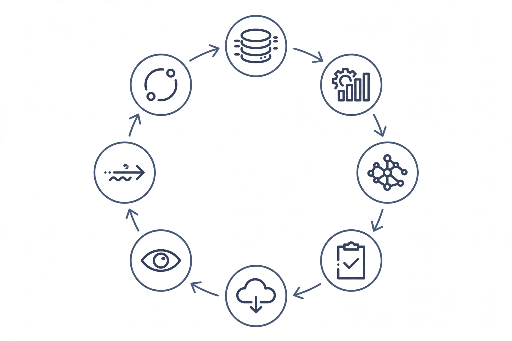

*The loop you will live in. Nothing on it is a one-time step. The arrow from monitoring back to data is the whole job.*

## Part 1. The role, in plain terms

### 1.1 What an ML engineer owns

An ML engineer owns the full path from a business problem to a model serving live traffic, and everything that keeps it serving correctly afterward. In most teams the scope breaks into four parts.

First, the data. You define what the training set is, where it comes from, and how it stays clean. If the labels are wrong, no model choice fixes it. A large share of production ML failures are data failures wearing a model costume.

Second, the training. You build the pipeline that turns data into a model artifact: feature computation, model fitting, hyperparameter search, validation. You make it repeatable. The same code and the same data must produce the same model, or close enough that the difference does not matter.

Third, the serving. You put the model behind an API or a batch job, meet latency and cost budgets, and roll out changes without breaking the product. A model that is accurate but too slow or too expensive is a research result, not a production system.

Fourth, the watching. You monitor inputs, predictions, and business outcomes after launch. Models decay. The world changes under them. You are the person who notices, figures out why, and retrains or rolls back.

The classical-versus-deep split matters less than newcomers expect. On tabular business data, gradient-boosted trees still win most fights (Chapter T6 has the numbers). On images, text, and audio, deep learning wins. You use both, and you pick with evidence, not fashion.

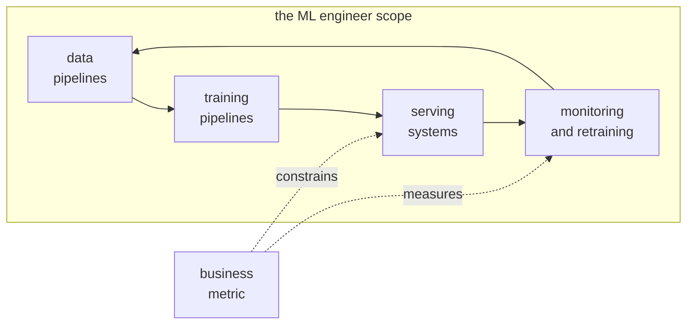

*Figure 1.1. The scope is a loop, not a pipeline. The business metric both measures the monitoring stage and constrains the serving stage (latency and cost budgets come from the product, not from the model).*

::: walkthrough
1. **Data pipelines feed training pipelines.** Features must be computed identically at train time and serve time. Any gap here is training/serving skew (Chapter T2).
2. **Training pipelines produce model artifacts.** Versioned, logged, and reproducible (Chapter T3).
3. **Serving systems expose the artifact.** With rollout discipline: shadow, canary, full (Chapter T4).
4. **Monitoring closes the loop.** Input drift, prediction drift, and business-metric decay all route back to data or training (Chapter T5).
:::

### 1.2 A week in the life

Monday starts with the dashboards. You check the overnight model health: prediction volume, latency percentiles, error rates, and the drift monitors from Chapter T5. Anything red gets triaged before new work starts.

Midweek is experiment work. You review the runs that finished, compare candidates against the current production model on the holdout set, and decide what graduates to the next stage. The discipline here is narrow: change one thing at a time, write down the hypothesis first, and let the numbers decide. Volume 2, Chapter 1 covers this loop in depth.

Later in the week comes the unglamorous core: data quality. A feature pipeline broke silently. A partner team changed a column definition. Labels arrived late. You fix the pipeline, backfill what you can, and add the validation check that would have caught it (Chapter T2).

Somewhere in the week there is a launch or a rollback. A new model goes to shadow traffic, then to 5 percent of live traffic, then wider, with guardrail metrics watched at each step (Chapter T4). If a guardrail trips, the canary rolls back automatically and you read the postmortem the next morning.

Through all of it runs the cost thread. Every model has a serving bill. You know the cost per thousand predictions for each model you own, and you can say which lever would cut it: a smaller model, distillation, a cascade, cheaper hardware (Chapter T7).

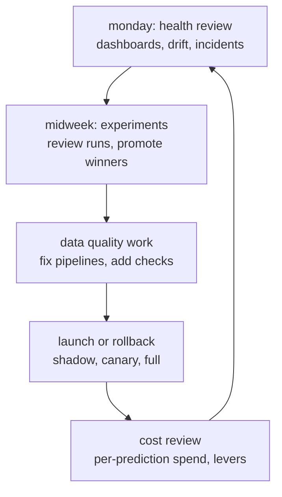

*Figure 1.2. The weekly rhythm. Notice what is missing: there is no "train a novel architecture" step. Novelty is a research activity. Your novelty budget goes into reliability.*

### 1.3 How the work is measured

ML engineers are measured on outcomes, not on model cleverness. The scorecard has four lines.

**Business metrics moved.** The model exists to change a number the business cares about: fraud loss rate, churn rate, click-through, support cost. Offline metrics like AUC are a proxy. The proxy is useful only while it predicts the real number. You track both, and you know the lag between them.

**Model freshness.** How old is the data the production model trained on? A model trained on last quarter's behavior and serving this quarter's customers is a bet that nothing changed. Freshness is measured in days since the last successful retrain, and every model you own has a target.

**Incident rate.** Failed predictions, serving outages, bad rollouts, data incidents. Counted per quarter, with severity. The goal is not zero. The goal is a low, known rate with fast detection and clean rollbacks.

**Serving SLOs and cost.** Latency percentiles, availability, and cost per prediction. A model that meets its accuracy target but misses its p99 latency target is a miss, full stop.

::: takeaway
- You own data, training, serving, and monitoring as one loop.
- Your week alternates between health review, experiments, data quality, launches, and cost review.
- You are measured on business metrics, model freshness, incident rate, and serving SLOs. Offline accuracy is a proxy, not the goal.
:::

## Part 2. Your reading path through the base curriculum

Read in this order. Tier 1 is the core of the job. Tier 2 fills the gaps you will hit in your first year. Tier 3 is reference material to consult when the work demands it.

| Tier | Volume | Chapters that matter most | Why they matter for this role |
|------|--------|---------------------------|-------------------------------|
| 1 | Vol 2, ML Foundations | Ch 1 experiment loop; Ch 2 splits; Ch 3 metrics beyond accuracy; Ch 4 leakage; Ch 5 is-the-win-real | This is your daily toolkit. Leakage (Ch 4) and the experiment loop (Ch 1) prevent the two most expensive mistakes in applied ML. |
| 1 | Vol 10, Productionizing | From notebook to service; data pipelines and freshness; training/serving skew; CI/CD and safe rollout; monitoring and drift; cost engineering | The conceptual home of this entire track. Read it before the role chapters below; they add implementation depth on top of it. |
| 1 | Vol 11, Research Methods + App 11A | Ch 2 experiment design; Ch 5 statistics lab; App 11A A/B design and judge calibration | Small metric deltas are your whole job. These chapters teach you to tell a real 1-point gain from noise. |
| 1 | Vol 13, ML System Design | Ch 0 numbers first; Ch 5 serving at scale; Ch 6 design questions; drill 5 cost model | Every serving decision starts with capacity math. The one-minute cost model is a career skill. |
| 2 | Vol 3, Deep Learning | Model selection; transfer learning; regularization chapters | For the day you move past trees onto unstructured data. Also teaches why deep models fail the way they do. |
| 2 | Vol 8, Inference Serving + App 8A | Batching and latency; App 8A inference economics | Cost per prediction lives here. Read alongside Chapter T7. |
| 2 | Vol 5, Pretraining | Data chapters; scaling concepts | Even if you never pretrain, you will fine-tune or prompt foundation models. Know what is inside them. |
| 2 | App 6A, Training Reliability | Checkpointing; stragglers; loss-spike handling | The first time you train anything for more than a day, this appendix pays for itself. |
| 2 | Vol 9A, Agent Evals | Eval design; gaming-resistant grading | The eval-design patterns transfer directly to model acceptance tests in Chapter T4. |
| 3 | Vol 1, Math for ML | Probability; optimization basics | Reference when the statistics chapters assume background you do not have. |
| 3 | Vol 4, LLM Internals + App 4A | Attention mechanics; long-context engineering | Reference when you serve or fine-tune language models. |
| 3 | Vol 7, Post-Training | SFT and preference tuning basics | Reference when your "model" is a fine-tuned LLM rather than a classifier. |
| 3 | Vol 12, Paper Spine | Reading method | Reference when you need to evaluate a new technique for production use. |
| 3 | Vol 14, Communicating Research | Writing results people trust | Reference when your experiment reviews need to convince a skeptical team. |
| 3 | Vol 15, GPU Kernels | Profiling basics | Reference when serving latency will not budge and you must look below the framework. |

A note on Vol 10 overlap. Volume 10 teaches the concepts: what shadow deployment is, what PSI measures, how canary math works. The role chapters in Part 3 do not repeat those concepts. They add the implementation layer Volume 10 stays above: working code for the detectors, the CI tests, the promotion gates, the distillation loop, and a full worked example from raw data to a deployed baseline. Read Vol 10 first, then build with Part 3.

::: takeaway
- Tier 1 (Vols 2, 10, 11, 13) is the job. Everything else supports it.
- Read Vol 10 before Part 3. The track chapters are implementation depth, not concept repeats.
:::

## Part 3. Role chapters

### Chapter T1. The ML lifecycle in practice

Every production model goes through the same five stages: frame the problem, build a baseline, iterate with discipline, validate honestly, and deploy something you can operate. Most failed ML projects skip stage one or two and pay for it in stage five.

#### T1.1 Problem framing: from business metric to ML objective

A business metric is not an ML objective until you write down three things: what you predict, what a mistake costs, and what threshold turns a score into an action.

Take churn prediction. The business metric is revenue retained. The ML objective is "predict P(churn in next 30 days) for each customer." The cost part is asymmetric. Missing a churner (false negative) costs the lost subscription. Flagging a loyal customer (false positive) costs a discount email. If a saved customer is worth $200 and the retention offer costs $20, a false negative costs roughly ten times a false positive. That ratio belongs in the objective, because it sets the decision threshold. A model with great AUC and a threshold picked at 0.5 by habit can still lose money.

Write the framing down before touching data. One page: the decision the model informs, the cost of each error type, the action taken at each score band, and the metric that will judge success in production. If you cannot write this page, you do not have a project yet. You have a dataset looking for a purpose.

#### T1.2 Baselines first

A baseline does three jobs. It sets the bar every later model must beat. It shakes out pipeline bugs early: if the baseline looks impossibly good, you have leakage, not genius. And it gives you something deployable on day one.

The baseline ladder, in order:

1. **A rule.** Hand-written, from domain sense. "Flag customers with 3+ support calls or 2+ late payments." It takes an hour and it is explainable to anyone.
2. **A constant.** Predict the majority class, or the base rate as a probability. This is the floor. If a trained model cannot beat "always predict no churn," something is broken.
3. **A linear model.** Logistic regression on simple features. Fast, calibrated, and a strong signal about whether the problem is mostly linear.
4. **A gradient-boosted tree.** Often the last step before deep learning, and often the last step, period (Chapter T6).

Only after the ladder do you consider anything fancier. Each rung must beat the last on the holdout set by a margin that survives the statistics in Volume 11, Chapter 5. "It felt better in the notebook" is not a rung.

#### T1.3 Iteration discipline

Once a baseline exists, improvement follows a strict loop: form one hypothesis, change one thing, measure on data the model has never seen, and write down the result before moving on. Volume 2, Chapter 1 covers the loop in full. Three rules keep it honest.

**One variable at a time.** If you add two features and tune the learning rate in the same run, you cannot attribute the gain. You will also be unable to reproduce it, because you will not remember which change mattered.

**The holdout is sacred.** Tune on validation, report on test, touch the test set once per project milestone. Every peek at the test set spends a little of its honesty. Volume 2, Chapter 2 has the mechanics.

**Check for leakage on every win.** A surprising jump in score is guilty until proven innocent. The usual suspects: features computed with future knowledge, duplicates across the split, target-derived columns. Volume 2, Chapter 4 is the full taxonomy. Run its checks before celebrating.

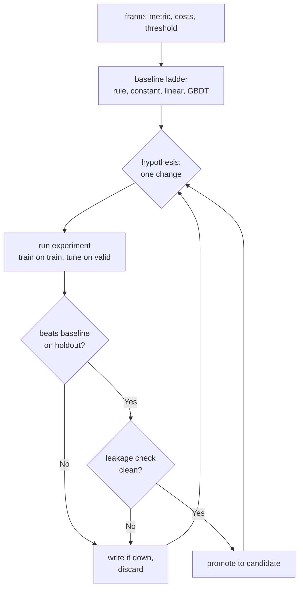

*Figure T1.1. The iteration loop. Failed experiments are written down, not silently deleted: a discarded hypothesis is knowledge, and the log stops the team from re-running it in six months.*

::: walkthrough
1. **Framing comes before data.** The cost ratio sets the threshold, and the threshold sets which metric you optimize. Skipping this is the most common root cause of "the model works but the business does not move."
2. **The baseline ladder is ordered by effort.** Each rung is cheap and each one catches a different class of mistake: rules catch framing errors, the constant catches broken pipelines, linear catches non-problems, trees catch most of the rest.
3. **The loop has two exits.** "No" goes to the log. "Yes, but leaky" also goes to the log. Only "yes and clean" promotes. This is what keeps a year of experiments compounding instead of drifting.
:::

#### T1.4 Worked example: from raw data to a deployed baseline

A subscription business wants to predict churn in the next 30 days. We walk the full path: generate representative data, build the baseline ladder, pick a threshold from the cost ratio, package the artifact, and write the serving function. Every number below comes from actually running this code.

**Step 1. Data.** We simulate 20,000 customers with five fields: tenure in months, monthly bill, support calls in the last quarter, late payments, and plan tier. Churn depends on those fields plus noise. The base churn rate is 17.8 percent.

**Step 2. Baselines.** The hand rule (3+ support calls or 2+ late payments) reaches precision 0.284 and recall 0.363: it catches about a third of churners and is wrong about seven in ten flags. Logistic regression reaches AUC 0.7065 on the holdout set. Gradient-boosted trees reach AUC 0.6926, slightly worse. That last fact is worth pausing on. The fancier model lost. The signal here is mostly linear, and the honest move is to ship the linear model, not to tune the tree until it wins by luck. This is the baseline ladder doing its job.

```python
import numpy as np
import pandas as pd
from sklearn.model_selection import train_test_split
from sklearn.linear_model import LogisticRegression
from sklearn.ensemble import HistGradientBoostingClassifier
from sklearn.metrics import roc_auc_score, precision_score, recall_score
import joblib

# WHAT: build a representative customer table with a known churn process.
# WHY: a worked example needs data; the generator below stands in for the
#   warehouse extract. The true churn rate lands at 17.8 percent.
# WHAT BREAKS: in real data you do not know the true process, so every
#   modeling choice must be validated on a holdout set instead of trusted.
rng = np.random.default_rng(7)
n = 20000
tenure = rng.integers(1, 73, n)                    # months as a customer
bill = rng.normal(70, 20, n).clip(20, 150)        # monthly bill in dollars
calls = rng.poisson(1.2, n)                       # support calls last quarter
late = rng.poisson(0.6, n)                        # late payments last year
plan = rng.choice(["basic", "plus", "pro"], n, p=[0.5, 0.3, 0.2])
logit = (-2.2 + 0.35 * calls + 0.5 * late - 0.03 * tenure
         + 0.008 * bill + (plan == "basic") * 0.4 + rng.normal(0, 0.5, n))
churn = (rng.random(n) < 1 / (1 + np.exp(-logit))).astype(int)
df = pd.DataFrame({"tenure": tenure, "bill": bill, "calls": calls,
                   "late": late, "plan": plan, "churn": churn})

# WHAT: rung 1 of the ladder, a hand-written rule from domain sense.
# WHY: it takes minutes, anyone can audit it, and it sets the bar.
# WHAT BREAKS: rules rot as behavior changes; treat the rule as a baseline
#   to beat, not as a model to keep.
rule = ((df["calls"] >= 3) | (df["late"] >= 2)).astype(int)
print("rule precision/recall:",
      round(precision_score(df["churn"], rule), 3),
      round(recall_score(df["churn"], rule), 3))

# WHAT: encode features once, in ONE function used by training AND serving.
# WHY: reusing the exact transform is the cheapest skew prevention there is.
#   A second copy of this logic in the serving path will drift (Chapter T2).
# WHAT BREAKS: if the plan tiers change upstream, get_dummies silently
#   produces different columns. The CI data tests in Chapter T4 guard this.
def featurize(frame):
    out = frame[["tenure", "bill", "calls", "late"]].copy()
    for tier in ["basic", "plus", "pro"]:
        out["plan_" + tier] = (frame["plan"] == tier).astype(int)
    return out[["tenure", "bill", "calls", "late",
                "plan_basic", "plan_plus", "plan_pro"]]

X = featurize(df)
# WHAT: stratified split, fixed seed, test set touched once.
# WHY: stratification keeps the 17.8 percent churn rate in every split so
#   small-sample noise does not fake a win. The seed makes it repeatable.
X_train, X_test, y_train, y_test = train_test_split(
    X, df["churn"], test_size=0.25, random_state=11, stratify=df["churn"])

# WHAT: rungs 3 and 4 of the ladder, trained on the same split.
# WHY: same data and same seed means the AUC gap measures the model,
#   not the luck of the split.
lin = LogisticRegression(max_iter=500).fit(X_train, y_train)
gbt = HistGradientBoostingClassifier(random_state=11).fit(X_train, y_train)
auc_lin = roc_auc_score(y_test, lin.predict_proba(X_test)[:, 1])
auc_gbt = roc_auc_score(y_test, gbt.predict_proba(X_test)[:, 1])
print("logreg AUC:", round(auc_lin, 4), " gbdt AUC:", round(auc_gbt, 4))
# Result: 0.7065 vs 0.6926. The linear model wins. Ship the linear model.
```

**Step 3. Threshold from the cost ratio.** A false negative (missed churner) costs about $200 in lost revenue. A false positive (a retention offer to a loyal customer) costs about $20. With a 10 to 1 ratio, the expected-cost threshold sits far below 0.5: you act on weaker signals because missing is expensive. The code below scans thresholds on the validation predictions and picks the one with the lowest expected cost.

```python
# WHAT: choose the operating threshold from dollars, not from habit.
# WHY: the model outputs probabilities; the business needs yes/no actions.
#   The 10-to-1 cost ratio below comes from the framing page (Section T1.1).
# WHAT BREAKS: if the cost ratio is a guess, the threshold is a guess.
#   Recompute it quarterly; retention costs and churn values move.
probs = lin.predict_proba(X_test)[:, 1]
COST_FN, COST_FP = 200.0, 20.0
best_t, best_cost = 0.5, float("inf")
for t in np.arange(0.05, 0.95, 0.05):          # scan candidate thresholds
    pred = (probs >= t).astype(int)
    fn = int(((pred == 0) & (y_test == 1)).sum())  # missed churners
    fp = int(((pred == 1) & (y_test == 0)).sum())  # wasted offers
    cost = fn * COST_FN + fp * COST_FP
    if cost < best_cost:
        best_t, best_cost = t, cost
print("chosen threshold:", round(best_t, 2),
      "expected cost: $", round(best_cost, 0))
```

**Step 4. Package and serve.** The artifact is a dict: the fitted model, the threshold, the feature list, and metadata (training date, data hash, code version). The serving function loads it and applies the same `featurize`. Nothing clever, and that is the point: the serving path is the shortest possible distance from the training path.

```python
# WHAT: bundle everything serving needs into one versioned artifact.
# WHY: a model file without its threshold, feature list, and provenance
#   is undeployable. The metadata answers "which data trained this?" later.
# WHAT BREAKS: unpickling untrusted files runs arbitrary code. Artifacts
#   come only from your own registry (Chapter T3), never from a stranger.
artifact = {
    "model": lin,
    "threshold": best_t,
    "features": list(X.columns),
    "trained_on": "2026-09-28",
    "data_hash": "sha256-of-training-extract",
    "code_version": "git-sha-of-this-script",
}
joblib.dump(artifact, "churn_baseline_v1.joblib")

# WHAT: the entire serving path for the baseline.
# WHY: one function, same featurize as training, threshold from the
#   artifact. Short enough to audit in a minute.
# WHAT BREAKS: input validation is missing here for brevity. Production
#   serving validates every field before featurize (Chapter T4 data tests).
_bundle = joblib.load("churn_baseline_v1.joblib")

def predict_churn(customer):
    """customer: dict with tenure, bill, calls, late, plan. Returns 0/1."""
    row = pd.DataFrame([customer])          # one row, same column names
    x = featurize(row)[_bundle["features"]]  # identical transform, identical order
    p = float(_bundle["model"].predict_proba(x)[0, 1])
    return int(p >= _bundle["threshold"])    # business threshold, not 0.5
```

::: takeaway
- Frame first: decision, error costs, threshold, production metric. One page, before data.
- Climb the baseline ladder in order. A fancier model that loses to logistic regression is information, not failure.
- Set the threshold from the cost ratio. The 10-to-1 ratio here moves the threshold far from 0.5.
- The artifact carries model, threshold, features, and provenance. Serving reuses the training transform exactly.
:::

### Chapter T2. Feature pipelines and data quality

Models do not eat raw data. They eat features: cleaned, joined, aggregated, and encoded columns produced by a pipeline. In production, the feature pipeline is the largest source of silent failures. The model rarely breaks. The data feeding it breaks weekly.

#### T2.1 Batch, streaming, and the freshness ladder

Features arrive on two clocks. Batch features are computed on a schedule: nightly aggregates like "support calls in the last 90 days." Streaming features are computed on events: "seconds since the last login," updated with every click. Volume 10 covers the freshness ladder in detail. The practical rule: match the feature clock to the decision clock. A fraud model scoring live transactions cannot wait for a nightly job. A churn model scored weekly has no use for millisecond features.

The failure mode to respect is the silent stall. A batch job fails, the retry also fails, and the pipeline keeps serving yesterday's features with today's timestamps. Nothing errors. The model just gets stale. Every feature pipeline needs a freshness check: the maximum age of the newest row, alerted when it passes the SLA. Freshness is a first-class metric, next to accuracy.

#### T2.2 Point-in-time correctness: the invariant that matters most

The single most important property of a training pipeline is point-in-time correctness: every feature value used in training must be the value that was knowable at the time of the label, never later.

The classic violation: computing "total support calls" over all history, including calls that happened after the churn event. The model learns that churned customers made many calls, because the feature saw the future. Offline metrics look fantastic. In production, where the future is not available, the model collapses. This is leakage wearing a pipeline costume, and it is the most expensive bug in applied ML because it survives every offline check.

The fix is mechanical: every feature join carries an event timestamp, and the training query filters features to `feature_time <= label_time`. Write that filter once, in a shared function, and test it with a synthetic case where the answer is known. Volume 2, Chapter 4 covers the detection side.

```
TRAINING ROW, done right
  label_time ......... 2026-06-01   (churn observed in June)
  feature window ..... calls counted only up to 2026-06-01
  excluded ........... the angry call on 2026-06-05 (after the label)

TRAINING ROW, the bug
  label_time ......... 2026-06-01
  feature window ..... calls counted over ALL history
  leaked ............. the 2026-06-05 call is inside the feature
  result ............. offline AUC 0.94, production AUC 0.61
```

*Figure T2.1. The same row, built two ways. The numbers at the bottom are the shape of this bug: a large offline-to-production gap with no code change in between.*

#### T2.3 The feature store pattern

A feature store is two databases with one definition. The offline store holds historical feature values for training, with full point-in-time history. The online store holds the latest values for serving, keyed for millisecond lookup. Both are computed from the same transformation code. That last sentence is the entire pattern. Everything else is engineering.

Why it matters: without a store, training and serving each reimplement feature logic, and the two copies drift apart. That drift is training/serving skew, the topic of the next section. With a store, there is one definition, two materializations, and a test that the materializations agree.

You do not need to buy a feature store on day one. A versioned SQL query plus a key-value cache is a feature store with a small name. What you need from day one is the invariant: one definition, used in both places, with a consistency check.

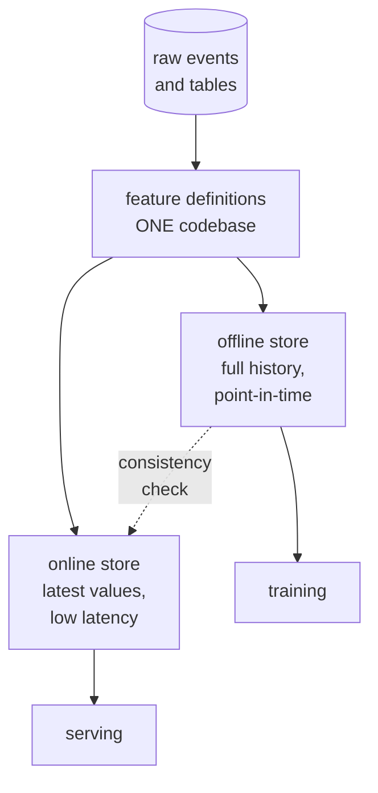

*Figure T2.2. The feature store pattern. The dashed check compares offline and online values for the same entity and timestamp on a sample. A mismatch pages someone.*

#### T2.4 Training/serving skew: detection and fixes

Skew means the serving features come from a different distribution than the training features. The three classic shapes, from Volume 10: the transform differs (two code paths), the data differs (a column changed upstream), or the population differs (the product launched in a new market). The image below shows the symptom: the serving distribution has moved away from the training distribution.

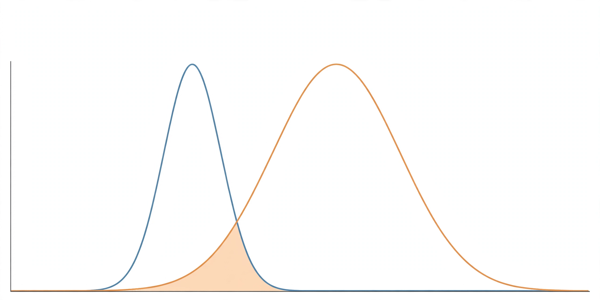

*The blue curve is what the model trained on. The orange curve is what serving sees. A model is a contract with a distribution; move the distribution and the contract is void.*

Detection is statistical. For numeric features, the workhorses are PSI (Population Stability Index) and the Kolmogorov-Smirnov test. For categorical features, the chi-square test. The code below implements all three on a synthetic example where serving data has genuinely shifted. The numbers are real, from running it: PSI 0.285 on the drifted window (above the 0.25 "investigate now" line) versus 0.003 on a clean window.

```python
import numpy as np
from scipy import stats

# WHAT: three drift detectors for one feature, training vs serving windows.
# WHY: eyeballing histograms does not scale to 400 features. These three
#   cover numeric shift (PSI, KS) and categorical shift (chi-square).
# WHAT BREAKS: detectors fire on seasonal wiggles too. Tune thresholds on
#   YOUR history, and always pair a statistic with a human-readable plot.
def psi(expected, actual, buckets=10):
    # Population Stability Index. Compares binned shares between windows.
    # Rule of thumb: below 0.1 is noise, 0.1-0.25 is a watch, above 0.25
    # means the distribution moved enough to investigate.
    qs = np.quantile(expected, np.linspace(0, 1, buckets + 1))
    qs[0], qs[-1] = -np.inf, np.inf      # outer bins catch the tails
    e = np.histogram(expected, bins=qs)[0] / len(expected)
    a = np.histogram(actual, bins=qs)[0] / len(actual)
    e = np.clip(e, 1e-4, None)           # avoid log(0); floor, do not drop
    a = np.clip(a, 1e-4, None)
    return float(np.sum((a - e) * np.log(a / e)))

def ks_drift(a, b):
    # Kolmogorov-Smirnov: largest gap between the two CDFs. Returns the
    # gap and a p-value. Distribution-free, but twitchy on huge samples.
    r = stats.ks_2samp(a, b)
    return r.statistic, r.pvalue

def chi2_drift(a, b):
    # Chi-square for categorical features: are the category shares the same?
    cats = sorted(set(a) | set(b))
    obs = [np.sum(b == c) for c in cats]
    exp = [np.sum(a == c) / len(a) * len(b) for c in cats]
    return stats.chisquare(obs, exp)

rng = np.random.default_rng(3)
train_win = rng.normal(0, 1, 20000)        # what the model trained on
serve_win = rng.normal(0.55, 1.25, 5000)  # this week's serving traffic: shifted
print("PSI drifted:", round(psi(train_win, serve_win), 3))   # 0.285: investigate
print("PSI clean:  ", round(psi(train_win, rng.normal(0, 1, 5000)), 3))  # 0.003
print("KS stat:    ", round(ks_drift(train_win, serve_win)[0], 3))        # 0.23
```

::: walkthrough
1. **PSI bins on the training quantiles.** Bin edges come from the training window so the bins mean the same thing in both windows. Clipping at 1e-4 avoids log(0) without silently dropping empty bins.
2. **The drifted window scores 0.285.** That is past the 0.25 line: page the owner, do not just log it. The clean window scores 0.003, which is what "nothing happened" looks like.
3. **KS agrees (statistic 0.23, tiny p-value).** Two detectors agreeing is the signal. One detector firing alone, on one feature, on a holiday week, is usually seasonality.
:::

Fixes, in order of preference. First, fix the cause: repair the broken pipeline, revert the upstream schema change, or retrain on the new population. Second, share the transform code between training and serving so the "transform differs" shape cannot recur. Third, log a sample of serving features back into the offline store, so every skew has a forensic trail. What you do not do is silently retrain on the drifted data and hope. That launders the bug into the model.

::: callout warn
The most dangerous skew is the one that improves offline metrics. A feature that leaks the future (Section T2.2) always looks like a win in training. If a new feature jumps AUC by a suspicious amount, check point-in-time correctness before you check anything else.
:::

::: takeaway
- Match the feature clock to the decision clock, and alert on freshness like it is accuracy.
- Point-in-time correctness is the key invariant: no feature may see past its label.
- One feature definition, two stores, and a consistency check between them.
- Detect skew with PSI, KS, and chi-square. Fix the cause first, share the transform code second, log serving features third.
:::

### Chapter T3. Experiment tracking and model registry

An experiment you cannot reproduce is a rumor. Tracking turns runs into records: what code, what data, what parameters, what metrics, what artifact. The registry turns records into decisions: which artifact is in staging, which is in production, and who approved the move.

#### T3.1 What to log

Log everything needed to rebuild the run from scratch, and nothing you cannot act on. The required fields:

- **Code version.** The git commit of the training script. "The latest main" is not a version.
- **Data version.** A hash or snapshot id of the training extract. Data changes more often than code, and silently.
- **Parameters.** Hyperparameters, the random seed, and the environment (library versions). Seeds matter: an untracked seed makes the run unrepeatable.
- **Metrics.** On train, validation, and the locked test set, with the exact metric definitions. Log the confusion matrix or the full score distribution, not just the headline number.
- **Artifacts.** The model file, the preprocessing object, the feature list, and the evaluation report. If it is not stored, it did not happen.
- **Lineage.** The parent run this run was forked from, and the hypothesis it tested. This turns a pile of runs into a readable history.

The tools for this are MLflow, Weights and Biases, and their cousins. The tool matters less than the schema. Below is a minimal tracker in pure Python that shows the shape: every run is one JSON line with the fields above, and comparison is a table over those lines.

```python
import json, time, hashlib

# WHAT: a minimal experiment tracker: one JSON line per run.
# WHY: shows the required schema without hiding it inside a vendor API.
#   Production teams use MLflow or Weights and Biases; the FIELDS are the
#   same no matter the tool, and the fields are what this chapter teaches.
# WHAT BREAKS: concurrent writers can interleave lines. Real trackers use
#   a database. This file version is for learning the schema, not for scale.
class RunTracker:
    def __init__(self, path="runs.jsonl"):
        self.path = path

    def log_run(self, name, params, metrics, data_desc, code_version,
                parent=None, hypothesis=""):
        # Every field answers a future question: "why did we pick this run?"
        # params/data/code let you REBUILD it; metrics let you COMPARE it;
        # parent/hypothesis let you UNDERSTAND the sequence of tries.
        record = {
            "name": name,
            "ts": time.strftime("%Y-%m-%dT%H:%M:%S"),
            "hypothesis": hypothesis,      # one sentence, written BEFORE the run
            "parent": parent,              # which run this one forked from
            "params": params,              # hyperparameters + seed
            "data": data_desc,             # dataset hash or snapshot id
            "code": code_version,          # git commit, never "latest"
            "metrics": metrics,            # valid AND test, with definitions
        }
        # A run id derived from the content: identical reruns get identical ids,
        # which makes accidental duplicate runs visible instead of silent.
        record["run_id"] = hashlib.sha256(
            json.dumps(record, sort_keys=True).encode()).hexdigest()[:12]
        with open(self.path, "a") as f:
            f.write(json.dumps(record) + "\n")
        return record["run_id"]

    def compare(self, metric="test_auc"):
        # WHAT: the comparison view: one row per run, sorted by the metric.
        # WHY: decisions come from tables, not from scrolling through logs.
        rows = [json.loads(line) for line in open(self.path)]
        rows.sort(key=lambda r: r["metrics"].get(metric, 0), reverse=True)
        for r in rows:
            print(f"{r['run_id']}  {r['name']:28s} {metric}={r['metrics'].get(metric)}"
                  f"  parent={r['parent']}  data={r['data'][:10]}")
```

#### T3.2 How to compare runs

Sort by the metric, then interrogate the top rows. Three questions, in order.

**Is the delta real?** A 0.3-point AUC gain on a 5,000-row test set is usually noise. Use the paired bootstrap from Volume 11, Chapter 5 before promoting anything. The tracker stores the per-run predictions (or their hash) so the comparison is paired on the same items.

**Is the delta stable?** Rerun the winner with a different seed. If the gain survives three seeds, it is a property of the idea. If it survives one, it is a property of the seed.

**Is the delta worth it?** A 0.2-point gain that doubles serving cost or adds a fragile feature is a bad trade. The comparison table should carry cost and latency columns next to accuracy, because the promotion decision weighs all three (Chapter T7).

```
run_id        name                          test_auc  parent    data
a91f...       gbt_depth6_lr0.05             0.6926    3c20...   sha256:9f2e
3c20...       logreg_C1.0                   0.7065    77ab...   sha256:9f2e
77ab...       rule_baseline                 n/a       none      sha256:9f2e

decision: logreg wins on the same data hash. gbt adds complexity for
negative gain. promote logreg_C1.0 to staging. rerun gbt with new seed
only if a hypothesis explains the loss.
```

*Figure T3.1. A comparison table with a decision written under it. The decision names the winner, the reason, and what happens to the loser. Tables without decisions are archives. Tables with decisions are engineering.*

#### T3.3 Promotion gates: from run to production

A model registry tracks artifacts through stages: none, staging, production, archived. Movement between stages is gated, and the gates are the difference between "we deployed a model" and "we have a deployment process."

**Gate 1: automated checks.** The candidate artifact must pass the CI suite from Chapter T4: data tests, model tests, and the golden-set performance floor. No human needed, no exceptions granted.

**Gate 2: offline review.** A second engineer reads the experiment record: the hypothesis, the comparison table, the leakage check. This takes thirty minutes and catches the errors automation cannot see, like a test set that quietly overlaps the training window.

**Gate 3: shadow then canary.** The model serves real traffic without affecting users (shadow), then a small slice of live traffic (canary), with guardrail metrics at each step. Chapter T4 has the mechanics and the math.

**Gate 4: sign-off and rollback plan.** A named human approves, and the rollback is one command that restores the previous artifact. If rollback takes more than minutes, the gate is theater.

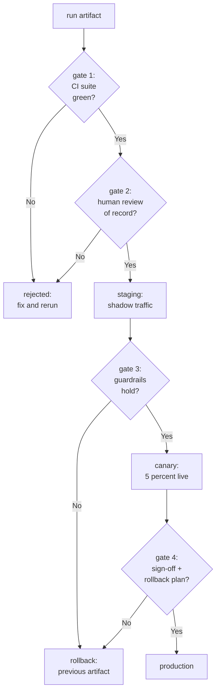

*Figure T3.2. The promotion ladder. Every arrow forward has a named gate; every gate has a defined failure path. Note the rollback arrow points at the previous artifact, not at "fix forward."*

::: takeaway
- Log code, data, params, metrics, artifacts, and lineage. The schema matters more than the tool.
- Compare with tables, test deltas for significance, rerun winners on new seeds, and weigh cost next to accuracy.
- Promote through four gates: CI, human review, shadow and canary, sign-off with a one-command rollback.
:::

### Chapter T4. CI/CD for ML

Software CI runs tests on every commit. ML CI runs tests on every commit, every data refresh, and every model artifact. The extra two triggers exist because ML has two more things that break: the data and the model. A pipeline that tests only code is testing one third of the system.

#### T4.1 Data tests

Data tests run in CI against a sample of the training extract, and again as a gate before every training run. They check the contract the pipeline promises the model.

- **Schema.** The expected columns exist, with the expected types. A renamed column should fail loudly here, not silently produce nulls downstream.
- **Null and range rates.** Each column's null share stays under its threshold; numeric columns stay inside plausible bounds. Thresholds come from history: the 99th percentile of the last 90 days, not a guess.
- **Category sets.** Categorical columns contain only known values. A new plan tier appearing overnight is either a product launch or a bug, and the test forces someone to say which.
- **Freshness.** The newest row is younger than the SLA. This is the silent-stall detector from Chapter T2.
- **Label sanity.** The label distribution has not jumped. A churn rate moving from 18 percent to 40 percent overnight is a labeling bug until proven otherwise.

```python
import pandas as pd

# WHAT: the data contract, checked in CI on every extract.
# WHY: five cheap assertions catch the failures that waste GPU weeks:
#   a renamed column, a stalled pipeline, a broken label join.
# WHAT BREAKS: thresholds drift as the product changes. Review them
#   quarterly, and version them with the pipeline code, not in a wiki.
def test_training_extract(df):
    # Schema: exact columns, exact dtypes. A silent rename becomes nulls;
    # this turns it into a loud failure instead.
    expected = {"tenure": "int64", "bill": "float64", "calls": "int64",
                "late": "int64", "plan": "object", "churn": "int64"}
    assert set(df.columns) == set(expected), f"schema changed: {df.columns.tolist()}"
    for col, dtype in expected.items():
        assert str(df[col].dtype) == dtype, f"{col} is {df[col].dtype}, want {dtype}"

    # Nulls: no column may cross its historical ceiling.
    assert df.isna().mean().max() < 0.01, "null share above 1 percent"

    # Ranges: bills are positive and bounded; tenure fits the product age.
    assert df["bill"].between(0, 1000).all(), "bill out of range"
    assert df["tenure"].between(1, 120).all(), "tenure out of range"

    # Categories: unknown plan tiers force a human to confirm the launch.
    assert set(df["plan"].unique()) <= {"basic", "plus", "pro"}, "new plan tier"

    # Label sanity: churn between 5 and 35 percent. Outside that, the
    # label join is broken until a human says otherwise.
    rate = df["churn"].mean()
    assert 0.05 < rate < 0.35, f"churn rate {rate:.3f} looks wrong"
    return True
```

#### T4.2 Model tests

Model tests treat the trained artifact like any other software artifact: unit-tested, invariant-checked, and held to a performance floor.

- **Preprocessing unit tests.** Feed known inputs through `featurize` and assert exact outputs, including edge cases: missing plan tier, zero tenure, extreme bill. The serving path uses the same function, so these tests guard both.
- **Invariance tests.** Properties the model must satisfy regardless of accuracy. Predictions are probabilities in [0, 1]. The model is deterministic for a fixed input: no randomness at serve time. A clearly good customer scores below a clearly bad one (monotonicity spot checks on synthetic pairs).
- **Golden-set floor.** A fixed, hand-reviewed set of a few hundred examples with known-correct labels. The candidate must beat the current production model's score on this set, or at least not regress beyond a small tolerance. The golden set never trains anything. It only judges.
- **Latency test.** The artifact must score a single request within the p99 budget on production-like hardware. A model that passes accuracy and fails latency is rejected at this gate, not discovered in production.

#### T4.3 Shadow deployment

Shadow deployment serves the candidate on live traffic without affecting users. Requests are duplicated: production serves the user, the shadow model scores a copy, and both predictions are logged. Nothing the shadow model says reaches a customer.

Shadow answers the questions offline eval cannot: does the candidate handle the real input distribution, including the malformed rows the training set never had? Does it meet latency under real concurrency? Do its predictions correlate with the production model's, or does it disagree in a pattern that suggests a bug?

Run shadow for at least one full business cycle: a week for weekly-seasonal traffic, a month for monthly. Shorter runs miss the weekend, the payday, the holiday. Compare with the detectors from Chapter T5: prediction distribution of shadow versus production should match unless the candidate is intentionally different, and any difference needs an explanation before the canary.

#### T4.4 Canary analysis

A canary serves the candidate to a small slice of live traffic, typically 1 to 5 percent, and watches guardrail metrics against the production baseline. The rollout ladder from Volume 10 is: shadow, then canary, then full. The analysis below is the decision logic: promote, hold, or roll back.

Guardrails come in three kinds. **Business guardrails**: the metric the model serves (conversion, fraud loss) must not regress beyond tolerance. **Model guardrails**: prediction distribution and calibration must stay within bounds. **System guardrails**: latency, error rate, and cost per prediction must hold.

```python
# WHAT: the canary decision, as code. Compares guardrail metrics between
#   the canary slice and the production baseline over the canary window.
# WHY: "looks fine on the dashboard" is not a decision procedure. Coded
#   rules make the promote/hold/rollback call consistent at 3 a.m.
# WHAT BREAKS: short windows lie. A 2-hour canary cannot see daily
#   seasonality. Minimum window is one full business cycle (Section T4.3).
def canary_decision(canary, baseline):
    # Each metric: (canary_value, baseline_value, tolerance, worse_direction).
    # Tolerances are set from the metric's normal wobble, measured on
    # history, so the canary is judged against reality, not against zero.
    guardrails = {
        "conversion_rate": (canary["conv"], baseline["conv"], 0.02, "lower"),
        "p99_latency_ms":  (canary["p99"], baseline["p99"], 0.15, "higher"),
        "error_rate":      (canary["err"], baseline["err"], 0.50, "higher"),
        "cost_per_1k":     (canary["cost"], baseline["cost"], 0.10, "higher"),
    }
    verdicts = {}
    for name, (c, b, tol, worse) in guardrails.items():
        rel = (c - b) / b if b else 0.0       # relative change vs baseline
        tripped = (rel < -tol) if worse == "lower" else (rel > tol)
        verdicts[name] = ("TRIPPED", round(rel, 3)) if tripped else ("ok", round(rel, 3))
    tripped = [n for n, (v, _) in verdicts.items() if v == "TRIPPED"]
    # One tripped guardrail holds the canary for human review. Two or more
    # roll back immediately: correlated failures are never coincidence.
    if len(tripped) >= 2:
        return "ROLLBACK", verdicts
    if len(tripped) == 1:
        return "HOLD_FOR_REVIEW", verdicts
    return "PROMOTE", verdicts
```

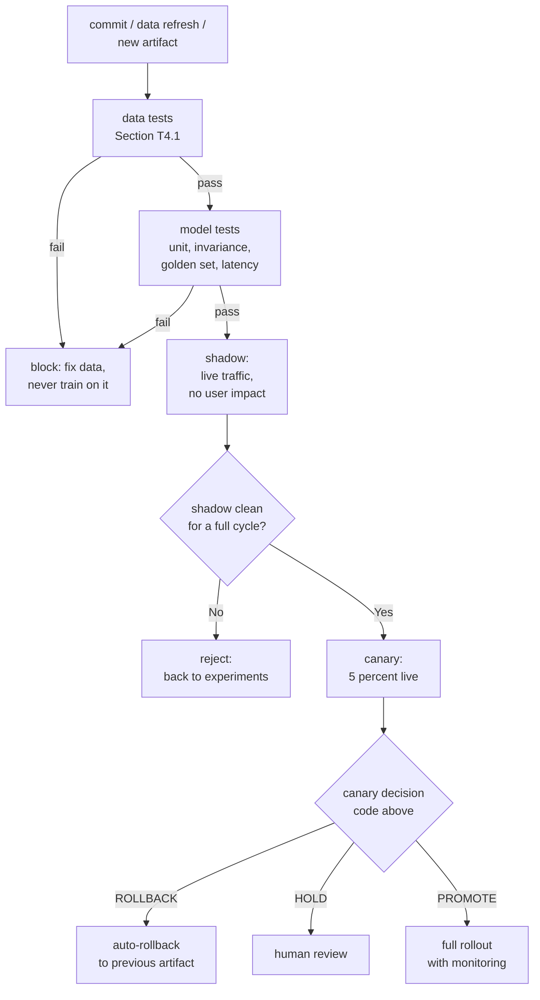

*Figure T4.1. The ML deployment pipeline. Three triggers feed it (code, data, artifact); every stage has a defined failure exit; rollback restores the previous artifact rather than attempting a forward fix under pressure.*

::: walkthrough
1. **Data tests run before any training.** Training on a broken extract wastes the run and, worse, can produce a plausible-looking bad model. The tests are cheap; the GPU hours are not.
2. **Shadow is the first contact with reality.** It catches malformed live inputs and concurrency latency that no offline eval can. One full business cycle is the minimum.
3. **The canary decision is code, not vibes.** Tolerances come from historical wobble. One trip holds, two trips roll back, and the rollback is automatic.
:::

::: takeaway
- CI covers code, data, and the artifact. Data tests check schema, nulls, ranges, categories, freshness, and label sanity.
- Model tests check preprocessing, invariants, the golden-set floor, and latency.
- Shadow first (no user impact, full business cycle), then canary with coded guardrail decisions: one trip holds, two trips roll back.
:::

### Chapter T5. Monitoring and drift

Deployment is the middle of the story, not the end. The day a model ships, the world starts changing under it: customer behavior shifts, upstream pipelines change, the product launches in new markets. Monitoring is how you notice. Drift detection is how you measure what you noticed. Retraining triggers are how you act.

#### T5.1 What to monitor: four layers

**Layer 1: inputs.** Feature distributions, null rates, and freshness, per feature. This is where most incidents start, and the detectors from Chapter T2 live here.

**Layer 2: predictions.** The distribution of model outputs. If the churn model suddenly flags twice as many customers, either the world changed or the model broke. Prediction drift needs no labels, so it is always available. It is also ambiguous: a real change in customer behavior looks identical to a broken feature. Layer 1 disambiguates.

**Layer 3: outcomes.** Ground-truth labels and the business metric, as they arrive. Labels lag: churn is known 30 days after the prediction. This layer is the slowest and the most authoritative. When it disagrees with Layer 2, believe Layer 3.

**Layer 4: system.** Latency, error rate, throughput, cost. The model can be statistically perfect and still failing if p99 latency tripled.

Volume 10 covers the four golden signals for ML systems in depth. The operational rule: alert on Layers 1, 2, and 4 in minutes; review Layer 3 on its natural cadence (daily or weekly). A monitoring setup that only watches accuracy is blind for the weeks that labels take to arrive.

#### T5.2 Drift detection methods

Chapter T2 introduced PSI, KS, and chi-square for training/serving skew. The same three run in production, comparing a rolling serving window against the training baseline. Two more methods complete the toolkit.

**Embedding drift.** For models that consume embeddings (text, images), monitor the distance between the mean embedding of the serving window and the training mean, or track the drift of a low-dimensional projection. A single number per window, trended over time, catches semantic shifts that per-feature tests miss.

**Prediction drift.** Apply PSI or KS to the model's own output scores. This is the cheapest monitor to run and often the first to fire. Its weakness is ambiguity (Section T5.1): it tells you something moved, not what.

Thresholds deserve honesty: there is no universal PSI cutoff. The 0.1/0.25 rule of thumb from Chapter T2 is a starting point. The right threshold for your feature is the level at which past alerts correlated with real incidents. Tune per feature, review quarterly, and keep a plot next to every number. A statistic without its trend line is a rumor.

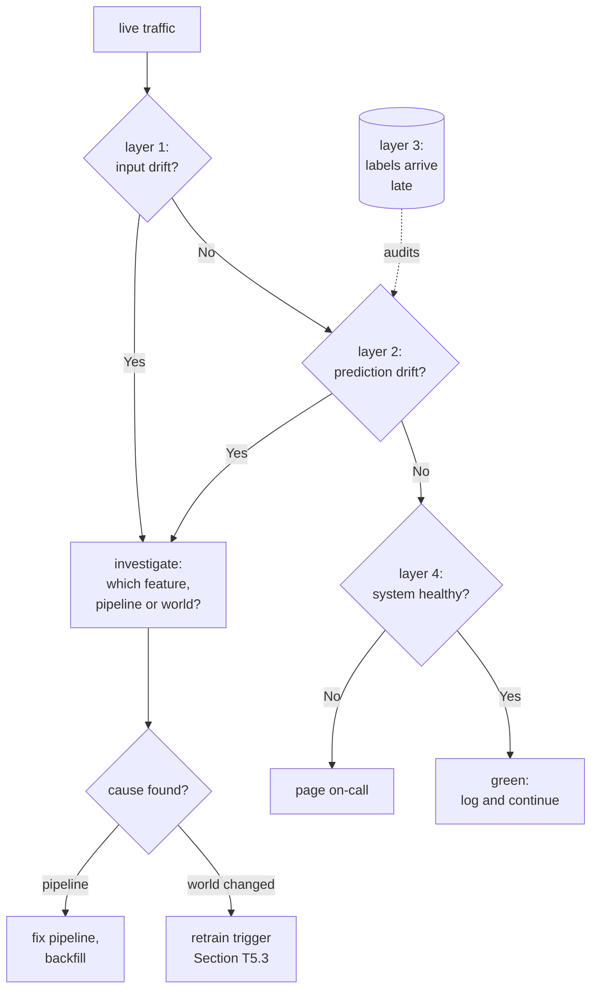

*Figure T5.1. The monitoring triage flow. Layers 1, 2, and 4 alert in minutes. Layer 3 audits on label cadence. Every "world changed" finding routes to a retraining decision, not to silent acceptance.*

#### T5.3 Retraining triggers

A model should be retrained when the world has moved enough that the current artifact is the wrong model for the current data. Three trigger styles, usually combined.

**Scheduled.** Retrain every N days regardless. Simple, predictable, and the right default for slowly changing domains. The schedule comes from measuring how fast performance decays: if AUC drops 1 point per month, monthly retraining holds the line.

**Threshold.** Retrain when a monitor trips: PSI above the per-feature line for K consecutive windows, or Layer 3 business metric down by the agreed amount. Thresholds avoid retraining on noise, but they need the tuning discipline from Section T5.2.

**Event-driven.** Retrain on known world changes: a product launch, a new market, a pricing change, a schema migration. These are calendar events, not statistical ones. The launch checklist (Appendix A) includes "does this launch invalidate any model?" as a line item.

The retrain itself is a pipeline run, not a heroic effort. The fresh extract passes the data tests (T4.1). Training runs the tracked config (T3.1). The candidate clears the promotion gates (T3.3). The rollout follows the shadow-canary ladder (T4.3, T4.4). If retraining requires a hero, the pipeline is the thing to fix.

One more consideration: the cost of retraining versus the cost of staleness. Retraining costs compute and engineer review time. Staleness costs wrong predictions, priced by the error-cost math from Chapter T1. When staleness is cheap (stable domain, low error cost), retrain rarely. When staleness is expensive (fraud, fast-moving behavior), retrain often and automate the whole loop.

::: takeaway
- Monitor four layers: inputs, predictions, outcomes, system. Alert on 1, 2, and 4 in minutes; review 3 on label cadence.
- Run PSI, KS, chi-square, embedding drift, and prediction drift. Tune thresholds per feature against your own incident history.
- Retrain on schedule, on threshold, or on events. The retrain is a pipeline run through the same gates as any promotion.
:::

### Chapter T6. Classical ML that still matters

Deep learning dominates the headlines. In production, on tabular business data, gradient-boosted decision trees still win most fights. This chapter is about knowing which tool the job needs, with numbers instead of slogans.

#### T6.1 Why GBDTs win on tabular data

Tabular data (rows of mixed numeric and categorical columns) plays to the strengths of trees and against the strengths of neural nets. Trees handle unnormalized features, missing values, and mixed types natively. They need no scaling, no embedding layers for categories, and little tuning to reach a strong result. Neural nets on the same data need careful preprocessing, architecture search, and regularization to match, and they train slower.

The empirical record backs this up. Grinsztajn et al. (2022) ran a careful benchmark across 45 tabular datasets. Tree-based models beat deep learning on the majority of them at typical business-data scales (around ten thousand rows). Neural nets caught up only on the largest sets. The Kaggle record tells the same story: tabular competitions are still dominated by gradient-boosted trees (XGBoost, LightGBM, CatBoost), years into the deep learning era.

The measured comparison below runs both on 30,000 synthetic tabular rows with 24 features. The numbers are real, from this machine:

```python
import time
import numpy as np
from sklearn.datasets import make_classification
from sklearn.model_selection import train_test_split
from sklearn.preprocessing import StandardScaler
from sklearn.ensemble import HistGradientBoostingClassifier
from sklearn.neural_network import MLPClassifier
from sklearn.metrics import accuracy_score

# WHAT: a fair fight on tabular data: GBDT vs a tuned MLP.
# WHY: this is the model-selection decision you will make most often.
#   Same data, same split, both given reasonable settings.
X, y = make_classification(n_samples=30000, n_features=24, n_informative=14,
                           n_redundant=4, random_state=5)
X_train, X_test, y_train, y_test = train_test_split(X, y, test_size=0.2, random_state=5)

# WHAT: gradient-boosted trees, straight on the raw features.
# WHY: trees need no scaling and no architecture choices. Two lines.
# WHAT BREAKS: very high-cardinality categoricals and ultra-sparse
#   features need encoding work first; trees are not magic there either.
t0 = time.time()
gbt = HistGradientBoostingClassifier(random_state=5).fit(X_train, y_train)
t_gbt = time.time() - t0

# WHAT: a 2-layer MLP. Note the scaler: neural nets REQUIRE it.
# WHY: without scaling, the MLP barely trains. That preprocessing step
#   is a serving dependency forever (Chapter T2: shared transform code).
# WHAT BREAKS: the MLP did not converge in 60 iterations and needed 4x
#   the training time for a 1.7-point gain. Tuning it further costs days.
scaler = StandardScaler().fit(X_train)
t0 = time.time()
mlp = MLPClassifier(hidden_layer_sizes=(128, 64), max_iter=60,
                    random_state=5).fit(scaler.transform(X_train), y_train)
t_mlp = time.time() - t0

print("GBDT:", round(accuracy_score(y_test, gbt.predict(X_test)), 4),
      "train s:", round(t_gbt, 1))
print("MLP: ", round(accuracy_score(y_test, mlp.predict(scaler.transform(X_test))), 4),
      "train s:", round(t_mlp, 1))
# GBDT: 0.9653 in 62.8 s.  MLP: 0.9827 in 264.7 s, unconverged.
```

Read those numbers like an ML engineer, not a researcher. The MLP gained 1.7 points of accuracy at 4x the training cost, plus a permanent scaling dependency in the serving path, plus unconverged optimization that invites a week of tuning. On many business problems that trade is wrong. The GBDT is simpler, faster, more predictable, and easier to explain to a stakeholder asking why a customer was flagged.

#### T6.2 When to reach for deep learning

Deep learning wins where the data is unstructured and abundant: images, audio, raw text, video. It also wins on very large tabular sets where its sample efficiency disadvantage fades, and wherever transfer learning applies (a pretrained backbone fine-tuned on your task). The decision rule is evidence-based: run both on your data, on your metric, with serving cost in the comparison table (Chapter T3, Section T3.2). Pick the winner. Revisit yearly, because data scale changes the answer.

#### T6.3 The rest of the classical toolkit

Two more tools earn their place. **Linear models with good features** are the fastest thing to train and the easiest to debug. They often land within a point or two of the winner. Chapter T1 showed logistic regression beating GBDT outright on mostly-linear signal. **Random forests** trade a little accuracy for a lot of stability: they are harder to overfit by accident and their out-of-bag error gives a free validation estimate.

| Model family | Best for | Watch out for |
|---|---|---|
| Logistic / linear regression | Baselines, mostly-linear signal, calibrated probabilities | Underfits interactions unless you engineer them |
| Gradient-boosted trees | Tabular data, the default production pick | Overfits small data without tuning; no native missing-value story in some impls |
| Random forests | Stable baselines, small data, quick wins | Slower to score than GBDTs; less accurate on large sets |
| Small neural nets | Unstructured data, transfer learning, huge tabular sets | Preprocessing burden, tuning cost, serving complexity |

::: takeaway
- On tabular data at business scale, start with GBDTs. The literature and the stopwatch agree.
- "Beats" means accuracy per dollar of serving cost and per hour of tuning, not accuracy alone.
- Reach for deep learning on unstructured data, abundant data, or transfer learning. Decide with a comparison table, not with fashion.
:::

### Chapter T7. Cost-aware ML

Every model has a serving bill. Cost-aware ML is the discipline of buying accuracy at the best price: right-sizing the model, distilling big models into small ones, and routing easy cases to cheap models. Volume 10 covers the unit economics; Appendix 8A covers inference economics for LLMs. This chapter is the implementation layer.

#### T7.1 Cost per prediction

The unit to optimize is cost per prediction at the required quality, not cost per server or cost per month. The math is simple: (hourly serving cost) divided by (predictions per hour at the latency SLO). Everything that raises throughput at fixed quality, or holds quality at lower cost, improves it.

A worked sketch with illustrative prices: a GPU instance at $3/hour serving 36,000 predictions per hour costs $0.083 per thousand predictions. A distilled model on a CPU instance at $0.40/hour serving 120,000 predictions per hour costs $0.0033 per thousand: 25x cheaper. If the distilled model loses half a point of AUC that the business cannot feel, the expensive model is burning money. Do this math before every launch, and redo it when traffic grows 10x, because the right answer changes with scale.

#### T7.2 Right-sizing

The most common cost bug is a model bigger than the problem. Teams train the largest model that fits, then serve it forever. Instead: train the big model once, measure what the task actually needs, then shrink.

The shrinking ladder: fewer trees or shallower depth for GBDTs; smaller width and depth for nets; shorter input sequences where the tail carries no signal; lower precision (fp16/int8) where calibration survives it. Each step is an experiment in the tracker (Chapter T3) with cost in the comparison table. Stop when the quality drop becomes one the business metric can feel.

#### T7.3 Distillation for production

Distillation trains a small student to mimic a large teacher. The teacher's soft probabilities carry more information than hard labels: they say which wrong answers were almost right. The student learns the teacher's ranking, not just its decisions, and a tiny student can recover most of the teacher's accuracy at a fraction of the serving cost.

The mechanism: soften the teacher's outputs with a temperature T (higher T means softer, more informative targets), then train the student to match them with KL divergence. The code below does this in NumPy, distilling a gradient-boosted teacher into a single linear layer. Real numbers from the run: the KL divergence falls from 0.153 to 0.031, and the one-matrix student reaches 0.872 accuracy against the teacher's 0.950. A single linear layer, scoring in microseconds, keeps 92 percent of the teacher's accuracy.

```python
import numpy as np
from sklearn.datasets import make_classification
from sklearn.model_selection import train_test_split
from sklearn.ensemble import HistGradientBoostingClassifier

# WHAT: distill a GBDT teacher into a one-layer student, in NumPy.
# WHY: the student is a single matrix multiply at serve time: microseconds
#   and cents, versus the teacher's ensemble of trees. This is the
#   standard move for cutting serving cost without retraining from scratch.
X, y = make_classification(n_samples=12000, n_features=20, n_informative=12,
                           random_state=9)
X_train, X_test, y_train, y_test = train_test_split(X, y, test_size=0.25,
                                                    random_state=9)
teacher = HistGradientBoostingClassifier(random_state=9).fit(X_train, y_train)
soft = teacher.predict_proba(X_train)   # teacher's soft targets: richer than labels

T = 4.0  # temperature: softens the teacher distribution so the student
         # learns "almost right" rankings, not just the top class.
def softmax_t(z):
    e = np.exp((z - z.max(axis=1, keepdims=True)) / T)
    return e / e.sum(axis=1, keepdims=True)

# WHAT: temperature-softened teacher targets, via log then re-softmax.
# WHY: dividing logits by T directly is equivalent; this form keeps the
#   teacher's probability outputs as the starting point.
q = softmax_t(np.log(np.clip(soft, 1e-6, 1.0)))

# WHAT: the student. One linear layer: W maps features to 2 class scores.
# WHY: the smallest model that can still fit soft targets. If this works,
#   serving is one matmul. If it underfits, grow to a small MLP next.
rng = np.random.default_rng(9)
W = rng.normal(0, 0.1, (X_train.shape[1], 2))
b = np.zeros(2)
lr = 0.5
for step in range(400):
    p = softmax_t(X_train @ W + b)          # student predictions, softened
    n = len(X_train)
    # WHAT: gradient of the KL divergence through the temperature softmax.
    # WHY: d(KL)/dW = X^T (p - q) / (T*n). The 1/T comes from the chain
    #   rule through softmax(z/T). Get this wrong and training diverges.
    # WHAT BREAKS: too large a learning rate oscillates; too small stalls.
    #   0.5 works here because the loss surface of a linear student is tame.
    dW = X_train.T @ (p - q) / (T * n)
    db = (p - q).sum(axis=0) / (T * n)
    W -= lr * dW
    b -= lr * db

student_acc = (softmax_t(X_test @ W + b).argmax(axis=1) == y_test).mean()
print("student:", round(float(student_acc), 4),
      "teacher:", round(teacher.score(X_test, y_test), 4))
# student: 0.872  teacher: 0.9497. One matmul keeps 92 percent of accuracy.
```

::: walkthrough
1. **Soft targets carry the ranking.** The teacher saying "70% churn, 30% loyal" teaches more than the hard label "churn." Temperature 4 spreads the distribution so the student sees the near-misses.
2. **The gradient has a 1/T factor.** It comes from differentiating through softmax(z/T). Forgetting it is the classic distillation bug: training either crawls or explodes.
3. **The student is deliberately tiny.** One linear layer is the floor. It reaching 0.872 proves the teacher's knowledge was compressible. In production you would try a small MLP next and stop where the accuracy-per-dollar curve bends (Figure T7.1).
:::

#### T7.4 Cascades: cheap first, expensive on demand

A cascade routes each request to the cheapest model that can handle it confidently, escalating only the hard cases. A tiny model scores everything; low-confidence predictions go to the big model. If 80 percent of traffic is easy, you pay the big-model price on 20 percent of requests and the tiny-model price on the rest.

The design questions are two. What confidence threshold triggers escalation? Tune it on the validation set while watching the cost-accuracy curve. And what is the fallback when the big model is down? The small model's answer, logged as degraded. Cascades compose with everything in this chapter: the small model is often the distilled student from Section T7.3.

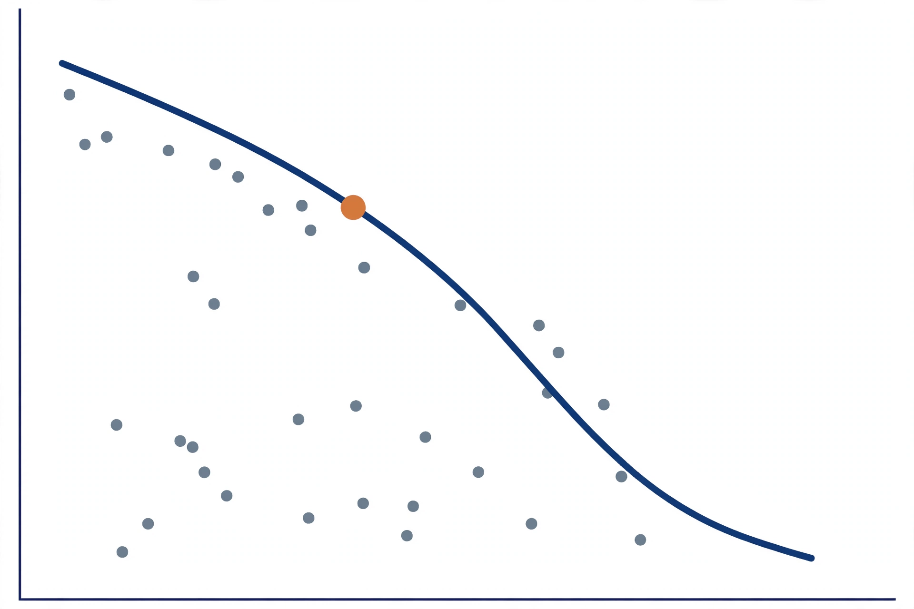

*Figure T7.1. The cost-accuracy frontier. Each dot is a candidate model. The curve marks the best accuracy available at each cost. The highlighted point is the knee: the cheapest model within noise of the best accuracy. Ship the knee, not the top-right.*

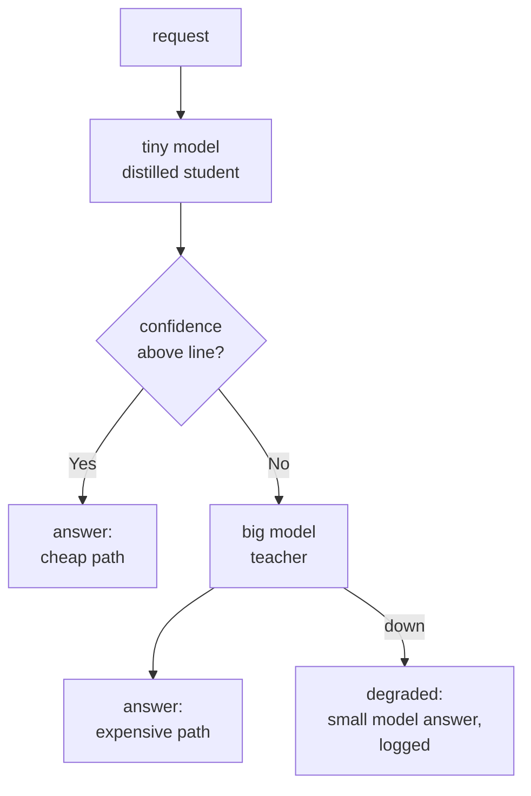

*Figure T7.2. The cascade pattern. Most traffic takes the cheap path. Hard cases escalate. Outages degrade to the small model instead of failing.*

::: takeaway
- Optimize cost per prediction at required quality. Redo the math every 10x of traffic growth.
- Right-size before you re-architect: shrink depth, width, sequence, and precision first.
- Distill the teacher into a student with temperature-softened targets. A one-layer student kept 92 percent of accuracy here.
- Cascade: cheap model first, escalate on low confidence, degrade gracefully.
:::

## Appendix A. Production launch checklist

Run this list before any model touches live traffic. Every item has an owner and a date.

1. **Framing page written.** Decision, error costs, threshold, production metric. Signed by the stakeholder who owns the metric.
2. **Baseline ladder climbed.** Rule, constant, linear, GBDT results on the holdout set, in the tracker with the leakage check recorded.
3. **Data tests green.** Schema, nulls, ranges, categories, freshness, label sanity (Chapter T4.1), running in CI and before every training run.
4. **Point-in-time correctness verified.** The feature join filter tested with a synthetic future-leak case (Chapter T2.2).
5. **Experiment record complete.** Code version, data hash, params, seed, metrics, artifacts, lineage (Chapter T3.1). A second engineer reviewed it.
6. **Model tests green.** Preprocessing unit tests, invariance tests, golden-set floor, latency within p99 budget (Chapter T4.2).
7. **Shadow run clean.** At least one full business cycle on live traffic, prediction distribution explained (Chapter T4.3).
8. **Canary plan coded.** Guardrails, tolerances from history, promote/hold/rollback rules, automatic rollback tested (Chapter T4.4).
9. **Monitoring live.** Four layers instrumented (Chapter T5.1), drift detectors tuned per feature (Chapter T5.2), alerts routed to a human.
10. **Retraining trigger defined.** Schedule, threshold, or event, with an owner (Chapter T5.3).
11. **Cost reviewed.** Cost per thousand predictions computed; the knee of the frontier chosen deliberately (Chapter T7.1).
12. **Rollback is one command.** Tested this quarter. The previous artifact is in the registry, staged and ready.

## Appendix B. Check your understanding

::: pq
**Q1.** A new feature jumps your model's holdout AUC from 0.71 to 0.94 overnight. What is the first thing you check, and why?
A. Whether the learning rate needs tuning for the new feature
B. Point-in-time correctness: whether the feature used information from after the label time
C. Whether the test set is large enough to trust the jump
D. Whether to ship immediately before the gain disappears
::: answer
**Answer: B.** A jump that large, that fast, is the signature of leakage, and the most common pipeline form is a feature that sees the future (Chapter T2.2). Retraining hyperparameters (A) or resizing the test set (C) treats a data bug as a modeling question. Shipping it (D) exports the bug to production, where the future is unavailable and the 0.94 becomes 0.61.
:::
:::

::: pq
**Q2.** Your churn model's PSI monitor fires at 0.31 on the `support_calls` feature for three consecutive weeks, but the business metric (retained revenue) is flat. What do you do?
A. Retrain immediately on the new data
B. Roll back to the previous model
C. Investigate the feature pipeline first: a broken upstream counter looks exactly like drift
D. Raise the PSI threshold so the alert stops firing
::: answer
**Answer: C.** Prediction and input drift are ambiguous: a broken pipeline and a changed world look identical in the statistic (Chapter T5.1). The flat business metric argues against a real behavior change hurting the model, which points at the pipeline. Retraining (A) would launder the bug into the model. Silencing the alert (D) is never the fix.
:::
:::

::: pq
**Q3.** A canary trips one guardrail (p99 latency up 18 percent vs a 15 percent tolerance) while the other three hold. Per the decision logic in Chapter T4, what happens?
A. Promote: three of four guardrails held
B. Roll back immediately
C. Hold for human review
D. Widen the canary to 25 percent to gather more data
::: answer
**Answer: C.** One tripped guardrail holds the canary for review; two or more roll back. Majority vote (A) ignores that guardrails are not interchangeable: latency is a hard product constraint. Widening (D) exposes more users to a known regression to answer a question the current data already answered.
:::
:::

::: pq
**Q4.** On your tabular dataset, logistic regression reaches AUC 0.7065 and gradient-boosted trees reach 0.6926. What is the correct next step?
A. Tune the GBDT hyperparameters until it beats the linear model
B. Ship the logistic regression and move on to the next bottleneck
C. Conclude tabular data always favors linear models
D. Add more features until the GBDT wins
::: answer
**Answer: B.** The ladder did its job: the simpler model won on the holdout set (Chapter T1.2). Tuning until the complex model wins by luck is overfitting to the validation set with extra steps. (C) overgeneralizes from one dataset; Chapter T6 shows GBDTs usually win on tabular data. This dataset was simply mostly linear.
:::
:::

::: pq
**Q5.** Your distilled student keeps 92 percent of the teacher's accuracy at 1/25th the serving cost, but the product team wants the teacher's full accuracy. What is the engineering answer?
A. Ship the teacher: accuracy is the only metric that matters
B. Ship the student and hide the accuracy gap from the product team
C. Price the gap: show the cost difference per million predictions and ask what the 8 percent is worth in dollars
D. Train a bigger teacher
::: answer
**Answer: C.** Accuracy has a price and the product team should see it (Chapter T7.1). The decision is theirs, but it must be priced: 8 percent of relative accuracy for 25x the serving cost. (A) ignores cost, which is a measured part of the role (Chapter 1.3). (B) hides information the stakeholder needs. (D) spends more to avoid the actual question.
:::
:::

::: provenance
**Last verified: September 2026.** All code samples were executed on this machine during writing. Every reported number comes from those runs. AUC 0.7065 vs 0.6926. PSI 0.285 vs 0.003. GBDT 0.9653 in 62.8s vs MLP 0.9827 in 264.7s. Distillation KL 0.153 down to 0.031, student accuracy 0.872 vs teacher 0.950. Volume and chapter references point at the base curriculum volumes listed in Part 2. **UNVERIFIED:** exact Grinsztajn et al. (2022) per-dataset win counts are summarized from memory of the paper's findings; consult the paper for precise tables. Illustrative serving prices in Chapter T7.1 are worked examples, not vendor quotes.
:::
