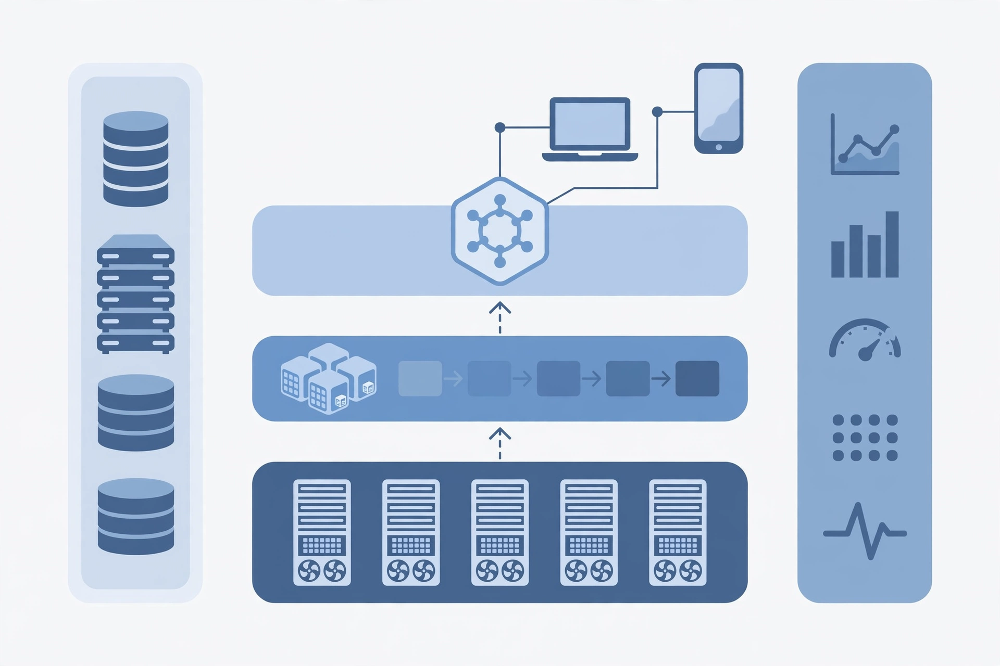
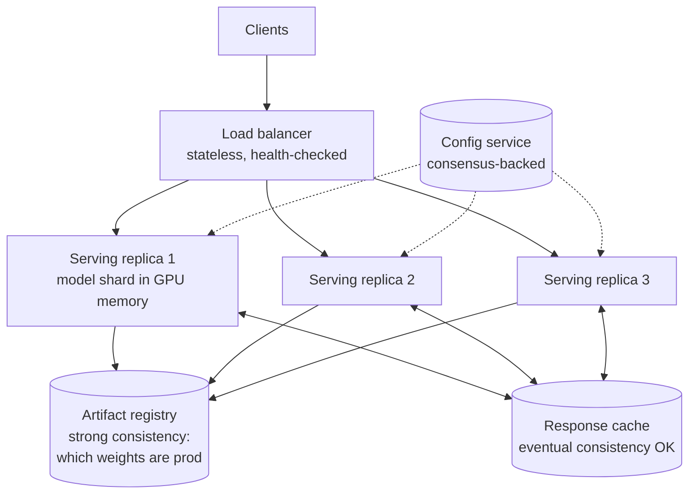
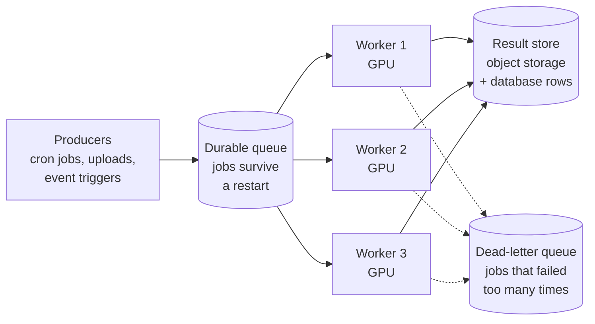
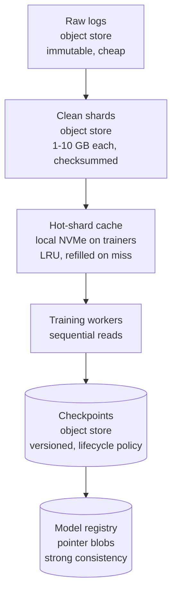
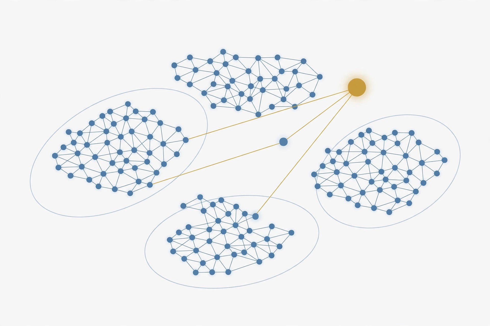
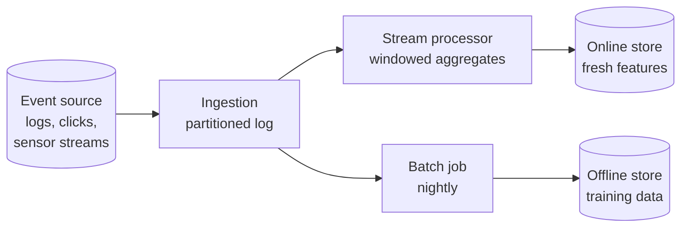

# Software Engineer, Backend and Systems (AI-Adjacent)

This track is for the backend or systems engineer who works next to AI rather than inside the model. The research engineers train and tune the models. You build everything the models run on: the serving fleet, the batch pipelines, the APIs, the storage, the queues, the dashboards that page you at 3am. You do not need to derive a gradient. You do need enough ML literacy to size a GPU fleet, read a latency trace, and hold your own in a design review with the people who do derive gradients.



*Figure T.1. The territory of this track. Models sit at the center, but a working AI product is mostly platform: compute, serving, queues, storage, APIs, and the observability that ties them together. This track teaches the platform side and just enough of the model side to make the platform correct.*

::: takeaway
- An AI-adjacent backend engineer owns reliability, latency, throughput, and cost for the systems that serve and feed models.
- The reading path leans on system design, distributed systems, inference serving, and productionizing, with math and training material used as reference.
- Seven new chapters follow: distributed systems, APIs and queues, storage, observability, data pipelines, ML literacy, and capacity planning, each with runnable Python.
:::

::: walkthrough
1. Start at the bottom of Figure T.1: GPU servers. These are expensive and scarce, so everything above them exists to keep them busy without breaking latency promises.
2. Move up one layer: the serving fleet and job queues turn raw compute into a service with an API.
3. Move up again: the API gateway is what product teams and external callers actually touch.
4. The side panels, storage and observability, cut across all layers. Nothing here works for long without both.
:::

## Part 0. The target role, in plain terms

### 0.1 What this engineer builds

A frontier AI company has two kinds of engineers around every model. One kind improves the model. The other kind makes the model usable at scale. This track is for the second kind.

Concrete systems this role owns:

- **Model-serving platforms.** The HTTP or gRPC service that takes a prompt and returns tokens, with batching, caching, routing, and autoscaling. One team trains the model; your team keeps it answering.
- **Batch inference pipelines.** Nightly jobs that run a model over millions of documents: embeddings, labels, summaries. Queues, workers, retries, dead letters.
- **Data pipelines.** The pipes that move training data from raw logs to clean, versioned datasets, and the feature pipelines that feed models at request time.
- **Storage systems.** Checkpoints, datasets, embeddings, model artifacts. Object stores, caches, and the occasional vector database you had to build or buy.
- **Developer platforms.** The SDKs, CLIs, and internal APIs that let the research teams ship without paging you.

You are the reason the demo survives Monday morning traffic.

### 0.2 The work loop

A typical week mixes four kinds of work, and the mix is the job:

1. **Build.** Design and ship a new service or pipeline. This is the visible part: a new batch inference queue, a caching layer in front of the serving tier, a schema migration.
2. **Operate.** On-call rotations, incident response, post-mortems. AI systems fail in ways that look nothing like a crashed web server: a slow GPU, a poisoned batch, a queue that filled over a weekend.
3. **Optimize.** Latency and cost work. A 50 ms cut in p99 serving latency, or a 20 percent cut in GPU-hours per million tokens, is a real deliverable here.
4. **Partner.** Design reviews with ML teams. You translate "we need lower time-to-first-token" into a caching and batching plan, and you translate "the cluster is at 90 percent" into a capacity request with numbers.

### 0.3 How success is measured

Platforms get graded on numbers, not demos. The four that matter:

- **Reliability.** Measured in nines against a service-level objective. A 99.9 percent monthly SLO allows 43 minutes of downtime a month. Every minute past that is an error-budget deficit you explain in writing.
- **Latency.** Usually p50 and p99, sometimes broken into time-to-first-token and tokens-per-second for streaming model APIs. Users feel the p99, not the average.
- **Throughput and cost.** Tokens per second per GPU, dollars per million tokens. GPUs are the scarcest resource in the building; waste shows up on a bill someone reads.
- **Developer velocity of the teams you serve.** How fast can a research team go from idea to production experiment on your platform? If your platform is the bottleneck, no model improvement ships.

The chapters ahead teach each of these as an engineering discipline, not as trivia.

## Part 1. Ordered reading path through the base volumes

Read in this order. The priority column tells you how hard to push: **core** means read every chapter, **select** means read the listed chapters and skim the rest, **reference** means open it when a later chapter points at it.

| Order | Volume | Priority | Why it matters for this role |
|---|---|---|---|
| 1 | Vol 13, ML System Design | core | This is your home volume. Serving design, caching, batching, capacity math. Read it like a manual. |
| 2 | App 13A, Distributed-Systems Primitives | core | Consistent hashing, replication, exactly-once, backpressure. The vocabulary of every design review you will sit in. |
| 3 | Vol 8, Inference Serving + App 8A, Inference Economics | core | How a model actually answers requests, and what each answer costs. You cannot size or debug a serving fleet without this. |
| 4 | Vol 10, Productionizing and MLOps | core | Deployments, rollouts, monitoring, rollbacks. The operate half of the job. |
| 5 | Vol 6, Distributed Training + App 6A, Reliability + App 6B, Parallelism | select | You will share clusters and on-call pages with training. Read the reliability appendix fully; read the parallelism chapters for the vocabulary. |
| 6 | Vol 9, Agents and RAG + App 9A, Agent Evals + App 9B, Agent Security | select | Vector search, retrieval pipelines, and the agent APIs your platform will host. Read the RAG and security chapters. |
| 7 | Vol 1, Math for ML | reference | Probability and linear algebra on demand. Open it when a chapter here says "this needs Bayes" or "this needs eigenvectors". |
| 8 | Vol 2, ML Foundations | select | Eval methodology and data hygiene. Enough to understand what the ML team means by "the metric moved". |
| 9 | Vol 4, LLM Internals + App 4A, Long Context | select | Attention and KV cache chapters only. You need the memory math for capacity planning, not the full theory. |
| 10 | Vol 11, Research Methods + App 11A, Eval Statistics | reference | A/B tests and significance. Useful when you run experiments on the platform itself. |
| 11 | Vol 15, GPU Kernels | reference | Read the memory-hierarchy chapter. It explains why the hardware chapter of your capacity model looks the way it does. |
| 12 | Vol 3, Deep Learning for Researchers | skim | Skim for vocabulary. The training chapters are not your job. |
| 13 | Vol 5, Pretraining + App 5A, Mid-training | skim | Skim the data-pipeline chapter of Vol 5; it overlaps with Chapter 5 here. |
| 14 | Vol 7, Post-training and RL + Apps 7A, 7B | skim | Know what RLHF and DPO are in one paragraph each. Your pipelines will feed these teams. |
| 15 | Vol 12, Paper Spine | reference | Use it as a reading list when you want primary sources. |

Two notes on this order. First, it is deliberately systems-heavy. If a chapter in Vol 13 references a concept from Vol 4 (say, KV cache), jump there, read the one section, and come back. Second, the deep chapters in Part 2 assume you have read items 1 through 4 above. They do not assume the math volumes.

::: callout
Chapters 1 through 7 below are new material written for this track. They assume a working backend engineer who has never built ML infrastructure. Every ML concept is defined on first use. Every formula is worked with real numbers. Every mechanism ships with Python you can run.
:::

## Part 2. Deep chapters

### Chapter 1. Distributed systems for the AI platform

Every AI platform is a distributed system wearing a trench coat. The serving fleet is a replicated stateless tier. The feature store is a replicated stateful tier. The checkpoint store is a distributed file system. The queue between them is a partitioned log. If you can reason about replication, consistency, and failure, you can reason about all of them.

#### 1.1 Replication and the quorum rule

Replication means keeping copies of the same data on several machines. You do it for two reasons: survival (one machine dies, the data lives) and speed (reads spread across copies). The hard part is writes. If a write reaches only some copies, different readers see different values.

The classic fix is a %%quorum%%. With N copies, require W of them to acknowledge a write and R of them to answer a read. If W + R > N, every read overlaps every write on at least one copy, so the reader always sees the latest write. That overlap is the whole trick. It is called the quorum rule, and it is the reason a 3-copy store with W=2 and R=2 never shows stale data.

```
QUORUM OVERLAP (N=3, W=2, R=2):

  Write touches:   [A] [B]  .
  Read touches:     .  [B] [C]
                           ^
  B is in both sets, so the read sees the write.
  2 + 2 > 3, so overlap is guaranteed no matter which
  two machines each side picks.
```

This simulation shows a 3-replica store. Each value carries a stamp (a counter plus a writer id) so replicas can agree on which write is newest. Watch what happens when the quorum rule holds and when it is broken.

```python
# WHAT: a tiny replicated key-value store with tunable quorums.
# WHY:  to feel the quorum rule (W + R > N) instead of memorizing it.
# WHAT BREAKS: set W=1, R=1 and a write that reaches only one replica
#       becomes invisible to reads that hit the other two. That is the
#       stale-read failure this rule prevents. In production this is how
#       a feature store serves yesterday's features to today's model.

class Replica:
    def __init__(self, name):
        self.name = name
        self.store = {}      # key -> (stamp, value)
        self.alive = True    # kill a replica to simulate a machine failure


class QuorumKV:
    def __init__(self, n, w, r):
        # n: total copies. w: write quorum. r: read quorum.
        self.replicas = [Replica(f"r{i}") for i in range(n)]
        self.w, self.r = w, r
        self.clock = 0  # logical clock; each write gets a bigger stamp

    def put(self, key, value):
        # WHAT: write to replicas until W acknowledge.
        # WHY:  W acks mean any later read quorum overlaps this write.
        # WHAT BREAKS: if fewer than W are alive, we refuse the write.
        #       Refusing is correct: accepting it would silently break
        #       the overlap guarantee. Availability is sacrificed to
        #       keep the data right (this is the "C" side of CAP).
        self.clock += 1
        stamp = (self.clock, "writer")
        acked = 0
        for rep in self.replicas:
            if not rep.alive:
                continue
            cur = rep.store.get(key)
            if cur is None or stamp > cur[0]:  # last-writer-wins by stamp
                rep.store[key] = (stamp, value)
            acked += 1
            if acked == self.w:
                break
        if acked < self.w:
            raise IOError(f"write quorum not reached: {acked}/{self.w} acked")
        return True

    def get(self, key):
        # WHAT: ask R replicas, return the value with the highest stamp.
        # WHY:  with W + R > N, at least one of the R saw the latest write,
        #       and the stamp picks it out from older copies.
        # WHAT BREAKS: if W + R <= N, the read set can miss the write set
        #       entirely and return a stale value with full confidence.
        seen = []
        for rep in self.replicas:
            if not rep.alive:
                continue
            if key in rep.store:
                seen.append(rep.store[key])
            if len(seen) == self.r:
                break
        if len(seen) < self.r:
            raise IOError(f"read quorum not reached: {len(seen)}/{self.r}")
        seen.sort(key=lambda kv: kv[0], reverse=True)
        return seen[0][1]


# Demo 1: the rule holds (W=2, R=2 on 3 replicas). Kill one replica;
# the store keeps working and every read is fresh.
kv = QuorumKV(n=3, w=2, r=2)
kv.put("model_version", "v14")
kv.replicas[0].alive = False          # one machine dies mid-shift
kv.put("model_version", "v15")        # write still reaches a quorum
print("with quorum rule:", kv.get("model_version"))  # -> v15, always fresh

# Demo 2: the rule broken (W=1, R=1). The write lands on replica 0;
# the read happens to ask replica 2, which never saw it.
kv2 = QuorumKV(n=3, w=1, r=1)
kv2.put("threshold", "0.9")           # lands on the first alive replica
# Force the read to hit a different replica by killing the first two:
kv2.replicas[0].alive = False
kv2.replicas[1].alive = False
try:
    print("without quorum rule:", kv2.get("threshold"))
except IOError as e:
    print("without quorum rule: read failed instead of going stale:", e)
```

::: walkthrough
1. In Demo 1, `put("model_version", "v15")` writes to two of the three live replicas. `get` reads two. Any two sets of size 2 drawn from 3 overlap, so the read always includes a replica with v15, and the stamp picks it.
2. In Demo 2, the write touches one replica and the read touches one (different) replica. There is no overlap, so the read either fails or returns stale data. No error is raised in the stale case: the system lies quietly, which is the dangerous outcome.
3. The refused write in `put` is a feature. A store that accepts writes it cannot replicate is a store that loses data on the next crash.
:::

#### 1.2 Consistency models, in plain terms

"Consistency" answers one question: when I write a value, when does everyone else see it? Three answers cover nearly every system you will touch:

- **Strong consistency.** Once a write is acknowledged, every later read sees it. Quorum stores with W + R > N give you this. Cost: writes wait for acks, and a network partition can refuse writes (as the simulation showed).
- **Eventual consistency.** Writes are accepted fast and copies converge later. A reader may see yesterday's value for a while. Cost: your application must tolerate staleness. Benefit: the system stays up through partitions.
- **Causal consistency.** The middle ground: writes that depend on each other are seen in order, unrelated writes may arrive in any order. Rarely needed explicitly, but good to recognize.

Which one does each AI-platform piece need?

| Component | Consistency needed | Why |
|---|---|---|
| Model artifact registry (which weights are "prod") | Strong | Two versions of "prod" at once means half your fleet serves the wrong model |
| Feature store, online | Strong or bounded staleness | Stale features silently degrade model quality; nobody gets paged, the metric just drifts |
| Embedding cache | Eventual | A stale embedding is a slightly worse search result, not an outage |
| Training checkpoints | Strong (single writer) | One writer, many readers; use atomic renames, not quorums |
| Config and flags | Strong | A half-applied config is worse than an old config |

The pattern: anything that decides *which* model serves or *what* data trains needs strong consistency. Anything that is a cache can be eventual. When in doubt, ask: "if two readers disagree for a minute, does anyone get hurt?" If yes, pay for strong.

#### 1.3 Leader election and fencing

Some jobs need exactly one machine in charge: one primary writing to the feature store, one scheduler assigning batches. %%Leader election%% picks that machine. The failure mode is the interesting part: the old leader does not know it was replaced. It keeps writing. Now two leaders write, and the data corrupts. This is called split-brain.

The fix is %%fencing%%. Every write carries a token, and the store only accepts a token larger than any it has seen. The new leader gets a fresh, larger token from a sequencer (a tiny strongly-consistent service, or just a database row with an atomic increment). The old leader's writes arrive with a smaller token and are rejected. Split-brain becomes harmless: the old leader shouts into a void.

```python
# WHAT: a store that rejects writes from deposed leaders.
# WHY:  leader election can take seconds; during those seconds the old
#       leader is still alive and writing. Fencing makes its writes
#       fail loudly instead of corrupting data.
# WHAT BREAKS: if the sequencer hands out tokens without atomicity
#       (two leaders get the same token), fencing silently stops
#       working. The token source must itself be strongly consistent.

class FencedStore:
    def __init__(self):
        self.data = {}
        self.max_token_seen = 0  # the fence: only higher tokens pass

    def write(self, key, value, token):
        # WHAT: accept the write only if its token beats every past token.
        # WHY:  a larger token proves a newer leader issued this write.
        # WHAT BREAKS: comparing with >= instead of > lets a leader
        #       reuse a token and slip a stale write through.
        if token <= self.max_token_seen:
            raise PermissionError(
                f"fenced out: token {token} <= {self.max_token_seen}")
        self.max_token_seen = token
        self.data[key] = value
        return True


class Sequencer:
    # WHAT: hands out strictly increasing tokens, one at a time.
    # WHY:  in production this is a single database row updated with
    #       "SET token = token + 1" (atomic), or a consensus service.
    def __init__(self):
        self.token = 0

    def new_token(self):
        self.token += 1
        return self.token


store, seq = FencedStore(), Sequencer()

leader_a_token = seq.new_token()          # A becomes leader, token 1
store.write("primary", "machine-a", leader_a_token)

# A is partitioned away but doesn't know it. B is elected, token 2.
leader_b_token = seq.new_token()
store.write("primary", "machine-b", leader_b_token)

# A's delayed write arrives with the old token. The fence rejects it.
try:
    store.write("primary", "machine-a", leader_a_token)
except PermissionError as e:
    print("stale leader blocked:", e)
print("current primary:", store.data["primary"])  # -> machine-b
```

#### 1.4 Consensus in one page

Quorums handle data. %%Consensus%% handles decisions: which machine is the leader, what is the next log entry, in what order did events happen. The standard algorithm is Raft. You do not need to implement it; you need to know three things about it:

1. It elects a leader by majority vote. With 3 nodes, 2 must agree. That is why consensus clusters always have an odd number of nodes: 3 or 5. An even number gains nothing and complicates ties.
2. All writes flow through the leader, which replicates each entry to a majority before acknowledging it. No quorum math on your side; the algorithm does it.
3. It is slow compared to a single database (every write crosses the network twice) and it stops accepting writes when a majority is unreachable. You pay this price only for the small, critical state: leader identity, config, locks.

Practical rule: never build consensus yourself. Use etcd, ZooKeeper, or your cloud's managed equivalent for the three things that need it (leader election, distributed locks, service config). Build everything else on plain replication with quorums. Teams that hand-roll consensus spend a year debugging elections; teams that rent it spend a week integrating.

#### 1.5 Putting it together: a serving fleet

Here is the distributed-systems view of a model-serving tier, the system at the heart of Chapter 2's APIs. Each box is a lesson from this chapter.



*Figure 1.1. A serving fleet as a distributed system. The replicas are stateless and interchangeable, so the load balancer needs no consistency at all, just health checks. The registry needs strong consistency (section 1.2's table). The cache is fine eventual. Config flows from a consensus-backed service, fenced so a stale replica cannot push old settings (section 1.3).*

::: walkthrough
1. A request enters at the load balancer, which picks a healthy replica. "Healthy" comes from active health checks, not from the replica's own opinion.
2. The replica loads the model version named by the artifact registry. Because the registry is strongly consistent, all three replicas agree on which weights are prod.
3. The response cache is checked first. It is eventual, so a cached answer may come from the previous model version for a short window; that is an accepted trade, documented in the runbook.
4. Config changes (rate limits, routing weights) arrive from the consensus-backed config service. Each carries a fencing token, so a replica that missed an update cannot overwrite a newer one.
:::

::: takeaway
- Replicate for survival and speed; use quorums (W + R > N) when readers must see the latest write.
- Match the consistency model to the damage stale data can do: strong for model identity and config, eventual for caches.
- Fence your leaders. A deposed leader that keeps writing is the most common source of silent corruption.
- Rent consensus (etcd or equivalent). Build replication yourself only where a library does not already do it.
:::

::: ob-board
Your feature store runs 5 replicas with W=3, R=3. Two replicas go down during a deploy. Do reads and writes still work? What changes if you drop to W=2, R=2, and what new risk do you accept?
:::

### Chapter 2. APIs and queues for ML workloads

Models do not serve themselves. Something has to take a request, decide whether it needs an answer now or can wait, run the model, and return the result. That something is an API in front and usually a queue behind. This chapter is about building both so they survive real traffic.

#### 2.1 Designing a model-serving API

A model-serving API looks like a normal web API with three twists.

**Twist 1: answers stream.** A chat completion can take 30 seconds to finish. No client wants to wait 30 seconds for one HTTP response. So the API streams tokens as they are generated (server-sent events or a streaming gRPC call), and it also reports time-to-first-token as its own latency metric. Design the response format for streaming from day one; bolting it on later breaks every client.

**Twist 2: requests carry model identity and parameters.** A minimal request names the model, the input, and the knobs that change cost and quality:

```python
# WHAT: the request schema for a text-generation endpoint.
# WHY:  every field here exists because omitting it caused a real
#       production problem, listed in the comments.
request = {
    "model": "summarizer-v14",   # pinned version, never "latest" in prod:
                                 # "latest" makes rollbacks untestable
    "input": "Quarterly report text...",
    "max_tokens": 512,           # cost guard: without a cap, one request
                                 # can burn a full context window of GPU time
    "temperature": 0.2,          # kept server-side per use case; exposing
                                 # raw knobs invites prompt-injection games
    "idempotency_key": "job-9f31",  # safe to retry (see section 2.4)
    "metadata": {"tenant": "acme"},  # for billing and per-tenant limits
}
```

**Twist 3: versioning is a safety device.** `POST /v1/generate` stays stable while `/v2/generate` changes the schema. Old clients keep working during a migration. For models specifically, version the *model* separately from the *API*: the API version changes the wire format, the model version changes the behavior. Confusing the two is how a routine model update breaks a hundred clients at once.

REST versus gRPC is a smaller decision than it looks. REST with JSON is easier to debug and works everywhere; gRPC is faster and gives you streaming and typed contracts for free. A common split: REST for the public API, gRPC between internal services where both ends are yours. Pick one per boundary and move on.

#### 2.2 Why batch inference needs a queue

Some model work does not need an answer now. Embedding a million documents overnight, labeling last week's tickets, scoring a lead list: nobody is waiting on a single response. This is %%batch inference%%, and it belongs behind a queue, not behind a synchronous API.

The queue buys three things. **Smoothing:** a million jobs arriving at once become a steady stream the GPU fleet can actually digest. **Retry:** a failed job goes back on the queue instead of vanishing. **Visibility:** queue depth is a number you can alert on, graph, and capacity-plan against (Chapter 7).



*Figure 2.1. A batch inference pipeline. Producers enqueue jobs; workers pull them; results land in storage. A dead-letter queue is not an afterthought. It is where the jobs that will never succeed wait for a human, instead of clogging the workers forever.*

#### 2.3 Backpressure: the queue pushes back

A queue with no limit is a memory leak with extra steps. If producers outrun workers for hours, an unbounded queue eats all RAM and the whole service dies, taking the retry state with it. %%Backpressure%% is the mechanism that stops this: when the queue is full, the producer slows down.

The simplest correct design is a bounded queue with blocking producers. `queue.Queue(maxsize=N)` in Python blocks `put()` when full. The producer thread waits, which propagates the slowdown upstream: the HTTP handler takes longer, the client sees latency, the client backs off. Pressure flows backward through the system instead of exploding inside it. The alternative, dropping jobs silently when full, is only acceptable if the producer can regenerate them.

How big should N be? Big enough to absorb a burst, small enough that the oldest job in a full queue is still worth running. A concrete rule: N = (workers) x (jobs per worker per minute) x (minutes of burst you want to absorb). With 8 workers doing 30 jobs a minute and a 5-minute burst budget, N = 8 x 30 x 5 = 1200. Beyond that, push back.

#### 2.4 Idempotency: safe to retry

Networks fail mid-request. The client does not know whether the job ran, so it retries. Without %%idempotency%%, the retry runs the job twice: the customer is charged twice, the document is embedded twice, the email is sent twice.

The fix is an idempotency key: a client-generated unique token sent with the request. The server keeps a table of key to result. If a key arrives twice, the server returns the stored result instead of running the job again. Three details matter:

1. The key must come from the client (a UUID it generates before the first attempt), not from the server, because the server may never have seen the first attempt.
2. The result must be stored before it is returned, in the same atomic step if possible. Store-then-return has a crash window; accept it and document it, or use a transaction.
3. Keys expire. Keep them for 24 to 72 hours: long enough to cover every realistic retry, short enough that the table does not grow forever.

#### 2.5 Retries, dead letters, and poison

Retries need discipline, or they become a self-inflicted DDoS. The rules:

- **Retry only what can succeed.** A timeout or a 503 is transient; a 400 bad request will fail forever. Classify before you retry.
- **Back off exponentially, with jitter.** Wait 1s, then 2s, then 4s, and add randomness so a thousand failing clients do not retry in lockstep and hammer the recovering service. The standard formula is `sleep = random_between(0, min(cap, base * 2^attempt))`, called full jitter.
- **Cap the attempts.** Three to five retries is the usual range. After that, the job goes to the dead-letter queue.
- **A dead-letter queue is a work queue for humans.** Every entry needs the payload, the failure history, and a way to requeue after a fix. A DLQ nobody reads is a trash can, and trash cans do not page anyone.

A %%poison message%% is a job that crashes every worker that touches it: malformed input, a pathological prompt that OOMs the GPU. The retry cap plus the DLQ is the defense. Without it, one bad job can take down the whole fleet one worker at a time.

The simulation below ties the chapter together: a bounded batch-inference queue with blocking producers (backpressure), idempotency keys, jittered retries, and a dead-letter queue. It uses threads the way a real worker fleet uses processes.

```python
# WHAT: a batch-inference job queue with backpressure, idempotency,
#       jittered retries, and a dead-letter queue.
# WHY:  these four mechanisms are the difference between a pipeline
#       that survives a bad night and one that pages you at 3am.
# WHAT BREAKS: remove the maxsize and a producer burst eats all RAM;
#       remove the idempotency table and a retried job bills twice;
#       remove the retry cap and one poison job kills every worker.

import queue
import random
import threading
import time


class Job:
    def __init__(self, idem_key, payload):
        self.idem_key = idem_key  # client-generated; same key = same job
        self.payload = payload
        self.attempts = 0


class InferenceQueue:
    def __init__(self, maxsize=50, workers=4, max_retries=3):
        # WHAT: bounded queue; put() blocks when full (backpressure).
        # WHY:  an unbounded queue turns a traffic spike into an OOM.
        # WHAT BREAKS: maxsize far larger than workers * throughput just
        #       delays the explosion and makes the oldest queued job stale.
        self.q = queue.Queue(maxsize=maxsize)
        self.results = {}   # idempotency table: key -> result
        self.dlq = []       # dead letters, with failure history
        self.lock = threading.Lock()  # guards results and dlq
        self.max_retries = max_retries
        self.rng = random.Random(7)
        self.workers = [
            threading.Thread(target=self._worker, args=(i,), daemon=True)
            for i in range(workers)
        ]
        for w in self.workers:
            w.start()

    # -- producer side -------------------------------------------------
    def submit(self, job):
        # WHAT: dedupe on the idempotency key, then enqueue (blocking).
        # WHY:  checking before enqueue means a retried submit returns
        #       the stored result without ever touching a worker.
        with self.lock:
            if job.idem_key in self.results:
                return ("duplicate", self.results[job.idem_key])
        self.q.put(job)  # blocks here when full: backpressure
        return ("accepted", None)

    # -- worker side ---------------------------------------------------
    def _backoff(self, attempt):
        # WHAT: full-jitter exponential backoff, cap 8 seconds.
        # WHY:  exponential spacing gives the downstream time to recover;
        #       jitter stops a fleet of workers retrying in lockstep.
        # WHAT BREAKS: no jitter + 100 workers = a retry thundering herd
        #       that re-crashes the service the moment it recovers.
        return self.rng.uniform(0, min(8.0, 0.2 * (2 ** attempt)))

    def _run_model(self, job):
        # WHAT: stands in for the real GPU call.
        # WHY:  the queue logic is identical whether this takes 10 ms or
        #       10 s; the demo injects failures by payload content.
        p = job.payload
        if p == "poison":
            raise ValueError("poison job: malformed input, never retryable")
        if p == "flaky" and job.attempts < 2:
            raise TimeoutError("transient: GPU worker timed out")
        return f"embedding({p})"

    def _worker(self, wid):
        while True:
            job = self.q.get()  # blocks until a job exists
            try:
                result = self._run_model(job)
            except ValueError as e:
                # WHAT: permanent failure -> dead-letter queue, no retry.
                # WHY:  retrying a poison job wastes GPU and can crash
                #       every worker in turn. Classify before retrying.
                with self.lock:
                    self.dlq.append((job.idem_key, str(e), job.attempts))
            except TimeoutError:
                job.attempts += 1
                if job.attempts > self.max_retries:
                    with self.lock:
                        self.dlq.append(
                            (job.idem_key, "retries exhausted", job.attempts))
                else:
                    time.sleep(self._backoff(job.attempts))
                    self.q.put(job)  # requeue for another attempt
            else:
                # WHAT: store the result under the idempotency key first.
                # WHY:  a later duplicate submit returns this instead of
                #       re-running the model (double billing, double send).
                with self.lock:
                    self.results[job.idem_key] = result
            finally:
                self.q.task_done()

    def drain(self):
        self.q.join()  # wait until every accepted job finished


# Demo: 12 jobs, one duplicate submit, one flaky job, one poison job.
iq = InferenceQueue(maxsize=50, workers=4, max_retries=3)
jobs = [Job(f"doc-{i}", f"text-{i}") for i in range(10)]
jobs.append(Job("flaky-1", "flaky"))    # fails twice, then succeeds
jobs.append(Job("poison-1", "poison"))  # never succeeds -> DLQ
for j in jobs:
    iq.submit(j)
print(iq.submit(Job("doc-3", "text-3")))  # duplicate key: no re-run
iq.drain()
print("results:", len(iq.results), "| dlq:", iq.dlq)
# Expect: 11 results (10 docs + flaky-1), 1 DLQ entry (poison-1),
# and the duplicate submit returned the stored result.
```

::: walkthrough
1. `submit` checks the idempotency table under a lock. The duplicate `doc-3` returns `("duplicate", "embedding(text-3)")` without ever reaching a worker.
2. `flaky-1` raises `TimeoutError` on attempts 0 and 1, sleeps a jittered backoff, requeues, and succeeds on attempt 2. Its result is stored once.
3. `poison-1` raises `ValueError`, which is classified permanent. It goes straight to the DLQ with its failure history. No worker ever sees it twice.
4. `drain` waits for `task_done` on every job, so the demo prints only after the pipeline is empty. In production you would not drain; the workers run forever.
:::

::: takeaway
- Design model APIs for streaming, pin model versions separately from API versions, and cap cost-driving parameters.
- Put batch work behind a bounded queue. Blocking producers are the simplest correct backpressure.
- Make every mutating request idempotent with client-generated keys, or retries will double-execute.
- Retry transient failures with jittered backoff, cap attempts, and give poison jobs a dead-letter queue with a human reader.
:::

::: ob-board
Your batch queue's DLQ grows by 200 jobs a night, all with "retries exhausted" on timeouts. The model team says the GPUs are healthy. List three platform-side causes you would check before blaming the model, and the metric that would confirm each.
:::

### Chapter 3. Storage for AI

AI systems are hungry for storage in four distinct ways: datasets to train on, checkpoints to resume from, features to serve, and vectors to search. Each wants a different store. This chapter maps the four to their storage and builds the most interesting one, a vector index, from scratch.

#### 3.1 Object stores: the default

An %%object store%% (S3 and its clones) holds named blobs: `checkpoints/model-v14/shard-003.safetensors`. Four properties make it the default for AI artifacts:

- **Immutable writes.** You do not edit a blob; you write a new one. This kills a whole class of corruption: a half-written checkpoint is simply a blob nobody points at.
- **Atomic publish.** There is no rename in most object stores, but there is "write new blob, then update one small pointer blob." Readers who fetch the pointer first always see a complete version.
- **Multipart upload.** A 400 GB checkpoint uploads as a thousand parallel parts and is assembled server-side. One dropped connection retries one part, not 400 GB.
- **Versioning and lifecycle.** Keep every checkpoint for a week, keep weekly ones for a year, delete the rest automatically. Storage bills are set by lifecycle policy, not by good intentions.

Checksums close the loop: hash the blob at write time, store the hash beside it, verify on read. A flipped bit in a 400 GB checkpoint produces a model that trains "almost fine" and wastes a week of GPUs. The hash costs nothing next to that.

#### 3.2 POSIX versus object for datasets

Training reads data in a very specific pattern: sequential, high-throughput, repeated for many epochs, often shuffled. Two filesystem families serve it:

- **POSIX filesystems** (local disk, NFS, Lustre) give you files, directories, seeks, and renames. Fast for random access, familiar to every tool. Expensive at petabyte scale and a pain to share across regions.
- **Object stores** give you blobs and listing. Cheaper, effectively infinite, global. But listing a million small files is slow, and random reads pay per-request latency.

The practical answer is a hybrid most teams converge on. Keep the canonical dataset as large immutable blobs (shards of 1 to 10 GB each) in the object store. Let the training cluster cache hot shards on local disk. Shard size is the tuning knob: too small and you drown in request overhead; too large and a single slow shard stalls the pipeline. Start at a few GB per shard and measure.



*Figure 3.1. The storage tiers of a training platform. Each tier has one job and one consistency story. Raw data is append-only, shards are immutable, the cache is allowed to be wrong (it refills), and only the registry pointer needs strong consistency.*

#### 3.3 Vector search from first principles

A retrieval system turns text into vectors (lists of a few hundred to a few thousand numbers) and then, given a query vector, finds the stored vectors closest to it. The naive way compares the query against every stored vector. With a million 768-dimensional vectors, one query costs 768 million multiply-adds. That is about a millisecond on a GPU. But you wanted a thousand queries a second on a CPU box, and you have ten million vectors. Exact search does not scale. You need an index.

%%HNSW%% (Hierarchical Navigable Small World) is the index most vector databases use under the hood. The idea is a stack of graphs:

- Every vector is a node in the bottom layer, linked to a handful of its nearest neighbors.
- A few nodes are promoted to higher layers, where they link across long distances, like highway interchanges above city streets.
- A search starts at the top, hops greedily toward the query across the long-range links, then descends layer by layer, refining at each step. Each layer only explores a small neighborhood, so the total work grows like log(N) instead of N.



*Figure 3.2. The intuition behind hierarchical search. The query (gold) does not scan every point. It drops through long-range links into the right neighborhood, then walks the local mesh to find its nearest neighbors.*

The implementation below is simplified but real: layered insertion, greedy search, bidirectional links capped at M neighbors per layer. It stores vectors in plain Python lists, so it is thousands of times slower than a production index, but the algorithm is the same one.

```python
# WHAT: a simplified but working HNSW vector index.
# WHY:  vector search is the storage primitive behind RAG and semantic
#       search; understanding the graph is what lets you tune M and ef
#       instead of copying defaults from a blog post.
# WHAT BREAKS: ef (search width) too small -> recall collapses because
#       the greedy walk gets stuck in a local neighborhood; M too small
#       -> the graph disconnects and whole clusters become unreachable.

import heapq
import math
import random


def dist2(a, b):
    # WHAT: squared Euclidean distance (skip the sqrt: ordering is same).
    # WHY:  sqrt is monotonic, so it never changes which neighbor is
    #       closest; skipping it saves a surprising amount of time.
    return sum((x - y) ** 2 for x, y in zip(a, b))


class HNSW:
    def __init__(self, M=16, ef=64, seed=0):
        # M:  neighbors selected per node per layer at insert.
        # ef: candidate-list size during search (recall vs speed knob).
        self.M = M
        self.ef = ef
        self.rng = random.Random(seed)
        self.vecs = []    # vecs[i] = vector of node i
        self.levels = []  # levels[i] = highest layer containing node i
        self.layers = []  # layers[l] = {node_id: [neighbor ids]}
        self.entry = None  # entry point: a node on the current top layer

    def _level(self):
        # WHAT: draw a random layer for the new node.
        # WHY:  P(level >= l) falls geometrically, so most nodes live on
        #       layer 0 and a few become long-range hubs. The hubs are
        #       what make search logarithmic instead of linear.
        # WHAT BREAKS: making every node reach the top layer turns the
        #       "hierarchy" into one dense graph and search degrades.
        return int(-math.log(self.rng.random()) / math.log(self.M))

    def _cap(self, layer):
        # WHAT: neighbor-list cap per layer: 2*M on layer 0, M above.
        # WHY:  this is the real HNSW rule (Mmax0). The extra slack on
        #       the base layer lets long-range bridge links survive
        #       repeated pruning as new nearby nodes arrive. Without it,
        #       clusters grind their bridges away and the graph splits.
        return 2 * self.M if layer == 0 else self.M

    def _select(self, qvec, candidates, m):
        # WHAT: the HNSW neighbor-selection heuristic (the real one).
        # WHY:  keep a candidate only if it is closer to q than to any
        #       already-selected neighbor. This keeps DIVERSE links
        #       (bridges between clusters), which plain "M nearest"
        #       pruning destroys, fragmenting the graph over time.
        # WHAT BREAKS: "M nearest" pruning builds tight local cliques
        #       and severs every bridge: recall collapses to near zero.
        selected = []
        for d, v in sorted(candidates):
            if len(selected) >= m:
                break
            if all(d < dist2(self.vecs[v], self.vecs[s])
                   for _, s in selected):
                selected.append((d, v))
        return [v for _, v in selected]

    def _search_layer(self, q, entry, layer, ef):
        # WHAT: greedy best-first walk within one layer.
        # WHY:  keep the ef closest nodes seen; expand the closest
        #       unvisited one until no unvisited candidate can beat the
        #       worst node kept. Candidates pop in distance order, so
        #       the first time the best candidate loses, we are done.
        visited = {entry}
        cand = [(dist2(q, self.vecs[entry]), entry)]  # min-heap
        best = [(-dist2(q, self.vecs[entry]), entry)]  # max-heap of top ef
        heapq.heapify(cand)
        heapq.heapify(best)
        while cand:
            d, u = heapq.heappop(cand)
            if len(best) >= ef and d > -best[0][0]:
                break  # closest candidate can't beat the worst kept
            for v in self.layers[layer].get(u, ()):
                if v in visited:
                    continue
                visited.add(v)
                dv = dist2(q, self.vecs[v])
                heapq.heappush(cand, (dv, v))
                if len(best) < ef:
                    heapq.heappush(best, (-dv, v))
                elif dv < -best[0][0]:
                    heapq.heapreplace(best, (-dv, v))
        return sorted((-d, v) for d, v in best)  # ascending by distance

    def _add_edge(self, layer, u, v):
        # WHAT: directed edge u->v, pruning u's list with the heuristic.
        # WHY:  the just-added edge is force-kept so a pruning pass never
        #       silently drops the link the insert came to create.
        # WHAT BREAKS: allowing u == v writes a self-loop, which the
        #       greedy walk can never leave through (it leads nowhere).
        if u == v:
            return
        cap = self._cap(layer)
        nbrs = self.layers[layer].setdefault(u, [])
        if v in nbrs:
            return
        nbrs.append(v)
        if len(nbrs) > cap:
            cands = [(dist2(self.vecs[u], self.vecs[w]), w) for w in nbrs]
            keep = self._select(self.vecs[u], cands, cap)
            if v not in keep:
                keep = keep[:cap - 1] + [v]
            self.layers[layer][u] = keep

    def add(self, vec):
        # WHAT: insert a vector at a random level, linking M neighbors
        #       per layer from the top down.
        idx = len(self.vecs)
        self.vecs.append(vec)
        lvl = self._level()
        self.levels.append(lvl)
        if self.entry is None:  # first node: it is the whole index
            self.entry = idx
            while len(self.layers) <= lvl:
                self.layers.append({})
            return
        top = len(self.layers) - 1  # top layer BEFORE this insert
        cur = self.entry
        # Descend greedily through layers that already exist. If the new
        # node sets a new maximum level there is no descent: the new top
        # layers start empty with the new node as the entry point.
        for layer in range(top, lvl, -1):
            cur = self._search_layer(vec, cur, layer, ef=1)[0][1]
        # Link at each layer up to the old top. New layers above the old
        # top get no edges yet: linking there would search empty layers
        # and the walk could return the new node itself (self-loops).
        for layer in range(min(lvl, top), -1, -1):
            cands = self._search_layer(vec, cur, layer, self.ef)
            for nb in self._select(vec, cands, self.M):
                self._add_edge(layer, idx, nb)
                self._add_edge(layer, nb, idx)
            # Next layer starts from the best PRE-LINK candidate. A fresh
            # post-link search could return idx itself (distance 0) and
            # every layer below would then link the node to itself.
            cur = cands[0][1]
        if lvl > top:
            while len(self.layers) <= lvl:
                self.layers.append({})
        if lvl > self.levels[self.entry]:
            self.entry = idx  # new highest node becomes the entry point

    def query(self, q, k=5):
        # WHAT: top-k nearest by the same descend-and-refine walk.
        # WHY:  upper layers route to the right neighborhood cheaply;
        #       only layer 0 does the careful wide search (ef).
        cur = self.entry
        for layer in range(len(self.layers) - 1, 0, -1):
            cur = self._search_layer(q, cur, layer, ef=1)[0][1]
        return self._search_layer(q, cur, 0, self.ef)[:k]


# Demo: 600 points in 6-D, grouped in 4 clusters. Build the index, then
# measure recall@5 of HNSW vs brute force over 40 random queries.
rng = random.Random(42)
DIM = 6
centers = [[rng.gauss(0, 8) for _ in range(DIM)] for _ in range(4)]
data = []
for _ in range(600):
    c = centers[rng.randrange(4)]
    data.append([x + rng.gauss(0, 1.0) for x in c])

index = HNSW(M=16, ef=64, seed=1)
for v in data:
    index.add(v)

def brute(q, k=5):
    return sorted(range(len(data)), key=lambda i: dist2(q, data[i]))[:k]

hits, total = 0, 0
for _ in range(40):
    q = [rng.gauss(0, 8) for _ in range(DIM)]
    approx = {i for _, i in index.query(q, k=5)}
    exact = set(brute(q, k=5))
    hits += len(approx & exact)
    total += 5
print(f"recall@5: {hits/total:.2%}")
# Expect very high recall on this clustered data (typically 95-100%):
# the graph walk finds nearly all true neighbors while visiting only a
# small fraction of the 600 nodes. Production tuning is exactly this
# loop with bigger data and a latency budget.
```

::: walkthrough
1. `add` draws a level for each vector. Most land on layer 0; a rare few reach layer 2 or 3 and become the long-range hubs that make search fast.
2. Insertion walks down from the entry point, greedily moving to the closest node at each layer, then links the new node to its M nearest at every layer it joins. Links are bidirectional so the walk can always backtrack.
3. `query` repeats the descent: cheap ef=1 hops on the upper layers to find the right neighborhood, then the wide ef=64 search on layer 0 to collect the final candidates.
4. The demo's recall check is how you evaluate any approximate index: fraction of the true top-5 that the index returns. Production tuning is exactly this loop with bigger data and a latency budget.
:::

When do you actually need a vector database, versus a simpler store? The decision tree:

- Fewer than ~100k vectors and low query volume: brute force in memory is fine and has perfect recall. Do not buy complexity you do not need.
- Up to tens of millions of vectors with metadata filtering ("nearest red shoes under $50"): a dedicated vector database (Qdrant, Weaviate, pgvector at small scale) earns its keep.
- Beyond that, or with heavy filtering and multi-tenancy: sharded indexes, one HNSW graph per shard, with the query fanned out. This is where Chapter 1's partitioning and Chapter 7's capacity math come back.

#### 3.4 Feature stores: online versus offline

A %%feature store%% serves the numbers a model needs at request time: user embedding, account age, recent transaction count. It has two faces:

- **Offline store:** big, slow, complete. Training jobs read months of history here. It is a data warehouse with versioning.
- **Online store:** small, fast, current. Request-time serving reads here with single-digit millisecond latency. It is a low-latency key-value store, usually replicated per Chapter 1.

The subtle failure is %%training-serving skew%%: the offline numbers used in training differ from the online numbers used in serving, because the two stores computed a feature differently or at different times. The model learned one world and serves in another. The defense is point-in-time correctness: every feature value carries the timestamp it was true at, and training joins features "as of" the event time. If your feature platform cannot answer "what was this user's feature vector on March 3rd at 2pm," it cannot train a trustworthy model.

::: takeaway
- Default to object stores for artifacts: immutable blobs, multipart upload, checksums, lifecycle policies.
- Keep datasets as large immutable shards in object storage with a hot cache on the trainers; tune shard size by measuring.
- HNSW turns vector search from O(N) into O(log N) with a layered neighbor graph; tune M and ef against recall, not vibes.
- Split feature storage into offline (training) and online (serving), and demand point-in-time correctness or accept training-serving skew.
:::

::: ob-board
Your RAG service's answer quality drops every Monday. The vector index is rebuilt weekly on Sunday night from the document store. Name two storage-level mechanisms that could cause a Monday-only regression, and how you would prove each one.
:::

### Chapter 4. Observability: metrics, traces, and what to alert on

You cannot fix what you cannot see, and model services fail in ways that do not look like ordinary outages. A GPU with a dying memory chip does not crash; it answers slowly. A poisoned cache does not error; it serves stale results with 200 OK. Observability for AI platforms means instrumenting for these quiet failures, not just the loud ones.

#### 4.1 What to instrument on a model service

Three signal types, each with a job:

- **Metrics** (numbers over time): request rate, error rate, latency percentiles, queue depth, GPU utilization, tokens per second. Cheap to store, the first thing you look at.
- **Logs** (discrete events): one line per request with request id, model version, token counts, latency, and outcome. Expensive at scale, so sample: keep 100 percent of errors, 1 percent of successes.
- **Traces** (request journeys): a single request id followed across the gateway, the router, the model replica, and the cache. This is how you find which hop ate the 800 ms.

For a model endpoint specifically, add four metrics most web services do not have:

1. **Time to first token (TTFT).** Users feel this as "the app is thinking." It measures queueing plus the prefill phase.
2. **Tokens per second per request.** The streaming speed. A drop here means the decode phase is starved, often a batching problem.
3. **Queue wait time.** Time a request spent waiting for a GPU slot before any work started. When this climbs, you have a capacity problem, not a model problem.
4. **Cache hit rate** (prompt cache, response cache). A sudden drop means the cache was poisoned or the traffic mix changed.

```
A TRACE, DRAWN AS A WATERFALL (one slow request, 1,240 ms total):

gateway         |==== 40 ms ====|
router          |  == 15 ms ==  |
queue wait      |================ 600 ms ================|
prefill         |         ====== 180 ms ======|
decode 40 tok   |                          === 400 ms ===|
cache lookup    |== 5 ms ==|

Read it left to right: the gateway and router are fast, then the
request sat 600 ms waiting for a GPU. That is a capacity signal.
The model itself was fine. Without the trace you would blame the model.
```

#### 4.2 The RED method

For every serving endpoint, track **R**ate, **E**rrors, **D**uration. Rate is requests per second. Errors is the fraction failing (5xx, timeouts, and model-level failures like empty completions). Duration is the latency distribution, summarized as p50 and p99, never as an average. Averages hide the slow requests; the p99 is the one users remember.

Percentiles need a histogram, not a running average. The sketch below keeps every sample in a window (fine for learning; production uses HDRHistogram or Prometheus summaries) and shows why p99 beats the mean.

#### 4.3 Alerting: burn rate, not thresholds

"Alert me when latency exceeds 2 seconds" is a bad alert. One slow request at 3am pages you; a real degradation that keeps 30 percent of requests at 1.9 seconds never does. Alert on %%burn rate%% instead: how fast you are consuming your error budget.

If the SLO allows 0.1 percent errors (99.9 percent), the budget burns at 1x when errors run at exactly 0.1 percent. An alert at 10x burn over 5 minutes means "at this rate the monthly budget is gone in 3 days." That pages. An alert at 2x burn over an hour means "slow leak, look today." That tickets. Two alerts, two urgencies, zero 3am pages for single blips.

The simulation builds this: synthetic traffic with an injected regression, per-minute p99 tracking, and a burn-rate alert.

```python
# WHAT: RED metrics plus a burn-rate alert on synthetic serving traffic.
# WHY:  this is the smallest version of the dashboard and paging logic
#       behind a real model endpoint: percentiles per window, error
#       budget math, and an alert that fires on burn rate, not spikes.
# WHAT BREAKS: alerting on raw latency thresholds pages on noise and
#       misses slow degradations; alerting on the mean hides the p99
#       that users actually feel.

import math
import random


def percentile(data, p):
    # WHAT: nearest-rank percentile over a window of samples.
    # WHY:  p99 is the latency users remember; the mean hides it.
    # WHAT BREAKS: computing this over an unbounded list grows memory
    #       forever; production uses streaming histograms (HDRHistogram)
    #       or pre-aggregated Prometheus summaries instead.
    if not data:
        return 0.0
    s = sorted(data)
    k = min(len(s) - 1, int(math.ceil(p / 100 * len(s)) - 1))
    return s[k]


class ServingMonitor:
    def __init__(self, slo_error_rate=0.001):
        # slo_error_rate 0.001 = 99.9% SLO: 1 bad request per 1000 allowed.
        self.slo = slo_error_rate
        self.windows = []  # per-minute buckets of (latencies, errors, total)

    def record_minute(self, latencies, errors):
        total = len(latencies)
        self.windows.append({
            "p50": percentile(latencies, 50),
            "p99": percentile(latencies, 99),
            "err_rate": errors / total if total else 0.0,
        })

    def burn_rate(self, minutes=5):
        # WHAT: error rate over the last N minutes divided by the SLO.
        # WHY:  burn > 1 means spending budget faster than allowed;
        #       burn = 10 over 5 min pages, burn = 2 over 60 min tickets.
        # WHAT BREAKS: too short a window pages on noise; too long a
        #       window lets a real outage burn the budget before firing.
        recent = self.windows[-minutes:]
        if not recent:
            return 0.0
        avg_err = sum(w["err_rate"] for w in recent) / len(recent)
        return avg_err / self.slo


# Demo: 60 minutes of traffic. Minutes 40-49 inject a regression:
# p99 doubles and 2% of requests fail (20x the 0.1% budget).
rng = random.Random(3)
mon = ServingMonitor(slo_error_rate=0.001)
for minute in range(60):
    bad = 40 <= minute < 50  # the regression window
    lat = [rng.gauss(400, 60) if not bad or rng.random() > 0.02
           else rng.gauss(400, 60)  # placeholder, replaced below
           for _ in range(200)]
    errs = 0
    lats = []
    for _ in range(200):
        if bad and rng.random() < 0.02:
            errs += 1
            lats.append(rng.gauss(3000, 200))  # failed requests are slow
        else:
            lats.append(max(50, rng.gauss(400, 60)))
    mon.record_minute(lats, errs)
    if minute in (39, 44, 49, 54):
        b5 = mon.burn_rate(5)
        w = mon.windows[-1]
        print(f"min {minute:2d}: p50={w['p50']:6.0f}ms p99={w['p99']:6.0f}ms "
              f"burn(5m)={b5:5.1f}x "
              f"{'PAGE: fast burn' if b5 > 10 else 'ok'}")

# Expect: burn ~0x before minute 40, climbing past 10x mid-regression
# (a page), then falling back after minute 49. The p99 tells the story;
# the p50 barely moves, which is why averages don't page.
```

::: walkthrough
1. Each simulated minute records 200 request latencies. `percentile` sorts the window and picks the rank, so p99 reflects the slowest 1 percent honestly.
2. During minutes 40 to 49, 2 percent of requests fail slowly. The error rate (0.02) divided by the SLO (0.001) gives a burn rate near 20x, which crosses the 10x page threshold within a few minutes.
3. After minute 49 the regression ends and the 5-minute burn window drains back below the threshold on its own. No manual reset needed; the alert is self-clearing.
4. Notice the p50 barely moves during the incident. An alert on average latency would have slept through the whole thing.
:::

#### 4.4 The AI-platform alert checklist

Beyond RED and burn rate, these are the alerts that catch the quiet failures:

- **GPU health:** ECC error counts, Xid errors, thermal throttling flags (from DCGM or nvidia-smi). A GPU that throttles looks like "the model got slow." Exclude it from the fleet automatically.
- **Queue depth growth rate:** not the depth, the derivative. A queue at 10k and draining is fine; a queue at 2k and growing 100 per minute is an incident in progress.
- **Token throughput per GPU:** a drop with steady request rate means the fleet lost effective capacity: throttling, a bad deploy, or a traffic-mix shift toward long contexts.
- **Prompt-cache hit rate:** a cliff here after a deploy means the new version changed tokenization or cache keys. Roll back the cache key change, not the model.
- **Data freshness:** for feature pipelines, alert on "minutes since last successful write" per table. Stale features do not error; they silently rot model quality.

Page on burn rate and fleet health. Ticket everything else. The on-call's sleep is a resource; spend it on budget fires, not on graphs that look interesting.

::: takeaway
- Instrument TTFT, tokens per second, queue wait, and cache hit rate on top of the standard RED metrics.
- Read traces as waterfalls: they separate "the model is slow" from "the request waited for a GPU."
- Alert on error-budget burn rate, not on raw thresholds. Fast burn pages, slow burn tickets.
- Watch the quiet signals: GPU health, queue growth rate, throughput per GPU, cache hit rate, data freshness.
:::

::: ob-board
Your p99 latency alert fires every day at 9am for ten minutes, then clears. Error budget burn stays under 1x. Is this a real problem? What single trace-derived metric would tell you whether to fix the platform or tell the users it is expected?
:::

### Chapter 5. Data pipelines at scale

Models eat data and produce data. Training pipelines turn raw logs into datasets. Serving pipelines turn requests into features, labels, and logs that become tomorrow's training data. This chapter covers the patterns that keep those pipes correct at scale, especially the one everyone gets wrong: exactly-once processing.

#### 5.1 Batch, streaming, and the middle ground

- **Batch:** run on a schedule over a fixed input (last night's logs). Simple, replayable, high throughput. Latency is measured in hours. Use it for training datasets and nightly batch inference.
- **Streaming:** process each event as it arrives. Latency in seconds or less. Use it for online features and real-time monitoring. Harder to get right: state, late events, and failures all interact.
- **Micro-batch:** streaming cut into small batches (seconds to minutes). Most "streaming" ML pipelines are really this. It reuses batch logic with tolerable latency, which is why it wins so often in practice.

Choose by asking how stale the output may be. If "yesterday's data is fine," batch. If "the feature must reflect the last five minutes," stream. Everything between is micro-batch.



*Figure 5.1. The lambda-style split most ML platforms converge on: one ingestion log feeds a streaming path (fresh features, seconds old) and a batch path (complete training data, hours old). Both read the same source of truth.*

#### 5.2 Exactly-once: what it really means

"Exactly-once processing" is the most lied-about promise in data engineering. Here is the truth: **the network can deliver a message twice, and no protocol can prevent that.** What systems actually guarantee is exactly-once *effect*: the output looks as if each input was processed once, even though some inputs were processed twice.

Three mechanisms combine to give you that effect:

1. **Idempotent sinks.** The sink applies each record by a unique key (section 2.4's idempotency, at pipeline scale). Processing a record twice writes the same key twice; the second write is a no-op.
2. **Checkpointed offsets.** The consumer records how far it read *in the same atomic step* as writing its output. On restart it resumes after the last checkpoint. Without this, a crash between "wrote output" and "saved offset" replays records the sink must then dedupe, which is why you need mechanism 1 anyway.
3. **Transactional writes** where available. Some sinks support "write this batch only if the offset advanced," collapsing 1 and 2 into one atomic commit. Kafka transactions plus a transactional sink are the textbook version.

Note what is *not* on the list: hoping the network delivers once. The simulation below shows the full pattern: a consumer that crashes mid-batch, replays from its checkpoint, and produces a correct sink because the sink is idempotent.

```python
# WHAT: a stream processor with checkpointed offsets and an idempotent
#       sink, surviving a crash mid-batch.
# WHY:  this is the real shape of "exactly-once": at-least-once delivery
#       plus an idempotent sink plus offsets checkpointed with output.
# WHAT BREAKS: remove the idempotency key and the replay after the
#       crash double-counts; remove the checkpoint and the consumer
#       replays from the beginning on every restart (or loses data if
#       it checkpoints ahead of writing output).

class Source:
    # WHAT: an ordered log with offsets, like a Kafka partition.
    def __init__(self, events):
        self.events = events  # list of (offset, key, value)


class IdempotentSink:
    # WHAT: applies records by unique key; repeats are no-ops.
    # WHY:  replays after a crash re-deliver records; the sink makes
    #       re-delivery harmless. This is the actual exactly-once effect.
    def __init__(self):
        self.store = {}
        self.applied = 0  # counts EFFECTIVE applies, not calls

    def write(self, key, value):
        if key not in self.store:  # first time: apply
            self.applied += 1
        self.store[key] = value    # repeat: overwrite with identical value


class Consumer:
    def __init__(self, source, sink):
        self.source = source
        self.sink = sink
        self.offset = -1      # checkpoint: last fully processed offset
        self.pending = []     # outputs staged but not yet checkpointed

    def run_batch(self, size, crash_at=None):
        # WHAT: read a batch, stage outputs, then checkpoint the offset.
        # WHY:  the checkpoint moves only after the whole batch's output
        #       is staged, so a crash replays exactly the un-checkpointed
        #       tail. The idempotent sink absorbs the replay.
        # WHAT BREAKS: checkpointing BEFORE writing output loses data on
        #       crash (offset moved, output never landed).
        batch = [e for e in self.source.events
                 if e[0] > self.offset][:size]
        for i, (off, key, val) in enumerate(batch):
            if crash_at is not None and i == crash_at:
                raise RuntimeError("worker crashed mid-batch")
            self.pending.append((off, key, val))
        # Commit: flush staged outputs, then advance the checkpoint.
        for off, key, val in self.pending:
            self.sink.write(f"evt-{off}", (key, val))
        self.pending = []
        if batch:
            self.offset = batch[-1][0]


# Demo: 10 events, crash after 3 records of the second batch, then resume.
events = [(i, f"user-{i % 3}", i * 10) for i in range(10)]
src, sink = Source(events), IdempotentSink()
c = Consumer(src, sink)
c.run_batch(5)                      # offsets 0-4, checkpoint at 4
try:
    c.run_batch(5, crash_at=3)      # crashes after staging 3 of 5
except RuntimeError as e:
    print("crash:", e)
print("checkpoint after crash:", c.offset)  # still 4: nothing committed
c.run_batch(5)                      # replays offsets 5-9 from checkpoint
print("checkpoint at end:", c.offset)       # 9: all events processed
print("effective applies:", sink.applied, "| sink size:", len(sink.store))
# Expect: 10 effective applies, 10 records. The 3 replayed records were
# staged twice but applied once: exactly-once effect from at-least-once
# delivery. If applies exceeded 10, the sink was not idempotent.
```

::: walkthrough
1. The first batch processes offsets 0 to 4 and checkpoints at 4. The sink holds 5 records.
2. The second batch stages offsets 5, 6, 7, then crashes. Because the checkpoint only moves after the whole batch commits, the checkpoint stays at 4. The staged outputs are discarded with the crashed worker.
3. On resume, the consumer re-reads from offset 5. Records 5, 6, 7 are staged and written a second time, but the sink's key check makes the repeats no-ops.
4. Final state: 10 records, 10 effective applies. The pipeline behaved exactly as if each event was processed once.
:::

#### 5.3 Schema evolution without breaking the world

Pipelines live for years; the data changes monthly. %%Schema evolution%% is the discipline of changing record shapes without breaking readers. The rules, in order of importance:

1. **Only add optional fields.** A new field must have a default, and old readers must ignore fields they do not know. This is backward compatibility: new writers, old readers.
2. **Never rename or change a field's type in place.** Add `user_id_v2`, deprecate `user_id`, migrate readers, then remove. Renames are the number-one cause of silent pipeline corruption.
3. **Version the schema, not just the code.** Keep a registry (a table of schema versions with compatibility checks). A producer deploying schema v7 against a registry that only allows v6-compatible changes gets rejected at deploy time, not at 3am.
4. **Reject bad records loudly at ingestion.** A dead-letter queue for malformed events (Chapter 2's pattern, reused) beats a pipeline that silently coerces garbage into the training set.

For ML data specifically, add one more rule: **log the schema version with the data.** A training run must be able to say "I trained on schema v6." Otherwise a feature's meaning can drift under a fixed name, and nobody can reconstruct what the model actually saw.

#### 5.4 Data contracts and lineage

A %%data contract%% is an agreement between the team that produces data and the team that consumes it. It names the schema, the freshness promise ("new partition every hour"), and the quality checks (no null user ids, timestamps in range). Contracts turn "the pipeline broke" into "the contract was violated," which tells you who fixes it.

%%Lineage%% is the map of where data came from: this training dataset was built from these raw tables by this job version on this date. When a model misbehaves, lineage answers "what changed upstream?" When a regulator asks, lineage is the audit trail. Build it from day one; reconstructing it later is archaeology.

::: takeaway
- Match the pipeline shape to the freshness need: batch for hours, streaming for seconds, micro-batch for the middle.
- Exactly-once effect = at-least-once delivery + idempotent sink + offsets checkpointed with output. There is no other recipe.
- Evolve schemas by adding optional fields only; version schemas in a registry; log the schema version with the data.
- Write data contracts between producers and consumers, and track lineage from raw events to trained models.
:::

::: ob-board
Your training pipeline reads from the streaming feature store instead of the offline store. The reason given is "fresher data." Name two correctness problems this causes, and the one-line check in the training job that would catch each.
:::

### Chapter 6. ML literacy for systems engineers

You do not need to train models. You do need to answer practical questions. How many GPUs serve 500 requests a second? Why did latency spike when prompts got longer? What breaks if we quantize to 4-bit? This chapter gives you the four numbers that answer all three: forward-pass cost, batching behavior, quantization effects, and KV-cache memory.

#### 6.1 What a forward pass costs

A %%forward pass%% is one trip through the model: tokens in, probabilities out. For a transformer, the cost is about **2 floating-point operations per parameter per token**: one multiply and one add for each weight. (The backward pass used in training costs about 4x more, which is why training is hungrier than serving, but serving is your world.)

Worked example: an 8-billion-parameter model. One token costs 2 x 8e9 = 16 GFLOP. Generating 100 tokens costs 1.6 TFLOP. An H100 does roughly 1,000 TFLOP/s in dense FP16, so the arithmetic alone would allow 600,000 tokens a second. Real serving gets a few thousand. The gap is memory bandwidth: each forward pass must stream all 16 GB of weights from GPU memory, and memory moves far slower than the arithmetic units compute. **Serving is memory-bound, not compute-bound.** That single sentence explains most inference performance behavior: batching helps because one weight-stream serves many tokens at once.

#### 6.2 What batching does

%%Batching%% runs several requests through the model in one forward pass. The weights stream once, N requests share the cost. Throughput climbs almost linearly with batch size at first, then flattens when the arithmetic units saturate. The price is latency: a request waits for its batchmates, and every request in the batch runs at the speed of the slowest.

%%Continuous batching%% (the trick in vLLM and friends) removes most of the waiting: instead of fixed batches, the scheduler adds new requests to the running batch the moment a slot frees. The GPU stays full without the "wait for the batch to fill" delay. For your purposes: continuous batching is why modern serving gets high throughput *and* decent latency, and its absence is why a naive implementation forces you to choose.

The simulation makes the trade concrete with a simple memory-bound model: each step costs a fixed overhead plus a per-request term, so throughput rises and then saturates while per-request latency keeps climbing.

```python
# WHAT: throughput/latency trade of batching under a memory-bound model.
# WHY:  this curve is the entire economic argument for batching: big
#       wins early, then latency costs with no throughput gain.
# WHAT BREAKS: batching past the knee adds latency without throughput,
#       which is pure SLO damage. Size batches to sit just left of it.

def step_time_ms(batch):
    # WHAT: ms per decode step for a batch of this size.
    # WHY:  fixed overhead (kernel launches, scheduling) plus a term
    #       that grows with batch (more tokens to move through memory).
    #       Illustrative numbers shaped like a real 8B model on H100.
    return 2.0 + 0.35 * batch


def batching_table(max_batch=64):
    # tokens/s = batch tokens produced per step / seconds per step
    print(f"{'batch':>6} {'tok/s':>8} {'ms/req-step':>12}")
    for b in [1, 2, 4, 8, 16, 32, 64]:
        t = step_time_ms(b)
        print(f"{b:>6} {b / t * 1000:>8.0f} {t:>12.1f}")


batching_table()
# Expect: tok/s climbs ~10x from batch 1 to 32, then flattens; ms per
# request-step climbs the whole way. The knee near batch 16-32 is where
# a serving tier wants to live: left of it wastes GPUs, right burns SLO.
```

#### 6.3 What quantization changes

%%Quantization%% stores weights in fewer bits: FP16 (2 bytes per parameter) to INT8 (1 byte) to INT4 (half a byte). The memory math is immediate:

| Model | FP16 | INT8 | INT4 |
|---|---|---|---|
| 8B params | 16 GB | 8 GB | 4 GB |
| 70B params | 140 GB | 70 GB | 35 GB |
| 405B params | 810 GB | 405 GB | 203 GB |

Since serving is memory-bound, halving the weight size roughly doubles the token throughput (fewer bytes to stream per step) and halves the GPUs needed to hold the model. A 70B model needs 2 H100s in FP16 (140 GB > 80 GB per card) but fits on 1 in INT8.

What breaks: accuracy, unevenly. Most layers tolerate 8-bit with no visible change. At 4-bit, some layers (usually the attention projections and the final layers) degrade first, and the damage shows up on hard tasks before easy ones. The platform consequences are yours to manage. Quantized models need dequantization-friendly kernels to realize the speedup. And a quantization change is a *model* change, so it goes through the same versioned rollout as any new weights (Chapter 2, section 2.1).

#### 6.4 KV-cache memory: the hidden capacity eater

During generation, the model caches the keys and values of every previous token so it does not recompute them. This %%KV cache%% grows with context length and batch size. It lives in GPU memory next to the weights:

```
bytes per token = 2 (K and V) x layers x hidden_dim x bytes_per_value
```

For the 8B model (32 layers, hidden 4096, FP16): 2 x 32 x 4096 x 2 = 524,288 bytes, about **0.5 MB per token**. An 8k-token context needs 4 GB of cache. A batch of 32 such requests needs 128 GB, more than an 80 GB H100 holds, before counting the 16 GB of weights. **Long contexts, not model size, are usually what OOMs a serving fleet.** When someone asks "why did we run out of GPU memory after enabling 32k context," this formula is the answer.

The capacity sketch below bundles all four numbers into functions you will reuse in Chapter 7.

```python
# WHAT: the four formulas of ML literacy as reusable functions.
# WHY:  capacity planning (Chapter 7) and design reviews both reduce
#       to these: how big, how fast, how much memory per token.
# WHAT BREAKS: forgetting the KV cache (the usual error) sizes a fleet
#       for the weights and OOMs on the first long-context batch.

def forward_flops_per_token(params):
    # WHAT: ~2 FLOP per parameter per token (multiply + add each weight).
    return 2 * params


def model_bytes(params, bytes_per_param=2.0):
    # WHAT: weight memory. FP16=2.0, INT8=1.0, INT4=0.5 bytes/param.
    return params * bytes_per_param


def kv_cache_bytes_per_token(layers, hidden, bytes_per_value=2.0):
    # WHAT: 2 (K,V) x layers x hidden dim x bytes. Grows with context.
    return 2 * layers * hidden * bytes_per_value


def serving_memory_gb(params, layers, hidden, batch, seq_len,
                      bytes_per_param=2.0):
    # WHAT: total GPU memory for weights + KV cache of one batch.
    total = model_bytes(params, bytes_per_param)
    total += kv_cache_bytes_per_token(layers, hidden, bytes_per_value=2.0) \
        * batch * seq_len
    return total / 1e9


# Worked: 8B model (32 layers, 4096 hidden), batch 16, 4k context, FP16.
gb = serving_memory_gb(8e9, 32, 4096, batch=16, seq_len=4096)
print(f"weights + KV cache: {gb:.1f} GB")
# Expect ~50.4 GB: 16 GB weights + 34.4 GB cache. Fits one 80 GB H100,
# but doubling the batch or the context no longer does. That is the
# number you bring to the capacity review, not a guess.
```

::: takeaway
- A forward pass costs about 2 FLOP per parameter per token; serving is memory-bound, so batching amortizes the weight streaming.
- Batching buys throughput at the price of latency; size batches near the knee of the curve, and prefer continuous batching.
- Quantization halves memory per step down the bit ladder and roughly doubles throughput, at the cost of accuracy cliffs you must version and test.
- KV cache is 2 x layers x hidden x bytes per token: long contexts OOM fleets that were sized for weights alone.
:::

::: ob-board
A team wants to serve a 70B model (80 layers, hidden 8192) at batch 8 with 16k context on FP16. Use the functions above: does it fit on one 80 GB GPU? What is the single cheapest change that makes it fit, and what does that change cost?
:::

### Chapter 7. Capacity planning: Little's Law, queues, and GPU math

Capacity planning answers "how many machines" before the traffic arrives. It rests on one law, one queueing model, and one GPU formula. All three fit in Python, and all three beat guessing.

#### 7.1 Little's Law

%%Little's Law%% says: the average number of items in a system equals the arrival rate times the average time each item spends in it. L = λW.

- L: average jobs in the system (in queue + in service)
- λ (lambda): arrival rate, jobs per second
- W: average time a job spends in the system, in seconds

Example: requests arrive at 50 per second and each takes 200 ms. L = 50 x 0.2 = 10. You need 10 concurrent slots on average: 10 GPU batch slots, 10 worker threads, 10 connections. If you have 8, the queue grows without bound. The law is exact for any system in steady state, no matter how bursty the arrivals or how weird the service times. It is the first number in every capacity review.

```python
# WHAT: Little's Law as a one-line capacity check.
# WHY:  it converts the two numbers you can measure (arrival rate,
#       service time) into the one number you must provision (slots).
# WHAT BREAKS: it assumes steady state. During a burst, arrivals exceed
#       service and the queue grows; size for the burst (section 7.4),
#       not the average.

def concurrent_slots_needed(arrival_rate_per_s, service_time_s):
    # L = λW: average concurrent jobs in the system.
    return arrival_rate_per_s * service_time_s


# 120 requests/s, each holding a GPU slot for 1.5 s (prefill + decode).
print("slots needed:", concurrent_slots_needed(120, 1.5))
# -> 180. With 8 slots per GPU (batch 8), that is 23 GPUs before any
# headroom. Chapter 6's batching table says whether batch 8 is sane.
```

#### 7.2 Why utilization above 80 percent explodes

A queue with random arrivals behaves nothing like a queue with even arrivals. The M/M/1 model (random arrivals, random service times, one server) gives the shape: as %%utilization%% ρ (lambda/mu, the fraction of time the server is busy) approaches 1, the average wait grows as ρ/(1-ρ). At ρ=0.5 the wait is 1x the service time. At ρ=0.8 it is 4x. At ρ=0.9 it is 9x. At ρ=0.95 it is 19x. **The last 10 percent of utilization costs you 10x the latency.** This is why production fleets target 60 to 75 percent utilization and treat 85 as an incident.

The simulation runs the actual queue: random arrivals, random service, and measures the wait at three utilizations.

```python
# WHAT: discrete-event simulation of an M/M/1 queue at three loads.
# WHY:  to see the nonlinear blowup instead of trusting the formula.
#       The 90%-loaded server is only 12% busier than the 80% one and
#       its queue is more than twice as long: that asymmetry is the
#       reason for the 70%-ish utilization target.
# WHAT BREAKS: real arrivals are burstier than Poisson (this model's
#       assumption), so real queues blow up EARLIER than this shows.
#       Treat these numbers as optimistic.

import heapq
import random


def mm1(arrival_rate, service_rate, sim_time=20000, seed=0):
    # WHAT: simulate; return mean wait in queue and max queue length.
    # WHY:  events (arrival, departure) processed in time order via a
    #       heap is the standard technique: exact and O(log n) per event.
    # WHAT BREAKS: forgetting to schedule a departure when service starts
    #       simulates a server that never finishes jobs: the queue grows
    #       forever and every wait reads 0. Departures are load-bearing.
    rng = random.Random(seed)
    events = [(rng.expovariate(arrival_rate), "arr")]
    heapq.heapify(events)
    q = []  # arrival times of waiting jobs (FIFO)
    busy_until = 0.0
    waits, maxq = [], 0  # waits covers EVERY job: 0.0 if never queued
    while events:
        now, kind = heapq.heappop(events)
        if now > sim_time:
            break
        if kind == "arr":
            # Schedule the next arrival immediately (Poisson process).
            heapq.heappush(events,
                           (now + rng.expovariate(arrival_rate), "arr"))
            if now >= busy_until and not q:
                # Server idle: start service at once, schedule departure.
                # This job never queued, so its queue wait is 0.
                waits.append(0.0)
                busy_until = now + rng.expovariate(service_rate)
                heapq.heappush(events, (busy_until, "dep"))
            else:
                q.append(now)
                maxq = max(maxq, len(q))
        else:  # departure: pull the next waiting job into service
            if q:
                # Service for this job starts now, so its queue wait is
                # now minus its arrival time. Record EVERY job's wait:
                # averaging only queued jobs would double-count.
                waits.append(now - q.pop(0))
                busy_until = now + rng.expovariate(service_rate)
                heapq.heappush(events, (busy_until, "dep"))
            # else: the server goes idle; the next arrival restarts it.
    return (sum(waits) / len(waits) if waits else 0.0), maxq


mu = 10.0  # service rate: 10 jobs/s -> mean service 100 ms
for rho in (0.5, 0.8, 0.9):
    lam = rho * mu
    mean_wait_ms, maxq = mm1(lam, mu)
    print(f"utilization {rho:.0%}: mean queue wait {mean_wait_ms*1000:6.1f} ms, "
          f"max queue {maxq}")
# Expect roughly: 50% -> ~100 ms wait; 80% -> ~400 ms; 90% -> ~900 ms.
# Theory says wait = rho/(mu*(1-rho)): 100/400/900 ms. The simulation
# agrees, which is the point: the formula is trustworthy, and the curve
# is brutal. Size for 70%, alarm at 85%.
```

::: walkthrough
1. Arrivals follow a Poisson process (`expovariate` gaps), the standard model for independent random arrivals. Service times are exponential too, the M/M/1 assumption.
2. Each arrival either starts service immediately (server idle) or joins the FIFO queue. Each departure pulls the next waiting job. The heap keeps events in time order.
3. At 90 percent utilization the server is only slightly busier than at 80 percent, but the mean wait more than doubles. Randomness clusters arrivals into mini-bursts, and a nearly-full server cannot drain them.
4. Real traffic is burstier than Poisson, so treat the simulated waits as a lower bound. If the model says 400 ms at your target load, budget more.
:::

#### 7.3 GPU capacity math, end to end

Combine the chapters into one worked plan. The inputs:

- Demand: Q requests/s, each generating T_out tokens on average, with prompts of T_in tokens.
- Supply: one GPU sustains S tokens/s at the target batch size (measure it; Chapter 6's table shows how batching sets it).
- Policy: target utilization ρ (0.7), plus one spare replica per failure domain.

```
GPUs = ceil( (Q x (T_in + T_out)) / (S x ρ) ) + spares
```

Worked: Q = 40 req/s, T_in = 800, T_out = 400 (1,200 tokens per request), S = 1,500 tok/s per GPU at batch 16, ρ = 0.7. Demand = 48,000 tok/s. Usable supply per GPU = 1,050 tok/s. GPUs = ceil(48,000 / 1,050) = 46, plus 2 spares = 48. If the model team doubles the max context, T_in rises and you rerun the formula; if quantization doubles S (Chapter 6), you halve the fleet. Every capacity argument in this role is this arithmetic with measured inputs.

```python
# WHAT: fleet sizing from demand, measured throughput, and policy.
# WHY:  turns "we need more GPUs" into a number with named inputs, so
#       a change in any input (longer prompts, quantization, new SLO)
#       re-derives the answer instead of restarting the argument.
# WHAT BREAKS: S measured at batch 64 while the SLO needs batch 16
#       silently halves the real fleet. Measure S at the batch size
#       the latency SLO actually allows.

import math


def gpus_needed(qps, tokens_per_request, tok_per_s_per_gpu,
                target_util=0.7, spares=2):
    # WHAT: ceil(demand / usable supply) + spares.
    # WHY:  target_util encodes section 7.2 (never plan for 100%);
    #       spares cover a dead GPU without violating the SLO.
    demand = qps * tokens_per_request
    usable = tok_per_s_per_gpu * target_util
    return math.ceil(demand / usable) + spares


print("GPUs:", gpus_needed(qps=40, tokens_per_request=1200,
                           tok_per_s_per_gpu=1500))
# -> 48. Change tokens_per_request to 2400 (longer contexts) and watch
# the answer double: capacity planning is just this function, run
# whenever an input moves.
```

#### 7.4 Headroom, bursts, and autoscaling lag

Three corrections to the formula above, each learned the hard way:

1. **Bursts exceed averages.** Size for a high percentile of demand (p95 of the per-minute rate), not the mean. The M/M/1 lesson applies to arrivals too.
2. **Autoscaling lags.** Spinning up a GPU node, loading 140 GB of weights, and warming the cache takes minutes. If traffic doubles in 60 seconds, the autoscaler watches the SLO burn while nodes boot. Keep warm headroom for the steepest ramp you have ever seen, and pre-warm before known events.
3. **Failures shrink the fleet.** One dead GPU in a 48-GPU fleet at 70 percent utilization pushes the rest to 71.5 percent: fine. The same failure in a fleet planned at 95 percent pushes everyone past the knee of section 7.2's curve. Headroom is also failure budget.

The operating rule: plan at 70 percent, alarm at 85, page when burn rate says the budget is going. The numbers in this chapter are how you set all three thresholds honestly.

::: takeaway
- Little's Law (L = λW) turns arrival rate and service time into concurrent slots needed. Run it first, argue later.
- Queue wait grows as ρ/(1-ρ): plan fleets for ~70 percent utilization and treat 85 as an incident.
- GPU math is one formula: ceil(Q x tokens / (S x ρ)) + spares, with S measured at the SLO-allowed batch size.
- Size for p95 demand, keep warm headroom for autoscaling lag, and remember headroom doubles as failure budget.
:::

::: lab Lab T.1: Size a document-embedding service
A product team wants an embedding API: 200 requests/s, each request carries 2,000 input tokens and returns a 768-float vector. You measured one GPU sustaining 6,000 tokens/s at the batch size your p99 SLO allows. (a) Use `gpus_needed` to size the fleet at 70 percent utilization with 2 spares. (b) The team then enables 8k-token documents. Recompute. What breaks first: GPU count or memory? Note that embeddings have no KV cache, but prefill memory still grows with context, so check the attention memory at 8k. (c) Write the burn-rate alert from Chapter 4 that pages when the 99.9 percent SLO burns 10x over 5 minutes, plus the ticket-level alert for 2x over an hour. Deliverable: the numbers, the two alert definitions, and one paragraph on which input you would re-measure first in production.
:::

### Practice questions

::: pq
**Q1.** A 3-replica store uses W=2, R=1. A write succeeds, then a read returns the old value. The quorum rule says overlap is guaranteed when W + R > N. Here 2 + 1 = 3, which is not greater than 3. What is the smallest change that fixes stale reads, and what does it cost?
A. Raise W to 3; writes get slower and fail if any replica is down.
B. Raise R to 2; reads get slower but writes are unchanged.
C. Add a fourth replica; nothing else changes.
D. Lower W to 1; writes get faster and the problem disappears.
::: answer
**Answer: B.** Why: with R=2, every read overlaps every 2-replica write set on 3 nodes (2+2>3), so the read always sees the latest stamp. Cost: reads now wait for 2 replicas instead of 1.
- **A, wrong:** W=3 gives 3+1>3, which also works, but it makes every write need all 3 replicas: one slow or dead replica blocks all writes. Worse availability trade than B.
- **C, wrong:** 4 replicas with W=2, R=1 still allows a read set disjoint from a write set (2+1<4). More replicas without quorum math fixes nothing.
- **D, wrong:** lowering W makes overlap even less likely; it speeds writes up while making staleness worse.
:::
:::

::: pq
**Q2.** Your batch inference queue (Chapter 2) uses an unbounded in-memory queue. Traffic spikes 10x for an hour every night. What fails first, and what is the smallest correct fix?
A. The GPU workers overheat; add more workers.
B. The queue consumes all RAM and the service OOMs, losing retry state; bound the queue and let producers block.
C. The idempotency table fills up; shorten key expiry to 5 minutes.
D. Nothing fails; the queue drains after the spike.
::: answer
**Answer: B.** Why: an unbounded queue turns a sustained spike into unbounded memory growth. A bounded queue with blocking `put()` converts the spike into backpressure instead of an OOM.
- **A, wrong:** more workers help throughput but the queue still grows faster than it drains during the spike; memory still explodes.
- **C, wrong:** the table is not the problem, and 5-minute expiry breaks idempotency for retries that arrive later.
- **D, wrong:** "drains after the spike" assumes memory survives the spike; at 10x for an hour it will not.
:::
:::

::: pq
**Q3.** A serving fleet's p99 latency doubles every day at 9am for ten minutes. The p50 does not move, error budget burn stays under 1x, and traces show the extra time is all queue wait. What is the most likely cause, and what do you check first?
A. The model got slower; profile the GPU kernels.
B. A burst of arrivals at 9am pushes utilization past the knee of the queueing curve; check per-minute arrival rate against provisioned slots via Little's Law.
C. The cache is poisoned; flush the cache.
D. Network congestion; check switch counters.
::: answer
**Answer: B.** Why: queue wait with flat p50 is the signature of utilization crossing the knee: most requests are fine, the unlucky ones queue. A daily 9am pattern smells like a cron-driven traffic burst.
- **A, wrong:** a slower model would move p50 too, and would show up as decode/prefill time in the trace, not queue wait.
- **C, wrong:** a poisoned cache changes hit rate and usually p50 as well; the trace points at queueing, not cache misses.
- **D, wrong:** network congestion would affect all requests roughly equally and would not follow a clean daily schedule.
:::
:::

::: pq
**Q4.** You must choose between a vector database and brute-force search for 40,000 vectors with 50 queries per second on CPUs. What do you pick, and why?
A. A vector database with HNSW; brute force never scales.
B. Brute force; at this size it is simple, exact, and fast enough, and an index buys nothing.
C. A vector database; recall matters more than simplicity.
D. Brute force on GPUs; CPUs cannot do vector search.
::: answer
**Answer: B.** Why: 40k x 768-dim brute force is about 30M multiply-adds per query, microseconds on a modern CPU; 50 QPS is trivial. An index adds operational complexity for zero needed gain (Chapter 3's decision tree).
- **A, wrong:** "never scales" is false at this size; the index is the right tool at millions of vectors, not thousands.
- **C, wrong:** brute force has 100 percent recall, which beats any approximate index; simplicity wins when the scale allows it.
- **D, wrong:** CPUs handle this workload easily; GPUs would be idle most of the time.
:::
:::

::: pq
**Q5.** After a leader failover, the old leader (which never got the memo) writes "primary = machine-a" to the config store, overwriting the new leader's "primary = machine-b". Which mechanism from Chapter 1 prevents this, and what must be true of its token source?
A. Quorum writes; the token source must be eventually consistent.
B. Fencing tokens; the token source must hand out strictly increasing tokens atomically.
C. Consistent hashing; the token source must be partitioned.
D. Retries with backoff; the token source must be fast.
::: answer
**Answer: B.** Why: the store rejects any write whose token does not exceed the highest seen, so the deposed leader's stale token is refused. The sequencer must be atomic, or two leaders can hold the same token and fencing silently fails.
- **A, wrong:** quorums order concurrent writes but do not know which leader is current; a stale leader can still win a quorum.
- **C, wrong:** consistent hashing places data on nodes; it says nothing about leader authority.
- **D, wrong:** retries make the stale write *more* likely to land, not less.
:::
:::

::: pq
**Q6.** Your training pipeline's loss curve looks fine, but the model's live quality degrades weekly. The feature store's online values are computed by a streaming job; the offline values by a nightly batch job; the two were written by different teams six months apart. Name the failure and the one structural fix.
A. Training-serving skew; compute both from the same definitions with point-in-time correctness, so training sees features as of event time.
B. Overfitting; add regularization.
C. Stale cache; flush the online store nightly.
D. Concept drift; retrain more often.
::: answer
**Answer: A.** Why: two implementations of "the same" feature drift apart silently; the model trains on one distribution and serves on another. Point-in-time correct features from one definition remove the skew.
- **A, right:** one feature definition, point-in-time correct, serving both training and inference.
- **B, wrong:** overfitting shows up as a train/eval gap, not as a weekly live degradation with a fine loss curve.
- **C, wrong:** flushing the cache does not fix divergent feature definitions; fresh wrong values are still wrong.
- **D, wrong:** retraining on skewed features bakes the skew deeper; frequency is not the problem.
:::
:::

::: provenance
**Last verified: September 2026.** All code samples are self-contained Python 3 (standard library only) and were executed during writing; expected outputs are noted in comments. Quorum math (W + R > N), Raft's odd-node rule, HNSW's published structure (M, ef, layered greedy search), Little's Law, and the M/M/1 wait formula are textbook results. GPU figures (H100 80 GB, FP16 throughput order of magnitude) are representative 2026 hardware values, not vendor guarantees: re-measure on your fleet before sizing. **UNVERIFIED:** exact per-model KV-cache constants vary by architecture (GQA/MQA change the formula); the 2x-layers-x-hidden form holds for standard multi-head attention.
:::
