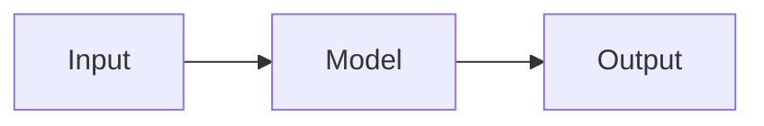

# Smoke test

This is a paragraph with a first-use term %%gradient descent%% and **bold** text.

## Chapter one

Some prose here. A second mention of gradient descent is not wrapped.

```python
def train():
    # %%not_a_dfn%% stays literal in code
    return 1
```

::: takeaway
- First point
- Second point
:::

::: ob-board
What would break if the learning rate were 10x larger?
:::

::: lab Lab 1.1: Tiny experiment
Run this and observe.
:::

::: callout warn
Do not skip the warmup phase.
:::

::: walkthrough
1. Start at the left box.
2. Follow the arrow.
:::

::: provenance
**Last verified: September 2026.** Smoke test only.
:::

::: pq
**Q1.** What is 2+2?
A. 3
B. 4
::: answer
**Answer: B.** Arithmetic.
- **A, wrong:** off by one.
- **B, right:** correct sum.
:::
:::



| Col A | Col B |
|-------|-------|
| 1     | 2     |
